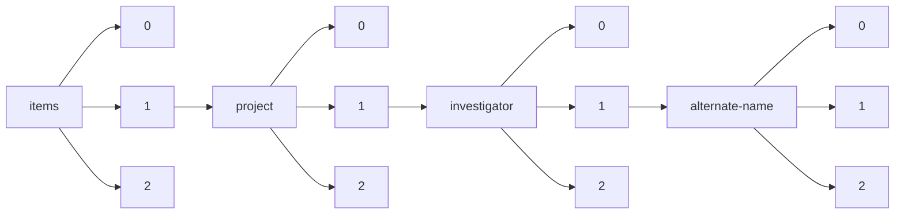

!!! warning "This document is not official Crossref documentation"
# Elements
PATH = items/array/project/array/investigator/array/alternate-name/array(1)  
Occurs 10 times  
Unique values: 10  
{ .annotate }

1. A route to an element, for example:  
   The route "items/array/project/array/investigator/array/alternate-name/array" corresponds to navigating through the JSON indices as  
   ["items"][0]["project"][0]["investigator"][0]["alternate-name"][0]  

| **Row** | **Value** `String` | **Count** `Int64` |
|--------:|----------------------:|---------------------:|
| **1**   | Alexandre Bisson      | 1                    |
| **2**   | Mark Ellisman         | 1                    |
| **3**   | Thijs Ettema          | 1                    |
| **4**   | Sergey Ovchinnikov    | 1                    |
| **5**   | Minh Bui              | 1                    |
| **6**   | Anja Spang            | 1                    |
| **7**   | Roland Hatzenpichler  | 1                    |
| **8**   | Susannah Porter       | 1                    |
| **9**   | Laura Villanueva      | 1                    |
| **10**  | Laura Eme             | 1                    |

