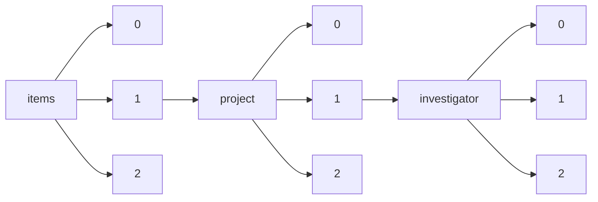

!!! warning "This document is not official Crossref documentation"
# Elements
PATH = items/array/project/array/investigator/array(1)  
Occurs 47 778 times  
{ .annotate }

1. A route to an element, for example:  
   The route "items/array/project/array/investigator/array" corresponds to navigating through the JSON indices as  
   ["items"][0]["project"][0]["investigator"][0]  

## ORCID
See more information: [items/array/project/array/investigator/array/ORCID](ORCID/index.md)  
Occurs 7 970 timess  
Unique values: > 999  

!!! note "Due to current limitations, only the first 1,000 unique values are counted."

| **Row** | **Value** `String`                | **Count** `Int64` |
|--------:|-------------------------------------:|---------------------:|
| **1**   | http://orcid.org/0000-0003-0900-9629 | 15                   |
| **2**   | http://orcid.org/0000-0002-1897-1978 | 15                   |
| **3**   | http://orcid.org/0000-0003-2309-1171 | 14                   |
| **4**   | http://orcid.org/0000-0002-1407-8314 | 13                   |
| **5**   | http://orcid.org/0000-0002-9795-0365 | 12                   |
| **6**   | http://orcid.org/0000-0001-6744-5061 | 12                   |
| **7**   | http://orcid.org/0000-0003-4760-8382 | 12                   |
| **8**   | http://orcid.org/0000-0002-2266-8891 | 11                   |
| **9**   | http://orcid.org/0000-0002-9427-4429 | 11                   |
| **10**  | http://orcid.org/0000-0002-7069-5958 | 11                   |
| ... | ... | ... |

## Affiliation
See more information: [items/array/project/array/investigator/array/affiliation](affiliation/index.md)  
Occurs 47 778 timess  

| **Row** | **Length** `Any` | **Count** `Int64` |
|--------:|--------------------:|---------------------:|
| **1**   | 0                   | 27 286               |
| **2**   | 1                   | 20 492               |

## Alternate-name
See more information: [items/array/project/array/investigator/array/alternate-name](alternate-name/index.md)  
Occurs 10 timess  

| **Row** | **Length** `Any` | **Count** `Int64` |
|--------:|--------------------:|---------------------:|
| **1**   | 1                   | 10                   |

## Authenticated-orcid
See more information: [items/array/project/array/investigator/array/authenticated-orcid](authenticated-orcid/index.md)  
Occurs 7 970 timess  
Unique values: 1  

| **Row** | **Value** `Bool` | **Count** `Int64` |
|--------:|--------------------:|---------------------:|
| **1**   | false               | 7 970                |

## Family
See more information: [items/array/project/array/investigator/array/family](family/index.md)  
Occurs 47 775 timess  
Unique values: > 999  

!!! note "Due to current limitations, only the first 1,000 unique values are counted."

| **Row** | **Value** `String` | **Count** `Int64` |
|--------:|----------------------:|---------------------:|
| **1**   | Wang                  | 580                  |
| **2**   | Zhang                 | 300                  |
| **3**   | Smith                 | 288                  |
| **4**   | Li                    | 241                  |
| **5**   | Liu                   | 239                  |
| **6**   | Chen                  | 221                  |
| **7**   | Lee                   | 182                  |
| **8**   | Brown                 | 160                  |
| **9**   | Kim                   | 152                  |
| **10**  | Yang                  | 152                  |
| ... | ... | ... |

## Given
See more information: [items/array/project/array/investigator/array/given](given/index.md)  
Occurs 44 216 timess  
Unique values: > 999  

!!! note "Due to current limitations, only the first 1,000 unique values are counted."

| **Row** | **Value** `String` | **Count** `Int64` |
|--------:|----------------------:|---------------------:|
| **1**   | David                 | 959                  |
| **2**   | Michael               | 627                  |
| **3**   | John                  | 556                  |
| **4**   | Mark                  | 471                  |
| **5**   | James                 | 468                  |
| **6**   | Paul                  | 449                  |
| **7**   | Thomas                | 413                  |
| **8**   | Richard               | 394                  |
| **9**   | Robert                | 392                  |
| **10**  | Andrew                | 390                  |
| ... | ... | ... |

## Role-start
See more information: [items/array/project/array/investigator/array/role-start](role-start/index.md)  
Occurs 2 timess  

