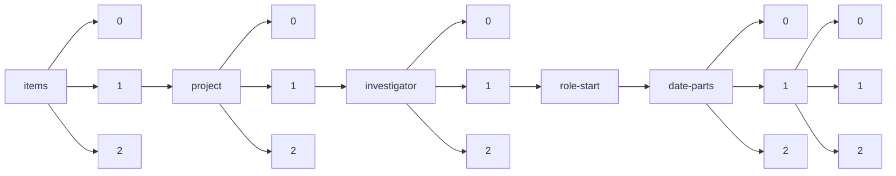

!!! warning "This document is not official Crossref documentation"
# Elements
PATH = items/array/project/array/investigator/array/role-start/date-parts/array/array(1)  
Occurs 6 times  
Unique values: 3  
{ .annotate }

1. A route to an element, for example:  
   The route "items/array/project/array/investigator/array/role-start/date-parts/array/array" corresponds to navigating through the JSON indices as  
   ["items"][0]["project"][0]["investigator"][0]["role-start"]["date-parts"][0][0]  

| **Row** | **Value** `Int64` | **Count** `Int64` |
|--------:|---------------------:|---------------------:|
| **1**   | 2 020                | 2                    |
| **2**   | 8                    | 2                    |
| **3**   | 3                    | 2                    |

