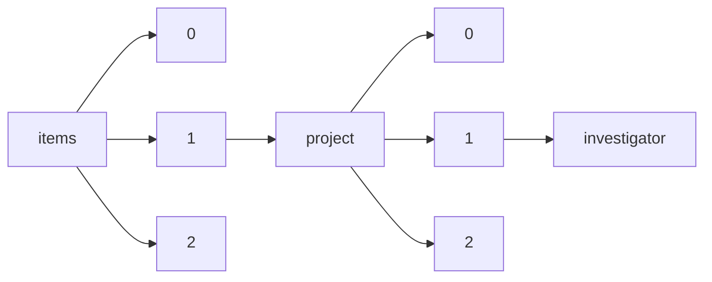

!!! warning "This document is not official Crossref documentation"
# Investigator
PATH = items/array/project/array/investigator(1)  
Occurs 20 975 times  
{ .annotate }

1. A route to an element, for example:  
   The route "items/array/project/array/investigator" corresponds to navigating through the JSON indices as  
   ["items"][0]["project"][0]["investigator"]  

## Properties of Array
See information about elements: [items/array/project/array/investigator/array](array/index.md)  
Distribution of lengths:  

| **Row** | **Length** `Any` | **Count** `Int64` |
|--------:|--------------------:|---------------------:|
| **1**   | 1                   | 14 793               |
| **2**   | 2                   | 1 751                |
| **3**   | 3                   | 1 178                |
| **4**   | 4                   | 796                  |
| **5**   | 5                   | 565                  |
| **6**   | 6                   | 444                  |
| **7**   | 7                   | 339                  |
| **8**   | 8                   | 232                  |
| **9**   | 9                   | 211                  |
| **10**  | 10                  | 135                  |
| ... | ... | ... |

