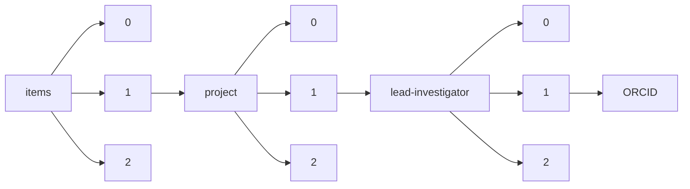

!!! warning "This document is not official Crossref documentation"
# ORCID
PATH = items/array/project/array/lead-investigator/array/ORCID(1)  
Occurs 3 545 times  
Unique values: > 999  
{ .annotate }

1. A route to an element, for example:  
   The route "items/array/project/array/lead-investigator/array/ORCID" corresponds to navigating through the JSON indices as  
   ["items"][0]["project"][0]["lead-investigator"][0]["ORCID"]  

!!! note "Due to current limitations, only the first 1,000 unique values are counted."

| **Row** | **Value** `String`                | **Count** `Int64` |
|--------:|-------------------------------------:|---------------------:|
| **1**   | http://orcid.org/0000-0003-0309-9184 | 8                    |
| **2**   | http://orcid.org/0000-0003-3618-0843 | 7                    |
| **3**   | http://orcid.org/0000-0002-4011-3590 | 7                    |
| **4**   | http://orcid.org/0000-0002-3200-7173 | 7                    |
| **5**   | http://orcid.org/0000-0002-9822-1586 | 7                    |
| **6**   | http://orcid.org/0000-0001-7680-2200 | 5                    |
| **7**   | http://orcid.org/0000-0003-2199-4449 | 4                    |
| **8**   | http://orcid.org/0000-0003-4313-3500 | 4                    |
| **9**   | http://orcid.org/0000-0002-9879-5758 | 4                    |
| **10**  | http://orcid.org/0000-0002-9070-8349 | 4                    |
| **11**  | http://orcid.org/0000-0003-4305-5258 | 4                    |
| **12**  | http://orcid.org/0000-0003-4402-5552 | 4                    |
| **13**  | http://orcid.org/0000-0002-0908-1981 | 4                    |
| **14**  | http://orcid.org/0000-0001-6342-6461 | 4                    |
| **15**  | http://orcid.org/0000-0002-3426-4210 | 4                    |
| **16**  | http://orcid.org/0000-0003-2895-9857 | 4                    |
| **17**  | http://orcid.org/0000-0001-9529-6550 | 4                    |
| **18**  | http://orcid.org/0000-0003-1379-7146 | 4                    |
| **19**  | http://orcid.org/0000-0003-0708-2726 | 4                    |
| **20**  | http://orcid.org/0000-0002-5393-2827 | 3                    |
| **21**  | http://orcid.org/0000-0002-8133-5325 | 3                    |
| **22**  | http://orcid.org/0000-0002-4134-9730 | 3                    |
| **23**  | http://orcid.org/0000-0003-1093-5478 | 3                    |
| **24**  | http://orcid.org/0000-0002-6294-6366 | 3                    |
| **25**  | http://orcid.org/0000-0001-7094-8188 | 3                    |
| **26**  | http://orcid.org/0000-0002-6065-8491 | 3                    |
| **27**  | http://orcid.org/0000-0001-9842-5573 | 3                    |
| **28**  | http://orcid.org/0000-0001-7039-1332 | 3                    |
| **29**  | http://orcid.org/0000-0001-9159-0031 | 3                    |
| **30**  | http://orcid.org/0000-0002-3704-386X | 3                    |
| **31**  | http://orcid.org/0000-0002-8947-408X | 3                    |
| **32**  | http://orcid.org/0000-0002-6113-2109 | 3                    |
| **33**  | http://orcid.org/0000-0003-1017-2618 | 3                    |
| **34**  | http://orcid.org/0000-0002-1643-8694 | 3                    |
| **35**  | http://orcid.org/0000-0002-8546-9646 | 3                    |
| **36**  | http://orcid.org/0000-0002-6170-1033 | 3                    |
| **37**  | http://orcid.org/0000-0002-9130-1006 | 3                    |
| **38**  | http://orcid.org/0000-0001-9383-1054 | 3                    |
| **39**  | http://orcid.org/0000-0002-3984-4169 | 3                    |
| **40**  | http://orcid.org/0000-0003-2861-949X | 3                    |
| **41**  | http://orcid.org/0000-0003-3573-3565 | 3                    |
| **42**  | http://orcid.org/0000-0001-8881-6781 | 3                    |
| **43**  | http://orcid.org/0000-0002-1611-6935 | 3                    |
| **44**  | http://orcid.org/0000-0001-6440-3376 | 3                    |
| **45**  | http://orcid.org/0000-0001-7614-0403 | 3                    |
| **46**  | http://orcid.org/0000-0002-0031-8276 | 3                    |
| **47**  | http://orcid.org/0000-0002-0358-3278 | 3                    |
| **48**  | http://orcid.org/0000-0001-6777-5298 | 3                    |
| **49**  | http://orcid.org/0000-0003-4870-0850 | 3                    |
| **50**  | http://orcid.org/0000-0001-7829-5505 | 3                    |
| **51**  | http://orcid.org/0000-0003-3447-3570 | 3                    |
| **52**  | http://orcid.org/0000-0002-6999-5507 | 3                    |
| **53**  | http://orcid.org/0000-0001-7848-4912 | 3                    |
| **54**  | http://orcid.org/0000-0002-2924-0038 | 3                    |
| **55**  | http://orcid.org/0000-0002-2158-7723 | 3                    |
| **56**  | http://orcid.org/0000-0002-2673-8957 | 3                    |
| **57**  | http://orcid.org/0000-0002-3631-8745 | 3                    |
| **58**  | http://orcid.org/0000-0002-1762-160X | 3                    |
| **59**  | http://orcid.org/0000-0001-6744-5061 | 3                    |
| **60**  | http://orcid.org/0000-0001-7113-9024 | 3                    |
| **61**  | http://orcid.org/0000-0001-9853-5457 | 3                    |
| **62**  | http://orcid.org/0000-0001-5145-9004 | 3                    |
| **63**  | http://orcid.org/0000-0002-5143-2562 | 3                    |
| **64**  | http://orcid.org/0000-0002-8796-4755 | 3                    |
| **65**  | http://orcid.org/0000-0001-7432-2270 | 3                    |
| **66**  | http://orcid.org/0000-0003-0573-6917 | 3                    |
| **67**  | http://orcid.org/0000-0001-8366-3245 | 3                    |
| **68**  | http://orcid.org/0000-0003-2001-8470 | 3                    |
| **69**  | http://orcid.org/0000-0002-7116-0605 | 3                    |
| **70**  | http://orcid.org/0000-0002-3071-2338 | 2                    |
| **71**  | http://orcid.org/0000-0003-4496-2984 | 2                    |
| **72**  | http://orcid.org/0000-0001-5180-7179 | 2                    |
| **73**  | http://orcid.org/0000-0002-7592-0085 | 2                    |
| **74**  | http://orcid.org/0000-0003-1650-3238 | 2                    |
| **75**  | http://orcid.org/0000-0003-2894-2772 | 2                    |
| **76**  | http://orcid.org/0000-0002-2350-9809 | 2                    |
| **77**  | http://orcid.org/0000-0003-1308-5755 | 2                    |
| **78**  | http://orcid.org/0000-0002-7081-6748 | 2                    |
| **79**  | http://orcid.org/0000-0002-7054-4711 | 2                    |
| **80**  | http://orcid.org/0000-0003-0764-5947 | 2                    |
| **81**  | http://orcid.org/0000-0002-6360-6793 | 2                    |
| **82**  | http://orcid.org/0000-0002-9736-2109 | 2                    |
| **83**  | http://orcid.org/0000-0003-1062-3538 | 2                    |
| **84**  | http://orcid.org/0000-0001-8571-4376 | 2                    |
| **85**  | http://orcid.org/0000-0001-5626-2251 | 2                    |
| **86**  | http://orcid.org/0000-0002-8746-5307 | 2                    |
| **87**  | http://orcid.org/0000-0002-6632-6797 | 2                    |
| **88**  | http://orcid.org/0000-0002-1884-5445 | 2                    |
| **89**  | http://orcid.org/0000-0003-3051-1330 | 2                    |
| **90**  | http://orcid.org/0000-0002-3656-564X | 2                    |
| **91**  | http://orcid.org/0000-0001-6752-4982 | 2                    |
| **92**  | http://orcid.org/0000-0001-8807-153X | 2                    |
| **93**  | http://orcid.org/0000-0003-1759-5218 | 2                    |
| **94**  | http://orcid.org/0000-0002-1013-7815 | 2                    |
| **95**  | http://orcid.org/0000-0002-8682-6844 | 2                    |
| **96**  | http://orcid.org/0000-0002-6326-640X | 2                    |
| **97**  | http://orcid.org/0000-0002-4350-5354 | 2                    |
| **98**  | http://orcid.org/0000-0001-9475-5436 | 2                    |
| **99**  | http://orcid.org/0000-0001-6302-5705 | 2                    |
| **100** | http://orcid.org/0000-0002-4514-5575 | 2                    |
| **101** | http://orcid.org/0000-0001-5585-698X | 2                    |
| **102** | http://orcid.org/0000-0002-7857-7032 | 2                    |
| **103** | http://orcid.org/0000-0003-4943-9762 | 2                    |
| **104** | http://orcid.org/0000-0001-6992-6870 | 2                    |
| **105** | http://orcid.org/0000-0002-6435-7266 | 2                    |
| **106** | http://orcid.org/0000-0002-4450-576X | 2                    |
| **107** | http://orcid.org/0000-0001-5108-2227 | 2                    |
| **108** | http://orcid.org/0000-0001-5582-3301 | 2                    |
| **109** | http://orcid.org/0000-0002-9370-3420 | 2                    |
| **110** | http://orcid.org/0000-0002-2387-2886 | 2                    |
| **111** | http://orcid.org/0000-0002-4432-8505 | 2                    |
| **112** | http://orcid.org/0000-0002-9814-092X | 2                    |
| **113** | http://orcid.org/0000-0003-0321-7128 | 2                    |
| **114** | http://orcid.org/0000-0001-5986-5015 | 2                    |
| **115** | http://orcid.org/0000-0002-7492-851X | 2                    |
| **116** | http://orcid.org/0000-0001-6214-8623 | 2                    |
| **117** | http://orcid.org/0000-0003-4660-593X | 2                    |
| **118** | http://orcid.org/0000-0003-3124-5169 | 2                    |
| **119** | http://orcid.org/0000-0001-8035-5888 | 2                    |
| **120** | http://orcid.org/0000-0002-2678-1832 | 2                    |
| **121** | http://orcid.org/0000-0003-2324-2881 | 2                    |
| **122** | http://orcid.org/0000-0002-5748-083X | 2                    |
| **123** | http://orcid.org/0000-0002-3340-9828 | 2                    |
| **124** | http://orcid.org/0000-0002-8298-8264 | 2                    |
| **125** | http://orcid.org/0000-0003-1719-0771 | 2                    |
| **126** | http://orcid.org/0000-0001-7798-793X | 2                    |
| **127** | http://orcid.org/0000-0002-0876-6292 | 2                    |
| **128** | http://orcid.org/0000-0001-5363-3053 | 2                    |
| **129** | http://orcid.org/0000-0002-3107-4534 | 2                    |
| **130** | http://orcid.org/0000-0001-5677-1806 | 2                    |
| **131** | http://orcid.org/0000-0002-3974-2963 | 2                    |
| **132** | http://orcid.org/0000-0002-2654-8854 | 2                    |
| **133** | http://orcid.org/0000-0002-9821-1003 | 2                    |
| **134** | http://orcid.org/0000-0002-1513-4330 | 2                    |
| **135** | http://orcid.org/0000-0002-5202-8895 | 2                    |
| **136** | http://orcid.org/0000-0002-2006-3856 | 2                    |
| **137** | http://orcid.org/0000-0002-1022-9330 | 2                    |
| **138** | http://orcid.org/0000-0002-4056-2695 | 2                    |
| **139** | http://orcid.org/0000-0001-8485-0026 | 2                    |
| **140** | http://orcid.org/0000-0003-3683-8297 | 2                    |
| **141** | http://orcid.org/0000-0003-2548-4294 | 2                    |
| **142** | http://orcid.org/0000-0002-6140-9489 | 2                    |
| **143** | http://orcid.org/0000-0001-6535-6911 | 2                    |
| **144** | http://orcid.org/0000-0002-0932-1519 | 2                    |
| **145** | http://orcid.org/0000-0002-5664-7781 | 2                    |
| **146** | http://orcid.org/0000-0001-8346-6671 | 2                    |
| **147** | http://orcid.org/0000-0003-0790-5315 | 2                    |
| **148** | http://orcid.org/0000-0002-9884-0627 | 2                    |
| **149** | http://orcid.org/0000-0002-3689-737X | 2                    |
| **150** | http://orcid.org/0000-0002-7202-2431 | 2                    |
| **151** | http://orcid.org/0000-0002-3127-5045 | 2                    |
| **152** | http://orcid.org/0000-0002-4857-1238 | 2                    |
| **153** | http://orcid.org/0000-0002-2870-1955 | 2                    |
| **154** | http://orcid.org/0000-0003-2867-3840 | 2                    |
| **155** | http://orcid.org/0000-0001-5150-6624 | 2                    |
| **156** | http://orcid.org/0000-0002-8439-5964 | 2                    |
| **157** | http://orcid.org/0000-0002-2034-9969 | 2                    |
| **158** | http://orcid.org/0000-0002-3036-2833 | 2                    |
| **159** | http://orcid.org/0000-0001-8460-6971 | 2                    |
| **160** | http://orcid.org/0000-0002-2273-4094 | 2                    |
| **161** | http://orcid.org/0000-0002-2858-2087 | 2                    |
| **162** | http://orcid.org/0000-0002-2119-3345 | 2                    |
| **163** | http://orcid.org/0000-0002-9427-4429 | 2                    |
| **164** | http://orcid.org/0000-0003-4850-2360 | 2                    |
| **165** | http://orcid.org/0000-0002-1272-9320 | 2                    |
| **166** | http://orcid.org/0000-0001-5850-6715 | 2                    |
| **167** | http://orcid.org/0000-0001-8780-6637 | 2                    |
| **168** | http://orcid.org/0000-0002-0808-1875 | 2                    |
| **169** | http://orcid.org/0000-0001-6562-0225 | 2                    |
| **170** | http://orcid.org/0000-0002-7357-0819 | 2                    |
| **171** | http://orcid.org/0000-0002-9219-0387 | 2                    |
| **172** | http://orcid.org/0000-0002-5534-1924 | 2                    |
| **173** | http://orcid.org/0000-0002-7304-8879 | 2                    |
| **174** | http://orcid.org/0000-0002-5238-1314 | 2                    |
| **175** | http://orcid.org/0000-0002-2062-3964 | 2                    |
| **176** | http://orcid.org/0000-0003-0048-1177 | 2                    |
| **177** | http://orcid.org/0000-0002-6007-0698 | 2                    |
| **178** | http://orcid.org/0000-0003-2740-8148 | 2                    |
| **179** | http://orcid.org/0000-0003-3784-5093 | 2                    |
| **180** | http://orcid.org/0000-0002-4533-3816 | 2                    |
| **181** | http://orcid.org/0000-0002-0007-4910 | 2                    |
| **182** | http://orcid.org/0000-0002-8459-5472 | 2                    |
| **183** | http://orcid.org/0000-0002-8980-4878 | 2                    |
| **184** | http://orcid.org/0000-0002-3640-5275 | 2                    |
| **185** | http://orcid.org/0000-0002-8077-2101 | 2                    |
| **186** | http://orcid.org/0000-0001-6419-9459 | 2                    |
| **187** | http://orcid.org/0000-0002-7042-2327 | 2                    |
| **188** | http://orcid.org/0000-0003-4977-4683 | 2                    |
| **189** | http://orcid.org/0000-0002-3032-5434 | 2                    |
| **190** | http://orcid.org/0000-0001-8288-8602 | 2                    |
| **191** | http://orcid.org/0000-0003-4760-8382 | 2                    |
| **192** | http://orcid.org/0000-0002-3877-7769 | 2                    |
| **193** | http://orcid.org/0000-0002-4018-9480 | 2                    |
| **194** | http://orcid.org/0000-0002-5573-1308 | 2                    |
| **195** | http://orcid.org/0000-0002-4333-8496 | 2                    |
| **196** | http://orcid.org/0000-0001-9441-7832 | 2                    |
| **197** | http://orcid.org/0000-0001-9633-1100 | 2                    |
| **198** | http://orcid.org/0000-0002-3596-9407 | 2                    |
| **199** | http://orcid.org/0000-0001-7788-1852 | 2                    |
| **200** | http://orcid.org/0000-0001-9637-2164 | 2                    |
| **201** | http://orcid.org/0000-0002-1897-1978 | 2                    |
| **202** | http://orcid.org/0000-0002-5240-2592 | 2                    |
| **203** | http://orcid.org/0000-0002-4188-6106 | 2                    |
| **204** | http://orcid.org/0000-0001-6049-3968 | 2                    |
| **205** | http://orcid.org/0000-0002-5694-5340 | 2                    |
| **206** | http://orcid.org/0000-0002-2198-1958 | 2                    |
| **207** | http://orcid.org/0000-0001-8874-8862 | 2                    |
| **208** | http://orcid.org/0000-0002-8503-8459 | 2                    |
| **209** | http://orcid.org/0000-0002-0046-1363 | 2                    |
| **210** | http://orcid.org/0000-0002-9839-5279 | 2                    |
| **211** | http://orcid.org/0000-0002-9058-4331 | 2                    |
| **212** | http://orcid.org/0000-0002-8077-7092 | 2                    |
| **213** | http://orcid.org/0000-0002-1373-0681 | 2                    |
| **214** | http://orcid.org/0000-0002-5621-3799 | 2                    |
| **215** | http://orcid.org/0000-0001-8701-6387 | 2                    |
| **216** | http://orcid.org/0000-0003-2640-6925 | 2                    |
| **217** | http://orcid.org/0000-0001-7026-5766 | 2                    |
| **218** | http://orcid.org/0000-0003-3893-360X | 2                    |
| **219** | http://orcid.org/0000-0003-2174-5127 | 2                    |
| **220** | http://orcid.org/0000-0002-2315-3507 | 2                    |
| **221** | http://orcid.org/0000-0002-1407-8314 | 2                    |
| **222** | http://orcid.org/0000-0001-7905-8755 | 1                    |
| **223** | http://orcid.org/0000-0002-6800-162X | 1                    |
| **224** | http://orcid.org/0000-0001-5087-2243 | 1                    |
| **225** | http://orcid.org/0000-0003-3055-1105 | 1                    |
| **226** | http://orcid.org/0000-0002-9541-9554 | 1                    |
| **227** | http://orcid.org/0000-0002-7238-0191 | 1                    |
| **228** | http://orcid.org/0000-0003-1168-6768 | 1                    |
| **229** | http://orcid.org/0000-0001-5836-0250 | 1                    |
| **230** | http://orcid.org/0000-0001-7951-1900 | 1                    |
| **231** | http://orcid.org/0000-0002-3972-0860 | 1                    |
| **232** | http://orcid.org/0000-0001-6400-0227 | 1                    |
| **233** | http://orcid.org/0000-0002-7053-8987 | 1                    |
| **234** | http://orcid.org/0000-0001-5903-203X | 1                    |
| **235** | http://orcid.org/0000-0001-6461-0519 | 1                    |
| **236** | http://orcid.org/0000-0002-1499-6908 | 1                    |
| **237** | http://orcid.org/0000-0002-5039-260X | 1                    |
| **238** | http://orcid.org/0000-0003-2446-1883 | 1                    |
| **239** | http://orcid.org/0000-0002-1153-4089 | 1                    |
| **240** | http://orcid.org/0000-0002-0103-0151 | 1                    |
| **241** | http://orcid.org/0000-0001-7407-9792 | 1                    |
| **242** | http://orcid.org/0000-0002-8142-8708 | 1                    |
| **243** | http://orcid.org/0000-0001-9545-9401 | 1                    |
| **244** | http://orcid.org/0000-0002-9825-4441 | 1                    |
| **245** | http://orcid.org/0000-0002-4938-1620 | 1                    |
| **246** | http://orcid.org/0000-0001-8530-0464 | 1                    |
| **247** | http://orcid.org/0000-0002-8770-3264 | 1                    |
| **248** | http://orcid.org/0000-0002-6859-6264 | 1                    |
| **249** | http://orcid.org/0000-0003-2673-2325 | 1                    |
| **250** | http://orcid.org/0000-0001-5883-5383 | 1                    |
| **251** | http://orcid.org/0000-0002-2563-2042 | 1                    |
| **252** | http://orcid.org/0000-0003-4230-0207 | 1                    |
| **253** | http://orcid.org/0000-0003-2350-9339 | 1                    |
| **254** | http://orcid.org/0000-0001-7747-6523 | 1                    |
| **255** | http://orcid.org/0000-0002-4016-5139 | 1                    |
| **256** | http://orcid.org/0000-0003-0412-7001 | 1                    |
| **257** | http://orcid.org/0000-0002-8130-7252 | 1                    |
| **258** | http://orcid.org/0000-0002-1457-4019 | 1                    |
| **259** | http://orcid.org/0000-0002-3918-6928 | 1                    |
| **260** | http://orcid.org/0000-0003-2140-5798 | 1                    |
| **261** | http://orcid.org/0000-0001-8155-4926 | 1                    |
| **262** | http://orcid.org/0000-0002-1035-4924 | 1                    |
| **263** | http://orcid.org/0000-0001-8202-5428 | 1                    |
| **264** | http://orcid.org/0000-0002-5595-3269 | 1                    |
| **265** | http://orcid.org/0000-0001-5354-1933 | 1                    |
| **266** | http://orcid.org/0000-0001-6918-5574 | 1                    |
| **267** | http://orcid.org/0000-0001-8344-654X | 1                    |
| **268** | http://orcid.org/0000-0001-8509-1500 | 1                    |
| **269** | http://orcid.org/0000-0002-2781-6478 | 1                    |
| **270** | http://orcid.org/0000-0003-1287-4090 | 1                    |
| **271** | http://orcid.org/0000-0002-4782-5718 | 1                    |
| **272** | http://orcid.org/0000-0001-5218-1497 | 1                    |
| **273** | http://orcid.org/0000-0001-8350-2142 | 1                    |
| **274** | http://orcid.org/0000-0003-0580-4350 | 1                    |
| **275** | http://orcid.org/0000-0002-0053-4200 | 1                    |
| **276** | http://orcid.org/0000-0001-5421-8222 | 1                    |
| **277** | http://orcid.org/0000-0001-5369-4446 | 1                    |
| **278** | http://orcid.org/0000-0003-2437-7761 | 1                    |
| **279** | http://orcid.org/0000-0002-9908-2442 | 1                    |
| **280** | http://orcid.org/0000-0003-0550-0410 | 1                    |
| **281** | http://orcid.org/0000-0002-4348-1196 | 1                    |
| **282** | http://orcid.org/0000-0002-9937-5050 | 1                    |
| **283** | http://orcid.org/0000-0001-7624-2063 | 1                    |
| **284** | http://orcid.org/0000-0003-2995-330X | 1                    |
| **285** | http://orcid.org/0000-0002-4186-7570 | 1                    |
| **286** | http://orcid.org/0000-0002-6825-3499 | 1                    |
| **287** | http://orcid.org/0000-0002-1609-9004 | 1                    |
| **288** | http://orcid.org/0000-0003-2104-2093 | 1                    |
| **289** | http://orcid.org/0000-0002-9570-7759 | 1                    |
| **290** | http://orcid.org/0000-0002-4607-7439 | 1                    |
| **291** | http://orcid.org/0000-0002-1042-6350 | 1                    |
| **292** | http://orcid.org/0000-0001-7005-3966 | 1                    |
| **293** | http://orcid.org/0000-0003-4244-2854 | 1                    |
| **294** | http://orcid.org/0000-0003-4136-3070 | 1                    |
| **295** | http://orcid.org/0000-0003-2748-743X | 1                    |
| **296** | http://orcid.org/0000-0002-6990-3537 | 1                    |
| **297** | http://orcid.org/0000-0002-2669-6478 | 1                    |
| **298** | http://orcid.org/0000-0002-5238-6852 | 1                    |
| **299** | http://orcid.org/0000-0002-0777-3087 | 1                    |
| **300** | http://orcid.org/0000-0002-8873-7239 | 1                    |
| **301** | http://orcid.org/0000-0002-2782-7169 | 1                    |
| **302** | http://orcid.org/0000-0003-2002-6681 | 1                    |
| **303** | http://orcid.org/0000-0003-0874-3207 | 1                    |
| **304** | http://orcid.org/0000-0002-1251-0978 | 1                    |
| **305** | http://orcid.org/0000-0001-7525-3350 | 1                    |
| **306** | http://orcid.org/0000-0002-7680-9135 | 1                    |
| **307** | http://orcid.org/0000-0002-6028-6456 | 1                    |
| **308** | http://orcid.org/0000-0001-8053-7286 | 1                    |
| **309** | http://orcid.org/0000-0002-9894-4549 | 1                    |
| **310** | http://orcid.org/0000-0002-4070-1317 | 1                    |
| **311** | http://orcid.org/0000-0003-1478-2018 | 1                    |
| **312** | http://orcid.org/0000-0001-5405-8724 | 1                    |
| **313** | http://orcid.org/0000-0002-7100-4581 | 1                    |
| **314** | http://orcid.org/0000-0003-2176-9161 | 1                    |
| **315** | http://orcid.org/0000-0003-2379-6702 | 1                    |
| **316** | http://orcid.org/0000-0002-7836-8417 | 1                    |
| **317** | http://orcid.org/0000-0002-0629-0884 | 1                    |
| **318** | http://orcid.org/0000-0002-4102-8566 | 1                    |
| **319** | http://orcid.org/0000-0002-8138-4549 | 1                    |
| **320** | http://orcid.org/0000-0001-9225-3678 | 1                    |
| **321** | http://orcid.org/0000-0002-6534-4774 | 1                    |
| **322** | http://orcid.org/0000-0003-2173-7063 | 1                    |
| **323** | http://orcid.org/0000-0002-7191-0621 | 1                    |
| **324** | http://orcid.org/0000-0002-8615-8532 | 1                    |
| **325** | http://orcid.org/0000-0001-8307-0079 | 1                    |
| **326** | http://orcid.org/0000-0002-4797-908X | 1                    |
| **327** | http://orcid.org/0000-0002-8776-0605 | 1                    |
| **328** | http://orcid.org/0000-0003-0848-6044 | 1                    |
| **329** | http://orcid.org/0000-0003-3454-0710 | 1                    |
| **330** | http://orcid.org/0000-0001-7509-0512 | 1                    |
| **331** | http://orcid.org/0000-0003-4851-6658 | 1                    |
| **332** | http://orcid.org/0000-0002-1054-9983 | 1                    |
| **333** | http://orcid.org/0000-0002-9519-5642 | 1                    |
| **334** | http://orcid.org/0000-0002-8614-2848 | 1                    |
| **335** | http://orcid.org/0000-0003-1049-1176 | 1                    |
| **336** | http://orcid.org/0000-0002-5518-9360 | 1                    |
| **337** | http://orcid.org/0000-0002-8931-7279 | 1                    |
| **338** | http://orcid.org/0000-0002-0342-8251 | 1                    |
| **339** | http://orcid.org/0000-0003-2025-7324 | 1                    |
| **340** | http://orcid.org/0000-0001-6978-8092 | 1                    |
| **341** | http://orcid.org/0000-0001-5274-6072 | 1                    |
| **342** | http://orcid.org/0000-0003-1926-5458 | 1                    |
| **343** | http://orcid.org/0000-0002-1353-1092 | 1                    |
| **344** | http://orcid.org/0000-0003-4314-2570 | 1                    |
| **345** | http://orcid.org/0000-0001-5506-7278 | 1                    |
| **346** | http://orcid.org/0000-0002-2566-6867 | 1                    |
| **347** | http://orcid.org/0000-0002-9531-8884 | 1                    |
| **348** | http://orcid.org/0000-0001-8524-2989 | 1                    |
| **349** | http://orcid.org/0000-0003-4306-260X | 1                    |
| **350** | http://orcid.org/0000-0001-8781-1268 | 1                    |
| **351** | http://orcid.org/0000-0001-8607-5748 | 1                    |
| **352** | http://orcid.org/0000-0003-4902-5797 | 1                    |
| **353** | http://orcid.org/0000-0003-3223-6440 | 1                    |
| **354** | http://orcid.org/0000-0002-6918-3453 | 1                    |
| **355** | http://orcid.org/0000-0002-6281-9463 | 1                    |
| **356** | http://orcid.org/0000-0002-7599-9301 | 1                    |
| **357** | http://orcid.org/0000-0002-6326-8739 | 1                    |
| **358** | http://orcid.org/0000-0003-2808-4210 | 1                    |
| **359** | http://orcid.org/0000-0001-7848-1295 | 1                    |
| **360** | http://orcid.org/0000-0003-1396-4821 | 1                    |
| **361** | http://orcid.org/0000-0002-5676-9279 | 1                    |
| **362** | http://orcid.org/0000-0001-7527-2340 | 1                    |
| **363** | http://orcid.org/0000-0001-7805-2503 | 1                    |
| **364** | http://orcid.org/0000-0003-1502-5676 | 1                    |
| **365** | http://orcid.org/0000-0003-3215-1607 | 1                    |
| **366** | http://orcid.org/0000-0002-3245-2218 | 1                    |
| **367** | http://orcid.org/0000-0002-2494-1644 | 1                    |
| **368** | http://orcid.org/0000-0003-3715-2561 | 1                    |
| **369** | http://orcid.org/0000-0002-9088-1651 | 1                    |
| **370** | http://orcid.org/0000-0002-5526-4578 | 1                    |
| **371** | http://orcid.org/0000-0002-6164-2854 | 1                    |
| **372** | http://orcid.org/0000-0001-7062-6322 | 1                    |
| **373** | http://orcid.org/0000-0003-0939-0140 | 1                    |
| **374** | http://orcid.org/0000-0001-8084-8324 | 1                    |
| **375** | http://orcid.org/0000-0002-4220-5034 | 1                    |
| **376** | http://orcid.org/0000-0003-2232-6004 | 1                    |
| **377** | http://orcid.org/0000-0002-4201-4879 | 1                    |
| **378** | http://orcid.org/0000-0002-2704-9571 | 1                    |
| **379** | http://orcid.org/0000-0001-5612-5687 | 1                    |
| **380** | http://orcid.org/0000-0002-1094-2427 | 1                    |
| **381** | http://orcid.org/0000-0003-1545-418X | 1                    |
| **382** | http://orcid.org/0000-0002-0220-4395 | 1                    |
| **383** | http://orcid.org/0000-0001-5088-6012 | 1                    |
| **384** | http://orcid.org/0000-0002-0276-6486 | 1                    |
| **385** | http://orcid.org/0000-0002-0035-9430 | 1                    |
| **386** | http://orcid.org/0000-0002-3936-5491 | 1                    |
| **387** | http://orcid.org/0000-0002-0892-2224 | 1                    |
| **388** | http://orcid.org/0000-0003-3444-3881 | 1                    |
| **389** | http://orcid.org/0000-0001-9974-9684 | 1                    |
| **390** | http://orcid.org/0000-0002-1415-3134 | 1                    |
| **391** | http://orcid.org/0000-0003-4607-7356 | 1                    |
| **392** | http://orcid.org/0000-0002-8542-7489 | 1                    |
| **393** | http://orcid.org/0000-0002-6654-7346 | 1                    |
| **394** | http://orcid.org/0000-0001-6356-0003 | 1                    |
| **395** | http://orcid.org/0000-0002-4106-9229 | 1                    |
| **396** | http://orcid.org/0000-0002-6402-1447 | 1                    |
| **397** | http://orcid.org/0000-0002-0352-3785 | 1                    |
| **398** | http://orcid.org/0000-0002-7631-8352 | 1                    |
| **399** | http://orcid.org/0000-0002-3656-7514 | 1                    |
| **400** | http://orcid.org/0000-0003-3605-9701 | 1                    |
| **401** | http://orcid.org/0000-0003-3413-1159 | 1                    |
| **402** | http://orcid.org/0000-0001-7485-4509 | 1                    |
| **403** | http://orcid.org/0000-0001-6642-5448 | 1                    |
| **404** | http://orcid.org/0000-0003-0324-4222 | 1                    |
| **405** | http://orcid.org/0000-0001-8840-6969 | 1                    |
| **406** | http://orcid.org/0000-0003-2996-1908 | 1                    |
| **407** | http://orcid.org/0000-0003-0505-086X | 1                    |
| **408** | http://orcid.org/0000-0002-9205-385X | 1                    |
| **409** | http://orcid.org/0000-0003-0575-5050 | 1                    |
| **410** | http://orcid.org/0000-0002-3200-1302 | 1                    |
| **411** | http://orcid.org/0000-0003-1125-4260 | 1                    |
| **412** | http://orcid.org/0000-0002-3432-579X | 1                    |
| **413** | http://orcid.org/0000-0001-9808-9661 | 1                    |
| **414** | http://orcid.org/0000-0002-3911-3374 | 1                    |
| **415** | http://orcid.org/0000-0002-6418-2849 | 1                    |
| **416** | http://orcid.org/0000-0001-8354-6006 | 1                    |
| **417** | http://orcid.org/0000-0001-9799-0298 | 1                    |
| **418** | http://orcid.org/0000-0001-5981-762X | 1                    |
| **419** | http://orcid.org/0000-0003-1838-2222 | 1                    |
| **420** | http://orcid.org/0000-0002-2776-5850 | 1                    |
| **421** | http://orcid.org/0000-0001-9017-3367 | 1                    |
| **422** | http://orcid.org/0000-0001-7599-5020 | 1                    |
| **423** | http://orcid.org/0000-0001-6691-580X | 1                    |
| **424** | http://orcid.org/0000-0001-9460-5761 | 1                    |
| **425** | http://orcid.org/0000-0002-7160-6128 | 1                    |
| **426** | http://orcid.org/0000-0002-9831-8812 | 1                    |
| **427** | http://orcid.org/0000-0002-6248-2143 | 1                    |
| **428** | http://orcid.org/0000-0002-2235-3945 | 1                    |
| **429** | http://orcid.org/0000-0001-9439-1206 | 1                    |
| **430** | http://orcid.org/0000-0002-9738-5490 | 1                    |
| **431** | http://orcid.org/0000-0002-1157-4574 | 1                    |
| **432** | http://orcid.org/0000-0001-6145-7942 | 1                    |
| **433** | http://orcid.org/0000-0002-5964-0382 | 1                    |
| **434** | http://orcid.org/0000-0002-6982-4660 | 1                    |
| **435** | http://orcid.org/0000-0002-2646-9726 | 1                    |
| **436** | http://orcid.org/0000-0001-9506-9315 | 1                    |
| **437** | http://orcid.org/0000-0002-9211-1722 | 1                    |
| **438** | http://orcid.org/0000-0003-4307-9161 | 1                    |
| **439** | http://orcid.org/0000-0002-8557-5940 | 1                    |
| **440** | http://orcid.org/0000-0002-6557-3737 | 1                    |
| **441** | http://orcid.org/0000-0002-8999-718X | 1                    |
| **442** | http://orcid.org/0000-0003-2097-979X | 1                    |
| **443** | http://orcid.org/0000-0002-9426-2807 | 1                    |
| **444** | http://orcid.org/0000-0001-9636-2222 | 1                    |
| **445** | http://orcid.org/0000-0001-7626-6399 | 1                    |
| **446** | http://orcid.org/0000-0002-2894-7218 | 1                    |
| **447** | http://orcid.org/0000-0001-9341-3717 | 1                    |
| **448** | http://orcid.org/0000-0002-4863-0330 | 1                    |
| **449** | http://orcid.org/0000-0002-2135-7549 | 1                    |
| **450** | http://orcid.org/0000-0001-8817-327X | 1                    |
| **451** | http://orcid.org/0000-0003-1233-668X | 1                    |
| **452** | http://orcid.org/0000-0001-9752-7287 | 1                    |
| **453** | http://orcid.org/0000-0002-4823-9702 | 1                    |
| **454** | http://orcid.org/0000-0003-1321-8714 | 1                    |
| **455** | http://orcid.org/0000-0001-6951-2336 | 1                    |
| **456** | http://orcid.org/0000-0002-7147-7266 | 1                    |
| **457** | http://orcid.org/0000-0001-7482-8722 | 1                    |
| **458** | http://orcid.org/0000-0002-6549-3753 | 1                    |
| **459** | http://orcid.org/0000-0001-5770-8462 | 1                    |
| **460** | http://orcid.org/0000-0002-4028-4074 | 1                    |
| **461** | http://orcid.org/0000-0001-8768-6014 | 1                    |
| **462** | http://orcid.org/0000-0003-0271-4384 | 1                    |
| **463** | http://orcid.org/0000-0002-8189-5568 | 1                    |
| **464** | http://orcid.org/0000-0001-5546-0221 | 1                    |
| **465** | http://orcid.org/0000-0001-9773-0023 | 1                    |
| **466** | http://orcid.org/0000-0002-9240-8104 | 1                    |
| **467** | http://orcid.org/0000-0002-5070-532X | 1                    |
| **468** | http://orcid.org/0000-0001-7835-5352 | 1                    |
| **469** | http://orcid.org/0000-0001-8277-420X | 1                    |
| **470** | http://orcid.org/0000-0002-8279-9041 | 1                    |
| **471** | http://orcid.org/0000-0003-2975-4271 | 1                    |
| **472** | http://orcid.org/0000-0003-0177-5601 | 1                    |
| **473** | http://orcid.org/0000-0003-0996-8918 | 1                    |
| **474** | http://orcid.org/0000-0002-6538-2658 | 1                    |
| **475** | http://orcid.org/0000-0002-4077-7995 | 1                    |
| **476** | http://orcid.org/0000-0001-9465-0917 | 1                    |
| **477** | http://orcid.org/0000-0002-3875-7071 | 1                    |
| **478** | http://orcid.org/0000-0002-9109-350X | 1                    |
| **479** | http://orcid.org/0000-0001-6660-5246 | 1                    |
| **480** | http://orcid.org/0000-0002-4849-5685 | 1                    |
| **481** | http://orcid.org/0000-0003-2449-0983 | 1                    |
| **482** | http://orcid.org/0000-0002-0012-0614 | 1                    |
| **483** | http://orcid.org/0000-0002-4532-8152 | 1                    |
| **484** | http://orcid.org/0000-0002-3273-0302 | 1                    |
| **485** | http://orcid.org/0000-0002-9226-3638 | 1                    |
| **486** | http://orcid.org/0000-0001-9092-0852 | 1                    |
| **487** | http://orcid.org/0000-0003-1419-3344 | 1                    |
| **488** | http://orcid.org/0000-0003-3375-4207 | 1                    |
| **489** | http://orcid.org/0000-0003-4222-7484 | 1                    |
| **490** | http://orcid.org/0000-0002-7282-8865 | 1                    |
| **491** | http://orcid.org/0000-0002-9300-497X | 1                    |
| **492** | http://orcid.org/0000-0002-5710-1692 | 1                    |
| **493** | http://orcid.org/0000-0002-2266-8891 | 1                    |
| **494** | http://orcid.org/0000-0002-2986-6938 | 1                    |
| **495** | http://orcid.org/0000-0002-4471-8853 | 1                    |
| **496** | http://orcid.org/0000-0002-7424-6658 | 1                    |
| **497** | http://orcid.org/0000-0001-9595-6360 | 1                    |
| **498** | http://orcid.org/0000-0003-1889-9985 | 1                    |
| **499** | http://orcid.org/0000-0002-2618-101X | 1                    |
| **500** | http://orcid.org/0000-0003-1586-2167 | 1                    |
| **501** | http://orcid.org/0000-0002-1690-2805 | 1                    |
| **502** | http://orcid.org/0000-0001-7194-4568 | 1                    |
| **503** | http://orcid.org/0000-0001-9852-0095 | 1                    |
| **504** | http://orcid.org/0000-0003-4346-8896 | 1                    |
| **505** | http://orcid.org/0000-0001-6414-0529 | 1                    |
| **506** | http://orcid.org/0000-0002-2769-0967 | 1                    |
| **507** | http://orcid.org/0000-0003-3394-4289 | 1                    |
| **508** | http://orcid.org/0000-0002-6794-5813 | 1                    |
| **509** | http://orcid.org/0000-0002-0222-2681 | 1                    |
| **510** | http://orcid.org/0000-0002-1348-3799 | 1                    |
| **511** | http://orcid.org/0000-0002-1462-5453 | 1                    |
| **512** | http://orcid.org/0000-0002-6845-0003 | 1                    |
| **513** | http://orcid.org/0000-0001-7679-4466 | 1                    |
| **514** | http://orcid.org/0000-0002-2242-4010 | 1                    |
| **515** | http://orcid.org/0000-0001-6589-4197 | 1                    |
| **516** | http://orcid.org/0000-0001-8397-0202 | 1                    |
| **517** | http://orcid.org/0000-0002-3784-072X | 1                    |
| **518** | http://orcid.org/0000-0002-6980-4926 | 1                    |
| **519** | http://orcid.org/0000-0001-5364-8757 | 1                    |
| **520** | http://orcid.org/0000-0002-1328-9830 | 1                    |
| **521** | http://orcid.org/0000-0003-3068-491X | 1                    |
| **522** | http://orcid.org/0000-0003-0410-5451 | 1                    |
| **523** | http://orcid.org/0000-0001-9229-7216 | 1                    |
| **524** | http://orcid.org/0000-0001-8224-9958 | 1                    |
| **525** | http://orcid.org/0000-0002-6513-7425 | 1                    |
| **526** | http://orcid.org/0000-0002-6323-7211 | 1                    |
| **527** | http://orcid.org/0000-0002-5514-3653 | 1                    |
| **528** | http://orcid.org/0000-0002-2572-6727 | 1                    |
| **529** | http://orcid.org/0000-0002-7801-204X | 1                    |
| **530** | http://orcid.org/0000-0002-2383-9015 | 1                    |
| **531** | http://orcid.org/0000-0001-6947-7286 | 1                    |
| **532** | http://orcid.org/0000-0001-5798-4475 | 1                    |
| **533** | http://orcid.org/0000-0001-8439-9933 | 1                    |
| **534** | http://orcid.org/0000-0001-9916-3245 | 1                    |
| **535** | http://orcid.org/0000-0001-9982-1594 | 1                    |
| **536** | http://orcid.org/0000-0002-0457-8681 | 1                    |
| **537** | http://orcid.org/0000-0002-8149-9717 | 1                    |
| **538** | http://orcid.org/0000-0003-4153-3818 | 1                    |
| **539** | http://orcid.org/0000-0003-4250-9633 | 1                    |
| **540** | http://orcid.org/0000-0003-3562-0683 | 1                    |
| **541** | http://orcid.org/0000-0001-5999-1310 | 1                    |
| **542** | http://orcid.org/0000-0003-4136-9296 | 1                    |
| **543** | http://orcid.org/0000-0002-8649-5408 | 1                    |
| **544** | http://orcid.org/0000-0002-7114-9780 | 1                    |
| **545** | http://orcid.org/0000-0002-0443-9980 | 1                    |
| **546** | http://orcid.org/0000-0003-0421-9264 | 1                    |
| **547** | http://orcid.org/0000-0002-0906-0048 | 1                    |
| **548** | http://orcid.org/0000-0002-2450-8226 | 1                    |
| **549** | http://orcid.org/0000-0001-5426-1984 | 1                    |
| **550** | http://orcid.org/0000-0002-0419-2615 | 1                    |
| **551** | http://orcid.org/0000-0002-5127-4728 | 1                    |
| **552** | http://orcid.org/0000-0003-0744-4301 | 1                    |
| **553** | http://orcid.org/0000-0002-5194-3653 | 1                    |
| **554** | http://orcid.org/0000-0002-0471-2473 | 1                    |
| **555** | http://orcid.org/0000-0001-5472-4619 | 1                    |
| **556** | http://orcid.org/0000-0002-2897-040X | 1                    |
| **557** | http://orcid.org/0000-0002-3333-2445 | 1                    |
| **558** | http://orcid.org/0000-0002-4930-9450 | 1                    |
| **559** | http://orcid.org/0000-0002-7385-6307 | 1                    |
| **560** | http://orcid.org/0000-0002-7674-6752 | 1                    |
| **561** | http://orcid.org/0000-0002-0156-6845 | 1                    |
| **562** | http://orcid.org/0000-0002-8558-6279 | 1                    |
| **563** | http://orcid.org/0000-0003-3579-8705 | 1                    |
| **564** | http://orcid.org/0000-0002-7468-1350 | 1                    |
| **565** | http://orcid.org/0000-0002-3651-6354 | 1                    |
| **566** | http://orcid.org/0000-0001-5223-0447 | 1                    |
| **567** | http://orcid.org/0000-0002-2017-5575 | 1                    |
| **568** | http://orcid.org/0000-0002-2977-542X | 1                    |
| **569** | http://orcid.org/0000-0002-9990-897X | 1                    |
| **570** | http://orcid.org/0000-0002-0829-6470 | 1                    |
| **571** | http://orcid.org/0000-0002-9873-8243 | 1                    |
| **572** | http://orcid.org/0000-0001-6304-6231 | 1                    |
| **573** | http://orcid.org/0000-0003-2461-5256 | 1                    |
| **574** | http://orcid.org/0000-0002-6078-5466 | 1                    |
| **575** | http://orcid.org/0000-0001-8626-2148 | 1                    |
| **576** | http://orcid.org/0000-0003-1249-1807 | 1                    |
| **577** | http://orcid.org/0000-0001-9548-2599 | 1                    |
| **578** | http://orcid.org/0000-0002-1195-0445 | 1                    |
| **579** | http://orcid.org/0000-0002-9354-532X | 1                    |
| **580** | http://orcid.org/0000-0003-4963-3629 | 1                    |
| **581** | http://orcid.org/0000-0002-2031-6155 | 1                    |
| **582** | http://orcid.org/0000-0003-0166-1612 | 1                    |
| **583** | http://orcid.org/0000-0002-1662-6097 | 1                    |
| **584** | http://orcid.org/0000-0001-7215-4410 | 1                    |
| **585** | http://orcid.org/0000-0002-1395-7173 | 1                    |
| **586** | http://orcid.org/0000-0002-5911-3160 | 1                    |
| **587** | http://orcid.org/0000-0002-1575-5612 | 1                    |
| **588** | http://orcid.org/0000-0001-7936-623X | 1                    |
| **589** | http://orcid.org/0000-0001-8080-0937 | 1                    |
| **590** | http://orcid.org/0000-0003-2927-1616 | 1                    |
| **591** | http://orcid.org/0000-0002-6841-7422 | 1                    |
| **592** | http://orcid.org/0000-0002-9336-1678 | 1                    |
| **593** | http://orcid.org/0000-0001-7725-0989 | 1                    |
| **594** | http://orcid.org/0000-0001-7441-6322 | 1                    |
| **595** | http://orcid.org/0000-0001-5041-2669 | 1                    |
| **596** | http://orcid.org/0000-0001-5766-5079 | 1                    |
| **597** | http://orcid.org/0000-0002-0008-4588 | 1                    |
| **598** | http://orcid.org/0000-0002-1362-0538 | 1                    |
| **599** | http://orcid.org/0000-0002-9963-1827 | 1                    |
| **600** | http://orcid.org/0000-0001-9328-0328 | 1                    |
| **601** | http://orcid.org/0000-0003-2057-9390 | 1                    |
| **602** | http://orcid.org/0000-0002-9623-7007 | 1                    |
| **603** | http://orcid.org/0000-0003-2339-6979 | 1                    |
| **604** | http://orcid.org/0000-0001-5909-2307 | 1                    |
| **605** | http://orcid.org/0000-0002-4393-0510 | 1                    |
| **606** | http://orcid.org/0000-0002-3449-8017 | 1                    |
| **607** | http://orcid.org/0000-0003-1033-5405 | 1                    |
| **608** | http://orcid.org/0000-0002-7890-7599 | 1                    |
| **609** | http://orcid.org/0000-0003-2947-4165 | 1                    |
| **610** | http://orcid.org/0000-0002-3871-1356 | 1                    |
| **611** | http://orcid.org/0000-0003-1697-286X | 1                    |
| **612** | http://orcid.org/0000-0003-3690-0150 | 1                    |
| **613** | http://orcid.org/0000-0002-1230-0188 | 1                    |
| **614** | http://orcid.org/0000-0002-0345-9082 | 1                    |
| **615** | http://orcid.org/0000-0003-3037-1470 | 1                    |
| **616** | http://orcid.org/0000-0003-1161-6014 | 1                    |
| **617** | http://orcid.org/0000-0001-8481-9336 | 1                    |
| **618** | http://orcid.org/0000-0002-6822-8154 | 1                    |
| **619** | http://orcid.org/0000-0002-5148-117X | 1                    |
| **620** | http://orcid.org/0000-0002-5363-1653 | 1                    |
| **621** | http://orcid.org/0000-0003-3942-1956 | 1                    |
| **622** | http://orcid.org/0000-0003-2929-1377 | 1                    |
| **623** | http://orcid.org/0000-0002-0651-5748 | 1                    |
| **624** | http://orcid.org/0000-0002-1396-6643 | 1                    |
| **625** | http://orcid.org/0000-0002-3511-5823 | 1                    |
| **626** | http://orcid.org/0000-0003-3675-9978 | 1                    |
| **627** | http://orcid.org/0000-0002-1331-2869 | 1                    |
| **628** | http://orcid.org/0000-0001-8202-1144 | 1                    |
| **629** | http://orcid.org/0000-0003-0598-2181 | 1                    |
| **630** | http://orcid.org/0000-0002-6145-6816 | 1                    |
| **631** | http://orcid.org/0000-0002-2041-4361 | 1                    |
| **632** | http://orcid.org/0000-0003-2192-8150 | 1                    |
| **633** | http://orcid.org/0000-0001-9056-5790 | 1                    |
| **634** | http://orcid.org/0000-0002-5936-0882 | 1                    |
| **635** | http://orcid.org/0000-0002-8697-1494 | 1                    |
| **636** | http://orcid.org/0000-0002-1190-6006 | 1                    |
| **637** | http://orcid.org/0000-0001-9151-5154 | 1                    |
| **638** | http://orcid.org/0000-0002-3659-6817 | 1                    |
| **639** | http://orcid.org/0000-0003-1356-0392 | 1                    |
| **640** | http://orcid.org/0000-0002-2744-0810 | 1                    |
| **641** | http://orcid.org/0000-0002-6936-1870 | 1                    |
| **642** | http://orcid.org/0000-0002-9991-8254 | 1                    |
| **643** | http://orcid.org/0000-0002-2781-4237 | 1                    |
| **644** | http://orcid.org/0000-0002-6670-2713 | 1                    |
| **645** | http://orcid.org/0000-0002-9960-0991 | 1                    |
| **646** | http://orcid.org/0000-0002-9501-8208 | 1                    |
| **647** | http://orcid.org/0000-0001-8727-0588 | 1                    |
| **648** | http://orcid.org/0000-0002-2251-1624 | 1                    |
| **649** | http://orcid.org/0000-0003-1403-9689 | 1                    |
| **650** | http://orcid.org/0000-0001-8477-2435 | 1                    |
| **651** | http://orcid.org/0000-0003-2194-7116 | 1                    |
| **652** | http://orcid.org/0000-0002-5452-9917 | 1                    |
| **653** | http://orcid.org/0000-0002-9264-6532 | 1                    |
| **654** | http://orcid.org/0000-0003-0322-5718 | 1                    |
| **655** | http://orcid.org/0000-0001-9881-9994 | 1                    |
| **656** | http://orcid.org/0000-0002-4870-239X | 1                    |
| **657** | http://orcid.org/0000-0003-0640-2417 | 1                    |
| **658** | http://orcid.org/0000-0003-2278-7820 | 1                    |
| **659** | http://orcid.org/0000-0002-9269-2344 | 1                    |
| **660** | http://orcid.org/0000-0002-1172-1618 | 1                    |
| **661** | http://orcid.org/0000-0002-6019-3102 | 1                    |
| **662** | http://orcid.org/0000-0003-2209-9956 | 1                    |
| **663** | http://orcid.org/0000-0003-2619-9647 | 1                    |
| **664** | http://orcid.org/0000-0002-5691-1829 | 1                    |
| **665** | http://orcid.org/0000-0001-8314-8497 | 1                    |
| **666** | http://orcid.org/0000-0001-9698-0389 | 1                    |
| **667** | http://orcid.org/0000-0001-5277-2027 | 1                    |
| **668** | http://orcid.org/0000-0002-5832-8522 | 1                    |
| **669** | http://orcid.org/0000-0003-4308-0648 | 1                    |
| **670** | http://orcid.org/0000-0002-8189-0732 | 1                    |
| **671** | http://orcid.org/0000-0002-1653-0642 | 1                    |
| **672** | http://orcid.org/0000-0002-0516-5280 | 1                    |
| **673** | http://orcid.org/0000-0002-9795-0365 | 1                    |
| **674** | http://orcid.org/0000-0002-7596-9049 | 1                    |
| **675** | http://orcid.org/0000-0003-4164-1544 | 1                    |
| **676** | http://orcid.org/0000-0003-2670-6995 | 1                    |
| **677** | http://orcid.org/0000-0002-9840-8586 | 1                    |
| **678** | http://orcid.org/0000-0002-1056-5596 | 1                    |
| **679** | http://orcid.org/0000-0002-5273-3682 | 1                    |
| **680** | http://orcid.org/0000-0002-7552-9617 | 1                    |
| **681** | http://orcid.org/0000-0003-2757-3266 | 1                    |
| **682** | http://orcid.org/0000-0001-9334-1661 | 1                    |
| **683** | http://orcid.org/0000-0002-3740-1612 | 1                    |
| **684** | http://orcid.org/0000-0001-5907-4029 | 1                    |
| **685** | http://orcid.org/0000-0003-4311-9776 | 1                    |
| **686** | http://orcid.org/0000-0003-4713-2433 | 1                    |
| **687** | http://orcid.org/0000-0003-4389-0114 | 1                    |
| **688** | http://orcid.org/0000-0002-5571-0478 | 1                    |
| **689** | http://orcid.org/0000-0001-7803-9894 | 1                    |
| **690** | http://orcid.org/0000-0001-7857-0634 | 1                    |
| **691** | http://orcid.org/0000-0001-6533-8326 | 1                    |
| **692** | http://orcid.org/0000-0002-4037-0431 | 1                    |
| **693** | http://orcid.org/0000-0001-6264-7027 | 1                    |
| **694** | http://orcid.org/0000-0001-8840-9094 | 1                    |
| **695** | http://orcid.org/0000-0003-3439-5808 | 1                    |
| **696** | http://orcid.org/0000-0002-5712-9177 | 1                    |
| **697** | http://orcid.org/0000-0003-1722-7677 | 1                    |
| **698** | http://orcid.org/0000-0002-3295-4971 | 1                    |
| **699** | http://orcid.org/0000-0003-0791-3673 | 1                    |
| **700** | http://orcid.org/0000-0002-5410-7562 | 1                    |
| **701** | http://orcid.org/0000-0003-4681-7449 | 1                    |
| **702** | http://orcid.org/0000-0002-0771-8491 | 1                    |
| **703** | http://orcid.org/0000-0003-4026-9760 | 1                    |
| **704** | http://orcid.org/0000-0002-9049-5574 | 1                    |
| **705** | http://orcid.org/0000-0002-9188-5769 | 1                    |
| **706** | http://orcid.org/0000-0002-3642-728X | 1                    |
| **707** | http://orcid.org/0000-0002-3251-0553 | 1                    |
| **708** | http://orcid.org/0000-0002-8895-7055 | 1                    |
| **709** | http://orcid.org/0000-0002-1600-1257 | 1                    |
| **710** | http://orcid.org/0000-0002-8597-7747 | 1                    |
| **711** | http://orcid.org/0000-0002-4371-5087 | 1                    |
| **712** | http://orcid.org/0000-0002-2220-6873 | 1                    |
| **713** | http://orcid.org/0000-0002-8457-2633 | 1                    |
| **714** | http://orcid.org/0000-0001-5173-9284 | 1                    |
| **715** | http://orcid.org/0000-0002-5484-5821 | 1                    |
| **716** | http://orcid.org/0000-0001-8615-1798 | 1                    |
| **717** | http://orcid.org/0000-0003-1617-3822 | 1                    |
| **718** | http://orcid.org/0000-0001-9760-9119 | 1                    |
| **719** | http://orcid.org/0000-0002-4513-4964 | 1                    |
| **720** | http://orcid.org/0000-0001-8448-3246 | 1                    |
| **721** | http://orcid.org/0000-0002-9760-4059 | 1                    |
| **722** | http://orcid.org/0000-0002-4457-7851 | 1                    |
| **723** | http://orcid.org/0000-0003-4372-4706 | 1                    |
| **724** | http://orcid.org/0000-0002-8344-6299 | 1                    |
| **725** | http://orcid.org/0000-0003-1799-3830 | 1                    |
| **726** | http://orcid.org/0000-0002-6864-3403 | 1                    |
| **727** | http://orcid.org/0000-0002-4612-7141 | 1                    |
| **728** | http://orcid.org/0000-0003-0437-4934 | 1                    |
| **729** | http://orcid.org/0000-0002-2171-2811 | 1                    |
| **730** | http://orcid.org/0000-0002-5732-4167 | 1                    |
| **731** | http://orcid.org/0000-0001-8292-7106 | 1                    |
| **732** | http://orcid.org/0000-0003-3272-855X | 1                    |
| **733** | http://orcid.org/0000-0003-1519-2597 | 1                    |
| **734** | http://orcid.org/0000-0002-7909-1579 | 1                    |
| **735** | http://orcid.org/0000-0003-3373-2788 | 1                    |
| **736** | http://orcid.org/0000-0003-3538-8116 | 1                    |
| **737** | http://orcid.org/0000-0002-3568-5703 | 1                    |
| **738** | http://orcid.org/0000-0001-6844-4984 | 1                    |
| **739** | http://orcid.org/0000-0002-2072-4650 | 1                    |
| **740** | http://orcid.org/0000-0002-8946-5079 | 1                    |
| **741** | http://orcid.org/0000-0002-7024-636X | 1                    |
| **742** | http://orcid.org/0000-0002-0472-3586 | 1                    |
| **743** | http://orcid.org/0000-0001-9122-9748 | 1                    |
| **744** | http://orcid.org/0000-0002-5624-0527 | 1                    |
| **745** | http://orcid.org/0000-0002-1016-862X | 1                    |
| **746** | http://orcid.org/0000-0002-1068-0818 | 1                    |
| **747** | http://orcid.org/0000-0002-4608-6431 | 1                    |
| **748** | http://orcid.org/0000-0001-9472-1826 | 1                    |
| **749** | http://orcid.org/0000-0001-8440-9433 | 1                    |
| **750** | http://orcid.org/0000-0003-0644-4123 | 1                    |
| **751** | http://orcid.org/0000-0002-5464-3779 | 1                    |
| **752** | http://orcid.org/0000-0001-5831-4860 | 1                    |
| **753** | http://orcid.org/0000-0001-5221-5458 | 1                    |
| **754** | http://orcid.org/0000-0002-5778-5780 | 1                    |
| **755** | http://orcid.org/0000-0002-6136-7485 | 1                    |
| **756** | http://orcid.org/0000-0003-1504-9213 | 1                    |
| **757** | http://orcid.org/0000-0002-9740-7573 | 1                    |
| **758** | http://orcid.org/0000-0002-9887-4763 | 1                    |
| **759** | http://orcid.org/0000-0003-0845-9732 | 1                    |
| **760** | http://orcid.org/0000-0002-4920-7323 | 1                    |
| **761** | http://orcid.org/0000-0002-4803-7836 | 1                    |
| **762** | http://orcid.org/0000-0001-6039-6586 | 1                    |
| **763** | http://orcid.org/0000-0002-3665-9195 | 1                    |
| **764** | http://orcid.org/0000-0002-9759-062X | 1                    |
| **765** | http://orcid.org/0000-0003-4564-8073 | 1                    |
| **766** | http://orcid.org/0000-0003-0684-6245 | 1                    |
| **767** | http://orcid.org/0000-0002-6870-6283 | 1                    |
| **768** | http://orcid.org/0000-0002-0745-7252 | 1                    |
| **769** | http://orcid.org/0000-0003-0160-7026 | 1                    |
| **770** | http://orcid.org/0000-0002-4548-944X | 1                    |
| **771** | http://orcid.org/0000-0002-0780-9131 | 1                    |
| **772** | http://orcid.org/0000-0002-3654-3192 | 1                    |
| **773** | http://orcid.org/0000-0002-6534-335X | 1                    |
| **774** | http://orcid.org/0000-0001-5641-5019 | 1                    |
| **775** | http://orcid.org/0000-0003-3427-0562 | 1                    |
| **776** | http://orcid.org/0000-0002-4746-3331 | 1                    |
| **777** | http://orcid.org/0000-0002-8999-574X | 1                    |
| **778** | http://orcid.org/0000-0002-6029-8772 | 1                    |
| **779** | http://orcid.org/0000-0002-3044-5006 | 1                    |
| **780** | http://orcid.org/0000-0002-0735-5184 | 1                    |
| **781** | http://orcid.org/0000-0002-8022-9213 | 1                    |
| **782** | http://orcid.org/0000-0002-7291-2581 | 1                    |
| **783** | http://orcid.org/0000-0002-8393-716X | 1                    |
| **784** | http://orcid.org/0000-0001-6278-2560 | 1                    |
| **785** | http://orcid.org/0000-0003-2864-9410 | 1                    |
| **786** | http://orcid.org/0000-0001-8677-4143 | 1                    |
| **787** | http://orcid.org/0000-0001-9474-1528 | 1                    |
| **788** | http://orcid.org/0000-0003-2131-0334 | 1                    |
| **789** | http://orcid.org/0000-0002-4551-8079 | 1                    |
| **790** | http://orcid.org/0000-0001-5279-025X | 1                    |
| **791** | http://orcid.org/0000-0002-4946-8988 | 1                    |
| **792** | http://orcid.org/0000-0001-6940-3236 | 1                    |
| **793** | http://orcid.org/0000-0001-5190-2395 | 1                    |
| **794** | http://orcid.org/0000-0002-8627-084X | 1                    |
| **795** | http://orcid.org/0000-0003-1224-8030 | 1                    |
| **796** | http://orcid.org/0000-0002-1368-8217 | 1                    |
| **797** | http://orcid.org/0000-0002-1313-4011 | 1                    |
| **798** | http://orcid.org/0000-0003-2555-7756 | 1                    |
| **799** | http://orcid.org/0000-0002-0396-066X | 1                    |
| **800** | http://orcid.org/0000-0003-4764-8851 | 1                    |
| **801** | http://orcid.org/0000-0002-4281-4630 | 1                    |
| **802** | http://orcid.org/0000-0002-7680-1758 | 1                    |
| **803** | http://orcid.org/0000-0003-3272-484X | 1                    |
| **804** | http://orcid.org/0000-0002-6511-3757 | 1                    |
| **805** | http://orcid.org/0000-0003-0352-1859 | 1                    |
| **806** | http://orcid.org/0000-0002-1968-206X | 1                    |
| **807** | http://orcid.org/0000-0001-5527-0962 | 1                    |
| **808** | http://orcid.org/0000-0001-9824-0720 | 1                    |
| **809** | http://orcid.org/0000-0002-2805-3396 | 1                    |
| **810** | http://orcid.org/0000-0001-9712-9625 | 1                    |
| **811** | http://orcid.org/0000-0001-7688-615X | 1                    |
| **812** | http://orcid.org/0000-0002-4807-9681 | 1                    |
| **813** | http://orcid.org/0000-0002-0879-7558 | 1                    |
| **814** | http://orcid.org/0000-0003-3188-1202 | 1                    |
| **815** | http://orcid.org/0000-0002-7158-6868 | 1                    |
| **816** | http://orcid.org/0000-0001-8110-7114 | 1                    |
| **817** | http://orcid.org/0000-0003-1649-7552 | 1                    |
| **818** | http://orcid.org/0000-0002-0261-0393 | 1                    |
| **819** | http://orcid.org/0000-0003-3536-6902 | 1                    |
| **820** | http://orcid.org/0000-0002-4239-9051 | 1                    |
| **821** | http://orcid.org/0000-0002-0893-0419 | 1                    |
| **822** | http://orcid.org/0000-0002-6785-2166 | 1                    |
| **823** | http://orcid.org/0000-0002-4974-3628 | 1                    |
| **824** | http://orcid.org/0000-0003-3688-2378 | 1                    |
| **825** | http://orcid.org/0000-0001-6908-1273 | 1                    |
| **826** | http://orcid.org/0000-0002-4049-9315 | 1                    |
| **827** | http://orcid.org/0000-0001-8300-3124 | 1                    |
| **828** | http://orcid.org/0000-0003-1816-6300 | 1                    |
| **829** | http://orcid.org/0000-0002-8913-0391 | 1                    |
| **830** | http://orcid.org/0000-0003-3525-6295 | 1                    |
| **831** | http://orcid.org/0000-0003-4949-4550 | 1                    |
| **832** | http://orcid.org/0000-0002-1196-1013 | 1                    |
| **833** | http://orcid.org/0000-0002-0103-5139 | 1                    |
| **834** | http://orcid.org/0000-0001-8938-5709 | 1                    |
| **835** | http://orcid.org/0000-0003-2716-2045 | 1                    |
| **836** | http://orcid.org/0000-0002-2985-462X | 1                    |
| **837** | http://orcid.org/0000-0003-1042-0108 | 1                    |
| **838** | http://orcid.org/0000-0001-9922-2823 | 1                    |
| **839** | http://orcid.org/0000-0001-8185-4515 | 1                    |
| **840** | http://orcid.org/0000-0001-5192-3727 | 1                    |
| **841** | http://orcid.org/0000-0001-8573-6735 | 1                    |
| **842** | http://orcid.org/0000-0001-9283-2151 | 1                    |
| **843** | http://orcid.org/0000-0003-2175-9975 | 1                    |
| **844** | http://orcid.org/0000-0003-0520-3475 | 1                    |
| **845** | http://orcid.org/0000-0002-8075-7817 | 1                    |
| **846** | http://orcid.org/0000-0002-1085-0629 | 1                    |
| **847** | http://orcid.org/0000-0003-1065-3008 | 1                    |
| **848** | http://orcid.org/0000-0003-3885-2500 | 1                    |
| **849** | http://orcid.org/0000-0003-0165-8202 | 1                    |
| **850** | http://orcid.org/0000-0002-2416-1648 | 1                    |
| **851** | http://orcid.org/0000-0002-8597-815X | 1                    |
| **852** | http://orcid.org/0000-0002-6338-9223 | 1                    |
| **853** | http://orcid.org/0000-0001-7280-0531 | 1                    |
| **854** | http://orcid.org/0000-0003-3061-5228 | 1                    |
| **855** | http://orcid.org/0000-0002-8270-898X | 1                    |
| **856** | http://orcid.org/0000-0001-7536-1730 | 1                    |
| **857** | http://orcid.org/0000-0002-8075-7649 | 1                    |
| **858** | http://orcid.org/0000-0002-4071-5612 | 1                    |
| **859** | http://orcid.org/0000-0001-9097-106X | 1                    |
| **860** | http://orcid.org/0000-0002-5337-5004 | 1                    |
| **861** | http://orcid.org/0000-0002-4689-1297 | 1                    |
| **862** | http://orcid.org/0000-0002-6867-5739 | 1                    |
| **863** | http://orcid.org/0000-0003-1207-793X | 1                    |
| **864** | http://orcid.org/0000-0003-1326-5051 | 1                    |
| **865** | http://orcid.org/0000-0001-5014-7535 | 1                    |
| **866** | http://orcid.org/0000-0002-5808-2454 | 1                    |
| **867** | http://orcid.org/0000-0001-7355-2357 | 1                    |
| **868** | http://orcid.org/0000-0002-9189-5617 | 1                    |
| **869** | http://orcid.org/0000-0001-5516-7113 | 1                    |
| **870** | http://orcid.org/0000-0003-4930-1560 | 1                    |
| **871** | http://orcid.org/0000-0002-0394-3202 | 1                    |
| **872** | http://orcid.org/0000-0002-9540-3333 | 1                    |
| **873** | http://orcid.org/0000-0002-5614-9707 | 1                    |
| **874** | http://orcid.org/0000-0003-0012-9704 | 1                    |
| **875** | http://orcid.org/0000-0003-3364-3320 | 1                    |
| **876** | http://orcid.org/0000-0001-9319-6281 | 1                    |
| **877** | http://orcid.org/0000-0001-7809-499X | 1                    |
| **878** | http://orcid.org/0000-0002-8307-6638 | 1                    |
| **879** | http://orcid.org/0000-0002-7361-4359 | 1                    |
| **880** | http://orcid.org/0000-0002-9145-5216 | 1                    |
| **881** | http://orcid.org/0000-0002-4049-993X | 1                    |
| **882** | http://orcid.org/0000-0002-0399-1722 | 1                    |
| **883** | http://orcid.org/0000-0002-3454-7640 | 1                    |
| **884** | http://orcid.org/0000-0002-8640-2662 | 1                    |
| **885** | http://orcid.org/0000-0002-9415-753X | 1                    |
| **886** | http://orcid.org/0000-0002-2248-8890 | 1                    |
| **887** | http://orcid.org/0000-0002-5408-6124 | 1                    |
| **888** | http://orcid.org/0000-0002-6082-8278 | 1                    |
| **889** | http://orcid.org/0000-0003-4097-489X | 1                    |
| **890** | http://orcid.org/0000-0001-6825-9324 | 1                    |
| **891** | http://orcid.org/0000-0002-0275-352X | 1                    |
| **892** | http://orcid.org/0000-0002-7241-4902 | 1                    |
| **893** | http://orcid.org/0000-0001-7261-2485 | 1                    |
| **894** | http://orcid.org/0000-0002-6969-4747 | 1                    |
| **895** | http://orcid.org/0000-0001-8582-4815 | 1                    |
| **896** | http://orcid.org/0000-0002-0294-0106 | 1                    |
| **897** | http://orcid.org/0000-0002-3710-7878 | 1                    |
| **898** | http://orcid.org/0000-0002-6446-0255 | 1                    |
| **899** | http://orcid.org/0000-0003-0812-0632 | 1                    |
| **900** | http://orcid.org/0000-0002-6131-0462 | 1                    |
| **901** | http://orcid.org/0000-0001-6251-4822 | 1                    |
| **902** | http://orcid.org/0000-0002-1523-7276 | 1                    |
| **903** | http://orcid.org/0000-0002-9305-5662 | 1                    |
| **904** | http://orcid.org/0000-0003-0644-1790 | 1                    |
| **905** | http://orcid.org/0000-0002-8558-8506 | 1                    |
| **906** | http://orcid.org/0000-0003-3617-0266 | 1                    |
| **907** | http://orcid.org/0000-0002-7301-1726 | 1                    |
| **908** | http://orcid.org/0000-0002-0629-608X | 1                    |
| **909** | http://orcid.org/0000-0003-3355-0298 | 1                    |
| **910** | http://orcid.org/0000-0003-1993-8341 | 1                    |
| **911** | http://orcid.org/0000-0003-2649-2624 | 1                    |
| **912** | http://orcid.org/0000-0002-1955-3778 | 1                    |
| **913** | http://orcid.org/0000-0002-1368-4064 | 1                    |
| **914** | http://orcid.org/0000-0001-6283-8077 | 1                    |
| **915** | http://orcid.org/0000-0002-9445-7217 | 1                    |
| **916** | http://orcid.org/0000-0001-9845-6134 | 1                    |
| **917** | http://orcid.org/0000-0003-2567-3642 | 1                    |
| **918** | http://orcid.org/0000-0001-6631-0704 | 1                    |
| **919** | http://orcid.org/0000-0002-5971-1021 | 1                    |
| **920** | http://orcid.org/0000-0003-2264-4459 | 1                    |
| **921** | http://orcid.org/0000-0001-6056-5394 | 1                    |
| **922** | http://orcid.org/0000-0001-6846-9372 | 1                    |
| **923** | http://orcid.org/0000-0002-1884-2578 | 1                    |
| **924** | http://orcid.org/0000-0001-6595-8007 | 1                    |
| **925** | http://orcid.org/0000-0001-7826-7491 | 1                    |
| **926** | http://orcid.org/0000-0002-7453-3892 | 1                    |
| **927** | http://orcid.org/0000-0002-4881-5263 | 1                    |
| **928** | http://orcid.org/0000-0002-8408-0372 | 1                    |
| **929** | http://orcid.org/0000-0002-4942-3747 | 1                    |
| **930** | http://orcid.org/0000-0002-9886-5947 | 1                    |
| **931** | http://orcid.org/0000-0001-9811-8557 | 1                    |
| **932** | http://orcid.org/0000-0003-1369-5983 | 1                    |
| **933** | http://orcid.org/0000-0002-3574-7812 | 1                    |
| **934** | http://orcid.org/0000-0002-3149-4862 | 1                    |
| **935** | http://orcid.org/0000-0002-0287-5383 | 1                    |
| **936** | http://orcid.org/0000-0002-8092-4320 | 1                    |
| **937** | http://orcid.org/0000-0001-7818-5787 | 1                    |
| **938** | http://orcid.org/0000-0003-0767-0042 | 1                    |
| **939** | http://orcid.org/0000-0002-6418-3278 | 1                    |
| **940** | http://orcid.org/0000-0003-4178-1838 | 1                    |
| **941** | http://orcid.org/0000-0002-5133-5412 | 1                    |
| **942** | http://orcid.org/0000-0001-8727-7018 | 1                    |
| **943** | http://orcid.org/0000-0003-3075-5968 | 1                    |
| **944** | http://orcid.org/0000-0002-7333-2204 | 1                    |
| **945** | http://orcid.org/0000-0001-9787-6276 | 1                    |
| **946** | http://orcid.org/0000-0002-8321-0796 | 1                    |
| **947** | http://orcid.org/0000-0001-6506-3115 | 1                    |
| **948** | http://orcid.org/0000-0002-2737-6193 | 1                    |
| **949** | http://orcid.org/0000-0003-3391-4389 | 1                    |
| **950** | http://orcid.org/0000-0003-3241-6249 | 1                    |
| **951** | http://orcid.org/0000-0002-4028-3733 | 1                    |
| **952** | http://orcid.org/0000-0002-5310-1337 | 1                    |
| **953** | http://orcid.org/0000-0002-3596-7874 | 1                    |
| **954** | http://orcid.org/0000-0003-1592-6407 | 1                    |
| **955** | http://orcid.org/0000-0003-2376-3003 | 1                    |
| **956** | http://orcid.org/0000-0002-6754-5545 | 1                    |
| **957** | http://orcid.org/0000-0002-7812-5191 | 1                    |
| **958** | http://orcid.org/0000-0002-9987-7050 | 1                    |
| **959** | http://orcid.org/0000-0002-3552-3181 | 1                    |
| **960** | http://orcid.org/0000-0001-9572-0147 | 1                    |
| **961** | http://orcid.org/0000-0003-4522-3008 | 1                    |
| **962** | http://orcid.org/0000-0002-1043-3980 | 1                    |
| **963** | http://orcid.org/0000-0002-5082-1443 | 1                    |
| **964** | http://orcid.org/0000-0002-4329-0795 | 1                    |
| **965** | http://orcid.org/0000-0002-6084-0429 | 1                    |
| **966** | http://orcid.org/0000-0002-3563-2716 | 1                    |
| **967** | http://orcid.org/0000-0003-0434-5842 | 1                    |
| **968** | http://orcid.org/0000-0002-7349-895X | 1                    |
| **969** | http://orcid.org/0000-0003-3260-5904 | 1                    |
| **970** | http://orcid.org/0000-0002-8369-5105 | 1                    |
| **971** | http://orcid.org/0000-0002-3435-6721 | 1                    |
| **972** | http://orcid.org/0000-0002-8946-7525 | 1                    |
| **973** | http://orcid.org/0000-0002-2842-0360 | 1                    |
| **974** | http://orcid.org/0000-0002-6344-0615 | 1                    |
| **975** | http://orcid.org/0000-0001-6336-5654 | 1                    |
| **976** | http://orcid.org/0000-0003-3039-308X | 1                    |
| **977** | http://orcid.org/0000-0002-5486-4723 | 1                    |
| **978** | http://orcid.org/0000-0002-3779-4540 | 1                    |
| **979** | http://orcid.org/0000-0002-0478-6755 | 1                    |
| **980** | http://orcid.org/0000-0003-0113-6551 | 1                    |
| **981** | http://orcid.org/0000-0001-9516-5163 | 1                    |
| **982** | http://orcid.org/0000-0002-1216-0621 | 1                    |
| **983** | http://orcid.org/0000-0002-3978-0564 | 1                    |
| **984** | http://orcid.org/0000-0002-6312-5279 | 1                    |
| **985** | http://orcid.org/0000-0001-5781-0870 | 1                    |
| **986** | http://orcid.org/0000-0002-6548-905X | 1                    |
| **987** | http://orcid.org/0000-0002-9631-8720 | 1                    |
| **988** | http://orcid.org/0000-0001-9008-9085 | 1                    |
| **989** | http://orcid.org/0000-0001-7154-9752 | 1                    |
| **990** | http://orcid.org/0000-0002-2749-1386 | 1                    |
| **991** | http://orcid.org/0000-0002-6346-2929 | 1                    |
| **992** | http://orcid.org/0000-0003-1593-2612 | 1                    |
| **993** | http://orcid.org/0000-0002-8044-9371 | 1                    |
| **994** | http://orcid.org/0000-0003-4482-5859 | 1                    |
| **995** | http://orcid.org/0000-0001-9442-8101 | 1                    |
| **996** | http://orcid.org/0000-0002-4149-2529 | 1                    |
| **997** | http://orcid.org/0000-0002-3315-0852 | 1                    |
| **998** | http://orcid.org/0000-0003-0631-0053 | 1                    |
| **999** | http://orcid.org/0000-0001-8951-1074 | 1                    |
| ... | ... | ... |

