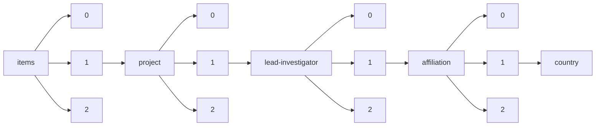

!!! warning "This document is not official Crossref documentation"
# Country
PATH = items/array/project/array/lead-investigator/array/affiliation/array/country(1)  
Occurs 5 343 times  
Unique values: 88  
{ .annotate }

1. A route to an element, for example:  
   The route "items/array/project/array/lead-investigator/array/affiliation/array/country" corresponds to navigating through the JSON indices as  
   ["items"][0]["project"][0]["lead-investigator"][0]["affiliation"][0]["country"]  

| **Row** | **Value** `String` | **Count** `Int64` |
|--------:|----------------------:|---------------------:|
| **1**   | GB                    | 3 959                |
| **2**   | US                    | 508                  |
| **3**   | AU                    | 168                  |
| **4**   | ZA                    | 61                   |
| **5**   | IE                    | 59                   |
| **6**   | IN                    | 59                   |
| **7**   | CH                    | 56                   |
| **8**   | KE                    | 30                   |
| **9**   | FR                    | 30                   |
| **10**  | CA                    | 26                   |
| **11**  | CN                    | 21                   |
| **12**  | CU                    | 19                   |
| **13**  | IT                    | 17                   |
| **14**  | BR                    | 17                   |
| **15**  | NZ                    | 16                   |
| **16**  | DE                    | 15                   |
| **17**  | RU                    | 15                   |
| **18**  | TH                    | 12                   |
| **19**  | JP                    | 12                   |
| **20**  | NL                    | 11                   |
| **21**  | MW                    | 10                   |
| **22**  | SE                    | 9                    |
| **23**  | MX                    | 9                    |
| **24**  | NG                    | 8                    |
| **25**  | HU                    | 8                    |
| **26**  | TZ                    | 8                    |
| **27**  | AR                    | 8                    |
| **28**  | CL                    | 8                    |
| **29**  | PL                    | 7                    |
| **30**  | GH                    | 7                    |
| **31**  | ES                    | 6                    |
| **32**  | KR                    | 6                    |
| **33**  | BE                    | 6                    |
| **34**  | DK                    | 6                    |
| **35**  | SG                    | 6                    |
| **36**  | VN                    | 5                    |
| **37**  | NO                    | 5                    |
| **38**  | IL                    | 5                    |
| **39**  | AT                    | 5                    |
| **40**  | TT                    | 5                    |
| **41**  | PE                    | 5                    |
| **42**  | CZ                    | 5                    |
| **43**  | CO                    | 5                    |
| **44**  | MY                    | 5                    |
| **45**  | CM                    | 4                    |
| **46**  | SN                    | 4                    |
| **47**  | UA                    | 3                    |
| **48**  | EE                    | 3                    |
| **49**  | MV                    | 3                    |
| **50**  | BF                    | 3                    |
| **51**  | SK                    | 3                    |
| **52**  | RW                    | 3                    |
| **53**  | UG                    | 3                    |
| **54**  | GR                    | 2                    |
| **55**  | FI                    | 2                    |
| **56**  | BD                    | 2                    |
| **57**  | ZM                    | 2                    |
| **58**  | CR                    | 2                    |
| **59**  | SD                    | 2                    |
| **60**  | TJ                    | 2                    |
| **61**  | CI                    | 2                    |
| **62**  | TN                    | 2                    |
| **63**  | RO                    | 2                    |
| **64**  | BW                    | 2                    |
| **65**  | SA                    | 1                    |
| **66**  | DO                    | 1                    |
| **67**  | GT                    | 1                    |
| **68**  | GA                    | 1                    |
| **69**  | NP                    | 1                    |
| **70**  | PK                    | 1                    |
| **71**  | EG                    | 1                    |
| **72**  | LU                    | 1                    |
| **73**  | ET                    | 1                    |
| **74**  | GE                    | 1                    |
| **75**  | ID                    | 1                    |
| **76**  | HR                    | 1                    |
| **77**  | BG                    | 1                    |
| **78**  | KH                    | 1                    |
| **79**  | IR                    | 1                    |
| **80**  | SL                    | 1                    |
| **81**  | BY                    | 1                    |
| **82**  | PT                    | 1                    |
| **83**  | LK                    | 1                    |
| **84**  | JM                    | 1                    |
| **85**  | ZW                    | 1                    |
| **86**  | LT                    | 1                    |
| **87**  | UY                    | 1                    |
| **88**  | GD                    | 1                    |

