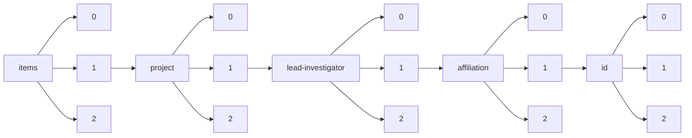

!!! warning "This document is not official Crossref documentation"
# Elements
PATH = items/array/project/array/lead-investigator/array/affiliation/array/id/array(1)  
Occurs 5 699 times  
{ .annotate }

1. A route to an element, for example:  
   The route "items/array/project/array/lead-investigator/array/affiliation/array/id/array" corresponds to navigating through the JSON indices as  
   ["items"][0]["project"][0]["lead-investigator"][0]["affiliation"][0]["id"][0]  

## Asserted-by
See more information: [items/array/project/array/lead-investigator/array/affiliation/array/id/array/asserted-by](asserted-by/index.md)  
Occurs 5 699 timess  
Unique values: 1  

| **Row** | **Value** `String` | **Count** `Int64` |
|--------:|----------------------:|---------------------:|
| **1**   | publisher             | 5 699                |

## Id
See more information: [items/array/project/array/lead-investigator/array/affiliation/array/id/array/id](id/index.md)  
Occurs 5 699 timess  
Unique values: 694  

| **Row** | **Value** `String`     | **Count** `Int64` |
|--------:|--------------------------:|---------------------:|
| **1**   | https://ror.org/052gg0110 | 450                  |
| **2**   | https://ror.org/02jx3x895 | 373                  |
| **3**   | https://ror.org/013meh722 | 302                  |
| **4**   | https://ror.org/01nrxwf90 | 243                  |
| **5**   | https://ror.org/041kmwe10 | 216                  |
| **6**   | https://ror.org/0220mzb33 | 190                  |
| **7**   | https://ror.org/027m9bs27 | 166                  |
| **8**   | https://ror.org/0524sp257 | 151                  |
| **9**   | https://ror.org/00vtgdb53 | 129                  |
| **10**  | https://ror.org/05h992307 | 99                   |
| ... | ... | ... |

## Id-type
See more information: [items/array/project/array/lead-investigator/array/affiliation/array/id/array/id-type](id-type/index.md)  
Occurs 5 699 timess  
Unique values: 1  

| **Row** | **Value** `String` | **Count** `Int64` |
|--------:|----------------------:|---------------------:|
| **1**   | ROR                   | 5 699                |

