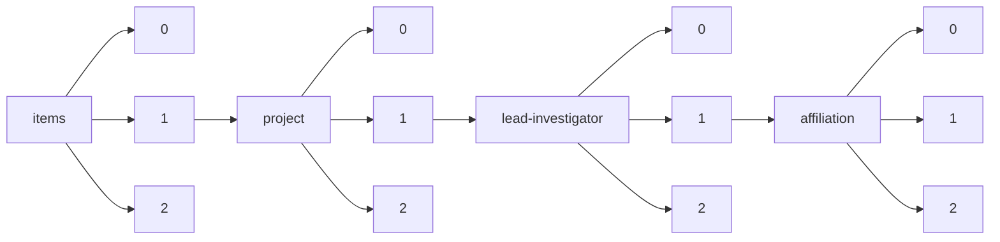

!!! warning "This document is not official Crossref documentation"
# Elements
PATH = items/array/project/array/lead-investigator/array/affiliation/array(1)  
Occurs 17 538 times  
{ .annotate }

1. A route to an element, for example:  
   The route "items/array/project/array/lead-investigator/array/affiliation/array" corresponds to navigating through the JSON indices as  
   ["items"][0]["project"][0]["lead-investigator"][0]["affiliation"][0]  

## Country
See more information: [items/array/project/array/lead-investigator/array/affiliation/array/country](country/index.md)  
Occurs 5 343 timess  
Unique values: 88  

| **Row** | **Value** `String` | **Count** `Int64` |
|--------:|----------------------:|---------------------:|
| **1**   | GB                    | 3 959                |
| **2**   | US                    | 508                  |
| **3**   | AU                    | 168                  |
| **4**   | ZA                    | 61                   |
| **5**   | IE                    | 59                   |
| **6**   | IN                    | 59                   |
| **7**   | CH                    | 56                   |
| **8**   | KE                    | 30                   |
| **9**   | FR                    | 30                   |
| **10**  | CA                    | 26                   |
| ... | ... | ... |

## Id
See more information: [items/array/project/array/lead-investigator/array/affiliation/array/id](id/index.md)  
Occurs 5 699 timess  

| **Row** | **Length** `Any` | **Count** `Int64` |
|--------:|--------------------:|---------------------:|
| **1**   | 1                   | 5 699                |

## Name
See more information: [items/array/project/array/lead-investigator/array/affiliation/array/name](name/index.md)  
Occurs 17 537 timess  
Unique values: > 999  

!!! note "Due to current limitations, only the first 1,000 unique values are counted."

| **Row** | **Value** `String`        | **Count** `Int64` |
|--------:|-----------------------------:|---------------------:|
| **1**   | University of Oxford         | 459                  |
| **2**   | University College London    | 376                  |
| **3**   | University of Cambridge      | 307                  |
| **4**   | University of Edinburgh      | 245                  |
| **5**   | Imperial College London      | 219                  |
| **6**   | 東京大学, 大学院工学系研究科 | 210                  |
| **7**   | King's College London        | 189                  |
| **8**   | University of Manchester     | 167                  |
| **9**   | University of Bristol        | 153                  |
| **10**  | University of Glasgow        | 130                  |
| ... | ... | ... |

