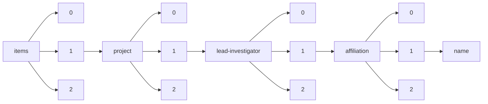

!!! warning "This document is not official Crossref documentation"
# Name
PATH = items/array/project/array/lead-investigator/array/affiliation/array/name(1)  
Occurs 17 537 times  
Unique values: > 999  
{ .annotate }

1. A route to an element, for example:  
   The route "items/array/project/array/lead-investigator/array/affiliation/array/name" corresponds to navigating through the JSON indices as  
   ["items"][0]["project"][0]["lead-investigator"][0]["affiliation"][0]["name"]  

!!! note "Due to current limitations, only the first 1,000 unique values are counted."

| **Row** | **Value** `String`                                                                                             | **Count** `Int64` |
|--------:|------------------------------------------------------------------------------------------------------------------:|---------------------:|
| **1**   | University of Oxford                                                                                              | 459                  |
| **2**   | University College London                                                                                         | 376                  |
| **3**   | University of Cambridge                                                                                           | 307                  |
| **4**   | University of Edinburgh                                                                                           | 245                  |
| **5**   | Imperial College London                                                                                           | 219                  |
| **6**   | 東京大学, 大学院工学系研究科                                                                                      | 210                  |
| **7**   | King's College London                                                                                             | 189                  |
| **8**   | University of Manchester                                                                                          | 167                  |
| **9**   | University of Bristol                                                                                             | 153                  |
| **10**  | University of Glasgow                                                                                             | 130                  |
| **11**  | 京都大学, 大学院工学研究科                                                                                        | 109                  |
| **12**  | 東京大学, 大学院理学系研究科                                                                                      | 108                  |
| **13**  | 東京大学, 大学院情報理工学系研究科                                                                                | 102                  |
| **14**  | Pacific Northwest National Laboratory                                                                             | 100                  |
| **15**  | University of Vienna                                                                                              | 96                   |
| **16**  | 大阪大学, 大学院工学研究科                                                                                        | 94                   |
| **17**  | London School of Hygiene & Tropical Medicine                                                                      | 93                   |
| **18**  | University of Liverpool                                                                                           | 90                   |
| **19**  | 東京大学, 生産技術研究所                                                                                          | 86                   |
| **20**  | Cardiff University                                                                                                | 85                   |
| **21**  | Newcastle University                                                                                              | 85                   |
| **22**  | University of Dundee                                                                                              | 82                   |
| **23**  | 名古屋大学, 大学院工学研究科                                                                                      | 82                   |
| **24**  | University of Leeds                                                                                               | 80                   |
| **25**  | University of Birmingham                                                                                          | 75                   |
| **26**  | University of Nottingham                                                                                          | 71                   |
| **27**  | University of Sheffield                                                                                           | 70                   |
| **28**  | 東北大学, 大学院工学研究科                                                                                        | 69                   |
| **29**  | 早稲田大学, 理工学術院                                                                                            | 69                   |
| **30**  | 東京大学, 大学院総合文化研究科                                                                                    | 69                   |
| **31**  | 大阪大学, 産業科学研究所                                                                                          | 68                   |
| **32**  | 東京大学, 大学院医学系研究科                                                                                      | 67                   |
| **33**  | 大阪大学, 大学院基礎工学研究科                                                                                    | 63                   |
| **34**  | 京都大学, 大学院理学研究科                                                                                        | 61                   |
| **35**  | 慶應義塾大学, 理工学部                                                                                            | 54                   |
| **36**  | Wellcome Trust Sanger Institute                                                                                   | 52                   |
| **37**  | Queen Mary University of London                                                                                   | 50                   |
| **38**  | 京都大学, 大学院医学研究科                                                                                        | 50                   |
| **39**  | 京都大学, 化学研究所                                                                                              | 50                   |
| **40**  | 東京大学, 大学院新領域創成科学研究科                                                                              | 46                   |
| **41**  | Liverpool School of Tropical Medicine                                                                             | 46                   |
| **42**  | 山形大学, 大学院理工学研究科                                                                                      | 46                   |
| **43**  | Medical University of Vienna                                                                                      | 45                   |
| **44**  | 東京工業大学, 大学院理工学研究科                                                                                  | 45                   |
| **45**  | Vienna University of Technology                                                                                   | 44                   |
| **46**  | 東京大学, 先端科学技術研究センター                                                                                | 42                   |
| **47**  | 名古屋大学, 大学院理学研究科                                                                                      | 42                   |
| **48**  | 九州大学, 大学院工学研究院                                                                                        | 42                   |
| **49**  | 東北大学, 多元物質科学研究所                                                                                      | 41                   |
| **50**  | 東京大学, 大学院薬学系研究科                                                                                      | 41                   |
| **51**  | 京都大学, 大学院情報学研究科                                                                                      | 40                   |
| **52**  | 東京大学, 医科学研究所                                                                                            | 40                   |
| **53**  | University of Leicester                                                                                           | 39                   |
| **54**  | World Health Organization, Switzerland                                                                            | 37                   |
| **55**  | University of Warwick                                                                                             | 36                   |
| **56**  | 大阪府立大学, 大学院工学研究科                                                                                    | 36                   |
| **57**  | 名古屋工業大学, 大学院工学研究科                                                                                  | 36                   |
| **58**  | Environmental Molecular Sciences Laboratory                                                                       | 36                   |
| **59**  | St George's University of London                                                                                  | 35                   |
| **60**  | 東京大学, 大学院農学生命科学研究科                                                                                | 35                   |
| **61**  | 東北大学, 金属材料研究所                                                                                          | 35                   |
| **62**  | 北海道大学, 大学院工学研究院                                                                                      | 34                   |
| **63**  | 北海道大学, 電子科学研究所                                                                                        | 34                   |
| **64**  | University of Aberdeen                                                                                            | 32                   |
| **65**  | 東京大学, 大学院工学系研究科(工学部)                                                                              | 31                   |
| **66**  | Medical Research Council                                                                                          | 31                   |
| **67**  | Harvard University                                                                                                | 30                   |
| **68**  | 大阪大学, 大学院医学系研究科                                                                                      | 30                   |
| **69**  | University of Southampton                                                                                         | 29                   |
| **70**  | 横浜国立大学, 大学院工学研究院                                                                                    | 28                   |
| **71**  | University of York                                                                                                | 28                   |
| **72**  | 慶應義塾大学, 医学部                                                                                              | 28                   |
| **73**  | 東北大学, 大学院理学研究科                                                                                        | 28                   |
| **74**  | University of Sussex                                                                                              | 27                   |
| **75**  | University of Bath                                                                                                | 27                   |
| **76**  | 東京工業大学, 物質理工学院                                                                                        | 27                   |
| **77**  | 大阪大学, 大学院情報科学研究科                                                                                    | 27                   |
| **78**  | Massachusetts General Hospital (Mass General)                                                                     | 26                   |
| **79**  | Massachusetts Institute of Technology                                                                             | 26                   |
| **80**  | 東京工業大学, 科学技術創成研究院                                                                                  | 26                   |
| **81**  | 大阪大学, 大学院生命機能研究科                                                                                    | 25                   |
| **82**  | 九州大学, 大学院システム情報科学研究院                                                                            | 25                   |
| **83**  | 九州大学, 先導物質化学研究所                                                                                      | 25                   |
| **84**  | Yale University                                                                                                   | 25                   |
| **85**  | 自然科学研究機構, 分子科学研究所                                                                                  | 24                   |
| **86**  | 電気通信大学, 大学院情報理工学研究科                                                                              | 24                   |
| **87**  | 北海道大学, 大学院理学研究院                                                                                      | 24                   |
| **88**  | 奈良先端科学技術大学院大学, 先端科学技術研究科                                                                    | 23                   |
| **89**  | 九州大学, 工学研究院                                                                                              | 23                   |
| **90**  | 東京工業大学, 情報理工学院                                                                                        | 23                   |
| **91**  | 大阪大学, 大学院理学研究科                                                                                        | 23                   |
| **92**  | 東京大学, 物性研究所                                                                                              | 23                   |
| **93**  | 九州大学, 生体防御医学研究所                                                                                      | 23                   |
| **94**  | 山梨大学, 大学院総合研究部                                                                                        | 22                   |
| **95**  | Queen's University Belfast                                                                                        | 22                   |
| **96**  | 京都大学, 大学院生命科学研究科                                                                                    | 22                   |
| **97**  | University of Exeter                                                                                              | 21                   |
| **98**  | 理化学研究所                                                                                                      | 21                   |
| **99**  | Johns Hopkins University School of Medicine                                                                       | 21                   |
| **100** | 東北大学, 電気通信研究所                                                                                          | 21                   |
| **101** | 大阪大学, 微生物病研究所                                                                                          | 21                   |
| **102** | 神戸大学, 大学院工学研究科                                                                                        | 21                   |
| **103** | University of Cape Town                                                                                           | 21                   |
| **104** | 東京農工大学, 大学院工学研究院                                                                                    | 20                   |
| **105** | 埼玉大学, 理工学研究科                                                                                            | 20                   |
| **106** | Monash University                                                                                                 | 20                   |
| **107** | 東京工業大学, 工学院                                                                                              | 20                   |
| **108** | 大阪大学, 工学研究科                                                                                              | 20                   |
| **109** | 筑波大学, 数理物質系                                                                                              | 20                   |
| **110** | The Francis Crick Institute                                                                                       | 19                   |
| **111** | 東京工業大学, 大学院総合理工学研究科                                                                              | 19                   |
| **112** | Stanford University                                                                                               | 19                   |
| **113** | University of Pittsburgh                                                                                          | 19                   |
| **114** | 奈良先端科学技術大学院大学, バイオサイエンス研究科                                                                | 19                   |
| **115** | Duke University                                                                                                   | 19                   |
| **116** | 筑波大学, システム情報系                                                                                          | 19                   |
| **117** | 埼玉大学, 大学院理工学研究科                                                                                      | 19                   |
| **118** | 東北大学, 工学研究科                                                                                              | 19                   |
| **119** | 群馬大学, 大学院理工学府                                                                                          | 18                   |
| **120** | 東京工業大学, 資源化学研究所                                                                                      | 18                   |
| **121** | 奈良先端科学技術大学院大学, 情報科学研究科                                                                        | 18                   |
| **122** | University of St Andrews                                                                                          | 18                   |
| **123** | 大阪大学, 蛋白質研究所                                                                                            | 18                   |
| **124** | 大阪府立大学, 工学(系)研究科(研究院)                                                                              | 18                   |
| **125** | Columbia University                                                                                               | 18                   |
| **126** | New York University                                                                                               | 18                   |
| **127** | The Regents of the University of California, Los Angeles                                                          | 18                   |
| **128** | 東北大学, 原子分子材料科学高等研究機構                                                                            | 18                   |
| **129** | University of Florida                                                                                             | 18                   |
| **130** | 京都大学, 工学研究科                                                                                              | 18                   |
| **131** | 名古屋大学, 工学研究科                                                                                            | 18                   |
| **132** | 情報・システム研究機構, 国立情報学研究所                                                                          | 17                   |
| **133** | Trinity College Dublin                                                                                            | 17                   |
| **134** | 九州工業大学, 大学院生命体工学研究科                                                                              | 17                   |
| **135** | 東京大学                                                                                                          | 17                   |
| **136** | 名古屋大学, 大学院生命農学研究科                                                                                  | 17                   |
| **137** | 筑波大学, 生命環境系                                                                                              | 17                   |
| **138** | University of Washington                                                                                          | 16                   |
| **139** | 岡山大学, 大学院自然科学研究科                                                                                    | 16                   |
| **140** | 東京大学, 分子細胞生物学研究所                                                                                    | 16                   |
| **141** | 大阪市立大学, 大学院工学研究科                                                                                    | 15                   |
| **142** | Birkbeck University of London                                                                                     | 15                   |
| **143** | Princeton University                                                                                              | 15                   |
| **144** | 国立研究開発法人理化学研究所, 創発物性科学研究センター                                                            | 15                   |
| **145** | 早稲田大学, 理工学部                                                                                              | 15                   |
| **146** | 奈良先端科学技術大学院大学, 物質創成科学研究科                                                                    | 15                   |
| **147** | TU Wien                                                                                                           | 14                   |
| **148** | 理化学研究所, 生命機能科学研究センター                                                                            | 14                   |
| **149** | 工業技術院, 電子技術総合研究所                                                                                    | 14                   |
| **150** | MRC Laboratory of Molecular Biology                                                                               | 14                   |
| **151** | 国立遺伝学研究所                                                                                                  | 14                   |
| **152** | 大阪市立大学, 大学院理学研究科                                                                                    | 14                   |
| **153** | University College Dublin                                                                                         | 14                   |
| **154** | 東京医科歯科大学, 大学院医歯学総合研究科                                                                          | 14                   |
| **155** | The Ohio State University                                                                                         | 14                   |
| **156** | Institute of Cancer Research                                                                                      | 14                   |
| **157** | Keele University                                                                                                  | 14                   |
| **158** | 神戸大学, 工学研究科                                                                                              | 14                   |
| **159** | 長崎大学, 工学研究科                                                                                              | 14                   |
| **160** | 立命館大学, 理工学部                                                                                              | 14                   |
| **161** | 岡崎国立共同研究機構, 基礎生物学研究所                                                                            | 14                   |
| **162** | 山口大学, 大学院創成科学研究科                                                                                    | 14                   |
| **163** | 金沢大学, 理工研究域                                                                                              | 14                   |
| **164** | 九州大学, 大学院理学研究院                                                                                        | 14                   |
| **165** | 同志社大学, 理工学部                                                                                              | 14                   |
| **166** | 東北大学, 大学院環境科学研究科                                                                                    | 13                   |
| **167** | University of Melbourne                                                                                           | 13                   |
| **168** | University of Chicago                                                                                             | 13                   |
| **169** | 東北大学                                                                                                          | 13                   |
| **170** | 北陸先端科学技術大学院大学, 先端科学技術研究科                                                                    | 13                   |
| **171** | 九州大学, システム情報科学研究院                                                                                  | 13                   |
| **172** | 愛媛大学, 大学院理工学研究科                                                                                      | 13                   |
| **173** | 東北大学, 大学院生命科学研究科                                                                                    | 13                   |
| **174** | Kemri-Wellcome Trust Research Programme                                                                           | 13                   |
| **175** | 理化学研究所, 脳科学総合研究センター                                                                              | 13                   |
| **176** | Stanford University School of Medicine                                                                            | 13                   |
| **177** | 北海道大学, 大学院工学研究科                                                                                      | 13                   |
| **178** | 中央大学, 理工学部                                                                                                | 13                   |
| **179** | 理化学研究所, 革新知能統合研究センター                                                                            | 12                   |
| **180** | 京都大学, 大学院農学研究科                                                                                        | 12                   |
| **181** | University of Durham                                                                                              | 12                   |
| **182** | The Regents of the University of California (Irvine)                                                              | 12                   |
| **183** | 芝浦工業大学, 工学部                                                                                              | 12                   |
| **184** | 北陸先端科学技術大学院大学, マテリアルサイエンス研究科                                                            | 12                   |
| **185** | Dana-Farber Cancer Institute                                                                                      | 12                   |
| **186** | Royal Veterinary College                                                                                          | 12                   |
| **187** | School of Pharmacy, University of London                                                                          | 12                   |
| **188** | 九州工業大学, 大学院情報工学研究院                                                                                | 12                   |
| **189** | 京都大学, ウイルス研究所                                                                                          | 12                   |
| **190** | 広島大学, 大学院先進理工系科学研究科                                                                              | 12                   |
| **191** | 東北大学, 学際科学フロンティア研究所                                                                              | 12                   |
| **192** | University of Reading                                                                                             | 12                   |
| **193** | University of California-Los Angeles                                                                              | 12                   |
| **194** | Misc England                                                                                                      | 12                   |
| **195** | 大阪大学, 接合科学研究所                                                                                          | 11                   |
| **196** | 岩手大学, 理工学部                                                                                                | 11                   |
| **197** | 大阪大学, レーザーエネルギー学研究センター                                                                        | 11                   |
| **198** | 独立行政法人理化学研究所, 基幹研究所                                                                              | 11                   |
| **199** | 東京工業大学, 大学院生命理工学研究科                                                                              | 11                   |
| **200** | Washington University School of Medicine                                                                          | 11                   |
| **201** | Carnegie Mellon University                                                                                        | 11                   |
| **202** | Johns Hopkins University                                                                                          | 11                   |
| **203** | University of Strathclyde                                                                                         | 11                   |
| **204** | 九州大学, 大学院農学研究院                                                                                        | 11                   |
| **205** | 岐阜大学, 工学部                                                                                                  | 11                   |
| **206** | 静岡県立大学, 薬学部                                                                                              | 11                   |
| **207** | 理化学研究所, 開拓研究本部                                                                                        | 11                   |
| **208** | Northwestern University                                                                                           | 11                   |
| **209** | 筑波大学, 大学院システム情報工学研究科                                                                            | 11                   |
| **210** | University of East Anglia                                                                                         | 11                   |
| **211** | Emory University                                                                                                  | 11                   |
| **212** | The Board of Trustees of the Leland Stanford Junior University                                                    | 11                   |
| **213** | 北海道大学, 触媒化学研究センター                                                                                  | 11                   |
| **214** | 国立研究開発法人産業技術総合研究所, その他部局等                                                                  | 11                   |
| **215** | Misc China                                                                                                        | 11                   |
| **216** | 近畿大学, 理工学部                                                                                                | 10                   |
| **217** | 東北大学, 未来科学技術共同研究センター                                                                            | 10                   |
| **218** | 宮崎大学, 農学部                                                                                                  | 10                   |
| **219** | 東北大学, 大学院農学研究科                                                                                        | 10                   |
| **220** | Tufts University                                                                                                  | 10                   |
| **221** | 東京医科歯科大学, 難治疾患研究所                                                                                  | 10                   |
| **222** | 北海道大学, 大学院先端生命科学研究院                                                                              | 10                   |
| **223** | 大分大学, 工学部                                                                                                  | 10                   |
| **224** | 京都府立大学, 生命環境科学研究科                                                                                  | 10                   |
| **225** | University of Rochester                                                                                           | 10                   |
| **226** | 東京大学, 医学部附属病院                                                                                          | 10                   |
| **227** | 広島大学, 大学院理学研究科                                                                                        | 10                   |
| **228** | 京都大学                                                                                                          | 10                   |
| **229** | Misc Cuba                                                                                                         | 10                   |
| **230** | 東北大学, 大学院医学系研究科                                                                                      | 10                   |
| **231** | 東北大学, 材料科学高等研究所                                                                                      | 10                   |
| **232** | Virginia Commonwealth University                                                                                  | 10                   |
| **233** | 東京農工大学, 工学(系)研究科(研究院)                                                                              | 10                   |
| **234** | 広島大学, 工学研究科                                                                                              | 10                   |
| **235** | 東京海洋大学, 学術研究院                                                                                          | 10                   |
| **236** | University of Bradford                                                                                            | 10                   |
| **237** | 長岡技術科学大学, 工学研究科                                                                                      | 10                   |
| **238** | Columbia University Medical Center                                                                                | 10                   |
| **239** | 東北大学, 加齢医学研究所                                                                                          | 10                   |
| **240** | 関西大学, 化学生命工学部                                                                                          | 10                   |
| **241** | 名古屋大学, 未来材料・システム研究所                                                                              | 10                   |
| **242** | 上智大学, 理工学部                                                                                                | 10                   |
| **243** | 京都大学, 情報学研究科                                                                                            | 10                   |
| **244** | 岡山大学, 自然科学研究科                                                                                          | 10                   |
| **245** | 東京工業大学, 理学院                                                                                              | 10                   |
| **246** | The Chancellor, Masters and Scholars of the University of Oxford                                                  | 10                   |
| **247** | 北海道大学                                                                                                        | 9                    |
| **248** | University of Sydney                                                                                              | 9                    |
| **249** | 兵庫県立大学, 大学院工学研究科                                                                                    | 9                    |
| **250** | The Hospital for Sick Children                                                                                    | 9                    |
| **251** | National University of Ireland Galway                                                                             | 9                    |
| **252** | 大阪工業大学, 工学部                                                                                              | 9                    |
| **253** | University of British Columbia                                                                                    | 9                    |
| **254** | 東京大学, 大学院農学生命科学研究科(農学部)                                                                        | 9                    |
| **255** | 豊橋技術科学大学, 工学(系)研究科(研究院)                                                                          | 9                    |
| **256** | 東北大学, 大学院薬学研究科                                                                                        | 9                    |
| **257** | (株)島津製作所                                                                                                    | 9                    |
| **258** | 広島大学, 大学院工学研究院                                                                                        | 9                    |
| **259** | 自然科学研究機構, 生理学研究所                                                                                    | 9                    |
| **260** | The Regents of the University of Michigan                                                                         | 9                    |
| **261** | 神戸大学, 大学院システム情報学研究科                                                                              | 9                    |
| **262** | University of Colorado Denver, AMC and DC                                                                         | 9                    |
| **263** | 自然科学研究機構, 基礎生物学研究所                                                                                | 9                    |
| **264** | 北九州市立大学, 国際環境工学部                                                                                    | 9                    |
| **265** | 京都大学, 防災研究所                                                                                              | 9                    |
| **266** | 京都府立医科大学, 大学院医学研究科                                                                                | 9                    |
| **267** | Baylor College of Medicine                                                                                        | 9                    |
| **268** | European Molecular Biology Laboratory                                                                             | 9                    |
| **269** | 横浜国立大学, 大学院環境情報研究院                                                                                | 9                    |
| **270** | University of Alabama at Birmingham                                                                               | 9                    |
| **271** | 名古屋工業大学, 工学(系)研究科(研究院)                                                                            | 9                    |
| **272** | Perelman School of Medicine, University of Pennsylvania                                                           | 9                    |
| **273** | University of California                                                                                          | 9                    |
| **274** | 大阪大学                                                                                                          | 9                    |
| **275** | University of Michigan                                                                                            | 9                    |
| **276** | 九州大学, 大学院総合理工学研究院                                                                                  | 9                    |
| **277** | 情報・システム研究機構, 国立遺伝学研究所                                                                          | 9                    |
| **278** | Massachusetts General Hospital                                                                                    | 9                    |
| **279** | 関西大学, システム理工学部                                                                                        | 9                    |
| **280** | 独立行政法人理化学研究所, 脳科学総合研究センター                                                                  | 9                    |
| **281** | 東北大学, 大学院情報科学研究科                                                                                    | 9                    |
| **282** | 筑波大学, 大学院数理物質科学研究科                                                                                | 9                    |
| **283** | 徳島大学, ポストLEDフォトニクス研究所                                                                             | 8                    |
| **284** | 熊本大学, 大学院先端科学研究部                                                                                    | 8                    |
| **285** | Indian Institute of Science                                                                                       | 8                    |
| **286** | Michigan State University                                                                                         | 8                    |
| **287** | Lawrence Berkeley National Laboratory                                                                             | 8                    |
| **288** | Australian National University                                                                                    | 8                    |
| **289** | 慶應義塾大学, 環境情報学部                                                                                        | 8                    |
| **290** | 新潟大学, 自然科学系                                                                                              | 8                    |
| **291** | 東京工業大学                                                                                                      | 8                    |
| **292** | 徳島大学, 大学院ソシオテクノサイエンス研究部                                                                      | 8                    |
| **293** | 首都大学東京, 大学院理工学研究科                                                                                  | 8                    |
| **294** | University of Georgia                                                                                             | 8                    |
| **295** | University of Texas M.D. Anderson Cancer Center                                                                   | 8                    |
| **296** | 筑波大学, 電子・情報工学系                                                                                        | 8                    |
| **297** | University of the Witwatersrand                                                                                   | 8                    |
| **298** | Russian Academy of Sciences                                                                                       | 8                    |
| **299** | 京都大学, 生態学研究センター                                                                                      | 8                    |
| **300** | University of KwaZulu Natal                                                                                       | 8                    |
| **301** | Oregon Health & Science University - OHSU                                                                         | 8                    |
| **302** | Harvard Medical School                                                                                            | 8                    |
| **303** | 信州大学, 学術研究院工学系                                                                                        | 8                    |
| **304** | Miller School of Medicine of the University of Miami                                                              | 8                    |
| **305** | California Institute of Technology                                                                                | 8                    |
| **306** | 名古屋大学, トランスフォーマティブ生命分子研究所                                                                  | 8                    |
| **307** | 名古屋大学, 物質科学国際研究センター                                                                              | 8                    |
| **308** | 名古屋大学                                                                                                        | 8                    |
| **309** | 筑波大学, 医学医療系                                                                                              | 8                    |
| **310** | University of Pennsylvania                                                                                        | 8                    |
| **311** | Boston University                                                                                                 | 8                    |
| **312** | Georgia Institute of Technology                                                                                   | 8                    |
| **313** | Babraham Institute                                                                                                | 8                    |
| **314** | University of California-San Diego                                                                                | 8                    |
| **315** | 名古屋大学, 大学院医学系研究科                                                                                    | 8                    |
| **316** | University of Queensland                                                                                          | 8                    |
| **317** | Board of Regents of the University of Wisconsin System                                                            | 8                    |
| **318** | 名古屋大学, 環境医学研究所                                                                                        | 8                    |
| **319** | University of Surrey                                                                                              | 8                    |
| **320** | 静岡大学, 工学部                                                                                                  | 8                    |
| **321** | Brigham and Women's Hospital, Inc.                                                                                | 8                    |
| **322** | Misc Australia                                                                                                    | 8                    |
| **323** | Fred Hutchinson Cancer Research Center                                                                            | 8                    |
| **324** | 北海道大学, 工学(系)研究科(研究院)                                                                                | 8                    |
| **325** | 宇都宮大学, 工学部                                                                                                | 7                    |
| **326** | University of Minnesota                                                                                           | 7                    |
| **327** | 静岡県立大学, 食品栄養科学部                                                                                      | 7                    |
| **328** | 関西大学, 環境都市工学部                                                                                          | 7                    |
| **329** | 電気通信大学, 電気通信学部                                                                                        | 7                    |
| **330** | 広島大学, 大学院先端物質科学研究科                                                                                | 7                    |
| **331** | 東京工業大学, 応用セラミックス研究所                                                                              | 7                    |
| **332** | 神戸大学, 大学院理学研究科                                                                                        | 7                    |
| **333** | 神戸大学, 大学院医学研究科                                                                                        | 7                    |
| **334** | 熊本大学, 大学院先端科学研究部(工)                                                                                | 7                    |
| **335** | 国立研究開発法人理化学研究所, 環境資源科学研究センター                                                            | 7                    |
| **336** | Washington University in St. Louis                                                                                | 7                    |
| **337** | 北海道大学, 工学研究院                                                                                            | 7                    |
| **338** | 京都大学, 物質-細胞統合システム拠点                                                                               | 7                    |
| **339** | Boston Children's Hospital                                                                                        | 7                    |
| **340** | 佐賀大学, 理工学部                                                                                                | 7                    |
| **341** | University of Natural Resources and Life Science Vienna                                                           | 7                    |
| **342** | 京都大学, 再生医科学研究所                                                                                        | 7                    |
| **343** | 広島大学, 工学研究院                                                                                              | 7                    |
| **344** | 北海道大学, 大学院薬学研究院                                                                                      | 7                    |
| **345** | 熊本大学, 大学院生命科学研究部                                                                                    | 7                    |
| **346** | Misc United States                                                                                                | 7                    |
| **347** | 名古屋市立大学, 大学院薬学研究科                                                                                  | 7                    |
| **348** | 立命館大学, 情報理工学部                                                                                          | 7                    |
| **349** | 大阪バイオサイエンス研究所                                                                                        | 7                    |
| **350** | 大阪大学, 免疫学フロンティア研究センター                                                                          | 7                    |
| **351** | 地方独立行政法人大阪府立産業技術総合研究所, その他部局等                                                          | 7                    |
| **352** | 金沢大学, ナノ生命科学研究所                                                                                      | 7                    |
| **353** | European Bioinformatics Institute                                                                                 | 7                    |
| **354** | 鹿児島大学, 理工学域工学系                                                                                        | 7                    |
| **355** | The Regents of the University of California, San Francisco                                                        | 7                    |
| **356** | 京都大学, 学術情報メディアセンター                                                                                | 7                    |
| **357** | 東海大学, 工学部                                                                                                  | 7                    |
| **358** | お茶の水女子大学, 基幹研究院                                                                                      | 7                    |
| **359** | 東京工業大学, 生命理工学院                                                                                        | 7                    |
| **360** | 九州大学, 大学院医学研究院                                                                                        | 7                    |
| **361** | 高エネルギー加速器研究機構, 物質構造科学研究所                                                                    | 7                    |
| **362** | 山形大学, 大学院有機材料システム研究科                                                                            | 7                    |
| **363** | The Children's Hospital of Philadelphia                                                                           | 7                    |
| **364** | 東京大学, 大学院理学系研究科(理学部)                                                                              | 7                    |
| **365** | The Board of Trustees of the University of Illinois - University of Illinois at Chicago                           | 7                    |
| **366** | Regents of the University of Minnesota - Twin Cities                                                              | 7                    |
| **367** | 大阪大学, 情報科学研究科                                                                                          | 7                    |
| **368** | 大分大学, 理工学部                                                                                                | 7                    |
| **369** | 東京理科大学, 理工学部                                                                                            | 7                    |
| **370** | Weill Medical College of Cornell University                                                                       | 7                    |
| **371** | 名古屋大学, 未来社会創造機構                                                                                      | 6                    |
| **372** | 九州大学, マス・フォア・インダストリ研究所                                                                        | 6                    |
| **373** | 理化学研究所, 中央研究所                                                                                          | 6                    |
| **374** | 東北学院大学, 工学部                                                                                              | 6                    |
| **375** | The University of North Carolina at Chapel Hill                                                                   | 6                    |
| **376** | National Centre for Biological Sciences, India                                                                    | 6                    |
| **377** | 東京工業大学, 学術国際情報センター                                                                                | 6                    |
| **378** | University of Kent                                                                                                | 6                    |
| **379** | University of Ottawa                                                                                              | 6                    |
| **380** | 熊本大学, 大学院自然科学研究科                                                                                    | 6                    |
| **381** | 近畿大学, 生物理工学部                                                                                            | 6                    |
| **382** | 龍谷大学, 理工学部                                                                                                | 6                    |
| **383** | 神戸大学, 大学院農学研究科                                                                                        | 6                    |
| **384** | Tel Aviv University                                                                                               | 6                    |
| **385** | 名古屋大学, エコトピア科学研究所                                                                                  | 6                    |
| **386** | 名古屋大学, 大学院情報科学研究科                                                                                  | 6                    |
| **387** | The University of Queensland                                                                                      | 6                    |
| **388** | University of Crossref                                                                                            | 6                    |
| **389** | 岡崎国立共同研究機構, 分子科学研究所                                                                              | 6                    |
| **390** | DOE Joint Genome Institute                                                                                        | 6                    |
| **391** | AIT Austrian Institute of Technology GmbH                                                                         | 6                    |
| **392** | 慶應義塾大学, 理工学部(矢上)                                                                                      | 6                    |
| **393** | 九州大学, カーボンニュートラル・エネルギー国際研究所                                                              | 6                    |
| **394** | Vienna University of Economics and Business                                                                       | 6                    |
| **395** | 室蘭工業大学, 大学院工学研究科                                                                                    | 6                    |
| **396** | 北海道大学, 低温科学研究所                                                                                        | 6                    |
| **397** | Washington State University                                                                                       | 6                    |
| **398** | Walter and Eliza Hall Institute of Medical Research                                                               | 6                    |
| **399** | 熊本県産業技術センター（ものづくり室、材料・地域資源室、食品加工室）, その他部局等                                | 6                    |
| **400** | Centre National De La Recherche Scientifique (CNRS)                                                               | 6                    |
| **401** | 大阪府立大学, 大学院生命環境科学研究科                                                                            | 6                    |
| **402** | H. Lee Moffitt Cancer Center & Research Institute, Inc                                                            | 6                    |
| **403** | The Regents of the University of California, Berkeley                                                             | 6                    |
| **404** | The Trustees of Columbia University in the City of New York                                                       | 6                    |
| **405** | Washington University in St.Louis                                                                                 | 6                    |
| **406** | The Chancellor, Masters and Scholars of the University of Cambridge                                               | 6                    |
| **407** | 信州大学                                                                                                          | 6                    |
| **408** | 東京大学, 大学院医学系研究科(医学部)                                                                              | 6                    |
| **409** | 国立研究開発法人理化学研究所, 生命システム研究センター                                                            | 6                    |
| **410** | 京都工芸繊維大学, 分子化学系                                                                                      | 6                    |
| **411** | 広島大学                                                                                                          | 6                    |
| **412** | 東京農工大学, 大学院農学研究院                                                                                    | 6                    |
| **413** | 東京大学, 定量生命科学研究所                                                                                      | 6                    |
| **414** | 関西学院大学, 理工学部                                                                                            | 6                    |
| **415** | 神戸大学, 大学院自然科学研究科                                                                                    | 6                    |
| **416** | Arizona State University                                                                                          | 6                    |
| **417** | Cambridge Institute for Medical Research                                                                          | 6                    |
| **418** | Icahn School of Medicine at Mount Sinai                                                                           | 6                    |
| **419** | University of Exeter Medical School                                                                               | 6                    |
| **420** | 九州工業大学, 大学院工学研究院                                                                                    | 6                    |
| **421** | 物質・材料研究機構, 国際ナノアーキテクトニクス研究拠点                                                            | 6                    |
| **422** | 福井大学, 大学院工学研究科                                                                                        | 6                    |
| **423** | Albert Einstein College of Medicine of Yeshiva University                                                         | 6                    |
| **424** | ROYAL COLLEGE OF SURGEONS IN IRELAND                                                                              | 6                    |
| **425** | 東京都立大学, 大学院理学研究科                                                                                    | 6                    |
| **426** | University of Arizona                                                                                             | 6                    |
| **427** | 国立研究開発法人理化学研究所, 開拓研究本部                                                                        | 6                    |
| **428** | 東北大学, 流体科学研究所                                                                                          | 6                    |
| **429** | 独立行政法人物質・材料研究機構, 国際ナノアーキテクトニクス研究拠点                                                | 5                    |
| **430** | 株式会社カネカ                                                                                                    | 5                    |
| **431** | Universidad Peruana Cayetano Heredia                                                                              | 5                    |
| **432** | Jagiellonian university                                                                                           | 5                    |
| **433** | 横浜国立大学, 先端科学高等研究院                                                                                  | 5                    |
| **434** | 明治大学, 理工学部                                                                                                | 5                    |
| **435** | 名古屋工業大学, 工学（系）研究科（研究院）                                                                        | 5                    |
| **436** | University of Veterinary Medicine Vienna                                                                          | 5                    |
| **437** | 北海道大学, 触媒科学研究所                                                                                        | 5                    |
| **438** | University of New South Wales                                                                                     | 5                    |
| **439** | 北海道大学, 大学院農学研究院                                                                                      | 5                    |
| **440** | 東京大学, 大学院情報学環                                                                                          | 5                    |
| **441** | 京都工芸繊維大学, 電気電子工学系                                                                                  | 5                    |
| **442** | 自治医科大学, 医学部                                                                                              | 5                    |
| **443** | 情報・システム研究機構, 統計数理研究所                                                                            | 5                    |
| **444** | 兵庫県立大学, 工学研究科                                                                                          | 5                    |
| **445** | Pennsylvania State University                                                                                     | 5                    |
| **446** | 九州大学                                                                                                          | 5                    |
| **447** | University of Stellenbosch                                                                                        | 5                    |
| **448** | Rutgers, The State University of New Jersey                                                                       | 5                    |
| **449** | Trustees of Boston University                                                                                     | 5                    |
| **450** | Aston University                                                                                                  | 5                    |
| **451** | 東京医科歯科大学, 生体材料工学研究所                                                                              | 5                    |
| **452** | 京都大学, ウイルス・再生医科学研究所                                                                              | 5                    |
| **453** | 鳥取大学, 乾燥地研究センター                                                                                      | 5                    |
| **454** | 大阪大学, 細胞生体工学センター                                                                                    | 5                    |
| **455** | 国立研究開発法人理化学研究所, 生命機能科学研究センター                                                            | 5                    |
| **456** | 早稲田大学, 理工学術院総合研究所                                                                                  | 5                    |
| **457** | 長崎大学, 大学院工学研究科                                                                                        | 5                    |
| **458** | 東北大学, 理学研究科                                                                                              | 5                    |
| **459** | University of Auckland                                                                                            | 5                    |
| **460** | 大阪大学, 基礎工学研究科                                                                                          | 5                    |
| **461** | 産業技術総合研究所, ナノテクノロジー研究部門                                                                      | 5                    |
| **462** | 理化学研究所, 基幹研究所                                                                                          | 5                    |
| **463** | 鳥取大学, 農学部                                                                                                  | 5                    |
| **464** | 東北大学, 災害科学国際研究所                                                                                      | 5                    |
| **465** | 地方独立行政法人北海道立総合研究機構, 産業技術研究本部工業試験場                                                  | 5                    |
| **466** | Lancaster University                                                                                              | 5                    |
| **467** | 京都大学, 物質−細胞統合システム拠点                                                                               | 5                    |
| **468** | 九州大学, 理学研究院                                                                                              | 5                    |
| **469** | Cornell University                                                                                                | 5                    |
| **470** | Northwestern University - Chicago Campus                                                                          | 5                    |
| **471** | The University of Sydney                                                                                          | 5                    |
| **472** | 北海道大学, 大学院医学研究科                                                                                      | 5                    |
| **473** | 北海道大学, 遺伝子病制御研究所                                                                                    | 5                    |
| **474** | 順天堂大学, 医学部                                                                                                | 5                    |
| **475** | Santa Fe Institute                                                                                                | 5                    |
| **476** | 千葉大学, 大学院工学研究科                                                                                        | 5                    |
| **477** | 神戸大学, 分子フォトサイエンス研究センター                                                                        | 5                    |
| **478** | 京都大学, 大学院薬学研究科                                                                                        | 5                    |
| **479** | 九州大学, 大学院薬学研究院                                                                                        | 5                    |
| **480** | 大阪大学, データビリティフロンティア機構                                                                          | 5                    |
| **481** | Marine Biological Laboratory                                                                                      | 5                    |
| **482** | 九州大学, 理学部                                                                                                  | 5                    |
| **483** | University College Cork                                                                                           | 5                    |
| **484** | 九州大学, 稲盛フロンティア研究センター                                                                            | 5                    |
| **485** | Max F. Perutz Laboratories (MFPL) / University of Vienna                                                          | 5                    |
| **486** | The Royal Institution for the Advancement of Learning/McGill University                                           | 5                    |
| **487** | Research Institute of Molecular Pathology (IMP)                                                                   | 5                    |
| **488** | 日本電信電話株式会社, NTT物性科学基礎研究所                                                                       | 5                    |
| **489** | 静岡大学, 学術院工学領域                                                                                          | 5                    |
| **490** | 東京大学, 大学院情報学環・学際情報学府                                                                            | 5                    |
| **491** | 宇都宮大学, 農学部                                                                                                | 5                    |
| **492** | 大阪市立大学, 大学院医学研究科                                                                                    | 5                    |
| **493** | 京都大学, 大学院エネルギー科学研究科                                                                              | 5                    |
| **494** | Wellcome / MRC Cambridge Stem Cell Institute                                                                      | 5                    |
| **495** | 大阪大学, レーザー科学研究所                                                                                      | 5                    |
| **496** | 北海道大学, 人獣共通感染症リサーチセンター                                                                        | 5                    |
| **497** | 愛媛大学, 理工学研究科(工学系)                                                                                    | 5                    |
| **498** | 千葉大学, 工学部                                                                                                  | 5                    |
| **499** | Misc France                                                                                                       | 5                    |
| **500** | George Washington University                                                                                      | 5                    |
| **501** | Cancer Research UK                                                                                                | 4                    |
| **502** | Cincinnati Children's Hospital Medical Center                                                                     | 4                    |
| **503** | Massey University                                                                                                 | 4                    |
| **504** | University of Amsterdam                                                                                           | 4                    |
| **505** | 独立行政法人理化学研究所, 環境資源科学研究センター                                                                | 4                    |
| **506** | University of Wisconsin                                                                                           | 4                    |
| **507** | Ulster University                                                                                                 | 4                    |
| **508** | 香川大学, 創造工学部                                                                                              | 4                    |
| **509** | 広島大学, 大学院工学研究科                                                                                        | 4                    |
| **510** | 長崎大学, 大学院医歯薬学総合研究科                                                                                | 4                    |
| **511** | University of California-Davis                                                                                    | 4                    |
| **512** | 北海道大学, 大学院情報科学研究科                                                                                  | 4                    |
| **513** | 東京工業大学, 大学院情報理工学研究科                                                                              | 4                    |
| **514** | 東京農工大学, (連合)農学研究科(研究院)                                                                            | 4                    |
| **515** | Joint Genome Institute                                                                                            | 4                    |
| **516** | 岡崎国立共同研究機構, 生理学研究所                                                                                | 4                    |
| **517** | 琉球大学, 工学部                                                                                                  | 4                    |
| **518** | 北海道大学, 大学院地球環境科学研究院                                                                              | 4                    |
| **519** | 東京都立大学, システムデザイン研究科                                                                              | 4                    |
| **520** | 国立精神・神経センター, 神経研究所                                                                                | 4                    |
| **521** | 京都工芸繊維大学, 大学院工芸科学研究科                                                                            | 4                    |
| **522** | 熊本大学, 大学院自然科学研究科(工)                                                                                | 4                    |
| **523** | 神戸大学, 理学部                                                                                                  | 4                    |
| **524** | 東京大学, 大学院教育学研究科                                                                                      | 4                    |
| **525** | Misc India                                                                                                        | 4                    |
| **526** | 東北大学, 農学研究科                                                                                              | 4                    |
| **527** | 東京農工大学                                                                                                      | 4                    |
| **528** | 富山県立大学, 工学部                                                                                              | 4                    |
| **529** | 工業技術院, 生命工学工業技術研究所                                                                                | 4                    |
| **530** | University of the West Indies, Trinidad and Tobago                                                                | 4                    |
| **531** | University of Maryland-College Park                                                                               | 4                    |
| **532** | 京都大学, エネルギー理工学研究所                                                                                  | 4                    |
| **533** | 京都大学, 大学院人間・環境学研究科                                                                                | 4                    |
| **534** | 千葉大学, 大学院医学研究院                                                                                        | 4                    |
| **535** | 山形大学                                                                                                          | 4                    |
| **536** | University of Texas Health Science Center at San Antonio (UT Health San Antonio)                                  | 4                    |
| **537** | 名古屋大学, 理学研究科                                                                                            | 4                    |
| **538** | 筑波大学, 大学院人間総合科学研究科                                                                                | 4                    |
| **539** | 山梨大学, 総合研究部                                                                                              | 4                    |
| **540** | University Health Network                                                                                         | 4                    |
| **541** | 京都大学, 高等研究院                                                                                              | 4                    |
| **542** | 秋田大学, 理工学研究科                                                                                            | 4                    |
| **543** | 産業技術総合研究所, 脳神経情報研究部門                                                                            | 4                    |
| **544** | University of California, Berkeley                                                                                | 4                    |
| **545** | 千葉大学, 大学院工学研究院                                                                                        | 4                    |
| **546** | 愛媛大学, プロテオサイエンスセンター                                                                              | 4                    |
| **547** | Universid Nacional Auton De Mexico                                                                                | 4                    |
| **548** | 豊橋技術科学大学, 大学院工学研究科                                                                                | 4                    |
| **549** | 東京大学, 大学院学際情報学府                                                                                      | 4                    |
| **550** | Indiana University                                                                                                | 4                    |
| **551** | Fundació Institut d’Investigació en Ciències de la Salut Germans Trias i Pujol                                    | 4                    |
| **552** | 科学技術振興事業団, 戦略的基礎研究推進事業                                                                        | 4                    |
| **553** | 物質・材料研究機構, 機能性材料研究拠点                                                                            | 4                    |
| **554** | 大阪大学, 医学系研究科                                                                                            | 4                    |
| **555** | 東京理科大学, 基礎工学部                                                                                          | 4                    |
| **556** | 大分県産業科学技術センター, 電磁力担当                                                                            | 4                    |
| **557** | 産業技術総合研究所, デジタルヒューマン研究センター                                                                | 4                    |
| **558** | Ottawa Hospital Research Institute                                                                                | 4                    |
| **559** | African Academy of Sciences                                                                                       | 4                    |
| **560** | 広島大学, 大学院統合生命科学研究科                                                                                | 4                    |
| **561** | 京都大学, 霊長類研究所                                                                                            | 4                    |
| **562** | 京都大学, iPS細胞研究所                                                                                           | 4                    |
| **563** | 鹿児島大学, 大学院理工学研究科                                                                                    | 4                    |
| **564** | 京都大学, 生存圏研究所                                                                                            | 4                    |
| **565** | 東海大学, 理学部                                                                                                  | 4                    |
| **566** | Malawi Liverpool Wellcome Trust Clinical Research Programme                                                       | 4                    |
| **567** | NEW YORK UNIVERSITY                                                                                               | 4                    |
| **568** | 慶應義塾大学                                                                                                      | 4                    |
| **569** | Tata Institute of Fundamental Research, Mumbai                                                                    | 4                    |
| **570** | Brunel University                                                                                                 | 4                    |
| **571** | 東京農工大学, 工学研究院                                                                                          | 4                    |
| **572** | 法政大学, 生命科学部                                                                                              | 4                    |
| **573** | 神戸大学, 農学研究科                                                                                              | 4                    |
| **574** | 独立行政法人産業技術総合研究所                                                                                    | 4                    |
| **575** | 大阪大学, 大学院薬学研究科                                                                                        | 4                    |
| **576** | New York University School of Medicine                                                                            | 4                    |
| **577** | 東京大学, 宇宙線研究所                                                                                            | 4                    |
| **578** | 長岡技術科学大学, 大学院工学研究科                                                                                | 4                    |
| **579** | 産業技術総合研究所, 計算科学研究部門                                                                              | 4                    |
| **580** | 佐世保工業高等専門学校, 電気電子工学科                                                                            | 4                    |
| **581** | Wolfgang Pauli Institute                                                                                          | 4                    |
| **582** | University of North Carolina At Chapel Hill                                                                       | 4                    |
| **583** | Cambridge University Hospitals NHS Foundation Trust                                                               | 4                    |
| **584** | 京都大学, 白眉センター                                                                                            | 4                    |
| **585** | 東京大学, 地震研究所                                                                                              | 4                    |
| **586** | CSIRO                                                                                                             | 4                    |
| **587** | 理化学研究所, フロンティア研究システム                                                                            | 4                    |
| **588** | 東京理科大学, 理学部第一部                                                                                        | 4                    |
| **589** | University of California-Berkeley                                                                                 | 4                    |
| **590** | 東京医科歯科大学, 大学院疾患生命科学研究部                                                                        | 4                    |
| **591** | Peninsula College of Medicine & Dentistry                                                                         | 4                    |
| **592** | Natural History Museum                                                                                            | 4                    |
| **593** | 長岡技術科学大学, 工学部                                                                                          | 4                    |
| **594** | 京都大学, 農学研究科                                                                                              | 4                    |
| **595** | University of Essex                                                                                               | 4                    |
| **596** | University of Southern California  (USC)                                                                          | 4                    |
| **597** | 産業技術総合研究所, 人工知能研究センター                                                                          | 4                    |
| **598** | 山形大学, 理学部                                                                                                  | 4                    |
| **599** | 自然科学研究機構, 岡崎統合バイオサイエンスセンター                                                                | 4                    |
| **600** | University of Wisconsin - Madison                                                                                 | 4                    |
| **601** | 豊橋技術科学大学, 工学部                                                                                          | 4                    |
| **602** | 千葉大学, 大学院薬学研究院                                                                                        | 4                    |
| **603** | 横浜市立大学, 理学部                                                                                              | 4                    |
| **604** | UKRI-MRC                                                                                                          | 4                    |
| **605** | 熊本大学, 大学院先端科学研究部（工）                                                                              | 3                    |
| **606** | 岡山大学, 工学部                                                                                                  | 3                    |
| **607** | 千葉大学, フロンティア医工学センター                                                                              | 3                    |
| **608** | 国立研究開発法人農業・食品産業技術総合研究機構, 生物機能利用研究部門                                              | 3                    |
| **609** | 東京都立大学, 大学院工学研究科                                                                                    | 3                    |
| **610** | 横浜市立大学, 木原生物学研究所                                                                                    | 3                    |
| **611** | 静岡理工科大学, 理工学部                                                                                          | 3                    |
| **612** | 株式会社富士通研究所, 人工知能研究所                                                                              | 3                    |
| **613** | CeMM - Research Center for Molecular Medicine of the Austrian Academy of Sciences                                 | 3                    |
| **614** | 千葉大学, 大学院理学研究科                                                                                        | 3                    |
| **615** | 北九州工業高等専門学校, 生産デザイン工学科                                                                        | 3                    |
| **616** | 徳島大学, 大学院医歯薬学研究部                                                                                    | 3                    |
| **617** | 室蘭工業大学, 工学研究科                                                                                          | 3                    |
| **618** | 東京大学, 空間情報科学研究センター                                                                                | 3                    |
| **619** | 理化学研究所, 環境資源科学研究センター                                                                            | 3                    |
| **620** | 岡山大学, 異分野基礎科学研究所                                                                                    | 3                    |
| **621** | 東京工業大学, 精密工学研究所                                                                                      | 3                    |
| **622** | 京都府立大学, 大学院生命環境科学研究科                                                                            | 3                    |
| **623** | 北陸先端科学技術大学院大学, 材料科学研究科                                                                        | 3                    |
| **624** | 長崎大学, 熱帯医学研究所                                                                                          | 3                    |
| **625** | 京都工芸繊維大学                                                                                                  | 3                    |
| **626** | 国立研究開発法人産業技術総合研究所, 情報・人間工学領域                                                            | 3                    |
| **627** | 成蹊大学, 理工学部                                                                                                | 3                    |
| **628** | 同志社大学, 生命医科学部                                                                                          | 3                    |
| **629** | Thomas Jefferson University                                                                                       | 3                    |
| **630** | 東京女子医科大学, 医学部                                                                                          | 3                    |
| **631** | 藤田保健衛生大学, 総合医科学研究所                                                                                | 3                    |
| **632** | 九州大学, 情報基盤研究開発センター                                                                                | 3                    |
| **633** | 徳島大学, 先端酵素学研究所                                                                                        | 3                    |
| **634** | 千葉大学, 大学院融合科学研究科                                                                                    | 3                    |
| **635** | Misc Japan                                                                                                        | 3                    |
| **636** | 東京大学, 情報基盤センター                                                                                        | 3                    |
| **637** | 香川大学, 工学部                                                                                                  | 3                    |
| **638** | 理化学研究所, 発生・再生科学総合研究センター                                                                      | 3                    |
| **639** | 京都工芸繊維大学, 材料化学系                                                                                      | 3                    |
| **640** | 国士舘大学, 理工学部                                                                                              | 3                    |
| **641** | 神奈川大学, 工学部                                                                                                | 3                    |
| **642** | 高知大学, 教育研究部総合科学系複合領域科学部門                                                                    | 3                    |
| **643** | 慶應義塾大学, 大学院理工学研究科                                                                                  | 3                    |
| **644** | 東京都医学研究機構, 東京都臨床医学総合研究所                                                                      | 3                    |
| **645** | 金沢大学, 理工研究域数物科学系                                                                                    | 3                    |
| **646** | Van Andel Research Institute                                                                                      | 3                    |
| **647** | 東京都神経科学総合研究所                                                                                          | 3                    |
| **648** | 東京農工大学, 農学部                                                                                              | 3                    |
| **649** | University of Oregon                                                                                              | 3                    |
| **650** | 科学技術振興機構, 戦略的創造研究推進事業                                                                          | 3                    |
| **651** | University of Wisconsin-Madison                                                                                   | 3                    |
| **652** | 九州大学, 農学研究院                                                                                              | 3                    |
| **653** | 山梨大学, 大学院医学工学総合研究部                                                                                | 3                    |
| **654** | 国立研究開発法人防災科学技術研究所, その他部局等                                                                  | 3                    |
| **655** | 鳥取大学, 大学院工学研究科                                                                                        | 3                    |
| **656** | The University of Texas at Austin                                                                                 | 3                    |
| **657** | 産業技術総合研究所, 人間情報インタラクション研究部門                                                              | 3                    |
| **658** | Sanford Burnham Prebys Medical Discovery Institute                                                                | 3                    |
| **659** | 東北工業大学, 工学部                                                                                              | 3                    |
| **660** | Temple University                                                                                                 | 3                    |
| **661** | 信州大学, 繊維学部                                                                                                | 3                    |
| **662** | Georgetown University                                                                                             | 3                    |
| **663** | World Economic Forum                                                                                              | 3                    |
| **664** | 東京大学, サステイナビリティ学連携研究機構                                                                        | 3                    |
| **665** | The University of Chicago                                                                                         | 3                    |
| **666** | San Raffaele Hospital (Ospedale San Raffaele)                                                                     | 3                    |
| **667** | 福井大学, 学術研究院工学系部門                                                                                    | 3                    |
| **668** | 静岡大学, グリーン科学技術研究所                                                                                  | 3                    |
| **669** | The University of Texas Southwestern Medical Center (UT Southwestern)                                             | 3                    |
| **670** | The Regents of the University of California (University of California Davis)                                      | 3                    |
| **671** | 立命館大学, 立命館グローバル・イノベーション研究機構                                                              | 3                    |
| **672** | National University of Singapore                                                                                  | 3                    |
| **673** | The Rockefeller University                                                                                        | 3                    |
| **674** | 千葉大学, 環境リモートセンシング研究センター                                                                      | 3                    |
| **675** | 立教大学, 理学部                                                                                                  | 3                    |
| **676** | University of California Santa Barbara                                                                            | 3                    |
| **677** | The Pirbright Institute                                                                                           | 3                    |
| **678** | University of New South Wales (UNSW)                                                                              | 3                    |
| **679** | 筑波大学, 生物科学系                                                                                              | 3                    |
| **680** | 北海道大学, 大学院理学研究院化学部門                                                                              | 3                    |
| **681** | 中部大学, 工学部                                                                                                  | 3                    |
| **682** | 信州大学, 学術研究院農学系                                                                                        | 3                    |
| **683** | 理化学研究所, 創発物性科学研究センター                                                                            | 3                    |
| **684** | 富山大学, 大学院医学薬学研究部                                                                                    | 3                    |
| **685** | University of Natural Resources and Life Sciences, Vienna                                                         | 3                    |
| **686** | Universite De Montreal                                                                                            | 3                    |
| **687** | 三重大学, 大学院工学研究科                                                                                        | 3                    |
| **688** | 独立行政法人理化学研究所, 生命システム研究センター                                                                | 3                    |
| **689** | (株)千代田テクノル                                                                                                | 3                    |
| **690** | 産業技術総合研究所, 情報・人間工学領域                                                                            | 3                    |
| **691** | Biotechnology and Biological Sciences Research Council (BBSRC)                                                    | 3                    |
| **692** | 東京大学, 大学院数理科学研究科                                                                                    | 3                    |
| **693** | 京都大学, 生命科学系キャリアパス形成ユニット                                                                      | 3                    |
| **694** | 岐阜大学, 応用生物科学部                                                                                          | 3                    |
| **695** | 筑波大学, 大学院生命環境科学研究科                                                                                | 3                    |
| **696** | 北海道大学, 北方生物圏フィールド科学センター                                                                      | 3                    |
| **697** | Peter MacCallum Cancer Institute                                                                                  | 3                    |
| **698** | 福岡県工業技術センター, その他部局等                                                                              | 3                    |
| **699** | 北海道大学, 水産科学研究院                                                                                        | 3                    |
| **700** | University of Toronto                                                                                             | 3                    |
| **701** | 独立行政法人理化学研究所, 免疫・アレルギー科学総合研究センター                                                    | 3                    |
| **702** | 北陸先端科学技術大学院大学, 情報科学研究科                                                                        | 3                    |
| **703** | 産業技術総合研究所                                                                                                | 3                    |
| **704** | 山口大学, 理工学研究科                                                                                            | 3                    |
| **705** | 茨城大学, 工学部                                                                                                  | 3                    |
| **706** | 国立研究開発法人産業技術総合研究所, 材料・化学領域                                                                | 3                    |
| **707** | 鳥取大学, 工学研究科                                                                                              | 3                    |
| **708** | Medical University Vienna                                                                                         | 3                    |
| **709** | 群馬大学, 工学部                                                                                                  | 3                    |
| **710** | 名古屋大学, 遺伝子実験施設                                                                                        | 3                    |
| **711** | Dartmouth College                                                                                                 | 3                    |
| **712** | 千葉工業大学, 工学部                                                                                              | 3                    |
| **713** | University of Colorado Anschutz Medical Campus                                                                    | 3                    |
| **714** | 東京都市大学, 工学部                                                                                              | 3                    |
| **715** | Max F. Perutz Laboratories (MFPL)                                                                                 | 3                    |
| **716** | McGill University                                                                                                 | 3                    |
| **717** | 秋田大学, 大学院工学資源学研究科                                                                                  | 3                    |
| **718** | Genetic Alliance UK                                                                                               | 3                    |
| **719** | 静岡大学, 農学部                                                                                                  | 3                    |
| **720** | 東京電機大学, 理工学部                                                                                            | 3                    |
| **721** | 徳島大学, 大学院医歯薬学研究部(薬学系)                                                                            | 3                    |
| **722** | 地方独立行政法人大阪産業技術研究所, 和泉センター                                                                  | 3                    |
| **723** | Arizona Board of Regents, University of Arizona                                                                   | 3                    |
| **724** | 株式会社日立製作所, 基礎研究所                                                                                    | 3                    |
| **725** | University of Plymouth                                                                                            | 3                    |
| **726** | The Legatum Institute Foundation                                                                                  | 3                    |
| **727** | 東京学芸大学, 教育学部                                                                                            | 3                    |
| **728** | Centre for Genetic Engineering and Biotechnology, Cuba                                                            | 3                    |
| **729** | 東京理科大学, 薬学部薬学科                                                                                        | 3                    |
| **730** | Georgia State University Research Foundation, Inc.                                                                | 3                    |
| **731** | University of Padua (Università degli Studi di Padova)                                                            | 3                    |
| **732** | 北海道教育大学, 教育学部                                                                                          | 3                    |
| **733** | 電気通信大学, 大学院情報システム学研究科                                                                          | 3                    |
| **734** | 国立研究開発法人理化学研究所, 光量子工学研究領域                                                                  | 3                    |
| **735** | 東北大学, 生命科学研究科                                                                                          | 3                    |
| **736** | 立命館大学, 生命科学部                                                                                            | 3                    |
| **737** | 産業技術総合研究所, 情報処理研究部門                                                                              | 3                    |
| **738** | 東京農工大学, 工学部                                                                                              | 3                    |
| **739** | 理化学研究所, 脳神経科学研究センター                                                                              | 3                    |
| **740** | 兵庫県立大学, 大学院生命理学研究科                                                                                | 3                    |
| **741** | 日本電気株式会社, 基礎研究所                                                                                      | 3                    |
| **742** | Center for Open Science, Inc.                                                                                     | 3                    |
| **743** | University Of Washington                                                                                          | 3                    |
| **744** | City, University of London                                                                                        | 3                    |
| **745** | Heriot-Watt University                                                                                            | 3                    |
| **746** | 群馬大学, 大学院工学研究科                                                                                        | 3                    |
| **747** | 千葉大学, 大学院理学研究院                                                                                        | 3                    |
| **748** | Misc Brazil                                                                                                       | 3                    |
| **749** | 日本福祉大学, 看護学部                                                                                            | 2                    |
| **750** | 東京大学, 国際高等研究所                                                                                          | 2                    |
| **751** | 同志社大学, 心理学部                                                                                              | 2                    |
| **752** | 日本原子力研究開発機構, システム計算科学センター                                                                  | 2                    |
| **753** | 仙台高等専門学校, 総合工学科                                                                                      | 2                    |
| **754** | The University of Michigan                                                                                        | 2                    |
| **755** | 東海大学, 情報技術センター/情報デザイン工学部                                                                     | 2                    |
| **756** | 農業・食品産業技術総合研究機構, 食品総合研究所                                                                    | 2                    |
| **757** | The Board of Trustees of the University of Illinois Urbana-Champaign                                              | 2                    |
| **758** | 熊本大学, 先進マグネシウム国際研究センター                                                                        | 2                    |
| **759** | 埼玉工業大学, 工学部                                                                                              | 2                    |
| **760** | IMBA - Institute of Molecular Biotechnology                                                                       | 2                    |
| **761** | 大阪大学, 生命機能研究科                                                                                          | 2                    |
| **762** | 札幌医科大学, 医学部                                                                                              | 2                    |
| **763** | 工業技術院, 電子技術総合研究所知能情報部                                                                          | 2                    |
| **764** | University of Colorado at Boulder                                                                                 | 2                    |
| **765** | 株式会社国際電気通信基礎技術研究所, 知能ロボティクス研究所                                                        | 2                    |
| **766** | University of Texas Southwestern Medical Center                                                                   | 2                    |
| **767** | コールドスプリングハーバー研究所                                                                                  | 2                    |
| **768** | St. Anna Children's Cancer Research Institute (CCRI)                                                              | 2                    |
| **769** | 慶應義塾大学, 先端生命科学研究所                                                                                  | 2                    |
| **770** | Washington University in St. Louis, Department of Physics                                                         | 2                    |
| **771** | 石川工業高等専門学校, 電子情報工学科                                                                              | 2                    |
| **772** | Misc Russia                                                                                                       | 2                    |
| **773** | 創価大学, 理工学部                                                                                                | 2                    |
| **774** | University of the Western Cape                                                                                    | 2                    |
| **775** | Colorado State University                                                                                         | 2                    |
| **776** | Bangor University                                                                                                 | 2                    |
| **777** | 横浜市立大学, 大学院総合理学研究科                                                                                | 2                    |
| **778** | 東京工業大学, 大学院理工学研究科化学専攻                                                                          | 2                    |
| **779** | 情報通信研究機構, 脳情報通信融合研究センター                                                                      | 2                    |
| **780** | 早稲田大学, 高等研究所                                                                                            | 2                    |
| **781** | 九州大学, 医学研究院                                                                                              | 2                    |
| **782** | 北海道大学, 情報科学研究科                                                                                        | 2                    |
| **783** | The Scripps Research Institute                                                                                    | 2                    |
| **784** | 筑波大学, 計算科学研究センター                                                                                    | 2                    |
| **785** | University of Tartu                                                                                               | 2                    |
| **786** | 国立研究開発法人産業技術総合研究所, 人間情報インタラクション研究部門                                              | 2                    |
| **787** | Clemson University                                                                                                | 2                    |
| **788** | Glasgow Caledonian University                                                                                     | 2                    |
| **789** | Washington University, School of Medicine                                                                         | 2                    |
| **790** | 東京大学, 医学部                                                                                                  | 2                    |
| **791** | 熊本大学, パルスパワー科学研究所                                                                                  | 2                    |
| **792** | 東京工業大学, 大学院理工学研究科(工学系)                                                                          | 2                    |
| **793** | 無機材質研究所                                                                                                    | 2                    |
| **794** | 公立はこだて未来大学, システム情報科学部                                                                          | 2                    |
| **795** | Clean Air Fund                                                                                                    | 2                    |
| **796** | University of Kentucky Research Foundation                                                                        | 2                    |
| **797** | University of Delaware                                                                                            | 2                    |
| **798** | 独立行政法人産業技術総合研究所, その他部局等                                                                      | 2                    |
| **799** | 三重大学, 教育学部                                                                                                | 2                    |
| **800** | 金属材料技術研究所                                                                                                | 2                    |
| **801** | 徳島大学, 大学院ヘルスバイオサイエンス研究部                                                                      | 2                    |
| **802** | 高知工業高等専門学校, ソーシャルデザイン工学科                                                                    | 2                    |
| **803** | University of California - Davis                                                                                  | 2                    |
| **804** | 北海道大学, 大学院獣医学研究院                                                                                    | 2                    |
| **805** | Institut Pasteur                                                                                                  | 2                    |
| **806** | 国立研究開発法人産業技術総合研究所, エレクトロニクス・製造領域                                                    | 2                    |
| **807** | 東京大学, 高齢社会総合研究機構                                                                                    | 2                    |
| **808** | 工業技術院, 東北工業技術研究所                                                                                    | 2                    |
| **809** | SETI Institute                                                                                                    | 2                    |
| **810** | 国立情報学研究所, アーキテクチャ科学研究系                                                                        | 2                    |
| **811** | Crossref                                                                                                          | 2                    |
| **812** | 北海道大学, 工学部                                                                                                | 2                    |
| **813** | University of Texas At Austin                                                                                     | 2                    |
| **814** | 東京工業大学, 工業材料研究所                                                                                      | 2                    |
| **815** | 金沢大学                                                                                                          | 2                    |
| **816** | 東京工業大学, 工学部                                                                                              | 2                    |
| **817** | 横浜市立大学, 医学部医学科                                                                                        | 2                    |
| **818** | Syracuse University                                                                                               | 2                    |
| **819** | 明星電気(株)                                                                                                      | 2                    |
| **820** | 総合研究大学院大学, 葉山高等研究センター                                                                          | 2                    |
| **821** | 静岡大学, 学術院情報学領域                                                                                        | 2                    |
| **822** | 山口大学, 大学院理工学研究科                                                                                      | 2                    |
| **823** | The Research Foundation of SUNY- SUNY at Stony Brook                                                              | 2                    |
| **824** | 熊本県立大学, 環境共生学部                                                                                        | 2                    |
| **825** | Ludwig Instituite for Cancer Research                                                                             | 2                    |
| **826** | 県立広島大学, 生命環境学部                                                                                        | 2                    |
| **827** | 科学技術振興事業団, 若手個人研究推進事業                                                                          | 2                    |
| **828** | 独立行政法人産業技術総合研究所, エネルギー技術研究部門                                                            | 2                    |
| **829** | Oxford University Clinical Research Unit                                                                          | 2                    |
| **830** | 奈良先端科学技術大学院大学, 研究推進機構                                                                          | 2                    |
| **831** | 神戸大学, 内海域環境教育研究センター                                                                              | 2                    |
| **832** | 九州工業大学, 大学院工学研究院物質工学研究系                                                                      | 2                    |
| **833** | 姫路工業大学                                                                                                      | 2                    |
| **834** | The Canadian Institute for Advanced Research                                                                      | 2                    |
| **835** | 九州大学, 工学部                                                                                                  | 2                    |
| **836** | (株)エム・アール・テクノロジー                                                                                    | 2                    |
| **837** | 秋田大学, 工学資源学研究科                                                                                        | 2                    |
| **838** | 北陸先端科学技術大学院大学, ナノマテリアルテクノロジーセンター                                                    | 2                    |
| **839** | University Of California, San Francisco                                                                           | 2                    |
| **840** | 名古屋大学, 理工科学総合研究センター                                                                              | 2                    |
| **841** | University of Bologna                                                                                             | 2                    |
| **842** | Nationwide Childrens Hospital                                                                                     | 2                    |
| **843** | London School of Economics and Political Science                                                                  | 2                    |
| **844** | 東京大学, 未来ビジョン研究センター                                                                                | 2                    |
| **845** | 熊本大学, 大学院生命科学研究部（薬）                                                                              | 2                    |
| **846** | University of Arkansas for Medical Sciences                                                                       | 2                    |
| **847** | 独立行政法人放射線医学総合研究所, 分子イメージング研究センター                                                    | 2                    |
| **848** | 物質・材料研究機構, 材料研究所                                                                                    | 2                    |
| **849** | 北海道大学, 大学院理学研究科                                                                                      | 2                    |
| **850** | 京都大学, こころの未来研究センター                                                                                | 2                    |
| **851** | 東京理科大学, 理工学部先端化学科                                                                                  | 2                    |
| **852** | 日本電信電話株式会社, 基礎研究所                                                                                  | 2                    |
| **853** | Macquarie University                                                                                              | 2                    |
| **854** | University of Michigan–Ann Arbor                                                                                  | 2                    |
| **855** | Duke University School of Medicine                                                                                | 2                    |
| **856** | NHS Confederation                                                                                                 | 2                    |
| **857** | 筑波大学, 図書館情報メディア系                                                                                    | 2                    |
| **858** | 国際電気通信基礎技術研究所                                                                                        | 2                    |
| **859** | 関西大学, 工学部                                                                                                  | 2                    |
| **860** | 情報・システム研究機構, 国立遺伝学研究所 新分野創造センター                                                       | 2                    |
| **861** | 産業技術総合研究所, センシングシステム研究センター                                                                | 2                    |
| **862** | University of Malawi                                                                                              | 2                    |
| **863** | Woods Hole Oceanographic Institution                                                                              | 2                    |
| **864** | Johns Hopkins University - Krieger School of Arts & Sciences                                                      | 2                    |
| **865** | 信州大学, 大学院医学系研究科                                                                                      | 2                    |
| **866** | 浜松医科大学, 医学部                                                                                              | 2                    |
| **867** | 日本学術振興会                                                                                                    | 2                    |
| **868** | Instituto Chileno De Medicina Reproductiva                                                                        | 2                    |
| **869** | 兵庫県立大学, 大学院物質理学研究科                                                                                | 2                    |
| **870** | 奈良先端科学技術大学院大学, 遺伝子教育研究センター                                                                | 2                    |
| **871** | Diamond Light Source Ltd                                                                                          | 2                    |
| **872** | 東京薬科大学, 生命科学部                                                                                          | 2                    |
| **873** | The Regents of the University of California, San Francisco (Contracts & Grants)                                   | 2                    |
| **874** | 産業技術総合研究所, ナノエレクトロニクス研究部門                                                                  | 2                    |
| **875** | Oswaldo Cruz Foundation                                                                                           | 2                    |
| **876** | 岡山大学, 資源植物科学研究所                                                                                      | 2                    |
| **877** | Fundacion Instituto Leloir                                                                                        | 2                    |
| **878** | 山形大学, 有機材料システム研究推進本部                                                                            | 2                    |
| **879** | 山形大学, 工学部                                                                                                  | 2                    |
| **880** | 金沢工業大学                                                                                                      | 2                    |
| **881** | Wayne State University                                                                                            | 2                    |
| **882** | London School of Economics and Political Science (LSE)                                                            | 2                    |
| **883** | 信州大学, 理学部                                                                                                  | 2                    |
| **884** | 長岡技術科学大学, 技学研究院                                                                                      | 2                    |
| **885** | The Telecommunications Research Center Vienna                                                                     | 2                    |
| **886** | 早稲田大学, ナノ・ライフ創新研究機構                                                                              | 2                    |
| **887** | 高エネルギー加速器研究機構, 素粒子原子核研究所                                                                    | 2                    |
| **888** | VCU-162/162Virginia Commonwealth University                                                                       | 2                    |
| **889** | University of Michigan - Ann Arbor                                                                                | 2                    |
| **890** | Health Protection Agency                                                                                          | 2                    |
| **891** | The Aga Khan University                                                                                           | 2                    |
| **892** | 京都大学, 総合生存学館                                                                                            | 2                    |
| **893** | 静岡大学, 理学部                                                                                                  | 2                    |
| **894** | 京都大学, 薬学研究科                                                                                              | 2                    |
| **895** | 国立研究開発法人国際農林水産業研究センター, 林業領域                                                              | 2                    |
| **896** | 山梨大学, 工学部                                                                                                  | 2                    |
| **897** | 独立行政法人産業技術総合研究所, 先進製造プロセス研究部門                                                          | 2                    |
| **898** | Mahidol University                                                                                                | 2                    |
| **899** | 福岡工業大学, 工学部                                                                                              | 2                    |
| **900** | Technische Universität Wien                                                                                       | 2                    |
| **901** | Academy of Science of the Czech Republic                                                                          | 2                    |
| **902** | 京都大学, 人間・環境学研究科                                                                                      | 2                    |
| **903** | The Medical College of Wisconsin, Inc.                                                                            | 2                    |
| **904** | The Brigham and Women's Hospital, Inc.                                                                            | 2                    |
| **905** | University of California-Merced                                                                                   | 2                    |
| **906** | VIBvzw                                                                                                            | 2                    |
| **907** | Misc South Africa                                                                                                 | 2                    |
| **908** | The Europaeum                                                                                                     | 2                    |
| **909** | AFAC                                                                                                              | 2                    |
| **910** | 京都大学, 東南アジア研究所                                                                                        | 2                    |
| **911** | 地方独立行政法人大阪府立環境農林水産総合研究所(環境情報部、環境研究部、食の安全研究部及び水産研究部, その他部局等 | 2                    |
| **912** | 東京工業大学, 元素戦略研究センター                                                                                | 2                    |
| **913** | 京都大学, 大学院文学研究科                                                                                        | 2                    |
| **914** | Bar-Ilan University                                                                                               | 2                    |
| **915** | 筑波大学, 基礎医学系                                                                                              | 2                    |
| **916** | 茨城大学, 農学部                                                                                                  | 2                    |
| **917** | Swansea University                                                                                                | 2                    |
| **918** | Misc Czech Republic                                                                                               | 2                    |
| **919** | 豊橋技術科学大学, 工学（系）研究科（研究院）                                                                      | 2                    |
| **920** | Behavioural Insights Team                                                                                         | 2                    |
| **921** | 国立情報学研究所, コンテンツ科学研究系                                                                            | 2                    |
| **922** | UT Southwestern Medical Center                                                                                    | 2                    |
| **923** | GlaxoSmithKline                                                                                                   | 2                    |
| **924** | Guy's & St Thomas' Hospital Trust                                                                                 | 2                    |
| **925** | 大阪府立成人病センター研究所                                                                                      | 2                    |
| **926** | International Centre of Insect Physiology and Ecology                                                             | 2                    |
| **927** | 山口大学, 共同獣医学部                                                                                            | 2                    |
| **928** | 高知工科大学, 環境理工学群                                                                                        | 2                    |
| **929** | Calouste Gulbenkian Foundation                                                                                    | 2                    |
| **930** | 広島大学, 工学部                                                                                                  | 2                    |
| **931** | Indiana University (all campuses)                                                                                 | 2                    |
| **932** | 富山大学, 学術研究部医学系                                                                                        | 2                    |
| **933** | The Elders Foundation                                                                                             | 2                    |
| **934** | International AIDS Vaccine Initiative                                                                             | 2                    |
| **935** | University of Leiden                                                                                              | 2                    |
| **936** | 国立研究開発法人情報通信研究機構, 脳情報通信融合研究センター                                                      | 2                    |
| **937** | 金沢大学, 医薬保健研究域医学系                                                                                    | 2                    |
| **938** | 東北大学, 科学計測研究所                                                                                          | 2                    |
| **939** | 国立研究開発法人産業技術総合研究所, 計量標準総合センター                                                          | 2                    |
| **940** | University of Costa Rica                                                                                          | 2                    |
| **941** | University of Brighton                                                                                            | 2                    |
| **942** | 長崎大学, 工学部                                                                                                  | 2                    |
| **943** | 情報・システム研究機構 国立情報学研究所, 情報学プリンシプル研究系                                                 | 2                    |
| **944** | 神奈川科学技術アカデミー, 光科学重点研究室                                                                        | 2                    |
| **945** | Oxford Brookes University                                                                                         | 2                    |
| **946** | 東京大学, 大学院工学研究科                                                                                        | 2                    |
| **947** | Ifakara Health Institute                                                                                          | 2                    |
| **948** | 熊本大学, 大学院先端科学研究部(理)                                                                                | 2                    |
| **949** | 名古屋大学, 大学院創薬科学研究科                                                                                  | 2                    |
| **950** | BOKU - University of Natural Resources and Life Sciences                                                          | 2                    |
| **951** | 金沢大学, 物質化学系                                                                                              | 2                    |
| **952** | International Vaccine Institute                                                                                   | 2                    |
| **953** | 秋田県立大学, システム科学技術学部                                                                                | 2                    |
| **954** | 九州大学, 応用力学研究所                                                                                          | 2                    |
| **955** | 京都大学, 福井謙一記念研究センター                                                                                | 2                    |
| **956** | 地方独立行政法人大阪市立工業研究所, 電子材料研究部                                                                | 2                    |
| **957** | 新潟大学, 大学院自然科学研究科                                                                                    | 2                    |
| **958** | 広島県立総合技術研究所, 食品工業技術センター                                                                      | 2                    |
| **959** | Universiteit van Amsterdam                                                                                        | 2                    |
| **960** | 公益財団法人微生物化学研究会, 微生物化学研究所                                                                    | 2                    |
| **961** | 同志社大学, 社会学部                                                                                              | 2                    |
| **962** | 東京大学, 理学部                                                                                                  | 2                    |
| **963** | 大阪大学, サイバーメディアセンター                                                                                | 2                    |
| **964** | 大阪府立大学, 大学院理学系研究科                                                                                  | 2                    |
| **965** | 東京大学, 大気海洋研究所                                                                                          | 2                    |
| **966** | 東北大学, 情報科学研究科                                                                                          | 2                    |
| **967** | 熊本大学, 医学部                                                                                                  | 2                    |
| **968** | 帝京大学, 理工学部                                                                                                | 2                    |
| **969** | 理化学研究所, 統合生命医科学研究センター                                                                          | 2                    |
| **970** | 海洋研究開発機構, 超先鋭研究開発部門                                                                              | 2                    |
| **971** | 日本電信電話株式会社, NTTコミュニケーション科学基礎研究所                                                         | 2                    |
| **972** | 順天堂大学, 大学院医学研究科                                                                                      | 2                    |
| **973** | 東北大学, 反応化学研究所                                                                                          | 2                    |
| **974** | 宇都宮大学, 工学(系)研究科(研究院)                                                                                | 2                    |
| **975** | 株式会社スディックスバイオテック                                                                                  | 2                    |
| **976** | 福島SiC応用技研株式会社                                                                                           | 2                    |
| **977** | 物質・材料研究機構, 物質研究所                                                                                    | 2                    |
| **978** | International Centre for Genetic Engineering & Biotechnology                                                      | 2                    |
| **979** | The University of Iowa                                                                                            | 2                    |
| **980** | 東洋大学, 総合情報学部                                                                                            | 2                    |
| **981** | 京都大学, 大学院工学研究科合成・生物化学専攻                                                                      | 2                    |
| **982** | 大阪大学, 大学院歯学研究科                                                                                        | 2                    |
| **983** | 名古屋大学, 理学部                                                                                                | 2                    |
| **984** | 産業技術総合研究所, エレクトロニクス研究部門                                                                      | 2                    |
| **985** | University of Peking                                                                                              | 2                    |
| **986** | Columbus Metropolitan Library                                                                                     | 2                    |
| **987** | 和歌山大学, システム工学部                                                                                        | 2                    |
| **988** | 北海道大学, 先端生命科学研究院                                                                                    | 2                    |
| **989** | Indian Institute of Technology Delhi                                                                              | 2                    |
| **990** | Children's Research Institute (CNMC)                                                                              | 2                    |
| **991** | New York University Grossman School of Medicine                                                                   | 2                    |
| **992** | National Renewable Energy Laboratory                                                                              | 2                    |
| **993** | 東京大学, 人工物工学研究センター                                                                                  | 2                    |
| **994** | 株式会社古河テクノマテリアル, 特殊金属事業部技術開発部技術開発課                                                  | 1                    |
| **995** | UNSW                                                                                                              | 1                    |
| **996** | Reichman University                                                                                               | 1                    |
| **997** | 自然科学研究機構, 生命創成探究センター                                                                            | 1                    |
| **998** | 名古屋大学, 大学院理学研究科物質理学専攻および高等研究院                                                          | 1                    |
| **999** | 国立研究開発法人産業技術総合研究所, 集積マイクロシステム研究センター                                              | 1                    |
| ... | ... | ... |

