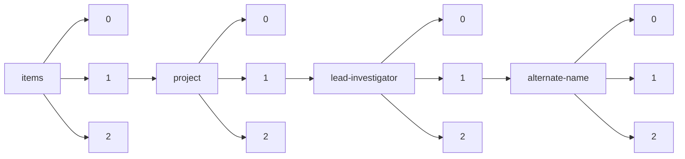

!!! warning "This document is not official Crossref documentation"
# Elements
PATH = items/array/project/array/lead-investigator/array/alternate-name/array(1)  
Occurs 15 times  
Unique values: 9  
{ .annotate }

1. A route to an element, for example:  
   The route "items/array/project/array/lead-investigator/array/alternate-name/array" corresponds to navigating through the JSON indices as  
   ["items"][0]["project"][0]["lead-investigator"][0]["alternate-name"][0]  

| **Row** | **Value** `String` | **Count** `Int64` |
|--------:|----------------------:|---------------------:|
| **1**   | Minnie Cat            | 6                    |
| **2**   | BB Burtenson          | 2                    |
| **3**   | Elvis Slozzuffer      | 1                    |
| **4**   | Michael Lynch         | 1                    |
| **5**   | Buzz Baum             | 1                    |
| **6**   | Galen Halverson       | 1                    |
| **7**   | Andrew Roger          | 1                    |
| **8**   | Paula Welander        | 1                    |
| **9**   | Brett J. Baker        | 1                    |

