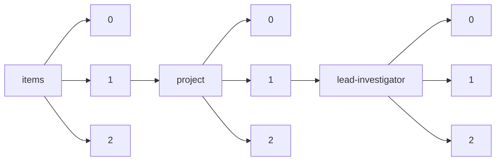

!!! warning "This document is not official Crossref documentation"
# Elements
PATH = items/array/project/array/lead-investigator/array(1)  
Occurs 28 052 times  
{ .annotate }

1. A route to an element, for example:  
   The route "items/array/project/array/lead-investigator/array" corresponds to navigating through the JSON indices as  
   ["items"][0]["project"][0]["lead-investigator"][0]  

## ORCID
See more information: [items/array/project/array/lead-investigator/array/ORCID](ORCID/index.md)  
Occurs 3 545 timess  
Unique values: > 999  

!!! note "Due to current limitations, only the first 1,000 unique values are counted."

| **Row** | **Value** `String`                | **Count** `Int64` |
|--------:|-------------------------------------:|---------------------:|
| **1**   | http://orcid.org/0000-0003-0309-9184 | 8                    |
| **2**   | http://orcid.org/0000-0003-3618-0843 | 7                    |
| **3**   | http://orcid.org/0000-0002-4011-3590 | 7                    |
| **4**   | http://orcid.org/0000-0002-3200-7173 | 7                    |
| **5**   | http://orcid.org/0000-0002-9822-1586 | 7                    |
| **6**   | http://orcid.org/0000-0001-7680-2200 | 5                    |
| **7**   | http://orcid.org/0000-0003-2199-4449 | 4                    |
| **8**   | http://orcid.org/0000-0003-4313-3500 | 4                    |
| **9**   | http://orcid.org/0000-0002-9879-5758 | 4                    |
| **10**  | http://orcid.org/0000-0002-9070-8349 | 4                    |
| ... | ... | ... |

## Affiliation
See more information: [items/array/project/array/lead-investigator/array/affiliation](affiliation/index.md)  
Occurs 28 052 timess  

| **Row** | **Length** `Any` | **Count** `Int64` |
|--------:|--------------------:|---------------------:|
| **1**   | 0                   | 10 515               |
| **2**   | 1                   | 17 536               |
| **3**   | 2                   | 1                    |

## Alternate-name
See more information: [items/array/project/array/lead-investigator/array/alternate-name](alternate-name/index.md)  
Occurs 15 timess  

| **Row** | **Length** `Any` | **Count** `Int64` |
|--------:|--------------------:|---------------------:|
| **1**   | 1                   | 15                   |

## Authenticated-orcid
See more information: [items/array/project/array/lead-investigator/array/authenticated-orcid](authenticated-orcid/index.md)  
Occurs 3 545 timess  
Unique values: 1  

| **Row** | **Value** `Bool` | **Count** `Int64` |
|--------:|--------------------:|---------------------:|
| **1**   | false               | 3 545                |

## Family
See more information: [items/array/project/array/lead-investigator/array/family](family/index.md)  
Occurs 27 686 timess  
Unique values: > 999  

!!! note "Due to current limitations, only the first 1,000 unique values are counted."

| **Row** | **Value** `String` | **Count** `Int64` |
|--------:|----------------------:|---------------------:|
| **1**   | Wang                  | 175                  |
| **2**   | 佐藤                  | 116                  |
| **3**   | 田中                  | 116                  |
| **4**   | 鈴木                  | 99                   |
| **5**   | Smith                 | 88                   |
| **6**   | Li                    | 82                   |
| **7**   | Liu                   | 78                   |
| **8**   | 中村                  | 78                   |
| **9**   | 高橋                  | 77                   |
| **10**  | 伊藤                  | 74                   |
| ... | ... | ... |

## Given
See more information: [items/array/project/array/lead-investigator/array/given](given/index.md)  
Occurs 27 072 timess  
Unique values: > 999  

!!! note "Due to current limitations, only the first 1,000 unique values are counted."

| **Row** | **Value** `String` | **Count** `Int64` |
|--------:|----------------------:|---------------------:|
| **1**   | David                 | 472                  |
| **2**   | Michael               | 350                  |
| **3**   | John                  | 326                  |
| **4**   | James                 | 293                  |
| **5**   | Robert                | 221                  |
| **6**   | Thomas                | 214                  |
| **7**   | Daniel                | 201                  |
| **8**   | Richard               | 174                  |
| **9**   | Steven                | 165                  |
| **10**  | Peter                 | 162                  |
| ... | ... | ... |

## Role-end
See more information: [items/array/project/array/lead-investigator/array/role-end](role-end/index.md)  
Occurs 26 timess  

## Role-start
See more information: [items/array/project/array/lead-investigator/array/role-start](role-start/index.md)  
Occurs 27 timess  

