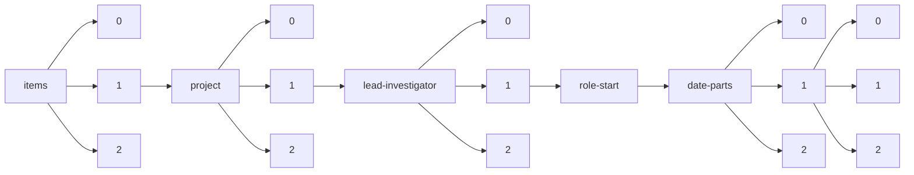

!!! warning "This document is not official Crossref documentation"
# Elements
PATH = items/array/project/array/lead-investigator/array/role-start/date-parts/array/array(1)  
Occurs 81 times  
Unique values: 23  
{ .annotate }

1. A route to an element, for example:  
   The route "items/array/project/array/lead-investigator/array/role-start/date-parts/array/array" corresponds to navigating through the JSON indices as  
   ["items"][0]["project"][0]["lead-investigator"][0]["role-start"]["date-parts"][0][0]  

| **Row** | **Value** `Int64` | **Count** `Int64` |
|--------:|---------------------:|---------------------:|
| **1**   | 1                    | 31                   |
| **2**   | 2 020                | 6                    |
| **3**   | 4                    | 5                    |
| **4**   | 9                    | 4                    |
| **5**   | 10                   | 4                    |
| **6**   | 2 011                | 3                    |
| **7**   | 2 013                | 3                    |
| **8**   | 2 015                | 3                    |
| **9**   | 5                    | 2                    |
| **10**  | 6                    | 2                    |
| **11**  | 2 018                | 2                    |
| **12**  | 3                    | 2                    |
| **13**  | 2 022                | 2                    |
| **14**  | 2                    | 2                    |
| **15**  | 2 016                | 2                    |
| **16**  | 2 023                | 1                    |
| **17**  | 8                    | 1                    |
| **18**  | 2 017                | 1                    |
| **19**  | 2 014                | 1                    |
| **20**  | 2 012                | 1                    |
| **21**  | 15                   | 1                    |
| **22**  | 2 019                | 1                    |
| **23**  | 2 021                | 1                    |

