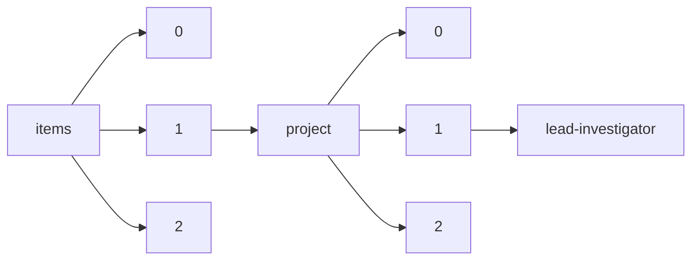

!!! warning "This document is not official Crossref documentation"
# Lead-investigator
PATH = items/array/project/array/lead-investigator(1)  
Occurs 27 748 times  
{ .annotate }

1. A route to an element, for example:  
   The route "items/array/project/array/lead-investigator" corresponds to navigating through the JSON indices as  
   ["items"][0]["project"][0]["lead-investigator"]  

## Properties of Array
See information about elements: [items/array/project/array/lead-investigator/array](array/index.md)  
Distribution of lengths:  

| **Row** | **Length** `Any` | **Count** `Int64` |
|--------:|--------------------:|---------------------:|
| **1**   | 1                   | 27 587               |
| **2**   | 2                   | 105                  |
| **3**   | 3                   | 22                   |
| **4**   | 4                   | 9                    |
| **5**   | 5                   | 7                    |
| **6**   | 6                   | 14                   |
| **7**   | 7                   | 2                    |
| **8**   | 10                  | 2                    |

