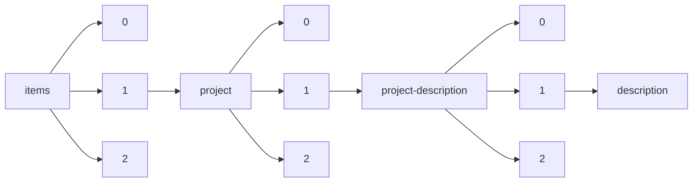

!!! warning "This document is not official Crossref documentation"
# Description
PATH = items/array/project/array/project-description/array/description(1)  
Occurs 58 938 times  
Unique values: > 999  
{ .annotate }

1. A route to an element, for example:  
   The route "items/array/project/array/project-description/array/description" corresponds to navigating through the JSON indices as  
   ["items"][0]["project"][0]["project-description"][0]["description"]  

!!! note "Due to current limitations, strings longer than 1,000 characters are truncated, which may lead to inaccurate calculations."

!!! note "Due to current limitations, only the first 1,000 unique values are counted."

| **Row** | **Value** `String`                                                                                                                                                                                    | **Count** `Int64` |
|--------:|---------------------------------------------------------------------------------------------------------------------------------------------------------------------------------------------------------:|---------------------:|
| **1**   | No Data Entered                                                                                                                                                                                          | 802                  |
| **2**   | In support of the postdoctoral fellow's salary, fringe benefits and research plan.                                                                                                                       | 102                  |
| **3**   | To be submitted later                                                                                                                                                                                    | 42                   |
| **4**   | #N/A                                                                                                                                                                                                     | 24                   |
| **5**   | Optic pathway gliomas (OPGs) are low-grade astrocytomas that occur commonly in children with neurofi                                                                                                     | 23                   |
| **6**   | Not available                                                                                                                                                                                            | 14                   |
| **7**   | One of nine initial node establishment projects in the\n                    HeSANDA infrastructure ne                                                                                                    | 9                    |
| **8**   | The NF Preclinical Consortium aim is repurposing available cancer drugs or advanced development phas                                                                                                     | 9                    |
| **9**   | The NF Therapeutic Consortium aim is repurposing available cancer drugs or advanced development phas                                                                                                     | 8                    |
| **10**  | SYNODOS is a first-of-its-kind NF research collaboration dedicated to defeating the rare genetic dis                                                                                                     | 6                    |
| **11**  | ALS is not just a rare disease but is also quite heterogenous (patients present with different sympt                                                                                                     | 6                    |
| **12**  | Imperial College London - Theoretical Systems Biology and Bioinformatics                                                                                                                                 | 6                    |
| **13**  | Cambridge - Infection, Immunity and Inflammation                                                                                                                                                         | 5                    |
| **14**  | Our group has a dedicated Neurofibromatosis program (Directed by Dr. Zadeh, Dr. Aldape, Dr. Kim, and                                                                                                     | 5                    |
| **15**  | The NF1 Porcine Model Collaborative Research Program (NF1-PRP) will strive to substantially contribu                                                                                                     | 5                    |
| **16**  | University of Nottingham and University of Birmingham - Antimicrobials and Antimicrobial Resistance                                                                                                      | 4                    |
| **17**  | MPNSTs have very poor prognosis as they do not respond to standard chemo- or radiation therapy and h                                                                                                     | 4                    |
| **18**  | The Marie Skłodowska-Curie actions pay particular attention to physical accessibility and inclusion                                                                                                      | 4                    |
| **19**  | University of Edinburgh - Tissue Repair                                                                                                                                                                  | 3                    |
| **20**  | not provided                                                                                                                                                                                             | 3                    |
| **21**  | University College London/Birkbeck Interdisciplinary Programme in Structural, Computational and Chem                                                                                                     | 3                    |
| **22**  | &lt;p&gt;University of Cambridge 4 Year PhD Programme - Developmental Mechanisms&lt;/p&gt;                                                                                                               | 3                    |
| **23**  | Oxford - Genomic Medicine and Statistics                                                                                                                                                                 | 3                    |
| **24**  | Infectious diseases remain a major contributor to the global burden of disease, with HIV, malaria, m                                                                                                     | 3                    |
| **25**  | In a field study, blood samples were collected from members of a large and extended family with NF1.                                                                                                     | 2                    |
| **26**  | University of Cambridge 4 Year PhD Programme - Developmental Mechanisms                                                                                                                                  | 2                    |
| **27**  | 本研究では「圧縮線形代数」という、高速かつ省メモリで演算を行える新しい学問領域を提案する。圧縮線形代数では、ベクトル・行列を圧縮し、省メモリでそれらを表現する。そして、圧縮した状態のままで行列積計算な | 2                    |
| **28**  | Immunotherapies are at the forefront of treatment for many solid tumors including lung or melanoma.                                                                                                      | 2                    |
| **29**  | The circadian clock is a critical regulator of physiology and behavior, and its disruption leads to                                                                                                      | 2                    |
| **30**  | Transcriptional regulation is the dominant mode of regulation of embryonic development. Critical tra                                                                                                     | 2                    |
| **31**  | Two interrelated Witness Seminars on the history of the British NHS are proposed. The subjects are:                                                                                                      | 2                    |
| **32**  | University of Cambridge - Metabolic and Cardiovascular Disease                                                                                                                                           | 2                    |
| **33**  | Multiple myeloma (MM) is an aggressive type of cancer of plasma cells where fast diagnosis and treat                                                                                                     | 2                    |
| **34**  | Este é um exemplo de uma descrição ou resumo do projeto. Várias descrições podem ser fornecidas para                                                                                                     | 2                    |
| **35**  | The Trust’s major directions for use of this Fund are as follows: 1. To assist the Institution in de                                                                                                     | 2                    |
| **36**  | 本研究では「走れば走るほど賢くなる自動運転システム」の構築を目指します。ここでいう「賢い」とは、コンピュータによる自律的な認知・判断・操作を行うにとどまらず、周囲の危険と自車の異常を予測できる能力を含 | 2                    |
| **37**  | In order to further improve the selection process for NF2 drugs, there is a need for better NF2 anim                                                                                                     | 2                    |
| **38**  | NITAGs (National Immunization Technical Adviory Groups), by providing evidence-based recommendations                                                                                                     | 2                    |
| **39**  | The O2 Taskforce is coordinating access to emergency oxygen for COVID-19 patients in LMICs. Since th                                                                                                     | 2                    |
| **40**  | Agile best practices, thought leadership collective impact impact investing to families. And equal o                                                                                                     | 2                    |
| **41**  | &lt;p&gt;How do our bodies develop parts of such different sizes and shapes? We wish to learn the ba                                                                                                     | 2                    |
| **42**  | The Hippo pathway is known for its crucial role in organ size control via restricting cell prolifera                                                                                                     | 2                    |
| **43**  | &lt;p&gt;To be submitted later&lt;/p&gt;                                                                                                                                                                 | 2                    |
| **44**  | McDonnell Scholar in Molecular Medicine in Cancer Research.                                                                                                                                              | 2                    |
| **45**  | Fellowship support and administrative costs for the Molecular Medicine in Cancer Research Program.                                                                                                       | 2                    |
| **46**  | Art conservators and Cultural Heritage preservation institutions need more analytical means to contr                                                                                                     | 2                    |
| **47**  | Leeds - Molecular Basis of Biological Mechanisms.                                                                                                                                                        | 2                    |
| **48**  | see MRC application                                                                                                                                                                                      | 2                    |
| **49**  | &lt;p&gt;Cells use multiple mechanisms to ensure that chromosomes are segregated with high fidelity                                                                                                      | 2                    |
| **50**  | Liverpool Clinical PhD Programme: Health Priorities in Resource Limited Settings                                                                                                                         | 2                    |
| **51**  | Background: The tenth epidemic of EVD in the Democratic Republic of the Congo, affecting the provinc                                                                                                     | 2                    |
| **52**  | Public Health Economics and Decision Science                                                                                                                                                             | 2                    |
| **53**  | &lt;p&gt;Jede\*r kennt es: das Spielzeug mit einer Kugel, einem Würfel und einem Zylinder, die in daf                                                                                                    | 2                    |
| **54**  | &lt;p&gt;The vast amount of big data in communication networks has opened a new era of data-driven s                                                                                                     | 2                    |
| **55**  | &lt;p&gt;Das Österreichische Institut für angewandte Telekommunikation (ÖIAT) arbeitet seit 25 Jahre                                                                                                     | 2                    |
| **56**  | Our aim is to reduce the huge burden of HIV and TB in KwaZulu-Natal as a precursor to the eradicatio                                                                                                     | 2                    |
| **57**  | SYNODOS is a first-of-its-kind NF research collaboration dedicated to defeating the rare genetic dis                                                                                                     | 2                    |
| **58**  | Our project investigates health risks, medical interventions and health care in English and Irish pr                                                                                                     | 2                    |
| **59**  | Molecular, Genetic and Lifecourse Epidemiology                                                                                                                                                           | 2                    |
| **60**  | This project includes twelve diverse areas of work conducted by WHO to increase epidemic preparednes                                                                                                     | 2                    |
| **61**  | Large-scale WGS of the UK Biobank cohort to generate and evaluate therapeutic hypotheses regarding t                                                                                                     | 2                    |
| **62**  | Modern human brain imaging techniques allow us to listen with previously unparalleled precision to t                                                                                                     | 2                    |
| **63**  | The overall goal of this proposal is to leverage the collective expertise of an international consor                                                                                                     | 2                    |
| **64**  | Vacation Scholarships Institutional Award                                                                                                                                                                | 2                    |
| **65**  | The goal of this course is to provide trainees with an up-to-date and expert survey of neuromuscular                                                                                                     | 2                    |
| **66**  | &lt;p&gt;2020 hat das Wien Museum mit Bleed Design Studio als Partner seine Online Sammlung komplett                                                                                                     | 2                    |
| **67**  | Transport coefficients govern the irreversible flow of extensive, conserved quantities, like mass, m                                                                                                     | 1                    |
| **68**  | Remembering where things are, for example, where you parked your car, is essential in everyday life.                                                                                                     | 1                    |
| **69**  | As nationalisms conspire and sectarians around the world rise against coordinated supra-national ord                                                                                                     | 1                    |
| **70**  | SYS2WHEEL will provide brand-independent components and systems for integrated 3rd generation commer                                                                                                     | 1                    |
| **71**  | SWITCH aims to answer the challenge of climate-neutral short-medium range air transport by developin                                                                                                     | 1                    |
| **72**  | The use of Thermal Energy Storage (TES) in combination with the thermal conversion of solar irradiat                                                                                                     | 1                    |
| **73**  | Cancers are outgrowths of abnormal cells driven by a malignant evolutionary programme and supported                                                                                                      | 1                    |
| **74**  | &lt;p&gt;This research project aims to study the implications of so-called "toolkits for user innova                                                                                                     | 1                    |
| **75**  | Modern astronomy has truly entered the exoplanet era. Although our knowledge of what planet formatio                                                                                                     | 1                    |
| **76**  | This research proposal aims to address the question of whether the Nrf2 transcription factor pathway                                                                                                     | 1                    |
| **77**  | The current seismic design philosophy of reinforced concrete (RC) walls typically requires large ine                                                                                                     | 1                    |
| **78**  | 低温形成（150℃以下）・逆型構造で形成したペロブスカイト太陽電池として初めて、20％を超える変換効率を実現した。その基礎研究の成果を利用し、高効率なモジュール化技術の開発及び、性能の検証を行う。           | 1                    |
| **79**  | タンパク質機能を構造学的に解明できれば、ゲノム創薬、健康・機能性食品、低環境負荷型工業など広範な産業分野においてタンパク質利用の発展が期待できます。しかし、精密構造の決定に必須な高品位タンパク質結晶の | 1                    |
| **80**  | The LIFELONGMOVE project is the first of its kind to comprehensively and systematically examine spat                                                                                                     | 1                    |
| **81**  | Weak intermolecular interactions are the driving force of relevant processes including protein foldi                                                                                                     | 1                    |
| **82**  | EUCLEG aims to reduce Europe and China’s dependency on protein imports by developing efficient breed                                                                                                     | 1                    |
| **83**  | Agro2Circular (A2C) project is focused on the implementation of the first territorial systemic solut                                                                                                     | 1                    |
| **84**  | The objective of MYOCURE is to develop an innovative gene therapy platform to cure rare hereditary m                                                                                                     | 1                    |
| **85**  | Energy and Mobility are two primary driving forces in the 21st century. Development of incremental a                                                                                                     | 1                    |
| **86**  | NVセンタはスピン依存発光を持つ原子サイズのセンサーとして、観測対象にナノメートルの領域まで近づけることができる量子計測材料として注目されています。しかし、分子状態解析等NVセンタを用いた生体計測応用     | 1                    |
| **87**  | UrbanCLIM was designed as a decision support system for climate change in urban areas, to enable ris                                                                                                     | 1                    |
| **88**  | Pancreatic ductal adenocarcinoma (PDAC) and hepatocellular carcinoma (HCC) are leading causes of can                                                                                                     | 1                    |
| **89**  | 本提案研究は，⾃治体が保有する保健・医療・介護・⾏政等の健康関連データを住⺠単位で統合したデータベース（LIFE DB）を構築し，今後20 年間に渡り追跡評価することで，ライフコース健康学を創出するも           | 1                    |
| **90**  | Immunotherapy has been a huge success in cancer treatment, especially in melanoma. However, only a s                                                                                                     | 1                    |
| **91**  | Older adults often report feelings of dizziness. Dizziness can disrupt balance and increase the like                                                                                                     | 1                    |
| **92**  | Diffuse large B-cell lymphoma (DLBCL) accounts for over one-third of lymphomas and is fatal in up to                                                                                                     | 1                    |
| **93**  | The University of Liverpool (UoL) and its vicinity lacks in vivo nuclear and CT imaging capability f                                                                                                     | 1                    |
| **94**  | This project will involve investigating the effects of intracellular sodium on the gene expression i                                                                                                     | 1                    |
| **95**  | TheMotion is the most cost-efficient platform to massively and instantly produce personalised video                                                                                                      | 1                    |
| **96**  | Insect pests are very damaging to worldwide food production, and there is a great demand for new env                                                                                                     | 1                    |
| **97**  | Typhoid fever is a common cause of non-specific febrile illness in low-resource settings. Empirical                                                                                                      | 1                    |
| **98**  | &lt;p&gt;Faithful genome transmission in dividing cells relies on correct attachment of all chromoso                                                                                                     | 1                    |
| **99**  | 本研究では微小液滴作製技術を応用し、ウイルス1粒子ゲノム情報の網羅的な獲得を可能にする技術の開発を目指します。水圏環境中のウイルス粒子の高精度ゲノム情報をハイスループットに取得することで、未知ウイルス  | 1                    |
| **100** | 本研究の目的は、材料を溶融凝固させる際に従来に無い大きな過冷却状態を実現させ、この状態から非平衡状態で存在する新たな物質や材料を創製することにあります。そのため、微小重力の力を借りた無接触浮遊溶解炉や | 1                    |
| **101** | "As of today, 80% of the data processing and analysis occurs in cloud data centers, and only 20% of                                                                                                      | 1                    |
| **102** | Fire has long been used in SEAsia. Climate change and economic pressures, however, has changed the w                                                                                                     | 1                    |
| **103** | Photochromic materials capable of undergoing reversible colour changes upon irradiation of light hav                                                                                                     | 1                    |
| **104** | Quantum processors are envisioned to conquer ultimate challenges in information processing and to en                                                                                                     | 1                    |
| **105** | Human social interaction and learning depends on making the right inferences about other people’s th                                                                                                     | 1                    |
| **106** | This project is designed to directly address a technique/technology gap that has prevented us from a                                                                                                     | 1                    |
| **107** | Despite recent progress in treatment options, melanoma remains a deadly disease.  Drugs have been id                                                                                                     | 1                    |
| **108** | In the so-called ‘age of information’, information and communication systems (ICT) are the backbone                                                                                                      | 1                    |
| **109** | ウイルスと人体の相互作用ネットワークを解析し、そのパタンを分類整理することにより、未知のウイルス感染症に対しても有効な診断・予防・治療法を先制的に準備します。それにより、2050年には、ウイルス感染症     | 1                    |
| **110** | Fundamental properties of 2D materials are dramatically modified when they are brought next to each                                                                                                      | 1                    |
| **111** | Myasthenia gravis (MG) is a rare disease affecting 2/10.000 people. Although being a rare disease, M                                                                                                     | 1                    |
| **112** | Threatened by climate change, mankind is facing increasing demands for energy (generation, conversio                                                                                                     | 1                    |
| **113** | Vegea is a young start-up with a solid chemical background with long experience in natural polymers                                                                                                      | 1                    |
| **114** | Despite significant efforts and recent advances in detection and treatment, cancer remains a devasta                                                                                                     | 1                    |
| **115** | This project (PHOLED) will concentrate on lead-free halide perovskite nanomaterials for their light-                                                                                                     | 1                    |
| **116** | The overall goal of DiverIMPACTS is to achieve the full potential of diversification of cropping sys                                                                                                     | 1                    |
| **117** | Nervous systems produce adaptive behavior, arguably their most important function, through learning                                                                                                      | 1                    |
| **118** | Life Science is turning into a data-driven and HPC dependent research field. BioTeam/Hyperion’s 2022                                                                                                     | 1                    |
| **119** | 輸送用機器や産業機器に広く利用されている構造用薄板には、高強度であり塑性加工性にも優れていることが必要です。本研究では、ミクロ結晶粒とサブミクロン結晶粒の混合組織であるバイモーダル結晶組織を、新たなコ | 1                    |
| **120** | MDLab (Modeling Dielectric Laboratory) has developed a novel micro- and nano-electronic devices simu                                                                                                     | 1                    |
| **121** | We have developed a novel high-throughput protocol for the sensitive and accurate quantification of                                                                                                      | 1                    |
| **122** | Myocardial viability determined by MR imaging Determination of myocardial viability, the differentia                                                                                                     | 1                    |
| **123** | バルク状態での性質は知り尽くされている金属も、構造を原子スケールで低次元化すると、低次元電子系に特有の様々な現象が発現し、従来の金属とは全く異なる機能を有した新しい材料へと変貌する可能性を秘めています | 1                    |
| **124** | RNA base editing is a promising approach to manipulate genetic information in a transient and dosabl                                                                                                     | 1                    |
| **125** | Bacteria are becoming increasingly resistant to antibiotics, posing a significant threat to global h                                                                                                     | 1                    |
| **126** | Since children in their early years have little vocabulary, it can be difficult to understand how ch                                                                                                     | 1                    |
| **127** | Insecticide Treated Nets (ITNs) are the front line strategy for malaria vector control in Sub-Sahara                                                                                                     | 1                    |
| **128** | Duchenne's Muscular Dystrophy (DMD) is an incurable, genetic disease caused by mutations in the DMD                                                                                                      | 1                    |
| **129** | Awareness of time is essential to our sense of self and fundamentally shapes our engagement with the                                                                                                     | 1                    |
| **130** | It is estimated that 20% of storage tank accidents are caused by cracks or raptures on the tank stru                                                                                                     | 1                    |
| **131** | Head and neck cancer (HNC) is the world’s sixth most common cancer and is rising in incidence, more                                                                                                      | 1                    |
| **132** | Electron paramagnetic resonance (EPR) is a powerful spectroscopy method which allows to identify par                                                                                                     | 1                    |
| **133** | An important class of inherited neurodegenerative diseases are caused by the expansion of a translat                                                                                                     | 1                    |
| **134** | Pentameric ligand-gated ion channels (pLGICs), including nicotinic acetylcholine, 5HT3, glycine, and                                                                                                     | 1                    |
| **135** | The manner in which fungi rapidly evolve and adapt to stress in a host is essential for understandin                                                                                                     | 1                    |
| **136** | Animals display a tremendous diversity of patterns ‒from the colourful designs that adorn their body                                                                                                     | 1                    |
| **137** | 人と共有した空間を自由に動けるモビリティ「Human Symbiotic Mobility」のための社会システムデザインを目的とする。移動ロボットには,駅構内や空港など人が密集した場所でも制約を受けず                          | 1                    |
| **138** | Development of a national network to support Imaging Scientists to enable to UK to remain at the for                                                                                                     | 1                    |
| **139** | The overarching goal of INCOGNITO is to combine state-of-the-art technologies in a platform that wil                                                                                                     | 1                    |
| **140** | We believe that the essential character of cancer is best understood as a complex adaptive system. I                                                                                                     | 1                    |
| **141** | &lt;p&gt;Mitochondria, long recognized as the &amp;ldquo;powerhouse of the cell&amp;rdquo;, have att                                                                                                     | 1                    |
| **142** | White-Nose Syndrome (WNS) is a fungal disease affecting bats during hibernation. Since 2007, an esti                                                                                                     | 1                    |
| **143** | DYNASTY’s primary objective is to build in the European South East, and in particular in the Foundat                                                                                                     | 1                    |
| **144** | 電荷捕捉と色素の光退色は、有機系太陽電池の効率化、長期安定動作を阻む最も大きな問題です。しかし実際の太陽電池では、試料の空間不均一性により、その因子の直接的解明は困難でした。本研究では、新規の超高速時 | 1                    |
| **145** | This study aims to determine the role of lactate in PD-1/PD-L1 therapy resistance and develop a new                                                                                                      | 1                    |
| **146** | Topological quantum computation (TQC) deals with the transformations related to the overall shape (“                                                                                                     | 1                    |
| **147** | In this project I propose to take advantage of the enormous potential created by the recent material                                                                                                     | 1                    |
| **148** | Ray Techniques Ltd. is engaged in the fabrication of nanodiamonds (ND) and ND compounds by an innova                                                                                                     | 1                    |
| **149** | This study aims to investigate the first of many widely publicised, detailed reports concerning inad                                                                                                     | 1                    |
| **150** | Attention deficit/hyperactivity disorder (ADHD) and autism spectrum disorders (ASD) are frequent, ch                                                                                                     | 1                    |
| **151** | &lt;p&gt;After people have been infected with varicella zoster virus, which causes chickenpox and sh                                                                                                     | 1                    |
| **152** | 本研究では、窒素固定能を持つ糸状性ラン藻Anabaena sp. PCC 7120株で、ポリケチド合成酵素を用いた脂質生産を行います。この株は、窒素欠乏条件でポリケチド合成酵素によって脂質の一種、超長                      | 1                    |
| **153** | 3-ヒドロキシチロソール（HTY）は抗ウィルス活性を有する天然ポリフェノールである。オリーブからの抽出や化学合成によって製造されるが非常に高価である。そこで申請者はHTYを合成できる菌株を開発し、発酵         | 1                    |
| **154** | The astonishing properties of the f-elements have been exploited in numerous consumer technologies,                                                                                                      | 1                    |
| **155** | Hundreds of studies have shown that people often fail to see directly in front of them, especially w                                                                                                     | 1                    |
| **156** | 免疫系には、広範な免疫抑制活性を示す制御性T細胞とよばれるT細胞サブセットが存在し、自己免疫、炎症、アレルギーなどの有害な免疫応答を負に制御して生体のホメオスタシスの維持に必須の機能を担っています。こ   | 1                    |
| **157** | We aim to investigate the role of SUMOylation in synaptic kainate receptor plasticity at the mossy f                                                                                                     | 1                    |
| **158** | Essentially all materials microstructures are three-dimensional (3D). In spite of this, by far the m                                                                                                     | 1                    |
| **159** | ウイルスと細胞間での宿主域決定の分子機構、ウイルス遺伝子で宿主に働きかける遺伝子や、アポトーシスに関与した遺伝子の同定と解析を行います。また、さまざまなレパートリーを持つ抗体遺伝子をバキュロウイルス粒 | 1                    |
| **160** | The key objective of this proposal is to establish a new Laboratory for Advanced Materials (LAM) at                                                                                                      | 1                    |
| **161** | Myofibril assembly in sarcomeric muscle is an exquisitely regulated process, yet is poorly understoo                                                                                                     | 1                    |
| **162** | Individuals diagnosed with the genetic condition neurofibromatosis type 1 (NF1) have a mutation in t                                                                                                     | 1                    |
| **163** | Intraocular treatments require manipulation of structures with dimensions comparable to hand tremor.                                                                                                     | 1                    |
| **164** | 高速原子間力顕微鏡 (高速AFM) は、わが国で開発され、単一のタンパク質やDNA分子の3次元構造の経時変化(4次元構造)を観察できる唯一の計測技術です。中程度の分解能をもつ高速AFM計測から高精度情                  | 1                    |
| **165** | 休眠は低代謝状態になることで動物がエネルギー供給不足を切り抜ける生存戦略です。休眠中は通常では死に至るような低代謝状態となりますが、その低代謝適応能の原理を解明し応用することで、現在の医療では救命でき | 1                    |
| **166** | As the body’s control center, the brain integrates complex sensory information and rapidly responds                                                                                                      | 1                    |
| **167** | The emergence of participatory governance has resulted in the delegation of governmental responsibil                                                                                                     | 1                    |
| **168** | Metastatic disease and its associated complications are responsible for the vast majority of cancer-                                                                                                     | 1                    |
| **169** | Intelligent agents make good decisions in novel environments. Understanding how humans deal with nov                                                                                                     | 1                    |
| **170** | Carbon-free hydrogen represents one of the pillars of global energy transformation. However, higher                                                                                                      | 1                    |
| **171** | Developing brain implants is crucial to better decipher the neuronal information and intervene in a                                                                                                      | 1                    |
| **172** | The global vision of Smart and Sustainable Cities is greatly restricted by the rapid increase of int                                                                                                     | 1                    |
| **173** | 最近、慢性疾患ではIL-33と呼ばれる情報伝達物質(サイトカイン)が体内で放出されることがわかってきました。私たちが発見したナチュラルヘルパー(NH)細胞はIL-33に反応すると、免疫関連疾患を誘導す                 | 1                    |
| **174** | Every year around 4 million people die in the EU as a result of chronic disease and illness. Many wi                                                                                                     | 1                    |
| **175** | 大脳の発生過程において、多くの細胞が死んでいることが知られています。最近、その中でも神経系前駆細胞が沢山死んでいることがわかってきました。細胞死を抑制すると異常な脳になることから、生死制御が脳発生上重 | 1                    |
| **176** | 本研究では、多様な情報と人々を結びつけて新たな機会創出や価値創造を促すソーシャルメディアに関して、それが抱える「社会的分離」と「情報の同質化助長」という社会的課題の克服に挑戦します。「多次元の弱い紐帯 | 1                    |
| **177** | 腸内腔の情報（腸内感覚）は意識に上りませんが、生体恒常性の維持に必須のシグナルです。本研究では、腸内感覚がどのような感覚細胞とニューロン群の相互作用により脳に伝達されるかを、解剖・生理学的定量解析を用 | 1                    |
| **178** | The MOTOR project focuses on ICT-enabled design optimization technologies for fluid energy machines                                                                                                      | 1                    |
| **179** | With its “Clean Energy for all Europeans” package (CEP), the European Commission formally recognised                                                                                                     | 1                    |
| **180** | University of Bristol - Dynamic Molecular Cell Biology                                                                                                                                                   | 1                    |
| **181** | バルクヘテロ接合型有機薄膜太陽電池の光電変換層において、p/n有機半導体それぞれの凝集による変換効率の頭打ちやデバイスの長期劣化などの問題が山積しています。本研究では、p/n有機半導体のどちらにも相溶       | 1                    |
| **182** | Control of gene expression is crucial for the development and survival of all animals. Incorrect gen                                                                                                     | 1                    |
| **183** | 情報化社会が進展してスマートフォンやタブレットなどの携帯情報端末が日常生活に不可欠なものになり、また電気自動車(EV)へのパラダイムシフトがグローバルに加速している。これらには現在、液体の電解質を持つ     | 1                    |
| **184** | This project is an interdisciplinary study of the role of indigenous knowledge in the making of scie                                                                                                     | 1                    |
| **185** | 塗るだけで抗菌・防かび・抗ウイルス性を付与できる塗布剤の開発を行う。抗菌・防かび・抗ウイルス性のポリヘキサメチレンビグアニド（PHMB）－酸化亜鉛ナノ粒子複合体を塗料等に添加することで、使途の広い機能     | 1                    |
| **186** | Creating trust in wireless solutions and increasing social acceptance are major challenges to achiev                                                                                                     | 1                    |
| **187** | The aim of this project is to lay the ground for an investigation of the traditional conception of c                                                                                                     | 1                    |
| **188** | "The Oil Catchpot System (OilCS) – an innovative mobile solution for Thermally Expended Graphite bas                                                                                                     | 1                    |
| **189** | 本研究では、ユーザにカスタマイズされた使いやすい音声対話システムの実現を目指します。具体的には、ユーザとの音声対話を通じて音声認識用モデルをシステムが自動更新し、はじめはわからなかった言葉や言い回しを | 1                    |
| **190** | The exploratory studies on sound-matter interaction are to date one of the most promising directions                                                                                                     | 1                    |
| **191** | 電子素子の極細化が進展するにつれ、電子の量子化が顕著となり、電子波のコヒーレンスの空間的な情報が重要な観測課題となります。本研究では近い将来において必要とされるこのような情報を、位相と振幅の両者より原 | 1                    |
| **192** | This project aims to fill important gaps in our existing knowledge of Heritage Language (HL) acquisi                                                                                                     | 1                    |
| **193** | 本研究では、量子通信路の可逆性、消失性を量子相互情報量の保存条件として考察することで、量子誤り訂正の性能評価や量子暗号プロトコルの安全性評価を統一的に扱うことを目指します。このとき、量子状態のコピーが | 1                    |
| **194** | "A central theme of extremal combinatorics is the interplay and relationship between the parameters                                                                                                      | 1                    |
| **195** | Microfluidics technology has revolutionised key applications like drug development, stem cell resear                                                                                                     | 1                    |
| **196** | Melanoma aggressiveness has been attributed to a core of therapeutically resistant cells within thes                                                                                                     | 1                    |
| **197** | Ecosystem responses that cause carbon loss to the atmosphere as a result of warmer climates and land                                                                                                     | 1                    |
| **198** | 本研究では、第一原理計算手法を駆使し、固体酸化物や金属、有機化合物を複合的に組み合わせることで出現する特異な反応場に着目し、メタンや低級アルカンの反応活性化に有効な触媒材料探索を試みます。具体的には、 | 1                    |
| **199** | ・微細藻類は高いCO2固定能を有するが、屋外培養においては 藻類捕食者等の混入が問題となっている。また、培養コストが ネックとなり、利用形態が高価な機能性食品等に限られている。 ・弱酸性化海水を利用し       | 1                    |
| **200** | Energy-efficient heterogeneous supercomputing architectures need to be coupled with a radically new                                                                                                      | 1                    |
| **201** | Xepholution is a cutting edge technology based on Artificial General Intelligence. Contrary to the s                                                                                                     | 1                    |
| **202** | This research tests the hypothesis that developmental exposure to highly potent synthetic &amp;Delta                                                                                                     | 1                    |
| **203** | EcoeFISHent demonstrates a replicable systemic and sustainable cluster for territorial deployment of                                                                                                     | 1                    |
| **204** | 正答に必要な能力がラベル付けされた言語理解データセットを構築し、システムの性能について言語理解の観点から説明性の高い精緻な評価を可能にします。ここで能力は自然言語処理で存立している基礎技術（照応解析・ | 1                    |
| **205** | A sustainable Circular Economy in the wind sector requires to solve the End of Life problematic of t                                                                                                     | 1                    |
| **206** | Coastal ecosystems and shallow marine environments are efficient and important blue carbon sinks, a                                                                                                      | 1                    |
| **207** | PETで用いられる短半減核種は、サイクロトロンを設置した大型の製造施設が必要であるため、利用できる施設が限られています。68Gaは、半減期が比較的長く、次世代の有用なPET用核種として注目されています           | 1                    |
| **208** | 多角入射分解分光法は、仮想的な縦波光を考えた全く新しい計測理論に基づく、薄膜・吸着分子の構造異方性解析のための分光法です。等式ではなく回帰式を理論構築に用いた点も、測定理論としては初の試みです。本研究 | 1                    |
| **209** | 本プロジェクトでは、CRISPR-Cas9ゲノム編集システムのDNA切断活性を独自の光スイッチたんぱく質で時間的・位置的に自由に光制御(オン/オフ)できる技術を基に、ゲノム編集のみならず遺伝子の転写発                  | 1                    |
| **210** | A recent Wall Street Journal article described the painful dilemma that faces brain tumor patients a                                                                                                     | 1                    |
| **211** | East London Genes &amp; Health is a long term programme for population genomic medicine research in                                                                                                      | 1                    |
| **212** | The regulation of retroviral latency and expression is a problem of central importance in naturally                                                                                                      | 1                    |
| **213** | The main objective of ADDIMOT project is to investigate additive manufacturing (AM) technologies to                                                                                                      | 1                    |
| **214** | The aim of UNION is to liberate machine learning, enabling everyone to use it productively and creat                                                                                                     | 1                    |
| **215** | Many types of migrating cells, upon collision with another cell, will subsequently be repelled in a                                                                                                      | 1                    |
| **216** | When ancestral plants colonized the land 450 million years ago, they needed to adapt to harsh enviro                                                                                                     | 1                    |
| **217** | Plate tectonics has been a fundamental tenet of Earth Science for nearly 50 years, but fundamental q                                                                                                     | 1                    |
| **218** | The PCaProTreat Project targets on improving the Prostate Cancer (PCa) management and focuses on the                                                                                                     | 1                    |
| **219** | The drive for rewards controls almost every aspect of our behavior, from stereotypic reflexive behav                                                                                                     | 1                    |
| **220** | ダイヤモンドのホモおよびヘテロエピタキシャル成長技術、微細加工技術の高精度化により、高電界、高周波でのデバイス動作を検討します。さらに表面吸着原子制御をnmスケールあるいは原子スケールで行い、他の半導   | 1                    |
| **221** | The cell surface is decorated with a diverse array of proteins and lipids that mediate essential cel                                                                                                     | 1                    |
| **222** | There is mounting evidence that general anesthetics, at clinically relevant doses, trigger widesprea                                                                                                     | 1                    |
| **223** | Barrier coatings and films are essential in many industries – like food/medical packaging, building                                                                                                      | 1                    |
| **224** | 近年、勤労世代のうつ病患者は増加し、大きな経済的損失をもたらしている。職場でのうつによる経済的損失の多くは、閾値下うつやプレゼンティーズムによることがわかっている。 そのために上記の目的を達成するため  | 1                    |
| **225** | Users often get exposed to security and privacy (SandP) threats when they use digital services for s                                                                                                     | 1                    |
| **226** | Qualified Foreign Institutional Investors (QFIIs) potentially import practices of shareholder activi                                                                                                     | 1                    |
| **227** | Engagement of the public in the discussion and investigation of the importance of the circadian body                                                                                                     | 1                    |
| **228** | Estimating small-scale and robust future climate extremes greatly depends on finer resolution of bot                                                                                                     | 1                    |
| **229** | First I aim to investigate symptom trajectories and pathways of change. I will follow-up a cohort of                                                                                                     | 1                    |
| **230** | Our understanding of cosmology and fundamental physics continues to be challenged by ever more preci                                                                                                     | 1                    |
| **231** | A quantum computer exploits quantum-mechanical effects such as superposition to solve hard mathemati                                                                                                     | 1                    |
| **232** | This interdisciplinary research project examines how anxiety impacts individual –level political att                                                                                                     | 1                    |
| **233** | Leelamine, a novel diterpene, exhibits potent cannabinoid-like behavioural effects in mice, however                                                                                                      | 1                    |
| **234** | Ribosome assembly is a highly dynamic process that involves extensive tightly regulated rRNA folding                                                                                                     | 1                    |
| **235** | Neuromuscular disease is an umbrella term encompassing over 160 different conditions characterized b                                                                                                     | 1                    |
| **236** | Biological nanopores are nanometre-scale holes in membranes created by transmembrane proteins. In na                                                                                                     | 1                    |
| **237** | One of the principal challenges to reaching targets of the Energy Transition (ET) is to improve the                                                                                                      | 1                    |
| **238** | I will ask 2 basic science and 2 translational questions that are key for understanding social cogni                                                                                                     | 1                    |
| **239** | テラヘルツ電磁波の偏光情報を用いることで観察できる光弾性計測によるプラスチック材料の内部応力検査、円偏光二色性計測による生体分子材料のキラリティー計測、超精密な表面形状計測などの材料物性評価を行い、そ | 1                    |
| **240** | Malaria parasites replicate asexually in the bloodstream of patients, causing all the symptoms of di                                                                                                     | 1                    |
| **241** | Cognitive control enables humans to flexibly adapt their behavior for goal achievement. Despite inte                                                                                                     | 1                    |
| **242** | Life on Earth relies to a large extent on light-matter interactions. Photosynthesis is indeed a bril                                                                                                     | 1                    |
| **243** | Everyday actions involve an amount of uncertainty in the final outcome they will deliver. Following                                                                                                      | 1                    |
| **244** | The medial entorhinal cortex (MEC) contains neurons that represent an animal's location in its envir                                                                                                     | 1                    |
| **245** | &lt;p&gt;Chronic diseases, such as stroke, heart disease, and cancer, are the leading causes of disa                                                                                                     | 1                    |
| **246** | 本研究では、ナノ金属クラスターを精密に分子構築するための分子設計概念の確立を行います。多座架橋配位子を活用して金属原子配列の次元性、サイズ、形状、異種金属原子配列を制御し、ナノ金属クラスターの精密分子 | 1                    |
| **247** | The COVID-19 pandemic has shown us the consequences of coronaviruses jumping from an animal into hum                                                                                                     | 1                    |
| **248** | ソーシャル・シグナルを共有及び拡張する人間拡張技術,それに伴う神経基盤の理解,及び実証研究を通じて人々の意図伝達を拡張し,他者理解を助け,また共感的行動を支援することが可能であることを示す.ここでは,       | 1                    |
| **249** | 農業用水の利用効率を格段に高めるため、作物吸水により発生するわずかな根圏域水圧差を利用した作物吸水ニーズ適応型の超節水精密農業技術を開発します。具体的には、根域の精密水分観測技術、オンラインリアルタイ | 1                    |
| **250** | We aim to study the previously unrecognised contribution to haematopoiesis made by the atypical chem                                                                                                     | 1                    |
| **251** | 本プログラム「機器開発タイプ」で開発した成果をもとに、生きた細胞や組織のラマンイメージをリアルタイムで観察可能な2次元多共焦点ラマン分光顕微鏡の実用化開発を行います。本顕微鏡は、励起ビームを20×20       | 1                    |
| **252** | The controlled fabrication of nano/micro metre-scale objects is without doubt one of today’s central                                                                                                     | 1                    |
| **253** | Epilepsy is one of the most common primary neurological conditions of childhood. Many of the severe                                                                                                      | 1                    |
| **254** | The amazing rate of progress in the computer technologies and telecommunications presents many new c                                                                                                     | 1                    |
| **255** | This project has the potential to ultimately deliver significant patient impact in the relatively ne                                                                                                     | 1                    |
| **256** | 本研究では、日本が主導して世界に発信した浮遊マイクロプラスチックの観測ガイドラインを汚染の最前線であるアセアン域内に適用可能な海洋プラスチック汚染の観測ガイドラインに発展させ標準化するとともに、得られ | 1                    |
| **257** | Internet is a significant driver for the economy nowadays. The impact of improved connectivity will                                                                                                      | 1                    |
| **258** | Our research interests include synaptic structure and function, synaptic circuitry and intracellular                                                                                                     | 1                    |
| **259** | 目に優しく、動的な画像を立体的に表示できる3次元立体ディスプレイやテレビへの強い要求がある。低電圧駆動あるいは無電界駆動で高い回折効率、高い光学利得ならびに高速応答性を持つフォトリフラクティブポリマー  | 1                    |
| **260** | The new fellowship programme “Connect with Wallonia – Come 2 Wallonia” (C2W) offers 30 2-year fellow                                                                                                     | 1                    |
| **261** | これまでに、アゾベンゼン誘導体のcis-trans光異性化反応に基づく構造変化を利用し、細胞分裂を光操作できる試薬の開発に成功した。本課題では、同様の戦略によって、細胞障害性の低い二種類の可視光を用い          | 1                    |
| **262** | 申請者らは，RNAウィルスを認識するToll様受容体7/8（TLR7/8）がほ乳類精子に発現すること，TLR7/8の活性化剤が体外受精系に混雑すると，サイトカインストームが発生し受精障害が起こることを                       | 1                    |
| **263** | Alcohol-related hepatocellular carcinoma (ALD-HCC) is, in Europe, the leading cause of liver cancer                                                                                                      | 1                    |
| **264** | When skin is injured, a repair response commences beginning with the formation of a blood clot, redu                                                                                                     | 1                    |
| **265** | BACKGROUND: South Asians (SAs) are up to 4-fold greater risk of cardiometabolic diseases, compared t                                                                                                     | 1                    |
| **266** | The rise of artificial intelligence is driving the fourth industrial revolution and is steadily disr                                                                                                     | 1                    |
| **267** | Through this APN project, project team has set up the “AWCI drought monitoring and research working                                                                                                      | 1                    |
| **268** | LoGov aims to form an international and intersectoral training and research network in order to prov                                                                                                     | 1                    |
| **269** | The potentially pathogenic growth-transforming property of EBV is usually curtailed by potent immune                                                                                                     | 1                    |
| **270** | Metastatic colorectal cancer (CRC) is a lethal disease. Current therapies involve surgery, or pallia                                                                                                     | 1                    |
| **271** | The proposed project CAMART2 is aimed to upgrade the existing “Excellence Centre of Advanced Materia                                                                                                     | 1                    |
| **272** | Information can harm people. Think of being denied mortgage or insurance based on your grocery shopp                                                                                                     | 1                    |
| **273** | The EUPEX consortium aims to design, build, and validate the first EU platform for HPC, covering end                                                                                                     | 1                    |
| **274** | The EuropeThe European Green Deal recognises seas, oceans, and environment are a source of natural a                                                                                                     | 1                    |
| **275** | 量子固体として知られる固体水素は、その光学遷移のスペクトル幅が極めて狭く孤立原子のそれと匹敵し、いわば「孤立分子(原子)の量子性と固体の高密度性をあわせ持つ」系となることが知られています。研究では、こ   | 1                    |
| **276** | DNA replication is an essential process for genome duplication, cell division and ultimately organis                                                                                                     | 1                    |
| **277** | Malignant melanoma is a form of cancer that in principle is prone to rejection by the immune system.                                                                                                     | 1                    |
| **278** | SCIENTIFIC SUBSTANCE AND SIGNIFICANCE\nIntroduction\nWe propose to develop antigen-specific T cells as                                                                                                   | 1                    |
| **279** | Nemaline myopathy (NM) is a severe disorder associated with muscle weakness that results in impairme                                                                                                     | 1                    |
| **280** | Following an extensive historiographical survey and archival research, I will complete an 80,000-100                                                                                                     | 1                    |
| **281** | AirBnb has disrupted the travel industry by empowering ordinary people. Those ordinary people became                                                                                                     | 1                    |
| **282** | This project aims to develop safe and effective methods to spread beneficial genes through a mosquit                                                                                                     | 1                    |
| **283** | エンベロープを有する新型コロナウイルスに対する高感度検出法を創出します。ウイルスを吸脱着する新素材を開発し、効率的濃縮法を確立します。これらを、ウイルスを阻止しつつ高い吸着能・高い透水性を有する自己組 | 1                    |
| **284** | The popularity of in vitro fertilisation (IVF) is growing with techniques improving over the last fe                                                                                                     | 1                    |
| **285** | PREeclampsia risk stratification test: development of CALIbration framework for the analysis of a mu                                                                                                     | 1                    |
| **286** | Resilience, the ability of a person to manage their own anxiety and cope with a changing environment                                                                                                     | 1                    |
| **287** | &lt;p&gt;Es besteht ein breiter Konsens darüber, dass die Eindämmung der COVID-19 Pandemie nur durch                                                                                                     | 1                    |
| **288** | Heart failure has become a worldwide epidemic with more than 23 million people affected resulting in                                                                                                     | 1                    |
| **289** | &lt;p&gt;The WHO highlights the epidemic of antibiotic resistance in &lt;em&gt;Staphylococcus aureus                                                                                                     | 1                    |
| **290** | Null mutations in the filaggrin gene (FLG) cause ichthyosis vulgaris and are significantly associate                                                                                                     | 1                    |
| **291** | In present day cognitive and computer sciences, the mainstream notion of intelligence is framed arou                                                                                                     | 1                    |
| **292** | Internal combustion engines of heavy duty vehicles convert only approximately 40 % of the combustion                                                                                                     | 1                    |
| **293** | 多環芳香族炭化水素がもつ有機電子材料としての潜在能力は広く認知されています。しかし、その能力を活かせる化合物はごくわずかであり、革新的な合成法に基づく新規化合物の開発が必要です。本研究では、触媒的合成 | 1                    |
| **294** | An infection is defined by the deleterious consequences of the interactions between a pathogen and a                                                                                                     | 1                    |
| **295** | The introduction of the electricity market, the widespread diffusion of distributed generation from                                                                                                      | 1                    |
| **296** | Nearly all engineering structures are exposed to harmful environments and alternating mechanical loa                                                                                                     | 1                    |
| **297** | This project exploits gravitational lensing to investigate the early, dust-obscured, phase in the fo                                                                                                     | 1                    |
| **298** | ロボットが人と安心・安全な触れ合いを実現するために、人とロボットの触れ合いに伴う時空間近傍での相互作用をアルゴリズムレベルで計算・再現する計算論、Computational social touchを                           | 1                    |
| **299** | GLIBAL – The Global Dimension of the Libyan Crisis will provide a new reading of Libya’s ongoing war                                                                                                     | 1                    |
| **300** | 「ハイパーパラメータ値やデータ前処理方法を何通りも試し、実験的に最良の値や方法を見つける」という取り組みは、機械学習システムの開発において一般的です。本研究では、このような機械学習における試行錯誤を効 | 1                    |
| **301** | ナノテクノロジーとバイオテクノロジーの融合による革新的な水処理技術を開発します。新たに開発するナノ素材を用いて微生物のコミュニケーション機能を制御することにより、まったく新しい微生物制御技術を確立しま | 1                    |
| **302** | The SaSHa (Si on SiC for the Harsh Environment of Space) project will accelerate the development of                                                                                                      | 1                    |
| **303** | プレシナプス分子機構を制御する光刺激/光抑制技術を開発し、従来は不可能であった広範囲の脳領域間の神経信号の伝達を極めて高い時空間精度(細胞単位・ミリ秒単位)で追跡できるプレシナプスMulti-Linc              | 1                    |
| **304** | 話し手はの発話には、言語情報の他に感情、意図、態度などが含まれており、それらは文字上の意味を越えた心理的な意味合いを伝達します。これらの情報処理を自動化するため、コンピュータによる統計モデルを研究しま | 1                    |
| **305** | 未利用熱を電気エネルギーに変換する熱電材料においてレアメタルが使用されています。本研究は、高い電子状態密度を有する超高密度量子ドット(擬0次元系)と量子ドットミニバンド(1次元系)の結合系を利用するこ       | 1                    |
| **306** | For more than 30 years, seismologists have used seismic waves to produce 3D images of the structure                                                                                                      | 1                    |
| **307** | 多孔性有機結晶のナノ空間に分子を閉じ込める技術を利用して、1)分子間相互作用の向上、2)分子運動(並進・回転・振動)の凍結、3)酸素ブロックを達成し、有機化合物からの強リン光発光現象を室温下(25oC              | 1                    |
| **308** | 生命システムの普遍的性質を定量的レベルで理解するための複雑系生命科学の樹立に努めました。これは個々の要素と全体の間のダイナミックな相互関係として生命システムを捉え、階層的な生命システムの安定性、可塑性 | 1                    |
| **309** | Cryo-EMなどの革新的技術の発展に伴い特に翻訳研究領域において、時代に埋もれていた先人たちの研究成果を再評価する機運が高まってきています。申請者は最近、微生物における新規翻訳品質管理機構(RQC)             | 1                    |
| **310** | 最新の海底・陸上観測により将来の巨大地震と津波の規模を予測 メキシコ国内ではじめて海底に圧力計や地震計を設置しスロー地震のデータを取得し、陸上のGNSS観測点や地震観測点と合わせて解析を進めることで、      | 1                    |
| **311** | Sporothrix schenckii, the causative agent of sporotrichosis, is an important human pathogen in devel                                                                                                     | 1                    |
| **312** | Almost 20% of deaths among HIV-infected individuals in Africa are directly attributable to Cryptococ                                                                                                     | 1                    |
| **313** | 金属素材製造プロセスでは溶融時に水素が溶解し製品欠陥の発生や材料特性の劣化を招き、そのモニタリングは重要です。最近開発したアルミナ基プロトン導電性固体電解質を用いて濃淡電池を構成する方法で1300°C       | 1                    |
| **314** | An important goal of stem cell therapy is to create “customized” cells that are genetically identica                                                                                                     | 1                    |
| **315** | Human evolution has been associated with drastic changes in environment and lifestyle over time. Nat                                                                                                     | 1                    |
| **316** | The proposal aims at providing the two new Enterprise Europe Network services:\n1) Enhancing SME’s In                                                                                                    | 1                    |
| **317** | Evidence shows that violence in urban areas affects women of all ages, socio economic and cultural b                                                                                                     | 1                    |
| **318** | 構造生物学の基本按術として、X線解析法とならんでNMR技術の役割が急速に高まりつつあります。本研究では13C ,15N、2Hなどの安定同位体を高度に利用した新しいNMR解析技術の開発を通じて、(1)蛋                     | 1                    |
| **319** | 鉄鋼のマルテンサイト組織に分布する微視的な引張内部応力が、(001)へき開破壊を誘発することをマクロとミクロのスケールから実証した後、分子動力学シミュレーションを援用した内部応力の実測を行うことで、炭      | 1                    |
| **320** | フラックス中での粒子形成、構造や組成を考慮した前駆体酸化物の利用、低価数金属カチオンドーピング等の手法により、サイト選択的助触媒共担持の検討に適する結晶面の発達した高結晶性の酸窒化物光触媒微粒子を調製 | 1                    |
| **321** | 次世代情報通信社会の到来に向けて高速高信頼通信技術を確立することは、社会、産業、学術的に重要な課題です。本研究では、力学系とトポロジーという新たな数学手法を情報通信理論へ応用することにより、シャノン限 | 1                    |
| **322** | この研究では、神経幹細胞から神経系を構成する多様な細胞集団が発生・分化していく過程の分子機序を明らかにするとともに、神経幹細胞あるいは胚性幹細胞から特定の細胞への分化誘導法、および神経幹細胞や特定種の | 1                    |
| **323** | "Aim: To radically change the field of gossip research, this project builds theory that connects div                                                                                                     | 1                    |
| **324** | While a newborn infant can open her eyes and look around, she does not see as we do. A crucial reaso                                                                                                     | 1                    |
| **325** | All living cells are surrounded by cell membranes. These are essential to keep the inside of the cel                                                                                                     | 1                    |
| **326** | My aims are to: 1. Draw on my unique combination of clinical experience and philosophical training t                                                                                                     | 1                    |
| **327** | New states of matter offer an unparalleled testing ground for studying fundamental physics, particul                                                                                                     | 1                    |
| **328** | Oomycetes are fungal-like pathogens causing disease in humans, such as the deadly tropical pythiosis                                                                                                     | 1                    |
| **329** | Gliomas are brain tumors that differ from most other tumors by their aggressive diffuse invasion of                                                                                                      | 1                    |
| **330** | Psychotic disorders such as schizophrenia are illnesses characterised by symptoms such as delusions,                                                                                                     | 1                    |
| **331** | Participation in clinical trials of epidemic-prone diseases, like the diseases themselves face some                                                                                                      | 1                    |
| **332** | TGR is an Italian company with more than 35 years of tradition and innovation in the field of stair                                                                                                      | 1                    |
| **333** | 進歩したアクアポニックスで、乾燥地の「水問題」を解決する メキシコでは、急激な人口増加により食料需要が上昇している。しかし、灌漑農業用地下水の枯渇や、塩分の高い地下水の利用による土壌の劣化といった問題  | 1                    |
| **334** | BACKGROUND Age-related neurodegenerative diseases are a public health priority. Alongside the urgent                                                                                                     | 1                    |
| **335** | The goal of this proposal is to construct tools to allow us to measure the spatial and temporal dyna                                                                                                     | 1                    |
| **336** | 本研究では、人間とロボットを含む知能化空間が互いの予測と適応を繰り返すことで、動的に発展していくコミュニケーション(事象やそれを表すサイン)に着目します。実環境変化を予測する順モデルを構築し、これを能   | 1                    |
| **337** | NanoBRIGHT will develop a new approach to optically interface with the brain, referred to as “photon                                                                                                     | 1                    |
| **338** | 細胞から分泌される小胞の一種であるエクソソームが、ドラッグデリバリーのキャリアとして注目されていますが、その動態の制御は満足に達成されていないのが現状です。本研究では、多数のエクソソームターゲティング | 1                    |
| **339** | Peripheral nerve injury is a common clinical problem causing weakness, sensory loss and neuropathic                                                                                                      | 1                    |
| **340** | &lt;p&gt;Auf der Suche nach den Spuren des Gedächtnis. In diesem Projekt geht es um die Visualisieru                                                                                                     | 1                    |
| **341** | European governments often rely on social media to manage their international relations. This is wha                                                                                                     | 1                    |
| **342** | 量子計算機に比肩する性能を、拡張の容易な構成で集積回路によって実現するフラクタル・プロセッサと、少数電子クラスタによる多値メモリおよび単電子機能デバイス、その共鳴型特性を利用する右脳型知的エージェント | 1                    |
| **343** | Objective of the YawSTOP project is to upscale, pilot and commercialise the first stabilisation devi                                                                                                     | 1                    |
| **344** | Conserving the Legacy of Evolution (CLEF) would provide a comprehensive framework for translating bi                                                                                                     | 1                    |
| **345** | Cooperation is essential for the functioning of the economy and society. Thus, with inappropriate me                                                                                                     | 1                    |
| **346** | 量子力学の性質とレーザー光を巧みに組み合わせることにより、原子集団を絶対零度近くに冷却する技術が開発されています。極低温の原子集団では、量子性がマクロなスケールに拡大されて現れます。また、系の性質を決 | 1                    |
| **347** | Background: Type 1 Neurofibromatosis (NF1) results from inherited or spontaneous mutations in the ne                                                                                                     | 1                    |
| **348** | Today there are only market opportunities for high value applications due to production costs, which                                                                                                     | 1                    |
| **349** | RISKADAPT will provide, in close cooperation with the end-users/other stakeholders, a novel, integra                                                                                                     | 1                    |
| **350** | The ISIDORe consortium, made of the capacities of European ESFRI infrastructures and coordinated net                                                                                                     | 1                    |
| **351** | Proteasome activity is crucial to removal of defective or obsolete proteins, cell signaling and anti                                                                                                     | 1                    |
| **352** | The central objective of the proposed study is to further our understanding of the cell signalling p                                                                                                     | 1                    |
| **353** | "There are more than 100 million active landmines throughout the world. These explosive devices not                                                                                                      | 1                    |
| **354** | The neuronal mechanisms underlying conscious perception are strongly debated. One of the big questio                                                                                                     | 1                    |
| **355** | Biological imaging is essential for revealing the inner workings of living systems. Among the numero                                                                                                     | 1                    |
| **356** | Key objectives of METIS-II are to develop the overall 5G radio access network design and to provide                                                                                                      | 1                    |
| **357** | It has been shown that positive emotional state of the patient is correlated with better cancer prog                                                                                                     | 1                    |
| **358** | Cornell Leadership Program for veterinary students. Funding is sought from The Wellcome Trust in ord                                                                                                     | 1                    |
| **359** | PPR(pentatrico-peptide repeat)タンパク質は植物で約500個の大きなファミリーを形成しており、それぞれが異なる配列に結合するRNA結合タンパク質として、RNAの切断、翻訳、                                        | 1                    |
| **360** | 我々は、害虫の食害を受けた植物が、その害虫の天敵を呼び寄せる匂いを救援信号として出す現象、及びこの匂いを受容した健全な株でも、誘導防衛を始める現象(植物間コミュニケーション)を明らかにしました。本研究   | 1                    |
| **361** | Ultrasound (US) can revolutionize and democratize medical imaging if it offers: (1) access for every                                                                                                     | 1                    |
| **362** | Midbrain dopamine is implicated in motivation and attentional processes related to error prediction.                                                                                                     | 1                    |
| **363** | The Multi-source and Multi-scale Earth observation and Novel Machine Learning Methods for Mineral Ex                                                                                                     | 1                    |
| **364** | FarmInsect responds to the global need for alternative protein sources for animal feed in a sustaina                                                                                                     | 1                    |
| **365** | We intend to set up a new globalized perspective to tackle water and food security in the 21st centu                                                                                                     | 1                    |
| **366** | Cell migration assays are commonly used to study wound healing, cancer cell invasion, and tissue dev                                                                                                     | 1                    |
| **367** | 日本の理学・工学の最新技術を活用し、災害被害を最小限にする コロンビアはこれまで地震や津波、火山噴火による被害を受けてきた。そのため、観測網の整備や運用は進んでいるが、まだ発展の余地は大きい。そこで、  | 1                    |
| **368** | ヒトで頂点に達する創造する能力は、どのような神経メカニズムに支えられているのでしょうか?このメカニズムを実験的にかつ詳細に明らかにするためには、実験動物を用いた神経科学的研究が不可欠です。本研究は、ヒ  | 1                    |
| **369** | Implantation is a landmark event where the embryo undergoes major reorganisation. In rodents, the pl                                                                                                     | 1                    |
| **370** | The impact of climate change on cultural heritage has been addressed only recently beside the most d                                                                                                     | 1                    |
| **371** | 電力変換に不可欠なパワーモジュールなど電子機器では、発生した大量の熱の除去や有効利用のため、半導体素子からモジュール外への熱の流れが重要ですが、多数の微細な積層間でこれが阻害される界面熱抵抗が大きな問 | 1                    |
| **372** | 本研究では「細胞はどのようにして隣の細胞の状態を知り、どう付き合うのか?」について理解することに挑戦します。具体的には多能性組織であるマウス着床前胚エピブラストの細胞社会において、ある細胞が、隣接する  | 1                    |
| **373** | ナノスケールの空間を有する新物質を探索、設計、合成し、その隙間への異質原子および分子の挿入、光励起により、物性を自由に制御できる新材料の開発をめざします。シリコンネットワークの超伝導体や、新規な機構に | 1                    |
| **374** | 小規模な水処理施設で求められる技術は、大規模施設向け技術のミニチュア版とは限らないが、小規模施設における有効性や持続可能性という観点で水処理技術を検証した事例は乏しい。そこで、ＵＶ－ＬＥＤによる紫外線 | 1                    |
| **375** | Parkinsons disease (PD), is a common neurodegenerative disorder without pre-symptomatic diagnosis or                                                                                                     | 1                    |
| **376** | IMMUcan proposes an inclusive and integrated European immuno-oncology platform.  IMMUcan will access                                                                                                     | 1                    |
| **377** | Basal cell carcinoma (BCC) and medulloblastoma (MB) together inflict significant morbidity and morta                                                                                                     | 1                    |
| **378** | The Gurdon Institute focuses on several related topics at the interface between developmental biolog                                                                                                     | 1                    |
| **379** | Little is known about the effect of technological actants on the consultation in primary care. DARTS                                                                                                     | 1                    |
| **380** | 心血管系の恒常性維持には液性因子を介した内皮-心筋間相互作用が重要な役割を果たします。最近、胎生期の冠血管発生で内皮―心筋相互作用が重要な役割を担うことが分かってきました。本研究は心筋から分泌されるa    | 1                    |
| **381** | While the importance of smallest cells in blood, namely platelets, in blood clotting is well underst                                                                                                     | 1                    |
| **382** | Given the rarity of de novo point mutations in the human germline and somatic DNA (usually well belo                                                                                                     | 1                    |
| **383** | The function of the hypothalamic-pituitary-gonadal (HPG) axis is mastered by the hypothalamic neuron                                                                                                     | 1                    |
| **384** | MEMS両持ち梁共振器構造は室温でも数千程度の高いQ値を持つとともに、極めて小さな熱容量を有しています。本研究では、これらのMEMSの特徴を活かし、従来のテラヘルツ検出器の動作原理とは全く異なり、テラ          | 1                    |
| **385** | G-protein coupled receptors (GPCRs) are the largest family of cell surface proteins receiving and tr                                                                                                     | 1                    |
| **386** | Unmet clinical needs in the management of bladder cancer (BCa) are the prevention of tumor onset, re                                                                                                     | 1                    |
| **387** | As we enter into an era of precision pediatric oncology, it is becoming increasingly important to id                                                                                                     | 1                    |
| **388** | TINDAiR VLD is meant to demonstrate the safe integration of UAM as additional airspace user.  The re                                                                                                     | 1                    |
| **389** | The action ‘Differentiation: Clustering Excellence’ (DiCE) establishes a large research network desi                                                                                                     | 1                    |
| **390** | IgE is found only in mammals, and is presumed to have evolved to combat metazoan endo- and ecto-para                                                                                                     | 1                    |
| **391** | The use of multiple legal practices based on diverse normative perceptions increasingly challenges t                                                                                                     | 1                    |
| **392** | Alzheimer’s disease (the commonest dementia cause) is thought to be caused by two proteins/peptides                                                                                                      | 1                    |
| **393** | EUSOCIALCIT will provide scientific analysis and examine policy scenarios to strengthen European soc                                                                                                     | 1                    |
| **394** | Textile workers are exposed to various harmful substances during work, including cotton dust, which                                                                                                      | 1                    |
| **395** | Userbot provides Artificial Intelligence for Customer Service. We have developed an innovative techn                                                                                                     | 1                    |
| **396** | Long considered a problem of ‘third countries’, concerns about ‘shrinking civil society space’ have                                                                                                      | 1                    |
| **397** | The ongoing discovery of ever-more Earth-like exoplanets raises the question how these planets form.                                                                                                     | 1                    |
| **398** | Building Information Modelling is a critical element in the digitalization of the construction indus                                                                                                     | 1                    |
| **399** | The annual worldwide cost of Alzheimer’s dementia was 777.81 billion Euro in 2015. This number will                                                                                                      | 1                    |
| **400** | 'Bridging the Gap' - The inaugural conference of International Mental Health at the IoP (26th-27th J                                                                                                     | 1                    |
| **401** | 近年の様々な技術革新に伴い、1細胞レベルでの核酸情報の取得が可能となってきているが、タンパク質や代謝物の1細胞解析は未だ発達初期段階である。申請者らはこれまで独自の要素技術を組みあわせた1細胞プロテオ    | 1                    |
| **402** | The liver is a multifunctional organ which has a fascinating post-injury regenerative capacity. Howe                                                                                                     | 1                    |
| **403** | Cell Adhesion in Metastasis:  Regulation of Integrin Mediated Cell Adhesion.                                                                                                                             | 1                    |
| **404** | 本研究では、生物細胞のサンプルの位相情報を非接触・非侵襲で超高精度・高速に測定する計測システムを開発します。光位相情報を計測する過程に高精度位相ロック技術を導入し、さらにホログラフィック光バッファメモ | 1                    |
| **405** | Neurofibromatosis is a disease that results in both benign and malignant tumors and includes a wide                                                                                                      | 1                    |
| **406** | The Pierre Auger Observatory detects extensive air showers that are initiated by protons or nuclei r                                                                                                     | 1                    |
| **407** | Immune cells called T cells and B cells need to work together in harmony to generate effective immun                                                                                                     | 1                    |
| **408** | 本研究では複数の比較的小規模なPCクラスタをGrid計算技術を用いて融合し、その上での高性能アプリケーションの開発手法に関する研究を行います。具体的には、Grid計算技術により結合されたマルチPCクラ             | 1                    |
| **409** | Society’s greatest problems are our most compelling social science challenges. This project will dev                                                                                                     | 1                    |
| **410** | Humans live in groups of huge numbers of genetically unrelated individuals due to culturally-inherit                                                                                                     | 1                    |
| **411** | 2018 will be a momentous year in Central Europe. It will mark the centenary of the end of World War                                                                                                      | 1                    |
| **412** | Mammals have evolved a process termed X-inactivation to equalise levels of X chromosome genes in XX                                                                                                      | 1                    |
| **413** | Contributions from industry, research and end-users, involving experts that represent diverse stakeh                                                                                                     | 1                    |
| **414** | Our SME project addresses the vast and under-served market for solar process heat, defined as the pr                                                                                                     | 1                    |
| **415** | Re(search) will connect the citizens of Dublin with research through two fringe-festival events held                                                                                                     | 1                    |
| **416** | During the earliest stages of infection, the initiation of transcription from an infecting virus gen                                                                                                     | 1                    |
| **417** | 希少疾患である骨肉腫(骨のがん)に対する化学療法はこの30年間でほとんど変わっておらず、特に再発骨肉腫患者への有効な治療方法は存在しない。我々は、骨肉腫に対する有効な抗体薬物複合体を開発するためのビジ     | 1                    |
| **418** | Research on Poverty-Related Diseases (PRDs) in sub-Saharan Africa suffers from major technological a                                                                                                     | 1                    |
| **419** | 心不全はすべての心疾患の終末像であり、日本人の主たる死亡の原因のひとつです。肺うっ血による呼吸困難は、生活の質を著しく低下させます。従来の神経体液性因子の阻害、利尿剤だけでは、心不全の予防、治療に十分 | 1                    |
| **420** | Rheumatoid Arthritis (RA) is a prototypic T cell- and B cell-driven inflammatory autoimmune disease                                                                                                      | 1                    |
| **421** | The alarming state of freshwater ecosystems today:  Freshwater ecosystems degraded due to barriers /                                                                                                     | 1                    |
| **422** | 生体の分子、細胞、組織、器官等における系全体とこれを構成する個々の素子との強調関係に着目し、強調し得る性質を持った素子の作成、配列、制御方法等の研究を行いました。具体的には、生体の秩序運動、リズムの引 | 1                    |
| **423** | Challenge: One of the biggest global challenges in the low-light camera applications e.g. in the vid                                                                                                     | 1                    |
| **424** | 地方自治体は膨大な社会調査データを保有しているものの、それらを必ずしも十分に政策形成に活用できていない現状にある。データが外部に公開されていないために自治体関係者以外が利用できないほか、他の自治体と連 | 1                    |
| **425** | Experts, scholars, and leading political decision-makers warn that Online Social Networks (OSNs) hav                                                                                                     | 1                    |
| **426** | Patients with neurofibromatosis type 1 frequently have cognitive and behavioral problems, with many                                                                                                      | 1                    |
| **427** | Cooperation is a markedly human mix of innate and learned behaviour, and a key to tackling some of o                                                                                                     | 1                    |
| **428** | Ophirex seeks funding from the Wellcome Trust to cover a portion of costs associated with developing                                                                                                     | 1                    |
| **429** | The Institute of Structural Molecular Biology at UCL/Birkbeck (ISMB), the Bloomsbury Centre for Bioi                                                                                                     | 1                    |
| **430** | 計測対象/過程/環境に付随する様々な性質・条件（センシング知見）を数理的に取り入れることで、計測データに内在する劣化・不完全性を克服し、知識発見に足る質と量を備えた信号情報を解析するための基盤的技術の   | 1                    |
| **431** | A wealth of animal and human studies demonstrate that early life environments significantly influenc                                                                                                     | 1                    |
| **432** | Machine learning applications that assist with medical diagnostics are often developed in public-pri                                                                                                     | 1                    |
| **433** | Cells harbor structures that define their function. Yet the regulation and mechanisms of the machine                                                                                                     | 1                    |
| **434** | &lt;p&gt;Cystic fibrosis is an inherited disease that can shorten the life expectancy of sufferers t                                                                                                     | 1                    |
| **435** | This project investigates the relationship between time and number in human cognition, focusing on h                                                                                                     | 1                    |
| **436** | 本研究では化学産業の分離工程における大規模な省エネルギー化を達成すべく、まず、分子レベルの精密分離を可能とする無機結晶性ミクロ多孔性材料を用いた新規な膜分離技術の研究開発を行います。また、ナノ空間にお | 1                    |
| **437** | 近年の新興・再興性感染症に見られるように、一度、感染症が蔓延すると甚大な被害が生じる。畜産動物においても、その防疫は重要な課題であり、これまでに多数の動物用ワクチンが開発されている。しかし、豚流行性下 | 1                    |
| **438** | Observation and Modelling of Radiocarbon in Atmospheric Methane for Methane Source Identification\n\nG                                                                                                   | 1                    |
| **439** | 本研究は電子素子の励起子生成からキャリア動作機構を含む、素過程の解明から得た多くの知見や発想とミクロ・ナノ相分離構造制御技術の飛躍的な拡充により、電子素子の根本的な構造と機構変革による超高機能な塗布型 | 1                    |
| **440** | Enteropathogenic E. coli (EPEC) are able to infect epithelial cells of the gut causing severe, often                                                                                                     | 1                    |
| **441** | Lower urinary tract symptoms (LUTS) such as frequency, urgency and weak flow are often seen as an in                                                                                                     | 1                    |
| **442** | 雪寒地域用の橋梁診断システムを研究開発する。具体的には－30°Cでも超低消費電力で傾斜角を誤差0.05°以下で計測し、15km以上離れた遠隔地から自動送受信できる低価格普及型の長寿命計測システムを開発              | 1                    |
| **443** | AMON project aims at developing a novel system for the utilization and conversion of ammonia into el                                                                                                     | 1                    |
| **444** | "Hundreds and thousands of fireflies synchronize their dazzling light in summer nights – one of natu                                                                                                     | 1                    |
| **445** | SOCRATES is a PhD training program for 15 young researchers, created to develop the field of Social                                                                                                      | 1                    |
| **446** | "The ideal microscopy experiment would take place in native cells without genetic engineering, with                                                                                                      | 1                    |
| **447** | The EPYC project will characterize the evolution of long-term human associated eukaryotes and prokar                                                                                                     | 1                    |
| **448** | Machine learning has become a key part of scientific fields that produce a massive amount of data an                                                                                                     | 1                    |
| **449** | The global warming and air/water pollution are nowadays alarmingly threatening the life on Earth. Ut                                                                                                     | 1                    |
| **450** | 本研究では導電性インク印刷技術を用いた針なし注射装置を開発します．パルス電流による微小領域のジュール加熱でブラスト波を生成し，非定常圧縮された膜面から薬剤粒子を生体組織に向け高速で射出します．本手法に | 1                    |
| **451** | For the last two decades, European countries have faced unprecedented structural changes due to digi                                                                                                     | 1                    |
| **452** | Enantiopure quaternary amino acids, carrying two carbon-based substituents at the α carbon, are one                                                                                                      | 1                    |
| **453** | This study will explore the multiple meanings of 'environmental wellbeing', as presented in the burg                                                                                                     | 1                    |
| **454** | Econboard is a startup company which introduces a design based on 2 owned patents, able to modify th                                                                                                     | 1                    |
| **455** | An improved understanding of Lassa virus (LASV) seroprevalence and incidence is critical for proper                                                                                                      | 1                    |
| **456** | Black patients with non-small cell lung carcinoma (NSCLC) are more likely to die from the disease co                                                                                                     | 1                    |
| **457** | The proposed ERA Chair, Prof. George Dimopoulos, completed his PhD at IMBB-FORTH in 1996 and has thr                                                                                                     | 1                    |
| **458** | 本研究は、独自に開発したマルチニューロン活動の長期間記録法と、マルチニューロン活動を正確かつリアルタイムに分離する手法を統合することで、行動している動物の神経回路網が表現する情報を正確にオンラインで解 | 1                    |
| **459** | Glioblastoma is the most malignant type of brain cancer known. It can affect people at any age but i                                                                                                     | 1                    |
| **460** | 睡眠は動物の普遍的な生理的現象ですが、その機能や調節メカニズムはいまだ解明されていません。例えば誰もが日々体験する「眠気」の物理的実態は、いまだに謎です。本研究では、睡眠・覚醒の包括的理解を目指し、「 | 1                    |
| **461** | It is our overarching ambition that the 4-year PhD programme in Molecular, Genetic and Lifecourse Ep                                                                                                     | 1                    |
| **462** | &lt;p&gt;Um den Anforderungen einer international ausgerichteten Universität gerecht zu werden, wurd                                                                                                     | 1                    |
| **463** | The electromagnetic compatibility (EMC) certification methods of aircrafts are predominantly based o                                                                                                     | 1                    |
| **464** | Melanoma is a cancer of the skin that is very difficult to cure. Only 20% of patients with advanced                                                                                                      | 1                    |
| **465** | 本研究では、異種のシステムをつないで新たなサービスを生み出すために、データ中心で異なるシステム間をつなげる。この基盤において、システム同士を連携した際の安全性の確保や、システム間でデータの構造や意味を | 1                    |
| **466** | 本研究は塩基部位無保護DNA化学合成法や人工塩基による高精度塩基識別法などの独自に開発した新技術を基盤にこれまで不可能であった飛躍的な高性能をもつ革新的新機能人工核酸を創出するものです。これによって、    | 1                    |
| **467** | 本研究では、超臨界流体中で固体材料に高強度レーザーを照射し、「色と形」を制御してナノ材料を創製します。この手法は世界にさきがけて開発され、その特徴は1)数分で創製、2)任意の物質に適用可、3)流体の圧       | 1                    |
| **468** | 個人や機関の研究評価、学術コミュニティ分析などの「科学の科学」を推進するには、個々の研究者と研究内容を正確に対応付けた学術ビッグデータ分析基盤の確立が急務です。本研究では、国内外の学術データベースに散 | 1                    |
| **469** | "The project “CRO-EU-REKA!” will carry out preparations, promotion, organization and impact assessme                                                                                                     | 1                    |
| **470** | Human melanomas can be recognized by the immune system, and immunotherapy represents a major new tre                                                                                                     | 1                    |
| **471** | At a time of technological transition REGinTRAN aims to understand under which conditions advanced m                                                                                                     | 1                    |
| **472** | Agricultural ecosystems currently comprise approximately forty percent of the terrestrial surface of                                                                                                     | 1                    |
| **473** | This project seeks to translate conventional high-resource diagnostic assays that are currently perf                                                                                                     | 1                    |
| **474** | Avoiding danger and approaching food are essential and highly conserved behaviours. To ensure an ani                                                                                                     | 1                    |
| **475** | The Joint Programming Initiative Water Challenges for a Changing World, the Water JPI, is an intergo                                                                                                     | 1                    |
| **476** | The computation of dynamical properties (both equilibrium and non-equilibrium) of interacting quantu                                                                                                     | 1                    |
| **477** | Fc受容体は生体防御システムの一翼を担う重要な分子群ですが、システムの変調によって発症すると考えられるアレルギーや自己免疫疾患とこのFc受容体との関係を、遺伝子ノックアウトマウスの解析などを通じて明ら     | 1                    |
| **478** | The impact of researchers' work on society and citizens has never been more apparent than now. Unpre                                                                                                     | 1                    |
| **479** | 熱を電気に直接変換する熱電変換は排熱再利用技術として期待される一方、素子の変換効率の低いことが課題となっています。そこで本研究では、ナノ結晶構造がランダムに分布した「ナノ構造化バルク熱電材料」の豊富な | 1                    |
| **480** | 「ものを見てそれが何であるかがわかる」という何気ないできごとの背景には、脳による複雑な情報処理とそれを支えるメカニズムがあります。霊長類の大脳皮質視覚連合野で、どのような情報処理がなされ、それがいかな | 1                    |
| **481** | Very high-resolution 3D biological images can be directly interpreted in terms of atomic structures,                                                                                                     | 1                    |
| **482** | 本研究では実験・計算・データ科学を統合したキャタリストインフォマティクスを推進し、新しい革新的な触媒探索・反応機構解明技術を創出することを目的とします。本研究は触媒データベースの構築・機械学習を用いた | 1                    |
| **483** | The CADRE project will establish a shared and distributed sensitive data access management platform                                                                                                      | 1                    |
| **484** | 北方林は地球の全森林面積の1/3を占めています。近年、地球温暖化の影響を強く受けることや、自然災害後の森林再生に長期間を要することなどから、その生態と環境が危惧されている森林です。本研究では、光ストレ    | 1                    |
| **485** | Metamaterials with anomalous and counter-intuitive multiphysics behaviours have been developed durin                                                                                                     | 1                    |
| **486** | HappyMums is designed to improve our understanding on the biological mechanisms underlying the devel                                                                                                     | 1                    |
| **487** | British Society for Population Studies Annual Conference 2005. Plenary theme "Intergenerational rela                                                                                                     | 1                    |
| **488** | Laboratory research has demonstrated the importance of inflammation in cardiovascular disease. Trans                                                                                                     | 1                    |
| **489** | 本研究は、アフリカ南部に位置するカリバ湖を中心とした「カリバ集水域（CKC）」における水資源の複雑な利用、生態系の健全性、周辺住民の生活への影響を学際的に調査・評価することを目的とする。これを通じて、    | 1                    |
| **490** | The global older population will double its current size by 2050, reaching 2.1 billion. As a result,                                                                                                     | 1                    |
| **491** | Modern software systems must be extremely flexible and easily adaptable to different user needs and                                                                                                      | 1                    |
| **492** | Rotaviruses are highly contagious viruses that infect children worldwide, causing &gt;200,000 deaths                                                                                                     | 1                    |
| **493** | Transient power generation in remote locations is cost-intensive and subject to fuel shortages, and                                                                                                      | 1                    |
| **494** | lthough a number of correlational studies have examined the relationship between religion, spiritual                                                                                                     | 1                    |
| **495** | 赤血球期マラリア原虫は、良好な細胞増殖を保つために、ある種の取り込み系を細胞外に発達させる必然性があります。この生物学的にユニークな現象について、血清中細胞増殖必須因子であるパルミチン酸とオレイン酸の | 1                    |
| **496** | Several risk insurance initiatives have been implemented at grassroots level over the years for redu                                                                                                     | 1                    |
| **497** | Disease and under-nutrition in children can exert profound effects on growth and development and hav                                                                                                     | 1                    |
| **498** | 農業・医療・都市管理・製造業など様々な分野において、センサデバイスの大量設置によるきめ細やかな環境情報の収集及び利活用への取り組みが進められています。しかし一方で、SDGsを始めとする持続可能な社会の     | 1                    |
| **499** | Critical for the function of many proteins, allosteric communication involves transmission of the ef                                                                                                     | 1                    |
| **500** | Our project focuses on fibro-adipogenic progenitors (FAPs), a population of muscle-resident cells th                                                                                                     | 1                    |
| **501** | 大規模かつヘテロなシステムの挙動の理解という社会的課題の解決のために、連続的挙動と離散的挙動の混在したハイブリッドシステムを検証する形式手法を構築します。具体的には (1) ハイブリッドシステムのモデ      | 1                    |
| **502** | Autism Spectrum Disorders (ASD) are a group of neurological conditions characterized by stereotypica                                                                                                     | 1                    |
| **503** | The mission of FUROID is to enable animal-free production of hair (humans), fur (endangered animals)                                                                                                     | 1                    |
| **504** | Fluid flow in porous media plays a central role in a large spectrum of geological, biological and in                                                                                                     | 1                    |
| **505** | "The demand for human platelets (plts) for medical research and clinical applications is massive. Th                                                                                                     | 1                    |
| **506** | Cross-positioned in Clean Sky 2 and part of Clean Sky 2 TE, GLIMPSE2050 quantifies the environmental                                                                                                     | 1                    |
| **507** | OpenLOOP is delivering a novel chemical recycling technology that:\n-\tCan be used to degrade any mixt                                                                                                   | 1                    |
| **508** | Around €1 trillion in mobile financial transactions were made in 2016, and up to €480 billion result                                                                                                     | 1                    |
| **509** | 日常環境で人と共存しながら活躍するロボットには、人通りの多い空港やビル、繁華街といった無秩序に多くの人が集まる雑踏空間での、周辺環境の頑健な認識が不可欠です。本研究ではこのようなロボットの実現を目指し | 1                    |
| **510** | &lt;p&gt;In addition to its function as the chemical barrier in the cell wall, the lipid bilayer mem                                                                                                     | 1                    |
| **511** | 長崎の基幹産業である水産業、とりわけ養殖業の再生は、地域活性化の切り札の一つになり得る。本提案では、(1) IT、AI、ロボット、潮流発電などの技術導入、(2)低魚粉飼料と適正給餌による飼料代軽減、安            | 1                    |
| **512** | 高容量で安全性の高い次世代蓄電池である金属-空気二次電池の空気極(可逆空気極)における相界面現象に着目し、高効率・長寿命な可逆空気極を構築するための三相界面設計指針を創出することを目指します。触媒層内    | 1                    |
| **513** | 2020年代には、主要国は月・火星へと活動展開する計画を有し、宇宙利用の国際競争が激化します。宇宙探査を優位に牽引・協調するには、設計思想や技術開発方向の転換を図り、革新的技術をオールジャパン体制で獲     | 1                    |
| **514** | Degradation of a cultural artefact depends on the environmental stress over time, especially during                                                                                                      | 1                    |
| **515** | Antimicrobial resistance is a critical health issue today. Important pathogens have become resistant                                                                                                     | 1                    |
| **516** | 脂質に関するメタボローム解析はポストゲノムの現在の重要課題の一つです。本研究では、生理活性脂質リゾリン脂質に焦点を絞り、その構造・機能に関する解析を行います。リゾ脂質は多様な分子種から構成され、その産 | 1                    |
| **517** | Structural Biology aims to understand life in molecular detail, and is a major focus in biomedical d                                                                                                     | 1                    |
| **518** | Chronic Obstructive Pulmonary Disease (COPD) is a leading cause of morbidity and mortality globally                                                                                                      | 1                    |
| **519** | Cutaneous leishmaniasis (CL) is a neglected tropical disease with about 1 million new cases per year                                                                                                     | 1                    |
| **520** | A large subset of CC chemokines, operating through the promiscuous multifunctional chemokine recepto                                                                                                     | 1                    |
| **521** | The filamentous fungus, Aspergillus fumigatus is the most common mould pathogen of man. It is though                                                                                                     | 1                    |
| **522** | Rivers around the world release large quantities of greenhouse gas, with an estimated 1.8 ± 0.3 PgC                                                                                                      | 1                    |
| **523** | The Maritime industry is in a frantic search for ways to design and operate marine vessels that gene                                                                                                     | 1                    |
| **524** | Business Opportunity: within the e-commerce market - specially for SMEs, do not have the knowledge o                                                                                                     | 1                    |
| **525** | Platelet-mediated thrombosis is a major cause of death and disability globally. Thrombosis occurs wh                                                                                                     | 1                    |
| **526** | "The SeaBest project will be the first to close the circle from seaweed spore to a high quality orga                                                                                                     | 1                    |
| **527** | 13 participants (11 beneficiaries and two affiliated entities) from 7 EU and 1 third countries join                                                                                                      | 1                    |
| **528** | Lookback studies have assembled a fairly complete census of galaxies over 85% of cosmic time and est                                                                                                     | 1                    |
| **529** | Fruit tree crops (FTC), represented by more than 50 species grown on over 100 M Ha, are strongly aff                                                                                                     | 1                    |
| **530** | Regulatory T lymphocytes (Tregs) inhibit immune responses and are required to maintain immune tolera                                                                                                     | 1                    |
| **531** | We seek to refurbish and reconfigure space within the Department of Experimental Psychology to provi                                                                                                     | 1                    |
| **532** | Understanding the causes of prejudice is one of the main goals of social psychology. Recently, the i                                                                                                     | 1                    |
| **533** | Delivering macromolecular compounds into living cells in vitro or ex vivo is a common requirement fo                                                                                                     | 1                    |
| **534** | Each year, worldwide 5.6 million people die as a result of trauma. This fact makes uncontrolled blee                                                                                                     | 1                    |
| **535** | Human migratory flows are currently at an unprecedented scale. The majority of these flows concern f                                                                                                     | 1                    |
| **536** | “Touch comes before sight, before speech. It is the first language and the last, and it always tells                                                                                                     | 1                    |
| **537** | &lt;p&gt;The study compares the use of the internet, establishment of social networks and concrete g                                                                                                     | 1                    |
| **538** | 複合材料は繊維と樹脂からなり、複雑な破壊様式を示すために疲労・劣化の予測が難しく、持続可能な使用が困難である。ものづくりから使用中に至るまで、モノの寿命や強度を高精度に予測するツールができれば、限界設 | 1                    |
| **539** | Four megatrends - technological transformations, globalisation, climate warming and demographic chan                                                                                                     | 1                    |
| **540** | The Covid-19 pandemic has led to global crisis putting lives as well as livelihood worldwide at risk                                                                                                     | 1                    |
| **541** | AUREEL is a technological company created by professionals from different fields. We brought our exp                                                                                                     | 1                    |
| **542** | Most cryptococcal meningitis occurs in patients with underlying immune deficit. Occasionally, diseas                                                                                                     | 1                    |
| **543** | This project will build an enduring living database of\n                    fire-relevant ecological                                                                                                     | 1                    |
| **544** | The hippocampus is a brain area involved in memory storage and retrieval. To optimize its performanc                                                                                                     | 1                    |
| **545** | Hornstein lab at the Weizmann institute has recently developed a profiling pipeline that allow the d                                                                                                     | 1                    |
| **546** | At Transformative, a world-class team of data scientists and clinicians has come together to develop                                                                                                     | 1                    |
| **547** | 夏季には窓からの熱（太陽光由来）の進入を防ぐ遮熱性能と、冬季には室内の熱を外に逃がさない断熱性能を有するガラス窓貼り付け用遮熱・断熱フィルムは、手軽に高い省エネ効果が期待できるとして注目されている。し | 1                    |
| **548** | MATILDE develops a transdisciplinary conceptual and methodological framework for a multi-dimensional                                                                                                     | 1                    |
| **549** | This training institute on climate and society brought together participants from universities, rese                                                                                                     | 1                    |
| **550** | This Action will produce a high-precision error detection computational system for Mandarin Chinese,                                                                                                     | 1                    |
| **551** | 放射性元素による表面汚染密度をモニタリングする既開発のガンマ線カメラを多くの用途に使用できるようにするため、ガンマ線検出器となるCdTe検出器を2段化し、ピンホールコリメータを改良することで、カメラの      | 1                    |
| **552** | The ability to select a suitable mating partner is one of the primary mechanisms under which evoluti                                                                                                     | 1                    |
| **553** | グラフェンは様々な用途が期待される新炭素素材です。本研究では、設計された反応性有機分子の固液界面における自己集合を用いる独創的なアプローチにもとづいて、周期的なグラフェンの化学修飾」を達成し、「分子に | 1                    |
| **554** | 本研究では、ナノ構造化した興奮性固液界面を電気化学的に設計・制御することにより、固液界面上に、場所によって速さの異なる、そして任意のタイミングでその向きを変えることのできる、時空間階層性を持つ場の流れ | 1                    |
| **555** | An efficient asset management process is needed to ensure cost-effectiveness, in planning, delivery,                                                                                                     | 1                    |
| **556** | Down syndrome (DS) is a common genetic disorder resulting from an extra copy of human chromosome 21                                                                                                      | 1                    |
| **557** | Delayed bone healing or failed non-unions account for 5 – 10% of all bone fractures and present a ch                                                                                                     | 1                    |
| **558** | Old age and excess weight are drivers of aggressive melanoma. Both age and diet are known to affect                                                                                                      | 1                    |
| **559** | 上肢の欠損は形態が多様であるため、既存の機能性義手では対応できない場合が少なくない。小型化した小児用筋電義手や残存関節機能を活用した能動義手など、適応できる義手がなかった欠損に対する義手を開発してきた | 1                    |
| **560** | As wind energy is considered one of the most promising renewable energy resources, energy production                                                                                                     | 1                    |
| **561** | Development of resistance by bacteria to antibiotics makes design of novel antimicrobial compounds i                                                                                                     | 1                    |
| **562** | Lung cancer is the most common cancer worldwide. NSCLC alone make up about 75% of all lung cancers a                                                                                                     | 1                    |
| **563** | Hormone signaling allow organisms to regulate their physiology. Single hormones trigger multiple and                                                                                                     | 1                    |
| **564** | 他の圧電材料にはない超軟質性を有し，疑似圧電特性を示す電界紡糸ポリスチレン超極細繊維膜を世界に先駆けて発見した．本課題では，当該繊維膜を具備した超軟質圧力センサのより多様な応用展開を可能とするために， | 1                    |
| **565** | Apple scab caused by Venturia inaequalis is the major constraint to apple production worldwide, caus                                                                                                     | 1                    |
| **566** | 実世界にある事物やそれに対する操作のメタファーを積極的にプログラミングに活用することにより、より人間の思考に近い感覚・操作によりプログラミングが可能になると考えられ、ソフトウェアの生産性向上が期待でき | 1                    |
| **567** | The hazards of inter-hospital patient transfer have been well documented and patients should ideally                                                                                                     | 1                    |
| **568** | &lt;p&gt;The ability to hold sounds in mind over a short space of time, known as auditory working me                                                                                                     | 1                    |
| **569** | The “Developmental Origins of Health and Disease” (DOHaD) hypothesis states that insults in early li                                                                                                     | 1                    |
| **570** | The Fred &amp; Pamela Buffett Cancer Center (Buffett Cancer Center or BCC), a National Cancer Instit                                                                                                     | 1                    |
| **571** | 本研究では、組込みシステム向けの高性能・低消費のハードウェアを搭載したエッジデバイスを用いて高度化・複雑化に対応する自律駆動型モビリティ向けのソフトウェアプラットフォームを構築します。具体的には、バッ | 1                    |
| **572** | 生活習慣病に深く関わる「活性酸素・フリーラジカル・レドックス」の動態を無侵襲画像解析するために、高分解磁気共鳴統合画像解析装置および最適化プローブ剤からなるシステムを開発します。本システムを種々の酸化 | 1                    |
| **573** | After the liberation of Greece the leftist publications experienced a short period of legality. From                                                                                                     | 1                    |
| **574** | 19F MRI relies mainly on the use of fluorine-dense perfluorocarbon nanoemulsions. However, poor wate                                                                                                     | 1                    |
| **575** | Inflammatory bowel disease (IBD) is a disease of the gut affecting over 2.5 million people in Europe                                                                                                     | 1                    |
| **576** | Non woven acoustic insulators are key elements of vehicles to enhance comfort and to avoid noises in                                                                                                     | 1                    |
| **577** | High pressure freezing (HPF) is the gold standard method for high fidelity fixation of biological ma                                                                                                     | 1                    |
| **578** | One of the greatest challenges in the EU and worldwide is the reduction of negative environmental im                                                                                                     | 1                    |
| **579** | SKILLBILL’s overall objective is to develop a large and strong foundation for the growth and acceler                                                                                                     | 1                    |
| **580** | The overarching question addressed in this application is how do complex, non-enveloped orbiviruses                                                                                                      | 1                    |
| **581** | The overall objective of this Coordination and Support Action (CSA) “Children Online: Research and E                                                                                                     | 1                    |
| **582** | Fruit cracking is a peel disorder, limiting fruit quality and yield. The phenomenon occurs mainly in                                                                                                     | 1                    |
| **583** | Corruption continues to be a central issue in the governance of institutions (public, private or mix                                                                                                     | 1                    |
| **584** | The OPERA project sets clear and measurable main objectives to reach a TRL 7 as follows: \n1. Validat                                                                                                    | 1                    |
| **585** | A double-blind two-phase cluster randomized controlled trial will be conducted in West Java, Indones                                                                                                     | 1                    |
| **586** | 軽量かつ高強度を有する「炭素繊維複合材料」は、近年では自動車分野などで期待が高まっている。しかし、現在普及している熱硬化性樹脂を用いる複合材料では、成形設備や成形時間に起因するコスト高が課題となってい | 1                    |
| **587** | When dealing with emergency, two issues with fully different time requirements and operational objec                                                                                                     | 1                    |
| **588** | The reduction of atmospheric CO2 is one of the most pressing challenges of our generation. Electroch                                                                                                     | 1                    |
| **589** | The purpose of this project is to study the complex integration of violence in the Spanish Golden Ag                                                                                                     | 1                    |
| **590** | “Precision medicine” in amyotrophic lateral sclerosis holds the promise of using a patient’s genetic                                                                                                     | 1                    |
| **591** | In Papua Indonesia P. falciparum and P. vivax exert a considerable burden of disease. Almost a third                                                                                                     | 1                    |
| **592** | The mesopelagic layer is one of the least understood ecosystems on Earth. Recent research suggests t                                                                                                     | 1                    |
| **593** | The constantly increasing number of attacks on web applications shows how their rapid development ha                                                                                                     | 1                    |
| **594** | 最先端の計測・デバイス技術と融合した新たな機械学習技術を確立・深化し、従来限界を超える現象・精度の計測実現を目指します。特に計測を念頭とし、データ特徴量抽出手法、事前知識を活かす少数データ推定手法、複 | 1                    |
| **595** | Discrete mathematics has seen enormous advances in the last few years, with solutions being found to                                                                                                     | 1                    |
| **596** | 環境の変化に応答する細胞内機構の解明のため、近年、野外で植物組織を多数採取してゲノム網羅的に遺伝子発現を観測する生態トランスクリプトームが注目されています。このデータは、乾燥などの環境ストレスとそれに | 1                    |
| **597** | Since 1950, Southeast Asia has experienced warming temperature, changes in seasonal rainfall pattern                                                                                                     | 1                    |
| **598** | The aim of this project is to develop a bivalent Typhi-Paratyphi A vaccine for control and/or preven                                                                                                     | 1                    |
| **599** | 乾燥地の農業に甚大な被害を与えるストライガ スーダンには広大な耕作可能地があるが、長年「ストライガ」という雑草の被害に悩んできた。ストライガは、作物の根に寄生し養分と水分を奪って育つアフリカ特有の雑草  | 1                    |
| **600** | The establishment of immunological memory, whereby the immune system rapidly recognises and clears p                                                                                                     | 1                    |
| **601** | 神経突起の伸長には細胞表面積の増大が必然的に伴うため、突起先端に脂質膜成分を供給する必要があります。しかしこれまで脂質供給による突起伸長の分子機序は不明でした。本研究では、突起への膜輸送に重要な役割を | 1                    |
| **602** | Our project will support science teachers to engage with research through a ‘teacher journal club’ (                                                                                                     | 1                    |
| **603** | Mitochondrial DNA (mtDNA) is a multi-copy genome that works with the nuclear genome to control energ                                                                                                     | 1                    |
| **604** | &lt;p&gt;Humans live in a complex visual world, and the human visual system adapts to these complexi                                                                                                     | 1                    |
| **605** | 日照り、乾燥、病気に強いコムギ遺伝子を探索し、新品種素材を開発 長年の内戦の影響でいまだ治安の安定しない相手国にあって、コムギは主食のナンの原料であり、また国民の大多数を占める農民にとっての主要作物で  | 1                    |
| **606** | Flexible working practices can help parents to maintain household income whilst not compromising tim                                                                                                     | 1                    |
| **607** | Microplastic pollution in natural waters is a growing concern throughout the world. Rivers transport                                                                                                     | 1                    |
| **608** | 本研究は、ブロック共重合体膜内のシリンダー相分離構造に潜在する工学的応用への可能性を電気化学の観点から追求すべく、ナノシリンダーの外場配向制御とマイクログレインサイズの制御を実現し、既存のリゾグラフィ | 1                    |
| **609** | 電気エネルギーでCO2を高効率で資源化するシステムを開発する。本システムは、研究代表者らが開発実績を有す固体高分子形燃料電池技術を応用したものであり、触媒を塗布した高分子電解膜とガス拡散層により構成さ    | 1                    |
| **610** | Demand for biofuels and other biologically derived commodities is growing worldwide as efforts incre                                                                                                     | 1                    |
| **611** | Anthropogenic climate change, together with increasing demands for energy, requires a drive towards                                                                                                      | 1                    |
| **612** | As a result of increasingly busy airports, safe runway operation is one of the highest challenges fo                                                                                                     | 1                    |
| **613** | Transfer traces analysis currently suffers from several limitations: highly subjective and selective                                                                                                     | 1                    |
| **614** | The PRIDE database, established in 2004 at the European Bioinformatics Institute (EMBL-EBI), is the                                                                                                      | 1                    |
| **615** | 本研究では、PVDF(ポリフッ化ビニリデン)溶液を用いた圧電薄膜成膜技術と、独自の加工技術である3次元リソグラフィ技術を組み合わせることによって、特殊な3次元微細形状を有する振動発電デバイスを開発しま         | 1                    |
| **616** | Many large companies are subject to advanced directed attacks performed by the competence, governmen                                                                                                     | 1                    |
| **617** | 加齢とともに増加する認知症は、患者本人や家族の生活を崩壊させるとともに多額の医療や介護費用を要することから、予防や治療方法の確立は急務の課題である。 本プロジェクトでは、認知症発症の危険性が高い高齢者  | 1                    |
| **618** | My project explores the pathologisation of homosexuality during the fascist regime in Italy focussin                                                                                                     | 1                    |
| **619** | &lt;p&gt;Optimizing linear orderings of objects is a fundamental problem for many types of data visu                                                                                                     | 1                    |
| **620** | The lack of trusted and secure platforms and privacy-aware analytics methods for secure sharing of p                                                                                                     | 1                    |
| **621** | Cancer is the leading cause of death in the EU, with 2.7M diagnoses and 1.3M deaths in 2020. Effecti                                                                                                     | 1                    |
| **622** | Gasification is a thermal process that converts organic matter into fuel gas (Syngas) at high temper                                                                                                     | 1                    |
| **623** | Tensorflight has created AI-Inspect, an artificial intelligence tool for the instant, remote and ful                                                                                                     | 1                    |
| **624** | Acting based on intention is a fundamental ability to our lives. Apple or orange, cash or card: we c                                                                                                     | 1                    |
| **625** | IRE1 is an endoplasmic reticulum (ER) localized enzyme promoting lipid synthesis and ER membrane exp                                                                                                     | 1                    |
| **626** | 本研究はイオン認識機能をトランジスタ素子に取り入れることにより、セシウムイオンを高感度で検出するイオンセンサーを開発することを目的とする。このためイオン認識部と絶縁層、有機半導体層といった構成要素を最 | 1                    |
| **627** | 本事業「機器開発プログラム」で開発した、実験動物内レドックス代謝・活性酸素・酸素濃度・pH などを画像解析するシステムの実用化に向けた開発を行います。マウスを対象に空間分解能0.2mm 以下で上記の生          | 1                    |
| **628** | Rho proteins are involved in many cellular processes. Classically, Rho proteins such as Cdc42 are in                                                                                                     | 1                    |
| **629** | Fossil fuel consumption is expected to almost double over the next 3 decades in order to meet the in                                                                                                     | 1                    |
| **630** | 有機物を含むさまざまな固体試料に高強度のピコ秒THzパルスを照射しその応答を調べることで、質量分析におけるマトリックスフリーのソフトな脱離イオン化過程としての有効性を検証します。そのためにTHz領域の       | 1                    |
| **631** | Focusing on the late eighth and ninth centuries, I am proposing an interdisciplinary project that ai                                                                                                     | 1                    |
| **632** | The Southern Ocean regulates the global climate by controlling heat and carbon exchanges between the                                                                                                     | 1                    |
| **633** | 本研究開発では、製造業の設計・試作で利用されるCAE計算の精度向上のために、明環境下で実機の応力・ひずみ分布の動的変化を可視化する４次元センシング技術を開発する。具体的には、微小変形に対し照明光下でも    | 1                    |
| **634** | Cellular senescence is an established mediator of cellular and organismal ageing and clearance of se                                                                                                     | 1                    |
| **635** | アモルファス物質や層間化合物などの原子配列、組織、組成を人為的に変えた物質を作成し、その構造・諸物性の特異性を解明することにより、新しい機能材料や構造材料の創出をねらいとしました。研究では、アモルファ | 1                    |
| **636** | The cosmic dark ages - when the Universe was filled with neutral hydrogen that was opaque to ultravi                                                                                                     | 1                    |
| **637** | Natac Biotech S.L. is the RandD division of a group of 8 companies (Natac Group S.L.) with headquart                                                                                                     | 1                    |
| **638** | The overreaching mission of EpiSeedLink is to foster a European network that empowers crop improveme                                                                                                     | 1                    |
| **639** | Processes that regulate the transcription and/or translation of chaperone proteins are crucially imp                                                                                                     | 1                    |
| **640** | Global scale-up of antiretroviral therapy (ART) has led to dramatic improvements in survival with la                                                                                                     | 1                    |
| **641** | Most children born to HIV-positive mothers do not get infected with HIV because of effective prevent                                                                                                     | 1                    |
| **642** | Though Big Data has become common in many domains nowadays, the challenges to develop efficient and                                                                                                      | 1                    |
| **643** | Epigenetic reprogramming and transcription have been thoroughly studied in primordial germ cells (PG                                                                                                     | 1                    |
| **644** | Drug development is a long and costly process which suffers from the major shortcoming that frequent                                                                                                     | 1                    |
| **645** | As AI advances in healthcare, public commitments on ensuring the development of ethical AI are meant                                                                                                     | 1                    |
| **646** | Rickettsia typhi is an obligate intracellular Gram-negative bacterium causing murine typhus. The dis                                                                                                     | 1                    |
| **647** | Vaccination has saved countless lives but not eradicated all infectious disease; in addition, therap                                                                                                     | 1                    |
| **648** | Unknown perpetrators of crime cannot be identified with the current forensic use of DNA. The VISAGE                                                                                                      | 1                    |
| **649** | InSPIRES brings together practitioners and experts from across and beyond Europe to co-design, joint                                                                                                     | 1                    |
| **650** | There remain urgent and unmet needs for the treatment of neurological diseases. Epilepsy is a seriou                                                                                                     | 1                    |
| **651** | The project aims at improving the quality and quantity of fish products by implementing ultrasound i                                                                                                     | 1                    |
| **652** | One of the ultimate goals of economics is to inform a policy that improves welfare. Despite that the                                                                                                     | 1                    |
| **653** | Strategies to address poor implementation of health facility regulation in developing countries have                                                                                                     | 1                    |
| **654** | Mass spectrometry-based proteomics and next generation DNA sequencing emerged as two powerful and co                                                                                                     | 1                    |
| **655** | The objective of this project is the design, manufacture and power on of a flexible and complete tes                                                                                                     | 1                    |
| **656** | ECOBOTICS.SEA is a future-oriented 4-year research project with a research-driven human-resources tr                                                                                                     | 1                    |
| **657** | Stem cells maintain tissue homeostasis by adjusting their function to microenvironmental or niche si                                                                                                     | 1                    |
| **658** | Aims • To establish whether an unusual splicing event of CRMP2 contributes to tumourigenesis. • Lear                                                                                                     | 1                    |
| **659** | This proof of concept is based on the ERC Advanced Grant TRAVERSE (2009-2015). It will exploit immer                                                                                                     | 1                    |
| **660** | Immunotherapies have significantly changed how metastatic melanoma (MM) is treated. A phase I/II tra                                                                                                     | 1                    |
| **661** | Most people spend about 90% of their days indoors, especially in cities. Vast majority of commercial                                                                                                     | 1                    |
| **662** | Severe acute malnutrition (SAM) underlies one million deaths in children under 5 years old annually.                                                                                                     | 1                    |
| **663** | The proposed CoE envisions to upgrade the existing ERATOSTHENES Centre of the Cyprus University of T                                                                                                     | 1                    |
| **664** | In the proposed project “Spin-Orbit Coupling at Interfaces from Spintronics to new Superconducting e                                                                                                     | 1                    |
| **665** | Metamaterials are artificial photonic structures that have revolutionised the field of optics by bri                                                                                                     | 1                    |
| **666** | FODIAC aims to develop a dietary solution to tackle type 2 diabetes and cognitive dysfunction of the                                                                                                     | 1                    |
| **667** | The CONDUCTOR project’s main goal is to design, integrate and demonstrate advanced, high‐level traff                                                                                                     | 1                    |
| **668** | This project will address one of the enduring questions of medieval studies - the origins of the Vik                                                                                                     | 1                    |
| **669** | Prediction of Open Rotor broadband noise requires  boundary layer statistics that, for the high subs                                                                                                     | 1                    |
| **670** | Genome-wide association studies (GWAS) of unprecedented sample size have recently provided robust in                                                                                                     | 1                    |
| **671** | To ask searching questions about changes in the treatment of people with mental health problems - ab                                                                                                     | 1                    |
| **672** | We propose to develop the theoretical foundations of transforming memory into data rates, and to exp                                                                                                     | 1                    |
| **673** | This research project investigates the collective effort behind the development of modern political                                                                                                      | 1                    |
| **674** | Genes are fundamental units of life and their origin has fascinated researchers since the beginning                                                                                                      | 1                    |
| **675** | The SOMA project will demonstrate a non-obtrusive smartphone-based solution able to detect and manag                                                                                                     | 1                    |
| **676** | The study of spinal circuits underlying locomotion has a rich history, spanning over 100 years of re                                                                                                     | 1                    |
| **677** | To reach full productivity, a new employee typically takes from 8 to 12 months. Moreover, during his                                                                                                     | 1                    |
| **678** | OPTIMA is a multi-stakeholder-led consortium with the vision that each and every patient should have                                                                                                     | 1                    |
| **679** | With 24 official EU and many more additional languages, multilingualism in Europe and an inclusive D                                                                                                     | 1                    |
| **680** | ROUTE-TO-PA is a multidisciplinary innovation project, that, by combining expertise and research in                                                                                                      | 1                    |
| **681** | Awareness of the issues caused by the huge amounts of organic waste that we create is growing and pe                                                                                                     | 1                    |
| **682** | Earlier detection of cancer will make the greatest impact in both the short- and long-term control o                                                                                                     | 1                    |
| **683** | Milk is at the centre of two great archaeological debates, with resonance today; infant weaning and                                                                                                      | 1                    |
| **684** | In nearly every sector of industrial manufacturing surface processing techniques are used, e.g. for                                                                                                      | 1                    |
| **685** | The RAMSSES project has the strategic objective to obtain recognition and an established role for ad                                                                                                     | 1                    |
| **686** | The goal of this project is to use the animal communities inhabiting anchialine environments as a mo                                                                                                     | 1                    |
| **687** | RADIOSTAR will exploit radioactive nuclei produced by nuclear reactions inside stars and ejected by                                                                                                      | 1                    |
| **688** | Sensory deficits are a major source of handicap in people's lives. Scientists have already developed                                                                                                     | 1                    |
| **689** | Chemical transformations comprise the polarization of the reacting species. As a consequence, partia                                                                                                     | 1                    |
| **690** | This two-year project involves an international and inter-sector research and training network that                                                                                                      | 1                    |
| **691** | StartInnShop intends to reshape, through the Twinning Advanced methodology, a set of services to sup                                                                                                     | 1                    |
| **692** | The goals are:\n1) to develop a universal laboratory-based 4D X-ray microscope with potentials in the                                                                                                    | 1                    |
| **693** | UNIFIER19, the Community Friendly Miniliner, is an innovative commuter concept specifically designed                                                                                                     | 1                    |
| **694** | The goal of this action is to contribute towards the development of thermal machines which harvest t                                                                                                     | 1                    |
| **695** | Cardiovascular Diseases (CVDs) are the number 1 cause of death globally: more people die annually fr                                                                                                     | 1                    |
| **696** | 本研究では，既存計算機の低電力化の律速要因であった雑音限界を突破すべく，単一磁束量子デバイスに基いた雑音を回路動作のメカニズムとして活用する計算原理・回路を提案します．この雑音駆動型素子を前提として， | 1                    |
| **697** | There is no cure for Parkinson’s disease, and no disease-modifying therapeutic interventions, which                                                                                                      | 1                    |
| **698** | The information that determines cellular identity and all the functions of the cell is encoded in DN                                                                                                     | 1                    |
| **699** | Mental illnesses represent a huge burden for society, the economy, and the aMental illnesses represe                                                                                                     | 1                    |
| **700** | コンピュータ支援作曲において、作曲家の意図をいかに反映するか、オリジナリティの確保、生成楽曲の質の保証は重要課題である。こうした問題に対して、作曲家は自らのこだわりを反映させるため、機械学習よりも自分 | 1                    |
| **701** | Aviation needs to meet the ambitious targets of the European Green Deal. This means a step change is                                                                                                     | 1                    |
| **702** | This proposal aims to explore a new approach to re-educate the DMD patient's immune system to unders                                                                                                     | 1                    |
| **703** | Liver cancer affects millions of Americans each year. The leading cancer is hepatocellular carcinoma                                                                                                     | 1                    |
| **704** | This is a re-submission of the last call, having improved the weak points (attached ESR after sectio                                                                                                     | 1                    |
| **705** | 交通事故や労働災害が減少する中で、住宅などの生活空間の事故は増加している。科学的な方法論によって生活空間のリスク低減を図るためには、情報の空白地帯となっている生活空間のリスクの姿を正確に把握することが | 1                    |
| **706** | Half of a person’s chromosomes come from each parent and the ends have structure that cap them calle                                                                                                     | 1                    |
| **707** | Epigenetic inheritance is the transmission of information, generally in the form of DNA methylation                                                                                                      | 1                    |
| **708** | 心理学や経済学などの研究では、人や金融機関同士の繋がりなどを表すためにネットワークが用いられます。それらの中には時間変化するものも存在し、それを解析するためのモデルや統計的手法といった数理的な解析手法 | 1                    |
| **709** | Odours can lead to discomfort, embarrassment, and strongly affects mood, cognition and behaviour. He                                                                                                     | 1                    |
| **710** | Centrioles, at the core of centrosomes, orchestrate structure and function in the interface and mito                                                                                                     | 1                    |
| **711** | アドレノメデュリン(AM)は、臓器保護作用、抗動脈硬化作用などの多彩な作用を有する生理活性物質です。本研究では、 AM の生理活性が、受容体活性調節タンパク(RAMP)によって制御されていることに着目               | 1                    |
| **712** | If a group of people were stranded on a desert island with limited contact to outside communities fo                                                                                                     | 1                    |
| **713** | Objectives\nThe H-CCAT project designs, upscales and shapes hybrid catalysts for the C-H functionaliz                                                                                                    | 1                    |
| **714** | &lt;p&gt;Das Projekt ,,genderfair @ TU Wien" verfolgt einen gesamtheitlichen Anspruch: es sollen meh                                                                                                     | 1                    |
| **715** | 本研究は、さまざまな単位のコミュニティにおける、人や物の位置・移動情報、ＳＮＳ、検索データなどのソーシャルデータ上の多様なコミュニケーション、すなわち社会相互作用について、個人のプライバシーを保護しな | 1                    |
| **716** | Our research is target driven. Spilsbury s card index consists of over 3000 post-mortems, of which o                                                                                                     | 1                    |
| **717** | 生物時計は生命が地球上で効率良く生活するための基本的メカニズムです。今までに、シアノバクテリアの3つのKai蛋白質とATPを試験管内で混ぜるだけで安定した24時間のリズムを発生させることに成功していま          | 1                    |
| **718** | Everyday cyborgs are persons with attached and implanted medical devices; e.g., joint replacements,                                                                                                      | 1                    |
| **719** | Chronic Obstructive Pulmonary Disease (COPD) is estimated to affect up to 600 million people worldwi                                                                                                     | 1                    |
| **720** | Toxicology and risk assessment are undergoing a paradigm shift, from a phenomenological to a mechani                                                                                                     | 1                    |
| **721** | &lt;p&gt;In&amp;nbsp;order&amp;nbsp;to&amp;nbsp;find safer and&amp;nbsp;more&amp;nbsp;effective&amp;                                                                                                     | 1                    |
| **722** | The widening of gene pool of bread wheat (Triticum aestivum) by employing its wild relatives as dono                                                                                                     | 1                    |
| **723** | Loyal to its tradition in education and training on an interdisciplinary level between physics, chem                                                                                                     | 1                    |
| **724** | これまでのモンテカルロサンプリングでは複数の計算機を使って並列に計算したとしても、互いのサンプルの位置に関しての情報を陽に使わないため、位相空間の探索が必ずしも効率的に行われてこなかった。この問題に対 | 1                    |
| **725** | This application requests funding for a micro-Computed Tomography (microCT) imaging system. The micr                                                                                                     | 1                    |
| **726** | VIGO is a study of how visuality affects governance. The project builds on the idea that visuality c                                                                                                     | 1                    |
| **727** | The STI cooperation between the EU and South Africa as originally framed by the South Africa-EU Scie                                                                                                     | 1                    |
| **728** | 様々な分野の機械構造物でマルチマテリアル化が進められており、接合接着の強度向上および非破壊評価技術が求められています。本研究では、可視光や赤外線からテラヘルツ領域までの様々な波長帯の電磁波を用いて、力 | 1                    |
| **729** | The first objective is a straightforward baseline survey of larval mosquito distribution and abundan                                                                                                     | 1                    |
| **730** | Background: Endocrine therapy resistance is one of the leading causes of breast cancer-related death                                                                                                     | 1                    |
| **731** | A disease-modifying neuroprotective therapy remains a vital but unmet clinical need in the treatment                                                                                                     | 1                    |
| **732** | The objective of the COMPLETE project is to optimize spending of public resources when purchasing ne                                                                                                     | 1                    |
| **733** | This project will enhance a powerful computer application called Jalview that is used by tens of tho                                                                                                     | 1                    |
| **734** | ”How best can optogenetic constructs be targeted to retinal ON-Bipolar cells to restore functional v                                                                                                     | 1                    |
| **735** | InP photonic integrated circuits (PICs) offer game changing performance capabilities across multiple                                                                                                     | 1                    |
| **736** | 本拠点では、安全・安心で、長期間に亘って価値を失わない数世紀社会の具現化を図るため、「革新素材」と「革新製造プロセス」の融合により、従来の鉄やコンクリートに代わる、軽量・高強度で長寿命、低コストかつ加 | 1                    |
| **737** | Since the publication of the first list of Critical Raw Materials (CRM) in 2010 by the Ad-hoc Workin                                                                                                     | 1                    |
| **738** | Post-transcriptional regulation in malaria parasites is key to the progression through different dev                                                                                                     | 1                    |
| **739** | 本研究では、磁気化学を基盤とした新機能ナノ構造物質のボトムアップ創成に関する研究を推進し、新機能を有する磁気機能物質の探索およびそのデバイスへの展開を狙います。例えば、磁性酸化物ナノ微粒子を用いて次世 | 1                    |
| **740** | The information and telecommunication sectors are responsible for up to 2% of the global green-house                                                                                                     | 1                    |
| **741** | This project will examine the role played by S.aureus activated T-cells and their cytokine products                                                                                                      | 1                    |
| **742** | 動物にはリプログラミングを行える能力が生来備わっています。成体の分化した細胞が発生過程で得た運命決定を遡ることで、再生に役立つ多分化能を持つ細胞を作り出します。本研究ではこのリプログラミング機構を独自 | 1                    |
| **743** | How do brain circuits support different but complementary aspects of event memory? The answer lies i                                                                                                     | 1                    |
| **744** | 本研究では、光励起キャリア分布に合わせ適切な分子性触媒を内包した高分子光触媒を、精密設計した分子骨格を用いて“一から”組み上げる手法を確立します。本手法により、分子性光触媒と半導体光触媒の長所を創発的   | 1                    |
| **745** | This 3-day workshop will bring together 23 multi-disciplinary international researchers and health c                                                                                                     | 1                    |
| **746** | In a survey undertaken in 2011 for DG Enterprise and Industry, SMEs and SME support organisations co                                                                                                     | 1                    |
| **747** | The effect of angiotensin II on the AT1 angiotensin receptor is a very important target for the trea                                                                                                     | 1                    |
| **748** | During the last decades farming and production of gourmet foods, traditionally dominated by Mediterr                                                                                                     | 1                    |
| **749** | Since antibiotic based therapy in humans has resulted in the generation of multiple- (MDR) and exten                                                                                                     | 1                    |
| **750** | In this application we test if foetal testosterone (fT) (produced at significantly higher levels in                                                                                                      | 1                    |
| **751** | 高い力学安定性を維持した上で、意図した瞬間に単一微粒子まで選択的に分解できる微粒子材料を開発します。先端計測技術や計算化学的手法を駆使し、単一微粒子から微粒子集合体に至る階層的な構造の理解を通じ、高分 | 1                    |
| **752** | Transcription factors (TFs) read cis-regulatory information encoded in the genome and by doing so, t                                                                                                     | 1                    |
| **753** | The Earth system is experiencing social-environmental changes (for example, overexploitation of natu                                                                                                     | 1                    |
| **754** | Without intervention, complete DiGeorge syndrome (DGS) results in fatal immunodeficiency, as a resul                                                                                                     | 1                    |
| **755** | The rising demand and limited supply of critical raw materials (CRMs) impair the ability to rapidly                                                                                                      | 1                    |
| **756** | While ALS is widely known to affect motor and breathing functions, it is becoming increasingly appre                                                                                                     | 1                    |
| **757** | Parkinson’s disease (PD) is a common and debilitating neurodegenerative disorder that affects 1 mill                                                                                                     | 1                    |
| **758** | The time is right for light-emitting colloidal nanocrystals to meet the demands of the second quantu                                                                                                     | 1                    |
| **759** | 本研究では、ナノメートルから数十ナノメートルのサイズ領域において導電性ナノ細線を構築し、室温下にて動作可能な単電子デバイスの集積構築を目指します。                                                       | 1                    |
| **760** | 極高真空中という超清浄環境下で分子間力、吸着力、摩擦力などを原子レベルで観察できる表面原子間相互作用測定システムを試作し、物質の超清浄表面の原子間相互作用をその場観察し、そのメカニズム解明を目指します | 1                    |
| **761** | Stars initially ten times more massive than our Sun play a vital role in the evolution of the Cosmos                                                                                                     | 1                    |
| **762** | It becomes apparent particularly in process industries that cognition can improve the behaviour of a                                                                                                     | 1                    |
| **763** | Building resilience to the climate change and variability is essential for achieving the final goal,                                                                                                     | 1                    |
| **764** | Obesity in pregnancy increases the risk of gestational diabetes (GDM) and associated adverse outcome                                                                                                     | 1                    |
| **765** | Colorectal cancer (CRC) is the second commonest malignancy in Europe. Patients with unresectable, me                                                                                                     | 1                    |
| **766** | The objective of the Multilingual Individual Neurocognitive Differences in Middle Age Project (MIND-                                                                                                     | 1                    |
| **767** | Research into Enhanced Track, Switches and Structure\n \nThe railway of the future needs to meet the p                                                                                                   | 1                    |
| **768** | Enterococcus faecium (Efm), a human and animal gut commensal, has emerged as a leading nosocomial in                                                                                                     | 1                    |
| **769** | &lt;p&gt;Liver malignancies remain one of the most life-threatening forms of cancer. Current, conven                                                                                                     | 1                    |
| **770** | BACKGROUND: Current theories propose that the aberrant assignment of salience to otherwise innocuous                                                                                                     | 1                    |
| **771** | C3PO: advanced Concept for laser uplink/ downlink CommuniCation with sPace Objects represents a radi                                                                                                     | 1                    |
| **772** | The POLITICO PhD programme will build on the success of the interdisciplinary training provided by t                                                                                                     | 1                    |
| **773** | As part of the European Green Deal, the EU must achieve climate neutrality by 2050. The land use sec                                                                                                     | 1                    |
| **774** | 組合せ最適化問題に特化した量子情報処理手法である量子アニーリングの利用範囲を、機械学習処理へ拡大することを目指します。機械学習処理における膨大な計算量を要する部分を量子アニーリングで処理する方法を提案 | 1                    |
| **775** | This research project deals with evolutionary problems arising in the modelling of material failure                                                                                                      | 1                    |
| **776** | Health system barriers in vaccine uptake disproportionately affect specific ethnic, religious or cul                                                                                                     | 1                    |
| **777** | NeuroBANK, a patient-centered accelerated clinical research environment with standardized approach t                                                                                                     | 1                    |
| **778** | 近年のデータ入力方式は、より直接的かつ様々な入力形態に対応するタッチパネル入力が主流となっており、スマートフォンや自動車、公共交通機関、商業施設等に幅広く活用されている。タッチパネル入力のキーデバイス | 1                    |
| **779** | MAIA (Mapping and Assessment for Integrated ecosystem Accounting) aims to mainstream natural capital                                                                                                     | 1                    |
| **780** | 【解決すべき社会課題・ボトルネック】 日本の林業労災発生率２２．４／千人（２０１８年）で、全産業平均の約１０倍である（厚生労働省）。その要因としては、林業現場のほとんどは既存の通信ネットワーク（３Ｇ／  | 1                    |
| **781** | 90% of antifouling paints contain copper and secondary pesticides to make copper effective, which is                                                                                                     | 1                    |
| **782** | SPG will mature and validate a unique, chemical-free, and cost-effective technology preventing sea l                                                                                                     | 1                    |
| **783** | Our ability to observe processes and study function at the nanoscale is hindered by the compromise b                                                                                                     | 1                    |
| **784** | piqlFilm-GO’s goal is to mature, scale-up and demonstrate the production of our novel high-performan                                                                                                     | 1                    |
| **785** | Serious mental illness – depression, bipolar, and psychotic disorder – is among the leading causes o                                                                                                     | 1                    |
| **786** | Brain disorders are the most invalidating condition, exceeding HIV, cancer and heart ischemia, with                                                                                                      | 1                    |
| **787** | In the early 21st century, East Asian medicines are uniquely situated practices in a world of rapidl                                                                                                     | 1                    |
| **788** | Although the incidence of malaria has decreased greatly over the past twenty years, malaria remains                                                                                                      | 1                    |
| **789** | The Arctic sea-ice is an important ecosystem that guarantees food security and plays a key role in t                                                                                                     | 1                    |
| **790** | How do you navigate from your bedroom to your kitchen when it is out of sight? You must set a series                                                                                                     | 1                    |
| **791** | 多細胞生物を構成する細胞群の中で、唯一そのゲノムを次世代へ伝達する生殖細胞系列が、どの様に決定され、いかなる分子的特性を獲得するかを理解することは、発生細胞生物学のみならず生殖・再生医学の観点からも重 | 1                    |
| **792** | The purpose of these studies is to investigate whether anti-inflammatory drugs change how the brain                                                                                                      | 1                    |
| **793** | Advances have been made in ‘eLearning/2nd Life’ education processes where scripts relevant to the re                                                                                                     | 1                    |
| **794** | &lt;p&gt;NOD1 and NOD2 are receptors that recognise bacteria when they invade the body. Genetic muta                                                                                                     | 1                    |
| **795** | 全ての多細胞生物は、微生物に対する自然免疫という防御機構をもって生まれます。脊椎動物は、遺伝子の再編成によって生じる多様な抗体・抗原受容体を活用する獲得免疫系をもちますが、その発動は自然免疫によって制 | 1                    |
| **796** | 【装置】本プログラム「機器開発タイプ」において開発した「誘電サイトメーター」を開放(共同利用)する。この装置は、マイクロ流路中を流れる細胞の構造や電気物性の違いを瞬時に分析することにより標識なしに細胞   | 1                    |
| **797** | AttoDNA considers the early (attosecond to few-femtosecond) events following photo-excitation/ionisa                                                                                                     | 1                    |
| **798** | コロナ禍による消費電力の増加で、省エネに期待できるGaNパワー素子の需要が高まっている中、SiC基板上に形成したGaN素子では、自己発熱による出力の低下と信頼性の劣化が大きな課題である。本研究開発にお          | 1                    |
| **799** | 現在、膨大な遺伝情報に基づき、疾患からその原因遺伝子を求めるよりも、既知の遺伝子の改変によって生じる疾患を網羅的に調べることが強く要請されており、疾患モデル細胞は正にそれに応えるものです。本研究では、 | 1                    |
| **800** | Only a small portion of our DNA contains genes. In fact, more than half of our DNA is repeated multi                                                                                                     | 1                    |
| **801** | In a rapidly changing world, being the fastest to innovate is essential to stay ahead of competition                                                                                                     | 1                    |
| **802** | &lt;p&gt;The neglected tropical disease, Buruli ulcer, is caused by a &amp;ldquo;flesh-eating&amp;rd                                                                                                     | 1                    |
| **803** | As polio eradication is entering its final phase, the planning for the final push to eradicate polio                                                                                                     | 1                    |
| **804** | Huntington’s disease (HD) is a genetic neurodegenerative disease causing long term disability and li                                                                                                     | 1                    |
| **805** | 申請者らはアルミニウムと銅の突合せ接合において、従来の摩擦攪拌接合では限界のあった薄肉バイメタル材を作製する方法を発見した。本申請では薄肉バイメタル材の真価を検証し、実用化に必要な機械的、電気的特性等 | 1                    |
| **806** | Globally, aquaculture is the fastest-growing animal food sector and today almost half of the World´s                                                                                                     | 1                    |
| **807** | 造血幹細胞の未分化性維持およびその自己複製が誘導される生態学的適所(niche)を定義し、niche構成細胞と造血幹細胞の細胞間相互作用の中でも、幹細胞の自己複製に関わるextrinsicシグナルを解                      | 1                    |
| **808** | The complexity of business data (accounting, marketing, etc.) requires technical skills to handle an                                                                                                     | 1                    |
| **809** | 鼻腔の嗅細胞で感知された匂い分子の情報は、嗅球を経由して脳の中枢部へと伝達されます。今までに、遺伝子操作の手法を応用して、匂い情報を伝える神経回路を意図的に作り変えた結果、嗅球の一部の神経回路が匂いに | 1                    |
| **810** | 一般相対性理論がその存在を予測する「重力波」という極めて微小な時空の歪みを直接検出するために研究されてきた、レーザー干渉計を用いた極限的微小変位計測技術を応用し、「光ばね」という特殊な力学的共振系にお | 1                    |
| **811** | &lt;p&gt;It is currently unknown how the brain generates the continuous rhythm required to breathe t                                                                                                     | 1                    |
| **812** | RevIdEM combines new insights from Cultural Memory Studies, Mediterranean Intellectual History, and                                                                                                      | 1                    |
| **813** | In the P450 mono-oxygenase system, cytochrome P450 reductase accepts electrons from NADPH, a 2-elect                                                                                                     | 1                    |
| **814** | The detection of biomarkers in body fluids is of great importance for disease early diagnosis. The c                                                                                                     | 1                    |
| **815** | Live vaccines represent one of the most important and effective interventions against the spread of                                                                                                      | 1                    |
| **816** | The UN have recently succeeded in Paris on the urgent and highly prioritised need to meet new climat                                                                                                     | 1                    |
| **817** | 酵素によるバイオ発電で駆動する「有機物のみで構成された伸縮性の経皮通電パッチ」を開発するために、伸縮性バイオ電池の高出力化、および吸水起動の高速化を実現する。一方で、分子透過性のポーラスマイクロニード | 1                    |
| **818** | Melanoma is one of the leading causes of cancer related deaths within the United States. Immunothera                                                                                                     | 1                    |
| **819** | 情報漏洩の心配のないサービスを、誰でも、いつでも、圧倒的低コストで提供可能とすることを目指します。本研究では、最先端暗号技術の統合によりサービスごとの個別設計を不要とする汎用的秘匿化技術を創出し、依頼 | 1                    |
| **820** | StarT will create an interdisciplinary and intersectorial European training network focusing on diff                                                                                                     | 1                    |
| **821** | Few new inhaled medicines have reached the market in the past thirty years despite considerable inve                                                                                                     | 1                    |
| **822** | Unemployment represents a major societal problem in Europe, strongly related to increasing depressio                                                                                                     | 1                    |
| **823** | The extent of shipping decarbonization and reduction of air pollutant emissions remains limited, des                                                                                                     | 1                    |
| **824** | Effective mechanisms of surveillance are required to track disease trends, identify new infectious d                                                                                                     | 1                    |
| **825** | For control of malaria in developing countries drug combinations will be necessary, ideally attackin                                                                                                     | 1                    |
| **826** | NeFLaRA (A New Framework for Landscape Research in Archaeology) is an interdisciplinary project that                                                                                                     | 1                    |
| **827** | 超微量のサンプルについて、固体NMR観測を可能とする、微量サンプル用のマイクロコイルプローブを開発します。固体NMRは一般的に測定感度が低いために多量のサンプルを必要とし、現在ミリグラム以下の微量の試       | 1                    |
| **828** | Angiogenesis is the growth of new blood vessels from pre-exisiting vessels. Tumours require angiogen                                                                                                     | 1                    |
| **829** | 本研究では、コミュニケーション機能の発達における「身体性」に焦点を当て、脳機能画像研究、臨床神経心理学研究、認知心理学研究、神経生理学研究、神経生物学研究、行動科学研究、情報工学研究を組み合わせ、その | 1                    |
| **830** | Advances in camera and sensor technology are unlocking remarkable opportunities for in-store retail                                                                                                      | 1                    |
| **831** | Prenatal diagnosis of congenital abnormalities and intrauterine growth restriction (IGR) has become                                                                                                      | 1                    |
| **832** | Cancer immunotherapy seeks to harnesses a patient’s own immune system to specifically destroy cancer                                                                                                     | 1                    |
| **833** | &lt;p&gt;First, the package would be designed by tailoring the WHO 5A's model into 5A's group consul                                                                                                     | 1                    |
| **834** | Bacteria have evolved multiple lines of defense against their viruses, bacteriophages. Such weapons                                                                                                      | 1                    |
| **835** | The aim of the project is to take the ground-breaking step from our present knowledge of static prop                                                                                                     | 1                    |
| **836** | 本研究では、量子的性質を持つナノマテリアルを用いて、界面の状態を計測しさらには制御する、新たな手法を開発します。これにより、生化学的界面に高感度かつリアルタイムにアクセスする汎用的な方法を確立するとと | 1                    |
| **837** | 今日のAIには大規模データが必要である。大規模入手が困難な場合には、予め類似する大規模データでAIを訓練する転移学習という手法が用いられるが、適当な類似データが存在しない場合もある。本研究は一見異質に     | 1                    |
| **838** | This research brings together the complementary expertise of our consortium members to gain a better                                                                                                     | 1                    |
| **839** | 本研究は、1)遺伝子搭載サイズに制限がなく、自立複製するミニ染色体であるヒト人工染色体(HAC)ベクターを用いて、効率よくがん化の危険性がない安全な患者由来iPS細胞を作製し、2)そのiPS細胞に、さ                | 1                    |
| **840** | &lt;p&gt;Es gibt kein perfektes Medium zur Übertragung oder Speicherung digitaler Information. Deswe                                                                                                     | 1                    |
| **841** | Cryptographic implementations are traditionally evaluated based on a trade-off between security and                                                                                                      | 1                    |
| **842** | Housing has a crucial influence on health and well-being. In most settings, energy use in the home a                                                                                                     | 1                    |
| **843** | While great attention has been given to increase nutritional substances in food plants only limited                                                                                                      | 1                    |
| **844** | T-cells, a type of white blood cell, are required in our immune system to fight infection and are ma                                                                                                     | 1                    |
| **845** | Rare cancersRare cancers are associated with poor survival, accounting for 22% of new cancer diagnos                                                                                                     | 1                    |
| **846** | 分析技術として世の中で広く使われている核磁気共鳴(NMR)は原子核の持つ核スピンという性質を用いています。最近このNMRの手法を用いて、核スピンを素子とする量子コンピュータが注目されるようになってきま         | 1                    |
| **847** | Uveal melanoma is a highly malignant form of cancer developed in the eye, and is the most common pri                                                                                                     | 1                    |
| **848** | RIGOUROUS project aspires to identify and address the major cybersecurity, trust and privacy risks t                                                                                                     | 1                    |
| **849** | Knowledge of the electronic band structure and a key low energy degree of freedom, chosen from a sho                                                                                                     | 1                    |
| **850** | 数度の温度差から駆動力を発生するCO2フリーな水素吸蔵合金アクチュエータの入力熱と駆動力の基本特性を明らかにする。現在の温度差エネルギーから駆動力への変換技術では40℃以上の温度差が無いと実効的利用に       | 1                    |
| **851** | 本研究では、分子レベルで金属酸化物の構造を制御し、構築される特異的な反応場を利用することで、メタンなどの選択的部分酸化反応の達成を目指します。金属が持つ、単核では利用することが難しい弱い性質を、環状に | 1                    |
| **852** | For decades, astronomers have known that some galaxies are living in dense associations known as “ga                                                                                                     | 1                    |
| **853** | Acral melanoma is a little-studied subtype of melanoma that arises on the skin of the palms of the h                                                                                                     | 1                    |
| **854** | The origins of human conflict, up to and including warfare, lie not in historical documents but in t                                                                                                     | 1                    |
| **855** | &lt;p&gt;Parkinson&amp;rsquo;s disease (PD) is a disorder of the nervous system that progressively g                                                                                                     | 1                    |
| **856** | The benefits of high efficiency concentrated solar power (CSP) and photovoltaic (PV) are well known:                                                                                                     | 1                    |
| **857** | The Smart4RES project aims to bring substantial performance improvements to the whole model and valu                                                                                                     | 1                    |
| **858** | これまでオートファジーは主にタンパク質分解機構として解析されてきたため、種々の栄養飢餓に応じて分解されるmRNAの選択性や生理機能は不明です。本研究では、栄養飢餓の種類に応じたオートファジーの標的mR       | 1                    |
| **859** | The objective of the IMPACT project is to investigate the essential role played by cultural factors                                                                                                      | 1                    |
| **860** | Obesity, high cholesterol, increased glucose and insulin resistance contribute to a major and growin                                                                                                     | 1                    |
| **861** | 新型コロナウイルスの世界的蔓延により多数の死亡者が出、社会・経済活動が停止した。日常生活でのマスク、環境消毒が習慣化されたが、これら日用品が品薄となり社会不安をもたらした。消毒用エタノールは不足し、塩 | 1                    |
| **862** | The risk of mycotoxins is a global issue that represents a serious risk for human and animal health.                                                                                                     | 1                    |
| **863** | Precise control of the expression of genes – transcription of DNA into messenger RNA (mRNA) – is of                                                                                                      | 1                    |
| **864** | Data repositories (such as IDDO and Vivli) have played a significant role in making research data av                                                                                                     | 1                    |
| **865** | 新型コロナウイルスの蔓延は、健康問題だけでなく、生活不安・経済不安、外出自粛に伴うフラストレーション、社会的孤立等、メンタルヘルスの悪化をもたらし、ひいては家庭内暴力、虐待リスク、精神疾患、自殺に発展 | 1                    |
| **866** | Machines capable of analysing and interpreting medical scans with super-human performance would tran                                                                                                     | 1                    |
| **867** | Trillions of T cells are flowing through your arteries and crawling through your tissues as they sea                                                                                                     | 1                    |
| **868** | 本プラットフォームは技術商業化と人材育成を接続的に展開し、案件発掘から事業化サポートまでをワンストップで行い、世界に伍するディープテック企業の創出に向けた土台の創生を目的とする。技術商業化については、 | 1                    |
| **869** | Epigenetic mechanisms of gene regulation are profoundly implicated in human health and disease. Howe                                                                                                     | 1                    |
| **870** | The European agricultural land areas provide important and valuable goods in the form of food, fibre                                                                                                     | 1                    |
| **871** | Ubiquitous connectivity increases our autonomy: We can connect to content, contacts and services wit                                                                                                     | 1                    |
| **872** | It is challenging for isolated animals to reliably extract and integrate behaviorally relevant infor                                                                                                     | 1                    |
| **873** | Alzheimer's disease is a fatal condition with currently no cure. In our aging population, it is more                                                                                                     | 1                    |
| **874** | In the United States, metastatic melanoma cases and death rates are increasing at a disturbing rate,                                                                                                     | 1                    |
| **875** | Sex chromosomes often show extensive areas of suppressed recombination and cytological differentiati                                                                                                     | 1                    |
| **876** | We showed that: i. FRAS1 is mutated in Fraser syndrome, a disorder with absent or malformed, cystic                                                                                                      | 1                    |
| **877** | 有機合成における方法論を多様化させ、有用物質の製造効率を根本的に向上させる触媒技術を開発するために、炭素-水素結合以外の不活性結合の切断を経る触媒反応の開発を検討する。より具体的には、アニソール誘導体  | 1                    |
| **878** | Rehabilitation after brain damage such as stroke depends in part on the brain’s ability to reorganis                                                                                                     | 1                    |
| **879** | 本研究は、寒暖の差が激しく石油・天然ガスにも恵まれないタジキスタンにおいて、その豊富な地下水資源に着目し、人工知能などＩＣＴ技術を統合した「先進乾燥地帯対応型地中熱ヒートポンプシステム（タジキスタンモ | 1                    |
| **880** | Mental illnesses are among the most prevalent health burdens, with major depression ranking fourth a                                                                                                     | 1                    |
| **881** | Reversible protein phosphorylation is the most used regulatory mechanism adopted by cells and cell d                                                                                                     | 1                    |
| **882** | The world fleet consumes up to 325 million tonnes of fuel/ year, being responsible for the emission                                                                                                      | 1                    |
| **883** | 生分解性プラスチックの実環境中での生分解性は現状の知見のみでは予測が困難であり，このことは生分解性プラスチックの実用化を阻んでいる原因の一つになっています。特に海洋中で生分解するプラスチックは，現在の | 1                    |
| **884** | Panatomy: Revolutionizing radiology through digital diagnoses\nPanatomy is a breakthrough support sof                                                                                                    | 1                    |
| **885** | 本拠点では多糖類農業廃棄物を資源として捉え、プラスチックごみを生み出さないバイオプラスチック製品を用途に合わせてリデザインする。適切な量だけ生産し、使用後に回収して再生することで無駄なく使い続ける、バ | 1                    |
| **886** | A recent phase II clinical trial using allogeneic EBV-specific cytotoxic T cell lines (CTL) to treat                                                                                                     | 1                    |
| **887** | Epithelial barriers protect the body against physical, chemical, and microbial insults. Intestinal e                                                                                                     | 1                    |
| **888** | Intensive Care Units (ICUs) require careful monitoring of blood glucose levels and insulin infusion                                                                                                      | 1                    |
| **889** | 本研究開発では、分子やRNAを極限的な単分子レベルの感度で検出可能なセンサー素子および、これを利用した迅速診断システムの創成を目指す。目標達成に向けて、本課題の予算により、アクティブに駆動するギャップ    | 1                    |
| **890** | The central objective for Eco-UV is the demonstration and characterisation of an innovative UV lamp                                                                                                      | 1                    |
| **891** | Molecular Genetics of Medulloblastoma Formation                                                                                                                                                          | 1                    |
| **892** | The aim of GEOFOOD project is to develop an innovative eco-friendly industrial process to enable the                                                                                                     | 1                    |
| **893** | Isolating genetic markers associated with phenotypes (i.e., diseases and behaviour) is one of the mo                                                                                                     | 1                    |
| **894** | The proposal aims to integrate visible light photoredox catalysis with metal catalysed C-H functiona                                                                                                     | 1                    |
| **895** | Cerebral malaria and respiratory distress (broadly synonymous with acidosis and hyperlactataemia) ar                                                                                                     | 1                    |
| **896** | PROBLEM: Despite extensive research on human-computer interaction (HCI), no method exists that guara                                                                                                     | 1                    |
| **897** | The PARSE project will explore the potential for wide deployment (and possible commercialization) of                                                                                                     | 1                    |
| **898** | ENVOL main objective is to provide Europe its prime commercial, competitive and green launch service                                                                                                     | 1                    |
| **899** | NOD1 and NOD2 are NOD-like receptors (NLRs), which are a family of intracellular pathogen recognitio                                                                                                     | 1                    |
| **900** | The overall aim is to describe the contribution of four identified transcription factors, that form                                                                                                      | 1                    |
| **901** | 神経伝達や心臓の拍動など様々な生命活動に電気信号は働いています。近年、従来知られてきた分子とは異なる仕組みで電気信号を細胞内へ伝達する新規電位センサー蛋白質が次々見つかっています。私たちはこれらの分子 | 1                    |
| **902** | Noncommutative group optimization is a powerful emerging paradigm, which has already led to the solu                                                                                                     | 1                    |
| **903** | The bacterial cell wall is essential for viability. The synthesis of its major structural polymer, p                                                                                                     | 1                    |
| **904** | Regeneration of bone defects remains a critical challenge in orthopaedics. Mesenchymal stromal cells                                                                                                     | 1                    |
| **905** | There is significant evidence that emotional intelligence is the single most important factor when c                                                                                                     | 1                    |
| **906** | Antibiotic resistance is a global problem. It is considered by the World Health Organization as one                                                                                                      | 1                    |
| **907** | FleFlex2Energy is a 48-month project with the ambitious goal to manufacture reliable Integrated Phot                                                                                                     | 1                    |
| **908** | N-混乱ポルフィリンの発見によって垣間見え始めた、異種ポルフィリノイドの世界。ピロール環の結合位置シフトを指導原理とする合成戦略の下、ポルフィリノイド化合物の異種株創製に挑戦します。結合位置の変異によ   | 1                    |
| **909** | Cerebral hypoxia preconditioning protects the brain against ischaemic injury. The protection is typi                                                                                                     | 1                    |
| **910** | The neurophysiology of the human cerebellum is almost unstudied because the main non-invasive record                                                                                                     | 1                    |
| **911** | 様々な場所に設置され、いつでも、だれでも利用でき、個々のユーザに合わせて形状や機能が変化し適切なサービスを提供する適応自在AIロボット群を開発します。2050 年までに、人とロボットとの共生により、す        | 1                    |
| **912** | Despite the increasing awareness that cell and gene-therapy approaches have tremendous biomedical po                                                                                                     | 1                    |
| **913** | Neurofibromatosis Type 1 (NF1) is a disorder caused by a mutation in a tumor suppressor gene that re                                                                                                     | 1                    |
| **914** | This research programme is designed to reveal fundamental mechanisms underlying active astroglial co                                                                                                     | 1                    |
| **915** | Impaired neuromuscular transmission resulting from defects of the neuromuscular junction (NMJ) plays                                                                                                     | 1                    |
| **916** | Mass spectrometry (MS) is one of the most sensitive and specific methods of analysis of biomolecules                                                                                                     | 1                    |
| **917** | Rhodoshop project aims at assisting local public authorities and other stakeholders in small sized r                                                                                                     | 1                    |
| **918** | Human Immunodeficiency Viruses must avoid host innate and adaptive immune responses that restrict th                                                                                                     | 1                    |
| **919** | The wind energy market is developing quickly and it will produce 15% of the EU’s electricity demand                                                                                                      | 1                    |
| **920** | The project 'Medieval Irish and Medieval Icelandic Texts in Nineteenth-Century Translation' (MIRMINT                                                                                                     | 1                    |
| **921** | SPHERE is a historical study of humanity’s relation to planetary conditions and constraints and how                                                                                                      | 1                    |
| **922** | "Plant growth and development is governed by finely tuned, highly regulated hormone gradients. Impre                                                                                                     | 1                    |
| **923** | "In this postcolonial and globalised world, the movement and criss-crossing of people, ideas, and so                                                                                                     | 1                    |
| **924** | Nuclear magnetic resonance (NMR) and magnetic resonance imaging (MRI) are supremely important techni                                                                                                     | 1                    |
| **925** | Lysosomes are the “recycling centers” of the cell. Lysosomal storage disorders (LSDs) are a group of                                                                                                     | 1                    |
| **926** | As DNA testing is most commonly centralised in labs, it lacks the turnaround time for time-sensitive                                                                                                     | 1                    |
| **927** | Stepwise Stapler is a proprietary engineered laparoscopic device. It carries out important tissue cl                                                                                                     | 1                    |
| **928** | 本研究では、水泳プールにおいて3次元流体計測を実現する技術を開発します。提案技術には、従来手法より広い範囲で計測でき、計測が人体へ与える悪影響が少ないという特徴があります。人の泳動作による水流を計測す  | 1                    |
| **929** | "Today, particularly so in the face of climate change and the need to meet global food and water sec                                                                                                     | 1                    |
| **930** | Oil price volatility forecasting is of major importance due to the financialisation of the oil marke                                                                                                     | 1                    |
| **931** | While the high influx of asylum seekers poses an enormous pressure on the host countries (nearly 3.8                                                                                                     | 1                    |
| **932** | 本研究では、より安全でレジリエントな制御・適応学習手法を提案します。障害物回避、ロバスト性、耐障害性、適応性を数学的に同時保証する手法を開発します。また、限界性能や性能間のトレードオフを改善するために | 1                    |
| **933** | Proposal summary. \nUnderstanding the psychological and neurobiological determinants of consciousness                                                                                                    | 1                    |
| **934** | CO2 capture process represents typically about 70% of the total cost of the CCS chain. Power plants                                                                                                      | 1                    |
| **935** | Languages of the world have their unique ways of putting sounds together. For example, word-initial                                                                                                      | 1                    |
| **936** | There has been tremendous progress in understanding the importance of the microenvironment and its c                                                                                                     | 1                    |
| **937** | Two-dimensional (2D) materials have attracted the attention of the scientific community since the di                                                                                                     | 1                    |
| **938** | Despite various soft and hard measures as well as improved transport technologies, carbon emissions                                                                                                      | 1                    |
| **939** | 5-hydroxymethylcytosine (5hmC) is an oxidized form of 5-methylcytosine (5mC). It is the first step o                                                                                                     | 1                    |
| **940** | Primary energy conversion in nature is powered by highly efficient enzymes that capture chemical or                                                                                                      | 1                    |
| **941** | The European transport manufacturing industries are currently well positioned with competitive produ                                                                                                     | 1                    |
| **942** | The application of enzymes in industrial processes is increasingly important to achieve the EU’s sus                                                                                                     | 1                    |
| **943** | Nobel Prize winner W. E. Pauli warned, “God made the bulk, surfaces were invented by the Devil”. Sur                                                                                                     | 1                    |
| **944** | Electronic data generation, analytics and communication technologies potentially enable more accurat                                                                                                     | 1                    |
| **945** | Automated driving is a disruptive technology which opens the door to future multi-billion markets pr                                                                                                     | 1                    |
| **946** | Today’s fiber optical sensor systems show very promising performance and are well suited for numerou                                                                                                     | 1                    |
| **947** | The River Corridor SFA project (https://www.pnnl.gov/projects/river-corridor) uses a ModEx (integrat                                                                                                     | 1                    |
| **948** | 本研究では「どの細胞同士が、いつ、どこで、どの分子ネットワークによって細胞間相互作用(CCI)をしたのか」という情報を、テンソルというデータ構造で表現し、テンソル分解アルゴリズムを適用することで、デー      | 1                    |
| **949** | Our everyday visual experiences typically yield a sense of ground truth in that we believe we are op                                                                                                     | 1                    |
| **950** | ReCoDID builds on existing infrastructures and partnerships to develop a sustainable model for the s                                                                                                     | 1                    |
| **951** | MASTECS will bring to the market innovative and exploitable technology for multicore processor timin                                                                                                     | 1                    |
| **952** | Brain tumors are the most prevalent solid neoplasms of childhood and the second leading cancerrelate                                                                                                     | 1                    |
| **953** | Germany fell 76,400 engineers short in 2011. Britain falls short 55,000 engineers every year. Such d                                                                                                     | 1                    |
| **954** | Increasing evidence shows that disinformation spreading has non-negligible impact on our society at                                                                                                      | 1                    |
| **955** | 多細胞生物のゲノムは膨大な転移因子に占められています。転移因子はその名前が示すようにゲノム内を転移することでコピー数を増大させます。生物はゲノムにとって脅威となる転移因子を抑制する機構を持っており、最 | 1                    |
| **956** | 本研究では、幼児期の学習の性質及びその重要性の神経学的基盤の解明を目指します。視覚体験の効果を明らかにするために、実験動物の幼児期に特殊な視覚体験をさせて、その後の発達経過を心理学的方法で検討します。 | 1                    |
| **957** | スピン角運動量の流れ「スピン流」を媒介として、身の周りにありふれた様々な環境エネルギーを回収利用する発電・省エネデバイス技術の創出に挑戦します。本研究では、磁性体/金属相界面における新しいエネルギー変  | 1                    |
| **958** | 計算機によって数学的に正しい数値計算結果を得るための精度保証付き数値計算学を計算工学の分野へ導入し、それらの諸問題を誤りなく、しかも現実的な計算時間で解けるようにすることが本研究課題の目標です。計算工 | 1                    |
| **959** | While extremely successful, deep learning (DL) still lacks a solid theoretical foundation.\n\nIn the l                                                                                                   | 1                    |
| **960** | Pre-exposure prophylaxis (PrEP) is acclaimed for effectively preventing sexually transmitted HIV in                                                                                                      | 1                    |
| **961** | 近年、細胞の周辺環境や遺伝子発現パターンに人為的操作を加えることで、その細胞がおかれた分化状態を強制的にリセットして全く別の機能を持つ細胞を生み出せることが明らかとなりました。この新知見に基づき、本研 | 1                    |
| **962** | Asthma affects 150 300 million people worldwide, inflicting significant morbidity, mortality and fin                                                                                                     | 1                    |
| **963** | This multidisciplinary industrially oriented research proposal brings together very timely and highl                                                                                                     | 1                    |
| **964** | 感染症拡大の完全な制御は現状では不可能であり、多大な人的・経済的損害をもたしている。接触・飛沫感染制御は社会全体にとって極めて重要な課題である。一方で、接触・飛沫感染成立の機序は不明な部分も多い。（消 | 1                    |
| **965** | Melioidosis is a potentially fatal tropical disease with a global incidence of 165,000 cases and 89,                                                                                                     | 1                    |
| **966** | Severe visual impairments affect over 200,000,000 people worldwide. My lab studies these impairments                                                                                                     | 1                    |
| **967** | Emotional health and well-being is widely accepted to be crucial for healthy life and the success of                                                                                                     | 1                    |
| **968** | Aerosols and clouds are key players in tropospheric chemistry. These tiny particles suspended in the                                                                                                     | 1                    |
| **969** | "The development of fifth-generation (5G) wireless networks is expected to provide technologies to s                                                                                                     | 1                    |
| **970** | 日本の科学技術で、洪水や高潮に伴う被害の防止・軽減策を検討 バングラデシュは洪水や高潮の被害が多く、それにより貧困が加速し、貧困が加速したところをさらに洪水や高潮が襲うという負のスパイラルに陥っている  | 1                    |
| **971** | Prostate cancer management remains a challenge due to uncertainty about who needs treatment. If trea                                                                                                     | 1                    |
| **972** | 本研究では、スピン偏極-イオン散乱分光法(SP-ISS)を開発します。SP-ISSは、これまでの分析手法には利用されたことのない物理現象である「イオンの中性化のスピン依存」を用いて表面・界面のスピン配                | 1                    |
| **973** | 蛋白質は、アミノ酸が何百とつながった高分子が、ある定まった形に折れ畳むことで機能します。しかし、折れ畳んだ蛋白質の形を決める要素は何か、いまだに理解されていません。この研究はひも状の蛋白質が折れ畳む過 | 1                    |
| **974** | 従属性のあるビッグデータへの統計的モデリングと、確率統計学の原理に則った統計解析の体系化を目指します。とくに、超高頻度金融データ解析を可能とする確率統計的方法を構築し、金融市場のモデリングを通じて、金 | 1                    |
| **975** | Cancer cells are known to require extraordinarily high amounts of iron compared to normal cells in o                                                                                                     | 1                    |
| **976** | 本研究では、高活性な非天然金属錯体をタンパク質マトリクス内に挿入した人工金属酵素を用いて、低級アルカンの生成物選択的な物質変換を目指します。具体的には、分子動力学計算を利用して精密設計したタンパク質反 | 1                    |
| **977** | Glioblastoma is the most common malignant primary brain tumor in adults, with an annual worldwide in                                                                                                     | 1                    |
| **978** | By 1603 the political power of the Gaelic world, or Gáidhealtachd, had been broken in the face of th                                                                                                     | 1                    |
| **979** | アルツハイマー病における老人斑形成の解明につながる、アミ口イドβプロテイン代謝のホメオスタシスの破綻の研究、及び臨床上の痴呆につながる神経細胞死における神経原線維変化のメカニズムなどを解明することによ  | 1                    |
| **980** | New developments in artificial intelligence are generating unprecedented challenges and opportunitie                                                                                                     | 1                    |
| **981** | A pantograph is an apparatus mounted on the roof of trains for collecting energy through contact wit                                                                                                     | 1                    |
| **982** | 本研究では，がんの陽子線治療における二つの挑戦的課題を解決するための技術開発を行います。一つ目は陽子線が体内で停止する位置を正確に把握して正常組織を守ることです。超小型音響センサにより陽子線から発生す | 1                    |
| **983** | As many as two hundred different cell types are produced during the development of the mammalian emb                                                                                                     | 1                    |
| **984** | &lt;p&gt;FEMAC is a 3-semester coaching programme for female postdoctoral researchers at the Univers                                                                                                     | 1                    |
| **985** | これまでの結果からカシスには新規の有効成分が含まれていることが示唆され、本課題ではそれらの抽出法の確立および含有量の測定や分子構造決定解析を行う。さらにモデル動物を用いて生体への最適使用量を検討する。 | 1                    |
| **986** | Single-cell genomic technologies have transformed many fields of research. We here seek to do just t                                                                                                     | 1                    |
| **987** | Aggregates of a protein called TDP-43 are a characteristic hallmark of amyotrophic lateral sclerosis                                                                                                     | 1                    |
| **988** | Infants who cry a lot, or wake their parents at night, are common concerns for parents and costly pr                                                                                                     | 1                    |
| **989** | The main objective of VIVOIMAG is to develop bone implants including a new contrast agent sensitive                                                                                                      | 1                    |
| **990** | A step change in our noise mitigation strategies is required in order to meet the environmental targ                                                                                                     | 1                    |
| **991** | The mechanisms of Parkinson’s disease (PD) have not been fully understood. As a result, most therapi                                                                                                     | 1                    |
| **992** | TREEPACT investigates the social, environmental, and economic impacts of urban tree pests and pathog                                                                                                     | 1                    |
| **993** | Lassa Virus (LASV) is an old world Arenavirus carried by Mastomys natalensis (and others) in West Af                                                                                                     | 1                    |
| **994** | In order for Europe’s transition towards climate neutrality to succeed, cities need to be in the dri                                                                                                     | 1                    |
| **995** | One of the major challenges in developing therapeutics for inherited neuropathies is to achieve adeq                                                                                                     | 1                    |
| **996** | Memory limitations lie at the core of how agents store past information and make decisions. For exam                                                                                                     | 1                    |
| **997** | Water and energy are, separately, key priority agendas; they are being planned and managed as separa                                                                                                     | 1                    |
| **998** | The brain is fast: compared to the timescales determined by the dynamics of cell membranes, response                                                                                                     | 1                    |
| **999** | Neurons rely on connections made with neighboring cells to communicate and respond to diverse stimul                                                                                                     | 1                    |
| ... | ... | ... |

