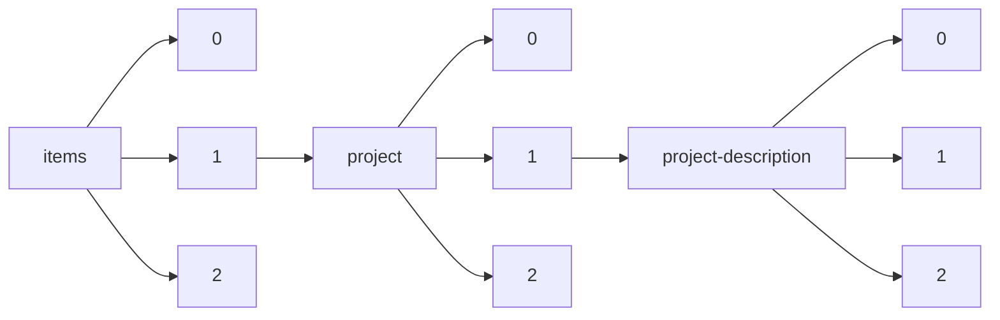

!!! warning "This document is not official Crossref documentation"
# Elements
PATH = items/array/project/array/project-description/array(1)  
Occurs 58 938 times  
{ .annotate }

1. A route to an element, for example:  
   The route "items/array/project/array/project-description/array" corresponds to navigating through the JSON indices as  
   ["items"][0]["project"][0]["project-description"][0]  

## Description
See more information: [items/array/project/array/project-description/array/description](description/index.md)  
Occurs 58 938 timess  
Unique values: > 999  

!!! note "Due to current limitations, strings longer than 1,000 characters are truncated, which may lead to inaccurate calculations."

!!! note "Due to current limitations, only the first 1,000 unique values are counted."

| **Row** | **Value** `String`                                                                                 | **Count** `Int64` |
|--------:|------------------------------------------------------------------------------------------------------:|---------------------:|
| **1**   | No Data Entered                                                                                       | 802                  |
| **2**   | In support of the postdoctoral fellow's salary, fringe benefits and research plan.                    | 102                  |
| **3**   | To be submitted later                                                                                 | 42                   |
| **4**   | #N/A                                                                                                  | 24                   |
| **5**   | Optic pathway gliomas (OPGs) are low-grade astrocytomas that occur commonly in children with neurofi  | 23                   |
| **6**   | Not available                                                                                         | 14                   |
| **7**   | One of nine initial node establishment projects in the\n                    HeSANDA infrastructure ne | 9                    |
| **8**   | The NF Preclinical Consortium aim is repurposing available cancer drugs or advanced development phas  | 9                    |
| **9**   | The NF Therapeutic Consortium aim is repurposing available cancer drugs or advanced development phas  | 8                    |
| **10**  | SYNODOS is a first-of-its-kind NF research collaboration dedicated to defeating the rare genetic dis  | 6                    |
| ... | ... | ... |

## Language
See more information: [items/array/project/array/project-description/array/language](language/index.md)  
Occurs 58 748 timess  
Unique values: 6  

| **Row** | **Value** `String` | **Count** `Int64` |
|--------:|----------------------:|---------------------:|
| **1**   | en                    | 50 078               |
| **2**   | ja                    | 8 489                |
| **3**   | de                    | 177                  |
| **4**   | pt                    | 2                    |
| **5**   | fr                    | 1                    |
| **6**   | en-US                 | 1                    |

