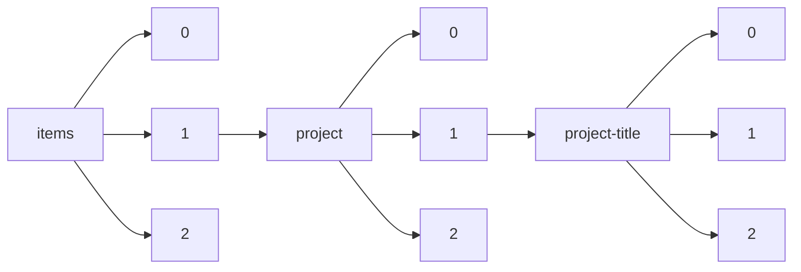

!!! warning "This document is not official Crossref documentation"
# Elements
PATH = items/array/project/array/project-title/array(1)  
Occurs 112 610 times  
{ .annotate }

1. A route to an element, for example:  
   The route "items/array/project/array/project-title/array" corresponds to navigating through the JSON indices as  
   ["items"][0]["project"][0]["project-title"][0]  

## Language
See more information: [items/array/project/array/project-title/array/language](language/index.md)  
Occurs 86 311 timess  
Unique values: 7  

| **Row** | **Value** `String` | **Count** `Int64` |
|--------:|----------------------:|---------------------:|
| **1**   | en                    | 76 367               |
| **2**   | ja                    | 9 923                |
| **3**   | EN                    | 16                   |
| **4**   | pt                    | 2                    |
| **5**   | fr                    | 1                    |
| **6**   | en-US                 | 1                    |
| **7**   | es                    | 1                    |

## Title
See more information: [items/array/project/array/project-title/array/title](title/index.md)  
Occurs 112 610 timess  
Unique values: > 999  

!!! note "Due to current limitations, only the first 1,000 unique values are counted."

| **Row** | **Value** `String`                                                                                | **Count** `Int64` |
|--------:|-----------------------------------------------------------------------------------------------------:|---------------------:|
| **1**   | Biomedical Vacation Scholarship                                                                      | 212                  |
| **2**   | Biomedical Vacation Scholarship.                                                                     | 120                  |
| **3**   | In support of the postdoctoral fellow's salary, fringe benefits and research plan.                   | 101                  |
| **4**   | Value in People Award.                                                                               | 54                   |
| **5**   | Biomedical vacation scholarship.                                                                     | 50                   |
| **6**   | New Tools for Advancing Model Systems in Aquatic Symbiosis                                           | 39                   |
| **7**   | Institutional Research Grant                                                                         | 27                   |
| **8**   | Developing Evidence-Based Criteria for Initiating Treatment for Neurofibromatosis Type 1 Associated  | 23                   |
| **9**   | Institutional Strategic Support Fund                                                                 | 23                   |
| **10**  | VALUE IN PEOPLE AWARD.                                                                               | 22                   |
| ... | ... | ... |

