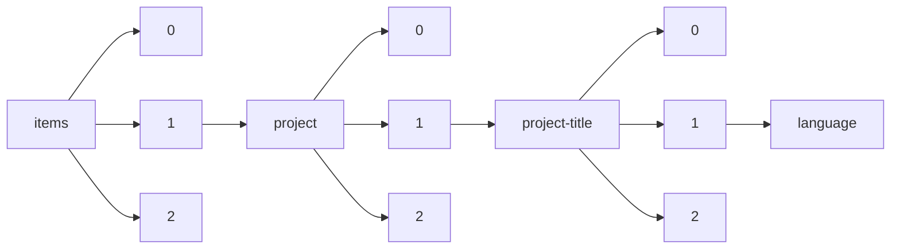

!!! warning "This document is not official Crossref documentation"
# Language
PATH = items/array/project/array/project-title/array/language(1)  
Occurs 86 311 times  
Unique values: 7  
{ .annotate }

1. A route to an element, for example:  
   The route "items/array/project/array/project-title/array/language" corresponds to navigating through the JSON indices as  
   ["items"][0]["project"][0]["project-title"][0]["language"]  

| **Row** | **Value** `String` | **Count** `Int64` |
|--------:|----------------------:|---------------------:|
| **1**   | en                    | 76 367               |
| **2**   | ja                    | 9 923                |
| **3**   | EN                    | 16                   |
| **4**   | pt                    | 2                    |
| **5**   | fr                    | 1                    |
| **6**   | en-US                 | 1                    |
| **7**   | es                    | 1                    |

