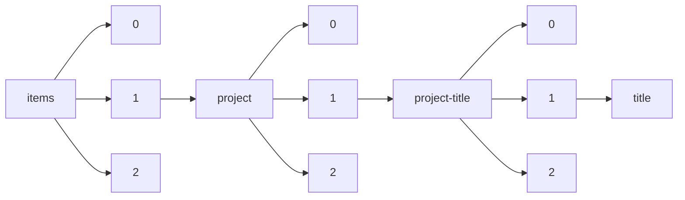

!!! warning "This document is not official Crossref documentation"
# Title
PATH = items/array/project/array/project-title/array/title(1)  
Occurs 112 610 times  
Unique values: > 999  
{ .annotate }

1. A route to an element, for example:  
   The route "items/array/project/array/project-title/array/title" corresponds to navigating through the JSON indices as  
   ["items"][0]["project"][0]["project-title"][0]["title"]  

!!! note "Due to current limitations, only the first 1,000 unique values are counted."

| **Row** | **Value** `String`                                                                                          | **Count** `Int64` |
|--------:|---------------------------------------------------------------------------------------------------------------:|---------------------:|
| **1**   | Biomedical Vacation Scholarship                                                                                | 212                  |
| **2**   | Biomedical Vacation Scholarship.                                                                               | 120                  |
| **3**   | In support of the postdoctoral fellow's salary, fringe benefits and research plan.                             | 101                  |
| **4**   | Value in People Award.                                                                                         | 54                   |
| **5**   | Biomedical vacation scholarship.                                                                               | 50                   |
| **6**   | New Tools for Advancing Model Systems in Aquatic Symbiosis                                                     | 39                   |
| **7**   | Institutional Research Grant                                                                                   | 27                   |
| **8**   | Developing Evidence-Based Criteria for Initiating Treatment for Neurofibromatosis Type 1 Associated            | 23                   |
| **9**   | Institutional Strategic Support Fund                                                                           | 23                   |
| **10**  | VALUE IN PEOPLE AWARD.                                                                                         | 22                   |
| **11**  | Infection and Immunity                                                                                         | 22                   |
| **12**  | Value in people award.                                                                                         | 20                   |
| **13**  | Molecular Functions in Disease.                                                                                | 20                   |
| **14**  | Institutional Strategic Support Fund Phase2 FY2014/16                                                          | 19                   |
| **15**  | Molecular and Cellular Biology                                                                                 | 18                   |
| **16**  | Developmental Biology                                                                                          | 18                   |
| **17**  | Wellcome Trust PhD Programme for Clinicians at the University of Cambridge.                                    | 18                   |
| **18**  | Institutional Strategic Support Fund 2011/12.                                                                  | 17                   |
| **19**  | Biomedical Vacation Scholarships                                                                               | 17                   |
| **20**  | VIPA.                                                                                                          | 16                   |
| **21**  | Infection and Immunity.                                                                                        | 16                   |
| **22**  | Molecular and Cellular Basis of Infection.                                                                     | 15                   |
| **23**  | Molecular functions in disease.                                                                                | 15                   |
| **24**  | Molecular and Cellular Biology.                                                                                | 14                   |
| **25**  | Cellular and Molecular Physiology                                                                              | 12                   |
| **26**  | The cellular and molecular basis of disease.                                                                   | 12                   |
| **27**  | Wellcome Trust Joint Basic and Clinical PhD Programme at the Institute of Cancer Research.                     | 12                   |
| **28**  | Integrative Neuroscience                                                                                       | 11                   |
| **29**  | 4 year PhD in Neuroscience                                                                                     | 11                   |
| **30**  | VIPA                                                                                                           | 11                   |
| **31**  | The Cellular and Molecular Basis of Disease.                                                                   | 11                   |
| **32**  | Deciphering the Origin of the Eukaryotic Cell                                                                  | 11                   |
| **33**  | Dynamic Cell Biology                                                                                           | 11                   |
| **34**  | Cellular and Molecular Physiology.                                                                             | 10                   |
| **35**  | Infection, Immunology and Translational Medicine.                                                              | 10                   |
| **36**  | Molecular, genetic and lifecourse epidemiology.                                                                | 9                    |
| **37**  | INSPIRE                                                                                                        | 9                    |
| **38**  | Master's Studentship                                                                                           | 9                    |
| **39**  | Dynamic Cell Biology.                                                                                          | 8                    |
| **40**  | Value in People award.                                                                                         | 8                    |
| **41**  | Immunology, infection and translational medicine.                                                              | 8                    |
| **42**  | Structural Biology                                                                                             | 8                    |
| **43**  | Biomedical vacational scholarship.                                                                             | 8                    |
| **44**  | Molecular and cellular biology.                                                                                | 8                    |
| **45**  | Genomic Medicine and Statistics                                                                                | 8                    |
| **46**  | Wellcome Trust Clinical PhD Programme at Imperial College London                                               | 7                    |
| **47**  | To be decided.                                                                                                 | 7                    |
| **48**  | In situ TEM study of branched nanocrystal growth mechanism                                                     | 7                    |
| **49**  | Molecular Basis of Biological Mechanisms.                                                                      | 7                    |
| **50**  | Molecular, genetic and lifecourse epidemiology                                                                 | 7                    |
| **51**  | Chromosome and Developmental Biology.                                                                          | 7                    |
| **52**  | Genomic Medicine and Statistics.                                                                               | 7                    |
| **53**  | Systems Neuroscience: From Networks to Behaviour.                                                              | 7                    |
| **54**  | Molecular Functions in Disease                                                                                 | 7                    |
| **55**  | NMR Structural Investigations of BRCA1                                                                         | 6                    |
| **56**  | Structural biology: from molecules to cells.                                                                   | 6                    |
| **57**  | Molecular and Cellular Basis of Infection                                                                      | 6                    |
| **58**  | Structural Proteomics: annotating the genome using 3D structure                                                | 6                    |
| **59**  | INTERACT                                                                                                       | 6                    |
| **60**  | Structural Genomics of Eukaryotic Model Organisms                                                              | 6                    |
| **61**  | Wellcome Trust Clinical PhD Programme at the University of Liverpool.                                          | 6                    |
| **62**  | Synodos for NF2 consortium: Applying system biology to create tools and treatment paradigms for NF2-           | 6                    |
| **63**  | PIONEER                                                                                                        | 6                    |
| **64**  | Integrative Neuroscience.                                                                                      | 6                    |
| **65**  | UCL Neuroscience.                                                                                              | 6                    |
| **66**  | Optimizing Oil Production in Oleaginous Yeast by Cell-Wide Measurements and Genome-Based Models                | 5                    |
| **67**  | Developmental and stem cell biology.                                                                           | 5                    |
| **68**  | Wellcome Trust Clinical PhD Programme, University of Liverpool 'Health Priorities in the Developing            | 5                    |
| **69**  | COSMOS                                                                                                         | 5                    |
| **70**  | GRACE                                                                                                          | 5                    |
| **71**  | A Molecular Atlas of the Developing Lung                                                                       | 5                    |
| **72**  | Interdisciplinary Training Programme in Translational Medicine and Therapeutics at the University of           | 5                    |
| **73**  | Physiological Sciences                                                                                         | 5                    |
| **74**  | Cellular and molecular physiology                                                                              | 5                    |
| **75**  | Archaeal cell-cell interactions and their role in the emergence of eukaryotes                                  | 5                    |
| **76**  | SMART                                                                                                          | 5                    |
| **77**  | PhD Neuroscience, University of Oxford.                                                                        | 5                    |
| **78**  | PhD Programme in cellular and molecular physiology                                                             | 5                    |
| **79**  | Interdisciplinary programme in structural, computational and chemical biology.                                 | 5                    |
| **80**  | Single Cell Resolution Omics Analysis of T1D islets                                                            | 5                    |
| **81**  | Four-year PhD Studentship Programme in Neuroscience at University College London.                              | 5                    |
| **82**  | UCD Computational Infection Biology                                                                            | 5                    |
| **83**  | 4 year PhD programme in Neuroscience                                                                           | 5                    |
| **84**  | No title provided                                                                                              | 5                    |
| **85**  | 4 year PhD Programme in Neuroscience at UCL.                                                                   | 5                    |
| **86**  | REALM                                                                                                          | 4                    |
| **87**  | Investigating Molecular Recognition and Biological Function at Interfaces Using Antimicrobial Peptid           | 4                    |
| **88**  | Oxford - Neuroscience                                                                                          | 4                    |
| **89**  | Cambridge, Infection, Immunity and Inflammation.                                                               | 4                    |
| **90**  | 4 year PhD programme in Molecular Basis of Biological Mechanisms                                               | 4                    |
| **91**  | Correlation of Structure and Function of Zinc Metalloproteins Via Solid-state NMR Methods                      | 4                    |
| **92**  | Molecular basis of biological mechanisms.                                                                      | 4                    |
| **93**  | Combating Infectious Disease: Computational Approaches in Translational Science                                | 4                    |
| **94**  | Mathematical genomics and medicine                                                                             | 4                    |
| **95**  | The Dynamics of Cellular Pathways                                                                              | 4                    |
| **96**  | Neuroscience.                                                                                                  | 4                    |
| **97**  | Genomic Medicine &amp; Statistics                                                                              | 4                    |
| **98**  | Structural biology                                                                                             | 4                    |
| **99**  | Longitudinal Proteomic Characterization of Human Cerebrospinal Fluid                                           | 4                    |
| **100** | Four year PhD programme in structural biology                                                                  | 4                    |
| **101** | Deciphering Microbial Communication Through Metabolites                                                        | 4                    |
| **102** | University of Nottingham and University of Birmingham - Antimicrobials and Antimicrobial Resistance            | 4                    |
| **103** | Cellular and molecular basis of disease.                                                                       | 4                    |
| **104** | SHAPE                                                                                                          | 4                    |
| **105** | Diversity, genomics, physiology, and ultrastructure of Asgard archaea and implications for eukaryoge           | 4                    |
| **106** | Wellcome Trust four year PhD programme in Cell Biology.                                                        | 4                    |
| **107** | In situ X-Ray Computed Tomography for study of glass melter operation                                          | 4                    |
| **108** | Imperial College London - Theoretical Systems Biology and Bioinformatics                                       | 4                    |
| **109** | University of Cambridge - Developmental Mechanisms                                                             | 4                    |
| **110** | Wellcome Trust Joint Basic and Clinical PhD Programme at the University of Birmingham.                         | 4                    |
| **111** | DREAM                                                                                                          | 4                    |
| **112** | Structural Proteomics of Myobacterium Tuberculosis                                                             | 4                    |
| **113** | Wellcome Trust 4 year PhD Programme in The Molecular Basis of Biological Mechanisms                            | 4                    |
| **114** | Solid-State 67Zn NMR of Synthetic Metalloprotein Models                                                        | 4                    |
| **115** | Neuroscience - four year doctoral programme.                                                                   | 4                    |
| **116** | Pathway Discovery, Validation and Compound Identification for Alzheimer's Disease                              | 4                    |
| **117** | Oxford Infection, Immunology and Translational Medicine.                                                       | 4                    |
| **118** | STREAM                                                                                                         | 4                    |
| **119** | TITAN                                                                                                          | 4                    |
| **120** | MHH Masters                                                                                                    | 4                    |
| **121** | Structure of Telomerase RNA and telomeric proteins                                                             | 4                    |
| **122** | LEAP                                                                                                           | 3                    |
| **123** | PROTECT                                                                                                        | 3                    |
| **124** | Developmental and stem cell biology programme.                                                                 | 3                    |
| **125** | Four year Ph.D. programme in cellular and molecular physiology.                                                | 3                    |
| **126** | Neural dynamics: from synapses to systems in health and disease                                                | 3                    |
| **127** | Bioinformatics.                                                                                                | 3                    |
| **128** | MAGIC                                                                                                          | 3                    |
| **129** | Mechanism-based Drug Discovery.                                                                                | 3                    |
| **130** | Four year PhD programme in molecular and cellular biology                                                      | 3                    |
| **131** | University of Edinburgh - Tissue Repair                                                                        | 3                    |
| **132** | EMERGE                                                                                                         | 3                    |
| **133** | Spatially resolving light elements with high resolution analysis for waste forms characterization              | 3                    |
| **134** | Wellcome Trust Clinical PhD Programme at Imperial College London.                                              | 3                    |
| **135** | BEST                                                                                                           | 3                    |
| **136** | TRANSIT                                                                                                        | 3                    |
| **137** | Leeds Molecular Basis of Biological Mechanisms 2007.                                                           | 3                    |
| **138** | PhD Programme in Obesity and Cardiovascular Disease                                                            | 3                    |
| **139** | Oxford Chromosome and Developmental Biology                                                                    | 3                    |
| **140** | Wellcome Trust Clinical PhD Programme at the University of Dundee.                                             | 3                    |
| **141** | MISTRAL                                                                                                        | 3                    |
| **142** | Developmental and Stem Cell Biology.                                                                           | 3                    |
| **143** | RAPID                                                                                                          | 3                    |
| **144** | Dynamics of Microbiomes in Space (DynaMoS)                                                                     | 3                    |
| **145** | CRAFT                                                                                                          | 3                    |
| **146** | University College London/Birkbeck Interdisciplinary Programme in Structural, Computational and Chem           | 3                    |
| **147** | Joint Basic and Clinical PhD Programme at the Institute of Cancer Research.                                    | 3                    |
| **148** | Wellcome Trust Four Year PhD Programme in Cell Biology.                                                        | 3                    |
| **149** | UCL Neuroscience PhD.                                                                                          | 3                    |
| **150** | Oxford, Chromosome and Developmental Biology.                                                                  | 3                    |
| **151** | Molecular and cellular basis of infection.                                                                     | 3                    |
| **152** | EMPOWER                                                                                                        | 3                    |
| **153** | PhD Programme: Developmental Biology                                                                           | 3                    |
| **154** | New phylogenomic models and methods to resolve the prokaryote to eukaryote transition                          | 3                    |
| **155** | 4 year PhD studentship Neuroscience                                                                            | 3                    |
| **156** | Correlation of Structure and Function of Zinc Metalloproteins Via a Combined NMR/Molecular Theory Ap           | 3                    |
| **157** | Developmental and Stem Cell Biology Programme                                                                  | 3                    |
| **158** | REINVENT                                                                                                       | 3                    |
| **159** | Cardiff, Integrative Neuroscience.                                                                             | 3                    |
| **160** | DISCOVER                                                                                                       | 3                    |
| **161** | Neuroscience - Four Year Doctoral Programme.                                                                   | 3                    |
| **162** | Chromosome and Developmental Biology                                                                           | 3                    |
| **163** | Development and refinement of an in situ 'molecular microscope' utilizing ultrahigh resolution mass            | 3                    |
| **164** | Atomistic Simulations of the Discriminatory Power of Desaturase                                                | 2                    |
| **165** | IMPROVE                                                                                                        | 2                    |
| **166** | Conformational Dynamics of Pin1 Regulation of APP processing and Abeta Production                              | 2                    |
| **167** | Imaging "ecological engineers": a novel quantum dots approach to map microbes in complex soil struct           | 2                    |
| **168** | Cambridge - Infection, Immunity and Inflammation                                                               | 2                    |
| **169** | Utilization of Cell Free DNA Liquid Biopsy for Diagnosis and Monitoring of Tumor Evolution in MPNST            | 2                    |
| **170** | PREMIERE                                                                                                       | 2                    |
| **171** | Characterization and method development for back-end of the line wafer processing concepts                     | 2                    |
| **172** | 適応的に再構成する通信ネットワーク                                                                             | 2                    |
| **173** | FAME                                                                                                           | 2                    |
| **174** | 3次元組織工学による次世代食肉生産技術の創出                                                                    | 2                    |
| **175** | EcoMultiCloud                                                                                                  | 2                    |
| **176** | FAIRplus                                                                                                       | 2                    |
| **177** | Clinical Research Training Scholarship in Parkinson's Disease                                                  | 2                    |
| **178** | Clinical trial of tocilizumab in ALS subjects                                                                  | 2                    |
| **179** | Clinical PhD Programme at the University of Cambridge.                                                         | 2                    |
| **180** | Molecular functions in disease                                                                                 | 2                    |
| **181** | Developmental and Stem Cell Biology                                                                            | 2                    |
| **182** | Metabolomics of Mixed Microbial Communities: Understanding the Influence of Gut Microbiota                     | 2                    |
| **183** | UCL Developmental and Stem Cell Biology                                                                        | 2                    |
| **184** | Dual-channel paper-based electroanalytical platform for multiple myeloma care                                  | 2                    |
| **185** | Cambridge Mathematical Genomics &amp; Medicine 2010.                                                           | 2                    |
| **186** | Molecular studies in the Phyllosphere                                                                          | 2                    |
| **187** | Science Uncovered                                                                                              | 2                    |
| **188** | Safe and accurate fetal monitoring                                                                             | 2                    |
| **189** | ProGeo                                                                                                         | 2                    |
| **190** | Can Microbial Ecology and Mycorrhizal Functioning Inform Climate Change Models?                                | 2                    |
| **191** | Wellcome Trust 4-year PhD Programme in Neuroscience at University College London                               | 2                    |
| **192** | NMR for Catalyst Studies                                                                                       | 2                    |
| **193** | Storage4Grid                                                                                                   | 2                    |
| **194** | Fundamental research at the nano- and microscale to understand how biofilms interact with wounds in            | 2                    |
| **195** | Chemistry and Microphysics of Small Particles                                                                  | 2                    |
| **196** | Benchmarking Climate and Waether Modeling Codes on the PNNL Cluster.(emsl2642)                                 | 2                    |
| **197** | GN5-1                                                                                                          | 2                    |
| **198** | Metabolic and cardiovascular disease                                                                           | 2                    |
| **199** | TWIGA                                                                                                          | 2                    |
| **200** | ELECTRONIC STRUCTURE CALCULATIONS OF HYDROGEN BONDING IN BIOLOGICAL MACROMOLECULES                             | 2                    |
| **201** | Corticospinal motor neuron developmental control genes as candidates for human ALS susceptibility              | 2                    |
| **202** | DEMETER                                                                                                        | 2                    |
| **203** | Hydrogen Materials Compatibility Studies                                                                       | 2                    |
| **204** | The molecular basis of biological mechanisms                                                                   | 2                    |
| **205** | MILDTECH                                                                                                       | 2                    |
| **206** | SMS                                                                                                            | 2                    |
| **207** | Investigation of the role of Mg2+ in DNA repair proteins APE1, Pol ?, and FEN1                                 | 2                    |
| **208** | MOCCA                                                                                                          | 2                    |
| **209** | CAMART2                                                                                                        | 2                    |
| **210** | TRAIL                                                                                                          | 2                    |
| **211** | Solid State NMR Characterization of Metal Phosphines                                                           | 2                    |
| **212** | BTPin                                                                                                          | 2                    |
| **213** | Action “Establishing services enhancing the innovation management capacity of SME's in the Enterpris           | 2                    |
| **214** | Probing the Mechanism of the Alkaline Phosphatase Reaction by 67Zn and 25Mg NMR                                | 2                    |
| **215** | HOTSPOT                                                                                                        | 2                    |
| **216** | Johns Hopkins All Children's Hospital                                                                          | 2                    |
| **217** | International Public Engagement Programme.                                                                     | 2                    |
| **218** | The characterization of the solid state materials with planar carbon cluster unit                              | 2                    |
| **219** | Cambridge, Developmental Mechanisms.                                                                           | 2                    |
| **220** | Savings Loyalty System Based on Micro-Contributions from Retailers                                             | 2                    |
| **221** | Unraveling Cellular Controls on the Diversity of Mn Oxides Formed By Fungi                                     | 2                    |
| **222** | Ultra-High Field NMR Studies of Stable Isotope Applications                                                    | 2                    |
| **223** | Preparation of Stoichiometric TiO2(110)-(1x1) Surface.                                                         | 2                    |
| **224** | York Combating Infectious Disease: Computational Approaches in Translational Science (CIDCATS)                 | 2                    |
| **225** | ARION                                                                                                          | 2                    |
| **226** | Investigations of Metal-organic Frameworks Using High-field Solid State NMR                                    | 2                    |
| **227** | AVELEDA Fruit Wine                                                                                             | 2                    |
| **228** | Controlling ion transport and topotactic phase transition processes in oxide thin films                        | 2                    |
| **229** | Molecular Structure and Interaction at Aqueous, Non-Aqueous Liquid Interfaces and Catalytic Solid Su           | 2                    |
| **230** | SPINTOP                                                                                                        | 2                    |
| **231** | EASIVIRAL                                                                                                      | 2                    |
| **232** | ARGO                                                                                                           | 2                    |
| **233** | XPRESS                                                                                                         | 2                    |
| **234** | 3D nanoscale characterization of nanostructured Soft Magnetic Materials                                        | 2                    |
| **235** | Oxygen versus Iron Terminations in Hematite Basal Surfaces: STM imagin in air and in aqueous solutio           | 2                    |
| **236** | (GC10)First Principles Methods for Predicting the Chemistry of Environmentally Relevant Systems                | 2                    |
| **237** | Molecular &amp; Cellular Basis of Infection.                                                                   | 2                    |
| **238** | Pacific Northwest Advanced Compound Identification Core                                                        | 2                    |
| **239** | Methods for Determining the Irradiation Response of Structural Materials for Nuclear Reactor Core St           | 2                    |
| **240** | Expenses associated with Cornell Summer Programme 2007                                                         | 2                    |
| **241** | Physiology of the Enteroendocrine System.                                                                      | 2                    |
| **242** | Structural Studies of Lipid-free Apolipoprotein A-I                                                            | 2                    |
| **243** | ENHANCE                                                                                                        | 2                    |
| **244** | RELIANCE                                                                                                       | 2                    |
| **245** | University of Bristol - Molecular, Genetic and Lifecourse Epidemiology                                         | 2                    |
| **246** | 4 year PhD programme in Neuroscience.                                                                          | 2                    |
| **247** | Experimental Capabilities and Fundamental Science for Geologic Carbon Sequestration: The PNNL In Sit           | 2                    |
| **248** | Transcriptional profiling and marker identification of early stage melanoma                                    | 2                    |
| **249** | Benchmark studies of non-covalent stacking interactions                                                        | 2                    |
| **250** | PENSUMO                                                                                                        | 2                    |
| **251** | SUCCESS                                                                                                        | 2                    |
| **252** | Free Space Transistors for Advancing the Art of Software Defined Radio                                         | 2                    |
| **253** | In situ TEM study of hierarchical nanowires growth via screw dislocation driven mechanism                      | 2                    |
| **254** | University of Utah                                                                                             | 2                    |
| **255** | Dynamics in Myoglobins and Hemoglobins                                                                         | 2                    |
| **256** | Signatures of Environmental Perturbation - Microbial Community and Organic Matter Resilience                   | 2                    |
| **257** | MOZART                                                                                                         | 2                    |
| **258** | Developing a Model of Teaching Learning to Support Classroom Enactment of Purposeful Sensemaking               | 2                    |
| **259** | CityChangerCargoBike                                                                                           | 2                    |
| **260** | OHSU-PNNL NORTHWEST CO-LABORATORY FOR INTEGRATED OMICS                                                         | 2                    |
| **261** | ESCAPE                                                                                                         | 2                    |
| **262** | Isolation and Characterization of Novel Antimicrobial Peptides from the Zebrafish, Danio rerio                 | 2                    |
| **263** | Natural and modulated neural communication: State-dependent decoding and driving of human Brain Osci           | 2                    |
| **264** | University of Cambridge - Metabolic and Cardiovascular Disease                                                 | 2                    |
| **265** | Healthy Textile                                                                                                | 2                    |
| **266** | Oxidation studies of coatings for interconnect plates in solid oxide fuel cells                                | 2                    |
| **267** | Protein Design, Protein Recognition and Molecular Chaperones                                                   | 2                    |
| **268** | Gas Phase Study of Solution Phase Species and Chemistry Using Variable Temperature Photoelectron Spe           | 2                    |
| **269** | Preparation of TEM Samples from Neutron-Irradiated Ferritic/Martensitic Fe-Cr Alloys                           | 2                    |
| **270** | Massively Parallel Sequencing (MPS) Technology for the Forensic Identification of the "Unknown" Biol           | 2                    |
| **271** | The Natural History of Schwannomatosis                                                                         | 2                    |
| **272** | XCYCLE                                                                                                         | 2                    |
| **273** | The CCMEE - Culture Collection of Microorganisms from Extreme Environments as a platform for biodive           | 2                    |
| **274** | ALS One - Mapp ALS (Massachusetts ALS Partnership)                                                             | 2                    |
| **275** | Secondary Ion Mass Spectroscopy study of transitions metals doped ZnO nanowires                                | 2                    |
| **276** | Developing Three-dimensional characterization methods for energy and environmental materials                   | 2                    |
| **277** | Quantum Mechanical and Molecular Mechanical Methods for Iron-Sulfur Proteins&#x0D;                             | 2                    |
| **278** | Valence and Core-Level Excited State Spectroscopy and Dynamics and Magnetic Resonance Spectroscopy S           | 2                    |
| **279** | Biosystem dynamics and analysis of Rhodobacter sphaeroides strains with increased lipid accumulation           | 2                    |
| **280** | MSCA4Ukraine                                                                                                   | 2                    |
| **281** | Perceptual Learning                                                                                            | 2                    |
| **282** | ORCA                                                                                                           | 2                    |
| **283** | The Biochemistry of Cellular Systems: Macromolecular Assemblies.                                               | 2                    |
| **284** | Spatial Properties of Clustered Free Radicals Produced in DNA and Biodosimeters by Ionizing Radiatio           | 2                    |
| **285** | POSEIDON                                                                                                       | 2                    |
| **286** | NMR-Based Solution Structure of Escherichia coli Base Excision Repair Protein Formamidopyrimidine-DN           | 2                    |
| **287** | SMARTGEARBOX                                                                                                   | 2                    |
| **288** | The Evolution of Protein Flexibility                                                                           | 2                    |
| **289** | Ocean Medicines                                                                                                | 2                    |
| **290** | AMADEUS                                                                                                        | 2                    |
| **291** | OCEAN                                                                                                          | 2                    |
| **292** | INSPIRATION                                                                                                    | 2                    |
| **293** | redTADF                                                                                                        | 2                    |
| **294** | Johns Hopkins University                                                                                       | 2                    |
| **295** | Henry Ford Hospital                                                                                            | 2                    |
| **296** | V4F                                                                                                            | 2                    |
| **297** | THOR                                                                                                           | 2                    |
| **298** | LISA                                                                                                           | 2                    |
| **299** | European Technology and Innovation Platform for Ocean Energy                                                   | 2                    |
| **300** | ScaleAgData                                                                                                    | 2                    |
| **301** | INnovation CApacities of Mediterranean Enterprises                                                             | 2                    |
| **302** | Hypatia                                                                                                        | 2                    |
| **303** | Proteomics of Filamentous Fungi                                                                                | 2                    |
| **304** | Cambridge Developmental Mechanisms                                                                             | 2                    |
| **305** | Light Source Photocathode Performance and Development                                                          | 2                    |
| **306** | PROSPER                                                                                                        | 2                    |
| **307** | Open Science Prize                                                                                             | 2                    |
| **308** | MAP                                                                                                            | 2                    |
| **309** | Mechanisms of Phosphorus Stabilization in the Soil Environment: A Molecular Scale Evaluation                   | 2                    |
| **310** | MAIA                                                                                                           | 2                    |
| **311** | Promoting mental health and building resilience in adolescence: Investigating mindfulness and attent           | 2                    |
| **312** | EEN Innovation Management Services Berlin-Brandenburg                                                          | 2                    |
| **313** | ABC-S                                                                                                          | 2                    |
| **314** | KAMINLER                                                                                                       | 2                    |
| **315** | PROCEED                                                                                                        | 2                    |
| **316** | The core promoter: an unexplored regulatory level of transcription during vertebrate development.              | 2                    |
| **317** | SCOPE                                                                                                          | 2                    |
| **318** | Tracing the Geological Record of Eukaryogenesis                                                                | 2                    |
| **319** | Systems Biology Through an Integrated Multimodal Imaging and Analysis Framework                                | 2                    |
| **320** | St. Joseph's Regional Medical Center                                                                           | 2                    |
| **321** | SAGE                                                                                                           | 2                    |
| **322** | Interfacial Investigations of Nuclear Waste Forms                                                              | 2                    |
| **323** | Mechanisms of Fe Biomineralization Induced By Dissimilatory Iron Reduction                                     | 2                    |
| **324** | Functional Genomics Visualization                                                                              | 2                    |
| **325** | SHINE                                                                                                          | 2                    |
| **326** | EQUALITY                                                                                                       | 2                    |
| **327** | AORTYX                                                                                                         | 2                    |
| **328** | CHAMPAGNE                                                                                                      | 2                    |
| **329** | (GC7)Biomolecular Interfaces: Simulation of Sedimentation of Biomolecular Assemblies                           | 2                    |
| **330** | IN2TRACK3                                                                                                      | 2                    |
| **331** | REBOOT                                                                                                         | 2                    |
| **332** | Manchester Dynamics of Cellular Pathways 2007                                                                  | 2                    |
| **333** | EES Innovation CSA                                                                                             | 2                    |
| **334** | WaNPRC Macaque Proteomics for Models of Influenza Infection and AIDS                                           | 2                    |
| **335** | Investigation of Aromatic and Other Novel Gas Phase Atomic Clusters and Molecules                              | 2                    |
| **336** | Dundee Molecular &amp; Cellular Biology 2007                                                                   | 2                    |
| **337** | University of Cambridge - Mathematical Genomics and Medicine                                                   | 2                    |
| **338** | ICEBREAKER                                                                                                     | 2                    |
| **339** | UCD, Computational Infection Biology.                                                                          | 2                    |
| **340** | Chromosome and developmental biology.                                                                          | 2                    |
| **341** | INNOVACTIS 2019                                                                                                | 2                    |
| **342** | AMBER                                                                                                          | 2                    |
| **343** | materials for automotive sensor  developement                                                                  | 2                    |
| **344** | LEaDing Fellows                                                                                                | 2                    |
| **345** | Evaluation of multicomponent proous oxide films                                                                | 2                    |
| **346** | OPTIMISE                                                                                                       | 2                    |
| **347** | Ion Channeling Studies of Epitaxial Oxide Films and Gas-Solid interfaces.                                      | 2                    |
| **348** | Spatially resolving light elements with high resolution chemical analysis for waste forms characteri           | 2                    |
| **349** | Graphene Oxide Based Structured Laminar Membranes                                                              | 2                    |
| **350** | Characterization and Development of a Ag/ZrO2/SiO2 Catalyst for the Conversion of Bio-Derived Ethano           | 2                    |
| **351** | EVALUATION OF CEMENT COMPOSITES, ROCKS, AND OTHER MATERIALS CHEMISTRY, PERMEABILITY, AND MORPHOLOGY            | 2                    |
| **352** | Oxidative corrosion of uraninite (UO2) surfaces                                                                | 2                    |
| **353** | EURACTE INNOV III                                                                                              | 2                    |
| **354** | Develop fundamental surface science characterization data for use in improving mixed alcohol synthes           | 2                    |
| **355** | makinG aUgmedit lumI stanDArd in NeurosurgiCal surgEry in 3D: GUIDANCE 3D                                      | 2                    |
| **356** | The Molecular Basis of Biological Mechanism.                                                                   | 2                    |
| **357** | ELECTRA                                                                                                        | 2                    |
| **358** | CORE                                                                                                           | 2                    |
| **359** | Chromosome and Developmental Biology: The Cell in Heredity and Development                                     | 2                    |
| **360** | The Structural Basis of Biological Mechanisms                                                                  | 2                    |
| **361** | International Severe Acute Respiratory Infection Consortium (ISARIC)                                           | 2                    |
| **362** | Acoustic Blood Cells Sorter                                                                                    | 2                    |
| **363** | Computational modeling to design electrocatalysts for energy storage production                                | 2                    |
| **364** | Computational human sensorimotor control.                                                                      | 2                    |
| **365** | iReact-NG                                                                                                      | 2                    |
| **366** | Health Priorities in Resource-Limited Settings                                                                 | 2                    |
| **367** | MEASURING COMPOSITION AND SPECIATION OF CO2 IN CAPTURE CAPTURE SOLVENTS USING HIGH-PRESSURE NMR.               | 2                    |
| **368** | Systems neuroscience: From networks to behaviour.                                                              | 2                    |
| **369** | Wellcome Trust 4-year Doctoral Programme in Neuroscience.                                                      | 2                    |
| **370** | Synodos Schwannomatosis                                                                                        | 2                    |
| **371** | Arkansas Children's Hospital                                                                                   | 2                    |
| **372** | PACE                                                                                                           | 2                    |
| **373** | ENGAGE                                                                                                         | 2                    |
| **374** | McDonnell Scholar in Molecular Medicine in Cancer Research.                                                    | 2                    |
| **375** | Quantification and Prediction of Nuclear Cable Polymer Degradation                                             | 2                    |
| **376** | Fellowship support and administrative costs for the Molecular Medicine in Cancer Research Program.             | 2                    |
| **377** | CONNECT                                                                                                        | 2                    |
| **378** | Group Leader Bioinformatics                                                                                    | 2                    |
| **379** | Deep Desulphurization of Hot Coal Gas for Production of Liquid Fuels                                           | 2                    |
| **380** | PSEUDOPIN                                                                                                      | 2                    |
| **381** | Understanding NOx SCR Mechanisms and Activity on Cu/Chabazite Structures throughout the Catalyst Lif           | 2                    |
| **382** | High resolution and Mass Accuracy Capability (HRMAC) Development Project                                       | 2                    |
| **383** | COSMIC                                                                                                         | 2                    |
| **384** | UCL/Birkbeck Interdisciplinary programme in Structural and Chemical Biology ofHuman diseases 2007.             | 2                    |
| **385** | Proteomics Laboratory for The Environmental Determinants of Diabetes in the Young                              | 2                    |
| **386** | SMILE                                                                                                          | 2                    |
| **387** | MAGNIFY                                                                                                        | 2                    |
| **388** | UCL, Developmental and Stem Cell Biology.                                                                      | 2                    |
| **389** | Characterization of U(VI) speciation in samples from laboratory batch and column experiments                   | 2                    |
| **390** | INTEGRATE                                                                                                      | 2                    |
| **391** | REMEMBER                                                                                                       | 2                    |
| **392** | Computational Infection Biology                                                                                | 2                    |
| **393** | EMBRACED                                                                                                       | 2                    |
| **394** | Manchester, Molecular and Cell Biology: The Dynamics of Cellular Regulatory Networks.                          | 2                    |
| **395** | COFFEE                                                                                                         | 2                    |
| **396** | BioEnergyTrain                                                                                                 | 2                    |
| **397** | Oxford, Neuroscience.                                                                                          | 2                    |
| **398** | NMR Analysis of Bioprocess Samples                                                                             | 2                    |
| **399** | 個人及びグループの属性に適応する群集制御                                                                       | 2                    |
| **400** | Medical Humanities Masters Studentship.                                                                        | 2                    |
| **401** | Understanding and Utilizing Block Copolymer Templates for the Preparation of Bimetallic Catalysts fo           | 2                    |
| **402** | VAULT                                                                                                          | 2                    |
| **403** | PT Innovative                                                                                                  | 2                    |
| **404** | ERATOSTHENES: Excellence Research Centre for Earth Surveillance and Space-Based Monitoring of the En           | 2                    |
| **405** | Conformational and Dynamics Studies of Human Salivary Histatin Bound on Hydroxyapatite by Solid Stat           | 2                    |
| **406** | Dynamics of Cellular Pathways                                                                                  | 2                    |
| **407** | Bristol Dynamic Cell Biology                                                                                   | 2                    |
| **408** | FETAL MONITORING                                                                                               | 2                    |
| **409** | EuPRAXIA                                                                                                       | 2                    |
| **410** | SCIENCE4FUTURE                                                                                                 | 2                    |
| **411** | Atmospheric Soil Organic Particles                                                                             | 2                    |
| **412** | OPERA                                                                                                          | 2                    |
| **413** | Materials Science Core for NIH Center -Integrating Structure, Activity, Biokinetics and Response for           | 2                    |
| **414** | Role of Microenvironments and Transition Zones in Subsurface Reactive Contaminant Transport                    | 2                    |
| **415** | Structural Biology of the Nudix Proteins from the Extremely Radiation-Resistant Bacterium Deinococcu           | 2                    |
| **416** | Fundamental Structure-Property Relationships Governing the Electrochemical Activity of Epitaxial Het           | 2                    |
| **417** | CAT - A hybrid IMS-MS platform for ultrasensitive and high resolution glycan analysis                          | 2                    |
| **418** | ACT                                                                                                            | 2                    |
| **419** | Oxford - Genomic Medicine and Statistics                                                                       | 2                    |
| **420** | PROMINENT                                                                                                      | 2                    |
| **421** | EPICON: Epigenetic Control of Drought Acclimation in Sorghum                                                   | 2                    |
| **422** | Complex Urban Systems for Sustainability and Health (CUSSH)                                                    | 2                    |
| **423** | CarbonOrO                                                                                                      | 2                    |
| **424** | MERLIN                                                                                                         | 2                    |
| **425** | EXCELSIOR                                                                                                      | 2                    |
| **426** | Developmental Biology PhD Programme.                                                                           | 2                    |
| **427** | HyKinetics                                                                                                     | 2                    |
| **428** | The London Pain Consortium.                                                                                    | 2                    |
| **429** | Design of plasmonic probe tips to control light on the nanoscale for imaging and spectroscopy with u           | 2                    |
| **430** | Helium Ion Lithography on SQUIDS                                                                               | 2                    |
| **431** | PROMETHEUS                                                                                                     | 2                    |
| **432** | 持続可能な社会へのトランスフォーメーションを可能にする社会制度の変革と設計                                     | 2                    |
| **433** | INHERIT                                                                                                        | 2                    |
| **434** | Panatomy                                                                                                       | 2                    |
| **435** | Student Elective prizes for the University of Cambridge                                                        | 2                    |
| **436** | Massively Parallel Molecular Profiling of Breast Cancer                                                        | 2                    |
| **437** | Dynamics of glioma growth and invasion                                                                         | 2                    |
| **438** | Cryo-TEM investigation of polyketide synthase megacomplexes in Candidatus Endobugula sertula and Ter           | 2                    |
| **439** | NHM NIGHT5                                                                                                     | 2                    |
| **440** | Ann and Robert H. Lurie Children's Hospital of Chicago                                                         | 2                    |
| **441** | Melhorando Metadados usando gatos como motivadores                                                             | 2                    |
| **442** | Clayment - Clay cement for massive CO2 reduction                                                               | 2                    |
| **443** | PROVIDE                                                                                                        | 2                    |
| **444** | Determining the Immune Inhibitory Landscape in Melanoma                                                        | 2                    |
| **445** | High-resolution imaging of Rhodobacter sphaeroides strains with increased lipid accumulation                   | 2                    |
| **446** | PANACEA                                                                                                        | 2                    |
| **447** | Heterogeneous catalyst design for biorefining and energy conversion processes                                  | 2                    |
| **448** | (gc3564)Nanostructure Formation, Aggregation, and Reactivity                                                   | 2                    |
| **449** | Biomedical vacation scholarship                                                                                | 2                    |
| **450** | Study on elemental distribution in the process of nuclear waste glass melting                                  | 2                    |
| **451** | ULTIMATE                                                                                                       | 2                    |
| **452** | ERC VP CSA                                                                                                     | 2                    |
| **453** | TADIL and DITEL                                                                                                | 2                    |
| **454** | PADMME                                                                                                         | 2                    |
| **455** | Imaging and Monitoring the Initial Stages of Biofilm Formation                                                 | 2                    |
| **456** | Edinburgh, Cell Biology.                                                                                       | 2                    |
| **457** | マルチメディアデータから新しい概念を発見する高階モデル学習                                                     | 2                    |
| **458** | Cellular and Molecular Basis of Disease.                                                                       | 2                    |
| **459** | Hydrogen Storage Materials                                                                                     | 2                    |
| **460** | Advancing Symbiosis Theory                                                                                     | 2                    |
| **461** | 生物発光リアルタイム測定システムの活用・普及促進                                                               | 2                    |
| **462** | GENIUS                                                                                                         | 2                    |
| **463** | Melanoma Staging by Artificial Intelligence                                                                    | 2                    |
| **464** | PhD programme: Developmental Biology                                                                           | 2                    |
| **465** | Intrinsic determinants of electrical development of embryonic neurons.                                         | 2                    |
| **466** | Metabolic regulation of O-GlcNAc and cardiac function during hypertrophy                                       | 2                    |
| **467** | Development of Novel First Principles Simulations for Reactions at Complex Geochemical Interfaces              | 2                    |
| **468** | Dynamic cell biology.                                                                                          | 2                    |
| **469** | Interdisciplinary programme in structural, computational and chemical biology                                  | 2                    |
| **470** | Combating Infectious Disease: Computational Approaches in Translational Science (CIDCATS)                      | 2                    |
| **471** | An Analysis Of The Animal/Human Interface With A Focus On Low And Middle Income Countries                      | 2                    |
| **472** | Mathematical Genomics and Medicine.                                                                            | 2                    |
| **473** | Developmental Biology.                                                                                         | 2                    |
| **474** | Neural Dynamics: from synapses to systems in health and disease.                                               | 2                    |
| **475** | An Experimental and Modeling Investigation of Solidification and Microstructural Evolution in Magnes           | 2                    |
| **476** | Immunology, Infection &amp; Translational Medicine                                                             | 2                    |
| **477** | Four year PhD programme in cellular and molecular physiology.                                                  | 2                    |
| **478** | CIDCATS                                                                                                        | 2                    |
| **479** | Computational Design of Catalysts: The Control of Chemical Transformation to Minimize the Environmen           | 2                    |
| **480** | Mechanistic characterization of the Hippo tumor suppressor pathway in DNA repair                               | 2                    |
| **481** | CONTROL                                                                                                        | 2                    |
| **482** | PhD Programme: Metabolic and Cardiovascular Disease                                                            | 2                    |
| **483** | University of Sheffield - Public Health Economics and Decision Science                                         | 2                    |
| **484** | Characterization of Energy Storage Systems Using In Situ and Ex Situ Nuclear Magnetic Resonance Spec           | 2                    |
| **485** | SPACE                                                                                                          | 2                    |
| **486** | PhD programme in cellular and molecular physiology                                                             | 2                    |
| **487** | INNOVACTIS 2015-2016                                                                                           | 2                    |
| **488** | MIDAS                                                                                                          | 2                    |
| **489** | IMAGINE                                                                                                        | 2                    |
| **490** | Prediction of soil microbiome phenotypic responses to changing moisture conditions                             | 2                    |
| **491** | SOLID                                                                                                          | 2                    |
| **492** | Health and Masculinity in Post War Britain.                                                                    | 2                    |
| **493** | Revolutionary vascular repair patch to treat aortic dissections                                                | 2                    |
| **494** | UCL/Birkbeck Interdiscipinary programme in Structural and Chemical Biology of Human diseases 2007.             | 2                    |
| **495** | Structural Biology.                                                                                            | 2                    |
| **496** | 4 year PhD in Neuroscience.                                                                                    | 2                    |
| **497** | Atom-probe tomography of epitaxial complex oxide nanocomposites                                                | 2                    |
| **498** | CAPABLE                                                                                                        | 2                    |
| **499** | Wellcome Trust 4-year PhD Programme in Neuroscience at University College London.                              | 2                    |
| **500** | Cell Biology                                                                                                   | 2                    |
| **501** | Design of micro-cantilever actuators for measuring surface tension of sub microliter volumes applied           | 2                    |
| **502** | Technique Development, Further Studies of Ultra-stable Acid Zeolites, Investigations of AIP04 Materi           | 2                    |
| **503** | RESIST                                                                                                         | 2                    |
| **504** | Integration of Substrate Oxidation with Protein Synthesis and Cellular Signaling in a Complex Biolog           | 2                    |
| **505** | Investigation of the Electronic Structure of Fe-S Clusters                                                     | 2                    |
| **506** | A contribution towards a meeting on "Apoptosis in the Heart: Signalling, mechanisms, pathology and p           | 2                    |
| **507** | CoopClickCat                                                                                                   | 2                    |
| **508** | Structural Biology of the Human High Mobility Group A (HMGA) Proteins:  Characterizing the Hub of Nu           | 2                    |
| **509** | Chromosome and developmental biology                                                                           | 2                    |
| **510** | NOx Conversion                                                                                                 | 2                    |
| **511** | TRLIF Studies of Eu(III) Sorption to Quartz and Uranophane                                                     | 2                    |
| **512** | Mayo Clinic Arizona                                                                                            | 2                    |
| **513** | Understanding the Effects of the Addition of Supplemental Inorganic Sequestering Materials to Inhibi           | 2                    |
| **514** | Structural Characterization of a Dynein Light Chain Homodimer                                                  | 2                    |
| **515** | Teacher Research Grant - Scoping Phase                                                                         | 2                    |
| **516** | Spatially Resolved  Proteomic studies of Brains Obtained from Control Mice and Treated Mice Simulati           | 2                    |
| **517** | 集積型生物活性物質の合成と機能制御に関する研究                                                                 | 1                    |
| **518** | 安心感の醸成と孤独感の低減をめざすEmotional Reality情報技術の確立                                              | 1                    |
| **519** | Mechanism of action of haemorrhagic metalloproteinases isolated from the venom of Bothrops asper, th           | 1                    |
| **520** | Train Pantograph equipped with diagnostic system for reduction of faults and maintenance cost                  | 1                    |
| **521** | タンパク質修飾の高次制御法の開発と高機能化への展開                                                             | 1                    |
| **522** | Novel COF-based sensors for detecting organic agents in water                                                  | 1                    |
| **523** | G4Redox                                                                                                        | 1                    |
| **524** | 急性胆嚢炎の治療を革新するドレナージキットの開発と事業化                                                       | 1                    |
| **525** | Characterization of partially soluble copper oxide nanoparticles for evaluating the role of deposite           | 1                    |
| **526** | REGULATING STAFF ENHANCEMENT IN ORGANISATIONS (GLASNOST)                                                       | 1                    |
| **527** | GREENTOP                                                                                                       | 1                    |
| **528** | Efficacy and safety evaluations of Ebola vaccines in Guinea                                                    | 1                    |
| **529** | Molecular and Cell Biology of NF1-Related Leukemia                                                             | 1                    |
| **530** | TailorFit                                                                                                      | 1                    |
| **531** | Parthenium argentatum (guayule) reference genome                                                               | 1                    |
| **532** | 量子計算のための高品質酸化亜鉛を用いた材料基盤創出                                                             | 1                    |
| **533** | AusTraits: a national database on the traits of Australia’s complete\n            flora"                       | 1                    |
| **534** | Characterizing a tripartite plant - fungus - bacteria symbiosis important to peatland carbon and nit           | 1                    |
| **535** | Multifunctional Platform Technology for Magnetically Actuated Controlled Drug Release from Biodegrad           | 1                    |
| **536** | Creative Access: Digital archives between open knowledge society and commodification in Vienna                 | 1                    |
| **537** | The Domestic Biogas System - Turning Waste into Value                                                          | 1                    |
| **538** | npSCOPE                                                                                                        | 1                    |
| **539** | MRI-based ID of the Vasculature across the Heart-Brain Axis                                                    | 1                    |
| **540** | Investigation of the basic nonsense mediated mRNA decay (NMD) mechanism in Schizosaccharomyces pombe           | 1                    |
| **541** | A New Minimally Invasive Surgery for the Treatment of Corneal Endothelial Disease.                             | 1                    |
| **542** | A microRNA-based disease-modifying gene therapy for refractory epilepsy                                        | 1                    |
| **543** | SEM/EDS of Al Corrosion Samples                                                                                | 1                    |
| **544** | INCEPTION                                                                                                      | 1                    |
| **545** | ベクトルビームの光科学とナノイメージング                                                                       | 1                    |
| **546** | Study the ZnO/CIGSS junction by XPS                                                                            | 1                    |
| **547** | LACONIC                                                                                                        | 1                    |
| **548** | Molecular Mechanism of UV-induced Mutagenesis in Melanoma                                                      | 1                    |
| **549** | Endothelial Activation by Liver Reperfusion Injury in Transplantation                                          | 1                    |
| **550** | Novel light sources for biomedical-imaging applications                                                        | 1                    |
| **551** | VISOR                                                                                                          | 1                    |
| **552** | Fulvic Acid Complexes                                                                                          | 1                    |
| **553** | X-Ray Tomographic Examination of Irradiator Components in Support of the Forensic Investigation of t           | 1                    |
| **554** | ネットワーク構造をもつ大規模システムのディペンダブル制御                                                       | 1                    |
| **555** | Dominant Suppression of Tumorogenesis in NF1                                                                   | 1                    |
| **556** | Sequencing of active microbes in the rhizosphere to develop a model microbiome for advancing JGI and           | 1                    |
| **557** | 「スマートシティ」の全体論的・個別的ELSIに関する企画調査                                                       | 1                    |
| **558** | Molecular dynamics typhoon phosph- and fluorimager.                                                            | 1                    |
| **559** | Language analysis to detect risk for psychosis in the general population                                       | 1                    |
| **560** | 記憶形成の脳内イメージング                                                                                     | 1                    |
| **561** | シグナル伝達機構のシステム解析                                                                                 | 1                    |
| **562** | Promoting sustainable use of underutilized lands for bioenergy production through a web-based Platfo           | 1                    |
| **563** | Enhanced and automated cataloguing and conservation of the papers of Sir Alexander Fleming in the Br           | 1                    |
| **564** | Real-time assessment of toxic sulphide in wastewater – market maturation of an Industrial Micro Elec           | 1                    |
| **565** | NaTOS                                                                                                          | 1                    |
| **566** | 頸動脈小体における酸素センシング機構の解明                                                                     | 1                    |
| **567** | 情報網に潜む因果構造解析と高次元脳計測による意識メータの創出                                                   | 1                    |
| **568** | PhD programme in cellular and molecular physiology.                                                            | 1                    |
| **569** | Single and multiphoton-excited skin surface fluorescence for non- invasive metabolic monitoring of d           | 1                    |
| **570** | ウイルスゲノム転写装置の動態解析                                                                               | 1                    |
| **571** | Redefining the way brands and game developers reach audiences - A fresh approach to advertising and            | 1                    |
| **572** | Computational Hardness Of RepresentAtion Learning                                                              | 1                    |
| **573** | Functional optical probes for otology                                                                          | 1                    |
| **574** | ゲノム配列の新解釈による設計自由度と進化可能性の獲得                                                           | 1                    |
| **575** | Aromatic L-amino acid decarboxylase as a target for novel antiparkinsonian drugs.                              | 1                    |
| **576** | MultiphasIc NanoreaCtors for HEterogeneous CataLysis via SmArt ENGinEering of TaiLored DispersiOns             | 1                    |
| **577** | SWIRL                                                                                                          | 1                    |
| **578** | An emancipation device to increase mobility for disabled people                                                | 1                    |
| **579** | ABC-SALT                                                                                                       | 1                    |
| **580** | Communities of Tacit Knowledge: Architecture and its Ways of Knowing                                           | 1                    |
| **581** | 神経細胞における膜タンパク質選別輸送システムの順遺伝学による解明                                               | 1                    |
| **582** | 再発・難治性の急性骨髄性白血病に対する分子標的治療薬                                                           | 1                    |
| **583** | Cryo electron microscope for high-resolution single particle analysis                                          | 1                    |
| **584** | Molecular mechanisms underpinning the anti-inflammatory activity of the D6 chemokine receptor.                 | 1                    |
| **585** | The generation and modulation of climbing fibre complex spikes in cerebellar Purkinje neurons.                 | 1                    |
| **586** | Synthetic Neurons and Artificial Photoactivated Synapses                                                       | 1                    |
| **587** | Tiles: the first platform for shared entertainment                                                             | 1                    |
| **588** | Development of Target Product Profiles for Snake Antivenom Products                                            | 1                    |
| **589** | Affordable Refreshable Braille Displays based on Shape Memory Actuation                                        | 1                    |
| **590** | Methylibium petroleiphilum PM1                                                                                 | 1                    |
| **591** | ヒト複合型2分岐糖鎖及び糖ペプチドの大量合成技術                                                                | 1                    |
| **592** | 活性酸素による細胞接着性に優れる培養基板の創成                                                                 | 1                    |
| **593** | ESI-FTICR with IRMPD for the Characterization of Modified Nucleic Acids and Combinatorial                      | 1                    |
| **594** | Africa Research Excellence Fund                                                                                | 1                    |
| **595** | Bonding and electron density distributions in layered silicate minerals                                        | 1                    |
| **596** | Basis of Microbial Membrane Attachment to Mineral Surfaces &#x0D;\nand Ionic Contaminants Uptake&#x0D          | 1                    |
| **597** | 繊毛が神経回路形成・維持・機能発現に果たす役割とその分子メカニズム                                             | 1                    |
| **598** | Advanced High Pressure and Cost-Effective PEM Water Electrolysis Technology                                    | 1                    |
| **599** | Revolutionary high-resolution human 3D brain organoid platform integrating AI-based analytics                  | 1                    |
| **600** | Improving quality of paediatric outpatient malaria case-management using mobile phone text-messaging           | 1                    |
| **601** | Thiomicrospira crunogena XCL-2                                                                                 | 1                    |
| **602** | ACOFOOD                                                                                                        | 1                    |
| **603** | An interdisciplinary Digital Twin Engine for science                                                           | 1                    |
| **604** | Precise C. elegans models of ALS                                                                               | 1                    |
| **605** | 3次元磁気メモリの開発                                                                                          | 1                    |
| **606** | 血管・間質境界面で生じる恒常的な免疫・炎症・造血反応のダイナミズム                                             | 1                    |
| **607** | mGluR1-TRPC3 signalling in dominantly inherited Spinocerebellar Ataxias                                        | 1                    |
| **608** | 微細形状測定用高機能スタイラスの開発                                                                           | 1                    |
| **609** | Investigation of the role of Nrf2 in man                                                                       | 1                    |
| **610** | 微粒子光検出によるエキソソーム高精度定量技術の開発                                                             | 1                    |
| **611** | Co Production and Co Governance: Strategic Management, Public Value and Co Creation in the Renewal o           | 1                    |
| **612** | 確率過程の縮約理論を用いた社会シミュレータの高速化                                                             | 1                    |
| **613** | Comparative Display of D. radiodurans after exposure to Ionizing Radiation                                     | 1                    |
| **614** | Dissecting the central metabolic network of Aspergillus niger during growth on plant biomass                   | 1                    |
| **615** | In Situ and Ex Situ NMR Investigation of the Electrochemistry in Lithium Batteries                             | 1                    |
| **616** | 高分子試料の全化学構造解析を実現する高性能パイロライザーの開発                                                 | 1                    |
| **617** | Meeting - Introduction to Clinical Research 21-27 November 2005                                                | 1                    |
| **618** | Investigation of the effect of oxidative stress on phagocytic activity of retinal pigment epithelium           | 1                    |
| **619** | Chemical Imaging of Airborne Soil Organic Particles from Land-atmosphere Interactions                          | 1                    |
| **620** | Particle size, Associations, and Crystallinity of Bioreduced Uranium phases                                    | 1                    |
| **621** | Lifting stellar structure and evolution to higher dimensions in the era of space asteroseismology              | 1                    |
| **622** | Fat and Dachsous and the hierarchy of planar polarity gene function in Drosophila.                             | 1                    |
| **623** | The determination of the basic HLA Class-1 associated protection in HTLV-1 infection.                          | 1                    |
| **624** | HighScape                                                                                                      | 1                    |
| **625** | enabling Clinical Research in Emergency and Acute care Medicine through automated data extraction              | 1                    |
| **626** | Sustainable Development Goals - Enhanced monitoring through the family of copErnicus Services                  | 1                    |
| **627** | Function of the lipid transporter, PITP-beta in the early secretory pathway.                                   | 1                    |
| **628** | 炭素二次元シートの自在合成と機能創出                                                                           | 1                    |
| **629** | Quantum Calculations as a Tool in Structural Biology                                                           | 1                    |
| **630** | MetaBioMec                                                                                                     | 1                    |
| **631** | Births, mothers and babies: prehistoric fertility in the Balkans between 10000 – 5000 BC                       | 1                    |
| **632** | JCR                                                                                                            | 1                    |
| **633** | 位置情報レコーディングによる多細胞システム解析                                                                 | 1                    |
| **634** | ModRed                                                                                                         | 1                    |
| **635** | Efficient and Light Electrical Compressor for Tilt-Rotor Aircraft                                              | 1                    |
| **636** | pHioniC                                                                                                        | 1                    |
| **637** | The role of distributed synchronous neural activity in movement control and the generation of tremor           | 1                    |
| **638** | Genome-wide association scan in ulcerative colitis: characterizing genetic determinants of susceptib           | 1                    |
| **639** | Enhancing Mask/ANKHD1 activity as a therapeutic approach for treating ALS                                      | 1                    |
| **640** | Water-based solutions for carbon storage, people and wilderness                                                | 1                    |
| **641** | A Genomewide association study of anorexia nervosa.                                                            | 1                    |
| **642** | 誰もが自由にアクセスできる宇宙利用に関する調査研究                                                             | 1                    |
| **643** | HAMLET                                                                                                         | 1                    |
| **644** | A streamlined platform for phosphoproteome mapping of human tissues                                            | 1                    |
| **645** | MIONIÑO                                                                                                        | 1                    |
| **646** | Sources for the medical and social aspects of English maritime history in the late seventeenth centu           | 1                    |
| **647** | 4 Burkholderia                                                                                                 | 1                    |
| **648** | Identification of the Molecular Mechanisms of non-response to Treatments, Relapses and Remission in            | 1                    |
| **649** | Producing transnational nuclear expertise in Italy (1955-1987): a historical-ethnographic approach             | 1                    |
| **650** | イオン伝導性原子膜の能動的制御と中低温イオニクス材料の創製                                                     | 1                    |
| **651** | ソーシャルタッチの計算論的解明とロボットへの応用                                                               | 1                    |
| **652** | Student Elective prize for Richard Doyle                                                                       | 1                    |
| **653** | The molecular and cellular basis for the function of the HIV-1 Vpu protein in the targeting of host            | 1                    |
| **654** | UCL/WT Translational Partnership 2018 - Widening Participation and Enhancing Translational Culture             | 1                    |
| **655** | エネルギー最小消費型の下水処理技術の開発                                                                       | 1                    |
| **656** | Stacking of ecosystem services: mechanisms and interactions for optimal crop protection, pollination           | 1                    |
| **657** | The role of inflammatory host cytokines and genetic diversity in the determination of malaria virule           | 1                    |
| **658** | 油流出事故回収物の微生物分解処理の普及                                                                         | 1                    |
| **659** | REJUVENATION                                                                                                   | 1                    |
| **660** | Using Metabolic Integration in a Bacterial Cell as a Model Complex System                                      | 1                    |
| **661** | CRISP: Life Cycle Support of Instance-spanning Constraints in flexible Process-Aware Information Sys           | 1                    |
| **662** | SDG-INOV-ECOS                                                                                                  | 1                    |
| **663** | Mechanisms underlying human cutaneous wound healing.                                                           | 1                    |
| **664** | PLEIO-RANK                                                                                                     | 1                    |
| **665** | Uncovering the molecular alterations that drive malignant transformation in NF1- associated peripher           | 1                    |
| **666** | (emslj2)Structure of Borate Glasses                                                                            | 1                    |
| **667** | テンソルネットワーク状態を活用した量子多体系基底状態計算手法の開発                                             | 1                    |
| **668** | Migration and Modernity: Historical and Cultural Challenges                                                    | 1                    |
| **669** | Engineering Linear Ordering Algorithms for Optimizing Data Visualizations                                      | 1                    |
| **670** | DrugComb                                                                                                       | 1                    |
| **671** | ASSTRA                                                                                                         | 1                    |
| **672** | JapPrehistMigration                                                                                            | 1                    |
| **673** | University of Bristol - Dynamic Molecular Cell Biology                                                         | 1                    |
| **674** | Carbon Dynamics across an Urban to Wildland interface in Subtropical, Central Florida                          | 1                    |
| **675** | Co-designed Citizen Observatories Services for the EOS-Cloud                                                   | 1                    |
| **676** | 高温シンタリング耐性を有する貴金属ナノ粒子担持複合触媒の開発と実用展開                                         | 1                    |
| **677** | NleH effectors of EPEC and EHEC block apoptosis by subverting Bax inhibitor-1.                                 | 1                    |
| **678** | Rat Acidic Epididymal Glycoprotein (AEG) as a putative modulator of sperm-associated calcium channel           | 1                    |
| **679** | The anatomy school of William Hewson at 36 Craven Street (1772-1778) - an investigation into the day           | 1                    |
| **680** | Medium Voltage Direct Current Electronic Transformer                                                           | 1                    |
| **681** | スピンエッジコンピューティングハードウェア基盤                                                                 | 1                    |
| **682** | 炭酸ガスを用いた低VOC塗装装置の開発                                                                            | 1                    |
| **683** | Diamond Integrated Vacuum Electronics for more Robust Tubes                                                    | 1                    |
| **684** | Eucalyptus resequencing: establishing genotype to phenotype                                                    | 1                    |
| **685** | To analyse the role of the thiol antioxidant system in the regulation of bone.                                 | 1                    |
| **686** | Li二次電池ミクロ界面のイオン拡散時間応答の可視化技術の開発                                                     | 1                    |
| **687** | Subfailtec                                                                                                     | 1                    |
| **688** | シリコンを用いたスピン論理演算プラットフォームの創成                                                           | 1                    |
| **689** | MoGEs                                                                                                          | 1                    |
| **690** | NMR Spectroscopy of Plutonium Systems                                                                          | 1                    |
| **691** | 3D structure determination of angiotensin-1 converting enzyme.                                                 | 1                    |
| **692** | 鶏卵バイオリアクターを用いた組換えサイトカイン製造実用化研究                                                   | 1                    |
| **693** | Development of a new generation of biostable nucleic acid antibodies (aptamers), catalysts and nanos           | 1                    |
| **694** | 高能率と高精度の両面を指向する超硬加工用正面研削電着砥石の開発                                                 | 1                    |
| **695** | タンパク質を制御するペプチドのデザインAI                                                                       | 1                    |
| **696** | Fundamental Understanding of Nucleation Processes to Assess Solution Stability and Phase Growth and            | 1                    |
| **697** | Contribution towards the XXIX Annual Conference of Indian Association for the Study of Population to           | 1                    |
| **698** | Local State                                                                                                    | 1                    |
| **699** | SCIENCEatHOME                                                                                                  | 1                    |
| **700** | Comparative metagenomics of grass-feeding termite hindgut communities                                          | 1                    |
| **701** | Biology and function of the natural resistance associated macrophage protein 1 in infectious, autoim           | 1                    |
| **702** | 超極細繊維を用いた低漏血性人工血管                                                                             | 1                    |
| **703** | (un)Healthy movement in southern Africa: towards improved responses to communicable diseases.                  | 1                    |
| **704** | Diagnostic Testing in NF2                                                                                      | 1                    |
| **705** | Carbon – Ice Composite Materials: Water Structure and Dynamics at the Carbon Interface                         | 1                    |
| **706** | 二酸化炭素モニタリング用超小型計測装置                                                                         | 1                    |
| **707** | The genetic epidemiology of degenerative disc disease.                                                         | 1                    |
| **708** | Actin and Micotubule Cross talk Mediated by Profilin-1, TDP-43, and Liquid-droplets in ALS                     | 1                    |
| **709** | リーマン計量の合成による包摂アーキテクチャの構成                                                               | 1                    |
| **710** | Determining the Therapeutic Potential of AMP-activated Protein Kinase in Myotonic Dystrophy Type 2             | 1                    |
| **711** | Obesity as a modifier of disease progression caused by dystrophin deficiency                                   | 1                    |
| **712** | TREAD                                                                                                          | 1                    |
| **713** | MEthodology of Psycho-pedagogical, Big Data and Commercial Video GAmes procedures for the European S           | 1                    |
| **714** | MicroCONtACT                                                                                                   | 1                    |
| **715** | Creating a genome-wide sequence-indexed collection of grass mutants                                            | 1                    |
| **716** | 減数分裂期の染色体機能部位におけるプロテインプロファイリング                                                   | 1                    |
| **717** | Structures and mechanisms of key components in the DNA damage response.                                        | 1                    |
| **718** | Biomaterial-based delivery of neurotrophic factors to the Parkinsonian brain.                                  | 1                    |
| **719** | REWATERGY                                                                                                      | 1                    |
| **720** | 虚時間量子ツールボックスの開発                                                                                 | 1                    |
| **721** | M3TiAM                                                                                                         | 1                    |
| **722** | Imaging the functional and molecular impact of poly-unsaturated fatty acids on dopamine-dependent co           | 1                    |
| **723** | 感情評価を用いた高齢者・健常者運動促進用歩行補助システムの製品化試作開発                                       | 1                    |
| **724** | 次世代地震計測と最先端ベイズ統計学との融合によるインテリジェント地震波動解析                                   | 1                    |
| **725** | Genome finishing for organisms that are candidates for metabolic engineering                                   | 1                    |
| **726** | Manufacture and testing of clinical prototypes of magnetic blood filtration device to treat malaria            | 1                    |
| **727** | Strategies and Networks of Contemporary Fashion Designers                                                      | 1                    |
| **728** | InMIND                                                                                                         | 1                    |
| **729** | Metagenomic and metatranscriptomic analysis of fluids and chimneys from Strytan Hydrothermal Field             | 1                    |
| **730** | 次世代有機薄膜太陽電池創出のための近赤外色素の開発                                                             | 1                    |
| **731** | Surface and Bulk Characterization of Ambient Ultrafine Particles                                               | 1                    |
| **732** | CoAct                                                                                                          | 1                    |
| **733** | Study of the electronic properties of graphene-based materials                                                 | 1                    |
| **734** | 新規マイクロカプセル化蓄熱材による低炭素社会の実現                                                             | 1                    |
| **735** | Suicide and Stigma in an Indigenous Ethnic Minority: Engaging Irish Travellers with Lived Lives.               | 1                    |
| **736** | Boosting the scientific excellence and innovation capacity in digital holographic microscopy of the            | 1                    |
| **737** | Next Generation Integrated Floating Wind Optimized for Deep Waters                                             | 1                    |
| **738** | Understanding genomic underpinnings of high-biomass productivity phenotypes in industrially relevant           | 1                    |
| **739** | EMMアセンブリーアッセイによるグラム陰性菌制御法の創出                                                          | 1                    |
| **740** | Investigating the Role of Matrix Metalloproteinases in Mammary Microcalcification                              | 1                    |
| **741** | A pragmatic randomised study to optimise screening, prevention and care for tuberculosis in Malawi (           | 1                    |
| **742** | SmartFuse: Game-changer to create a new gold-standard for spinal fusion surgery with wirelessly tech           | 1                    |
| **743** | The mechanism of protein mis-folding and fibre assembly in the amyloidogenesis in cystatin C.                  | 1                    |
| **744** | BETELGEUSE                                                                                                     | 1                    |
| **745** | 神経科学の公理的計算論と工学の構成論の融合による人工意識の構築とその実生活空間への実装                         | 1                    |
| **746** | DISTRACT                                                                                                       | 1                    |
| **747** | CyanoSmart                                                                                                     | 1                    |
| **748** | Paleoceanography of the Ice-proximal Southern Ocean during Past Warm Climates                                  | 1                    |
| **749** | 6G-BRICKS                                                                                                      | 1                    |
| **750** | Panel on Financing for Pandemic Prevention, Preparedness and Response                                          | 1                    |
| **751** | 新規な腸管出血性大腸菌感染症治療薬の創製                                                                       | 1                    |
| **752** | 熱交換器検査技術の全自動化を可能にする電磁非破壊検査法の提案                                                   | 1                    |
| **753** | 巨視的応答性を有する超分子ポリマーの創製                                                                       | 1                    |
| **754** | Preliminary work on the Proteomes of Brains and Dissected Brains Obtained from Control Mice and Trea           | 1                    |
| **755** | Identification and characterization of drivers of melanoma brain metastasis                                    | 1                    |
| **756** | Contribution towards an international seminar titled 'Developing Effective Alcohol Policy for Russia           | 1                    |
| **757** | Leveraging data to support young people’s education and wellbeing"                                             | 1                    |
| **758** | ETIP Hydropower Europe                                                                                         | 1                    |
| **759** | マルチモダリティを可能にするテキストのベクトル化技術の創出                                                     | 1                    |
| **760** | 海洋生態学と機械学習法の融合によるデータ不足下の生態系評価手法の開発                                           | 1                    |
| **761** | CHROMSEG                                                                                                       | 1                    |
| **762** | Vertical GaN on Silicon: Wide Band Gap Power at Silicon Cost                                                   | 1                    |
| **763** | 物性測定における『熟練』と機械学習の統合的アプローチ                                                           | 1                    |
| **764** | Spatiotemporal single-cell multi-omics to unlock hair cell regeneration                                        | 1                    |
| **765** | SURE 5.0                                                                                                       | 1                    |
| **766** | 原子分解能電磁場計測電子顕微鏡法の開発と材料相界面研究への応用                                                 | 1                    |
| **767** | Evolving diversity with few parts                                                                              | 1                    |
| **768** | 視覚に基づく言い換えのセマンティック類型                                                                       | 1                    |
| **769** | The neural bases of semantic memory: A transcranial magnetic stimulation investigation.                        | 1                    |
| **770** | Iron Oxide Films                                                                                               | 1                    |
| **771** | 相関電子コヒーレンス制御                                                                                       | 1                    |
| **772** | MapGen                                                                                                         | 1                    |
| **773** | Novel hemicellulose biosynthetic transferase identification                                                    | 1                    |
| **774** | CholeraIndex                                                                                                   | 1                    |
| **775** | Cross-Layer Design of Securing Positioning                                                                     | 1                    |
| **776** | NIMA-related kinases in cell cycle control and human disease.                                                  | 1                    |
| **777** | Structure-property relationships in pure and doped epitaxial tungsten trioxide thin films                      | 1                    |
| **778** | LocateIT                                                                                                       | 1                    |
| **779** | Microbial community and metatranscriptome response to climate-change driven changes in peatland ecos           | 1                    |
| **780** | SemanticCity                                                                                                   | 1                    |
| **781** | Crystalline and Amorphous Phase Study of Peralkalin                                                            | 1                    |
| **782** | Role of the Arp2/3 complex in stimulated lamellipod extension and cell motility.                               | 1                    |
| **783** | Working memory impairment in temporal lobe epilepsy                                                            | 1                    |
| **784** | ヘテロバリアダイオードを用いたテラヘルツ波イメージャーの開発                                                   | 1                    |
| **785** | Refuse tipping, exposure and risk in twentieth-century Britain, 1919-1939.                                     | 1                    |
| **786** | Infection, Immunity and Inflammation                                                                           | 1                    |
| **787** | A novel antiviral to combat dengue infection, disease and transmission                                         | 1                    |
| **788** | tRNA Methylation as an Antibacterial Target                                                                    | 1                    |
| **789** | To Craft an Authoritarian Regime: Politicisation of Civil Society and the Judiciary in Turkey                  | 1                    |
| **790** | Miniature Controller for NANO-meter level Motor POSitioning                                                    | 1                    |
| **791** | The European Qur'an. Islamic Scripture in European Culture and Religion 1150-1850                              | 1                    |
| **792** | Looking for Partners in Crime: Identification of Protein Complexes and Post-Translational Modificati           | 1                    |
| **793** | Structured Training and Advanced Research in Marine Active Structures                                          | 1                    |
| **794** | 超高感度化分子技術により実現する巨視的ケミカルバイオロジー                                                     | 1                    |
| **795** | Racial and ethnic disparities in treatment patterns among young adults with metastatic colorectal an           | 1                    |
| **796** | 3D-V2R                                                                                                         | 1                    |
| **797** | 全自動超早期大腸がんスクリーニング診断システムの実用化                                                         | 1                    |
| **798** | Byzantine Medical Manuals: Construction and Use.                                                               | 1                    |
| **799** | PreventSepticShock                                                                                             | 1                    |
| **800** | ソーシャルキャピタルの醸成を支援するロボットシステム                                                           | 1                    |
| **801** | 母子移行型の乳汁免疫強化を可能にする母豚用プロバイオティクス開発                                               | 1                    |
| **802** | Use of EMSL Mossbauer Spectroscopy Facility to support National Security Division's (NSD) Actinide M           | 1                    |
| **803** | Ageing and atrial fibrillation: the role of changing atrial conduction in mechanisms and predictors.           | 1                    |
| **804** | Delineation of discrete brain circuitry regulating obesity and type 2 diabetes in mice.                        | 1                    |
| **805** | External Control of Liquid Nanofilms for Switchable Friction and Adhesion                                      | 1                    |
| **806** | Veterinary Biocontained facility Network for excellence in animal infectiology research and experime           | 1                    |
| **807** | 複雑多様なリスクに対応する知能化インフラの研究                                                                 | 1                    |
| **808** | RNAモドミクスの確立及び神経・精神疾患への応用                                                                  | 1                    |
| **809** | APIIP                                                                                                          | 1                    |
| **810** | 高精度時空間計測による多元細胞情報統合                                                                         | 1                    |
| **811** | Illuminating Pharmacologically Dark Neuronal GPCR Signaling by Cryo-EM                                         | 1                    |
| **812** | Psychological wellbeing of health workers in low- and lower-middle income countries: A mixed-methods           | 1                    |
| **813** | 革新的硬組織再生・再建システム創製                                                                             | 1                    |
| **814** | メカノ殺菌効果による水中細菌処理を目指したアラゴナイト針状晶癖の合成                                           | 1                    |
| **815** | Importance of Understanding the Oligomeric Structure of CPC                                                    | 1                    |
| **816** | Rewiring the bacterial ethylene cycle through genome and virome functional gene discovery                      | 1                    |
| **817** | Pathophysiological mechanisms in Motor Neuron Disease: a neuroimaging and neurophysiological approac           | 1                    |
| **818** | GorBEEa                                                                                                        | 1                    |
| **819** | AMAskZONE                                                                                                      | 1                    |
| **820** | Enhancing local adaptive capacity of rural farming communities in Southeast Asia: Best practices and           | 1                    |
| **821** | EDUHEALTH                                                                                                      | 1                    |
| **822** | Theoretical Chemistry of Unbound Electrons                                                                     | 1                    |
| **823** | Characterization of novel synthetic biomaterials for protein immobilization                                    | 1                    |
| **824** | PolyRec                                                                                                        | 1                    |
| **825** | Establishment of a FramewORk for Transforming current EPES into a more resilient, reliable and secur           | 1                    |
| **826** | バイオイメージングデータのグローバルなデータ共有システムの構築                                                 | 1                    |
| **827** | Bacteriology and laboratory medicine in Britain 1890 - 1920.                                                   | 1                    |
| **828** | New nanomaterials for neural stem cells drug delivery                                                          | 1                    |
| **829** | 極めて高い安定性と特異性を有する抗硫酸化糖鎖一本鎖抗体の開発                                                   | 1                    |
| **830** | Microstructural Effects and Mass Transport in Ion-implanted Energy Materials                                   | 1                    |
| **831** | Modelling the PRocesses leading to Organised crime and TerrOrist Networks                                      | 1                    |
| **832** | NF-kB signaling in muscle regeneration and disease                                                             | 1                    |
| **833** | NEALS Infrastructure Support                                                                                   | 1                    |
| **834** | Thrust Area 1: Characterization of Purified Proteins for Distribution to Grand Challenge Participant           | 1                    |
| **835** | Triplet Decay Pathways of the Electrically Conducting Polymer Poly[2-methoxy-5-(2'-ethylhexyloxy)-1,           | 1                    |
| **836** | How does impaired FAMIN activity affect dendritic cell function?                                               | 1                    |
| **837** | Modulation of juvenile hormone signaling by receptor phosphorylation                                           | 1                    |
| **838** | X-ray diffraction and 3D modelling of vertebrate skeletal (fish) muscle in defined static states.              | 1                    |
| **839** | Defining the population at risk and burden of disease of Plasmodium vivax malaria.                             | 1                    |
| **840** | Investigation of Ba-based NOx storage-reduction catalyst by Raman spectrometer (PNNL Title: Mechanis           | 1                    |
| **841** | The Human Brain Synaptome Project                                                                              | 1                    |
| **842** | Solar Twinning to Create Solar Research Twins                                                                  | 1                    |
| **843** | Cellular thalamic mechanisms under physiological and pathological conditions.                                  | 1                    |
| **844** | Protection against intestinal helminth infection: Role of the novel intestinal mucin MUC5AC .                  | 1                    |
| **845** | フェムト秒時間分解走査プローブ顕微鏡技術の開拓と極限計測                                                       | 1                    |
| **846** | Control and enzymatic activation of the APC/C ubiquitin ligase system                                          | 1                    |
| **847** | EMPIRE                                                                                                         | 1                    |
| **848** | Framing sand sustainability in a telecoupled world                                                             | 1                    |
| **849** | Adaptation of pancreatic islets to pregnancy: a role for kisspeptin.                                           | 1                    |
| **850** | INFINITE-CELL                                                                                                  | 1                    |
| **851** | Environments to Accelerate Machine Learning-Based Discovery                                                    | 1                    |
| **852** | Defining the pathophysiology of snakebite induced local tissue damage and evaluating tolerance of a            | 1                    |
| **853** | Examination of failed capscrew, Metallic debris, element identification                                        | 1                    |
| **854** | CSP\_300141\_795920                                                                                            | 1                    |
| **855** | 人間の触覚官能検査に代わる2次元荷重イメージング技術の開発                                                      | 1                    |
| **856** | A revolutionary direct, daily heart monitoring platform for long-term tailored treatment of Heart Di           | 1                    |
| **857** | Dynamic Nanoplasmonics                                                                                         | 1                    |
| **858** | DOMINOES                                                                                                       | 1                    |
| **859** | NeuroTOm                                                                                                       | 1                    |
| **860** | Study of Some Specific Inclusions in a Garnet Matrix Using High Resolution Transmission Electron Mic           | 1                    |
| **861** | 金属ナノ粒子超格子の創製とナノ電子デバイスへの応用                                                             | 1                    |
| **862** | Preparation of Next Generation Leadership in Sustainability: An Approach in the Asia Pacific Region            | 1                    |
| **863** | Reslient Rapid ReconfiGurable pROdUction Process chains                                                        | 1                    |
| **864** | Nanoparticle-Based Therapeutic Applications and Detection of Carbon Monoxide Releasing Molecules               | 1                    |
| **865** | Spinal Muscular Atrophy Rehabilitation in a New Treatment Era: A Grounded Theory Study                         | 1                    |
| **866** | Disentangling serotype diversity and the corresponding patterns of immunity in Streptococcus pyogene           | 1                    |
| **867** | PancREatic Cancer OrganoiDs rEsearch Network                                                                   | 1                    |
| **868** | Solid Fuel Cell Study                                                                                          | 1                    |
| **869** | INCAME-2                                                                                                       | 1                    |
| **870** | Molecular and physical mechanisms of collagen fibril organisation.                                             | 1                    |
| **871** | 浅野酵素活性分子プロジェクト                                                                                   | 1                    |
| **872** | Improving skills for promoting sustainable watershed management practices in South Asia                        | 1                    |
| **873** | New family forms: Parent-child relationships and the psychological development of the child.                   | 1                    |
| **874** | Symposium entitled 'Fourth Caribbean Workshop of Paediatric Cardiology CIMEQ Havana 2002, to be held           | 1                    |
| **875** | Deciphering exopolysaccharide functional specificity via visualization of chemical motifs that media           | 1                    |
| **876** | Rehabilitation of Executive Dysfunction Following Focal Lesions, Traumatic Brain Injury and Aging              | 1                    |
| **877** | Geo-Sourcing of Controlled Substances by Rare-Isotope Nuclear Magnetic Resonance (NMR) Spectroscopy            | 1                    |
| **878** | Advancing the non-invasive assessment of brain communication in neurological disease                           | 1                    |
| **879** | Examining the role of blebs in melanoma metastasis                                                             | 1                    |
| **880** | Artificial Intelligence using Quantum measured Information for realtime distributed systems at the e           | 1                    |
| **881** | The role of TRAIL in the regulation of neutrophilic inflammation in vivo.                                      | 1                    |
| **882** | 極限的分子感度・空間分解能・時間分解能を有する分子イメージング法の創出                                         | 1                    |
| **883** | Civic community and public space in the ancient Near East. The case of Hittite Anatolia at the end o           | 1                    |
| **884** | 職場における孤独・孤立化過程の分析―総合的予防プログラムの開発に向けて―                                         | 1                    |
| **885** | アニオンラジカル制御が拓く革新的電子触媒系                                                                     | 1                    |
| **886** | Repurposing a human drug to treat Alzheimer’s disease                                                          | 1                    |
| **887** | Attractive toxic sugar baited resting places against wild Aedes aegypti in urban Tanzania                      | 1                    |
| **888** | The role of inhibition in learning induced plasticity of murine barrel cortex.                                 | 1                    |
| **889** | Elucidation of intratumoral heterogeneity in Kras-driven cancers                                               | 1                    |
| **890** | ATOM                                                                                                           | 1                    |
| **891** | Efficient  Proofs and Computation: A Unified Algebraic Approach                                                | 1                    |
| **892** | Defining the Protective Immune Response to SARS-CoV-2 Using a Human Challenge Model                            | 1                    |
| **893** | Mapping structural dynamics of the SRP during co-translational protein targeting                               | 1                    |
| **894** | The Future of European Social Citizenship                                                                      | 1                    |
| **895** | The induction of protective immunity following drug-abbreviated Schistosoma mansoni infections.                | 1                    |
| **896** | SMART LOIRE VALLEY                                                                                             | 1                    |
| **897** | New aerospace advanced cost effective materials and rapid manufacturing technologies                           | 1                    |
| **898** | MONSOON ASSEMBLAGES                                                                                            | 1                    |
| **899** | RNA particles for Preparedness against Infectious Diseases                                                     | 1                    |
| **900** | The role of vitamin K-dependent coagulation zymogens in adenovirus dissemination and pharmacodynamic           | 1                    |
| **901** | Explanation in Genetics: Causality and accountability in complex disorders.                                    | 1                    |
| **902** | 嗅覚系における神経回路形成と再生の分子機構                                                                     | 1                    |
| **903** | Investigations of Microbial Spore Lysis using Near-IR Laser Irradiation.                                       | 1                    |
| **904** | ChOReS                                                                                                         | 1                    |
| **905** | ELECTRO NEEDLE                                                                                                 | 1                    |
| **906** | Accelerated EuRopean clOud                                                                                     | 1                    |
| **907** | Neural Mechanisms of Behavioural Control                                                                       | 1                    |
| **908** | Wellcome Trust Joint Basic and Clinical PhD Programme at the University of Birmingham: Unravelling t           | 1                    |
| **909** | 医療現場のニーズに基づく機能とデザインを有する量産型電動ハンドとオンライン皮膚センサ無線計測制御システムの製作 | 1                    |
| **910** | Alternative splicing of calcium-activated potassium channels                                                   | 1                    |
| **911** | Antibiotics targeting large ribosomal subunit: Mechanisms of action and antibiotic resistance.                 | 1                    |
| **912** | RECYCLES                                                                                                       | 1                    |
| **913** | プログラミング言語としての自然言語～推理システムと人間の思考～                                                 | 1                    |
| **914** | Development of O-18 Isotope Ratio Measurements of Uranium Oxides and Surface Metal Oxides for Forens           | 1                    |
| **915** | 過渡的複合体を介したシャペロンネットワークの分子機構解明                                                       | 1                    |
| **916** | Fundamental properties and time-scan of QCD matter at high densities and temperature exposed by jet            | 1                    |
| **917** | NMR of Klaui Ligand Complexes                                                                                  | 1                    |
| **918** | Molecular Basis of Plexiform Neurofibromas and its Correlation with Response to the Farnesyltransfer           | 1                    |
| **919** | MultiFlex                                                                                                      | 1                    |
| **920** | Nuclear Processing &#x0D;\nScience Initiative                                                                  | 1                    |
| **921** | Balancing host-defence and inflammation in wound healing: the role of macrophage-delivered lipid med           | 1                    |
| **922** | Tethered exosomes and their role in MHC-II presentation                                                        | 1                    |
| **923** | KRAFTBLOCK                                                                                                     | 1                    |
| **924** | 中枢神経障害後の神経回路再編成と機能回復のメカニズムの解明                                                     | 1                    |
| **925** | Scoping Workshop to Develop Proposal: The Impact of Global Warming Ocean Atmosphere Feedback Strengt           | 1                    |
| **926** | Microscopic Mass Transfer on U(VI) and Tc(VIII) in Subsurface sediments                                        | 1                    |
| **927** | Crystallization Behavior of Bulk Amorphous Alloy                                                               | 1                    |
| **928** | Investigations into the specification of electrical synapses.                                                  | 1                    |
| **929** | マルチスケールなエネルギー収穫・貯蔵システムによる適度な分散社会の可能性に関する調査研究                       | 1                    |
| **930** | Cybersecurity Protection for Cyber-Physical Systems Against Integrity Cyberattacks                             | 1                    |
| **931** | イベント情報を活用する高精度時系列モデリング技術の構築                                                         | 1                    |
| **932** | Wearable multiplexed biomedical electrodes                                                                     | 1                    |
| **933** | Construction and characterization of a Clostridium autoethanogenum single-gene knockout mutant colle           | 1                    |
| **934** | Ultrastrong Composites through Polymers Interlocked with carbon NanoTubes                                      | 1                    |
| **935** | Gender Empowerment through Politics In Classrooms                                                              | 1                    |
| **936** | Role of MxiC in activation of the Shigella T3SS and hierarchical effector secretion.                           | 1                    |
| **937** | Making and Consuming Drugs in the Italian and Byzantine Worlds (12th–15th c.)                                  | 1                    |
| **938** | Fundamental Studies of Oxygen Storage Materials (Chuck Peden's BES Project - 26104)                            | 1                    |
| **939** | Defining pathways of infection induced inflammation in the CNS                                                 | 1                    |
| **940** | SELF assessment, protection and healing tools for a trustworthY and resilient CCAM                             | 1                    |
| **941** | Improve our understanding of Rock Slope Failures using calving events                                          | 1                    |
| **942** | 光で“創る”オプトジェネティクスへの挑戦                                                                         | 1                    |
| **943** | ミルキング法によるバイオ燃料生産の高効率化と安定化                                                             | 1                    |
| **944** | Chromatin conformation capture by sequencing                                                                   | 1                    |
| **945** | Experiences of gender-based violence among women with disabilities in Lima, Peru                               | 1                    |
| **946** | 油中液滴法を基盤とした1細胞プロテオミクス技術の開発                                                            | 1                    |
| **947** | Towards better Synchronisation of Priority Settings and Evaluation Mechanisms for Research Infrastru           | 1                    |
| **948** | Temporal and Spatial Exploration of Fumarolic Ice Cave Microbial Communities                                   | 1                    |
| **949** | Characterization of sputtered ZnO films                                                                        | 1                    |
| **950** | Josephson Junction Spectroscopy of Mesoscopic Systems                                                          | 1                    |
| **951** | Cell Adhesion in Metastasis:  Regulation of Integrin Mediated Cell Adhesion.                                   | 1                    |
| **952** | Therapeutic Inhibition of mutant activated signaling pathways in melanoma                                      | 1                    |
| **953** | Towards transparencY and Privacy in the onlinE advertising businesS                                            | 1                    |
| **954** | Supporting Containment Checking for UML Behaviour Diagrams (CONTAINER)                                         | 1                    |
| **955** | GMM                                                                                                            | 1                    |
| **956** | Center of excellence for weather and climate phase 3                                                           | 1                    |
| **957** | Understanding the Role of Surface Metal-Oxygen Structures of Nanoalloys in Catalytic Reactions                 | 1                    |
| **958** | 異分野融合を志向した糖鎖科学ポータルのデータ拡充と品質向上                                                     | 1                    |
| **959** | CO2 Fixation and Energy Conservation in the ancient Wood-Ljungdahl Pathway                                     | 1                    |
| **960** | Understanding and Preventing Virus-triggered ALS                                                               | 1                    |
| **961** | Functional magnetic resonance imaging of feature discrimination and binding, using consciously and u           | 1                    |
| **962** | Determinants of 5-HT2a receptor signalling through a novel complex involving ARF and phospholipase D           | 1                    |
| **963** | Immuno-epidemiology of schistosomiasis: from the mouse model to natural human infection.                       | 1                    |
| **964** | The Construction of Values in Digital Spheres                                                                  | 1                    |
| **965** | Nucleus specific cortical control of thalamic activity.                                                        | 1                    |
| **966** | In vivo analysis of the NF1 tumor suppressor in neurofibromatosis                                              | 1                    |
| **967** | 高齢者の虚弱化を予防し健康余命を延伸する社会システムの開発                                                     | 1                    |
| **968** | Metagenome and single cell genome sequencing of cyanobacterial sponge symbionts                                | 1                    |
| **969** | 新奇半導体創出に基づくバンドギャップエンジニアリング                                                           | 1                    |
| **970** | LD-ITMS analysis of reactor-grade graphites                                                                    | 1                    |
| **971** | PneumoCaTChER                                                                                                  | 1                    |
| **972** | サル前頭連合野の機能コラム                                                                                     | 1                    |
| **973** | Functional Components of Plant Resistance to Fungi                                                             | 1                    |
| **974** | 光駆動ナノマシンを用いた新原理バイオ計測ツールの研究                                                           | 1                    |
| **975** | Partnering to Develop Early Diagnostics for ALS                                                                | 1                    |
| **976** | Beyond Tradition: Ways of Knowing and Styles of Practice in East Asian Medicines, 1000 to the Presen           | 1                    |
| **977** | Understanding the mechanics of presenilin-dependent regulated intra-membranous proteolysis.                    | 1                    |
| **978** | The Study of Atomic Gold Clusters in Polyaniline (Summer Research Institute, PNNL Scope #16248)                | 1                    |
| **979** | Superconductive MiR phOton Counter                                                                             | 1                    |
| **980** | 感覚器ー末梢組織間の革新的神経回路解析法の開発                                                                 | 1                    |
| **981** | TEM Investigation of Anorthite Used in Weathering Experiments                                                  | 1                    |
| **982** | Analysis of the cell signalling molecules that control the phosphorylation of type A gamma-aminobuty           | 1                    |
| **983** | DEXIM                                                                                                          | 1                    |
| **984** | ptf1a遺伝子導入による異所性膵組織誘導の機能解析                                                                | 1                    |
| **985** | Understanding the inflammatory response of endothelial cells to oxidised low density lipoproteins              | 1                    |
| **986** | 動的応答特性を有するナノ構造体の構築と精密バイオ機能化                                                         | 1                    |
| **987** | 量子情報幾何に基づく、対称性・不可逆性・量子性の統一的理論の構築と応用                                         | 1                    |
| **988** | インタラクションの大規模結合による「学習場」の情報化                                                           | 1                    |
| **989** | 次世代モビリティのフレーム構造を実現する革新的加工技術の開発                                                   | 1                    |
| **990** | キラルπ電子系高分子の合成と機能                                                                                | 1                    |
| **991** | Conformational changes in Rag GTPases orchestrate signaling activities of mTORC1                               | 1                    |
| **992** | 乾燥地生物資源の機能解析と有効利用                                                                             | 1                    |
| **993** | SeafoodTrace: Intelligent Traceability Platform enabling full transparency in the Seafood supply cha           | 1                    |
| **994** | Research for Health in Humanitarian Crises (R2HC)                                                              | 1                    |
| **995** | Smart4RES                                                                                                      | 1                    |
| **996** | Hidden from history?: the psychiatric treatment of lesbian, bisexual and non gender conforming women           | 1                    |
| **997** | Multiscale processes of heteroepitaxial nucleation and growth at mineral-water interfaces                      | 1                    |
| **998** | 環境負荷ゼロを実現する環境調和型付着防汚物質の開発                                                             | 1                    |
| **999** | Mansions in the Orchard: Space, Architecture and Asylum in the 'Care in the Community' Era.                    | 1                    |
| ... | ... | ... |

