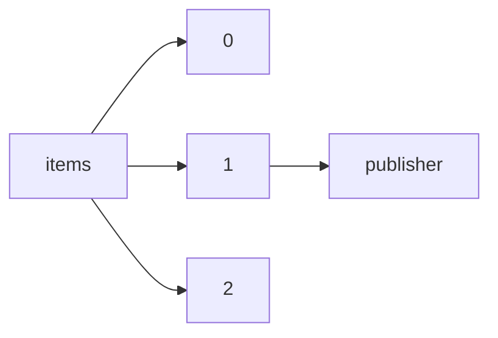

!!! warning "This document is not official Crossref documentation"
# Publisher
PATH = items/array/publisher(1)  
Occurs 143 470 525 times  
Unique values: > 999  
{ .annotate }

1. A route to an element, for example:  
   The route "items/array/publisher" corresponds to navigating through the JSON indices as  
   ["items"][0]["publisher"]  

!!! note "Due to current limitations, only the first 1,000 unique values are counted."

| **Row** | **Value** `String`                                                                                | **Count** `Int64` |
|--------:|-----------------------------------------------------------------------------------------------------:|---------------------:|
| **1**   | Elsevier BV                                                                                          | 19 265 587           |
| **2**   | Wiley                                                                                                | 9 481 372            |
| **3**   | Springer Science and Business Media LLC                                                              | 9 324 957            |
| **4**   | Informa UK Limited                                                                                   | 4 756 531            |
| **5**   | IEEE                                                                                                 | 3 881 692            |
| **6**   | Public Library of Science (PLoS)                                                                     | 3 835 966            |
| **7**   | Oxford University Press (OUP)                                                                        | 3 339 732            |
| **8**   | SAGE Publications                                                                                    | 2 713 654            |
| **9**   | Ovid Technologies (Wolters Kluwer Health)                                                            | 2 560 188            |
| **10**  | American Chemical Society (ACS)                                                                      | 2 348 506            |
| **11**  | Springer Berlin Heidelberg                                                                           | 1 931 232            |
| **12**  | Cambridge University Press (CUP)                                                                     | 1 657 431            |
| **13**  | JSTOR                                                                                                | 1 487 897            |
| **14**  | Routledge                                                                                            | 1 451 214            |
| **15**  | Institute of Electrical and Electronics Engineers (IEEE)                                             | 1 421 074            |
| **16**  | Elsevier                                                                                             | 1 385 757            |
| **17**  | Springer International Publishing                                                                    | 1 283 180            |
| **18**  | Oxford University Press                                                                              | 1 167 510            |
| **19**  | MDPI AG                                                                                              | 1 136 586            |
| **20**  | IOP Publishing                                                                                       | 1 122 083            |
| **21**  | Brill                                                                                                | 1 035 765            |
| **22**  | BMJ                                                                                                  | 922 902              |
| **23**  | De Gruyter                                                                                           | 921 521              |
| **24**  | Walter de Gruyter GmbH                                                                               | 904 122              |
| **25**  | Frontiers Media SA                                                                                   | 846 006              |
| **26**  | Georg Thieme Verlag KG                                                                               | 819 067              |
| **27**  | Royal Society of Chemistry (RSC)                                                                     | 763 464              |
| **28**  | American Physical Society (APS)                                                                      | 734 317              |
| **29**  | AIP Publishing                                                                                       | 710 310              |
| **30**  | Cambridge University Press                                                                           | 705 357              |
| **31**  | American Psychological Association (APA)                                                             | 647 066              |
| **32**  | American Medical Association (AMA)                                                                   | 629 026              |
| **33**  | CRC Press                                                                                            | 622 229              |
| **34**  | SPIE                                                                                                 | 551 067              |
| **35**  | University of Chicago Press                                                                          | 521 562              |
| **36**  | Springer Netherlands                                                                                 | 515 775              |
| **37**  | Hindawi Limited                                                                                      | 505 437              |
| **38**  | Emerald                                                                                              | 463 642              |
| **39**  | ENCODE Data Coordination Center                                                                      | 461 258              |
| **40**  | Organisation for Economic Co-Operation and Development  (OECD)                                       | 445 686              |
| **41**  | Project Muse                                                                                         | 443 248              |
| **42**  | FapUNIFESP (SciELO)                                                                                  | 434 491              |
| **43**  | S. Karger AG                                                                                         | 424 958              |
| **44**  | Springer US                                                                                          | 422 279              |
| **45**  | American Association for the Advancement of Science (AAAS)                                           | 413 856              |
| **46**  | Trans Tech Publications, Ltd.                                                                        | 393 660              |
| **47**  | ACM                                                                                                  | 387 798              |
| **48**  | Copernicus GmbH                                                                                      | 369 206              |
| **49**  | CAIRN                                                                                                | 360 682              |
| **50**  | EDP Sciences                                                                                         | 347 073              |
| **51**  | International Union of Crystallography (IUCr)                                                        | 333 896              |
| **52**  | PERSEE Program                                                                                       | 326 345              |
| **53**  | Japan Society of Mechanical Engineers                                                                | 323 029              |
| **54**  | Pleiades Publishing Ltd                                                                              | 315 232              |
| **55**  | OpenEdition                                                                                          | 311 572              |
| **56**  | John Wiley & Sons, Inc.                                                                              | 307 249              |
| **57**  | University of California Press                                                                       | 306 710              |
| **58**  | Office of Scientific and Technical Information (OSTI)                                                | 304 973              |
| **59**  | Duke University Press                                                                                | 301 140              |
| **60**  | BRILL                                                                                                | 299 152              |
| **61**  | Springer New York                                                                                    | 297 996              |
| **62**  | American Society for Microbiology                                                                    | 284 623              |
| **63**  | PeerJ                                                                                                | 273 606              |
| **64**  | Egypts Presidential Specialized Council for Education and Scientific Research                        | 273 453              |
| **65**  | Princeton University Press                                                                           | 270 690              |
| **66**  | Cold Spring Harbor Laboratory                                                                        | 269 705              |
| **67**  | DE GRUYTER                                                                                           | 265 457              |
| **68**  | Palgrave Macmillan UK                                                                                | 258 867              |
| **69**  | American Geophysical Union (AGU)                                                                     | 255 460              |
| **70**  | Research Square Platform LLC                                                                         | 254 664              |
| **71**  | Mark Allen Group                                                                                     | 250 023              |
| **72**  | Faculty Opinions Ltd                                                                                 | 246 300              |
| **73**  | Springer Singapore                                                                                   | 233 870              |
| **74**  | Springer Fachmedien Wiesbaden                                                                        | 233 542              |
| **75**  | Worldwide Protein Data Bank                                                                          | 232 364              |
| **76**  | Medknow                                                                                              | 231 337              |
| **77**  | American Association for Cancer Research (AACR)                                                      | 227 094              |
| **78**  | American Library Association                                                                         | 214 706              |
| **79**  | Institution of Engineering and Technology (IET)                                                      | 213 479              |
| **80**  | transcript Verlag                                                                                    | 209 574              |
| **81**  | Mary Ann Liebert Inc                                                                                 | 204 222              |
| **82**  | WORLD SCIENTIFIC                                                                                     | 203 815              |
| **83**  | IUCN                                                                                                 | 201 889              |
| **84**  | Springer-Verlag                                                                                      | 201 043              |
| **85**  | American Institute of Aeronautics and Astronautics                                                   | 200 135              |
| **86**  | The Optical Society                                                                                  | 197 938              |
| **87**  | IGI Global                                                                                           | 195 383              |
| **88**  | Canadian Science Publishing                                                                          | 191 856              |
| **89**  | eLife Sciences Publications, Ltd                                                                     | 186 844              |
| **90**  | Massachusetts Medical Society                                                                        | 184 117              |
| **91**  | Inderscience Publishers                                                                              | 180 439              |
| **92**  | American Physiological Society                                                                       | 178 445              |
| **93**  | The Electrochemical Society                                                                          | 178 058              |
| **94**  | Universidade de Sao Paulo, Agencia USP de Gestao da Informacao Academica (AGUIA)                     | 175 408              |
| **95**  | American Society of Hematology                                                                       | 172 998              |
| **96**  | World Scientific Pub Co Pte Lt                                                                       | 171 552              |
| **97**  | American Astronomical Society                                                                        | 169 929              |
| **98**  | SAE International                                                                                    | 164 123              |
| **99**  | Acoustical Society of America (ASA)                                                                  | 163 653              |
| **100** | Proceedings of the National Academy of Sciences                                                      | 157 156              |
| **101** | VS Verlag für Sozialwissenschaften                                                                   | 155 990              |
| **102** | Atlantis Press                                                                                       | 154 218              |
| **103** | Bentham Science Publishers Ltd.                                                                      | 153 397              |
| **104** | Georg Thieme Verlag                                                                                  | 153 180              |
| **105** | ASTM International                                                                                   | 152 268              |
| **106** | BSI British Standards                                                                                | 150 445              |
| **107** | Philosophy Documentation Center                                                                      | 150 399              |
| **108** | RCN Publishing Ltd.                                                                                  | 149 160              |
| **109** | American Society of Clinical Oncology (ASCO)                                                         | 147 389              |
| **110** | Pensoft Publishers                                                                                   | 144 867              |
| **111** | Association for Computing Machinery (ACM)                                                            | 144 828              |
| **112** | AMPCo                                                                                                | 143 762              |
| **113** | Harvard University Press                                                                             | 141 744              |
| **114** | Defense Technical Information Center                                                                 | 141 442              |
| **115** | American Society of Civil Engineers (ASCE)                                                           | 139 798              |
| **116** | John Wiley & Sons, Ltd                                                                               | 139 600              |
| **117** | SAGE Publications, Inc.                                                                              | 138 873              |
| **118** | ASME International                                                                                   | 135 797              |
| **119** | Center for Open Science                                                                              | 135 333              |
| **120** | OECD                                                                                                 | 132 029              |
| **121** | Edinburgh University Press                                                                           | 128 296              |
| **122** | American Meteorological Society                                                                      | 127 824              |
| **123** | Consortium Erudit                                                                                    | 125 753              |
| **124** | Test accounts                                                                                        | 125 401              |
| **125** | Edward Elgar Publishing                                                                              | 118 865              |
| **126** | Yale University Press                                                                                | 116 087              |
| **127** | AIP                                                                                                  | 115 677              |
| **128** | Portland Press Ltd.                                                                                  | 113 136              |
| **129** | Scientific Research Publishing, Inc.                                                                 | 112 713              |
| **130** | The Endocrine Society                                                                                | 112 148              |
| **131** | UN                                                                                                   | 107 934              |
| **132** | The Chemical Society of Japan                                                                        | 105 582              |
| **133** | The Royal Society                                                                                    | 105 075              |
| **134** | University of Toronto Press                                                                          | 104 735              |
| **135** | IOS Press                                                                                            | 103 019              |
| **136** | Qeios                                                                                                | 102 731              |
| **137** | OSA                                                                                                  | 102 639              |
| **138** | American Society of Mechanical Engineers                                                             | 102 264              |
| **139** | SPIE-Intl Soc Optical Eng                                                                            | 100 646              |
| **140** | Peter Lang                                                                                           | 100 062              |
| **141** | OMICS Publishing Group                                                                               | 99 847               |
| **142** | CABI Publishing                                                                                      | 99 291               |
| **143** | American Psychiatric Association Publishing                                                          | 98 953               |
| **144** | CSIRO Publishing                                                                                     | 98 750               |
| **145** | NamesforLife, LLC                                                                                    | 95 351               |
| **146** | The American Association of Immunologists                                                            | 95 203               |
| **147** | Macmillan Education UK                                                                               | 93 999               |
| **148** | Columbia University Press                                                                            | 93 997               |
| **149** | American Mathematical Society (AMS)                                                                  | 92 257               |
| **150** | Bodleian Libraries, University of Oxford                                                             | 90 267               |
| **151** | Optica Publishing Group                                                                              | 90 080               |
| **152** | John Benjamins Publishing Company                                                                    | 89 325               |
| **153** | Geological Society of America                                                                        | 88 177               |
| **154** | American Institute of Aeronautics and Astronautics (AIAA)                                            | 87 790               |
| **155** | Springer Vienna                                                                                      | 87 594               |
| **156** | Vieweg+Teubner Verlag                                                                                | 87 594               |
| **157** | Jaypee Brothers Medical Publishers (P) Ltd.                                                          | 87 423               |
| **158** | Nomos Verlagsgesellschaft mbH & Co. KG                                                               | 84 560               |
| **159** | Bloomsbury Academic                                                                                  | 82 359               |
| **160** | Cornell University Press                                                                             | 82 325               |
| **161** | Liverpool University Press                                                                           | 81 112               |
| **162** | American Thoracic Society                                                                            | 80 887               |
| **163** | US Geological Survey                                                                                 | 79 842               |
| **164** | Springer Nature Singapore                                                                            | 79 400               |
| **165** | SPE                                                                                                  | 78 514               |
| **166** | Gabler Verlag                                                                                        | 78 081               |
| **167** | University of Illinois Press                                                                         | 77 863               |
| **168** | American Society of Civil Engineers                                                                  | 76 622               |
| **169** | Spandidos Publications                                                                               | 74 643               |
| **170** | African Journals Online (AJOL)                                                                       | 74 329               |
| **171** | Amsterdam University Press                                                                           | 73 991               |
| **172** | International Society for Horticultural Science (ISHS)                                               | 73 149               |
| **173** | American Scientific Publishers                                                                       | 71 333               |
| **174** | Springer London                                                                                      | 71 173               |
| **175** | ASMEDC                                                                                               | 71 121               |
| **176** | The MIT Press                                                                                        | 70 897               |
| **177** | Vandenhoeck & Ruprecht                                                                               | 70 862               |
| **178** | EMH Swiss Medical Publishers, Ltd.                                                                   | 70 342               |
| **179** | American Academy of Pediatrics (AAP)                                                                 | 70 060               |
| **180** | Berghahn Books                                                                                       | 69 980               |
| **181** | The Company of Biologists                                                                            | 68 875               |
| **182** | J.B. Metzler                                                                                         | 68 788               |
| **183** | Royal College of Psychiatrists                                                                       | 68 607               |
| **184** | ACM Press                                                                                            | 67 665               |
| **185** | Palgrave Macmillan US                                                                                | 67 539               |
| **186** | Microbiology Society                                                                                 | 67 457               |
| **187** | Radiopaedia.org                                                                                      | 67 425               |
| **188** | Stanford University Press                                                                            | 67 299               |
| **189** | National Documentation Centre (EKT)                                                                  | 66 970               |
| **190** | Pharmaceutical Society of Japan                                                                      | 66 862               |
| **191** | Palgrave Macmillan                                                                                   | 66 655               |
| **192** | University of Toronto Press Inc. (UTPress)                                                           | 66 002               |
| **193** | Humana Press                                                                                         | 65 795               |
| **194** | SLACK, Inc.                                                                                          | 65 610               |
| **195** | Bioscientifica                                                                                       | 65 153               |
| **196** | Apress                                                                                               | 63 097               |
| **197** | Morressier                                                                                           | 62 900               |
| **198** | Diva Enterprises Private Limited                                                                     | 62 369               |
| **199** | Academy of Management                                                                                | 62 345               |
| **200** | Radiological Society of North America (RSNA)                                                         | 61 631               |
| **201** | Verlag Dr. Otto Schmidt                                                                              | 61 240               |
| **202** | Sciencedomain International                                                                          | 61 095               |
| **203** | ECO-Vector LLC                                                                                       | 60 904               |
| **204** | American Diabetes Association                                                                        | 60 767               |
| **205** | Rockefeller University Press                                                                         | 60 538               |
| **206** | American College of Physicians                                                                       | 59 320               |
| **207** | Wiley-VCH Verlag GmbH & Co. KGaA                                                                     | 58 985               |
| **208** | Böhlau Verlag                                                                                        | 57 358               |
| **209** | Society for Industrial & Applied Mathematics (SIAM)                                                  | 57 276               |
| **210** | Universidade Estadual de Campinas - Repositorio Institucional                                        | 56 715               |
| **211** | Portico                                                                                              | 55 969               |
| **212** | Bristol University Press                                                                             | 55 718               |
| **213** | Science China Press., Co. Ltd.                                                                       | 55 469               |
| **214** | Japan Society of Civil Engineers                                                                     | 55 420               |
| **215** | Natural Resources Canada/CMSS/Information Management                                                 | 54 886               |
| **216** | SciELO Agencia Nacional de Investigacion y Desarrollo (ANID)                                         | 54 820               |
| **217** | Allerton Press                                                                                       | 54 700               |
| **218** | Nomos Verlag                                                                                         | 54 533               |
| **219** | University of Pennsylvania Press                                                                     | 54 301               |
| **220** | Manchester University Press                                                                          | 54 190               |
| **221** | IEEE Comput. Soc                                                                                     | 53 816               |
| **222** | Magnolia Press                                                                                       | 53 677               |
| **223** | InTech                                                                                               | 53 250               |
| **224** | Hans Publishers                                                                                      | 53 088               |
| **225** | National Library of Serbia                                                                           | 53 056               |
| **226** | Society of Exploration Geophysicists                                                                 | 52 328               |
| **227** | AME Publishing Company                                                                               | 51 561               |
| **228** | Atena Editora                                                                                        | 51 477               |
| **229** | SAGE Publications Ltd                                                                                | 51 221               |
| **230** | American Society for Clinical Investigation                                                          | 51 040               |
| **231** | CrossRef                                                                                             | 50 101               |
| **232** | Taylor & Francis                                                                                     | 49 977               |
| **233** | Thomas Telford Ltd.                                                                                  | 49 871               |
| **234** | Baishideng Publishing Group Inc.                                                                     | 49 803               |
| **235** | China Science Publishing & Media Ltd.                                                                | 49 322               |
| **236** | Fordham University Press                                                                             | 48 900               |
| **237** | Association for Research in Vision and Ophthalmology (ARVO)                                          | 48 623               |
| **238** | IWA Publishing                                                                                       | 48 565               |
| **239** | Society for Neuroscience                                                                             | 48 388               |
| **240** | Oxford University PressOxford                                                                        | 48 385               |
| **241** | Science Alert                                                                                        | 48 270               |
| **242** | Universidad Nacional Autonoma de Mexico                                                              | 48 246               |
| **243** | Southern Medical Association                                                                         | 47 701               |
| **244** | Canadian Center of Science and Education                                                             | 47 673               |
| **245** | Beuth Verlag GmbH                                                                                    | 47 587               |
| **246** | IEEE Comput. Soc. Press                                                                              | 46 805               |
| **247** | Verlag C.H.BECK oHG                                                                                  | 46 748               |
| **248** | Japanese Society of Radiological Technology                                                          | 46 689               |
| **249** | American Vacuum Society                                                                              | 46 285               |
| **250** | Bloomsbury Publishing Plc                                                                            | 46 147               |
| **251** | Architectural Institute of Japan                                                                     | 46 026               |
| **252** | Shanghai Institute of Optics and Fine Mechanics                                                      | 45 750               |
| **253** | Akademizdatcenter Nauka                                                                              | 45 357               |
| **254** | JMIR Publications Inc.                                                                               | 45 210               |
| **255** | Scientific Societies                                                                                 | 44 837               |
| **256** | Birkhäuser Basel                                                                                     | 44 750               |
| **257** | Annual Reviews                                                                                       | 44 104               |
| **258** | MIT Press - Journals                                                                                 | 43 951               |
| **259** | University of Hawaii Press                                                                           | 43 844               |
| **260** | Gorgias Press                                                                                        | 43 843               |
| **261** | University of Texas Press                                                                            | 43 807               |
| **262** | Indiana University Press                                                                             | 43 529               |
| **263** | Hogrefe Publishing Group                                                                             | 43 415               |
| **264** | Nomos                                                                                                | 43 284               |
| **265** | Institute of Electrical Engineers of Japan (IEE Japan)                                               | 43 201               |
| **266** | TechKnowledge General Trading LLC                                                                    | 43 082               |
| **267** | Institute for Operations Research and the Management Sciences (INFORMS)                              | 43 069               |
| **268** | Chapman and Hall/CRC                                                                                 | 42 980               |
| **269** | American Public Health Association                                                                   | 42 878               |
| **270** | Scandinavian University Press / Universitetsforlaget AS                                              | 42 058               |
| **271** | Brill \| Nijhoff                                                                                     | 42 041               |
| **272** | European Association of Geoscientists & Engineers                                                    | 41 976               |
| **273** | Medip Academy                                                                                        | 41 362               |
| **274** | The Russian Academy of Sciences                                                                      | 41 031               |
| **275** | Brepols Publishers NV                                                                                | 40 805               |
| **276** | Penn State University Press                                                                          | 40 523               |
| **277** | Springer Publishing Company                                                                          | 40 193               |
| **278** | Kluwer Law International BV                                                                          | 39 613               |
| **279** | Blackwell Publishing Ltd                                                                             | 39 543               |
| **280** | Case Journals                                                                                        | 39 251               |
| **281** | American Society for Horticultural Science                                                           | 39 160               |
| **282** | Begell House                                                                                         | 38 822               |
| **283** | Centre for Evaluation in Education and Science (CEON/CEES)                                           | 38 750               |
| **284** | Association for Computational Linguistics                                                            | 38 487               |
| **285** | Oldenbourg Wissenschaftsverlag                                                                       | 38 427               |
| **286** | New York University Press                                                                            | 38 403               |
| **287** | American Association of Physics Teachers (AAPT)                                                      | 38 060               |
| **288** | Physical Society of Japan                                                                            | 37 277               |
| **289** | Akademiai Kiado Zrt.                                                                                 | 37 128               |
| **290** | Journal of Neurosurgery Publishing Group (JNSPG)                                                     | 37 048               |
| **291** | Presses universitaires de Rennes                                                                     | 36 816               |
| **292** | Rutgers University Press                                                                             | 36 743               |
| **293** | Brill Deutschland GmbH                                                                               | 36 689               |
| **294** | Policy Press                                                                                         | 36 404               |
| **295** | Erich Schmidt Verlag GmbH & Co. KG                                                                   | 36 294               |
| **296** | Human Kinetics                                                                                       | 35 882               |
| **297** | Brepols Publishers                                                                                   | 35 669               |
| **298** | AOSIS                                                                                                | 35 634               |
| **299** | Det Kgl. Bibliotek/Royal Danish Library                                                              | 35 578               |
| **300** | Publications Office of the European Union                                                            | 35 395               |
| **301** | Author(s)                                                                                            | 35 363               |
| **302** | Franco Angeli                                                                                        | 35 299               |
| **303** | Informa Healthcare                                                                                   | 35 121               |
| **304** | Cureus, Inc.                                                                                         | 35 093               |
| **305** | British Institute of Radiology                                                                       | 34 602               |
| **306** | Sissa Medialab                                                                                       | 34 504               |
| **307** | Bangladesh Journals Online (JOL)                                                                     | 34 348               |
| **308** | ASEE Conferences                                                                                     | 34 267               |
| **309** | Institution of Engineering and Technology                                                            | 34 263               |
| **310** | Editorial CSIC                                                                                       | 34 260               |
| **311** | Deutscher Universitätsverlag                                                                         | 34 110               |
| **312** | Japanese Society of Internal Medicine                                                                | 33 400               |
| **313** | Publishing House Helvetica (Publications)                                                            | 33 370               |
| **314** | Impact Journals, LLC                                                                                 | 33 357               |
| **315** | Bohn Stafleu van Loghum                                                                              | 33 236               |
| **316** | Peeters Publishers                                                                                   | 33 215               |
| **317** | American Institute of Mathematical Sciences (AIMS)                                                   | 33 141               |
| **318** | IATED                                                                                                | 33 043               |
| **319** | Japan Institute of Metals                                                                            | 32 788               |
| **320** | American Dairy Science Association                                                                   | 32 788               |
| **321** | Future Medicine Ltd                                                                                  | 32 755               |
| **322** | European Respiratory Society                                                                         | 32 392               |
| **323** | Institute of Electronics, Information and Communications Engineers (IEICE)                           | 32 082               |
| **324** | Nepal Journals Online (JOL)                                                                          | 32 071               |
| **325** | Academic Journals                                                                                    | 31 960               |
| **326** | Authorea, Inc.                                                                                       | 31 932               |
| **327** | Institute of Mathematical Statistics                                                                 | 31 881               |
| **328** | IOSR Journals                                                                                        | 31 774               |
| **329** | Boehlau Verlag Ges.m.b.H. & Co. KG                                                                   | 31 408               |
| **330** | Geological Society of London                                                                         | 31 032               |
| **331** | Kluwer Academic Publishers                                                                           | 30 954               |
| **332** | American Mathematical Society                                                                        | 30 745               |
| **333** | Brill \| Fink                                                                                        | 30 718               |
| **334** | American Speech Language Hearing Association                                                         | 30 698               |
| **335** | Schweizerbart                                                                                        | 30 690               |
| **336** | Acta Physica Sinica, Chinese Physical Society and Institute of Physics, Chinese Academy of Sciences  | 30 446               |
| **337** | ScopeMed                                                                                             | 30 385               |
| **338** | Japanese Urological Association                                                                      | 30 385               |
| **339** | National Bureau of Economic Research                                                                 | 30 067               |
| **340** | Intellect                                                                                            | 30 037               |
| **341** | Science Publishing Group                                                                             | 29 908               |
| **342** | Environmental Health Perspectives                                                                    | 29 796               |
| **343** | American Roentgen Ray Society                                                                        | 29 724               |
| **344** | United Nations                                                                                       | 29 718               |
| **345** | Blue Eyes Intelligence Engineering and Sciences Engineering and Sciences Publication - BEIESP        | 29 467               |
| **346** | University of Pittsburgh Press                                                                       | 29 423               |
| **347** | Even3                                                                                                | 29 334               |
| **348** | National Council of Teachers of English                                                              | 29 281               |
| **349** | American Chemical Society                                                                            | 29 032               |
| **350** | Emerald Publishing Limited                                                                           | 28 449               |
| **351** | IEE                                                                                                  | 28 416               |
| **352** | Iowa State University                                                                                | 28 400               |
| **353** | American Economic Association                                                                        | 28 281               |
| **354** | Smithsonian Institution                                                                              | 28 279               |
| **355** | United Nations Publications                                                                          | 28 226               |
| **356** | Universidad de Navarra                                                                               | 28 045               |
| **357** | ASOS Yayinevi                                                                                        | 28 037               |
| **358** | Brill \| Schöningh                                                                                   | 28 036               |
| **359** | European Space Agency                                                                                | 28 016               |
| **360** | National Academy of Sciences of Ukraine (Co. LTD Ukrinformnauka)                                     | 28 004               |
| **361** | Springer Japan                                                                                       | 27 858               |
| **362** | SCITEPRESS - Science and Technology Publications                                                     | 27 725               |
| **363** | Hart Publishing                                                                                      | 27 469               |
| **364** | The University of Iowa                                                                               | 27 317               |
| **365** | Research, Society and Development                                                                    | 27 082               |
| **366** | Gabler                                                                                               | 27 081               |
| **367** | Trans Tech Publications Ltd.                                                                         | 26 843               |
| **368** | The Japanese Psychological Association                                                               | 26 801               |
| **369** | The University of Hong Kong Libraries                                                                | 26 611               |
| **370** | World Scientific Pub Co Pte Ltd                                                                      | 26 578               |
| **371** | Galenos Yayinevi                                                                                     | 26 429               |
| **372** | The Pennsylvania State University Press                                                              | 26 001               |
| **373** | Ubiquity Press, Ltd.                                                                                 | 25 968               |
| **374** | Fairchild Books                                                                                      | 25 639               |
| **375** | MyJove Corporation                                                                                   | 25 561               |
| **376** | Dykinson                                                                                             | 25 400               |
| **377** | ISCA                                                                                                 | 25 390               |
| **378** | Carl Hanser Verlag GmbH & Co. KG                                                                     | 25 135               |
| **379** | Inter-Research Science Center                                                                        | 24 945               |
| **380** | Iron and Steel Institute of Japan                                                                    | 24 895               |
| **381** | Jaypee Brothers Medical Publishing                                                                   | 24 892               |
| **382** | Boydell and Brewer Limited                                                                           | 24 727               |
| **383** | IntechOpen                                                                                           | 24 717               |
| **384** | University of Alberta Libraries                                                                      | 24 578               |
| **385** | Institute of Mathematics, Polish Academy of Sciences                                                 | 24 496               |
| **386** | Termedia Sp. z.o.o.                                                                                  | 24 173               |
| **387** | Universidade Federal do Parana                                                                       | 24 116               |
| **388** | Oxford University PressNew York                                                                      | 24 086               |
| **389** | California Digital Library (CDL)                                                                     | 24 068               |
| **390** | European Respiratory Society (ERS)                                                                   | 23 903               |
| **391** | MDPI                                                                                                 | 23 817               |
| **392** | Iberoamericana Vervuert                                                                              | 23 747               |
| **393** | Common Ground Research Networks                                                                      | 23 645               |
| **394** | National Council of Teachers of Mathematics                                                          | 23 511               |
| **395** | Emerald Group Publishing Limited                                                                     | 23 029               |
| **396** | EDUFU - Editora da Universidade Federal de Uberlandia                                                | 22 914               |
| **397** | Excellent Publishers                                                                                 | 22 768               |
| **398** | Society of Petroleum Engineers (SPE)                                                                 | 22 749               |
| **399** | Foundation of Computer Science                                                                       | 22 725               |
| **400** | Verlag Barbara Budrich                                                                               | 22 562               |
| **401** | DEStech Publications                                                                                 | 22 522               |
| **402** | Steinkopff                                                                                           | 22 451               |
| **403** | Adam Mickiewicz University Poznan                                                                    | 22 441               |
| **404** | Institute of Advanced Engineering and Science                                                        | 22 395               |
| **405** | Faculdades Catolicas                                                                                 | 22 346               |
| **406** | Osterreichische Akademie der Wissenschaften                                                          | 22 290               |
| **407** | Universidad Complutense de Madrid (UCM)                                                              | 22 254               |
| **408** | Index Copernicus                                                                                     | 22 234               |
| **409** | PAGEPress Publications                                                                               | 22 156               |
| **410** | Wissenschaftliche Verlagsgesellschaft mbH                                                            | 22 121               |
| **411** | Japan Surgical Association                                                                           | 21 945               |
| **412** | MedCrave Group, LLC                                                                                  | 21 903               |
| **413** | Wiley-Blackwell                                                                                      | 21 856               |
| **414** | British Psychological Society                                                                        | 21 602               |
| **415** | CMV Verlag                                                                                           | 21 393               |
| **416** | ZappyLab, Inc.                                                                                       | 21 050               |
| **417** | Auerbach Publications                                                                                | 21 044               |
| **418** | American Association of Petroleum Geologists AAPG/Datapages                                          | 20 825               |
| **419** | Society of Motion Picture and Television Engineers (SMPTE)                                           | 20 739               |
| **420** | Presses de l'Université du Québec                                                                    | 20 523               |
| **421** | Vandenhoeck & Ruprecht GmbH & Co, KG                                                                 | 20 439               |
| **422** | GN1 Genesis Network                                                                                  | 20 375               |
| **423** | I.B.Tauris                                                                                           | 20 263               |
| **424** | CQ Press                                                                                             | 20 183               |
| **425** | Modern Language Association (MLA)                                                                    | 20 140               |
| **426** | Physica-Verlag HD                                                                                    | 20 126               |
| **427** | VDI Verlag GmbH                                                                                      | 20 113               |
| **428** | International Journal for Research in Applied Science and Engineering Technology (IJRASET)           | 20 051               |
| **429** | American Psychological Association                                                                   | 20 022               |
| **430** | Uniwersytet Mikolaja Kopernika/Nicolaus Copernicus University                                        | 20 005               |
| **431** | BMJ Publishing Group Ltd                                                                             | 19 991               |
| **432** | EAGE Publications BV                                                                                 | 19 974               |
| **433** | University of Arizona Press                                                                          | 19 960               |
| **434** | DE GRUYTER SAUR                                                                                      | 19 739               |
| **435** | Japanese Society of Medical Instrumentation                                                          | 19 425               |
| **436** | Mohr Siebeck                                                                                         | 19 421               |
| **437** | David Publishing Company                                                                             | 19 392               |
| **438** | Aurora Group, s.r.o                                                                                  | 19 334               |
| **439** | Vilnius University Press                                                                             | 19 230               |
| **440** | Biophysical Society of Japan                                                                         | 19 227               |
| **441** | Lynne Rienner Publishers                                                                             | 19 044               |
| **442** | University of Michigan Press                                                                         | 18 986               |
| **443** | AVES Publishing Co.                                                                                  | 18 981               |
| **444** | Tomsk State University                                                                               | 18 970               |
| **445** | Organisation for Economic Co-Operation and Development (OECD)                                        | 18 926               |
| **446** | Pluto Press                                                                                          | 18 771               |
| **447** | WIT Press                                                                                            | 18 747               |
| **448** | Universidade Federal do Rio Grande do Sul                                                            | 18 675               |
| **449** | Victoria University of Wellington Library                                                            | 18 538               |
| **450** | Japan Society for Bioscience, Biotechnology, and Agrochemistry                                       | 18 441               |
| **451** | Louisiana State University Libraries                                                                 | 18 357               |
| **452** | AERA                                                                                                 | 18 285               |
| **453** | Harvard University Asia Center                                                                       | 18 267               |
| **454** | University of Arkansas Press                                                                         | 18 244               |
| **455** | Computers, Materials and Continua (Tech Science Press)                                               | 18 219               |
| **456** | Springer Milan                                                                                       | 18 200               |
| **457** | American Society of Tropical Medicine and Hygiene                                                    | 18 199               |
| **458** | South Florida Publishing LLC                                                                         | 18 163               |
| **459** | Scientific Scholar                                                                                   | 18 041               |
| **460** | UNED - Universidad Nacional de Educacion a Distancia                                                 | 18 018               |
| **461** | Inter-university Consortium for Political and Social Research (ICPSR)                                | 17 887               |
| **462** | Birkhäuser Boston                                                                                    | 17 869               |
| **463** | Lavoisier                                                                                            | 17 848               |
| **464** | Media Sphere Publishing Group                                                                        | 17 639               |
| **465** | BENTHAM SCIENCE PUBLISHERS                                                                           | 17 578               |
| **466** | SciTePress - Science and and Technology Publications                                                 | 17 518               |
| **467** | Chongqing VIP Information Co.,Ltd.                                                                   | 17 432               |
| **468** | Institute of Organic Chemistry & Biochemistry                                                        | 17 407               |
| **469** | ISEAS Publishing                                                                                     | 17 325               |
| **470** | F1000 Research Ltd                                                                                   | 17 291               |
| **471** | Water Environment Federation                                                                         | 17 253               |
| **472** | American Academy of Pediatrics                                                                       | 17 093               |
| **473** | Universidade de Estado do Rio de Janeiro                                                             | 17 066               |
| **474** | 1517 Media                                                                                           | 17 066               |
| **475** | Walter de Gruyter                                                                                    | 16 991               |
| **476** | Tokyo Geographical Society                                                                           | 16 840               |
| **477** | Editora Blucher                                                                                      | 16 809               |
| **478** | Institute of Research and Community Services Diponegoro University (LPPM UNDIP)                      | 16 757               |
| **479** | Catholic University of America Press                                                                 | 16 714               |
| **480** | Universidade Federal de Santa Catarina (UFSC)                                                        | 16 629               |
| **481** | Begellhouse                                                                                          | 16 582               |
| **482** | American Society of Agricultural and Biological Engineers (ASABE)                                    | 16 574               |
| **483** | American Society for Pharmacology & Experimental Therapeutics (ASPET)                                | 16 547               |
| **484** | University of Arizona Libraries                                                                      | 16 481               |
| **485** | ASM International                                                                                    | 16 453               |
| **486** | Archaeopress Publishing Ltd                                                                          | 16 449               |
| **487** | Sri Lanka Journals Online (JOL)                                                                      | 16 401               |
| **488** | Wellcome                                                                                             | 16 328               |
| **489** | V&R unipress                                                                                         | 16 313               |
| **490** | Universidade Estadual de Campinas                                                                    | 16 139               |
| **491** | U.S. Pharmacopeial Convention                                                                        | 16 124               |
| **492** | The World Bank                                                                                       | 16 088               |
| **493** | International Monetary Fund (IMF)                                                                    | 16 084               |
| **494** | SciVee, Inc                                                                                          | 16 016               |
| **495** | Universitat Autonoma de Barcelona                                                                    | 15 989               |
| **496** | Royal Society of Chemistry                                                                           | 15 962               |
| **497** | Oto-Rhino-Laryngological Society of Japan, Inc.                                                      | 15 960               |
| **498** | Edizioni Minerva Medica                                                                              | 15 937               |
| **499** | Japanese Society of Fisheries Science                                                                | 15 929               |
| **500** | Royal Pharmaceutical Society                                                                         | 15 898               |
| **501** | Japanese Circulation Society                                                                         | 15 891               |
| **502** | Universidad de Costa Rica                                                                            | 15 874               |
| **503** | Briefland                                                                                            | 15 835               |
| **504** | University of Iowa Press                                                                             | 15 779               |
| **505** | The Society of Practical Otolaryngology                                                              | 15 779               |
| **506** | The Japan Society of Applied Physics                                                                 | 15 767               |
| **507** | Infra-M Academic Publishing House                                                                    | 15 760               |
| **508** | Academic Studies Press                                                                               | 15 667               |
| **509** | Mathematical Sciences Publishers                                                                     | 15 647               |
| **510** | Association for the Advancement of Artificial Intelligence (AAAI)                                    | 15 631               |
| **511** | Biblioteca Central da UNB                                                                            | 15 631               |
| **512** | WTO                                                                                                  | 15 601               |
| **513** | Society of Polymer Science, Japan                                                                    | 15 593               |
| **514** | The Scientific and Technological Research Council of Turkey (TUBITAK-ULAKBIM) - DIGITAL COMMONS JOUR | 15 585               |
| **515** | Danish Chemical Society                                                                              | 15 441               |
| **516** | British Editorial Society of Bone & Joint Surgery                                                    | 15 279               |
| **517** | The Japan Institute of Heterocyclic Chemistry                                                        | 15 275               |
| **518** | American Mathematical\n                    Society                                                   | 15 165               |
| **519** | University of Wisconsin Press                                                                        | 15 114               |
| **520** | Multilingual Matters                                                                                 | 15 114               |
| **521** | Steklov Mathematical Institute                                                                       | 15 113               |
| **522** | EJournal Publishing                                                                                  | 15 108               |
| **523** | Psychology Press                                                                                     | 15 100               |
| **524** | Martinus Nijhoff Publishers                                                                          | 15 029               |
| **525** | Springer Nature Switzerland                                                                          | 15 020               |
| **526** | The Royal Society of Chemistry                                                                       | 14 983               |
| **527** | Little William Bourke                                                                                | 14 953               |
| **528** | Equinox Publishing                                                                                   | 14 949               |
| **529** | Ryerson University Library and Archives                                                              | 14 898               |
| **530** | Seventh Sense Research Group Journals                                                                | 14 875               |
| **531** | Medical Journals Sweden AB                                                                           | 14 845               |
| **532** | Biodiversity Heritage Library                                                                        | 14 838               |
| **533** | Society of Chemical Engineers, Japan                                                                 | 14 824               |
| **534** | Universidad de Chile                                                                                 | 14 764               |
| **535** | Japan Society for Precision Engineering                                                              | 14 755               |
| **536** | Ceramic Society of Japan                                                                             | 14 750               |
| **537** | Japanese Society of Veterinary Science                                                               | 14 667               |
| **538** | Presses Universitaires de France                                                                     | 14 639               |
| **539** | J.F. Bergmann-Verlag                                                                                 | 14 617               |
| **540** | Presses universitaires du Septentrion                                                                | 14 548               |
| **541** | Paul Mellon Centre for Studies in British Art                                                        | 14 518               |
| **542** | Brewing Society of Japan                                                                             | 14 409               |
| **543** | Health Affairs (Project Hope)                                                                        | 14 407               |
| **544** | Universitas Gadjah Mada                                                                              | 14 331               |
| **545** | Japanese Pharmacological Society                                                                     | 14 308               |
| **546** | Academy of Science of South Africa                                                                   | 14 296               |
| **547** | Wydawnictwo SIGMA-NOT, sp. z.o.o.                                                                    | 14 279               |
| **548** | Knowledge E                                                                                          | 14 256               |
| **549** | Carleton University                                                                                  | 14 243               |
| **550** | European Mathematical Society - EMS - Publishing House GmbH                                          | 14 195               |
| **551** | International Journal Of Advanced Research                                                           | 14 136               |
| **552** | Juniper Publishers                                                                                   | 14 119               |
| **553** | OLDENBOURG WISSENSCHAFTSVERLAG                                                                       | 14 048               |
| **554** | AICIT                                                                                                | 14 030               |
| **555** | Afghanistan Centre at Kabul University                                                               | 14 025               |
| **556** | Apple Academic Press                                                                                 | 14 020               |
| **557** | Japan Science and Technology Agency (JST)                                                            | 13 998               |
| **558** | Valley International                                                                                 | 13 963               |
| **559** | International Press of Boston                                                                        | 13 779               |
| **560** | Universidad Federal de Santa Maria                                                                   | 13 740               |
| **561** | JCDR Research and Publications                                                                       | 13 711               |
| **562** | BMJ Publishing Group Ltd and European League Against Rheumatism                                      | 13 681               |
| **563** | Springer India                                                                                       | 13 646               |
| **564** | CABI                                                                                                 | 13 636               |
| **565** | Seismological Society of America (SSA)                                                               | 13 634               |
| **566** | American Society of Agricultural and Biological Engineers                                            | 13 624               |
| **567** | Ghent University                                                                                     | 13 616               |
| **568** | American Concrete Institute                                                                          | 13 596               |
| **569** | Routledge India                                                                                      | 13 591               |
| **570** | Stef92 Technology                                                                                    | 13 502               |
| **571** | University of Minnesota Press                                                                        | 13 463               |
| **572** | Okayama Medical Association                                                                          | 13 453               |
| **573** | University Press of Florida                                                                          | 13 379               |
| **574** | The Lutterworth Press                                                                                | 13 360               |
| **575** | SensePublishers                                                                                      | 13 348               |
| **576** | UNP - Nebraska                                                                                       | 13 331               |
| **577** | A and V Publications                                                                                 | 13 260               |
| **578** | John Libbey Eurotext                                                                                 | 13 242               |
| **579** | Japanese Association of Indian and Buddhist Studies                                                  | 13 221               |
| **580** | Uspekhi Fizicheskikh Nauk (UFN) Journal                                                              | 13 083               |
| **581** | DE GRUYTER MOUTON                                                                                    | 13 001               |
| **582** | Willamette University                                                                                | 12 997               |
| **583** | AIP Publishing LLC                                                                                   | 12 983               |
| **584** | AkiNik Publications                                                                                  | 12 973               |
| **585** | Universidad Nacional de Colombia                                                                     | 12 955               |
| **586** | University of Mosul                                                                                  | 12 882               |
| **587** | The Electrochemical Society of Japan                                                                 | 12 803               |
| **588** | Universidade Estadual de Londrina                                                                    | 12 802               |
| **589** | EAI                                                                                                  | 12 684               |
| **590** | Duke University Libraries                                                                            | 12 616               |
| **591** | VM Media SP. zo.o VM Group SK                                                                        | 12 615               |
| **592** | Universitas Udayana                                                                                  | 12 615               |
| **593** | SciELO Espana/Repisalud                                                                              | 12 600               |
| **594** | Ivyspring International Publisher                                                                    | 12 482               |
| **595** | Illuminating Engineering Society of Japan                                                            | 12 427               |
| **596** | West-Japanese Society of Orthopedics & Traumatology                                                  | 12 391               |
| **597** | Routledge-Cavendish                                                                                  | 12 346               |
| **598** | Japan Society for Analytical Chemistry                                                               | 12 312               |
| **599** | El Colegio de México                                                                                 | 12 126               |
| **600** | Maney Publishing                                                                                     | 12 097               |
| **601** | Universidad del Externado de Colombia                                                                | 11 968               |
| **602** | Boom Uitgevers Den Haag                                                                              | 11 913               |
| **603** | Penguin Random House Verlagsgruppe GmbH                                                              | 11 889               |
| **604** | Editions Techniques de l Ingenieur                                                                   | 11 827               |
| **605** | Springer Fachmedien Wiesbaden GmbH                                                                   | 11 809               |
| **606** | EManuscript Technologies                                                                             | 11 775               |
| **607** | Kyushu Dental Society                                                                                | 11 701               |
| **608** | Indian Society for Education and Environment                                                         | 11 632               |
| **609** | Nordic Council of Ministers                                                                          | 11 572               |
| **610** | Chinese Journal of Mechanical Engineering                                                            | 11 553               |
| **611** | Brazilian Journal of Development                                                                     | 11 544               |
| **612** | Vahlen                                                                                               | 11 530               |
| **613** | John Wiley & Sons, Inc                                                                               | 11 487               |
| **614** | University Press of Mississippi                                                                      | 11 412               |
| **615** | Future Science Ltd                                                                                   | 11 409               |
| **616** | Science Publications                                                                                 | 11 360               |
| **617** | Universidad Pontificia de Salamanca                                                                  | 11 358               |
| **618** | Cornell Lab of Ornithology                                                                           | 11 227               |
| **619** | International Institute for Science, Technology and Education                                        | 11 222               |
| **620** | Norwegian Medical Association                                                                        | 11 203               |
| **621** | University of Ljubljana                                                                              | 11 190               |
| **622** | Institute of Mathematics, Czech Academy of Sciences                                                  | 11 149               |
| **623** | Duncker & Humblot GmbH                                                                               | 11 120               |
| **624** | University of Debrecen/ Debreceni Egyetem                                                            | 10 968               |
| **625** | The Japan Institute of Energy                                                                        | 10 964               |
| **626** | The Haworth Press                                                                                    | 10 909               |
| **627** | KARGER                                                                                               | 10 890               |
| **628** | Centers for Disease Control and Prevention (CDC)                                                     | 10 834               |
| **629** | Boydell & Brewer                                                                                     | 10 824               |
| **630** | University of Notre Dame Press                                                                       | 10 820               |
| **631** | University of Michigan Library                                                                       | 10 752               |
| **632** | Universitas Airlangga                                                                                | 10 751               |
| **633** | Japan Society for Occupational Health                                                                | 10 745               |
| **634** | Kare Publishing                                                                                      | 10 734               |
| **635** | Universidad Nacional Mayor de San Marcos, Vicerectorado de Investigacion                             | 10 699               |
| **636** | Japan Society of Physical Education, Health, and Sport Sciences                                      | 10 674               |
| **637** | CMA Joule Inc.                                                                                       | 10 664               |
| **638** | American Veterinary Medical Association (AVMA)                                                       | 10 664               |
| **639** | University of South Carolina Press                                                                   | 10 651               |
| **640** | Universidad Nacional de La Plata                                                                     | 10 551               |
| **641** | American Geophysical Union                                                                           | 10 528               |
| **642** | American Journal of Science (AJS)                                                                    | 10 522               |
| **643** | Guilford Publications                                                                                | 10 522               |
| **644** | Coimbra University Press                                                                             | 10 510               |
| **645** | Korean Physical Society                                                                              | 10 498               |
| **646** | New Prairie Press                                                                                    | 10 487               |
| **647** | Institute of Electrical and Electronics Engineers                                                    | 10 480               |
| **648** | Institute of Medico-legal Publications Private Limited                                               | 10 476               |
| **649** | Society of Materials Science, Japan                                                                  | 10 464               |
| **650** | Institute of Image Information and Television Engineers                                              | 10 417               |
| **651** | Akshantala Enterprises Private Limited                                                               | 10 397               |
| **652** | Dustri-Verlgag Dr. Karl Feistle                                                                      | 10 383               |
| **653** | Internet Scientific Publishers, LLC                                                                  | 10 314               |
| **654** | Japan Audiological Society                                                                           | 10 309               |
| **655** | National Bureau of Standards                                                                         | 10 295               |
| **656** | British Academy                                                                                      | 10 206               |
| **657** | Universidade Estadual de Maringa                                                                     | 10 167               |
| **658** | Brawijaya University                                                                                 | 10 165               |
| **659** | Japanese Association for Chest Surgery                                                               | 10 147               |
| **660** | IP Innovative Publication Pvt Ltd                                                                    | 10 139               |
| **661** | Uniwersytet Lodzki (University of Lodz)                                                              | 10 054               |
| **662** | Vilnius Gediminas Technical University                                                               | 10 053               |
| **663** | Pro Reitoria de Pesquisa, Pos Graduacao e Inovacao - UFF                                             | 10 049               |
| **664** | Vieweg+Teubner                                                                                       | 10 014               |
| **665** | The Global Journals                                                                                  | 10 009               |
| **666** | Euroasian Scientific and Industrial Chamber, Ltd.                                                    | 9 978                |
| **667** | Publicidad Permanyer, SLU                                                                            | 9 969                |
| **668** | Horizon Research Publishing Co., Ltd.                                                                | 9 936                |
| **669** | Aarhus University Press                                                                              | 9 936                |
| **670** | International Scientific Information, Inc.                                                           | 9 933                |
| **671** | Éditions de la Sorbonne                                                                              | 9 926                |
| **672** | The Jutendo Medical Journal                                                                          | 9 920                |
| **673** | Institute of Physics, Polish Academy of Sciences                                                     | 9 904                |
| **674** | Academy and Industry Research Collaboration Center (AIRCC)                                           | 9 899                |
| **675** | Frontier Scientific Publishing Pte Ltd                                                               | 9 895                |
| **676** | Duncker & Humblot                                                                                    | 9 889                |
| **677** | Bloomsbury Publishing                                                                                | 9 885                |
| **678** | Maad Rayan Publishing Company                                                                        | 9 863                |
| **679** | Pageant Media US                                                                                     | 9 851                |
| **680** | Royal Irish Academy                                                                                  | 9 840                |
| **681** | Society of Fiber Science and Technology Japan                                                        | 9 818                |
| **682** | Intellect Books                                                                                      | 9 816                |
| **683** | Oxbow Books                                                                                          | 9 784                |
| **684** | VDI Fachmedien GmbH and Co. KG                                                                       | 9 760                |
| **685** | De Gruyter Mouton                                                                                    | 9 733                |
| **686** | National Aviation University                                                                         | 9 694                |
| **687** | Clute Institute                                                                                      | 9 632                |
| **688** | American Educational Research Association (AERA)                                                     | 9 621                |
| **689** | The Surface Finishing Society of Japan                                                               | 9 592                |
| **690** | International Information and Engineering Technology Association                                     | 9 562                |
| **691** | University of North Carolina Press                                                                   | 9 549                |
| **692** | AMERICAN CHEMICAL SOCIETY                                                                            | 9 537                |
| **693** | Omniscient Pte Ltd                                                                                   | 9 410                |
| **694** | Acta Physico-Chimica Sinica & University Chemistry Editorial Office, Peking University               | 9 315                |
| **695** | Wiley-VCH Verlag GmbH                                                                                | 9 310                |
| **696** | Harrassowitz, O                                                                                      | 9 303                |
| **697** | I.B. Tauris                                                                                          | 9 262                |
| **698** | University of Queensland Library                                                                     | 9 242                |
| **699** | Human Resources Management Academic Research Society (HRMARS)                                        | 9 235                |
| **700** | Universidade Federal de Goias                                                                        | 9 165                |
| **701** | [s.n.]                                                                                               | 9 133                |
| **702** | Anthem Press                                                                                         | 9 119                |
| **703** | The City Planning Institute of Japan                                                                 | 9 084                |
| **704** | Osterreichische Akademie der Wissenschaften, Verlag                                                  | 9 079                |
| **705** | Carl Hanser Verlag GmbH &amp; Co. KG                                                                 | 9 072                |
| **706** | Canadian Institute of Forestry                                                                       | 9 065                |
| **707** | University of Toronto Libraries - UOTL                                                               | 9 043                |
| **708** | The Norwegian Dental Journal                                                                         | 9 021                |
| **709** | Universidad de Alicante Servicio de Publicaciones                                                    | 8 979                |
| **710** | Verlag C.H.Beck oHG                                                                                  | 8 968                |
| **711** | Private Enterprise, Vladislav Ivanov                                                                 | 8 933                |
| **712** | OTC                                                                                                  | 8 919                |
| **713** | International Balkan University                                                                      | 8 907                |
| **714** | Richtmann Publishing                                                                                 | 8 879                |
| **715** | MQUP                                                                                                 | 8 866                |
| **716** | Dunod                                                                                                | 8 860                |
| **717** | Societe entomologique de France                                                                      | 8 852                |
| **718** | Sciedu Press                                                                                         | 8 837                |
| **719** | Canadian Museum of History                                                                           | 8 781                |
| **720** | Kamla Raj Enterprises                                                                                | 8 749                |
| **721** | Michigan State University Press                                                                      | 8 742                |
| **722** | Universitat Politecnica de Valencia                                                                  | 8 689                |
| **723** | University Goettingen Repository                                                                     | 8 687                |
| **724** | The Electromagnetics Academy                                                                         | 8 659                |
| **725** | Presses de l'Université Laval                                                                        | 8 659                |
| **726** | International Glaciological Society                                                                  | 8 650                |
| **727** | Japanese Society for Bacteriology                                                                    | 8 637                |
| **728** | Estonian Academy Publishers                                                                          | 8 572                |
| **729** | Viguera Editores SLU                                                                                 | 8 561                |
| **730** | Psychosozial-Verlag                                                                                  | 8 510                |
| **731** | Canadian Mathematical Society                                                                        | 8 506                |
| **732** | University of Florida George A Smathers Libraries                                                    | 8 505                |
| **733** | Stockholm University Press                                                                           | 8 462                |
| **734** | Tohoku University Medical Press                                                                      | 8 453                |
| **735** | Ediciones Universidad de Salamanca                                                                   | 8 450                |
| **736** | NADIA                                                                                                | 8 349                |
| **737** | Research Publishing Services                                                                         | 8 326                |
| **738** | American Society for Cell Biology (ASCB)                                                             | 8 312                |
| **739** | Society for Industrial and Applied Mathematics                                                       | 8 286                |
| **740** | Universidad Tecnica de Manabi                                                                        | 8 276                |
| **741** | Japan Technical Association of the Pulp and Paper Industry                                           | 8 276                |
| **742** | McGraw-Hill Professional                                                                             | 8 249                |
| **743** | Society of Rubber Industry, Japan                                                                    | 8 238                |
| **744** | Universitas Pendidikan Ganesha                                                                       | 8 231                |
| **745** | Stellenbosch University                                                                              | 8 206                |
| **746** | ANU Press                                                                                            | 8 193                |
| **747** | World Scientific Publishing Company                                                                  | 8 192                |
| **748** | Korean Chemical Society                                                                              | 8 154                |
| **749** | Peter Lang D                                                                                         | 8 149                |
| **750** | La Découverte                                                                                        | 8 130                |
| **751** | Mining and Materials Processing Institute of Japan                                                   | 8 109                |
| **752** | Galoa                                                                                                | 8 103                |
| **753** | CNRS Éditions                                                                                        | 8 068                |
| **754** | John Wiley & Sons, Ltd.                                                                              | 8 062                |
| **755** | Endocrinology Research Centre                                                                        | 8 053                |
| **756** | University Library System, University of Pittsburgh                                                  | 8 033                |
| **757** | SynthesisHub Advance Scientific Research                                                             | 8 023                |
| **758** | Hikari, Ltd.                                                                                         | 7 994                |
| **759** | Czech Academy of Agricultural Sciences                                                               | 7 985                |
| **760** | Productivity Press                                                                                   | 7 977                |
| **761** | Techno-Press                                                                                         | 7 959                |
| **762** | Civil-Comp Press                                                                                     | 7 958                |
| **763** | IMR Press                                                                                            | 7 937                |
| **764** | Society of Economic Geologists                                                                       | 7 934                |
| **765** | Ioffe Institute Russian Academy of Sciences                                                          | 7 934                |
| **766** | Macrothink Institute, Inc.                                                                           | 7 760                |
| **767** | Practical Action Publishing                                                                          | 7 754                |
| **768** | Thomas Telford Publishing                                                                            | 7 694                |
| **769** | EDIPUCRS                                                                                             | 7 691                |
| **770** | Emerald (MCB UP )                                                                                    | 7 681                |
| **771** | The Korean Society of Radiology                                                                      | 7 652                |
| **772** | Editora Edgard Blücher                                                                               | 7 641                |
| **773** | Nomos Verlagsgesellschaft mbH & Co KG                                                                | 7 601                |
| **774** | Japanese Society of Oral and Maxillofacial Surgeons                                                  | 7 594                |
| **775** | The Korean Society of Anesthesiologists                                                              | 7 594                |
| **776** | Malaga University                                                                                    | 7 588                |
| **777** | Japan Society of Hepatology                                                                          | 7 564                |
| **778** | Mineralogical Society                                                                                | 7 494                |
| **779** | Science Publishing Corporation                                                                       | 7 474                |
| **780** | Uniwersytet Jagiellonski - Wydawnictwo Uniwersytetu Jagiellonskiego                                  | 7 470                |
| **781** | Japan Endocrine Society                                                                              | 7 465                |
| **782** | SASPR Edu International Pvt. Ltd                                                                     | 7 451                |
| **783** | Alcohol Research Documentation, Inc.                                                                 | 7 439                |
| **784** | Universitas Padjadjaran                                                                              | 7 414                |
| **785** | The Hong Kong University of Science and Technology Library                                           | 7 413                |
| **786** | Brill Osterreich GmbH                                                                                | 7 407                |
| **787** | Faculdade de Filosofia e Ciências                                                                    | 7 290                |
| **788** | Theological Research Exchange Network (TREN)                                                         | 7 284                |
| **789** | Japanese Society for Food Science and Technology                                                     | 7 275                |
| **790** | Central European University Press                                                                    | 7 239                |
| **791** | The Society of Instrument and Control Engineers                                                      | 7 229                |
| **792** | Meteorological Society of Japan                                                                      | 7 223                |
| **793** | Brill \| mentis                                                                                      | 7 206                |
| **794** | Book Publisher International (a part of SCIENCEDOMAIN International)                                 | 7 198                |
| **795** | The Society of Synthetic Organic Chemistry, Japan                                                    | 7 196                |
| **796** | The Japanese Journal of Gastroenterological Surgery                                                  | 7 174                |
| **797** | Private Company Technology Center                                                                    | 7 154                |
| **798** | Crossref                                                                                             | 7 152                |
| **799** | PUBLISHED BY IMPERIAL COLLEGE PRESS AND DISTRIBUTED BY WORLD SCIENTIFIC PUBLISHING CO.               | 7 121                |
| **800** | EMBO                                                                                                 | 7 110                |
| **801** | Universidad de Antioquia                                                                             | 7 062                |
| **802** | Verlag Karl Alber                                                                                    | 7 038                |
| **803** | Universitas Sebelas Maret                                                                            | 7 000                |
| **804** | IMPERIAL COLLEGE PRESS                                                                               | 6 957                |
| **805** | Continuum                                                                                            | 6 934                |
| **806** | State University of Medan                                                                            | 6 932                |
| **807** | The Korea Academia-Industrial Cooperation Society                                                    | 6 849                |
| **808** | Editora Científica Digital                                                                           | 6 826                |
| **809** | Atomic Energy Society of Japan                                                                       | 6 825                |
| **810** | The Institute of Brewing & Distilling                                                                | 6 809                |
| **811** | Pontificia Universidad Catolica de Chile                                                             | 6 802                |
| **812** | RFC Editor                                                                                           | 6 798                |
| **813** | Universitas Mataram                                                                                  | 6 790                |
| **814** | Nanyang Technological University                                                                     | 6 778                |
| **815** | Clarivate Analytics (US)                                                                             | 6 752                |
| **816** | Japan Welding Society                                                                                | 6 752                |
| **817** | Tectum – ein Verlag in der Nomos Verlagsgesellschaft                                                 | 6 723                |
| **818** | Springer Paris                                                                                       | 6 682                |
| **819** | York University Libraries                                                                            | 6 677                |
| **820** | Universite de Bordeaux                                                                               | 6 675                |
| **821** | World Wide Journals                                                                                  | 6 649                |
| **822** | Japan Ergonomics Society                                                                             | 6 629                |
| **823** | Royal College of Surgeons of England                                                                 | 6 618                |
| **824** | AKADEMIE VERLAG                                                                                      | 6 589                |
| **825** | Vervuert Verlagsgesellschaft                                                                         | 6 574                |
| **826** | Genetics and Molecular Research                                                                      | 6 548                |
| **827** | DKS Center                                                                                           | 6 457                |
| **828** | Publishing House SB RAS                                                                              | 6 448                |
| **829** | V&R Unipress                                                                                         | 6 422                |
| **830** | Ohio University Press                                                                                | 6 422                |
| **831** | Innovare Academic Sciences Pvt Ltd                                                                   | 6 392                |
| **832** | Wydawnictwo Adam Marszalek                                                                           | 6 371                |
| **833** | Open Access Text Pvt, Ltd.                                                                           | 6 368                |
| **834** | STEF92 Technology                                                                                    | 6 331                |
| **835** | Purdue University (bepress)                                                                          | 6 311                |
| **836** | West Virginia University Libraries                                                                   | 6 298                |
| **837** | Schattauer GmbH                                                                                      | 6 265                |
| **838** | The Crystallographic Society of Japan                                                                | 6 264                |
| **839** | Asian Journal of Chemistry                                                                           | 6 255                |
| **840** | IOP Publishing Ltd                                                                                   | 6 240                |
| **841** | The Geological Society of Japan                                                                      | 6 227                |
| **842** | Japan Veterinary Medical Association                                                                 | 6 180                |
| **843** | Japan Oil Chemists' Society                                                                          | 6 177                |
| **844** | The Science and Information Organization                                                             | 6 147                |
| **845** | Universitas Negeri Yogyakarta                                                                        | 6 109                |
| **846** | Universitas Pendidikan Indonesia (UPI)                                                               | 6 107                |
| **847** | Physicians Postgraduate Press, Inc                                                                   | 6 093                |
| **848** | University of Missouri Libraries                                                                     | 6 089                |
| **849** | Institute of Experimental Botany                                                                     | 6 062                |
| **850** | American Accounting Association                                                                      | 6 041                |
| **851** | Japan Academy                                                                                        | 6 028                |
| **852** | Akademie Verlag                                                                                      | 6 017                |
| **853** | Saratov State University                                                                             | 5 978                |
| **854** | Consulting Company Ucom                                                                              | 5 964                |
| **855** | IET                                                                                                  | 5 892                |
| **856** | National Academies Press                                                                             | 5 882                |
| **857** | Drohobych Ivan Franko State Pedagogical University                                                   | 5 838                |
| **858** | VDI Verlag                                                                                           | 5 777                |
| **859** | Society of Petroleum Engineers                                                                       | 5 765                |
| **860** | Polish Academy of Sciences Chancellery                                                               | 5 723                |
| **861** | BMGN - Low Countries Historical Review, KNHG                                                         | 5 713                |
| **862** | Fuji Technology Press Ltd.                                                                           | 5 711                |
| **863** | International Union of Pure and Applied Chemistry (IUPAC)                                            | 5 672                |
| **864** | Editora Poisson                                                                                      | 5 656                |
| **865** | Wallstein Verlag                                                                                     | 5 540                |
| **866** | IBM                                                                                                  | 5 539                |
| **867** | University Press of Kansas                                                                           | 5 538                |
| **868** | SCITEPRESS - Science and and Technology Publications                                                 | 5 536                |
| **869** | Editorial Pontificia Universidad Javeriana                                                           | 5 510                |
| **870** | American Fisheries Society                                                                           | 5 498                |
| **871** | DUV                                                                                                  | 5 495                |
| **872** | Japan Antibiotics Research Association                                                               | 5 482                |
| **873** | American Podiatric Medical Association                                                               | 5 479                |
| **874** | University of Warsaw                                                                                 | 5 476                |
| **875** | University of Calgary Press                                                                          | 5 462                |
| **876** | The Botanical Society of Japan                                                                       | 5 447                |
| **877** | Japan Society of Medical Entomology and Zoology                                                      | 5 417                |
| **878** | Verlag Franz Vahlen GmbH                                                                             | 5 409                |
| **879** | Kyiv Politechnic Institute                                                                           | 5 369                |
| **880** | Wroclaw University of Economics and Business                                                         | 5 352                |
| **881** | Vanderbilt University Press                                                                          | 5 315                |
| **882** | European Publisher                                                                                   | 5 271                |
| **883** | The Japanese Congress of Neurological Surgeons                                                       | 5 264                |
| **884** | San Jose State University Library                                                                    | 5 245                |
| **885** | Northwestern University Press                                                                        | 5 242                |
| **886** | Reserve Bank of Australia                                                                            | 5 217                |
| **887** | Blackwell Science Ltd                                                                                | 5 214                |
| **888** | Cleveland Clinic Journal of Medicine                                                                 | 5 204                |
| **889** | National Institute of Standards and Technology                                                       | 5 185                |
| **890** | Polish Botanical Society                                                                             | 5 109                |
| **891** | Japan Neurosurgical Society                                                                          | 5 104                |
| **892** | Entomological Society of America                                                                     | 5 051                |
| **893** | PANORAMA Publishing House                                                                            | 5 044                |
| **894** | River Publishers                                                                                     | 5 036                |
| **895** | Schäffer-Poeschel                                                                                    | 5 025                |
| **896** | Klostermann                                                                                          | 5 014                |
| **897** | Firenze University Press                                                                             | 4 967                |
| **898** | Center for Journal Management and Publication, Lambung Mangkurat University                          | 4 948                |
| **899** | University of Maastricht                                                                             | 4 935                |
| **900** | Japan Radioisotope Association                                                                       | 4 915                |
| **901** | Universidade Federal da Bahia                                                                        | 4 909                |
| **902** | El Colegio de Mexico, A.C.                                                                           | 4 906                |
| **903** | Schwabe Verlag                                                                                       | 4 839                |
| **904** | ABCM                                                                                                 | 4 803                |
| **905** | Gallaudet University Press                                                                           | 4 751                |
| **906** | Universitas Pahlawan Tuanku Tambusai                                                                 | 4 679                |
| **907** | Medical Association of Nippon Medical School                                                         | 4 629                |
| **908** | AOTA Press                                                                                           | 4 607                |
| **909** | Laser Institute of America                                                                           | 4 605                |
| **910** | India Meteorological Department                                                                      | 4 586                |
| **911** | Blackwell Publishing Ltd.                                                                            | 4 488                |
| **912** | IRE                                                                                                  | 4 487                |
| **913** | Utah State University Press                                                                          | 4 450                |
| **914** | American Bryological and Lichenological Society                                                      | 4 450                |
| **915** | Drexel University Libraries                                                                          | 4 437                |
| **916** | AIHA                                                                                                 | 4 422                |
| **917** | Wildlife Disease Association                                                                         | 4 391                |
| **918** | Portland State University Library                                                                    | 4 373                |
| **919** | Opt. Soc. America                                                                                    | 4 256                |
| **920** | AACN Publishing                                                                                      | 4 256                |
| **921** | Maxwell Scientific Publication Corp.                                                                 | 4 223                |
| **922** | Global Vision Press                                                                                  | 4 166                |
| **923** | Rubber Division, ACS                                                                                 | 4 159                |
| **924** | Zed Books Ltd                                                                                        | 4 135                |
| **925** | Editorial Universidad de Sevilla                                                                     | 4 067                |
| **926** | Society of Physical Therapy Science                                                                  | 4 045                |
| **927** | Sociedade Brasileira de Computação - SBC                                                             | 4 040                |
| **928** | Monthly Review Foundation                                                                            | 4 000                |
| **929** | Japan Society of Naval Architects and Ocean Engineers                                                | 3 957                |
| **930** | Oriental Scientific Publishing Company                                                               | 3 916                |
| **931** | ERES                                                                                                 | 3 907                |
| **932** | Universidad del Valle                                                                                | 3 865                |
| **933** | Katolicki Uniwersytet Lubelski Jana Pawla II                                                         | 3 828                |
| **934** | Acta Ecologica Sinica                                                                                | 3 762                |
| **935** | The Association of Japanese Geographers                                                              | 3 759                |
| **936** | Project Euclid                                                                                       | 3 745                |
| **937** | ASM Press                                                                                            | 3 741                |
| **938** | Universidad Autonoma Metropolitana                                                                   | 3 714                |
| **939** | Japan Concrete Institute                                                                             | 3 706                |
| **940** | Japanese Society for Horticultural Science                                                           | 3 636                |
| **941** | Presses de Sciences Po                                                                               | 3 627                |
| **942** | Laser Society of Japan                                                                               | 3 621                |
| **943** | Offshore Technology Conference                                                                       | 3 578                |
| **944** | Japan Institute of Navigation                                                                        | 3 565                |
| **945** | The Visualization Society of Japan                                                                   | 3 532                |
| **946** | Institut français d’études andines                                                                   | 3 404                |
| **947** | ARKAT USA, Inc.                                                                                      | 3 374                |
| **948** | Portal de Periodicos UFPB                                                                            | 3 348                |
| **949** | Korean Society of Sport and Leisure Studies                                                          | 3 344                |
| **950** | Gramota Publishers                                                                                   | 3 339                |
| **951** | A K Peters/CRC Press                                                                                 | 3 315                |
| **952** | SAGE Publications, Inc                                                                               | 3 308                |
| **953** | UCL Press                                                                                            | 3 283                |
| **954** | Institute of Navigation                                                                              | 3 282                |
| **955** | University of Hawai'i Press                                                                          | 3 243                |
| **956** | SAGE Publications, Ltd.                                                                              | 3 214                |
| **957** | Pediatric Neurology Briefs Publishers                                                                | 3 132                |
| **958** | AOA Academic Open Access Ltd.                                                                        | 3 078                |
| **959** | WALHALLA Fachverlag                                                                                  | 3 071                |
| **960** | Korean Association For Learner-Centered Curriculum And Instruction                                   | 2 999                |
| **961** | Ocean Drilling Program                                                                               | 2 947                |
| **962** | The Japanese Association of Educational Psychology                                                   | 2 913                |
| **963** | Journal of Jewish Studies                                                                            | 2 901                |
| **964** | Cellule MathDoc/CEDRAM                                                                               | 2 868                |
| **965** | The Society of Naval Architects and Marine Engineers                                                 | 2 833                |
| **966** | Korean Academy of Medical Sciences                                                                   | 2 745                |
| **967** | Societe Mathematique de France                                                                       | 2 730                |
| **968** | LookUs Bilisim A.S.                                                                                  | 2 667                |
| **969** | New Zealand Plant Protection Society                                                                 | 2 624                |
| **970** | © Georg Thieme Verlag KG                                                                             | 2 591                |
| **971** | Taylor &amp; Francis                                                                                 | 2 493                |
| **972** | Genetics Society of Japan                                                                            | 2 490                |
| **973** | Florida International University                                                                     | 2 487                |
| **974** | Jenny Stanford Publishing                                                                            | 2 471                |
| **975** | Society of American Archivists                                                                       | 2 450                |
| **976** | Wolfram Research, Inc.                                                                               | 2 435                |
| **977** | Japan Society of Powder and Powder Metallurgy                                                        | 2 352                |
| **978** | Indiana University Mathematics Journal                                                               | 2 351                |
| **979** | Organic Syntheses                                                                                    | 2 306                |
| **980** | Society for Sedimentary Geology                                                                      | 2 283                |
| **981** | Herder                                                                                               | 2 279                |
| **982** | King Faisal Specialist Hospital and Research Centre                                                  | 2 273                |
| **983** | The Vacuum Society of Japan                                                                          | 2 267                |
| **984** | University Press of New England                                                                      | 2 254                |
| **985** | International Association for Automation and Robotics in Construction (IAARC)                        | 2 219                |
| **986** | Rocky Mountain Mathematics Consortium                                                                | 2 205                |
| **987** | Boydell & Brewer Ltd                                                                                 | 2 180                |
| **988** | Koninklijke Boom uitgevers                                                                           | 2 124                |
| **989** | Auricle Technologies, Pvt., Ltd.                                                                     | 2 020                |
| **990** | Universitas Negeri Jakarta                                                                           | 2 017                |
| **991** | GeoScienceWorld                                                                                      | 2 011                |
| **992** | Towarzystwo Naukowe Organizacji i Kierownictwa                                                       | 1 951                |
| **993** | Hawaii International Conference on System Sciences                                                   | 1 949                |
| **994** | Environment and Engineering Geophysical Society                                                      | 1 928                |
| **995** | Seismological Society of Japan                                                                       | 1 870                |
| **996** | IRD Éditions                                                                                         | 1 857                |
| **997** | The Korean Society of Cardiology                                                                     | 1 793                |
| **998** | American Society of Parasitologists                                                                  | 1 666                |
| **999** | CIRWOLRD                                                                                             | 1 651                |
| ... | ... | ... |

