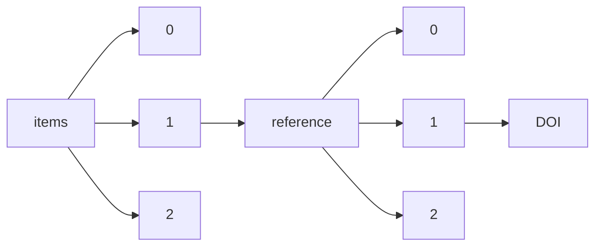

!!! warning "This document is not official Crossref documentation"
# DOI
PATH = items/array/reference/array/DOI(1)  
Occurs 1 481 003 379 times  
Unique values: > 999  
{ .annotate }

1. A route to an element, for example:  
   The route "items/array/reference/array/DOI" corresponds to navigating through the JSON indices as  
   ["items"][0]["reference"][0]["DOI"]  

!!! note "Due to current limitations, only the first 1,000 unique values are counted."

| **Row** | **Value** `String`                                              | **Count** `Int64` |
|--------:|-------------------------------------------------------------------:|---------------------:|
| **1**   | 10.1016/S0021-9258(19)52451-6                                      | 117 035              |
| **2**   | 10.1038/227680a0                                                   | 69 033               |
| **3**   | 10.1016/0003-2697(76)90527-3                                       | 36 486               |
| **4**   | 10.1103/PhysRevLett.77.3865                                        | 13 890               |
| **5**   | 10.1006/meth.2001.1262                                             | 12 254               |
| **6**   | 10.1109/CVPR.2016.90                                               | 11 506               |
| **7**   | 10.1073/pnas.74.12.5463                                            | 9 250                |
| **8**   | 10.1191/1478088706qp063oa                                          | 8 191                |
| **9**   | 10.1107/S0108767307043930                                          | 7 381                |
| **10**  | 10.1176/appi.books.9780890425596                                   | 7 171                |
| **11**  | 10.1016/S0021-9258(18)64849-5                                      | 6 906                |
| **12**  | 10.1063/1.464913                                                   | 6 886                |
| **13**  | 10.1103/PhysRevB.37.785                                            | 6 182                |
| **14**  | 10.1016/0003-2697(87)90021-2                                       | 5 818                |
| **15**  | 10.3322/caac.21492                                                 | 5 699                |
| **16**  | 10.1016/0022-3956(75)90026-6                                       | 4 752                |
| **17**  | 10.1016/S0021-9258(18)94333-4                                      | 4 646                |
| **18**  | 10.1103/PhysRevB.54.11169                                          | 4 512                |
| **19**  | 10.1016/S0019-9958(65)90241-X                                      | 4 438                |
| **20**  | 10.1023/A:1010933404324                                            | 4 354                |
| **21**  | 10.1111/j.1399-3054.1962.tb08052.x                                 | 4 353                |
| **22**  | 10.1093/nar/gkp848                                                 | 4 046                |
| **23**  | 10.3322/caac.21660                                                 | 3 989                |
| **24**  | 10.1080/01621459.1958.10501452                                     | 3 921                |
| **25**  | 10.1073/pnas.76.9.4350                                             | 3 859                |
| **26**  | 10.1016/S0022-2836(75)80083-0                                      | 3 828                |
| **27**  | 10.1016/S0022-2836(05)80360-2                                      | 3 600                |
| **28**  | 10.1093/nar/25.17.3389                                             | 3 465                |
| **29**  | 10.1162/neco.1997.9.8.1735                                         | 3 444                |
| **30**  | 10.1103/PhysRev.140.A1133                                          | 3 387                |
| **31**  | 10.1023/B:VISI.0000029664.99615.94                                 | 3 203                |
| **32**  | 10.1038/nature14539                                                | 3 052                |
| **33**  | 10.1080/10705519909540118                                          | 2 900                |
| **34**  | 10.1093/nar/22.22.4673                                             | 2 875                |
| **35**  | 10.1083/jcb.17.1.208                                               | 2 823                |
| **36**  | 10.1099/00207713-30-1-225                                          | 2 770                |
| **37**  | 10.1111/j.1749-6632.1964.tb14213.x                                 | 2 750                |
| **38**  | 10.1126/science.1102896                                            | 2 750                |
| **39**  | 10.1186/s13059-014-0550-8                                          | 2 730                |
| **40**  | 10.18637/jss.v067.i01                                              | 2 666                |
| **41**  | 10.1037/0022-3514.51.6.1173                                        | 2 664                |
| **42**  | 10.1107/S0567739476001551                                          | 2 636                |
| **43**  | 10.1016/S0140-6736(20)30183-5                                      | 2 617                |
| **44**  | 10.1371/journal.pmed.1000097                                       | 2 519                |
| **45**  | 10.1103/PhysRevB.50.17953                                          | 2 462                |
| **46**  | 10.2307/j.ctt207g8bt.22                                            | 2 436                |
| **47**  | 10.1016/S0021-9258(18)84756-1                                      | 2 346                |
| **48**  | 10.1111/j.1749-6632.1949.tb27297.x                                 | 2 284                |
| **49**  | 10.1017/CBO9780511804441                                           | 2 277                |
| **50**  | 10.1103/PhysRevB.59.1758                                           | 2 234                |
| **51**  | 10.17265/2159-5313/2016.09.003                                     | 2 200                |
| **52**  | 10.1006/abio.1976.9999                                             | 2 120                |
| **53**  | 10.1103/PhysRev.136.B864                                           | 2 101                |
| **54**  | 10.7551/mitpress/5236.001.0001                                     | 2 072                |
| **55**  | 10.2307/3001478                                                    | 2 062                |
| **56**  | 10.1103/PhysRevA.38.3098                                           | 1 999                |
| **57**  | 10.1093/molbev/mst197                                              | 1 955                |
| **58**  | 10.1016/j.cell.2011.02.013                                         | 1 937                |
| **59**  | 10.1093/molbev/msr121                                              | 1 925                |
| **60**  | 10.1139/o59-099                                                    | 1 914                |
| **61**  | 10.1093/bioinformatics/btu170                                      | 1 904                |
| **62**  | 10.1093/bioinformatics/btp352                                      | 1 899                |
| **63**  | 10.1038/nmeth.2089                                                 | 1 898                |
| **64**  | 10.2307/2529310                                                    | 1 895                |
| **65**  | 10.1136/bmj.327.7414.557                                           | 1 866                |
| **66**  | 10.1016/0378-1119(85)90120-9                                       | 1 802                |
| **67**  | 10.1016/S0021-9258(18)70226-3                                      | 1 793                |
| **68**  | 10.1103/PhysRevB.13.5188                                           | 1 756                |
| **69**  | 10.1021/bi00591a005                                                | 1 745                |
| **70**  | 10.1021/ac60111a017                                                | 1 737                |
| **71**  | 10.1016/S0021-9258(19)41496-8                                      | 1 720                |
| **72**  | 10.1038/nmeth.2019                                                 | 1 648                |
| **73**  | 10.1093/molbev/msw054                                              | 1 615                |
| **74**  | 10.1016/0304-405x(76)90026-x                                       | 1 563                |
| **75**  | 10.1016/0927-0256(96)00008-0                                       | 1 532                |
| **76**  | 10.1002/j.1538-7305.1948.tb01338.x                                 | 1 498                |
| **77**  | 10.1109/CVPR.2009.5206848                                          | 1 475                |
| **78**  | 10.1136/bmj.315.7109.629                                           | 1 462                |
| **79**  | 10.1038/354056a0                                                   | 1 461                |
| **80**  | 10.1109/ICNN.1995.488968                                           | 1 452                |
| **81**  | 10.1016/0749-5978(91)90020-T                                       | 1 421                |
| **82**  | 10.1002/0471200611                                                 | 1 334                |
| **83**  | 10.1038/nmeth.1923                                                 | 1 324                |
| **84**  | 10.1042/bj0620315                                                  | 1 321                |
| **85**  | 10.1109/5.726791                                                   | 1 316                |
| **86**  | 10.1109/geoinformatics.2015.7378602                                | 1 308                |
| **87**  | 10.3389/fmicb.2018.02007                                           | 1 304                |
| **88**  | 10.1007/BF01303701                                                 | 1 291                |
| **89**  | 10.1016/S0021-9258(20)82244-3                                      | 1 278                |
| **90**  | 10.1016/0003-2697(83)90418-9                                       | 1 276                |
| **91**  | 10.1083/jcb.9.2.409                                                | 1 271                |
| **92**  | 10.1021/ac60139a006                                                | 1 261                |
| **93**  | 10.1079/cabireviews/19921166435                                    | 1 256                |
| **94**  | 10.1056/NEJMoa2002032                                              | 1 245                |
| **95**  | 10.1109/TIP.2003.819861                                            | 1 233                |
| **96**  | 10.1107/S2053229614024218                                          | 1 226                |
| **97**  | 10.1177/014662167700100306                                         | 1 211                |
| **98**  | 10.1093/nar/25.24.4876                                             | 1 199                |
| **99**  | 10.1177/002224378101800104                                         | 1 199                |
| **100** | 10.1107/S0021889891004399                                          | 1 197                |
| **101** | 10.2307/1914185                                                    | 1 195                |
| **102** | 10.1017/CBO9780511812507                                           | 1 181                |
| **103** | 10.1016/S0021-9258(18)57021-6                                      | 1 175                |
| **104** | 10.1016/0022-1759(83)90303-4                                       | 1 170                |
| **105** | 10.1021/ja01318a036                                                | 1 163                |
| **106** | 10.1038/nmat1849                                                   | 1 160                |
| **107** | 10.1007/BF00656997                                                 | 1 145                |
| **108** | 10.1037/0021-9010.88.5.879                                         | 1 137                |
| **109** | 10.1093/molbev/msm092                                              | 1 130                |
| **110** | 10.1016/0263-7855(96)00018-5                                       | 1 127                |
| **111** | 10.1016/j.nuclphysa.2003.11.003                                    | 1 111                |
| **112** | 10.1016/S0140-6736(20)30566-3                                      | 1 086                |
| **113** | 10.1093/bioinformatics/btp324                                      | 1 085                |
| **114** | 10.1016/S0140-6736(86)90837-8                                      | 1 075                |
| **115** | 10.1126/science.220.4598.671                                       | 1 054                |
| **116** | 10.3322/caac.20107                                                 | 1 046                |
| **117** | 10.1016/0003-2697(60)90025-7                                       | 1 029                |
| **118** | 10.1016/S0021-9258(19)83641-4                                      | 1 015                |
| **119** | 10.1086/260062                                                     | 1 015                |
| **120** | 10.1056/NEJMoa2001017                                              | 1 011                |
| **121** | 10.1093/nar/12.1Part1.387                                          | 1 001                |
| **122** | 10.1093/nar/7.6.1513                                               | 981                  |
| **123** | 10.1109/4235.996017                                                | 959                  |
| **124** | 10.1007/s11263-015-0816-y                                          | 952                  |
| **125** | 10.1093/bioinformatics/bts635                                      | 934                  |
| **126** | 10.1016/j.jbi.2008.08.010                                          | 927                  |
| **127** | 10.1109/CVPR.2015.7298594                                          | 897                  |
| **128** | 10.1104/pp.24.1.1                                                  | 895                  |
| **129** | 10.1073/pnas.0506580102                                            | 868                  |
| **130** | 10.1109/49.730453                                                  | 867                  |
| **131** | 10.1006/jcph.1995.1039                                             | 864                  |
| **132** | 10.1037/0033-295X.84.2.191                                         | 849                  |
| **133** | 10.1136/jnnp.23.1.56                                               | 849                  |
| **134** | 10.1101/gr.1239303                                                 | 848                  |
| **135** | 10.1016/0021-9681(87)90171-8                                       | 832                  |
| **136** | 10.1093/molbev/mst010                                              | 825                  |
| **137** | 10.3109/00016356309011240                                          | 815                  |
| **138** | 10.1002/jcc.20084                                                  | 801                  |
| **139** | 10.1021/bi00789a030                                                | 798                  |
| **140** | 10.3109/00016356408993968                                          | 791                  |
| **141** | 10.1016/S0076-6879(80)65059-9                                      | 789                  |
| **142** | 10.2307/1912934                                                    | 780                  |
| **143** | 10.1109/MASSP.1987.1165576                                         | 778                  |
| **144** | 10.1001/jama.2020.1585                                             | 771                  |
| **145** | 10.1093/nar/gkh340                                                 | 762                  |
| **146** | 10.1145/1961189.1961199                                            | 750                  |
| **147** | 10.1007/978-3-319-24574-4\_28                                      | 750                  |
| **148** | 10.1016/S0022-5320(69)90033-1                                      | 745                  |
| **149** | 10.1172/JCI103182                                                  | 743                  |
| **150** | 10.1177/26.2.24068                                                 | 738                  |
| **151** | 10.1037/h0092976                                                   | 737                  |
| **152** | 10.1016/0021-9991(81)90128-5                                       | 737                  |
| **153** | 10.1073/pnas.79.8.2554                                             | 728                  |
| **154** | 10.1109/CVPR.2015.7298965                                          | 717                  |
| **155** | 10.1001/archpsyc.1961.01710120031004                               | 709                  |
| **156** | 10.1212/WNL.34.7.939                                               | 704                  |
| **157** | 10.1016/0022-2836(82)90515-0                                       | 698                  |
| **158** | 10.1109/CVPR.2005.177                                              | 695                  |
| **159** | 10.1111/j.1471-4159.1966.tb09873.x                                 | 693                  |
| **160** | 10.1038/256495a0                                                   | 691                  |
| **161** | 10.1002/ijc.29210                                                  | 690                  |
| **162** | 10.1038/nmeth.f.303                                                | 684                  |
| **163** | 10.1137/1.9781611970777                                            | 678                  |
| **164** | 10.1017/CBO9780511815355                                           | 676                  |
| **165** | 10.1016/0003-9861(59)90090-6                                       | 676                  |
| **166** | 10.1063/1.3382344                                                  | 670                  |
| **167** | 10.1109/TIT.2006.871582                                            | 658                  |
| **168** | 10.1017/S0140525X00001515                                          | 654                  |
| **169** | 10.1093/molbev/msy096                                              | 653                  |
| **170** | 10.1093/bioinformatics/btu033                                      | 652                  |
| **171** | 10.1016/0304-405x(93)90023-5                                       | 642                  |
| **172** | 10.1002/9780470712184                                              | 635                  |
| **173** | 10.1111/j.1365-201X.1971.tb10998.x                                 | 629                  |
| **174** | 10.1109/ICCV.2017.322                                              | 625                  |
| **175** | 10.1001/jama.285.19.2486                                           | 620                  |
| **176** | 10.1002/art.1780251101                                             | 615                  |
| **177** | 10.1103/PhysRevLett.19.1264                                        | 606                  |
| **178** | 10.3322/caac.21262                                                 | 604                  |
| **179** | 10.7551/mitpress/4737.001.0001                                     | 600                  |
| **180** | 10.3758/BF03193146                                                 | 600                  |
| **181** | 10.1016/S0140-6736(20)30211-7                                      | 599                  |
| **182** | 10.1038/30918                                                      | 593                  |
| **183** | 10.1063/1.1699114                                                  | 587                  |
| **184** | 10.1016/0022-2836(77)90052-3                                       | 587                  |
| **185** | 10.3389/fmicb.2020.00468                                           | 579                  |
| **186** | 10.1109/34.192463                                                  | 579                  |
| **187** | 10.3322/caac.21551                                                 | 576                  |
| **188** | 10.1023/A:1008889222784                                            | 568                  |
| **189** | 10.1177/29.4.6166661                                               | 568                  |
| **190** | 10.1016/0197-2456(95)00134-4                                       | 566                  |
| **191** | 10.1136/bmj.n71                                                    | 565                  |
| **192** | 10.1175/1520-0477(1996)077<0437:TNYRP>2.0.CO;2                     | 540                  |
| **193** | 10.1056/NEJM199309303291401                                        | 535                  |
| **194** | 10.1109/TIT.2004.838089                                            | 532                  |
| **195** | 10.1093/bioinformatics/btp616                                      | 531                  |
| **196** | 10.1037/11774-000                                                  | 526                  |
| **197** | 10.1016/0003-2697(80)90515-1                                       | 526                  |
| **198** | 10.1021/ja01539a017                                                | 516                  |
| **199** | 10.1016/0304-405X(76)90026-X                                       | 512                  |
| **200** | 10.1111/j.1432-1033.1974.tb03599.x                                 | 511                  |
| **201** | 10.1351/pac199567081307                                            | 509                  |
| **202** | 10.1109/18.661517                                                  | 509                  |
| **203** | 10.1038/s41586-020-2012-7                                          | 507                  |
| **204** | 10.1016/0006-2952(61)90145-9                                       | 504                  |
| **205** | 10.1103/PhysRevB.47.558                                            | 503                  |
| **206** | 10.1001/jama.2020.2648                                             | 499                  |
| **207** | 10.1007/BF00994018                                                 | 499                  |
| **208** | 10.1137/1.9781611970104                                            | 497                  |
| **209** | 10.1109/TCOM.1980.1094577                                          | 490                  |
| **210** | 10.1017/cbo9780511609435.005                                       | 490                  |
| **211** | 10.1086/116753                                                     | 486                  |
| **212** | 10.1515/9781400876136                                              | 485                  |
| **213** | 10.1086/250042                                                     | 479                  |
| **214** | 10.1063/1.456153                                                   | 479                  |
| **215** | 10.1038/nprot.2008.211                                             | 474                  |
| **216** | 10.1103/PhysRevLett.58.908                                         | 474                  |
| **217** | 10.1002/art.1780310302                                             | 473                  |
| **218** | 10.1063/1.445869                                                   | 472                  |
| **219** | 10.1109/TSMC.1985.6313399                                          | 471                  |
| **220** | 10.1017/CBO9780511808678                                           | 463                  |
| **221** | 10.1016/0197-2456(86)90046-2                                       | 463                  |
| **222** | 10.1016/0165-1161(75)90046-1                                       | 461                  |
| **223** | 10.1016/j.cell.2020.02.052                                         | 457                  |
| **224** | 10.1107/S0108767390010224                                          | 457                  |
| **225** | 10.1021/ja00299a024                                                | 456                  |
| **226** | 10.1002/jmor.1050880104                                            | 455                  |
| **227** | 10.1001/jama.1995.03520290060030                                   | 454                  |
| **228** | 10.1016/S0021-9258(18)64180-8                                      | 454                  |
| **229** | 10.2307/j.ctvjf9x0h                                                | 453                  |
| **230** | 10.1351/pac199466051077                                            | 451                  |
| **231** | 10.3389/fmicb.2019.02083                                           | 443                  |
| **232** | 10.1107/S0108767390000277                                          | 438                  |
| **233** | 10.1093/clinchem/18.6.499                                          | 437                  |
| **234** | 10.1001/archpsyc.1978.01770300115013                               | 436                  |
| **235** | 10.1007/978-3-540-30442-5                                          | 431                  |
| **236** | 10.2307/2297968                                                    | 428                  |
| **237** | 10.1007/978-3-662-04201-4                                          | 426                  |
| **238** | 10.1107/S0567739468000550                                          | 415                  |
| **239** | 10.1103/PhysRev.108.1175                                           | 414                  |
| **240** | 10.1145/3065386                                                    | 413                  |
| **241** | 10.1037/10627-000                                                  | 411                  |
| **242** | 10.3322/caac.21590                                                 | 410                  |
| **243** | 10.1016/0304-405x(84)90023-0                                       | 409                  |
| **244** | 10.1007/978-1-349-19059-1\_20                                      | 408                  |
| **245** | 10.1088/0004-6256/140/6/1623                                       | 405                  |
| **246** | 10.1107/S0021889892009944                                          | 405                  |
| **247** | 10.1109/TPAMI.1984.4767596                                         | 402                  |
| **248** | 10.1109/CVPR.2016.91                                               | 400                  |
| **249** | 10.1109/72.80202                                                   | 399                  |
| **250** | 10.4064/fm-146-3-215-238                                           | 398                  |
| **251** | 10.1037/10628-000                                                  | 397                  |
| **252** | 10.1038/353737a0                                                   | 389                  |
| **253** | 10.1002/eji.1830031011                                             | 387                  |
| **254** | 10.1214/aos/1176344136                                             | 387                  |
| **255** | 10.1109/TPAMI.2016.2577031                                         | 387                  |
| **256** | 10.1007/978-1-4757-2440-0                                          | 384                  |
| **257** | 10.1016/0022-5193(64)90038-4                                       | 380                  |
| **258** | 10.1109/CVPR.2017.243                                              | 377                  |
| **259** | 10.2514/3.12149                                                    | 373                  |
| **260** | 10.1016/0378-1119(82)90015-4                                       | 373                  |
| **261** | 10.1107/S0108767383000252                                          | 373                  |
| **262** | 10.2307/249008                                                     | 373                  |
| **263** | 10.1109/ICC.1993.397441                                            | 373                  |
| **264** | 10.1007/BF00133570                                                 | 372                  |
| **265** | 10.1093/nar/gkv007                                                 | 370                  |
| **266** | 10.2307/1913236                                                    | 367                  |
| **267** | 10.4324/9780203163672                                              | 365                  |
| **268** | 10.1056/NEJM199803263381301                                        | 363                  |
| **269** | 10.1111/j.1558-5646.1985.tb00420.x                                 | 361                  |
| **270** | 10.1109/TSMC.1979.4310076                                          | 356                  |
| **271** | 10.1038/jid.1966.67                                                | 350                  |
| **272** | 10.1901/jeab.1970.13-243                                           | 348                  |
| **273** | 10.1111/j.1471-4159.1977.tb10649.x                                 | 347                  |
| **274** | 10.1038/75556                                                      | 341                  |
| **275** | 10.1086/260061                                                     | 341                  |
| **276** | 10.1109/25.289411                                                  | 339                  |
| **277** | 10.3322/caac.21442                                                 | 337                  |
| **278** | 10.1126/science.286.5439.509                                       | 337                  |
| **279** | 10.1093/0198287976.001.0001                                        | 336                  |
| **280** | 10.1021/ac60119a033                                                | 336                  |
| **281** | 10.1177/14.4.291                                                   | 336                  |
| **282** | 10.1007/BF02310555                                                 | 335                  |
| **283** | 10.1002/cpa.3160410705                                             | 334                  |
| **284** | 10.1109/TPAMI.1986.4767851                                         | 328                  |
| **285** | 10.2307/3151312                                                    | 326                  |
| **286** | 10.1093/mnras/39.1.76                                              | 324                  |
| **287** | 10.1107/S090744490804362X                                          | 320                  |
| **288** | 10.1001/archpsyc.1972.01750190059011                               | 318                  |
| **289** | 10.1017/CBO9780511625398                                           | 317                  |
| **290** | 10.1016/S0022-2836(66)80052-9                                      | 317                  |
| **291** | 10.1016/0019-2791(65)90004-2                                       | 312                  |
| **292** | 10.1086/225469                                                     | 310                  |
| **293** | 10.1016/j.nuclphysa.2005.03.015                                    | 309                  |
| **294** | 10.1111/j.1540-6261.1997.tb03808.x                                 | 308                  |
| **295** | 10.1038/362801a0                                                   | 307                  |
| **296** | 10.1038/194495a0                                                   | 305                  |
| **297** | 10.1515/9780804764025                                              | 303                  |
| **298** | 10.1038/288373a0                                                   | 301                  |
| **299** | 10.1109/ICCV.2015.169                                              | 300                  |
| **300** | 10.1351/pac199062112167                                            | 299                  |
| **301** | 10.1017/CBO9781139173438                                           | 298                  |
| **302** | 10.1038/359710a0                                                   | 296                  |
| **303** | 10.1016/0006-2952(73)90196-2                                       | 295                  |
| **304** | 10.1016/S0092-8674(04)00045-5                                      | 292                  |
| **305** | 10.1002/jcc.20495                                                  | 292                  |
| **306** | 10.1111/j.1365-2141.1976.tb03563.x                                 | 292                  |
| **307** | 10.1016/S0076-6879(97)76066-X                                      | 291                  |
| **308** | 10.1037/11256-000                                                  | 291                  |
| **309** | 10.1177/1049732305276687                                           | 288                  |
| **310** | 10.2307/2329112                                                    | 285                  |
| **311** | 10.1016/S0003-2670(00)88444-5                                      | 284                  |
| **312** | 10.1007/s00214-007-0310-x                                          | 283                  |
| **313** | 10.1063/1.1674266                                                  | 282                  |
| **314** | 10.1103/PhysRevB.23.5048                                           | 282                  |
| **315** | 10.1016/S0021-9258(18)65874-0                                      | 282                  |
| **316** | 10.1056/NEJMoa2001316                                              | 282                  |
| **317** | 10.1016/0028-3932(71)90067-4                                       | 280                  |
| **318** | 10.1109/TAC.1974.1100705                                           | 280                  |
| **319** | 10.1107/S0021889897003117                                          | 279                  |
| **320** | 10.1016/S0022-2836(61)80047-8                                      | 279                  |
| **321** | 10.1525/9780520946286                                              | 277                  |
| **322** | 10.1111/j.1600-0447.1983.tb09716.x                                 | 277                  |
| **323** | 10.1042/bj0960595                                                  | 276                  |
| **324** | 10.1037/0033-2909.112.1.155                                        | 273                  |
| **325** | 10.1109/JSAC.2004.839380                                           | 271                  |
| **326** | 10.1109/18.771146                                                  | 270                  |
| **327** | 10.1016/0003-2697(85)90442-7                                       | 267                  |
| **328** | 10.1515/9780691201399                                              | 266                  |
| **329** | 10.1038/bjc.1977.1                                                 | 266                  |
| **330** | 10.1163/156853974X00534                                            | 265                  |
| **331** | 10.1016/S0140-6736(98)07019-6                                      | 265                  |
| **332** | 10.1083/jcb.4.4.475                                                | 262                  |
| **333** | 10.1215/9780822398639                                              | 262                  |
| **334** | 10.1007/978-3-662-02581-9                                          | 262                  |
| **335** | 10.1016/S0022-2836(77)80200-3                                      | 261                  |
| **336** | 10.1016/0550-3213(84)90052-X                                       | 259                  |
| **337** | 10.1037/0033-2909.103.3.411                                        | 256                  |
| **338** | 10.1111/j.1600-0536.1975.tb05389.x                                 | 255                  |
| **339** | 10.1016/0147-1767(85)90062-8                                       | 254                  |
| **340** | 10.1016/0003-2697(66)90246-6                                       | 253                  |
| **341** | 10.1177/014920639101700108                                         | 251                  |
| **342** | 10.1017/S0033822200003672                                          | 245                  |
| **343** | 10.1086/117792                                                     | 243                  |
| **344** | 10.1088/0004-6256/144/4/102                                        | 243                  |
| **345** | 10.1086/114297                                                     | 243                  |
| **346** | 10.1023/A:1008202821328                                            | 242                  |
| **347** | 10.1016/S0021-9258(18)69851-5                                      | 240                  |
| **348** | 10.1109/5.18626                                                    | 237                  |
| **349** | 10.1016/0378-1119(77)90000-2                                       | 236                  |
| **350** | 10.1109/TIT.1982.1056454                                           | 236                  |
| **351** | 10.1107/S0907444994003112                                          | 235                  |
| **352** | 10.1089/omi.2011.0118                                              | 234                  |
| **353** | 10.1086/519795                                                     | 234                  |
| **354** | 10.1038/238037a0                                                   | 233                  |
| **355** | 10.1016/0304-3932(83)90060-0                                       | 233                  |
| **356** | 10.2307/1879431                                                    | 232                  |
| **357** | 10.1109/TC.1986.1676819                                            | 231                  |
| **358** | 10.1109/TIT.1974.1055186                                           | 228                  |
| **359** | 10.1016/0006-8993(67)90166-7                                       | 226                  |
| **360** | 10.1515/9780691218632                                              | 225                  |
| **361** | 10.1016/S0021-9673(01)81487-4                                      | 225                  |
| **362** | 10.1017/CBO9780511621253                                           | 223                  |
| **363** | 10.1037/0022-3514.54.6.1063                                        | 222                  |
| **364** | 10.1016/0042-207X(62)90978-8                                       | 222                  |
| **365** | 10.1086/261404                                                     | 220                  |
| **366** | 10.1084/jem.95.3.285                                               | 217                  |
| **367** | 10.4324/9780203221303                                              | 217                  |
| **368** | 10.3322/caac.21332                                                 | 216                  |
| **369** | 10.1515/9783110412475-007                                          | 216                  |
| **370** | 10.1145/358669.358692                                              | 215                  |
| **371** | 10.2307/1913610                                                    | 214                  |
| **372** | 10.7208/chicago/9780226218526.001.0001                             | 213                  |
| **373** | 10.1093/0198244274.001.0001                                        | 213                  |
| **374** | 10.1143/PTP.49.652                                                 | 211                  |
| **375** | 10.1038/gim.2015.30                                                | 211                  |
| **376** | 10.1016/0003-2697(81)90281-5                                       | 211                  |
| **377** | 10.1016/S0022-2836(83)80284-8                                      | 211                  |
| **378** | 10.1007/978-3-319-24277-4                                          | 210                  |
| **379** | 10.1016/0165-1161(83)90010-9                                       | 210                  |
| **380** | 10.1037/0033-295X.84.3.231                                         | 209                  |
| **381** | 10.1007/978-1-4899-3242-6                                          | 209                  |
| **382** | 10.1001/archpsyc.1978.01770310043002                               | 209                  |
| **383** | 10.1017/CBO9780511840715                                           | 208                  |
| **384** | 10.1093/bioinformatics/14.9.817                                    | 208                  |
| **385** | 10.1089/glre.2016.201011                                           | 207                  |
| **386** | 10.1037/h0036215                                                   | 207                  |
| **387** | 10.7208/chicago/9780226114477.001.0001                             | 207                  |
| **388** | 10.1111/j.2517-6161.1995.tb02031.x                                 | 206                  |
| **389** | 10.1042/bj0890114                                                  | 206                  |
| **390** | 10.1016/0031-9201(81)90046-7                                       | 206                  |
| **391** | 10.2307/1912773                                                    | 204                  |
| **392** | 10.1145/320434.320440                                              | 201                  |
| **393** | 10.1039/9781847557889                                              | 201                  |
| **394** | 10.1101/gr.107524.110                                              | 200                  |
| **395** | 10.1109/CVPR.2017.106                                              | 200                  |
| **396** | 10.1016/S0010-8545(00)80009-0                                      | 197                  |
| **397** | 10.1145/2647868.2654889                                            | 196                  |
| **398** | 10.1002/qj.828                                                     | 195                  |
| **399** | 10.1086/261725                                                     | 194                  |
| **400** | 10.1016/0039-3681(85)90003-2                                       | 191                  |
| **401** | 10.4159/harvard.9780674732469                                      | 190                  |
| **402** | 10.1093/bioinformatics/btg180                                      | 190                  |
| **403** | 10.32628/ijsrset                                                   | 190                  |
| **404** | 10.1109/ICCV.2017.324                                              | 189                  |
| **405** | 10.1016/0010-0285(80)90005-5                                       | 188                  |
| **406** | 10.1126/science.235.4793.1196                                      | 188                  |
| **407** | 10.1901/jeab.1968.11-s327                                          | 188                  |
| **408** | 10.1901/jeab.1961.4-267                                            | 186                  |
| **409** | 10.1901/jeab.1968.11-1                                             | 184                  |
| **410** | 10.1016/S0021-9258(19)42083-8                                      | 183                  |
| **411** | 10.2307/2281868                                                    | 183                  |
| **412** | 10.1002/1097-0142(19810101)47:1<207::AID-CNCR2820470134>3.0.CO;2-6 | 182                  |
| **413** | 10.1103/RevModPhys.23.69                                           | 180                  |
| **414** | 10.1001/jama.1949.02900430001001                                   | 178                  |
| **415** | 10.1099/ijs.0.2008/005264-0                                        | 178                  |
| **416** | 10.1086/293126                                                     | 176                  |
| **417** | 10.1111/j.1365-2494.1963.tb00335.x                                 | 176                  |
| **418** | 10.4159/harvard.9780674061200                                      | 175                  |
| **419** | 10.5840/philtopics200230216                                        | 175                  |
| **420** | 10.1007/BF02630824                                                 | 173                  |
| **421** | 10.1017/CBO9780511809644                                           | 172                  |
| **422** | 10.1145/359576.359585                                              | 172                  |
| **423** | 10.1017/CBO9780511554476                                           | 172                  |
| **424** | 10.1017/CBO9780511804397                                           | 172                  |
| **425** | 10.1073/pnas.69.6.1408                                             | 171                  |
| **426** | 10.1046/j.1525-1497.2001.016009606.x                               | 170                  |
| **427** | 10.1016/0003-4916(68)90126-7                                       | 169                  |
| **428** | 10.2466/pr0.1962.10.3.799                                          | 168                  |
| **429** | 10.1017/S0140525X00002053                                          | 168                  |
| **430** | 10.1017/CBO9781139173490                                           | 166                  |
| **431** | 10.1515/9780691216355                                              | 166                  |
| **432** | 10.1098/rspa.1952.0060                                             | 164                  |
| **433** | 10.1038/332411a0                                                   | 163                  |
| **434** | 10.1351/pac199668122193                                            | 163                  |
| **435** | 10.1086/116855                                                     | 162                  |
| **436** | 10.1088/0004-637X/723/2/1188                                       | 162                  |
| **437** | 10.1086/131309                                                     | 162                  |
| **438** | 10.1086/190120                                                     | 162                  |
| **439** | 10.1098/rstl.1785.0006                                             | 162                  |
| **440** | 10.1086/144412                                                     | 162                  |
| **441** | 10.1088/0067-0049/192/1/2                                          | 162                  |
| **442** | 10.1086/125482                                                     | 162                  |
| **443** | 10.1002/9780470316436                                              | 162                  |
| **444** | 10.1017/CBO9781316286548                                           | 162                  |
| **445** | 10.1098/rstl.1824.0003                                             | 162                  |
| **446** | 10.1086/300234                                                     | 162                  |
| **447** | 10.1088/0004-6256/147/3/65                                         | 162                  |
| **448** | 10.1088/0004-6256/137/2/3358                                       | 162                  |
| **449** | 10.1098/rstl.1782.0014                                             | 162                  |
| **450** | 10.1086/141112                                                     | 162                  |
| **451** | 10.1088/0004-637X/813/2/106                                        | 162                  |
| **452** | 10.1086/142687                                                     | 162                  |
| **453** | 10.1093/nar/11.5.1475                                              | 161                  |
| **454** | 10.1098/rspa.1953.0064                                             | 160                  |
| **455** | 10.1177/001316446002000104                                         | 159                  |
| **456** | 10.1111/j.1476-5381.1959.tb00928.x                                 | 159                  |
| **457** | 10.1111/j.1558-5646.1983.tb00236.x                                 | 158                  |
| **458** | 10.1126/science.322279                                             | 157                  |
| **459** | 10.1038/nbt1183-784                                                | 157                  |
| **460** | 10.1037/h0043158                                                   | 157                  |
| **461** | 10.5962/bhl.title.27468                                            | 156                  |
| **462** | 10.1016/S0140-6736(71)90287-X                                      | 155                  |
| **463** | 10.1016/S0015-0282(16)30062-0                                      | 155                  |
| **464** | 10.1037/h0030305                                                   | 155                  |
| **465** | 10.1093/0198247044.001.0001                                        | 154                  |
| **466** | 10.1107/S0907444910007493                                          | 154                  |
| **467** | 10.17762/de.v2021i3.7789                                           | 153                  |
| **468** | 10.1021/ja00053a020                                                | 153                  |
| **469** | 10.1126/science.185.4157.1124                                      | 151                  |
| **470** | 10.1107/S0567739468000707                                          | 150                  |
| **471** | 10.1126/science.235.4793.1156                                      | 149                  |
| **472** | 10.1109/JRA.1986.1087032                                           | 148                  |
| **473** | 10.1109/PROC.1975.10036                                            | 148                  |
| **474** | 10.3322/caac.21387                                                 | 148                  |
| **475** | 10.1007/978-3-642-64981-3                                          | 148                  |
| **476** | 10.1006/abio.1987.9999                                             | 148                  |
| **477** | 10.4159/harvard.9780674182189                                      | 147                  |
| **478** | 10.1109/CVPR.2016.308                                              | 146                  |
| **479** | 10.1111/j.1088-4963.1994.tb00011.x                                 | 146                  |
| **480** | 10.2307/j.ctvcm4hkf                                                | 146                  |
| **481** | 10.1351/pac197231040577                                            | 146                  |
| **482** | 10.1063/1.1840957                                                  | 146                  |
| **483** | 10.1088/0022-3719/6/7/010                                          | 145                  |
| **484** | 10.1515/9781503616295                                              | 144                  |
| **485** | 10.1042/bj0550416                                                  | 144                  |
| **486** | 10.1525/9780520341005                                              | 143                  |
| **487** | 10.1017/CHOL9780521040549                                          | 142                  |
| **488** | 10.1038/327524a0                                                   | 142                  |
| **489** | 10.1097/00005650-199206000-00002                                   | 142                  |
| **490** | 10.1111/j.1468-0335.1937.tb00002.x                                 | 141                  |
| **491** | 10.1099/ijsem.0.003789                                             | 141                  |
| **492** | 10.1016/0042-6822(73)90341-3                                       | 140                  |
| **493** | 10.1016/0042-6822(55)90016-7                                       | 138                  |
| **494** | 10.1073/pnas.81.10.3088                                            | 138                  |
| **495** | 10.1038/clpt.1981.154                                              | 138                  |
| **496** | 10.1017/S0140525X00016393                                          | 136                  |
| **497** | 10.1002/prot.340110407                                             | 136                  |
| **498** | 10.1007/978-1-4757-0450-1                                          | 136                  |
| **499** | 10.1126/science.239.4839.487                                       | 135                  |
| **500** | 10.2307/1924119                                                    | 134                  |
| **501** | 10.1093/0198246609.001.0001                                        | 134                  |
| **502** | 10.1007/978-0-585-27444-7                                          | 133                  |
| **503** | 10.1093/acprof:oso/9780199552795.001.0001                          | 133                  |
| **504** | 10.1086/660816                                                     | 133                  |
| **505** | 10.1007/978-3-642-83189-8                                          | 133                  |
| **506** | 10.1111/j.1088-4963.2005.00027.x                                   | 133                  |
| **507** | 10.1002/9781444355192                                              | 133                  |
| **508** | 10.1093/acprof:oso/9780199572458.001.0001                          | 133                  |
| **509** | 10.1111/j.1088-4963.2003.00190.x                                   | 132                  |
| **510** | 10.1136/jme.2008.026831                                            | 132                  |
| **511** | 10.1111/j.1468-0114.1994.tb00135.x                                 | 132                  |
| **512** | 10.1093/ojls/17.2.303                                              | 132                  |
| **513** | 10.1017/CBO9780511615153                                           | 132                  |
| **514** | 10.1017/CBO9780511814099.002                                       | 132                  |
| **515** | 10.1093/0195150163.001.0001                                        | 132                  |
| **516** | 10.1093/0198292589.001.0001                                        | 132                  |
| **517** | 10.1111/j.1088-4963.2003.00005.x                                   | 132                  |
| **518** | 10.1146/annurev.polisci.1.1.27                                     | 132                  |
| **519** | 10.1017/CBO9780511490217                                           | 132                  |
| **520** | 10.1093/019513916X.001.0001                                        | 132                  |
| **521** | 10.1017/S026505250606002X                                          | 132                  |
| **522** | 10.1086/291939                                                     | 132                  |
| **523** | 10.1086/291957                                                     | 132                  |
| **524** | 10.2307/2182289                                                    | 132                  |
| **525** | 10.4159/9780674029651                                              | 132                  |
| **526** | 10.1177/1470594X05056606                                           | 132                  |
| **527** | 10.1086/293725                                                     | 132                  |
| **528** | 10.1111/j.1747-7093.2005.tb00485.x                                 | 132                  |
| **529** | 10.2307/2182586                                                    | 132                  |
| **530** | 10.1080/00201740902790219                                          | 132                  |
| **531** | 10.1017/CBO9780511841286                                           | 132                  |
| **532** | 10.1177/0090591700028005004                                        | 132                  |
| **533** | 10.1086/293121                                                     | 132                  |
| **534** | 10.1111/j.1467-9760.2008.00319.x                                   | 132                  |
| **535** | 10.1093/acprof:oso/9780195393033.001.0001                          | 132                  |
| **536** | 10.1086/293470                                                     | 132                  |
| **537** | 10.2307/2183622                                                    | 132                  |
| **538** | 10.1086/293756                                                     | 132                  |
| **539** | 10.1086/293727                                                     | 132                  |
| **540** | 10.2307/1884053                                                    | 132                  |
| **541** | 10.1017/S0841820900004094                                          | 132                  |
| **542** | 10.1017/S1537592706060117                                          | 132                  |
| **543** | 10.1086/291990                                                     | 132                  |
| **544** | 10.1086/233897                                                     | 132                  |
| **545** | 10.1080/00455091.1995.10717415                                     | 132                  |
| **546** | 10.1017/CBO9780511625091                                           | 132                  |
| **547** | 10.1017/CBO9780511619120                                           | 132                  |
| **548** | 10.1086/293777                                                     | 132                  |
| **549** | 10.1111/j.1088-4963.1994.tb00013.x                                 | 132                  |
| **550** | 10.1086/233272                                                     | 132                  |
| **551** | 10.1111/j.1747-7093.2005.tb00486.x                                 | 132                  |
| **552** | 10.1016/0735-1097(89)90310-0                                       | 132                  |
| **553** | 10.1111/j.1468-0114.1994.tb00134.x                                 | 132                  |
| **554** | 10.2307/2218002                                                    | 132                  |
| **555** | 10.1080/08913819708443472                                          | 132                  |
| **556** | 10.1017/CBO9780511624971                                           | 132                  |
| **557** | 10.2307/2025006                                                    | 132                  |
| **558** | 10.1021/ja00457a004                                                | 132                  |
| **559** | 10.1093/nar/12.18.7035                                             | 131                  |
| **560** | 10.1038/338334a0                                                   | 130                  |
| **561** | 10.2307/411334                                                     | 130                  |
| **562** | 10.31399/asm.hb.v11.a0003544                                       | 129                  |
| **563** | 10.1029/JZ071i001p00001                                            | 129                  |
| **564** | 10.1086/305772                                                     | 128                  |
| **565** | 10.1351/pac199466122513                                            | 128                  |
| **566** | 10.1111/j.1600-065X.1979.tb00289.x                                 | 127                  |
| **567** | 10.7560/313480                                                     | 126                  |
| **568** | 10.1111/j.1600-051X.1979.tb01931.x                                 | 125                  |
| **569** | 10.1901/jaba.1994.27-197                                           | 125                  |
| **570** | 10.1143/JPSJ.12.570                                                | 125                  |
| **571** | 10.1016/0006-291X(67)90391-9                                       | 124                  |
| **572** | 10.1038/35057062                                                   | 124                  |
| **573** | 10.1029/94JD02950                                                  | 124                  |
| **574** | 10.32628/ijsrset1841215                                            | 123                  |
| **575** | 10.1016/0304-3932(88)90168-7                                       | 123                  |
| **576** | 10.1107/S0021889869006558                                          | 123                  |
| **577** | 10.1073/pnas.81.14.4586                                            | 122                  |
| **578** | 10.1109/TSMC.1973.5408575                                          | 121                  |
| **579** | 10.1201/b14095                                                     | 120                  |
| **580** | 10.1016/0014-4827(68)90403-5                                       | 119                  |
| **581** | 10.2307/2960077                                                    | 118                  |
| **582** | 10.1093/jn/107.7.1340                                              | 118                  |
| **583** | 10.1113/jphysiol.1952.sp004764                                     | 118                  |
| **584** | 10.1099/ijsem.0.003071                                             | 118                  |
| **585** | 10.1029/JB082i005p00803                                            | 117                  |
| **586** | 10.1097/00003246-198510000-00009                                   | 116                  |
| **587** | 10.1007/978-1-4615-4022-9                                          | 116                  |
| **588** | 10.1086/466560                                                     | 115                  |
| **589** | 10.1017/CBO9780511625251                                           | 115                  |
| **590** | 10.1017/S0140525X00076512                                          | 115                  |
| **591** | 10.1097/00001648-199909000-00010                                   | 112                  |
| **592** | 10.1351/pac199668122223                                            | 112                  |
| **593** | 10.1525/9780520342675                                              | 111                  |
| **594** | 10.1515/9780824841911                                              | 111                  |
| **595** | 10.1163/ej.9789004121157.i-264                                     | 111                  |
| **596** | 10.11126/stanford/9780804751582.001.0001                           | 111                  |
| **597** | 10.1002/tqem.3310040310                                            | 111                  |
| **598** | 10.1515/9780824863951                                              | 111                  |
| **599** | 10.1515/9781503622920                                              | 111                  |
| **600** | 10.1515/9780804781596                                              | 111                  |
| **601** | 10.1515/9780824837761                                              | 111                  |
| **602** | 10.1515/9780824864538                                              | 111                  |
| **603** | 10.2307/j.ctt1tg5kmx                                               | 111                  |
| **604** | 10.1007/978-1-349-11336-1                                          | 110                  |
| **605** | 10.2307/300003                                                     | 109                  |
| **606** | 10.1103/RevModPhys.15.1                                            | 109                  |
| **607** | 10.7208/chicago/9780226790114.001.0001                             | 109                  |
| **608** | 10.1107/S0021889808042726                                          | 108                  |
| **609** | 10.7560/312049                                                     | 108                  |
| **610** | 10.1037/0033-295X.84.2.127                                         | 107                  |
| **611** | 10.1037/h0093759                                                   | 107                  |
| **612** | 10.1126/science.162.3859.1243                                      | 107                  |
| **613** | 10.1017/S0140525X00044903                                          | 107                  |
| **614** | 10.1073/pnas.84.5.1374                                             | 106                  |
| **615** | 10.1351/pac198254081533                                            | 104                  |
| **616** | 10.1086/282771                                                     | 104                  |
| **617** | 10.1126/science.2523562                                            | 103                  |
| **618** | 10.1099/00207713-37-4-463                                          | 103                  |
| **619** | 10.1007/978-3-658-01350-9                                          | 103                  |
| **620** | 10.1002/j.1556-6676.1992.tb01642.x                                 | 103                  |
| **621** | 10.1063/1.1696113                                                  | 102                  |
| **622** | 10.1007/978-3-662-38521-0\_5                                       | 101                  |
| **623** | 10.1901/jeab.1973.20-137                                           | 100                  |
| **624** | 10.1103/PhysRevD.66.010001                                         | 100                  |
| **625** | 10.1111/j.1558-5646.1989.tb04220.x                                 | 100                  |
| **626** | 10.1037/0033-295X.87.1.1                                           | 100                  |
| **627** | 10.1017/CBO9780511549632                                           | 100                  |
| **628** | 10.1016/0003-2697(77)90043-4                                       | 100                  |
| **629** | 10.1017/CBO9780511583773                                           | 100                  |
| **630** | 10.2307/2183914                                                    | 99                   |
| **631** | 10.1073/pnas.82.2.488                                              | 98                   |
| **632** | 10.1016/B978-0-12-372180-8.50042-1                                 | 98                   |
| **633** | 10.1097/00010694-193401000-00003                                   | 98                   |
| **634** | 10.1109/CVPR.2014.81                                               | 98                   |
| **635** | 10.1038/32588                                                      | 97                   |
| **636** | 10.1093/oxfordjournals.jhered.a111573                              | 97                   |
| **637** | 10.1098/rspb.1979.0086                                             | 97                   |
| **638** | 10.1016/0022-2836(68)90205-2                                       | 96                   |
| **639** | 10.1007/978-94-009-3339-2                                          | 96                   |
| **640** | 10.1901/jeab.1962.5-529                                            | 95                   |
| **641** | 10.1016/j.jvir.2010.07.018                                         | 93                   |
| **642** | 10.1099/00207713-47-2-479                                          | 93                   |
| **643** | 10.1002/sia.740010103                                              | 92                   |
| **644** | 10.1007/978-3-642-68178-3                                          | 89                   |
| **645** | 10.1016/0010-0277(85)90022-8                                       | 88                   |
| **646** | 10.1017/S0140525X00053061                                          | 88                   |
| **647** | 10.1002/ar.1090940210                                              | 87                   |
| **648** | 10.1007/s00018-002-3014-y                                          | 87                   |
| **649** | 10.2307/1913210                                                    | 86                   |
| **650** | 10.1109/TCOMM.2003.818096                                          | 86                   |
| **651** | 10.1109/TAC.2004.834113                                            | 85                   |
| **652** | 10.1017/CBO9780511521270                                           | 85                   |
| **653** | 10.1017/CBO9780511810251                                           | 85                   |
| **654** | 10.1016/0360-1285(89)90017-8                                       | 85                   |
| **655** | 10.4236/ojg.2015.510063                                            | 85                   |
| **656** | 10.1037/h0054367                                                   | 84                   |
| **657** | 10.1103/PhysRevLett.37.8                                           | 84                   |
| **658** | 10.1901/jeab.1974.22-231                                           | 84                   |
| **659** | 10.7208/chicago/9780226471013.001.0001                             | 84                   |
| **660** | 10.1021/bi00891a003                                                | 84                   |
| **661** | 10.1002/sim.1186                                                   | 83                   |
| **662** | 10.1063/1.91359                                                    | 83                   |
| **663** | 10.1017/CBO9780511554506                                           | 83                   |
| **664** | 10.1038/nature19106                                                | 82                   |
| **665** | 10.1086/300975                                                     | 82                   |
| **666** | 10.1177/0270467611417849                                           | 82                   |
| **667** | 10.1086/340570                                                     | 81                   |
| **668** | 10.1086/111761                                                     | 81                   |
| **669** | 10.1088/0004-637X/804/2/144                                        | 81                   |
| **670** | 10.1086/103243                                                     | 81                   |
| **671** | 10.1038/27389                                                      | 81                   |
| **672** | 10.1086/190682                                                     | 81                   |
| **673** | 10.1086/144637                                                     | 81                   |
| **674** | 10.1086/155343                                                     | 81                   |
| **675** | 10.1086/346224                                                     | 81                   |
| **676** | 10.1086/383546                                                     | 81                   |
| **677** | 10.1086/112448                                                     | 81                   |
| **678** | 10.1086/191204                                                     | 81                   |
| **679** | 10.1086/105681                                                     | 81                   |
| **680** | 10.1088/1538-3873/128/969/114401                                   | 81                   |
| **681** | 10.1007/978-3-319-44521-2                                          | 81                   |
| **682** | 10.1086/117277                                                     | 81                   |
| **683** | 10.1086/124553                                                     | 81                   |
| **684** | 10.1086/191136                                                     | 81                   |
| **685** | 10.1086/319458                                                     | 81                   |
| **686** | 10.1086/310463                                                     | 81                   |
| **687** | 10.1088/0004-637X/714/2/1551                                       | 81                   |
| **688** | 10.1086/147233                                                     | 81                   |
| **689** | 10.1086/127812                                                     | 81                   |
| **690** | 10.1086/190928                                                     | 81                   |
| **691** | 10.1086/111261                                                     | 81                   |
| **692** | 10.1086/142551                                                     | 81                   |
| **693** | 10.1086/300176                                                     | 81                   |
| **694** | 10.1007/978-1-4419-9917-7                                          | 81                   |
| **695** | 10.1086/143009                                                     | 81                   |
| **696** | 10.1086/140843                                                     | 81                   |
| **697** | 10.1098/rstl.1786.0002                                             | 81                   |
| **698** | 10.1088/0004-637X/714/2/1570                                       | 81                   |
| **699** | 10.1086/121125                                                     | 81                   |
| **700** | 10.1086/105349                                                     | 81                   |
| **701** | 10.1088/0004-6256/139/3/919                                        | 81                   |
| **702** | 10.1086/148440                                                     | 81                   |
| **703** | 10.1086/132082                                                     | 81                   |
| **704** | 10.1088/0004-6256/148/3/48                                         | 81                   |
| **705** | 10.1086/190686                                                     | 81                   |
| **706** | 10.1086/142137                                                     | 81                   |
| **707** | 10.1088/0004-6256/147/5/123                                        | 81                   |
| **708** | 10.1086/114118                                                     | 81                   |
| **709** | 10.1086/300943                                                     | 81                   |
| **710** | 10.1086/111511                                                     | 81                   |
| **711** | 10.3847/0004-637X/822/1/40                                         | 81                   |
| **712** | 10.1086/115193                                                     | 81                   |
| **713** | 10.1086/114353                                                     | 81                   |
| **714** | 10.1086/130756                                                     | 81                   |
| **715** | 10.1086/142591                                                     | 81                   |
| **716** | 10.1086/321085                                                     | 81                   |
| **717** | 10.1086/341094                                                     | 81                   |
| **718** | 10.1088/0004-637X/799/1/4                                          | 81                   |
| **719** | 10.3847/1538-3881/aa803e                                           | 81                   |
| **720** | 10.1086/162462                                                     | 81                   |
| **721** | 10.1086/111350                                                     | 81                   |
| **722** | 10.1088/0004-6256/149/1/8                                          | 81                   |
| **723** | 10.1086/125484                                                     | 81                   |
| **724** | 10.1086/130497                                                     | 81                   |
| **725** | 10.1086/143006                                                     | 81                   |
| **726** | 10.1088/0004-6256/136/3/1137                                       | 81                   |
| **727** | 10.1017/CBO9780511536489                                           | 81                   |
| **728** | 10.1088/0004-6256/144/2/56                                         | 81                   |
| **729** | 10.1086/165281                                                     | 81                   |
| **730** | 10.1134/S199034131201004X                                          | 81                   |
| **731** | 10.1086/316328                                                     | 81                   |
| **732** | 10.3847/0004-6256/152/2/46                                         | 81                   |
| **733** | 10.1086/304245                                                     | 81                   |
| **734** | 10.1086/190215                                                     | 81                   |
| **735** | 10.1086/140625                                                     | 81                   |
| **736** | 10.1086/111590                                                     | 81                   |
| **737** | 10.1088/0004-6256/146/6/148                                        | 81                   |
| **738** | 10.1086/133768                                                     | 81                   |
| **739** | 10.1088/0004-637X/807/1/26                                         | 81                   |
| **740** | 10.1134/S1063772912110042                                          | 81                   |
| **741** | 10.1086/141352                                                     | 81                   |
| **742** | 10.1177/002182869102200202                                         | 81                   |
| **743** | 10.1086/192202                                                     | 81                   |
| **744** | 10.1088/0004-6256/143/1/10                                         | 81                   |
| **745** | 10.3847/1538-4357/aaa3f9                                           | 81                   |
| **746** | 10.3847/0067-0049/227/1/4                                          | 81                   |
| **747** | 10.1109/49.840210                                                  | 81                   |
| **748** | 10.1088/0004-637X/814/1/64                                         | 81                   |
| **749** | 10.1086/110795                                                     | 81                   |
| **750** | 10.1086/368121                                                     | 81                   |
| **751** | 10.1086/108206                                                     | 81                   |
| **752** | 10.1088/0004-6256/149/4/119                                        | 81                   |
| **753** | 10.1086/140027                                                     | 81                   |
| **754** | 10.1086/140298                                                     | 81                   |
| **755** | 10.1086/192324                                                     | 81                   |
| **756** | 10.1086/504942                                                     | 81                   |
| **757** | 10.1086/319155                                                     | 81                   |
| **758** | 10.1017/CBO9780511709364                                           | 81                   |
| **759** | 10.1088/0004-6256/138/5/1354                                       | 81                   |
| **760** | 10.1086/190060                                                     | 81                   |
| **761** | 10.1038/039055c0                                                   | 81                   |
| **762** | 10.1086/115001                                                     | 81                   |
| **763** | 10.1086/140765                                                     | 81                   |
| **764** | 10.1088/0004-6256/145/3/84                                         | 81                   |
| **765** | 10.1086/116787                                                     | 81                   |
| **766** | 10.1086/133145                                                     | 81                   |
| **767** | 10.1086/155982                                                     | 81                   |
| **768** | 10.3847/1538-4357/aa6af8                                           | 81                   |
| **769** | 10.1086/312882                                                     | 81                   |
| **770** | 10.1086/144511                                                     | 81                   |
| **771** | 10.1086/317144                                                     | 81                   |
| **772** | 10.1088/0004-6256/138/3/963                                        | 81                   |
| **773** | 10.1088/1925PASP...37..155P                                        | 81                   |
| **774** | 10.3847/1538-4357/836/1/139                                        | 81                   |
| **775** | 10.1088/0004-637X/808/1/88                                         | 81                   |
| **776** | 10.1088/0067-0049/203/2/30                                         | 81                   |
| **777** | 10.1134/S1063772911060059                                          | 81                   |
| **778** | 10.1086/130051                                                     | 81                   |
| **779** | 10.1093/pasj/61.1.19                                               | 81                   |
| **780** | 10.1088/0004-6256/150/1/16                                         | 81                   |
| **781** | 10.1007/978-1-4614-3945-5\_4                                       | 81                   |
| **782** | 10.1086/117528                                                     | 81                   |
| **783** | 10.1088/0004-637X/709/2/733                                        | 81                   |
| **784** | 10.1086/130782                                                     | 81                   |
| **785** | 10.1086/180906                                                     | 81                   |
| **786** | 10.1086/128348                                                     | 81                   |
| **787** | 10.1086/143000                                                     | 81                   |
| **788** | 10.1088/0004-6256/150/4/130                                        | 81                   |
| **789** | 10.1086/111030                                                     | 81                   |
| **790** | 10.1088/0004-6256/150/5/140                                        | 81                   |
| **791** | 10.1086/141596                                                     | 81                   |
| **792** | 10.1086/142584                                                     | 81                   |
| **793** | 10.1086/104628                                                     | 81                   |
| **794** | 10.1016/j.newast.2009.09.006                                       | 81                   |
| **795** | 10.1088/0004-6256/139/2/743                                        | 81                   |
| **796** | 10.1088/0004-6256/139/1/205                                        | 81                   |
| **797** | 10.1086/508231                                                     | 81                   |
| **798** | 10.1086/140994                                                     | 81                   |
| **799** | 10.1086/342014                                                     | 81                   |
| **800** | 10.1086/338587                                                     | 81                   |
| **801** | 10.1086/592146                                                     | 81                   |
| **802** | 10.1086/656481                                                     | 81                   |
| **803** | 10.1086/132851                                                     | 81                   |
| **804** | 10.1088/0067-0049/211/1/10                                         | 81                   |
| **805** | 10.1086/142599                                                     | 81                   |
| **806** | 10.1086/190778                                                     | 81                   |
| **807** | 10.1088/0004-6256/144/2/62                                         | 81                   |
| **808** | 10.1088/0004-6256/135/4/1334                                       | 81                   |
| **809** | 10.1088/0067-0049/217/2/29                                         | 81                   |
| **810** | 10.1086/321075                                                     | 81                   |
| **811** | 10.1086/129695                                                     | 81                   |
| **812** | 10.1017/S1323358000026436                                          | 81                   |
| **813** | 10.1086/129008                                                     | 81                   |
| **814** | 10.1088/0067-0049/215/1/15                                         | 81                   |
| **815** | 10.1088/0004-6256/135/1/209                                        | 81                   |
| **816** | 10.1086/190285                                                     | 81                   |
| **817** | 10.3847/1538-3881/aa66ca                                           | 81                   |
| **818** | 10.1098/rstl.1803.0015                                             | 81                   |
| **819** | 10.1086/109676                                                     | 81                   |
| **820** | 10.1088/0004-637X/794/1/51                                         | 81                   |
| **821** | 10.1037/h0020071                                                   | 81                   |
| **822** | 10.1017/S1743921307006321                                          | 81                   |
| **823** | 10.1086/511668                                                     | 81                   |
| **824** | 10.1098/rstl.1785.0009                                             | 81                   |
| **825** | 10.1007/978-1-4614-3945-5\_16                                      | 81                   |
| **826** | 10.1086/106378                                                     | 81                   |
| **827** | 10.1086/190327                                                     | 81                   |
| **828** | 10.1086/115340                                                     | 81                   |
| **829** | 10.1086/182447                                                     | 81                   |
| **830** | 10.1086/140407                                                     | 81                   |
| **831** | 10.1086/133877                                                     | 81                   |
| **832** | 10.1007/978-1-4614-3945-5\_12                                      | 81                   |
| **833** | 10.1007/978-1-4614-3945-5\_13                                      | 81                   |
| **834** | 10.1086/118674                                                     | 81                   |
| **835** | 10.1086/104871                                                     | 81                   |
| **836** | 10.1086/510335                                                     | 81                   |
| **837** | 10.1086/498894                                                     | 81                   |
| **838** | 10.1086/121339                                                     | 81                   |
| **839** | 10.1086/122460                                                     | 81                   |
| **840** | 10.1086/150032                                                     | 81                   |
| **841** | 10.1088/0004-637X/809/2/135                                        | 81                   |
| **842** | 10.1086/124811                                                     | 81                   |
| **843** | 10.1007/978-3-319-09372-7                                          | 81                   |
| **844** | 10.1086/131763                                                     | 81                   |
| **845** | 10.1086/111677                                                     | 81                   |
| **846** | 10.1086/147622                                                     | 81                   |
| **847** | 10.1088/0004-6256/143/2/42                                         | 81                   |
| **848** | 10.1017/CBO9780511659003                                           | 81                   |
| **849** | 10.1086/308001                                                     | 81                   |
| **850** | 10.1086/109000                                                     | 81                   |
| **851** | 10.1086/190670                                                     | 81                   |
| **852** | 10.1088/0004-637X/717/2/1279                                       | 81                   |
| **853** | 10.1088/0004-637X/708/1/71                                         | 81                   |
| **854** | 10.1086/143760                                                     | 81                   |
| **855** | 10.1086/107257                                                     | 81                   |
| **856** | 10.1215/9780822381723                                              | 80                   |
| **857** | 10.1351/pac199668040957                                            | 80                   |
| **858** | 10.1109/MC.1982.1653825                                            | 79                   |
| **859** | 10.1007/BF02770214                                                 | 79                   |
| **860** | 10.4236/acs.2011.11002                                             | 78                   |
| **861** | 10.1017/CBO9781139017954                                           | 78                   |
| **862** | 10.1515/fmst-1985-0113                                             | 78                   |
| **863** | 10.1001/archpediatrics.2008.528                                    | 77                   |
| **864** | 10.1016/S0021-9258(18)61070-1                                      | 77                   |
| **865** | 10.1002/ett.4460100604                                             | 77                   |
| **866** | 10.1103/RevModPhys.54.437                                          | 76                   |
| **867** | 10.1186/s40168-021-01064-3                                         | 76                   |
| **868** | 10.1146/annurev.energy.28.050302.105551                            | 76                   |
| **869** | 10.1038/308693a0                                                   | 75                   |
| **870** | 10.1007/3-540-10235-3                                              | 75                   |
| **871** | 10.1111/j.1467-9248.2007.00656.x                                   | 75                   |
| **872** | 10.1111/j.1088-4963.2009.01172.x                                   | 75                   |
| **873** | 10.1109/CVPR.2017.660                                              | 75                   |
| **874** | 10.2307/2719171                                                    | 74                   |
| **875** | 10.2307/2384458                                                    | 74                   |
| **876** | 10.1163/ej.9789004157095.i-310                                     | 74                   |
| **877** | 10.1111/j.1365-3180.1974.tb01084.x                                 | 74                   |
| **878** | 10.11126/stanford/9780804761574.001.0001                           | 74                   |
| **879** | 10.1515/9780824841997                                              | 74                   |
| **880** | 10.2307/j.ctt1tg5qf8                                               | 74                   |
| **881** | 10.1126/science.2496467                                            | 74                   |
| **882** | 10.1215/9780822384908                                              | 74                   |
| **883** | 10.1515/9780824864941                                              | 74                   |
| **884** | 10.3998/mpub.9340112                                               | 74                   |
| **885** | 10.1215/9780822385622                                              | 74                   |
| **886** | 10.1515/9781503615762                                              | 74                   |
| **887** | 10.2307/2384824                                                    | 74                   |
| **888** | 10.1353/jjs.2004.0008                                              | 74                   |
| **889** | 10.1111/j.1468-5930.1986.tb00046.x                                 | 74                   |
| **890** | 10.1111/j.1088-4963.2001.00105.x                                   | 74                   |
| **891** | 10.2307/2053784                                                    | 74                   |
| **892** | 10.1017/CBO9780511809576                                           | 74                   |
| **893** | 10.1111/1467-9213.00104                                            | 74                   |
| **894** | 10.1093/mind/os-XIII.51.405                                        | 74                   |
| **895** | 10.1007/s11098-005-2216-6                                          | 74                   |
| **896** | 10.7551/mitpress/1564.001.0001                                     | 74                   |
| **897** | 10.2307/1123184                                                    | 74                   |
| **898** | 10.1017/CBO9780511813771                                           | 74                   |
| **899** | 10.1017/S0266267103001020                                          | 74                   |
| **900** | 10.1080/19452829.2012.703172                                       | 74                   |
| **901** | 10.1007/BF00162874                                                 | 74                   |
| **902** | 10.7312/emme16272                                                  | 74                   |
| **903** | 10.1111/j.1088-4963.1997.tb00048.x                                 | 74                   |
| **904** | 10.1017/S0034670500033817                                          | 74                   |
| **905** | 10.2307/3311279                                                    | 74                   |
| **906** | 10.2307/2217486                                                    | 74                   |
| **907** | 10.1086/233370                                                     | 74                   |
| **908** | 10.1163/ej.9789004174610.i-228                                     | 74                   |
| **909** | 10.1163/9789004488687                                              | 74                   |
| **910** | 10.2307/2385131                                                    | 74                   |
| **911** | 10.1007/s10482-018-1047-3                                          | 74                   |
| **912** | 10.3998/mpub.18809                                                 | 74                   |
| **913** | 10.3998/mpub.18495                                                 | 74                   |
| **914** | 10.1093/mind/LXXIII.291.374                                        | 74                   |
| **915** | 10.1515/9780824846213                                              | 74                   |
| **916** | 10.1017/S0265052508080072                                          | 74                   |
| **917** | 10.1163/9789004227002                                              | 74                   |
| **918** | 10.1017/S1537592706060099                                          | 74                   |
| **919** | 10.1093/ajj/43.1.25                                                | 74                   |
| **920** | 10.1111/j.1467-9760.2008.00320.x                                   | 74                   |
| **921** | 10.21313/hawaii/9780824835651.001.0001                             | 74                   |
| **922** | 10.1086/233805                                                     | 74                   |
| **923** | 10.2307/2384663                                                    | 74                   |
| **924** | 10.1002/9780470776612                                              | 74                   |
| **925** | 10.1515/9781400860890                                              | 74                   |
| **926** | 10.1086/293723                                                     | 74                   |
| **927** | 10.1111/j.1088-4963.2008.01144.x                                   | 74                   |
| **928** | 10.1086/257678                                                     | 74                   |
| **929** | 10.2307/2215434                                                    | 74                   |
| **930** | 10.1163/ej.9789004155466.i-518                                     | 74                   |
| **931** | 10.2307/j.ctvjnrv7n                                                | 74                   |
| **932** | 10.3998/mpub.18289                                                 | 74                   |
| **933** | 10.1093/acprof:oso/9780195136364.001.0001                          | 74                   |
| **934** | 10.1111/j.1088-4963.2000.00137.x                                   | 74                   |
| **935** | 10.1017/CBO9780511624988                                           | 74                   |
| **936** | 10.2307/2718620                                                    | 74                   |
| **937** | 10.1057/9780230246904                                              | 74                   |
| **938** | 10.1017/S084182090000494X                                          | 74                   |
| **939** | 10.1023/A:1004270811433                                            | 74                   |
| **940** | 10.2307/2383717                                                    | 74                   |
| **941** | 10.1017/S026505250000474X                                          | 74                   |
| **942** | 10.1086/293176                                                     | 74                   |
| **943** | 10.2307/1881826                                                    | 74                   |
| **944** | 10.1017/CBO9780511808012.005                                       | 74                   |
| **945** | 10.2307/2719223                                                    | 74                   |
| **946** | 10.1177/0090591703260928                                           | 74                   |
| **947** | 10.1017/CBO9781139165860                                           | 74                   |
| **948** | 10.4324/9780203086605                                              | 74                   |
| **949** | 10.1086/257416                                                     | 74                   |
| **950** | 10.2307/2718569                                                    | 74                   |
| **951** | 10.1111/j.1467-9248.2008.00739.x                                   | 74                   |
| **952** | 10.1163/9789004264540                                              | 74                   |
| **953** | 10.1525/9780520325531-024                                          | 74                   |
| **954** | 10.3998/mpub.7687                                                  | 74                   |
| **955** | 10.1111/j.1467-9973.2005.00362.x                                   | 74                   |
| **956** | 10.1515/9781400861811                                              | 74                   |
| **957** | 10.1111/j.1088-4963.1998.tb00071.x                                 | 74                   |
| **958** | 10.1080/00455091.2000.10717541                                     | 74                   |
| **959** | 10.2307/2385101                                                    | 74                   |
| **960** | 10.4159/harvard.9780674435643                                      | 74                   |
| **961** | 10.1086/292431                                                     | 74                   |
| **962** | 10.7312/cope13774                                                  | 74                   |
| **963** | 10.1111/j.1468-0114.1994.tb00126.x                                 | 74                   |
| **964** | 10.1093/0195032047.001.0001                                        | 73                   |
| **965** | 10.1107/S0907444998003254                                          | 73                   |
| **966** | 10.1016/S0003-3472(84)80339-5                                      | 72                   |
| **967** | 10.1017/CCO9781139087438.014                                       | 72                   |
| **968** | 10.1109/21.52551                                                   | 72                   |
| **969** | 10.2307/2025790                                                    | 72                   |
| **970** | 10.1007/BF01001956                                                 | 72                   |
| **971** | 10.3892/ijo.23.3.705                                               | 71                   |
| **972** | 10.1056/NEJM199106063242302                                        | 71                   |
| **973** | 10.5479/si.0081024X.98.1                                           | 71                   |
| **974** | 10.1136/hrt.45.1.56                                                | 70                   |
| **975** | 10.1093/biomet/52.1-2.203                                          | 70                   |
| **976** | 10.1007/BF00280883                                                 | 70                   |
| **977** | 10.15628/holos.2013.1197                                           | 70                   |
| **978** | 10.1109/OCEANS.2010.5663839                                        | 69                   |
| **979** | 10.1351/pac200779030293                                            | 69                   |
| **980** | 10.1007/s10661-007-9886-9                                          | 69                   |
| **981** | 10.1002/14651858.CD009232.pub2                                     | 69                   |
| **982** | 10.1109/CVPR.2017.502                                              | 69                   |
| **983** | 10.5194/acp-6-3423-2006                                            | 69                   |
| **984** | 10.1103/PhysRev.125.1067                                           | 69                   |
| **985** | 10.1093/biosci/biw002                                              | 69                   |
| **986** | 10.1103/PhysRev.73.679                                             | 68                   |
| **987** | 10.1017/CBO9780511625404                                           | 68                   |
| **988** | 10.1515/9783111653440                                              | 68                   |
| **989** | 10.1351/pac199264010143                                            | 68                   |
| **990** | 10.1016/0006-291X(83)91093-8                                       | 68                   |
| **991** | 10.1351/pac199668010149                                            | 68                   |
| **992** | 10.1017/CBO9780511609039                                           | 68                   |
| **993** | 10.1017/S0140525X00021269                                          | 67                   |
| **994** | 10.3138/9781487596149                                              | 67                   |
| **995** | 10.1017/S000712340000380X                                          | 67                   |
| **996** | 10.1017/CBO9780511818240.001                                       | 67                   |
| **997** | 10.1007/s00270-015-1239-4                                          | 67                   |
| **998** | 10.1037/10004-000                                                  | 67                   |
| **999** | 10.1098/rspb.2006.0443                                             | 67                   |
| ... | ... | ... |

