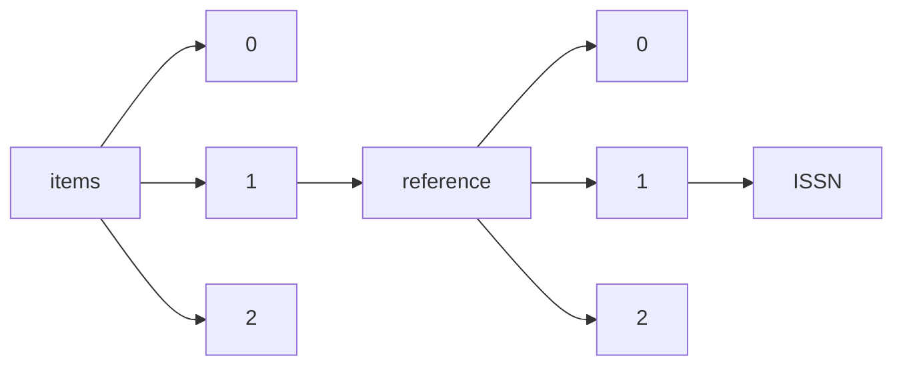

!!! warning "This document is not official Crossref documentation"
# ISSN
PATH = items/array/reference/array/ISSN(1)  
Occurs 15 270 700 times  
Unique values: > 999  
{ .annotate }

1. A route to an element, for example:  
   The route "items/array/reference/array/ISSN" corresponds to navigating through the JSON indices as  
   ["items"][0]["reference"][0]["ISSN"]  

!!! note "Due to current limitations, only the first 1,000 unique values are counted."

| **Row** | **Value** `String`                 | **Count** `Int64` |
|--------:|--------------------------------------:|---------------------:|
| **1**   | http://id.crossref.org/issn/0004-637X | 961 789              |
| **2**   | http://id.crossref.org/issn/1538-3881 | 137 832              |
| **3**   | http://id.crossref.org/issn/0305-4470 | 105 504              |
| **4**   | http://id.crossref.org/issn/0004-6361 | 103 183              |
| **5**   | http://id.crossref.org/issn/0067-0049 | 102 601              |
| **6**   | http://id.crossref.org/issn/0029-5515 | 98 422               |
| **7**   | http://id.crossref.org/issn/0035-8711 | 97 406               |
| **8**   | http://id.crossref.org/issn/0021-8979 | 96 055               |
| **9**   | http://id.crossref.org/issn/0036-8075 | 95 523               |
| **10**  | http://id.crossref.org/issn/0022-3727 | 92 710               |
| **11**  | http://id.crossref.org/issn/0003-6951 | 91 726               |
| **12**  | http://id.crossref.org/issn/0027-8424 | 91 540               |
| **13**  | http://id.crossref.org/issn/1126-6708 | 90 280               |
| **14**  | http://id.crossref.org/issn/0953-8984 | 84 763               |
| **15**  | http://id.crossref.org/issn/0163-1829 | 81 560               |
| **16**  | http://id.crossref.org/issn/0021-9258 | 75 634               |
| **17**  | http://id.crossref.org/issn/0264-9381 | 74 781               |
| **18**  | http://id.crossref.org/issn/0031-9155 | 72 284               |
| **19**  | http://id.crossref.org/issn/0022-3700 | 70 997               |
| **20**  | http://id.crossref.org/issn/0953-4075 | 70 472               |
| **21**  | http://id.crossref.org/issn/0028-0836 | 68 726               |
| **22**  | http://id.crossref.org/issn/1475-7516 | 65 529               |
| **23**  | http://id.crossref.org/issn/0028-4793 | 65 106               |
| **24**  | http://id.crossref.org/issn/1538-4357 | 64 883               |
| **25**  | http://id.crossref.org/issn/0022-3719 | 60 673               |
| **26**  | http://id.crossref.org/issn/0009-7322 | 57 721               |
| **27**  | http://id.crossref.org/issn/0031-9007 | 56 125               |
| **28**  | http://id.crossref.org/issn/0021-9606 | 54 635               |
| **29**  | http://id.crossref.org/issn/1476-4687 | 53 768               |
| **30**  | http://id.crossref.org/issn/0295-5075 | 52 179               |
| **31**  | http://id.crossref.org/issn/0741-3335 | 51 375               |
| **32**  | http://id.crossref.org/issn/0021-4922 | 49 553               |
| **33**  | http://id.crossref.org/issn/0038-5646 | 47 027               |
| **34**  | http://id.crossref.org/issn/0013-4651 | 44 236               |
| **35**  | http://id.crossref.org/issn/0957-4484 | 41 798               |
| **36**  | http://id.crossref.org/issn/1367-2630 | 41 194               |
| **37**  | http://id.crossref.org/issn/0140-6736 | 40 716               |
| **38**  | http://id.crossref.org/issn/0305-1048 | 39 400               |
| **39**  | http://id.crossref.org/issn/0098-7484 | 37 235               |
| **40**  | http://id.crossref.org/issn/0080-4630 | 34 949               |
| **41**  | http://id.crossref.org/issn/0031-9015 | 34 801               |
| **42**  | http://id.crossref.org/issn/0003-6935 | 34 555               |
| **43**  | http://id.crossref.org/issn/0044-4510 | 34 429               |
| **44**  | http://id.crossref.org/issn/0021-972X | 33 355               |
| **45**  | http://id.crossref.org/issn/0556-2821 | 30 857               |
| **46**  | http://id.crossref.org/issn/0092-8674 | 30 359               |
| **47**  | http://id.crossref.org/issn/0953-2048 | 29 938               |
| **48**  | http://id.crossref.org/issn/0034-4885 | 29 899               |
| **49**  | http://id.crossref.org/issn/0008-5472 | 29 242               |
| **50**  | http://id.crossref.org/issn/0013-5194 | 28 336               |
| **51**  | http://id.crossref.org/issn/0256-307X | 28 223               |
| **52**  | http://id.crossref.org/issn/0963-0252 | 27 691               |
| **53**  | http://id.crossref.org/issn/0148-0227 | 27 666               |
| **54**  | http://id.crossref.org/issn/1742-6596 | 27 198               |
| **55**  | http://id.crossref.org/issn/0031-899X | 27 128               |
| **56**  | http://id.crossref.org/issn/0964-1726 | 25 855               |
| **57**  | http://id.crossref.org/issn/0031-9171 | 25 834               |
| **58**  | http://id.crossref.org/issn/0735-1097 | 24 959               |
| **59**  | http://id.crossref.org/issn/1347-4065 | 24 478               |
| **60**  | http://id.crossref.org/issn/0270-6474 | 24 193               |
| **61**  | http://id.crossref.org/issn/0002-9947 | 24 157               |
| **62**  | http://id.crossref.org/issn/0146-9592 | 23 995               |
| **63**  | http://id.crossref.org/issn/1058-4838 | 23 792               |
| **64**  | http://id.crossref.org/issn/0268-1161 | 23 458               |
| **65**  | http://id.crossref.org/issn/1751-8113 | 23 223               |
| **66**  | http://id.crossref.org/issn/1674-1056 | 23 135               |
| **67**  | http://id.crossref.org/issn/0959-8138 | 22 860               |
| **68**  | http://id.crossref.org/issn/0957-0233 | 22 716               |
| **69**  | http://id.crossref.org/issn/0370-2693 | 22 493               |
| **70**  | http://id.crossref.org/issn/1538-3873 | 22 237               |
| **71**  | http://id.crossref.org/issn/0277-786X | 21 904               |
| **72**  | http://id.crossref.org/issn/0022-1120 | 21 014               |
| **73**  | http://id.crossref.org/issn/0028-3878 | 21 006               |
| **74**  | http://id.crossref.org/issn/1050-2947 | 20 936               |
| **75**  | http://id.crossref.org/issn/0305-4608 | 20 684               |
| **76**  | http://id.crossref.org/issn/0960-1317 | 20 465               |
| **77**  | http://id.crossref.org/issn/0032-0889 | 19 937               |
| **78**  | http://id.crossref.org/issn/0021-9738 | 19 931               |
| **79**  | http://id.crossref.org/issn/0095-1137 | 19 473               |
| **80**  | http://id.crossref.org/issn/0031-8086 | 19 415               |
| **81**  | http://id.crossref.org/issn/0021-8812 | 19 325               |
| **82**  | http://id.crossref.org/issn/0022-1767 | 19 318               |
| **83**  | http://id.crossref.org/issn/1061-4036 | 19 315               |
| **84**  | http://id.crossref.org/issn/0003-486X | 19 170               |
| **85**  | http://id.crossref.org/issn/0100-204X | 19 124               |
| **86**  | http://id.crossref.org/issn/0002-9262 | 18 781               |
| **87**  | http://id.crossref.org/issn/0100-0683 | 18 561               |
| **88**  | http://id.crossref.org/issn/0031-8949 | 18 205               |
| **89**  | http://id.crossref.org/issn/0015-0282 | 18 119               |
| **90**  | http://id.crossref.org/issn/1742-5468 | 18 002               |
| **91**  | http://id.crossref.org/issn/0375-9601 | 17 924               |
| **92**  | http://id.crossref.org/issn/0012-9658 | 17 744               |
| **93**  | http://id.crossref.org/issn/0002-9939 | 17 730               |
| **94**  | http://id.crossref.org/issn/0010-3616 | 17 679               |
| **95**  | http://id.crossref.org/issn/0268-1242 | 17 671               |
| **96**  | http://id.crossref.org/issn/0003-4819 | 17 508               |
| **97**  | http://id.crossref.org/issn/0066-4804 | 17 440               |
| **98**  | http://id.crossref.org/issn/0014-3820 | 17 389               |
| **99**  | http://id.crossref.org/issn/1516-3598 | 17 333               |
| **100** | http://id.crossref.org/issn/0006-3363 | 17 129               |
| **101** | http://id.crossref.org/issn/0016-6731 | 17 120               |
| **102** | http://id.crossref.org/issn/0013-7227 | 17 070               |
| **103** | http://id.crossref.org/issn/0003-0503 | 16 906               |
| **104** | http://id.crossref.org/issn/0085-2538 | 16 719               |
| **105** | http://id.crossref.org/issn/0001-4966 | 16 711               |
| **106** | http://id.crossref.org/issn/0026-1394 | 16 543               |
| **107** | http://id.crossref.org/issn/0266-5611 | 16 513               |
| **108** | http://id.crossref.org/issn/0954-3899 | 16 405               |
| **109** | http://id.crossref.org/issn/0022-1899 | 16 281               |
| **110** | http://id.crossref.org/issn/1748-0221 | 16 232               |
| **111** | http://id.crossref.org/issn/0091-7613 | 16 206               |
| **112** | http://id.crossref.org/issn/0732-183X | 16 197               |
| **113** | http://id.crossref.org/issn/0031-4005 | 15 995               |
| **114** | http://id.crossref.org/issn/0018-9464 | 15 472               |
| **115** | http://id.crossref.org/issn/0372-736X | 15 338               |
| **116** | http://id.crossref.org/issn/0006-4971 | 15 329               |
| **117** | http://id.crossref.org/issn/0002-7863 | 15 267               |
| **118** | http://id.crossref.org/issn/0030-3941 | 15 164               |
| **119** | http://id.crossref.org/issn/1932-6203 | 15 053               |
| **120** | http://id.crossref.org/issn/0370-1328 | 14 557               |
| **121** | http://id.crossref.org/issn/0002-9165 | 14 409               |
| **122** | http://id.crossref.org/issn/0022-3654 | 14 344               |
| **123** | http://id.crossref.org/issn/0022-2488 | 14 237               |
| **124** | http://id.crossref.org/issn/0270-7306 | 14 209               |
| **125** | http://id.crossref.org/issn/0370-1972 | 14 133               |
| **126** | http://id.crossref.org/issn/0099-2240 | 14 100               |
| **127** | http://id.crossref.org/issn/0018-9383 | 14 095               |
| **128** | http://id.crossref.org/issn/0261-4189 | 13 950               |
| **129** | http://id.crossref.org/issn/0044-3328 | 13 808               |
| **130** | http://id.crossref.org/issn/0022-0302 | 13 792               |
| **131** | http://id.crossref.org/issn/0099-5355 | 13 753               |
| **132** | http://id.crossref.org/issn/0550-3213 | 13 664               |
| **133** | http://id.crossref.org/issn/0027-8874 | 13 619               |
| **134** | http://id.crossref.org/issn/2041-8205 | 13 526               |
| **135** | http://id.crossref.org/issn/0002-9513 | 13 395               |
| **136** | http://id.crossref.org/issn/0002-953X | 13 381               |
| **137** | http://id.crossref.org/issn/0065-2385 | 13 377               |
| **138** | http://id.crossref.org/issn/0004-3591 | 13 313               |
| **139** | http://id.crossref.org/issn/0034-6748 | 13 309               |
| **140** | http://id.crossref.org/issn/0033-8419 | 13 292               |
| **141** | http://id.crossref.org/issn/0272-9172 | 13 241               |
| **142** | http://id.crossref.org/issn/0002-3264 | 13 225               |
| **143** | http://id.crossref.org/issn/0002-9149 | 13 220               |
| **144** | http://id.crossref.org/issn/1367-4803 | 13 178               |
| **145** | http://id.crossref.org/issn/0195-668X | 13 120               |
| **146** | http://id.crossref.org/issn/0018-9197 | 13 116               |
| **147** | http://id.crossref.org/issn/0194-911X | 13 114               |
| **148** | http://id.crossref.org/issn/0074-0276 | 13 062               |
| **149** | http://id.crossref.org/issn/0021-3640 | 13 048               |
| **150** | http://id.crossref.org/issn/0008-4204 | 13 029               |
| **151** | http://id.crossref.org/issn/0021-9193 | 12 953               |
| **152** | http://id.crossref.org/issn/0022-538X | 12 819               |
| **153** | http://id.crossref.org/issn/0033-068X | 12 779               |
| **154** | http://id.crossref.org/issn/0737-4038 | 12 732               |
| **155** | http://id.crossref.org/issn/0022-2836 | 12 568               |
| **156** | http://id.crossref.org/issn/0370-274X | 12 314               |
| **157** | http://id.crossref.org/issn/0302-0738 | 12 282               |
| **158** | http://id.crossref.org/issn/0031-8965 | 12 269               |
| **159** | http://id.crossref.org/issn/0003-9926 | 12 255               |
| **160** | http://id.crossref.org/issn/0016-7606 | 12 175               |
| **161** | http://id.crossref.org/issn/1046-6673 | 12 172               |
| **162** | http://id.crossref.org/issn/0006-291X | 12 151               |
| **163** | http://id.crossref.org/issn/0931-0509 | 12 107               |
| **164** | http://id.crossref.org/issn/1063-651X | 12 089               |
| **165** | http://id.crossref.org/issn/0003-990X | 12 039               |
| **166** | http://id.crossref.org/issn/0149-5992 | 11 930               |
| **167** | http://id.crossref.org/issn/0012-821X | 11 907               |
| **168** | http://id.crossref.org/issn/0734-211X | 11 836               |
| **169** | http://id.crossref.org/issn/0090-0036 | 11 815               |
| **170** | http://id.crossref.org/issn/0039-2499 | 11 666               |
| **171** | http://id.crossref.org/issn/0022-3166 | 11 578               |
| **172** | http://id.crossref.org/issn/0009-7330 | 11 518               |
| **173** | http://id.crossref.org/issn/0193-4511 | 11 322               |
| **174** | http://id.crossref.org/issn/0004-6264 | 11 287               |
| **175** | http://id.crossref.org/issn/0002-7820 | 11 193               |
| **176** | http://id.crossref.org/issn/0040-6090 | 11 117               |
| **177** | http://id.crossref.org/issn/0740-3224 | 11 006               |
| **178** | http://id.crossref.org/issn/0002-8614 | 10 976               |
| **179** | http://id.crossref.org/issn/0020-7713 | 10 929               |
| **180** | http://id.crossref.org/issn/0002-9637 | 10 855               |
| **181** | http://id.crossref.org/issn/0003-3804 | 10 757               |
| **182** | http://id.crossref.org/issn/0006-3002 | 10 703               |
| **183** | http://id.crossref.org/issn/0304-8853 | 10 503               |
| **184** | http://id.crossref.org/issn/0272-6386 | 10 455               |
| **185** | http://id.crossref.org/issn/0022-0248 | 10 421               |
| **186** | http://id.crossref.org/issn/0032-5791 | 10 418               |
| **187** | http://id.crossref.org/issn/0039-6028 | 10 335               |
| **188** | http://id.crossref.org/issn/0264-6021 | 10 298               |
| **189** | http://id.crossref.org/issn/0077-8923 | 10 144               |
| **190** | http://id.crossref.org/issn/0890-9369 | 10 086               |
| **191** | http://id.crossref.org/issn/0002-9505 | 10 069               |
| **192** | http://id.crossref.org/issn/0556-2791 | 10 044               |
| **193** | http://id.crossref.org/issn/0027-5107 | 9 994                |
| **194** | http://id.crossref.org/issn/0002-9297 | 9 972                |
| **195** | http://id.crossref.org/issn/0102-311X | 9 911                |
| **196** | http://id.crossref.org/issn/0006-3495 | 9 907                |
| **197** | http://id.crossref.org/issn/0094-2405 | 9 901                |
| **198** | http://id.crossref.org/issn/0002-8282 | 9 892                |
| **199** | http://id.crossref.org/issn/0038-1098 | 9 738                |
| **200** | http://id.crossref.org/issn/0305-7453 | 9 733                |
| **201** | http://id.crossref.org/issn/0003-966X | 9 714                |
| **202** | http://id.crossref.org/issn/0012-1797 | 9 709                |
| **203** | http://id.crossref.org/issn/0006-8950 | 9 695                |
| **204** | http://id.crossref.org/issn/0008-543X | 9 583                |
| **205** | http://id.crossref.org/issn/0022-3093 | 9 535                |
| **206** | http://id.crossref.org/issn/0022-3735 | 9 509                |
| **207** | http://id.crossref.org/issn/0022-541X | 9 489                |
| **208** | http://id.crossref.org/issn/1882-0786 | 9 420                |
| **209** | http://id.crossref.org/issn/0034-8910 | 9 363                |
| **210** | http://id.crossref.org/issn/0019-9567 | 9 251                |
| **211** | http://id.crossref.org/issn/0012-3692 | 9 184                |
| **212** | http://id.crossref.org/issn/0044-0027 | 9 172                |
| **213** | http://id.crossref.org/issn/0269-9370 | 9 108                |
| **214** | http://id.crossref.org/issn/0021-9525 | 9 031                |
| **215** | http://id.crossref.org/issn/0003-4975 | 8 945                |
| **216** | http://id.crossref.org/issn/0734-2101 | 8 937                |
| **217** | http://id.crossref.org/issn/0378-7753 | 8 832                |
| **218** | http://id.crossref.org/issn/0020-9910 | 8 807                |
| **219** | http://id.crossref.org/issn/1040-4651 | 8 799                |
| **220** | http://id.crossref.org/issn/0020-7136 | 8 787                |
| **221** | http://id.crossref.org/issn/0022-1007 | 8 607                |
| **222** | http://id.crossref.org/issn/0001-8732 | 8 555                |
| **223** | http://id.crossref.org/issn/0022-3085 | 8 390                |
| **224** | http://id.crossref.org/issn/0022-3077 | 8 324                |
| **225** | http://id.crossref.org/issn/0300-5771 | 8 293                |
| **226** | http://id.crossref.org/issn/0144-8420 | 8 292                |
| **227** | http://id.crossref.org/issn/0363-7425 | 8 269                |
| **228** | http://id.crossref.org/issn/0002-9327 | 8 245                |
| **229** | http://id.crossref.org/issn/0037-1106 | 8 235                |
| **230** | http://id.crossref.org/issn/0950-9232 | 8 215                |
| **231** | http://id.crossref.org/issn/0964-6906 | 8 183                |
| **232** | http://id.crossref.org/issn/0006-8705 | 8 036                |
| **233** | http://id.crossref.org/issn/0002-9343 | 8 011                |
| **234** | http://id.crossref.org/issn/0025-5831 | 7 995                |
| **235** | http://id.crossref.org/issn/0950-1991 | 7 934                |
| **236** | http://id.crossref.org/issn/1402-4896 | 7 854                |
| **237** | http://id.crossref.org/issn/0018-9219 | 7 838                |
| **238** | http://id.crossref.org/issn/0001-1452 | 7 825                |
| **239** | http://id.crossref.org/issn/0022-3751 | 7 814                |
| **240** | http://id.crossref.org/issn/0889-5406 | 7 812                |
| **241** | http://id.crossref.org/issn/0029-8549 | 7 798                |
| **242** | http://id.crossref.org/issn/0921-4526 | 7 749                |
| **243** | http://id.crossref.org/issn/0103-8478 | 7 723                |
| **244** | http://id.crossref.org/issn/0022-0493 | 7 686                |
| **245** | http://id.crossref.org/issn/0026-8976 | 7 678                |
| **246** | http://id.crossref.org/issn/0003-4916 | 7 647                |
| **247** | http://id.crossref.org/issn/1340-4210 | 7 594                |
| **248** | http://id.crossref.org/issn/0962-8452 | 7 556                |
| **249** | http://id.crossref.org/issn/0301-4738 | 7 554                |
| **250** | http://id.crossref.org/issn/0094-8276 | 7 548                |
| **251** | http://id.crossref.org/issn/0025-5718 | 7 534                |
| **252** | http://id.crossref.org/issn/1286-4846 | 7 519                |
| **253** | http://id.crossref.org/issn/0022-3476 | 7 501                |
| **254** | http://id.crossref.org/issn/1088-9051 | 7 493                |
| **255** | http://id.crossref.org/issn/0009-2614 | 7 487                |
| **256** | http://id.crossref.org/issn/0037-8682 | 7 477                |
| **257** | http://id.crossref.org/issn/0012-7094 | 7 467                |
| **258** | http://id.crossref.org/issn/0002-9378 | 7 458                |
| **259** | http://id.crossref.org/issn/0016-5085 | 7 442                |
| **260** | http://id.crossref.org/issn/0038-5654 | 7 437                |
| **261** | http://id.crossref.org/issn/0002-9440 | 7 387                |
| **262** | http://id.crossref.org/issn/0884-2914 | 7 369                |
| **263** | http://id.crossref.org/issn/1009-1963 | 7 352                |
| **264** | http://id.crossref.org/issn/1079-5006 | 7 344                |
| **265** | http://id.crossref.org/issn/1470-1626 | 7 290                |
| **266** | http://id.crossref.org/issn/0031-9333 | 7 198                |
| **267** | http://id.crossref.org/issn/0003-0147 | 7 197                |
| **268** | http://id.crossref.org/issn/0161-5505 | 7 171                |
| **269** | http://id.crossref.org/issn/0003-2697 | 7 150                |
| **270** | http://id.crossref.org/issn/1364-5021 | 7 122                |
| **271** | http://id.crossref.org/issn/0022-3565 | 7 108                |
| **272** | http://id.crossref.org/issn/0967-3334 | 7 090                |
| **273** | http://id.crossref.org/issn/0017-9310 | 7 088                |
| **274** | http://id.crossref.org/issn/0022-5347 | 7 054                |
| **275** | http://id.crossref.org/issn/0022-3808 | 7 035                |
| **276** | http://id.crossref.org/issn/0003-4967 | 7 012                |
| **277** | http://id.crossref.org/issn/0364-5134 | 6 994                |
| **278** | http://id.crossref.org/issn/0951-7715 | 6 982                |
| **279** | http://id.crossref.org/issn/0022-3395 | 6 975                |
| **280** | http://id.crossref.org/issn/0018-0238 | 6 971                |
| **281** | http://id.crossref.org/issn/0002-8703 | 6 957                |
| **282** | http://id.crossref.org/issn/0006-8993 | 6 908                |
| **283** | http://id.crossref.org/issn/0002-9904 | 6 887                |
| **284** | http://id.crossref.org/issn/1475-7508 | 6 882                |
| **285** | http://id.crossref.org/issn/0253-6102 | 6 880                |
| **286** | http://id.crossref.org/issn/0360-3016 | 6 865                |
| **287** | http://id.crossref.org/issn/0032-1028 | 6 854                |
| **288** | http://id.crossref.org/issn/0002-1962 | 6 840                |
| **289** | http://id.crossref.org/issn/0003-004X | 6 786                |
| **290** | http://id.crossref.org/issn/0022-0957 | 6 783                |
| **291** | http://id.crossref.org/issn/0740-3232 | 6 729                |
| **292** | http://id.crossref.org/issn/0019-5545 | 6 719                |
| **293** | http://id.crossref.org/issn/0361-5995 | 6 675                |
| **294** | http://id.crossref.org/issn/0921-4534 | 6 646                |
| **295** | http://id.crossref.org/issn/0367-3294 | 6 636                |
| **296** | http://id.crossref.org/issn/1520-4995 | 6 614                |
| **297** | http://id.crossref.org/issn/0022-5223 | 6 612                |
| **298** | http://id.crossref.org/issn/0034-6861 | 6 604                |
| **299** | http://id.crossref.org/issn/0587-4254 | 6 599                |
| **300** | http://id.crossref.org/issn/1612-202X | 6 595                |
| **301** | http://id.crossref.org/issn/0038-1101 | 6 535                |
| **302** | http://id.crossref.org/issn/0003-3472 | 6 517                |
| **303** | http://id.crossref.org/issn/0022-4715 | 6 489                |
| **304** | http://id.crossref.org/issn/0021-8987 | 6 476                |
| **305** | http://id.crossref.org/issn/0009-2363 | 6 456                |
| **306** | http://id.crossref.org/issn/1340-4202 | 6 448                |
| **307** | http://id.crossref.org/issn/0033-5533 | 6 419                |
| **308** | http://id.crossref.org/issn/0556-2805 | 6 392                |
| **309** | http://id.crossref.org/issn/0035-2969 | 6 389                |
| **310** | http://id.crossref.org/issn/0315-162X | 6 385                |
| **311** | http://id.crossref.org/issn/0015-0193 | 6 331                |
| **312** | http://id.crossref.org/issn/0148-396X | 6 311                |
| **313** | http://id.crossref.org/issn/0003-1224 | 6 304                |
| **314** | http://id.crossref.org/issn/0960-7412 | 6 297                |
| **315** | http://id.crossref.org/issn/0010-7999 | 6 296                |
| **316** | http://id.crossref.org/issn/1078-8956 | 6 260                |
| **317** | http://id.crossref.org/issn/0022-3514 | 6 248                |
| **318** | http://id.crossref.org/issn/0340-2193 | 6 246                |
| **319** | http://id.crossref.org/issn/1073-449X | 6 226                |
| **320** | http://id.crossref.org/issn/0002-9602 | 6 197                |
| **321** | http://id.crossref.org/issn/0007-1250 | 6 192                |
| **322** | http://id.crossref.org/issn/0335-5322 | 6 180                |
| **323** | http://id.crossref.org/issn/0100-2945 | 6 169                |
| **324** | http://id.crossref.org/issn/0022-460X | 6 167                |
| **325** | http://id.crossref.org/issn/0030-8730 | 6 161                |
| **326** | http://id.crossref.org/issn/0892-6638 | 6 155                |
| **327** | http://id.crossref.org/issn/0021-8936 | 6 155                |
| **328** | http://id.crossref.org/issn/0741-3106 | 6 131                |
| **329** | http://id.crossref.org/issn/0032-079X | 6 130                |
| **330** | http://id.crossref.org/issn/0016-7037 | 6 123                |
| **331** | http://id.crossref.org/issn/0036-4665 | 6 113                |
| **332** | http://id.crossref.org/issn/0163-1918 | 6 074                |
| **333** | http://id.crossref.org/issn/0022-0949 | 6 061                |
| **334** | http://id.crossref.org/issn/0037-7856 | 6 037                |
| **335** | http://id.crossref.org/issn/0960-9822 | 6 010                |
| **336** | http://id.crossref.org/issn/0012-1606 | 5 952                |
| **337** | http://id.crossref.org/issn/0013-4686 | 5 905                |
| **338** | http://id.crossref.org/issn/1041-1135 | 5 900                |
| **339** | http://id.crossref.org/issn/0100-8358 | 5 862                |
| **340** | http://id.crossref.org/issn/0040-1951 | 5 859                |
| **341** | http://id.crossref.org/issn/0022-3115 | 5 859                |
| **342** | http://id.crossref.org/issn/0143-3334 | 5 858                |
| **343** | http://id.crossref.org/issn/0033-7587 | 5 843                |
| **344** | http://id.crossref.org/issn/0022-3050 | 5 834                |
| **345** | http://id.crossref.org/issn/0005-2728 | 5 801                |
| **346** | http://id.crossref.org/issn/0168-583X | 5 795                |
| **347** | http://id.crossref.org/issn/0167-2738 | 5 772                |
| **348** | http://id.crossref.org/issn/0556-2813 | 5 762                |
| **349** | http://id.crossref.org/issn/0031-8655 | 5 705                |
| **350** | http://id.crossref.org/issn/0018-9480 | 5 699                |
| **351** | http://id.crossref.org/issn/0003-2700 | 5 670                |
| **352** | http://id.crossref.org/issn/0002-9122 | 5 636                |
| **353** | http://id.crossref.org/issn/0014-2956 | 5 634                |
| **354** | http://id.crossref.org/issn/0147-0728 | 5 631                |
| **355** | http://id.crossref.org/issn/0261-5177 | 5 619                |
| **356** | http://id.crossref.org/issn/0038-5506 | 5 605                |
| **357** | http://id.crossref.org/issn/0003-9942 | 5 589                |
| **358** | http://id.crossref.org/issn/0021-9533 | 5 578                |
| **359** | http://id.crossref.org/issn/1824-8039 | 5 569                |
| **360** | http://id.crossref.org/issn/0021-9991 | 5 545                |
| **361** | http://id.crossref.org/issn/0035-9203 | 5 489                |
| **362** | http://id.crossref.org/issn/0040-5752 | 5 456                |
| **363** | http://id.crossref.org/issn/1078-0432 | 5 448                |
| **364** | http://id.crossref.org/issn/1741-2552 | 5 422                |
| **365** | http://id.crossref.org/issn/0143-0807 | 5 418                |
| **366** | http://id.crossref.org/issn/1080-6040 | 5 414                |
| **367** | http://id.crossref.org/issn/0010-3640 | 5 399                |
| **368** | http://id.crossref.org/issn/0021-8693 | 5 388                |
| **369** | http://id.crossref.org/issn/0169-5347 | 5 371                |
| **370** | http://id.crossref.org/issn/0012-9682 | 5 355                |
| **371** | http://id.crossref.org/issn/0263-6352 | 5 303                |
| **372** | http://id.crossref.org/issn/0300-0664 | 5 298                |
| **373** | http://id.crossref.org/issn/0019-5049 | 5 292                |
| **374** | http://id.crossref.org/issn/0008-6363 | 5 291                |
| **375** | http://id.crossref.org/issn/1055-9965 | 5 262                |
| **376** | http://id.crossref.org/issn/0022-3530 | 5 257                |
| **377** | http://id.crossref.org/issn/0102-0536 | 5 213                |
| **378** | http://id.crossref.org/issn/0195-6108 | 5 206                |
| **379** | http://id.crossref.org/issn/0009-3920 | 5 197                |
| **380** | http://id.crossref.org/issn/0302-072X | 5 189                |
| **381** | http://id.crossref.org/issn/1053-8119 | 5 174                |
| **382** | http://id.crossref.org/issn/0007-0769 | 5 122                |
| **383** | http://id.crossref.org/issn/0340-224X | 5 048                |
| **384** | http://id.crossref.org/issn/0829-318X | 5 018                |
| **385** | http://id.crossref.org/issn/0022-2364 | 4 965                |
| **386** | http://id.crossref.org/issn/0022-1481 | 4 925                |
| **387** | http://id.crossref.org/issn/0018-926X | 4 912                |
| **388** | http://id.crossref.org/issn/0971-5916 | 4 889                |
| **389** | http://id.crossref.org/issn/0018-9499 | 4 874                |
| **390** | http://id.crossref.org/issn/0016-9013 | 4 858                |
| **391** | http://id.crossref.org/issn/0255-5476 | 4 855                |
| **392** | http://id.crossref.org/issn/0021-9967 | 4 835                |
| **393** | http://id.crossref.org/issn/0001-8392 | 4 832                |
| **394** | http://id.crossref.org/issn/0022-2461 | 4 821                |
| **395** | http://id.crossref.org/issn/0025-5874 | 4 798                |
| **396** | http://id.crossref.org/issn/0076-6879 | 4 789                |
| **397** | http://id.crossref.org/issn/0508-3443 | 4 776                |
| **398** | http://id.crossref.org/issn/1748-9326 | 4 776                |
| **399** | http://id.crossref.org/issn/0029-7844 | 4 763                |
| **400** | http://id.crossref.org/issn/0042-9686 | 4 748                |
| **401** | http://id.crossref.org/issn/0007-1188 | 4 730                |
| **402** | http://id.crossref.org/issn/0370-1573 | 4 721                |
| **403** | http://id.crossref.org/issn/0091-3286 | 4 718                |
| **404** | http://id.crossref.org/issn/1063-7818 | 4 715                |
| **405** | http://id.crossref.org/issn/0006-2960 | 4 698                |
| **406** | http://id.crossref.org/issn/0160-7383 | 4 693                |
| **407** | http://id.crossref.org/issn/0006-3223 | 4 686                |
| **408** | http://id.crossref.org/issn/0001-5962 | 4 683                |
| **409** | http://id.crossref.org/issn/0270-9139 | 4 681                |
| **410** | http://id.crossref.org/issn/0195-9131 | 4 680                |
| **411** | http://id.crossref.org/issn/0031-8914 | 4 675                |
| **412** | http://id.crossref.org/issn/0368-4253 | 4 656                |
| **413** | http://id.crossref.org/issn/0030-4034 | 4 630                |
| **414** | http://id.crossref.org/issn/0028-3886 | 4 625                |
| **415** | http://id.crossref.org/issn/0100-6762 | 4 615                |
| **416** | http://id.crossref.org/issn/0162-1459 | 4 613                |
| **417** | http://id.crossref.org/issn/0035-2950 | 4 589                |
| **418** | http://id.crossref.org/issn/2053-1591 | 4 584                |
| **419** | http://id.crossref.org/issn/0804-4643 | 4 558                |
| **420** | http://id.crossref.org/issn/0375-9474 | 4 541                |
| **421** | http://id.crossref.org/issn/0018-8158 | 4 540                |
| **422** | http://id.crossref.org/issn/0101-3122 | 4 522                |
| **423** | http://id.crossref.org/issn/0031-949X | 4 501                |
| **424** | http://id.crossref.org/issn/0018-8646 | 4 493                |
| **425** | http://id.crossref.org/issn/1097-2765 | 4 488                |
| **426** | http://id.crossref.org/issn/1469-8137 | 4 455                |
| **427** | http://id.crossref.org/issn/0146-1672 | 4 454                |
| **428** | http://id.crossref.org/issn/0047-2689 | 4 448                |
| **429** | http://id.crossref.org/issn/1047-3211 | 4 446                |
| **430** | http://id.crossref.org/issn/0075-4102 | 4 443                |
| **431** | http://id.crossref.org/issn/0031-9228 | 4 431                |
| **432** | http://id.crossref.org/issn/0021-9290 | 4 426                |
| **433** | http://id.crossref.org/issn/0305-7364 | 4 421                |
| **434** | http://id.crossref.org/issn/1094-4087 | 4 401                |
| **435** | http://id.crossref.org/issn/0018-5345 | 4 391                |
| **436** | http://id.crossref.org/issn/0378-6323 | 4 387                |
| **437** | http://id.crossref.org/issn/0021-924X | 4 380                |
| **438** | http://id.crossref.org/issn/0361-5235 | 4 367                |
| **439** | http://id.crossref.org/issn/0361-803X | 4 360                |
| **440** | http://id.crossref.org/issn/1099-5129 | 4 356                |
| **441** | http://id.crossref.org/issn/0030-1299 | 4 355                |
| **442** | http://id.crossref.org/issn/0022-3697 | 4 353                |
| **443** | http://id.crossref.org/issn/0024-9297 | 4 346                |
| **444** | http://id.crossref.org/issn/0094-243X | 4 338                |
| **445** | http://id.crossref.org/issn/0080-2727 | 4 334                |
| **446** | http://id.crossref.org/issn/1873-3468 | 4 331                |
| **447** | http://id.crossref.org/issn/1365-3040 | 4 320                |
| **448** | http://id.crossref.org/issn/0021-1575 | 4 317                |
| **449** | http://id.crossref.org/issn/0889-504X | 4 313                |
| **450** | http://id.crossref.org/issn/0004-282X | 4 302                |
| **451** | http://id.crossref.org/issn/0030-4018 | 4 302                |
| **452** | http://id.crossref.org/issn/0022-0345 | 4 300                |
| **453** | http://id.crossref.org/issn/0001-4036 | 4 257                |
| **454** | http://id.crossref.org/issn/0003-3219 | 4 248                |
| **455** | http://id.crossref.org/issn/0170-9739 | 4 211                |
| **456** | http://id.crossref.org/issn/0009-9147 | 4 195                |
| **457** | http://id.crossref.org/issn/0150-536X | 4 176                |
| **458** | http://id.crossref.org/issn/1095-0761 | 4 176                |
| **459** | http://id.crossref.org/issn/1087-0156 | 4 170                |
| **460** | http://id.crossref.org/issn/0044-4642 | 4 169                |
| **461** | http://id.crossref.org/issn/0003-4932 | 4 168                |
| **462** | http://id.crossref.org/issn/0033-2917 | 4 161                |
| **463** | http://id.crossref.org/issn/0002-7537 | 4 160                |
| **464** | http://id.crossref.org/issn/0013-9580 | 4 149                |
| **465** | http://id.crossref.org/issn/0896-6273 | 4 141                |
| **466** | http://id.crossref.org/issn/1010-7940 | 4 137                |
| **467** | http://id.crossref.org/issn/0031-5117 | 4 136                |
| **468** | http://id.crossref.org/issn/1097-6256 | 4 069                |
| **469** | http://id.crossref.org/issn/0022-040X | 4 063                |
| **470** | http://id.crossref.org/issn/0042-1294 | 4 061                |
| **471** | http://id.crossref.org/issn/0586-7614 | 4 057                |
| **472** | http://id.crossref.org/issn/0022-0728 | 4 049                |
| **473** | http://id.crossref.org/issn/0018-9286 | 4 043                |
| **474** | http://id.crossref.org/issn/0007-1285 | 4 028                |
| **475** | http://id.crossref.org/issn/0046-225X | 3 992                |
| **476** | http://id.crossref.org/issn/0044-3166 | 3 992                |
| **477** | http://id.crossref.org/issn/0920-9964 | 3 985                |
| **478** | http://id.crossref.org/issn/0001-8708 | 3 952                |
| **479** | http://id.crossref.org/issn/1079-7114 | 3 952                |
| **480** | http://id.crossref.org/issn/1070-664X | 3 913                |
| **481** | http://id.crossref.org/issn/0305-4616 | 3 911                |
| **482** | http://id.crossref.org/issn/0884-0431 | 3 907                |
| **483** | http://id.crossref.org/issn/0001-4273 | 3 903                |
| **484** | http://id.crossref.org/issn/1433-8351 | 3 899                |
| **485** | http://id.crossref.org/issn/0006-3444 | 3 899                |
| **486** | http://id.crossref.org/issn/0013-8746 | 3 880                |
| **487** | http://id.crossref.org/issn/1532-1827 | 3 864                |
| **488** | http://id.crossref.org/issn/0006-3606 | 3 863                |
| **489** | http://id.crossref.org/issn/1413-7054 | 3 850                |
| **490** | http://id.crossref.org/issn/0733-8724 | 3 835                |
| **491** | http://id.crossref.org/issn/0022-1317 | 3 825                |
| **492** | http://id.crossref.org/issn/1054-660X | 3 746                |
| **493** | http://id.crossref.org/issn/0169-4332 | 3 729                |
| **494** | http://id.crossref.org/issn/0090-502X | 3 728                |
| **495** | http://id.crossref.org/issn/0011-183X | 3 726                |
| **496** | http://id.crossref.org/issn/0278-7407 | 3 722                |
| **497** | http://id.crossref.org/issn/1097-0142 | 3 697                |
| **498** | http://id.crossref.org/issn/0093-691X | 3 685                |
| **499** | http://id.crossref.org/issn/0962-1083 | 3 682                |
| **500** | http://id.crossref.org/issn/0365-2440 | 3 681                |
| **501** | http://id.crossref.org/issn/1943-2631 | 3 679                |
| **502** | http://id.crossref.org/issn/0091-7648 | 3 668                |
| **503** | http://id.crossref.org/issn/0003-9527 | 3 660                |
| **504** | http://id.crossref.org/issn/0100-879X | 3 642                |
| **505** | http://id.crossref.org/issn/0035-2942 | 3 627                |
| **506** | http://id.crossref.org/issn/0017-5749 | 3 592                |
| **507** | http://id.crossref.org/issn/1095-9572 | 3 589                |
| **508** | http://id.crossref.org/issn/0022-0795 | 3 573                |
| **509** | http://id.crossref.org/issn/1091-6490 | 3 571                |
| **510** | http://id.crossref.org/issn/1471-0056 | 3 566                |
| **511** | http://id.crossref.org/issn/1155-4339 | 3 507                |
| **512** | http://id.crossref.org/issn/0163-769X | 3 499                |
| **513** | http://id.crossref.org/issn/0032-0781 | 3 492                |
| **514** | http://id.crossref.org/issn/0018-067X | 3 484                |
| **515** | http://id.crossref.org/issn/0029-6341 | 3 478                |
| **516** | http://id.crossref.org/issn/0033-2909 | 3 477                |
| **517** | http://id.crossref.org/issn/0449-1947 | 3 474                |
| **518** | http://id.crossref.org/issn/0141-8637 | 3 461                |
| **519** | http://id.crossref.org/issn/0722-3277 | 3 447                |
| **520** | http://id.crossref.org/issn/0031-9120 | 3 433                |
| **521** | http://id.crossref.org/issn/0022-5355 | 3 419                |
| **522** | http://id.crossref.org/issn/1089-5647 | 3 418                |
| **523** | http://id.crossref.org/issn/0888-8892 | 3 416                |
| **524** | http://id.crossref.org/issn/0171-8630 | 3 414                |
| **525** | http://id.crossref.org/issn/0962-8436 | 3 395                |
| **526** | http://id.crossref.org/issn/0370-1298 | 3 388                |
| **527** | http://id.crossref.org/issn/0014-4827 | 3 378                |
| **528** | http://id.crossref.org/issn/0022-2585 | 3 371                |
| **529** | http://id.crossref.org/issn/1939-1315 | 3 368                |
| **530** | http://id.crossref.org/issn/0965-2140 | 3 366                |
| **531** | http://id.crossref.org/issn/0090-3493 | 3 363                |
| **532** | http://id.crossref.org/issn/0100-4158 | 3 352                |
| **533** | http://id.crossref.org/issn/1040-452X | 3 343                |
| **534** | http://id.crossref.org/issn/0038-5700 | 3 336                |
| **535** | http://id.crossref.org/issn/0022-3778 | 3 325                |
| **536** | http://id.crossref.org/issn/0034-7167 | 3 323                |
| **537** | http://id.crossref.org/issn/1471-2105 | 3 318                |
| **538** | http://id.crossref.org/issn/0005-8580 | 3 317                |
| **539** | http://id.crossref.org/issn/0338-4551 | 3 314                |
| **540** | http://id.crossref.org/issn/0168-9002 | 3 312                |
| **541** | http://id.crossref.org/issn/0895-4356 | 3 311                |
| **542** | http://id.crossref.org/issn/1745-3925 | 3 302                |
| **543** | http://id.crossref.org/issn/0009-2258 | 3 302                |
| **544** | http://id.crossref.org/issn/1045-3873 | 3 301                |
| **545** | http://id.crossref.org/issn/0950-0340 | 3 278                |
| **546** | http://id.crossref.org/issn/0363-6135 | 3 254                |
| **547** | http://id.crossref.org/issn/0038-5662 | 3 254                |
| **548** | http://id.crossref.org/issn/8750-7587 | 3 251                |
| **549** | http://id.crossref.org/issn/0141-7681 | 3 216                |
| **550** | http://id.crossref.org/issn/1415-4366 | 3 209                |
| **551** | http://id.crossref.org/issn/0147-8389 | 3 201                |
| **552** | http://id.crossref.org/issn/0141-8610 | 3 189                |
| **553** | http://id.crossref.org/issn/0895-7061 | 3 174                |
| **554** | http://id.crossref.org/issn/0276-5047 | 3 173                |
| **555** | http://id.crossref.org/issn/1079-5014 | 3 163                |
| **556** | http://id.crossref.org/issn/0090-6778 | 3 157                |
| **557** | http://id.crossref.org/issn/0556-7807 | 3 143                |
| **558** | http://id.crossref.org/issn/1063-7869 | 3 123                |
| **559** | http://id.crossref.org/issn/0217-751X | 3 116                |
| **560** | http://id.crossref.org/issn/0003-0805 | 3 108                |
| **561** | http://id.crossref.org/issn/0031-7918 | 3 101                |
| **562** | http://id.crossref.org/issn/0022-1236 | 3 091                |
| **563** | http://id.crossref.org/issn/0001-6160 | 3 088                |
| **564** | http://id.crossref.org/issn/0034-7108 | 3 057                |
| **565** | http://id.crossref.org/issn/1355-4786 | 3 053                |
| **566** | http://id.crossref.org/issn/0340-4811 | 3 052                |
| **567** | http://id.crossref.org/issn/0362-2436 | 3 050                |
| **568** | http://id.crossref.org/issn/0040-6376 | 3 038                |
| **569** | http://id.crossref.org/issn/0047-2875 | 3 034                |
| **570** | http://id.crossref.org/issn/0149-2195 | 3 022                |
| **571** | http://id.crossref.org/issn/0044-3093 | 3 020                |
| **572** | http://id.crossref.org/issn/0894-7317 | 3 012                |
| **573** | http://id.crossref.org/issn/1070-6631 | 3 012                |
| **574** | http://id.crossref.org/issn/0092-640X | 3 005                |
| **575** | http://id.crossref.org/issn/0024-6115 | 2 989                |
| **576** | http://id.crossref.org/issn/0080-6234 | 2 978                |
| **577** | http://id.crossref.org/issn/0005-9021 | 2 973                |
| **578** | http://id.crossref.org/issn/0921-5093 | 2 971                |
| **579** | http://id.crossref.org/issn/0303-7207 | 2 961                |
| **580** | http://id.crossref.org/issn/0022-2291 | 2 948                |
| **581** | http://id.crossref.org/issn/0336-1454 | 2 925                |
| **582** | http://id.crossref.org/issn/0721-7250 | 2 903                |
| **583** | http://id.crossref.org/issn/0042-1316 | 2 898                |
| **584** | http://id.crossref.org/issn/0143-2095 | 2 898                |
| **585** | http://id.crossref.org/issn/0038-0296 | 2 898                |
| **586** | http://id.crossref.org/issn/0002-9416 | 2 887                |
| **587** | http://id.crossref.org/issn/0369-3554 | 2 887                |
| **588** | http://id.crossref.org/issn/1345-2843 | 2 877                |
| **589** | http://id.crossref.org/issn/0148-0731 | 2 875                |
| **590** | http://id.crossref.org/issn/0022-247X | 2 870                |
| **591** | http://id.crossref.org/issn/0030-400X | 2 869                |
| **592** | http://id.crossref.org/issn/0281-1847 | 2 848                |
| **593** | http://id.crossref.org/issn/0006-341X | 2 842                |
| **594** | http://id.crossref.org/issn/0025-7079 | 2 835                |
| **595** | http://id.crossref.org/issn/0749-3797 | 2 826                |
| **596** | http://id.crossref.org/issn/0036-1429 | 2 822                |
| **597** | http://id.crossref.org/issn/1533-7146 | 2 813                |
| **598** | http://id.crossref.org/issn/0888-8809 | 2 797                |
| **599** | http://id.crossref.org/issn/0009-2541 | 2 791                |
| **600** | http://id.crossref.org/issn/0033-569X | 2 785                |
| **601** | http://id.crossref.org/issn/1029-8479 | 2 785                |
| **602** | http://id.crossref.org/issn/0002-9645 | 2 783                |
| **603** | http://id.crossref.org/issn/1044-3983 | 2 781                |
| **604** | http://id.crossref.org/issn/0903-1936 | 2 777                |
| **605** | http://id.crossref.org/issn/0103-9016 | 2 772                |
| **606** | http://id.crossref.org/issn/0742-4787 | 2 772                |
| **607** | http://id.crossref.org/issn/0004-9506 | 2 759                |
| **608** | http://id.crossref.org/issn/0036-8733 | 2 743                |
| **609** | http://id.crossref.org/issn/0080-4614 | 2 726                |
| **610** | http://id.crossref.org/issn/0146-8693 | 2 723                |
| **611** | http://id.crossref.org/issn/0307-0565 | 2 720                |
| **612** | http://id.crossref.org/issn/0002-9270 | 2 713                |
| **613** | http://id.crossref.org/issn/0039-6060 | 2 706                |
| **614** | http://id.crossref.org/issn/0002-0729 | 2 700                |
| **615** | http://id.crossref.org/issn/0965-0393 | 2 692                |
| **616** | http://id.crossref.org/issn/0743-7463 | 2 691                |
| **617** | http://id.crossref.org/issn/0022-2372 | 2 688                |
| **618** | http://id.crossref.org/issn/0001-7701 | 2 682                |
| **619** | http://id.crossref.org/issn/0289-7806 | 2 659                |
| **620** | http://id.crossref.org/issn/0003-9888 | 2 654                |
| **621** | http://id.crossref.org/issn/0882-7974 | 2 651                |
| **622** | http://id.crossref.org/issn/0022-2275 | 2 648                |
| **623** | http://id.crossref.org/issn/1547-5271 | 2 645                |
| **624** | http://id.crossref.org/issn/0022-3913 | 2 644                |
| **625** | http://id.crossref.org/issn/0091-7435 | 2 635                |
| **626** | http://id.crossref.org/issn/0015-3222 | 2 635                |
| **627** | http://id.crossref.org/issn/0021-7689 | 2 624                |
| **628** | http://id.crossref.org/issn/0031-1820 | 2 620                |
| **629** | http://id.crossref.org/issn/0890-8567 | 2 614                |
| **630** | http://id.crossref.org/issn/0031-0182 | 2 611                |
| **631** | http://id.crossref.org/issn/0964-4563 | 2 610                |
| **632** | http://id.crossref.org/issn/1555-9041 | 2 608                |
| **633** | http://id.crossref.org/issn/0178-7683 | 2 606                |
| **634** | http://id.crossref.org/issn/0142-9612 | 2 604                |
| **635** | http://id.crossref.org/issn/0970-9290 | 2 601                |
| **636** | http://id.crossref.org/issn/0008-414X | 2 596                |
| **637** | http://id.crossref.org/issn/2053-1583 | 2 589                |
| **638** | http://id.crossref.org/issn/0295-2319 | 2 585                |
| **639** | http://id.crossref.org/issn/0012-186X | 2 567                |
| **640** | http://id.crossref.org/issn/0020-7608 | 2 566                |
| **641** | http://id.crossref.org/issn/0022-3042 | 2 564                |
| **642** | http://id.crossref.org/issn/0022-3360 | 2 562                |
| **643** | http://id.crossref.org/issn/0093-3813 | 2 555                |
| **644** | http://id.crossref.org/issn/0021-9630 | 2 552                |
| **645** | http://id.crossref.org/issn/1099-0062 | 2 550                |
| **646** | http://id.crossref.org/issn/0007-1323 | 2 541                |
| **647** | http://id.crossref.org/issn/0022-5088 | 2 530                |
| **648** | http://id.crossref.org/issn/0748-1896 | 2 528                |
| **649** | http://id.crossref.org/issn/0022-1082 | 2 525                |
| **650** | http://id.crossref.org/issn/0066-4162 | 2 524                |
| **651** | http://id.crossref.org/issn/0257-8972 | 2 521                |
| **652** | http://id.crossref.org/issn/1097-4199 | 2 521                |
| **653** | http://id.crossref.org/issn/0993-7625 | 2 519                |
| **654** | http://id.crossref.org/issn/0032-3861 | 2 510                |
| **655** | http://id.crossref.org/issn/1552-9924 | 2 496                |
| **656** | http://id.crossref.org/issn/0032-0935 | 2 480                |
| **657** | http://id.crossref.org/issn/0959-5309 | 2 480                |
| **658** | http://id.crossref.org/issn/0377-9017 | 2 476                |
| **659** | http://id.crossref.org/issn/0031-9422 | 2 474                |
| **660** | http://id.crossref.org/issn/0891-3668 | 2 471                |
| **661** | http://id.crossref.org/issn/0005-2086 | 2 464                |
| **662** | http://id.crossref.org/issn/0375-9687 | 2 463                |
| **663** | http://id.crossref.org/issn/0033-3174 | 2 456                |
| **664** | http://id.crossref.org/issn/0016-8033 | 2 455                |
| **665** | http://id.crossref.org/issn/0102-3306 | 2 446                |
| **666** | http://id.crossref.org/issn/0099-2399 | 2 441                |
| **667** | http://id.crossref.org/issn/1085-5114 | 2 423                |
| **668** | http://id.crossref.org/issn/0894-9255 | 2 417                |
| **669** | http://id.crossref.org/issn/0305-2346 | 2 417                |
| **670** | http://id.crossref.org/issn/1050-0472 | 2 402                |
| **671** | http://id.crossref.org/issn/0141-5387 | 2 400                |
| **672** | http://id.crossref.org/issn/0022-2844 | 2 397                |
| **673** | http://id.crossref.org/issn/0751-7971 | 2 377                |
| **674** | http://id.crossref.org/issn/0033-6831 | 2 364                |
| **675** | http://id.crossref.org/issn/1063-5157 | 2 351                |
| **676** | http://id.crossref.org/issn/0019-5154 | 2 344                |
| **677** | http://id.crossref.org/issn/0040-9383 | 2 338                |
| **678** | http://id.crossref.org/issn/0277-6715 | 2 335                |
| **679** | http://id.crossref.org/issn/0044-2968 | 2 333                |
| **680** | http://id.crossref.org/issn/0038-075X | 2 323                |
| **681** | http://id.crossref.org/issn/0370-1301 | 2 313                |
| **682** | http://id.crossref.org/issn/1465-6906 | 2 306                |
| **683** | http://id.crossref.org/issn/1009-0630 | 2 284                |
| **684** | http://id.crossref.org/issn/0740-3194 | 2 281                |
| **685** | http://id.crossref.org/issn/1472-6483 | 2 276                |
| **686** | http://id.crossref.org/issn/0369-3546 | 2 269                |
| **687** | http://id.crossref.org/issn/0883-7694 | 2 266                |
| **688** | http://id.crossref.org/issn/0885-8950 | 2 266                |
| **689** | http://id.crossref.org/issn/0956-540X | 2 260                |
| **690** | http://id.crossref.org/issn/0022-1376 | 2 256                |
| **691** | http://id.crossref.org/issn/0301-0104 | 2 239                |
| **692** | http://id.crossref.org/issn/0022-006X | 2 232                |
| **693** | http://id.crossref.org/issn/0081-1947 | 2 232                |
| **694** | http://id.crossref.org/issn/1480-3283 | 2 225                |
| **695** | http://id.crossref.org/issn/0026-895X | 2 225                |
| **696** | http://id.crossref.org/issn/0018-1404 | 2 223                |
| **697** | http://id.crossref.org/issn/1556-5068 | 2 219                |
| **698** | http://id.crossref.org/issn/0340-5443 | 2 218                |
| **699** | http://id.crossref.org/issn/0003-4878 | 2 209                |
| **700** | http://id.crossref.org/issn/0008-4301 | 2 208                |
| **701** | http://id.crossref.org/issn/0014-4819 | 2 195                |
| **702** | http://id.crossref.org/issn/0003-1062 | 2 189                |
| **703** | http://id.crossref.org/issn/0045-8511 | 2 188                |
| **704** | http://id.crossref.org/issn/0161-8458 | 2 186                |
| **705** | http://id.crossref.org/issn/0066-4170 | 2 183                |
| **706** | http://id.crossref.org/issn/0041-1337 | 2 183                |
| **707** | http://id.crossref.org/issn/0264-410X | 2 178                |
| **708** | http://id.crossref.org/issn/1360-9947 | 2 174                |
| **709** | http://id.crossref.org/issn/0002-9599 | 2 171                |
| **710** | http://id.crossref.org/issn/0022-4596 | 2 171                |
| **711** | http://id.crossref.org/issn/0025-5408 | 2 163                |
| **712** | http://id.crossref.org/issn/0167-2789 | 2 161                |
| **713** | http://id.crossref.org/issn/0038-5689 | 2 160                |
| **714** | http://id.crossref.org/issn/1742-6588 | 2 157                |
| **715** | http://id.crossref.org/issn/0950-382X | 2 155                |
| **716** | http://id.crossref.org/issn/0378-4371 | 2 150                |
| **717** | http://id.crossref.org/issn/0304-405X | 2 148                |
| **718** | http://id.crossref.org/issn/0217-7323 | 2 146                |
| **719** | http://id.crossref.org/issn/0024-6107 | 2 145                |
| **720** | http://id.crossref.org/issn/0017-8012 | 2 140                |
| **721** | http://id.crossref.org/issn/0029-5582 | 2 134                |
| **722** | http://id.crossref.org/issn/1545-1542 | 2 131                |
| **723** | http://id.crossref.org/issn/0004-8038 | 2 107                |
| **724** | http://id.crossref.org/issn/1553-7390 | 2 094                |
| **725** | http://id.crossref.org/issn/1047-7039 | 2 093                |
| **726** | http://id.crossref.org/issn/0022-202X | 2 090                |
| **727** | http://id.crossref.org/issn/0016-2736 | 2 086                |
| **728** | http://id.crossref.org/issn/0017-9078 | 2 084                |
| **729** | http://id.crossref.org/issn/0009-2665 | 2 078                |
| **730** | http://id.crossref.org/issn/0379-6779 | 2 072                |
| **731** | http://id.crossref.org/issn/0916-8451 | 2 070                |
| **732** | http://id.crossref.org/issn/0925-8388 | 2 062                |
| **733** | http://id.crossref.org/issn/1434-6044 | 2 055                |
| **734** | http://id.crossref.org/issn/0022-0396 | 2 043                |
| **735** | http://id.crossref.org/issn/1558-5646 | 2 042                |
| **736** | http://id.crossref.org/issn/1067-5027 | 2 037                |
| **737** | http://id.crossref.org/issn/0021-9797 | 2 037                |
| **738** | http://id.crossref.org/issn/0048-7333 | 2 034                |
| **739** | http://id.crossref.org/issn/0005-1098 | 2 034                |
| **740** | http://id.crossref.org/issn/0972-0707 | 2 031                |
| **741** | http://id.crossref.org/issn/0014-2999 | 2 025                |
| **742** | http://id.crossref.org/issn/0030-4026 | 2 015                |
| **743** | http://id.crossref.org/issn/0049-1748 | 2 005                |
| **744** | http://id.crossref.org/issn/0726-3252 | 2 000                |
| **745** | http://id.crossref.org/issn/0368-7147 | 1 994                |
| **746** | http://id.crossref.org/issn/0033-7579 | 1 979                |
| **747** | http://id.crossref.org/issn/1386-9477 | 1 961                |
| **748** | http://id.crossref.org/issn/0160-6689 | 1 959                |
| **749** | http://id.crossref.org/issn/0018-9200 | 1 945                |
| **750** | http://id.crossref.org/issn/1752-7155 | 1 936                |
| **751** | http://id.crossref.org/issn/0024-1318 | 1 931                |
| **752** | http://id.crossref.org/issn/0026-0495 | 1 924                |
| **753** | http://id.crossref.org/issn/0007-1145 | 1 917                |
| **754** | http://id.crossref.org/issn/0003-9993 | 1 909                |
| **755** | http://id.crossref.org/issn/0025-3162 | 1 896                |
| **756** | http://id.crossref.org/issn/1365-294X | 1 891                |
| **757** | http://id.crossref.org/issn/0191-2917 | 1 890                |
| **758** | http://id.crossref.org/issn/0006-3568 | 1 879                |
| **759** | http://id.crossref.org/issn/0002-1369 | 1 878                |
| **760** | http://id.crossref.org/issn/0304-3843 | 1 870                |
| **761** | http://id.crossref.org/issn/0168-9525 | 1 864                |
| **762** | http://id.crossref.org/issn/0090-4295 | 1 859                |
| **763** | http://id.crossref.org/issn/0018-9448 | 1 845                |
| **764** | http://id.crossref.org/issn/0304-3940 | 1 838                |
| **765** | http://id.crossref.org/issn/0026-8941 | 1 834                |
| **766** | http://id.crossref.org/issn/0022-0477 | 1 830                |
| **767** | http://id.crossref.org/issn/0374-4884 | 1 821                |
| **768** | http://id.crossref.org/issn/0369-982X | 1 793                |
| **769** | http://id.crossref.org/issn/1474-175X | 1 781                |
| **770** | http://id.crossref.org/issn/0285-0192 | 1 776                |
| **771** | http://id.crossref.org/issn/0066-782X | 1 765                |
| **772** | http://id.crossref.org/issn/0167-4412 | 1 758                |
| **773** | http://id.crossref.org/issn/0021-9355 | 1 758                |
| **774** | http://id.crossref.org/issn/0021-8790 | 1 754                |
| **775** | http://id.crossref.org/issn/0959-6658 | 1 753                |
| **776** | http://id.crossref.org/issn/0022-1112 | 1 748                |
| **777** | http://id.crossref.org/issn/0953-816X | 1 741                |
| **778** | http://id.crossref.org/issn/0030-3909 | 1 735                |
| **779** | http://id.crossref.org/issn/0021-9592 | 1 735                |
| **780** | http://id.crossref.org/issn/0023-852X | 1 718                |
| **781** | http://id.crossref.org/issn/1544-9173 | 1 710                |
| **782** | http://id.crossref.org/issn/1351-0711 | 1 709                |
| **783** | http://id.crossref.org/issn/0564-6162 | 1 706                |
| **784** | http://id.crossref.org/issn/0142-7873 | 1 701                |
| **785** | http://id.crossref.org/issn/0028-3932 | 1 700                |
| **786** | http://id.crossref.org/issn/0016-7061 | 1 699                |
| **787** | http://id.crossref.org/issn/1471-2164 | 1 690                |
| **788** | http://id.crossref.org/issn/0377-0273 | 1 681                |
| **789** | http://id.crossref.org/issn/0895-3309 | 1 681                |
| **790** | http://id.crossref.org/issn/0022-2429 | 1 675                |
| **791** | http://id.crossref.org/issn/1434-6028 | 1 673                |
| **792** | http://id.crossref.org/issn/0094-8373 | 1 665                |
| **793** | http://id.crossref.org/issn/0101-8175 | 1 661                |
| **794** | http://id.crossref.org/issn/1069-9384 | 1 660                |
| **795** | http://id.crossref.org/issn/0888-7543 | 1 659                |
| **796** | http://id.crossref.org/issn/0025-1909 | 1 652                |
| **797** | http://id.crossref.org/issn/1476-4679 | 1 641                |
| **798** | http://id.crossref.org/issn/1089-5639 | 1 638                |
| **799** | http://id.crossref.org/issn/0043-1648 | 1 633                |
| **800** | http://id.crossref.org/issn/1055-7903 | 1 629                |
| **801** | http://id.crossref.org/issn/0304-4017 | 1 628                |
| **802** | http://id.crossref.org/issn/0026-1165 | 1 620                |
| **803** | http://id.crossref.org/issn/0045-3102 | 1 619                |
| **804** | http://id.crossref.org/issn/0044-2283 | 1 617                |
| **805** | http://id.crossref.org/issn/0093-5301 | 1 606                |
| **806** | http://id.crossref.org/issn/0096-882X | 1 604                |
| **807** | http://id.crossref.org/issn/0098-2202 | 1 603                |
| **808** | http://id.crossref.org/issn/0190-9622 | 1 603                |
| **809** | http://id.crossref.org/issn/0010-0277 | 1 594                |
| **810** | http://id.crossref.org/issn/0020-7683 | 1 594                |
| **811** | http://id.crossref.org/issn/0970-0218 | 1 591                |
| **812** | http://id.crossref.org/issn/0022-3492 | 1 591                |
| **813** | http://id.crossref.org/issn/0066-4294 | 1 583                |
| **814** | http://id.crossref.org/issn/1341-8939 | 1 575                |
| **815** | http://id.crossref.org/issn/0018-9456 | 1 567                |
| **816** | http://id.crossref.org/issn/1059-1524 | 1 565                |
| **817** | http://id.crossref.org/issn/0011-4626 | 1 561                |
| **818** | http://id.crossref.org/issn/0014-2980 | 1 556                |
| **819** | http://id.crossref.org/issn/0003-4169 | 1 550                |
| **820** | http://id.crossref.org/issn/0022-1503 | 1 547                |
| **821** | http://id.crossref.org/issn/0003-0554 | 1 544                |
| **822** | http://id.crossref.org/issn/0587-4246 | 1 535                |
| **823** | http://id.crossref.org/issn/0034-6535 | 1 520                |
| **824** | http://id.crossref.org/issn/1360-1385 | 1 515                |
| **825** | http://id.crossref.org/issn/0021-2172 | 1 508                |
| **826** | http://id.crossref.org/issn/0006-3207 | 1 505                |
| **827** | http://id.crossref.org/issn/1524-4539 | 1 504                |
| **828** | http://id.crossref.org/issn/1070-4280 | 1 504                |
| **829** | http://id.crossref.org/issn/0012-3706 | 1 504                |
| **830** | http://id.crossref.org/issn/0360-2133 | 1 496                |
| **831** | http://id.crossref.org/issn/0010-5422 | 1 492                |
| **832** | http://id.crossref.org/issn/0018-9294 | 1 487                |
| **833** | http://id.crossref.org/issn/1534-6080 | 1 469                |
| **834** | http://id.crossref.org/issn/0003-1488 | 1 468                |
| **835** | http://id.crossref.org/issn/0014-5793 | 1 464                |
| **836** | http://id.crossref.org/issn/1768-5958 | 1 453                |
| **837** | http://id.crossref.org/issn/0898-929X | 1 445                |
| **838** | http://id.crossref.org/issn/0899-823X | 1 433                |
| **839** | http://id.crossref.org/issn/0091-6765 | 1 429                |
| **840** | http://id.crossref.org/issn/0100-6916 | 1 421                |
| **841** | http://id.crossref.org/issn/0008-4077 | 1 417                |
| **842** | http://id.crossref.org/issn/0166-6851 | 1 408                |
| **843** | http://id.crossref.org/issn/0308-8146 | 1 408                |
| **844** | http://id.crossref.org/issn/0011-2275 | 1 404                |
| **845** | http://id.crossref.org/issn/0022-510X | 1 402                |
| **846** | http://id.crossref.org/issn/0031-9317 | 1 393                |
| **847** | http://id.crossref.org/issn/0002-9610 | 1 373                |
| **848** | http://id.crossref.org/issn/1538-5159 | 1 372                |
| **849** | http://id.crossref.org/issn/1757-899X | 1 370                |
| **850** | http://id.crossref.org/issn/0096-8390 | 1 370                |
| **851** | http://id.crossref.org/issn/0038-5670 | 1 364                |
| **852** | http://id.crossref.org/issn/0741-5214 | 1 353                |
| **853** | http://id.crossref.org/issn/0033-3352 | 1 353                |
| **854** | http://id.crossref.org/issn/0010-938X | 1 324                |
| **855** | http://id.crossref.org/issn/0010-2687 | 1 314                |
| **856** | http://id.crossref.org/issn/0045-7825 | 1 311                |
| **857** | http://id.crossref.org/issn/0168-8278 | 1 309                |
| **858** | http://id.crossref.org/issn/0031-9090 | 1 309                |
| **859** | http://id.crossref.org/issn/0003-0031 | 1 291                |
| **860** | http://id.crossref.org/issn/0022-2852 | 1 289                |
| **861** | http://id.crossref.org/issn/1464-4266 | 1 286                |
| **862** | http://id.crossref.org/issn/1471-2458 | 1 284                |
| **863** | http://id.crossref.org/issn/0167-5273 | 1 284                |
| **864** | http://id.crossref.org/issn/1096-0341 | 1 273                |
| **865** | http://id.crossref.org/issn/1010-061X | 1 268                |
| **866** | http://id.crossref.org/issn/0012-9615 | 1 267                |
| **867** | http://id.crossref.org/issn/0148-2963 | 1 266                |
| **868** | http://id.crossref.org/issn/0022-2313 | 1 266                |
| **869** | http://id.crossref.org/issn/1464-4258 | 1 233                |
| **870** | http://id.crossref.org/issn/0014-4894 | 1 218                |
| **871** | http://id.crossref.org/issn/0015-749X | 1 212                |
| **872** | http://id.crossref.org/issn/1049-250X | 1 207                |
| **873** | http://id.crossref.org/issn/0007-0963 | 1 205                |
| **874** | http://id.crossref.org/issn/0742-4795 | 1 205                |
| **875** | http://id.crossref.org/issn/0032-4663 | 1 199                |
| **876** | http://id.crossref.org/issn/1051-0761 | 1 196                |
| **877** | http://id.crossref.org/issn/0162-8828 | 1 184                |
| **878** | http://id.crossref.org/issn/0090-9556 | 1 183                |
| **879** | http://id.crossref.org/issn/1346-9843 | 1 182                |
| **880** | http://id.crossref.org/issn/0386-9784 | 1 178                |
| **881** | http://id.crossref.org/issn/0378-8741 | 1 174                |
| **882** | http://id.crossref.org/issn/1070-3632 | 1 166                |
| **883** | http://id.crossref.org/issn/0001-7884 | 1 166                |
| **884** | http://id.crossref.org/issn/0020-7519 | 1 164                |
| **885** | http://id.crossref.org/issn/1537-5323 | 1 162                |
| **886** | http://id.crossref.org/issn/0023-4761 | 1 158                |
| **887** | http://id.crossref.org/issn/0024-4066 | 1 155                |
| **888** | http://id.crossref.org/issn/0010-2571 | 1 140                |
| **889** | http://id.crossref.org/issn/0379-864X | 1 140                |
| **890** | http://id.crossref.org/issn/0002-3353 | 1 139                |
| **891** | http://id.crossref.org/issn/1741-4199 | 1 131                |
| **892** | http://id.crossref.org/issn/0019-2082 | 1 131                |
| **893** | http://id.crossref.org/issn/0039-3223 | 1 115                |
| **894** | http://id.crossref.org/issn/0372-9664 | 1 100                |
| **895** | http://id.crossref.org/issn/0368-3842 | 1 082                |
| **896** | http://id.crossref.org/issn/0373-2436 | 1 065                |
| **897** | http://id.crossref.org/issn/1528-0012 | 1 057                |
| **898** | http://id.crossref.org/issn/0021-8561 | 1 055                |
| **899** | http://id.crossref.org/issn/0721-7269 | 1 054                |
| **900** | http://id.crossref.org/issn/0013-0133 | 1 049                |
| **901** | http://id.crossref.org/issn/0018-0831 | 1 041                |
| **902** | http://id.crossref.org/issn/1432-0428 | 1 026                |
| **903** | http://id.crossref.org/issn/0015-4040 | 1 025                |
| **904** | http://id.crossref.org/issn/0959-4965 | 1 021                |
| **905** | http://id.crossref.org/issn/0093-9994 | 1 017                |
| **906** | http://id.crossref.org/issn/0029-599X | 1 016                |
| **907** | http://id.crossref.org/issn/1873-3778 | 1 005                |
| **908** | http://id.crossref.org/issn/0098-0331 | 1 001                |
| **909** | http://id.crossref.org/issn/0007-0920 | 995                  |
| **910** | http://id.crossref.org/issn/0395-2649 | 989                  |
| **911** | http://id.crossref.org/issn/0042-4900 | 988                  |
| **912** | http://id.crossref.org/issn/0197-6788 | 978                  |
| **913** | http://id.crossref.org/issn/1053-587X | 977                  |
| **914** | http://id.crossref.org/issn/0022-1511 | 969                  |
| **915** | http://id.crossref.org/issn/0048-5772 | 966                  |
| **916** | http://id.crossref.org/issn/0109-5641 | 966                  |
| **917** | http://id.crossref.org/issn/0016-7649 | 964                  |
| **918** | http://id.crossref.org/issn/0888-5885 | 954                  |
| **919** | http://id.crossref.org/issn/0022-2437 | 953                  |
| **920** | http://id.crossref.org/issn/0340-6245 | 952                  |
| **921** | http://id.crossref.org/issn/1050-7256 | 951                  |
| **922** | http://id.crossref.org/issn/0918-6158 | 948                  |
| **923** | http://id.crossref.org/issn/0970-4388 | 944                  |
| **924** | http://id.crossref.org/issn/0386-216X | 935                  |
| **925** | http://id.crossref.org/issn/1600-6135 | 934                  |
| **926** | http://id.crossref.org/issn/0161-8105 | 930                  |
| **927** | http://id.crossref.org/issn/0036-1410 | 929                  |
| **928** | http://id.crossref.org/issn/0038-111X | 927                  |
| **929** | http://id.crossref.org/issn/1748-3190 | 926                  |
| **930** | http://id.crossref.org/issn/0304-3959 | 919                  |
| **931** | http://id.crossref.org/issn/0001-690X | 910                  |
| **932** | http://id.crossref.org/issn/1011-1344 | 906                  |
| **933** | http://id.crossref.org/issn/0013-936X | 901                  |
| **934** | http://id.crossref.org/issn/0016-8505 | 892                  |
| **935** | http://id.crossref.org/issn/0451-5994 | 879                  |
| **936** | http://id.crossref.org/issn/0193-1849 | 872                  |
| **937** | http://id.crossref.org/issn/0034-6527 | 871                  |
| **938** | http://id.crossref.org/issn/0096-4778 | 868                  |
| **939** | http://id.crossref.org/issn/0001-706X | 854                  |
| **940** | http://id.crossref.org/issn/1471-003X | 850                  |
| **941** | http://id.crossref.org/issn/0883-1351 | 843                  |
| **942** | http://id.crossref.org/issn/0302-9743 | 825                  |
| **943** | http://id.crossref.org/issn/0167-4544 | 813                  |
| **944** | http://id.crossref.org/issn/1150-1944 | 813                  |
| **945** | http://id.crossref.org/issn/2590-3233 | 809                  |
| **946** | http://id.crossref.org/issn/0360-0572 | 804                  |
| **947** | http://id.crossref.org/issn/0026-2285 | 798                  |
| **948** | http://id.crossref.org/issn/0094-114X | 793                  |
| **949** | http://id.crossref.org/issn/0306-4522 | 793                  |
| **950** | http://id.crossref.org/issn/0011-1848 | 786                  |
| **951** | http://id.crossref.org/issn/0891-5849 | 783                  |
| **952** | http://id.crossref.org/issn/0167-9317 | 781                  |
| **953** | http://id.crossref.org/issn/0723-2020 | 777                  |
| **954** | http://id.crossref.org/issn/0191-8141 | 774                  |
| **955** | http://id.crossref.org/issn/0022-1422 | 773                  |
| **956** | http://id.crossref.org/issn/0042-6822 | 754                  |
| **957** | http://id.crossref.org/issn/0883-9026 | 734                  |
| **958** | http://id.crossref.org/issn/0367-2921 | 734                  |
| **959** | http://id.crossref.org/issn/0042-6989 | 730                  |
| **960** | http://id.crossref.org/issn/0921-5107 | 726                  |
| **961** | http://id.crossref.org/issn/1063-7761 | 726                  |
| **962** | http://id.crossref.org/issn/0002-8711 | 725                  |
| **963** | http://id.crossref.org/issn/0022-5193 | 725                  |
| **964** | http://id.crossref.org/issn/0019-1035 | 719                  |
| **965** | http://id.crossref.org/issn/0145-224X | 712                  |
| **966** | http://id.crossref.org/issn/0161-3642 | 711                  |
| **967** | http://id.crossref.org/issn/0003-4983 | 707                  |
| **968** | http://id.crossref.org/issn/0020-3270 | 707                  |
| **969** | http://id.crossref.org/issn/0021-8901 | 706                  |
| **970** | http://id.crossref.org/issn/0023-8368 | 705                  |
| **971** | http://id.crossref.org/issn/1045-2249 | 696                  |
| **972** | http://id.crossref.org/issn/0132-6414 | 658                  |
| **973** | http://id.crossref.org/issn/0165-1781 | 649                  |
| **974** | http://id.crossref.org/issn/1873-507X | 570                  |
| **975** | http://id.crossref.org/issn/0003-1569 | 568                  |
| **976** | http://id.crossref.org/issn/0026-6493 | 561                  |
| **977** | http://id.crossref.org/issn/0100-1965 | 535                  |
| **978** | http://id.crossref.org/issn/1541-0420 | 535                  |
| **979** | http://id.crossref.org/issn/0161-8202 | 534                  |
| **980** | http://id.crossref.org/issn/0021-5392 | 526                  |
| **981** | http://id.crossref.org/issn/0003-0090 | 525                  |
| **982** | http://id.crossref.org/issn/1084-2020 | 522                  |
| **983** | http://id.crossref.org/issn/0008-1981 | 510                  |
| **984** | http://id.crossref.org/issn/0169-4758 | 510                  |
| **985** | http://id.crossref.org/issn/0269-8463 | 503                  |
| **986** | http://id.crossref.org/issn/1100-9233 | 478                  |
| **987** | http://id.crossref.org/issn/0047-1828 | 470                  |
| **988** | http://id.crossref.org/issn/0041-0101 | 460                  |
| **989** | http://id.crossref.org/issn/0023-6764 | 456                  |
| **990** | http://id.crossref.org/issn/0039-7989 | 412                  |
| **991** | http://id.crossref.org/issn/0915-1559 | 407                  |
| **992** | http://id.crossref.org/issn/0013-0001 | 401                  |
| **993** | http://id.crossref.org/issn/0008-4026 | 392                  |
| **994** | http://id.crossref.org/issn/0378-1127 | 388                  |
| **995** | http://id.crossref.org/issn/0007-2745 | 368                  |
| **996** | http://id.crossref.org/issn/0706-652X | 347                  |
| **997** | http://id.crossref.org/issn/0146-6615 | 337                  |
| **998** | http://id.crossref.org/issn/0033-5770 | 333                  |
| **999** | http://id.crossref.org/issn/0090-3973 | 320                  |
| ... | ... | ... |

