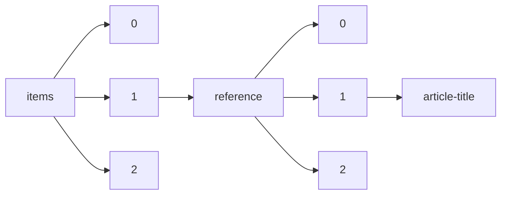

!!! warning "This document is not official Crossref documentation"
# Article-title
PATH = items/array/reference/array/article-title(1)  
Occurs 649 288 250 times  
Unique values: > 999  
{ .annotate }

1. A route to an element, for example:  
   The route "items/array/reference/array/article-title" corresponds to navigating through the JSON indices as  
   ["items"][0]["reference"][0]["article-title"]  

!!! note "Due to current limitations, only the first 1,000 unique values are counted."

| **Row** | **Value** `String`                                                                                | **Count** `Int64` |
|--------:|-----------------------------------------------------------------------------------------------------:|---------------------:|
| **1**   | Protein measurement with the Folin phenol reagent                                                    | 20 956               |
| **2**   |                                                                                                      | 20 856               |
| **3**   | Cleavage of structural proteins during the assembly of the head of bacteriophage T4                  | 14 185               |
| **4**   | Introduction                                                                                         | 8 842                |
| **5**   | Proc. Roy                                                                                            | 8 508                |
| **6**   | Adam: A method for stochastic optimization                                                           | 6 415                |
| **7**   | A rapid and sensitive method for the quantitation of microgram quantities of protein utilizing the p | 5 734                |
| **8**   | J. Biol. Chem                                                                                        | 5 680                |
| **9**   | J                                                                                                    | 5 564                |
| **10**  | Very deep convolutional networks for large-scale image recognition                                   | 4 689                |
| **11**  | Imagenet classification with deep convolutional neural networks                                      | 4 068                |
| **12**  | DNA sequencing with chain-terminating inhibitors                                                     | 3 779                |
| **13**  | Preferred reporting items for systematic reviews and meta-analyses: the PRISMA statement             | 2 557                |
| **14**  | Nature                                                                                               | 2 539                |
| **15**  | Attention is all you need                                                                            | 2 460                |
| **16**  | Generative adversarial nets                                                                          | 2 052                |
| **17**  | Measuring inconsistency in meta-analyses                                                             | 2 034                |
| **18**  | http dx org                                                                                          | 1 900                |
| **19**  | Protein measurement with the folin phenol reagent                                                    | 1 717                |
| **20**  | Deep learning                                                                                        | 1 704                |
| **21**  | Proc. Natl. Acad. Sci. U. S. A                                                                       | 1 593                |
| **22**  | Detection of specific sequences among DNA fragments separated by gel electrophoresis                 | 1 579                |
| **23**  | Using thematic analysis in psychology                                                                | 1 501                |
| **24**  | Basic local alignment search tool                                                                    | 1 386                |
| **25**  | Global cancer statistics 2018: GLOBOCAN estimates of incidence and mortality worldwide for 36 cancer | 1 383                |
| **26**  | Biochemistry                                                                                         | 1 313                |
| **27**  | P hys                                                                                                | 1 252                |
| **28**  | Accepted                                                                                             | 1 248                |
| **29**  | Jour                                                                                                 | 1 224                |
| **30**  | Bias in meta-analysis detected by a simple, graphical test                                           | 1 199                |
| **31**  | Brit                                                                                                 | 1 194                |
| **32**  | Cell                                                                                                 | 1 154                |
| **33**  | ibid                                                                                                 | 1 153                |
| **34**  | The neighbor-joining method: a new method for reconstructing phylogenetic trees                      | 1 124                |
| **35**  | Deep residual learning for image recognition                                                         | 1 103                |
| **36**  | Generalized gradient approximation made simple                                                       | 1 085                |
| **37**  | Nuclear Physics                                                                                      | 1 075                |
| **38**  | U-net: Convolutional networks for biomedical image segmentation                                      | 1 058                |
| **39**  | Controlling the false discovery rate: a practical and powerful approach to multiple testing          | 1 041                |
| **40**  | Proc                                                                                                 | 1 025                |
| **41**  | Clinical features of patients infected with 2019 novel coronavirus in Wuhan, China                   | 1 016                |
| **42**  | Multiple range and multiple F tests                                                                  | 1 006                |
| **43**  | Science                                                                                              | 949                  |
| **44**  | A simple method for the isolation and purification of total lipids from animal tissues               | 937                  |
| **45**  | Physical Review C                                                                                    | 900                  |
| **46**  | J. Pharm. Sci                                                                                        | 859                  |
| **47**  | Batch normalization: Accelerating deep network training by reducing internal covariate shift         | 857                  |
| **48**  | Random forests                                                                                       | 850                  |
| **49**  | Trans                                                                                                | 848                  |
| **50**  | Constitution of Binary Alloys                                                                        | 846                  |
| **51**  | Electrophoretic transfer of proteins from polyacrylamide gels to nitrocellulose sheets: procedure an | 839                  |
| **52**  | Global cancer statistics                                                                             | 836                  |
| **53**  | Microsoft coco: Common objects in context                                                            | 826                  |
| **54**  | This Journal                                                                                         | 819                  |
| **55**  | Z                                                                                                    | 806                  |
| **56**  | Fuzzy sets                                                                                           | 794                  |
| **57**  | Review of particle properties                                                                        | 779                  |
| **58**  | Personal communication                                                                               | 774                  |
| **59**  | J. chem                                                                                              | 757                  |
| **60**  | J. Am. Chem. Soc.                                                                                    | 757                  |
| **61**  | A rapid alkaline extraction procedure for screening recombinant plasmid DNA                          | 757                  |
| **62**  | Amer                                                                                                 | 740                  |
| **63**  | The identification of contact allergens by human assay. III. The maximization test. A procedure for  | 738                  |
| **64**  | Physical Review Letters                                                                              | 725                  |
| **65**  | Nonparametric estimation from incomplete observations                                                | 724                  |
| **66**  | Astrophys                                                                                            | 720                  |
| **67**  | A series of normal stages in the development of the chick embryo                                     | 679                  |
| **68**  | Arch                                                                                                 | 677                  |
| **69**  | Trans. Amer. Math. Soc.                                                                              | 676                  |
| **70**  | Fitting linear mixed-effects models using lme4                                                       | 668                  |
| **71**  | Single-step method of RNA isolation by acid guanidinium thiocyanate-phenol-chloroform extraction     | 665                  |
| **72**  | A rapid method of total lipid extraction and purification                                            | 661                  |
| **73**  | Cleavage of structural proteins during the assembly of the head of bacteriophage T4.                 | 658                  |
| **74**  | Can. J. Math.                                                                                        | 657                  |
| **75**  | Annals of Physics                                                                                    | 650                  |
| **76**  | Nuclear Physics A                                                                                    | 650                  |
| **77**  | Evaluating structural equation models with unobservable variables and measurement error              | 648                  |
| **78**  | Biochim. Biophys. Acta                                                                               | 634                  |
| **79**  | Ann. rheum                                                                                           | 627                  |
| **80**  | Gapped BLAST and PSI-BLAST: a new generation of protein database search programs                     | 607                  |
| **81**  | Analysis of relative gene expression data using real-time quantitative PCR and the 2(-Delta Delta C( | 601                  |
| **82**  | Moderated estimation of fold change and dispersion for RNA-seq data with DESeq2                      | 600                  |
| **83**  | Updating the maximization test for identifying contact allergens                                     | 561                  |
| **84**  | ImageNet classification with deep convolutional neural networks                                      | 554                  |
| **85**  | Thesis                                                                                               | 534                  |
| **86**  | A rating scale for depression                                                                        | 531                  |
| **87**  | Faster r-cnn: Towards real-time object detection with region proposal networks                       | 529                  |
| **88**  | Physics Letters B                                                                                    | 525                  |
| **89**  | J. Cell Biol                                                                                         | 524                  |
| **90**  | Ph.D. Thesis                                                                                         | 520                  |
| **91**  | The measurement of observer agreement for categorical data                                           | 512                  |
| **92**  | A comprehensive set of sequence analysis programs for the VAX                                        | 494                  |
| **93**  | Biochem                                                                                              | 492                  |
| **94**  | J . chem                                                                                             | 487                  |
| **95**  | Arthr                                                                                                | 477                  |
| **96**  | New Prod.                                                                                            | 476                  |
| **97**  | Catalogue of Southern Double Stars                                                                   | 472                  |
| **98**  | Catalogue of Double Stars                                                                            | 472                  |
| **99**  | C.R                                                                                                  | 472                  |
| **100** | An inventory for measuring depression                                                                | 464                  |
| **101** | An International System for Human Cytogenetic Nomenclature                                           | 457                  |
| **102** | Proc. Amer. Math. Soc.                                                                               | 455                  |
| **103** | Hallmarks of cancer: the next generation                                                             | 448                  |
| **104** | Global cancer statistics 2020: GLOBOCAN estimates of incidence and mortality worldwide for 36 cancer | 435                  |
| **105** | Global cancer statistics, 2012                                                                       | 431                  |
| **106** | Statistical methods for assessing agreement between two methods of clinical measurement              | 431                  |
| **107** | Optimization by simulated annealing                                                                  | 427                  |
| **108** | Proc. R                                                                                              | 425                  |
| **109** | Clinical course and risk factors for mortality of adult inpatients with COVID-19 in Wuhan, China: a  | 424                  |
| **110** | J. Biol. Chem.                                                                                       | 420                  |
| **111** | MEGA5: molecular evolutionary genetics analysis using maximum likelihood, evolutionary distance, and | 403                  |
| **112** | Fiji: an open-source platform for biological-image analysis                                          | 397                  |
| **113** | Stereotaxic mapping of the monoamine pathways in the rat brain                                       | 394                  |
| **114** | Ann                                                                                                  | 383                  |
| **115** | Anal. Biochem                                                                                        | 382                  |
| **116** | Pacific J. Math.                                                                                     | 381                  |
| **117** | Linguistic Inquiry                                                                                   | 378                  |
| **118** | Biochem. J                                                                                           | 377                  |
| **119** | J. Am. Chem. Soc                                                                                     | 372                  |
| **120** | Wer ist's?                                                                                           | 365                  |
| **121** | Biometry                                                                                             | 361                  |
| **122** | A technique for radiolabeling DNA restriction endonuclease fragments to high specific activity       | 355                  |
| **123** | Measures of Double Stars                                                                             | 354                  |
| **124** | In Search of Stars with an Annual Parallax                                                           | 354                  |
| **125** | Catalogue of Apparent Diameters and Absolute Radii of Stars (CADARS), 3rd edition, Comments and Stat | 354                  |
| **126** | Spectroscopic Study of Early-Type Multiple Stellar Systems – II. New Binary Subsystems               | 354                  |
| **127** | Measures of Proper Motion Stars Made with the 40-inch Refractor of the Yerkes Observatory in the Yea | 354                  |
| **128** | Proc. R oy                                                                                           | 352                  |
| **129** | Pytorch: An imperative style, high-performance deep learning library                                 | 350                  |
| **130** | 6 Proc. Roy                                                                                          | 349                  |
| **131** | Org. Lett.                                                                                           | 348                  |
| **132** | Nucleic Acids Res                                                                                    | 338                  |
| **133** | Eur. J. Biochem                                                                                      | 338                  |
| **134** | Biochem. Biophys. Res. Commun                                                                        | 336                  |
| **135** | Maximum likelihood from incomplete data via the EM algorithm                                         | 334                  |
| **136** | An attempt to secure “refection” in rats                                                             | 329                  |
| **137** | Refection in the rat                                                                                 | 329                  |
| **138** | Relation between the nature of the carbohydrate in the diet and refection in rats                    | 329                  |
| **139** | Beitrage zur Frage der sog. Refektion                                                                | 329                  |
| **140** | The assay of vitamins B and G as influenced by coprophagy                                            | 329                  |
| **141** | Meta-analysis in clinical trials                                                                     | 329                  |
| **142** | A transmissable change in the intestinal content, enabling rats to grow and thrive without vitamin B | 329                  |
| **143** | Observations on vitamin B deficiency in pigeons (including the occurrence of refection)              | 329                  |
| **144** | The effect of the type of carbohydrate on the synthesis of the B vitamin in the digestive tract of t | 329                  |
| **145** | Die Darstellung von Krystalliziertem antineuritiachen vitamin aus hefe                               | 329                  |
| **146** | An improvement in experimental method for investigation of vitamin G                                 | 329                  |
| **147** | Digestibility of raw corn, potato and wheat starches                                                 | 329                  |
| **148** | Spontaneous curves in rats reared upon a diet devoid of vitamin B and antineuritic vitamin           | 329                  |
| **149** | Protein measurement with Folin phenol reagent                                                        | 328                  |
| **150** | John Braxton Hicks                                                                                   | 326                  |
| **151** | Alexandre Couvelaire (1873–1948)                                                                     | 326                  |
| **152** | Methods Enzymol                                                                                      | 326                  |
| **153** | Dr John Clarence Webster                                                                             | 326                  |
| **154** | John Clarence Webster, 1863–1950                                                                     | 326                  |
| **155** | Can the Subaltern Speak?                                                                             | 326                  |
| **156** | Gregory Goodwin Pincus (1903–1967)                                                                   | 326                  |
| **157** | Professional attainments of Ephraim McDowell                                                         | 326                  |
| **158** | Howard Atwood Kelly                                                                                  | 326                  |
| **159** | Improved M13 phage cloning vectors and host strains: nucleotide sequences of the M13mpl 8 and pUC19  | 326                  |
| **160** | A biographical sketch                                                                                | 326                  |
| **161** | History of blood transfusion                                                                         | 326                  |
| **162** | Oral Pathology                                                                                       | 325                  |
| **163** | Physical Review                                                                                      | 325                  |
| **164** | On the law of effect                                                                                 | 318                  |
| **165** | Assessing the quality of reports of randomized clinical trials: is blinding necessary?               | 309                  |
| **166** | et al.                                                                                               | 303                  |
| **167** | Physics Reports                                                                                      | 300                  |
| **168** | Fast gapped-read alignment with Bowtie 2                                                             | 299                  |
| **169** | The PRISMA 2020 statement: an updated guideline for reporting systematic reviews                     | 297                  |
| **170** | The Pricing of Options and Corporate Liabilities                                                     | 294                  |
| **171** | Some quantitative uses of drug antagonists                                                           | 290                  |
| **172** | Theory of Dislocations                                                                               | 289                  |
| **173** | Angew. Chem. Int. Ed.                                                                                | 288                  |
| **174** | FEBS Lett                                                                                            | 288                  |
| **175** | QIIME allows analysis of high-throughput community sequencing data                                   | 284                  |
| **176** | Clinical characteristics of coronavirus disease 2019 in China                                        | 280                  |
| **177** | Quantifying heterogeneity in a meta-analysis                                                         | 276                  |
| **178** | Review of Modern Physics                                                                             | 275                  |
| **179** | Common risk factors in the returns on stocks and bonds                                               | 274                  |
| **180** | Confidence limits on phylogenies: an approach using the bootstrap                                    | 269                  |
| **181** | Natural Language and Linguistic Theory                                                               | 266                  |
| **182** | Physics of Semiconductor Devices                                                                     | 263                  |
| **183** | J. Org. Chem.                                                                                        | 262                  |
| **184** | A revised medium for rapid growth and bioassays with tobacco tissue cultures                         | 256                  |
| **185** | Physical Review B                                                                                    | 250                  |
| **186** | Ssd: Single shot multibox detector                                                                   | 249                  |
| **187** | The distribution and chemical composition of ultracentrifugally separated lipoproteins in human seru | 246                  |
| **188** | Reply                                                                                                | 244                  |
| **189** | Colorimetric method for determination of sugars and related substances                               | 241                  |
| **190** | A simple method for displaying the hydropathic character of a protein                                | 241                  |
| **191** | J. Mol. Biol                                                                                         | 241                  |
| **192** | J. Algebra                                                                                           | 240                  |
| **193** | Scikit-learn: Machine learning in Python                                                             | 240                  |
| **194** | The theory of planned behavior                                                                       | 239                  |
| **195** | Efficient iterative schemes for ab initio total-energy calculations using a plane-wave basis set     | 238                  |
| **196** | A simplified method of evaluating dose-effect experiments                                            | 238                  |
| **197** | Math. Ann.                                                                                           | 238                  |
| **198** | Deep-Sky Wonders                                                                                     | 236                  |
| **199** | On the Places of 145 New Double Stars                                                                | 236                  |
| **200** | A Spectroscopic Survey on the Multiplicity of High Mass Stars                                        | 236                  |
| **201** | Multiplicity Among Solar-Type Stars                                                                  | 236                  |
| **202** | Seventh Catalogue of New Double Stars                                                                | 236                  |
| **203** | Éléments Orbitaux de Dix-Huit Étoiles Doubles Visuelles                                              | 236                  |
| **204** | Interferometric Observations of Rapidly Rotating Stars                                               | 236                  |
| **205** | The Planet Search Programme at the ESO CES and HARPS. IV. The Search for Jupiter Analogues Around So | 236                  |
| **206** | Double Star Observations Made in 1877–8 in Chicago with the 18.5-inch Refractor of the Dearborn Obse | 236                  |
| **207** | The Double Star Discoveries of Fearon Fallows                                                        | 236                  |
| **208** | Spectroscopic Study of Early-Type Multiple Systems. I – Orbits of Spectroscopic Binary Subsystems    | 236                  |
| **209** | Measures of Miscellaneous Double Stars                                                               | 236                  |
| **210** | Long Baseline Interferometric Multiplicity Survey of the Sco–Cen OB Association                      | 236                  |
| **211** | Orbits for Five Southern Visual Binaries                                                             | 236                  |
| **212** | On the Variation of the Proper Motions of Procyon and Sirius                                         | 236                  |
| **213** | Micrometrical Measurements of Double Stars 1849–1868 and 1899–1903                                   | 236                  |
| **214** | das „Wer ist's?”︁                                                                                     | 235                  |
| **215** | Auto-encoding variational bayes                                                                      | 231                  |
| **216** | A progression for generating variable-interval schedules                                             | 228                  |
| **217** | Sequencing end-labeled DNA with base-specific chemical cleavages                                     | 227                  |
| **218** | Zeitschrift f. Physik A                                                                              | 225                  |
| **219** | A new generation of Ca2+ indicators with greatly improved fluorescence properties                    | 219                  |
| **220** | Relative and absolute strength of response as a function of frequency of reinforcement               | 217                  |
| **221** | A rapid banding technique for human chromosomes                                                      | 211                  |
| **222** | Distilling the knowledge in a neural network                                                         | 209                  |
| **223** | Editorial                                                                                            | 209                  |
| **224** | Math. Z.                                                                                             | 207                  |
| **225** | Semi-supervised classification with graph convolutional networks                                     | 203                  |
| **226** | Visualizing data using t-SNE                                                                         | 201                  |
| **227** | J. Pharm. Sei                                                                                        | 190                  |
| **228** | Introducción                                                                                         | 188                  |
| **229** | Trans. Amer. Math. Soc                                                                               | 187                  |
| **230** | Sp Med                                                                                               | 185                  |
| **231** | Statistical Methods                                                                                  | 184                  |
| **232** | Governmentality                                                                                      | 182                  |
| **233** | Ann. of Math.                                                                                        | 182                  |
| **234** | Mol. Cell. Biol                                                                                      | 180                  |
| **235** | Improved methods for building protein models in electron density maps and the location of errors in  | 179                  |
| **236** | Phosphorus assay in column chromatography                                                            | 178                  |
| **237** | Processing of X-ray diffraction data collected in oscillation mode                                   | 177                  |
| **238** | J. Med. Chem                                                                                         | 176                  |
| **239** | and                                                                                                  | 175                  |
| **240** | Physical Review E                                                                                    | 175                  |
| **241** | Optimization by Simulated Annealing                                                                  | 172                  |
| **242** | On two types of deviation from the matching law: Bias and undermatching                              | 171                  |
| **243** | Neural machine translation by jointly learning to align and translate                                | 170                  |
| **244** | International Code of Botanical Nomenclature (Vienna Code) adopted by the Seventeenth International  | 170                  |
| **245** | Tetrahedron Lett.                                                                                    | 168                  |
| **246** | A quantitative analysis of the responding maintained by interval schedules of reinforcement          | 167                  |
| **247** | The obligatory role of endothelial cells in the relaxation of arterial smooth muscle by acetylcholin | 166                  |
| **248** | J. Pharm. Pharmacol                                                                                  | 165                  |
| **249** | Toward a functional analysis of self-injury                                                          | 164                  |
| **250** | Joseph Asherman, 60th anniversary celebration                                                        | 163                  |
| **251** | The prostaglandins, Sune Bergström and Bengt Samuelsson                                              | 163                  |
| **252** | The Maylard incison in gynecologic surgery                                                           | 163                  |
| **253** | Tubal sterilization: a historical review                                                             | 163                  |
| **254** | Premier chirurgien du roi: the life of Ambroise Paré (1510–1590)                                     | 163                  |
| **255** | Rubella: Historical aspects                                                                          | 163                  |
| **256** | Ulf von Euler                                                                                        | 163                  |
| **257** | Concerning the Fothergill pictures at the Pennsylvania Hospital                                      | 163                  |
| **258** | Das gynäkologische Erbe. Karl Schuchardt zum 90 Todestag                                             | 163                  |
| **259** | Asherman’s syndrome revisited                                                                        | 163                  |
| **260** | Memorable medical mentors: Emil Novak (1884–1957)                                                    | 163                  |
| **261** | Leonard Colebrook: the chemotherapy and control of streptococcal infections                          | 163                  |
| **262** | William Harvey, obstetric physician and gynaecologist                                                | 163                  |
| **263** | Then and now: a tribute to Victor Bonney                                                             | 163                  |
| **264** | On the Bracht manoeuvre                                                                              | 163                  |
| **265** | In memoriam: Robert Latou Dickinson, 1861–1950                                                       | 163                  |
| **266** | Mission de Mme du Coudray, sage-femme royale en 1770: école d’accouchement d’Auch                    | 163                  |
| **267** | A short survey of the life and work of Joseph Clover                                                 | 163                  |
| **268** | John Peter Mettauer                                                                                  | 163                  |
| **269** | Champetier de Ribes, James Ditmars Vorhees and their metreurynters                                   | 163                  |
| **270** | Sister Mary Joseph’s nodule and its relationship to diagnosis of 484carcinoma of the umbilicus       | 163                  |
| **271** | The chain saw: a Scottish invention                                                                  | 163                  |
| **272** | Obstetrics and Gynecology in America III. John Stearns 1770–1848                                     | 163                  |
| **273** | ‘Posterior culdeplasty’: revisited                                                                   | 163                  |
| **274** | Max Madlener                                                                                         | 163                  |
| **275** | The forgotten man in obstetrics                                                                      | 163                  |
| **276** | An interview                                                                                         | 163                  |
| **277** | Homage to an obstetric legend: Edward H                                                              | 163                  |
| **278** | Classic pages in obstetrics and gynecology. Anton J Nuck: Adenographia curiosa et uteri foeminei ana | 163                  |
| **279** | The difficulty of producing sterility by operating on the fallopian tubes                            | 163                  |
| **280** | The birth of a College                                                                               | 163                  |
| **281** | Classic pages in obstetrics and gynecology. Three cases of extirpation of diseased ovaria            | 163                  |
| **282** | The stage setting for Ephraim McDowell, 1771–1830                                                    | 163                  |
| **283** | Safe deliverance                                                                                     | 163                  |
| **284** | Dr Lyman Guy Barton, Senior                                                                          | 163                  |
| **285** | The man behind the syndrome: Curtis Mendelson                                                        | 163                  |
| **286** | Madame Boivin                                                                                        | 163                  |
| **287** | In memoriam: Frederick Carpenter Irving                                                              | 163                  |
| **288** | Alfred Hegar: Hegar’s sign and dilators                                                              | 163                  |
| **289** | Erythroblastosis fetalis-historical aspects                                                          | 163                  |
| **290** | Robert Tuttle Morris (1857–1945): a pioneer in ovarian transplants                                   | 163                  |
| **291** | Professor Sir William Liley (1929–83): New Zealand perinatal physiologist                            | 163                  |
| **292** | The world’s first ‘test-tube baby’: gynecologist Steptoe and physiologist Edwards                    | 163                  |
| **293** | McDowell’s saucer                                                                                    | 163                  |
| **294** | Kristeller’s procedure: expression fetus, its genesis and contemporary application                   | 163                  |
| **295** | Obstetrics and Gynecology in America II. Samuel Bard 1742–1821                                       | 163                  |
| **296** | Classic Articles. Potter EL. Bilateral absence of ureters and kidneys: a report of 50 cases          | 163                  |
| **297** | Medicine versus nature                                                                               | 163                  |
| **298** | Doctor’s autobiographies                                                                             | 163                  |
| **299** | IC Rubin, a gynecologic eponym                                                                       | 163                  |
| **300** | Kelly: pioneer American surgeon                                                                      | 163                  |
| **301** | Lawson Tait and the surgical management of ectopic pregnancy                                         | 163                  |
| **302** | History of colposcopy in the United States                                                           | 163                  |
| **303** | Philipp Bozzini (1773–1809)                                                                          | 163                  |
| **304** | Remarks on the obstetric forceps, with a description and demonstration of Tarnier’s new instrument   | 163                  |
| **305** | They made surgical history in Virginia                                                               | 163                  |
| **306** | On miasmata and contagia                                                                             | 163                  |
| **307** | Emminent venerologists I: Albert Neisser                                                             | 163                  |
| **308** | Needles: some points to think about                                                                  | 163                  |
| **309** | Vaginal hysterectomy as done in France                                                               | 163                  |
| **310** | The history and progress of gas and air analgesia for midwifery                                      | 163                  |
| **311** | Remarks on the writings of Louise Bourgeois                                                          | 163                  |
| **312** | Charles Bingham Penrose and the Penrose drain                                                        | 163                  |
| **313** | Modern midwifery: Hendrik van Deventer to the present                                                | 163                  |
| **314** | J Marion Sims                                                                                        | 163                  |
| **315** | Celebrating the centennial (1894–1994): Leonardo Gigli and his wire saw                              | 163                  |
| **316** | George Papanicolaou: the ‘pap-smear’                                                                 | 163                  |
| **317** | The Breisky–Navratil retractor                                                                       | 163                  |
| **318** | Historic perspective on Liley’s ‘fetal transfusion’                                                  | 163                  |
| **319** | Sister Mary Joseph (1856–1939): In Memoriam                                                          | 163                  |
| **320** | Antoine Lembert (1802–1851)                                                                          | 163                  |
| **321** | Memoirs: Thomas J Watkins                                                                            | 163                  |
| **322** | William Goodell, MD and the Preston Retreat                                                          | 163                  |
| **323** | The enigma of Semmelweis: an interpretation                                                          | 163                  |
| **324** | Edoardo Porro (1842–1902) and the development of caesarean section: a reappraisal                    | 163                  |
| **325** | Memories of James Bertram Collip, 1892–1965                                                          | 163                  |
| **326** | Historical perspectives: forgotten past, unpredictable future                                        | 163                  |
| **327** | Edmund Piper: 1891–1935                                                                              | 163                  |
| **328** | Medicine and science in the writings of Smollett                                                     | 163                  |
| **329** | Battle of eponymy                                                                                    | 163                  |
| **330** | Alexander Gordon of Aberdeen and the discovery of the contagiousness of puerperal fever              | 163                  |
| **331** | The great anatomical atlases                                                                         | 163                  |
| **332** | A short history of eclampsia                                                                         | 163                  |
| **333** | An account of the earliest English work on midwifery and the diseases of women                       | 163                  |
| **334** | Emil Noeggerath (1827–1895)                                                                          | 163                  |
| **335** | Hysterectomy: a historical perspective                                                               | 163                  |
| **336** | Edinburgh’s obstetrical heritage: some names from the past                                           | 163                  |
| **337** | Artist versus engraver in William Hunter’s ‘Anatomy of the Human Gravid Uterus’. 1774                | 163                  |
| **338** | Landsteiner, Wiener, and Levine: the story of blood groups                                           | 163                  |
| **339** | The Manchester operation for genital prolapse                                                        | 163                  |
| **340** | Duchenne of Boulogne: a biography and an appreciation                                                | 163                  |
| **341** | Anglo-American reaction to obstetrical anaesthesia                                                   | 163                  |
| **342** | Die chirurgenfamilie Langenbeck                                                                      | 163                  |
| **343** | Léon Le Fort and his operation for uterine prolapse                                                  | 163                  |
| **344** | The curves of the midwifery forceps; their origins and uses                                          | 163                  |
| **345** | Treatment of placenta previa: a historical and critical sketch                                       | 163                  |
| **346** | Thalidomide in America: a brush with tragedy                                                         | 163                  |
| **347** | Autobiographical letter from Horatio Robinson Storer, MD, to his son, Malcolm Storer, MD, discussing | 163                  |
| **348** | ‘Children unto God’: notes on the life and work of Dr IC Rubin                                       | 163                  |
| **349** | Edmund Brown Piper and his forceps for the aftercoming head                                          | 163                  |
| **350** | James Young Simpson and chloroform                                                                   | 163                  |
| **351** | The Mueller–Hillis maneuver: can it be used to predict dystocia?                                     | 163                  |
| **352** | On Monsel’s salt                                                                                     | 163                  |
| **353** | The funeral of Sir James Simpson                                                                     | 163                  |
| **354** | In memoriam: Thomas Stephen Cullen (1868–1953)                                                       | 163                  |
| **355** | Spasticity and the intellect: Dr Little versus the obstetricians                                     | 163                  |
| **356** | The 100th anniversary of tubal sterilsation                                                          | 163                  |
| **357** | Classic pages in obstetrics and gynecology. Franz Carl Naegele: Das schräg verengte Becken nebst ein | 163                  |
| **358** | The Viennese contribution to venerology                                                              | 163                  |
| **359** | Pierre Robin and the syndrome that bears his name                                                    | 163                  |
| **360** | The history of cervical screening: the Pap test                                                      | 163                  |
| **361** | On the history of cytology                                                                           | 163                  |
| **362** | The Goulstonian Lectures on puerperal fever                                                          | 163                  |
| **363** | Dr Girolamo Fracastoro (1478–1553) and the poetry of Syphilis                                        | 163                  |
| **364** | Memoir: Alexis Victor Moschcowitz                                                                    | 163                  |
| **365** | Marmaduke Burr Wright                                                                                | 163                  |
| **366** | John Chassar Moir (1900–1977)                                                                        | 163                  |
| **367** | The education, naval service and early career of William Smellie                                     | 163                  |
| **368** | The safety of home birth: the Farm study                                                             | 163                  |
| **369** | Hegar’s sign of pregnancy                                                                            | 163                  |
| **370** | ‘Anaesthesia’ (early uses of this word)                                                              | 163                  |
| **371** | The history of laparoscopy                                                                           | 163                  |
| **372** | Was Little right?                                                                                    | 163                  |
| **373** | In Memoriam: Guy LeRoy Hunner                                                                        | 163                  |
| **374** | Historical background of the treatment of placenta praevia                                           | 163                  |
| **375** | The third hurdle: the conquest of sepsis                                                             | 163                  |
| **376** | Looking back                                                                                         | 163                  |
| **377** | Historical perspective: Irving W. Potter, MD, and his internal podalic version                       | 163                  |
| **378** | Marker: Pioneer of the Mexican steroid industry                                                      | 163                  |
| **379** | ‘Proper to the duty of a chirurgeon’: Ambroise Paré and sixteenth century paediatric surgery         | 163                  |
| **380** | Über Tarnier’s forceps                                                                               | 163                  |
| **381** | The evolution of modern obstetrics                                                                   | 163                  |
| **382** | John Hunter’s private press                                                                          | 163                  |
| **383** | Dr John Clarence Webster (1863–1950): man of two careers                                             | 163                  |
| **384** | Sir JY Simpson: his impact and influence                                                             | 163                  |
| **385** | The history of mutilating obstetric operations                                                       | 163                  |
| **386** | Thomas Wharton and the jelly of the umbilical cord                                                   | 163                  |
| **387** | John Snow and research                                                                               | 163                  |
| **388** | Memorial to Edward Keyes                                                                             | 163                  |
| **389** | James Marion Sims and the rise of gynaecological surgery                                             | 163                  |
| **390** | Dr Lippes and his loop: four decades in perspective                                                  | 163                  |
| **391** | Classical file: John Snow: ‘On asphyxia, and on resuscitation of still-born children’                | 163                  |
| **392** | The progress of a Connecticut Yankee: a visit with Dr Herbert Thoms                                  | 163                  |
| **393** | Evolution of graphic analysis of labor                                                               | 163                  |
| **394** | The early history of anatomy in the United States                                                    | 163                  |
| **395** | Harold Leeming Sheehan 1900–1988                                                                     | 163                  |
| **396** | The amplification and recording of foetal heart sounds                                               | 163                  |
| **397** | Fritz Brenner, MD (1877–1969)                                                                        | 163                  |
| **398** | Alfred François Donné (1801–78): a pioneer of microscopy, microbiology and haematology               | 163                  |
| **399** | A century of American medicine, 1776–1876 III. Obstetrics and Gynaecology                            | 163                  |
| **400** | Noble Sproat: in memoriam                                                                            | 163                  |
| **401** | Sir James Young Simpson: victor dolore                                                               | 163                  |
| **402** | Who is Poupart?                                                                                      | 163                  |
| **403** | Edinburgh connections in a painful world                                                             | 163                  |
| **404** | James Douglas of the Pouch, 1675–1742                                                                | 163                  |
| **405** | Furthering the profession: the early years of the American Gynecological Club and its first European | 163                  |
| **406** | The early days of Syntex                                                                             | 163                  |
| **407** | Looking forward                                                                                      | 163                  |
| **408** | George N Papanicolaou (1883–1962)                                                                    | 163                  |
| **409** | History of gynecological pathology                                                                   | 163                  |
| **410** | On the diagnostic term ‘Down’s syndrome’                                                             | 163                  |
| **411** | Professor Joseph G Asherman                                                                          | 163                  |
| **412** | Stanislav Klikovich (1853–1910): pioneer of nitrous oxide and oxygen analgesia                       | 163                  |
| **413** | Ricardo di Edoardo Porro nel centenarion dell sua operazioni                                         | 163                  |
| **414** | Gustav Adolf Michaelis (1798–1848)                                                                   | 163                  |
| **415** | The surgeon-anatomists of Great Windmill Street School                                               | 163                  |
| **416** | Gabriele Fallopio and the Fallopian tubes                                                            | 163                  |
| **417** | A review of thalidomide’s history and current dermatological applications                            | 163                  |
| **418** | In memoriam                                                                                          | 163                  |
| **419** | Sir James Young Simpson                                                                              | 163                  |
| **420** | Phillip Bozzini: a true pioneer of endoscopy                                                         | 163                  |
| **421** | O’Sullivan’s method of hydrostatic replacement of acute uterine inversion                            | 163                  |
| **422** | Johann Müller, the physiologist: a eulogy pronounced in the hall of the University of Berlin         | 163                  |
| **423** | Emil Noeggerath                                                                                      | 163                  |
| **424** | In memoriam: Prof Dr Hans Heidler                                                                    | 163                  |
| **425** | Improved analgesia for women in labour                                                               | 163                  |
| **426** | Ernst Gräfenberg: the life and work of the specialist of Kiel on the hundredth anniversary of his bi | 163                  |
| **427** | The origin of cancer metastasis                                                                      | 163                  |
| **428** | Sir James Y Simpson and London’s ‘conservative and so curiously prejudiced’ Dr Ramsbotham            | 163                  |
| **429** | David Tod Gilliam                                                                                    | 163                  |
| **430** | Leydig, Sertoli, and Reinke: three anatomists who were on the ball                                   | 163                  |
| **431** | A new light upon Hendrik Van Deventer (1651–1724): identification and recovery of a portrait         | 163                  |
| **432** | The late Professor Blair-Bell                                                                        | 163                  |
| **433** | Historical and biographical notes: V. Gabriello Fallopio, 1532–1562                                  | 163                  |
| **434** | Bibliographie de François Rousset                                                                    | 163                  |
| **435** | Histoire de l’opération césarienne                                                                   | 163                  |
| **436** | DeLee and his textbook, Principles and Practice of Obstetrics                                        | 163                  |
| **437** | Semmelweis: the combat against puerperal fever                                                       | 163                  |
| **438** | In memoriam: Joseph Bolivar De Lee (1869–1942)                                                       | 163                  |
| **439** | In rural Virginia, world-class medicine. John Peter Mettauer, 1787–1878                              | 163                  |
| **440** | Roberts’ sign of intrauterine fetal death                                                            | 163                  |
| **441** | Howard Atwood Kelly (1858–1943) as a medical historian                                               | 163                  |
| **442** | A note on William Hunter’s monograph The Anatomy of the Human Gravid Uterus                          | 163                  |
| **443** | Ernst Moro (1874–1951)                                                                               | 163                  |
| **444** | De la kraurosis vulvae, par Breisky (Revue des Journaux)                                             | 163                  |
| **445** | In memoriam: Roberto Caldeyro-Barcia                                                                 | 163                  |
| **446** | Developments and trends in gynecology                                                                | 163                  |
| **447** | Anthèlme Récamier de la morine à la gynécologie (1774–1852)                                          | 163                  |
| **448** | William Hunter’s obstetrical career                                                                  | 163                  |
| **449** | John Peter Mettauer: early southern gynecologist                                                     | 163                  |
| **450** | James Young Simpson: the controversy surrounding the presentation of his Air Tractor (1848–1849)     | 163                  |
| **451** | Continuous spinal anesthesia: a continuous history?                                                  | 163                  |
| **452** | A brief history of puerperal infection                                                               | 163                  |
| **453** | Dr Hunter’s ‘Gravid uterus’: a bicentenary note                                                      | 163                  |
| **454** | The introduction of nitrous oxide analgesia into obstetrics                                          | 163                  |
| **455** | The early ovariotomists: pioneers in abdominal surgery                                               | 163                  |
| **456** | Ephraim McDowell, 1809                                                                               | 163                  |
| **457** | Hermann Johan Pfannenstiel and the Pfannenstiel incision                                             | 163                  |
| **458** | Classic pages in obstetrics and gynecology. Experimental studies on the prevention of Rh haemolytic  | 163                  |
| **459** | November, 1847 and its sequel                                                                        | 163                  |
| **460** | Life and contributions of Otto Ernst Küstner (1848–1931)                                             | 163                  |
| **461** | The first neonatal exchange transfusion for haemolytic disease of the newborn by Dr Alfred Hart of T | 163                  |
| **462** | In memoriam: John Albertson Sampson (1873–70)                                                        | 163                  |
| **463** | Anthony van Leeuwenhoek and his microscopes                                                          | 163                  |
| **464** | Classic Articles: McCall ML. Posterior culdeplasty                                                   | 163                  |
| **465** | A visit with Dr Emil Novak                                                                           | 163                  |
| **466** | The history of ovariotomy                                                                            | 163                  |
| **467** | Hieronymus Fracastorius: a brief survey of his life and work on syphilis                             | 163                  |
| **468** | John Whitridge Williams and academic obstetrics in America                                           | 163                  |
| **469** | The development of the modern catheter                                                               | 163                  |
| **470** | Local anaesthesia: early spinal anaesthesia                                                          | 163                  |
| **471** | James Kenneth Wallace Ferguson: a life in Canadian medical research                                  | 163                  |
| **472** | Semmelweis: a rereading of Die Aetiologie Part II: Medical historians and Semmelweis                 | 163                  |
| **473** | Huber needle and Tuohy catheter                                                                      | 163                  |
| **474** | The first hurdle: the arrest of haemorrhage                                                          | 163                  |
| **475** | Friedrich Trendelenburg and the Trendelenburg position                                               | 163                  |
| **476** | Lessons from a study of the cesarean operation in the city and state of New York and their bearing u | 163                  |
| **477** | Fond memories of Virginia Apgar                                                                      | 163                  |
| **478** | Carl Siegmund Credé, placental expression and the prevention of neonatal ophthalmia                  | 163                  |
| **479** | Louise Bourgeois: an old midwife’s tale                                                              | 163                  |
| **480** | Ralph Hayward Pomeroy, MD, 1867–1925                                                                 | 163                  |
| **481** | Classic Articles: Bishop EH. Pelvic scoring for elective induction                                   | 163                  |
| **482** | Centenary of antenatal care                                                                          | 163                  |
| **483** | The Royal College of Obstetricians and Gynaecologists                                                | 163                  |
| **484** | Classic pages in obstetrics and gynecology. Fielding Ould: A Treatise of Midwifery in Three Parts    | 163                  |
| **485** | The medical achievements of Dr Holmes                                                                | 163                  |
| **486** | Historical observations on shoulder dystocia                                                         | 163                  |
| **487** | Biographical note on Étienne Tarnier                                                                 | 163                  |
| **488** | The Barton obstetric forceps                                                                         | 163                  |
| **489** | Vaginal pessary: past and present                                                                    | 163                  |
| **490** | The writings of Mauriceau                                                                            | 163                  |
| **491** | Gustav Adolf Walcher                                                                                 | 163                  |
| **492** | Classic pages in obstetrics and gynecology. Emanuel A Friedman: The Graphic Analysis of Labor        | 163                  |
| **493** | Cytology from antiquity to Papanicolaou                                                              | 163                  |
| **494** | Ernest Ayre and the Ayre spatula                                                                     | 163                  |
| **495** | Sir Thomas Browne, physician and man of letters, with an account of his skull                        | 163                  |
| **496** | Clarke CA                                                                                            | 163                  |
| **497** | The Soranus score                                                                                    | 163                  |
| **498** | Soranus and his system of medicine                                                                   | 163                  |
| **499** | Antoni van Leeuwenhoek (1632–1723): father of microscopy                                             | 163                  |
| **500** | Professor Roberto Caldeyro-Barcia (1921–1996)                                                        | 163                  |
| **501** | The making of the pill                                                                               | 163                  |
| **502** | Reminiscences of Dr J Marion Sims in Paris                                                           | 163                  |
| **503** | John Snow, MD (1813–1858). Part II: becoming a doctor – his medical training and early years of prac | 163                  |
| **504** | A ‘noble instrument’: the obstetric forceps                                                          | 163                  |
| **505** | Historical profile of Kurt Karl Stephen Semm, born March 23, 1927 in Munich, Germany, resident of Tu | 163                  |
| **506** | Classic pages in obstetrics and gynecology. Priscilla White: Pregnancy complicating diabetes         | 163                  |
| **507** | The identity of erysipelas and certain forms of puerperal fever                                      | 163                  |
| **508** | Leonardo Gigli (1863–1908)                                                                           | 163                  |
| **509** | Nicholas Culpeper, father of English midwifery                                                       | 163                  |
| **510** | Madame Degerine-Klumpke                                                                              | 163                  |
| **511** | Mannen bakom tumoreu: Friedrich Krukenberg                                                           | 163                  |
| **512** | The evolution of gynecology                                                                          | 163                  |
| **513** | Classic pages in obstetrics and gynecology. John Braxton Hicks: On the contractions of the uterus th | 163                  |
| **514** | Paul Portal: his true place in the literature of placenta praevia                                    | 163                  |
| **515** | A chronology of the founders of the forceps (1569–1799)                                              | 163                  |
| **516** | The evolution in America of abdominal hysterectomy and total extirpation of the uterus               | 163                  |
| **517** | John Clarence Webster: the laird of Shediac                                                          | 163                  |
| **518** | Alexandre Couvelaire and utero-placental apoplexy                                                    | 163                  |
| **519** | Jan Palfyn                                                                                           | 163                  |
| **520** | A story of two miracles: the impact of the discovery of insulin on pregnancy in women with diabetes  | 163                  |
| **521** | Historical perspective: ‘Once a caesarean … always a caesarean’                                      | 163                  |
| **522** | The life and times of Sir Fielding Ould: man-midwife and master physician                            | 163                  |
| **523** | Medical eponyms                                                                                      | 163                  |
| **524** | Gregg and congenital rubella: lessons from history and clinical research                             | 163                  |
| **525** | In memoriam: Prof Selmar Aschheim                                                                    | 163                  |
| **526** | Lugol, his work and his solution                                                                     | 163                  |
| **527** | Leonardo Gigli                                                                                       | 163                  |
| **528** | Who is Houstoun? A biography of Robert Houstoun                                                      | 163                  |
| **529** | Dr Barnes’ water bags                                                                                | 163                  |
| **530** | Fetal auscultation-some aspects of its history and evolution                                         | 163                  |
| **531** | Paul Portal, his life and treatise on obstetrics, with reflections on the science of the obstetrical | 163                  |
| **532** | What’s in a name. The Krukenberg tumour                                                              | 163                  |
| **533** | The origin of the male midwife                                                                       | 163                  |
| **534** | British medicine and the old Vienna Medical School                                                   | 163                  |
| **535** | James Blundell, 1790–1878; experimental physiologist and obstetrician                                | 163                  |
| **536** | The invention and evolution of the midwifery forceps                                                 | 163                  |
| **537** | Apologia: how and why medical sonar developed                                                        | 163                  |
| **538** | Itera in Angliam 1748–1785                                                                           | 163                  |
| **539** | The origins and development of the ventouse                                                          | 163                  |
| **540** | ‘My brother preaches, I practice’: Walter Channing, MD. Antebellum obstetrician                      | 163                  |
| **541** | James Matthews Duncan                                                                                | 163                  |
| **542** | Joseph Thomas Clover and the contributions of surgery to anaesthesia                                 | 163                  |
| **543** | The Burch procedure: John Christopher Burch (1900–1977)                                              | 163                  |
| **544** | The ‘Scotch-Irish’ of the Valley of Virginia, and their influence on medical progress in America     | 163                  |
| **545** | Rubber wars: struggles over the condom in the United States                                          | 163                  |
| **546** | History of hysterectomy                                                                              | 163                  |
| **547** | In memoriam: Howard Carman Moloy (1903–1953)                                                         | 163                  |
| **548** | Edoardo Porro and caesarean hysterectomy                                                             | 163                  |
| **549** | The Manchester School: Charles White (1728–1813) and the arrest of puerperal fever                   | 163                  |
| **550** | Le docteur H. Hallopeau (1842–1919)                                                                  | 163                  |
| **551** | Walter Channing (1785–1876) pioneer in obstetric anesthesia                                          | 163                  |
| **552** | In memoriam: Milton Lawrence McCall 1911–1963                                                        | 163                  |
| **553** | Kergaradec, friend of Laennec and pioneer of foetal auscultation                                     | 163                  |
| **554** | Local anaesthesia: the early evolution of spinal needles                                             | 163                  |
| **555** | Guillaume Duchenne                                                                                   | 163                  |
| **556** | Apgar score and Soranus of Ephesus                                                                   | 163                  |
| **557** | 50 years after the death of George Nicholas Papanicolaou (1883–1962): evaluation of his scientific w | 163                  |
| **558** | Caspar Friedrich Wolff and his ‘Theoria generationis’, 1759                                          | 163                  |
| **559** | Sir James Young Simpson’s influence on the progress of obstetrics                                    | 163                  |
| **560** | Ignatz Philipp Semmelweis: outline for a biography                                                   | 163                  |
| **561** | Johannes Müller, a university teacher                                                                | 163                  |
| **562** | Nicholas Culpeper and his books                                                                      | 163                  |
| **563** | A brief history of colposcopy                                                                        | 163                  |
| **564** | Evolution in axis-traction: an advance upon the method of utilizing the principle of axis-traction i | 163                  |
| **565** | Memoir of the life and writings of the late John Houston, MD                                         | 163                  |
| **566** | Otto Küstner (1848–1931)                                                                             | 163                  |
| **567** | Joseph Clover Centenary Lecture: ‘Out of the nettle …’                                               | 163                  |
| **568** | Save the Barton forceps                                                                              | 163                  |
| **569** | Sister Mary Joseph’s nodule                                                                          | 163                  |
| **570** | Dances with microscopes: Antoni van Leeuwenhoek (1632–1723)                                          | 163                  |
| **571** | Obstetrics in the 17th and 18th centuries and its implications for maternal and infant mortality     | 163                  |
| **572** | Le professeur JA Sicard: sa vie et son oeuvre                                                        | 163                  |
| **573** | The development of oxytocic drugs in the management of postpartum haemorrhage                        | 163                  |
| **574** | Marcello Malpighi, 1628–1694                                                                         | 163                  |
| **575** | In memoriam: Robert Otto Meyer (1864–1947)                                                           | 163                  |
| **576** | Cochrane Collaboration helping unravel tangled web woven by international research                   | 163                  |
| **577** | Der Frankfurter Arzt Philipp Bozzini, der Erfinder des Lichtleiters, 1773–1809                       | 163                  |
| **578** | Evory Kennedy: a master controversial                                                                | 163                  |
| **579** | James Mourilyan 1920–2010                                                                            | 163                  |
| **580** | Louise de la Vallière and the birth of the man-midwife                                               | 163                  |
| **581** | The history and present-day use of ergot                                                             | 163                  |
| **582** | Anecdotes sur François Mauriceau                                                                     | 163                  |
| **583** | Die Wiener Experimente mit dem Lichtleiter Bozzinis (1806/1807)                                      | 163                  |
| **584** | Pinching, electrocution, raven’s beaks, and positive pressure ventilation: a brief history of neonat | 163                  |
| **585** | Memorable medical mentors: Thomas S. Cullen (1868–1953)                                              | 163                  |
| **586** | In memoriam: Ludwig Bandl                                                                            | 163                  |
| **587** | OW Holmes: his work in establishing the contagious nature of childbed fever                          | 163                  |
| **588** | Changing practice in obstetrics and gynaecology                                                      | 163                  |
| **589** | On the life of William Hunter                                                                        | 163                  |
| **590** | Irving White Potter 1868–1956                                                                        | 163                  |
| **591** | Classic pages in obstetrics and gynaecology. Francois Mauriceau: Des maladies des femmes grosses, et | 163                  |
| **592** | The Chromosomes in Human Cancer and Leukemia                                                         | 162                  |
| **593** | Anal. Chem                                                                                           | 160                  |
| **594** | Dispersion on a sphere                                                                               | 160                  |
| **595** | Review of Particle Properties                                                                        | 158                  |
| **596** | J. Chromatogr                                                                                        | 152                  |
| **597** | Annual Review of Nuclear and Particle Science                                                        | 150                  |
| **598** | Regression shrinkage and selection via the lasso                                                     | 149                  |
| **599** | Long short-term memory                                                                               | 147                  |
| **600** | Mini-Mental State: a practical method for grading the cognitive state of patients for the clinician  | 146                  |
| **601** | International Committee on Systematic Bacteriology. Report of the ad hoc committee on reconciliation | 145                  |
| **602** | Dislocations                                                                                         | 143                  |
| **603** | Advanced Inorganic Chemistry                                                                         | 141                  |
| **604** | Molecular Cloning                                                                                    | 136                  |
| **605** | Dating the endometrial biopsy                                                                        | 135                  |
| **606** | Proc. Natl. Acad. Sei. U. S. A                                                                       | 135                  |
| **607** | The Work of Art in the Age of Mechanical Reproduction                                                | 134                  |
| **608** | J. Pharmacol. Exp. Ther                                                                              | 134                  |
| **609** | Theory of the firm: Managerial behavior, agency costs and ownership structure                        | 127                  |
| **610** | Working Papers in Scandinavian Syntax                                                                | 126                  |
| **611** | Isolation of biologically active ribonucleic acid from sources enriched in ribonuclease              | 126                  |
| **612** | Zeitschrift f. Physik                                                                                | 125                  |
| **613** | Physical Review A                                                                                    | 125                  |
| **614** | Progress of Theoretical Physics                                                                      | 125                  |
| **615** | Foreword                                                                                             | 119                  |
| **616** | Close Stellar Conjunction of α Centauri A and B Until 2050. An Mk = 7.8 Star May Enter the Einstein  | 118                  |
| **617** | Interferometer Measures of Double Stars in 1986–1990                                                 | 118                  |
| **618** | Massive Pulsating Stars Observed by BRITE-Constellation. The Triple System β Centauri (Agena)        | 118                  |
| **619** | A Study of the Spectroscopic Binary ζ2 CrB A                                                         | 118                  |
| **620** | A Method of Measuring High Δm Doubles                                                                | 118                  |
| **621** | A Survey of Stars with Composite Spectra                                                             | 118                  |
| **622** | Area Scanner Observations of Close Visual Double Stars. II – Results for 153 Southern Stars          | 118                  |
| **623** | Speckle Observations with PISCO in Merate (Italy) XVI: Astrometric Measurements on Visual Binaries i | 118                  |
| **624** | Photoelectric Magnitudes and Colours for Bright Southern Stars (Sixth List)                          | 118                  |
| **625** | The Nearby Eclipsing Stellar System δ Velorum. IV – Differential Astrometry with VLT/NACO at the 100 | 118                  |
| **626** | A Multi-Wavelength View on the Dusty Wolf–Rayet Star WR 48a                                          | 118                  |
| **627** | The Orbits of Two Double-Lined B-Type Binaries                                                       | 118                  |
| **628** | Measures of the Double Stars Contained in the Mensurae Micrometricae of F. G. W. Struve              | 118                  |
| **629** | Visual Binary Orbits and Masses Post-Hipparcos                                                       | 118                  |
| **630** | Observations of Double Stars Made at Sydney Observatory                                              | 118                  |
| **631** | The M Dwarfs in Multiples (MINMS) Survey. I – Stellar Multiplicity Among Low-Mass Stars within 15 Pa | 118                  |
| **632** | Dopplesternmessungen                                                                                 | 118                  |
| **633** | Albireo as a Triple Star                                                                             | 118                  |
| **634** | Speckle Interferometry Observations of Binary Systems at the Haute Provence 1.93 m Telescope         | 118                  |
| **635** | The Southern Double Stars of Carl Rumker I: History, Identification, Accuracy                        | 118                  |
| **636** | On the Orbit of p Eridani                                                                            | 118                  |
| **637** | Revised Orbits for 105 Herculis and π Cephei and a Model for the π Cephei System                     | 118                  |
| **638** | Double Stars with Wide Separations in the AGK3 – I. Components That Are Themselves Spectroscopic Bin | 118                  |
| **639** | Infrared Detection of the Low Mass Companion to Zeta Aquarii B                                       | 118                  |
| **640** | On the Magnifying Powers Used by Double Star Observers                                               | 118                  |
| **641** | A New View of Mizar                                                                                  | 118                  |
| **642** | Speckle Observations with Pisco in Merate. IV: Astrometric Measures of Visual Binaries in            | 118                  |
| **643** | Speckle Interferometric Observations of Binary Systems with the Haute-Provence 1.93 metre telescope  | 118                  |
| **644** | The Binary Star 70 Ophiuchi Revisited                                                                | 118                  |
| **645** | Unique Sextuple System: 65 Ursae Majoris                                                             | 118                  |
| **646** | Speckle Interferometric Measurements of Binary Stars                                                 | 118                  |
| **647** | Spectroscopic Binary Orbits from Photoelectric Radial Velocities Paper 150: ζ Cnc C                  | 118                  |
| **648** | Search for Low-Mass Prestellar Companions around X-Ray Selected Late B-Stars                         | 118                  |
| **649** | Schreiben des Herrn Professors Dr Winnecke, Directors des Sternwarte im Strassburg and den Herausgeb | 118                  |
| **650** | IIK1                                                                                                 | 118                  |
| **651** | Una Premier: Medidas CCD de 210 Estrellas Dobles visuales en Remoto con un Telescopio Go-To          | 118                  |
| **652** | Measures Micrométriques d’Étoiles Doubles Visuelles Effectuées a l’Equatorial de 45 cm               | 118                  |
| **653** | Tau Cygni                                                                                            | 118                  |
| **654** | The Companion of θ Scorpii                                                                           | 118                  |
| **655** | Further Observations on the Spectra of Some of the Stars and Nebulae, with an Attempt to Determine T | 118                  |
| **656** | Delta Velorum is an Eclipsing Binary                                                                 | 118                  |
| **657** | A Double Star Problem                                                                                | 118                  |
| **658** | Detection of a Planetary Companion Around the Giant Star γ1 Leonis                                   | 118                  |
| **659** | Near Infrared Imaging of Unseen Companions to Nearby Stars                                           | 118                  |
| **660** | Speckle Observations with PISCO in Merate: XI Astrometric Measurements of Visual Binaries in 2010    | 118                  |
| **661** | The Stellar Association Around Gamma Velorum and its Relationship with Vela OB2                      | 118                  |
| **662** | A Journey from Engaged Imagination to Passive Data Consumption                                       | 118                  |
| **663** | First Results From the ESO VLTI Calibration Programme                                                | 118                  |
| **664** | The System of α Crucis                                                                               | 118                  |
| **665** | In Defence of Albireo                                                                                | 118                  |
| **666** | On the Companion of Sirius                                                                           | 118                  |
| **667** | Stellar Groups. V – Luminosities, Motions and Masses of the Late-Type Subgiants                      | 118                  |
| **668** | The Spectrum of the Companion to Castor and of W.B. 16h 908                                          | 118                  |
| **669** | Observations of a New Variable Star                                                                  | 118                  |
| **670** | The Twenty Five Year Lick Planet Search                                                              | 118                  |
| **671** | Astrometric Study of the Triple Star ADS 9173                                                        | 118                  |
| **672** | Ancient Eruption of η Carinae: A Tale Written in Proper Motions                                      | 118                  |
| **673** | High-Cadence Spectroscopy of M Dwarfs. I – Analysis of Systematic Effects in HARPS-N Line Profile Me | 118                  |
| **674** | The Orbit of the Close Spectroscopic Binary ϵ Lupi and the Intrinsic Variability of Its Early B-type | 118                  |
| **675** | CCD Imaging of STF 93C and D                                                                         | 118                  |
| **676** | A Purely Geometric Distance to the Binary Star Atlas, a Member of the Pleiades                       | 118                  |
| **677** | Measures of Double Stars – 10th Series                                                               | 118                  |
| **678** | Micrometrical Observations of 364 Double Stars with a 7-Foot Equatorial Achromatic Telescope, Taken  | 118                  |
| **679** | A List of Probably New Double Stars                                                                  | 118                  |
| **680** | Common Proper Motion Stars in the AGK3                                                               | 118                  |
| **681** | The Angular Diameter of 32 Stars                                                                     | 118                  |
| **682** | UBV(RIC)c Observations for 13 Bright Cepheids                                                        | 118                  |
| **683** | Search for Exoplanets and Brown Dwarfs using VLBI                                                    | 118                  |
| **684** | The Variable Velocity of β Cygni                                                                     | 118                  |
| **685** | Investigating the Semi-Regular Light Variation of the Bright M5 Supergiant α Herculis                | 118                  |
| **686** | A Dynamically Packed Planetary System Around GJ 667C with Three Super-Earths in Its Habitable Zone   | 118                  |
| **687** | Fifth List of New Double Stars                                                                       | 118                  |
| **688** | Observation d’étoiles doubles                                                                        | 118                  |
| **689** | Radial Velocity Observations of Eight Short-Period Visual Binaries                                   | 118                  |
| **690** | Two-colour Photometry for 9473 Components of Close Hipparcos Double and Multiple Stars               | 118                  |
| **691** | Discovery and Measurement of Double Stars by Lunar Occultations                                      | 118                  |
| **692** | Double Stars                                                                                         | 118                  |
| **693** | The Radia1 Velocities of 594 Stars                                                                   | 118                  |
| **694** | The Spectrographic Orbits of HD 109510                                                               | 118                  |
| **695** | Misure Micrometriche di Coppie di Stella Eseguite nell’Anno 1921                                     | 118                  |
| **696** | Discovery of a Companion to θ Scorpii                                                                | 118                  |
| **697** | The VAST Survey. III – The Multiplicity of A-Type Stars within 75 Pc                                 | 118                  |
| **698** | Recent Observations of 44 Bootis                                                                     | 118                  |
| **699** | On Certain Spectroscopic Binaries                                                                    | 118                  |
| **700** | Letter from Mr Dawes Announcing the Discovery of Two New Double Stars                                | 118                  |
| **701** | 29th                                                                                                 | 118                  |
| **702** | On the Spectrum of ζ UMa                                                                             | 118                  |
| **703** | Medidas Micrométricas de Estrellas Dobles                                                            | 118                  |
| **704** | Direct Constraints on the Distance of γ 2 Velorum from AMBER/VLTI Observations                       | 118                  |
| **705** | Observations of the Apparent Distance and Position of 380 Double and Triple Stars, Made in the Years | 118                  |
| **706** | Radial Velocities of Southern Visual Multiple Stars                                                  | 118                  |
| **707** | The Mass-Ratio Distribution of B-Type Visual Binaries in the Sco–Cen Association                     | 118                  |
| **708** | Eta Carinae Resolved by Speckle Interferometry                                                       | 118                  |
| **709** | Bestimmung der Entfernung des 61sten des Schwans                                                     | 118                  |
| **710** | Observations of Double Stars Taken at Madras in 1853, 4, 5 and the Beginning of 1856                 | 118                  |
| **711** | The Magnetic Field and Wind Confinement of β Cephei. New Clues for Interpreting the Phenomenon       | 118                  |
| **712** | The Double-Lined Spectroscopic Binary ϵ Lupi (HD 136504)                                             | 118                  |
| **713** | Speckle Interferometry with the OCA 22-inch Telescope                                                | 118                  |
| **714** | Notes on Some Series of Interferometric Measures of Double Stars                                     | 118                  |
| **715** | The VAST Survey. III – The Multiplicity of A-Type Stars within 75 Pc.                                | 118                  |
| **716** | New Double Stars Found at the Cape Observatory in 1906                                               | 118                  |
| **717** | The Southern Double Stars of Carl Rumker I: History, Identification                                  | 118                  |
| **718** | The Radial Velocities of Nineteen Stars                                                              | 118                  |
| **719** | Double Star Observations Made in 1877–8 in Chicago with the 18.5-inch refractor of the Dearborn Obse | 118                  |
| **720** | Double Star Measurements at the International Amateur Sternwarte (IAS) in Namibia in 2007            | 118                  |
| **721** | Account of the Changes That Have Happened, During the Last Twenty-Five Years, in the Relative Situat | 118                  |
| **722** | Proxima’s Orbit Around Alpha Centauri                                                                | 118                  |
| **723** | Catalogue of Double Stars, Deduced from Observations at Poona from November 1845 to February 1848    | 118                  |
| **724** | An Investigation of the Relative Proper Motion of Some Optical Double Stars                          | 118                  |
| **725** | Double Star Measurements at the Southern Sky with a 50-cm reflector in 2016                          | 118                  |
| **726** | New Companions to Nearby Low-Mass Stars                                                              | 118                  |
| **727** | Measures of the Stars Noted as Double in Krueger’s Catalogue of the Astronomische Gesellschaft, Zone | 118                  |
| **728** | Thomas Lewis: A Lifetime of Double Stars                                                             | 118                  |
| **729** | Close Encounters of the Stellar Kind                                                                 | 118                  |
| **730** | HR 5 = ADS 61: A New Variable Star                                                                   | 118                  |
| **731** | Polaris Today                                                                                        | 118                  |
| **732** | γ2 Velorum: Orbital Solution and Fundamental Parameters Determined with SUSI                         | 118                  |
| **733** | Micrometric Measures of Double Stars (Fifth Series)                                                  | 118                  |
| **734** | Ueber Verandliche Sterne                                                                             | 118                  |
| **735** | Decouvertes et Résultats de Measures de 224 Étoiles Doubles Visuelles avec un Télescope GoTo piloté  | 118                  |
| **736** | The Orbital Elements of 25 G Crucis (HD 108250)                                                      | 118                  |
| **737** | Observations of the Apparent Distance and Position of 380 Double and Triple Stars, Made in the Years | 118                  |
| **738** | Observing Double Stars for Fun and Science                                                           | 118                  |
| **739** | Founder of the RAS: Stephen Groombridge                                                              | 118                  |
| **740** | Resolving the Stellar Activity of the Mira AB Binary with ALMA                                       | 118                  |
| **741** | The Radial Velocity Variability of Gamma Crucis                                                      | 118                  |
| **742** | MOLSCRIPT: a program to produce both detailed and schematic plots of protein structures              | 118                  |
| **743** | The Contact Binary AW UMa as a Member of a Multiple System                                           | 118                  |
| **744** | Double Stars That Vex the Observer                                                                   | 118                  |
| **745** | Fast Rotating Nearby Solar-Type Stars. I – Spectral classification v sin i, Li Abundances and X-Ray  | 118                  |
| **746** | A Study of Bright Southern Slowly Pulsating B Stars. II – The Intrinsic Frequencies                  | 118                  |
| **747** | Photoelectric Photometry of 65 UMa (HR 4568)                                                         | 118                  |
| **748** | Orbits of 20 Visual Binaries                                                                         | 118                  |
| **749** | Variable Velocities of Stars in the Line of Sight                                                    | 118                  |
| **750** | An Investigation of the Motion of the Dark Companion of 61 Cygni                                     | 118                  |
| **751** | Orbital Parameters, Masses, and Distances to β Centauri Determined with the Sydney University Stella | 118                  |
| **752** | Flamsteed Numbers and Harris’s Star Maps                                                             | 118                  |
| **753** | Ludwig Schupmann Observatory Measures of Large Δm Pairs – Part Three                                 | 118                  |
| **754** | Invisible Double Stars                                                                               | 118                  |
| **755** | Micrometer Measures of 1164 Double Stars, Pt 6                                                       | 118                  |
| **756** | Comparative Statistics and Origin of Double and Triple Stars                                         | 118                  |
| **757** | Visual and Ultraviolet Flux Variability of the Bright CP Star θ Aurigae                              | 118                  |
| **758** | Micrometrical Measurements of the Positions and Distances of 121 Double Stars, Taken at Ormskirk Dur | 118                  |
| **759** | Determination de l’orbite de ξ Ursae Majoris                                                         | 118                  |
| **760** | A Catalogue of Multiplicity Among Bright Stellar Systems                                             | 118                  |
| **761** | An Investigation of the Multiple Star ζ Cnc by a Lunar Occultation                                   | 118                  |
| **762** | Extrasolar Planets and Brown Dwarfs Around A-F Type Stars. VI. High Precision RV Survey of Early-Typ | 118                  |
| **763** | New Double Stars Discovered by Mr. Alvan Clark, Boston, US; with Appended Remarks                    | 118                  |
| **764** | Speckle Interferometry and Speckle Holography with the 1.5m and 3.6m ESO Telescopes                  | 118                  |
| **765** | Searching for Faint Companions with VLTI/Pionier. II – 92 Main Sequence Stars from the Exozodl Surve | 118                  |
| **766** | Accurate Absolute Luminosities, Effective Temperatures, Radii, Masses and Surface Gravities for a Se | 118                  |
| **767** | Étoiles Doubles Orbitales a Composantes Variables                                                    | 118                  |
| **768** | Spectroscopic Binary Orbits from Photoelectric Radial Velocities. Paper 142: ξ Ursae Majoris         | 118                  |
| **769** | Flare-Up of Krueger 60 B                                                                             | 118                  |
| **770** | Concerning the Radial Velocity of Polaris                                                            | 118                  |
| **771** | Is Sirius a Triple Star?                                                                             | 118                  |
| **772** | The Period of DN UMa (HR 4560): A Bright Eclipsing Binary                                            | 118                  |
| **773** | Th. Preibisch and P. Mucciarelli, New Constraints on the Multiplicity of Massive Young Stars in Uppe | 118                  |
| **774** | Twenty Three Stars Whose Radial Velocities Vary                                                      | 118                  |
| **775** | Long Baseline Interferometric Multiplicity Survey of the Sco-Cen OB Association                      | 118                  |
| **776** | The 74th Special Name-List of Variable Stars                                                         | 118                  |
| **777** | Measures of Double Stars in the Years 1923– 1926                                                     | 118                  |
| **778** | Measures of Double Stars in the Years 1923–1926                                                      | 118                  |
| **779** | Ultraviolet Observations of the Circumstellar Envelope of α 1 Her in the Line of Sight of α2 Her     | 118                  |
| **780** | Obituary of T. H. E. C. Espin.                                                                       | 118                  |
| **781** | Six Stars Where Radial Velocities Vary                                                               | 118                  |
| **782** | Die Systemkonstanten der Dopple und Mehrfach-sterne ξ Cephei (ADS 15600), ϵ Equ (ADS 14499) und ϵ Hy | 118                  |
| **783** | Stellar Companions to Stars with Planets                                                             | 118                  |
| **784** | Kruger 60                                                                                            | 118                  |
| **785** | The Radial Velocities of 125 Stars                                                                   | 118                  |
| **786** | Orbits of Twenty Visual Binaries                                                                     | 118                  |
| **787** | Velocity Variations in Beta Centauri                                                                 | 118                  |
| **788** | Obituary of S. W. Burnham.                                                                           | 118                  |
| **789** | Th. ten Brummelaar, S. R. Kane et al., Stellar Diameters and Temperatures II. Main Sequence K and M  | 118                  |
| **790** | The Spectroscopic Orbit of ζ1 Ursae Majoris                                                          | 118                  |
| **791** | A New Quadruple Stellar System                                                                       | 118                  |
| **792** | On the Class of Double Stars which can be Observed with Refractors                                   | 118                  |
| **793** | CCD Imaging of STF 93 C and D                                                                        | 118                  |
| **794** | Parallaxes and Proper Motions for 20 Open Clusters as Based on the New Hipparcos Catalogue           | 118                  |
| **795** | Note from Captain Jacob to the Editor, Relative to the Ternary Star 57 Librae                        | 118                  |
| **796** | The Eclipsing System ζ Phoenicis                                                                     | 118                  |
| **797** | Relative Astrometric and Photometric Measurements of Visual Binaries Made with the Nice 76-cm Refrac | 118                  |
| **798** | Auszug aus einem Briefe des Herrn Lieutenant J. M. Gilliss USN and den Prof. Gering in Marburg       | 118                  |
| **799** | Spectroscopic Binary Orbits from Photoelectric Radial Velocities Paper 144: HR5B                     | 118                  |
| **800** | Observations of Binary Stars by Speckle Interferometry                                               | 118                  |
| **801** | The CARMENES Search for Exoplanets around M-Dwarfs. First Visual-Channel Radial Velocity Measures an | 118                  |
| **802** | Measures of Double Stars – 21st Series                                                               | 118                  |
| **803** | New Orbits of Two Double Stars                                                                       | 118                  |
| **804** | Infrared High Angular Resolution Measures of Stellar Sources. VI – Accurate Angular Diameters of X C | 118                  |
| **805** | The Wolf–Rayet Binary Theta Muscae                                                                   | 118                  |
| **806** | Observations of Double Stars                                                                         | 118                  |
| **807** | CHARM2: An Updated Catalog of High Angular Resolution Measurements                                   | 118                  |
| **808** | The Orbit of the Spectroscopic Binary ϵ Volantis                                                     | 118                  |
| **809** | Invisible Companion of the NBinary Star 61 Cygni                                                     | 118                  |
| **810** | On the Visual Binary υ Carinae                                                                       | 118                  |
| **811** | On the Existence of a Third Component in the System 70 Ophiuchi                                      | 118                  |
| **812** | The Orbits of Five Spectroscopic Binaries                                                            | 118                  |
| **813** | Resolving the Stellar Activity of the Mira AB Binary with ALMA.                                      | 118                  |
| **814** | Ueber Messung von Doppelstern durch Interferenzen                                                    | 118                  |
| **815** | Evidence for Very Near Hidden White Dwarfs                                                           | 118                  |
| **816** | Radial Velocities of 500 Stars of Spectral Class A                                                   | 118                  |
| **817** | An Astrometric Study of the Triple Star ADS 48                                                       | 118                  |
| **818** | Speckle Observations with PISCO in Merate. II – Astrometric Measurements of Visual Binaries in 2004  | 118                  |
| **819** | , The Optical Emission Nebulae in the Vicinity of WR48 (θ Muscae): The Wolf–Rayet Ejecta and Unconne | 118                  |
| **820** | Five Stars Whose Radial Velocities Are Variable                                                      | 118                  |
| **821** | Micrometer Measures of 2589 Double Stars                                                             | 118                  |
| **822** | Misure di 110 Stelle Doppie Eseguite con un Telescopio Go-To in Controllo Remoto                     | 118                  |
| **823** | A Series of Observations and a Discovery of the Period of the Variability of the Light of the Star M | 118                  |
| **824** | Spectra of Bright Stars                                                                              | 118                  |
| **825** | The Orbit of the Visual Binary ADS 8630 (γ Vir)                                                      | 118                  |
| **826** | Approximate Places of Double Stars in the Southern Hemisphere                                        | 118                  |
| **827** | Eighty-Five New Double Stars. Twenty-Fifth List.                                                     | 118                  |
| **828** | The Volume Limited A-Star (VAST) Survey. I – Companions and the Unexpected X-Ray Detection of B6– A7 | 118                  |
| **829** | The Volume-Limited A-Star (VAST) Survey – II. Orbital Motion Monitoring of A-type Star Multiples     | 118                  |
| **830** | Spectroscopic Observations of Eclipsing Binaries                                                     | 118                  |
| **831** | Ein Schwacher Begleiter zu Capella                                                                   | 118                  |
| **832** | Differential Photometry of Speckle-Interferometric Binary and Multiple Stars                         | 118                  |
| **833** | Ueber die Parallaxe von Σ2398                                                                        | 118                  |
| **834** | The Variable Radial Velocity of Antares                                                              | 118                  |
| **835** | Spectroscopic Binary Orbits from Photoelectric Radial Velocities. Paper 202: 31 and 32 Cygni         | 118                  |
| **836** | An Account of Some Recent Astronomical Experiments at High Elevation in the Andes                    | 118                  |
| **837** | An Investigation of the Close Environment of β Cephei with the VEGA/CHARA Interferometer             | 118                  |
| **838** | Fundamental Parameters of 87 Stars from the Navy Precision Optical Interferometer                    | 118                  |
| **839** | The Triple System Zeta Aquarii                                                                       | 118                  |
| **840** | A Multi-Wavelength Study of the M Dwarf Binary YY Geminorum                                          | 118                  |
| **841** | The Mass-Ratio Distribution of B-type Visual Binaries in the Sco OB2 Association                     | 118                  |
| **842** | Orbital Elements for BU 741 AB, STF 333 AB, BU 920 and R 207                                         | 118                  |
| **843** | New Southern Double Stars (First List) Found at the Lamont-Hussey Observatory of the University of M | 118                  |
| **844** | The Orbit of p Eridani                                                                               | 118                  |
| **845** | New Double Stars. VI. A Case of Tweedledum and Tweedledee                                            | 118                  |
| **846** | Contribution à l’Étude des Étoiles a Spectre Composite                                               | 118                  |
| **847** | Catalogue des Etoiles Variables ou Suspectes dans le Voisinage du Soleil                             | 118                  |
| **848** | Observations of the Double Star Krueger 60                                                           | 118                  |
| **849** | Dynamical Mass of the O-Type Supergiant in ζ Orionis A                                               | 118                  |
| **850** | A Faint Star of Large Proper Motion                                                                  | 118                  |
| **851** | A CHARA Array Survey of Circumstellar Disks around Nearby Be-type Stars                              | 118                  |
| **852** | Observations of the Double Stars Castor, Σ2398 and μ1 Herculis                                       | 118                  |
| **853** | Étoiles doubles orbitales a composantes variables                                                    | 118                  |
| **854** | Adaptation of Thiele’s Method of Computing the Orbit of a Visual Binary in the Parabolic and Quasi-P | 118                  |
| **855** | Observations Made with the XXVI-inch Refractor                                                       | 118                  |
| **856** | Extrasolar Planets and Brown Dwarfs Around A-F Type Stars II. A Planet Found with Elodie Around the  | 118                  |
| **857** | Two New Triple Systems with Detectable Inner Orbital Motion and Speckle Interferometry of 40 Other D | 118                  |
| **858** | Christian Mayer’s Double Star Catalogue                                                              | 118                  |
| **859** | A Near IR Adaptive Optics Search for Faint Companions to Early-Type Multiple Stars                   | 118                  |
| **860** | Capella as a Close Visual Double Star                                                                | 118                  |
| **861** | A Determination of the Orbit of Capella                                                              | 118                  |
| **862** | Multiplicity of Galactic Cepheids from Long Baseline Interferometry. III Sub-Percent Limits on the R | 118                  |
| **863** | Measures of Double Stars. 5th Series November 1932 – May 1937                                        | 118                  |
| **864** | Divinus Lux Observatory Bulletin: Report 27                                                          | 118                  |
| **865** | Measures of Double Stars Made with the 26.5- and 9-inch refractors of the Union Observatory at Johan | 118                  |
| **866** | Double Star Measurements Made with a Meade 12 mm Astrometric Eyepiece in 2017                        | 118                  |
| **867** | Distributed representations of words and phrases and their compositionality                          | 114                  |
| **868** | Crystal Growth                                                                                       | 113                  |
| **869** | Tetrahedron                                                                                          | 110                  |
| **870** | Correction                                                                                           | 109                  |
| **871** | Hulka tenaculum and clip                                                                             | 109                  |
| **872** | A book review: Samuel Bard’s ‘A Compendium of the Theory and Practice of Midwifery’                  | 109                  |
| **873** | Profile: Emil Noeggerath, first gynecologist to the Mount Sinai Hospital                             | 109                  |
| **874** | Studies on mortality since the Renaissance                                                           | 109                  |
| **875** | The original obstetric instruments of the Chamberlens                                                | 109                  |
| **876** | Sister Joseph’s nodule                                                                               | 109                  |
| **877** | Surgery of endometrial cancer in the Bonney tradition                                                | 109                  |
| **878** | Alfred Spalding and his sign of fetal death in utero                                                 | 109                  |
| **879** | Master surgeons of America: Ephraim McDowell                                                         | 109                  |
| **880** | Armand Joseph Pereyra, MD (1904–1988)                                                                | 109                  |
| **881** | Ian Alexander McDonald (1922–1990)                                                                   | 109                  |
| **882** | A famous Turkish dermatologist, Dr Hulusi Behçet                                                     | 109                  |
| **883** | Virginia Apgar: a medical pioneer                                                                    | 109                  |
| **884** | Hazards of the first nine months: an epidemiologist’s nightmare                                      | 109                  |
| **885** | Norman Alister Gregg                                                                                 | 109                  |
| **886** | The beginnings of medical microscopy in Ireland                                                      | 109                  |
| **887** | Kurt Semm and the fight against scepticism                                                           | 109                  |
| **888** | A visit with Dr George N. Papanicolaou                                                               | 109                  |
| **889** | Une présentation de l’épaule négligée en 1825                                                        | 109                  |
| **890** | Arthur H. Curtis, MD: Portrait of a professional perfectionist                                       | 109                  |
| **891** | Development of provincial medical education illustrated in the life and work of Charles White of Man | 109                  |
| **892** | Matthew Baillie, MD                                                                                  | 109                  |
| **893** | Raymond Pearl: on the frontier in the 1920s                                                          | 109                  |
| **894** | To stop his wounds, lest he do bleed to death                                                        | 109                  |
| **895** | Doctor James Young Simpson, Rabbi Abraham De Sola, and Genesis Chapter 3, Verse 16                   | 109                  |
| **896** | Semmelweis: an interpretation                                                                        | 109                  |
| **897** | Dilatation and curettage: a development covering 3,000 years                                         | 109                  |
| **898** | The long and difficult birth: from Severin Pineau to Jean René Sigault                               | 109                  |
| **899** | The history of hysterectomy                                                                          | 109                  |
| **900** | Vasili Vasilievich Strogonov and his eclamptic regimen                                               | 109                  |
| **901** | Howard A. Kelly’s development as an academician: some insights from his letters to Robert P. Harris  | 109                  |
| **902** | Oliver Wendell Holmes                                                                                | 109                  |
| **903** | Ralph Hayward Pomeroy: an appreciation                                                               | 109                  |
| **904** | List of Sir Thomas Spencer Wells published writings, arranged chronologically                        | 109                  |
| **905** | Konstantinos Logothetopoulos (1878–1961): the controversial life of an eminent gynaecologist         | 109                  |
| **906** | History of blood tranfusion                                                                          | 109                  |
| **907** | Piety and prejudice                                                                                  | 109                  |
| **908** | Richard Torpin (1891–1976)                                                                           | 109                  |
| **909** | William Osler and Howard A. Kelly                                                                    | 109                  |
| **910** | The history of the American Gynecological Society and the scientific contributions of its Fellows    | 109                  |
| **911** | Classic pages in obstetrics and gynecology. Matthew Baillie: an account of a particular change of st | 109                  |
| **912** | Classic articles: Friedman EA. Primigravid labor: a graphic statistical analysis                     | 109                  |
| **913** | John Clarence Webster, John Montgomery Baldy and their operation for uterine retroversion            | 109                  |
| **914** | In memoriam: Gilman Kimball                                                                          | 109                  |
| **915** | The Pill and the Pope                                                                                | 109                  |
| **916** | Reminiscences in the development of gynecology                                                       | 109                  |
| **917** | Little biographies: VII. Fallopius, 1533–1563                                                        | 109                  |
| **918** | Epidural analgesia for labor                                                                         | 109                  |
| **919** | Charles Clay: the father of ovariotomy in England                                                    | 109                  |
| **920** | The evolution of modern maternity technic                                                            | 109                  |
| **921** | John Creery Ferguson (1802–1865): physician and fetologist                                           | 109                  |
| **922** | Leonard Colebrook (1883–1967)                                                                        | 109                  |
| **923** | Jane Sharp                                                                                           | 109                  |
| **924** | In memoriam: Friedrich Wilhelm von Scanzoni                                                          | 109                  |
| **925** | Memorial address on the life and character of Lawson Tait                                            | 109                  |
| **926** | Symphysiotomy                                                                                        | 109                  |
| **927** | Historical perspective: motherhood and morality: American physicians’ attitudes toward birth control | 109                  |
| **928** | The discovery of the mammalian ovum                                                                  | 109                  |
| **929** | Maternal Rh blood group immunization: past, present, future                                          | 109                  |
| **930** | William Edgar Caldwell, 1880–1943                                                                    | 109                  |
| **931** | The history of anaesthesia in Edinburgh                                                              | 109                  |
| **932** | John Christopher Burch (1900–1997)                                                                   | 109                  |
| **933** | A demonstration of some eighteenth-century obstetric forceps                                         | 109                  |
| **934** | An inquiry into the history of cesarean section                                                      | 109                  |
| **935** | Anders Adolf Retzius (1796–1860)                                                                     | 109                  |
| **936** | History of the obstetric forceps                                                                     | 109                  |
| **937** | Richard Wesley Telinde (1894–1989)                                                                   | 109                  |
| **938** | Biographical sketch of the late Dr                                                                   | 109                  |
| **939** | Master surgeons of America: Edwin Bradford Craigin                                                   | 109                  |
| **940** | Publishing the works of Nicholas Culpeper, astrological herbalist and translator of Latin medical wo | 109                  |
| **941** | The woman in the case, Jane Todd Crawford, 1763–1842                                                 | 109                  |
| **942** | Dr Robert J Minnitt, 1889–1974: a pioneer of inhalational analgesia                                  | 109                  |
| **943** | Two pictures of Emil Noeggerath (1827–1895)                                                          | 109                  |
| **944** | Mandrake to morphine: anodynes of antiquity                                                          | 109                  |
| **945** | The history of vesicovaginal fistula                                                                 | 109                  |
| **946** | Marion Sims and the origin of modern gynecology                                                      | 109                  |
| **947** | Lawson Tait: the forgotten gynecologist                                                              | 109                  |
| **948** | Pioneers in infection control: Ignaz Philip Semmelweis                                               | 109                  |
| **949** | Alexandre Francois Donné, 1801–1878, discoverer of trichomosis vaginalis and of leukaemia            | 109                  |
| **950** | Local anaesthesia: the continuing evolution of spinal needles                                        | 109                  |
| **951** | The rise and fall of Battey’s operation: a fashion in surgery                                        | 109                  |
| **952** | Howard Atwood Kelly (1858–1943), urologist                                                           | 109                  |
| **953** | First ladies in medicine in Michigan                                                                 | 109                  |
| **954** | Report of committee on voluntary communication, on the comparative use of ergot and the forceps, in  | 109                  |
| **955** | Regnier de Graaf, 1641–1673                                                                          | 109                  |
| **956** | Christian Doppler (1803–1853): an ingenious theory, an important effect                              | 109                  |
| **957** | A century of obstetrics                                                                              | 109                  |
| **958** | Moschcowitz and the Moschcowitz procedure                                                            | 109                  |
| **959** | Friedrich Trendelenburg: the Trendelenburg position                                                  | 109                  |
| **960** | Willett’s forceps in placenta praevia                                                                | 109                  |
| **961** | A visit with Dr Richard Wesley Te Linde                                                              | 109                  |
| **962** | Cervical precancer and cancer, past, present and future                                              | 109                  |
| **963** | Joseph B. DeLee                                                                                      | 109                  |
| **964** | Cullen’s sign: a historical review and report of histologic observations                             | 109                  |
| **965** | Memorable medical mentors XIII. Willard M. Allen (1904–1993)                                         | 109                  |
| **966** | François Poupart                                                                                     | 109                  |
| **967** | Pioneers in Obstetrics and Gynaecology: Peter Chamberlen                                             | 109                  |
| **968** | Apgar quartet plays perinatologist’s instruments                                                     | 109                  |
| **969** | Five documents relating to the final illness and death of Ignaz Semmelweis                           | 109                  |
| **970** | The history and evolution of surgical instruments. VII. Catheters, hollow needles and other tubular  | 109                  |
| **971** | Sir Thomas Browne                                                                                    | 109                  |
| **972** | Smut’s dark poison: ergot in history and medicine                                                    | 109                  |
| **973** | Joe Vincent Meigs and the evolution of Meigs’ syndrome                                               | 109                  |
| **974** | In memoriam: Edward A. Doisy, PhD                                                                    | 109                  |
| **975** | The prospects for hormonal contraception                                                             | 109                  |
| **976** | The diagnosis of early pregnancy: with report of one hundred cases and special reference to the sign | 109                  |
| **977** | Bozzini’s classical treatise on endoscopy: a translation                                             | 109                  |
| **978** | The iconography of Girolamo Fracastoro (c.1483–1553)                                                 | 109                  |
| **979** | De hoogleeraren in de geneeskunde aan de Hoogeschool en bet Athanaeum te Franeker (1585–1843)        | 109                  |
| **980** | Dr James Hobson Aveling                                                                              | 109                  |
| **981** | Cutting the cord: an obstetrical odyssey                                                             | 109                  |
| **982** | Thomas Cullen and the umbilical black eye                                                            | 109                  |
| **983** | Recollections of John Whitridge Williams                                                             | 109                  |
| **984** | Ferguson’s reflex: then and now                                                                      | 109                  |
| **985** | IC Rubin: a fertile mind in the field of infertility                                                 | 109                  |
| **986** | Tribute to George Ryerson Fowler                                                                     | 109                  |
| **987** | The Uchida sterilization techniques: Hajime Uchida, MD (1921–1996)                                   | 109                  |
| **988** | Puerperal fever in eighteenth-century Britain                                                        | 109                  |
| **989** | Alfred Baker Spalding, 1874–1942                                                                     | 109                  |
| **990** | In memoriam: Dr August Martin (1847–1934)                                                            | 109                  |
| **991** | Walter Channing and etherization in childbirth                                                       | 109                  |
| **992** | Early blood transfusion equipment                                                                    | 109                  |
| **993** | In memoriam: Noble Sproat Heaney, 1880–1955                                                          | 109                  |
| **994** | Life and achievements of Joseph Thomas Clover                                                        | 109                  |
| **995** | Giovanni Domenico Santorini (1681–1737) and Charles Pierre Denonvilliers (1808–1872): first descript | 109                  |
| **996** | Famous microscopists: Antoni van Leeuwenhoek, 1632–1723                                              | 109                  |
| **997** | The history, forms and theories of the vaginal speculum                                              | 109                  |
| **998** | Benjamin Pugh: the airpipe and neonatal resuscitation                                                | 109                  |
| **999** | Barr and the sex chromatin                                                                           | 109                  |
| ... | ... | ... |

