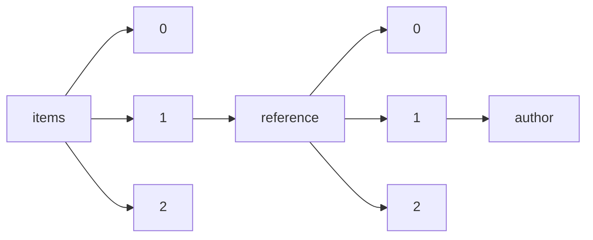

!!! warning "This document is not official Crossref documentation"
# Author
PATH = items/array/reference/array/author(1)  
Occurs 1 355 303 778 times  
Unique values: > 999  
{ .annotate }

1. A route to an element, for example:  
   The route "items/array/reference/array/author" corresponds to navigating through the JSON indices as  
   ["items"][0]["reference"][0]["author"]  

!!! note "Due to current limitations, only the first 1,000 unique values are counted."

| **Row** | **Value** `String`                      | **Count** `Int64` |
|--------:|-------------------------------------------:|---------------------:|
| **1**   | Wang                                       | 6 761 476            |
| **2**   | Li                                         | 5 340 242            |
| **3**   | Zhang                                      | 5 278 195            |
| **4**   | Chen                                       | 4 260 040            |
| **5**   | Liu                                        | 4 200 714            |
| **6**   |                                            | 2 963 523            |
| **7**   | Lee                                        | 2 850 617            |
| **8**   | Kim                                        | 2 339 475            |
| **9**   | Yang                                       | 2 289 685            |
| **10**  | Wu                                         | 1 798 554            |
| **11**  | Smith                                      | 1 510 198            |
| **12**  | Huang                                      | 1 437 801            |
| **13**  | Xu                                         | 1 369 643            |
| **14**  | Zhao                                       | 1 221 216            |
| **15**  | Zhou                                       | 1 090 239            |
| **16**  | Sun                                        | 957 143              |
| **17**  | Lin                                        | 952 341              |
| **18**  | Yu                                         | 883 680              |
| **19**  | Brown                                      | 839 440              |
| **20**  | Zhu                                        | 800 555              |
| **21**  | Johnson                                    | 707 781              |
| **22**  | Miller                                     | 678 751              |
| **23**  | Park                                       | 660 991              |
| **24**  | Hu                                         | 654 653              |
| **25**  | Jones                                      | 651 938              |
| **26**  | Lu                                         | 640 472              |
| **27**  | Anderson                                   | 612 995              |
| **28**  | Ma                                         | 579 682              |
| **29**  | Williams                                   | 559 567              |
| **30**  | Jiang                                      | 551 183              |
| **31**  | Guo                                        | 547 387              |
| **32**  | He                                         | 518 309              |
| **33**  | Chang                                      | 497 053              |
| **34**  | Gao                                        | 488 033              |
| **35**  | Singh                                      | 450 292              |
| **36**  | Cheng                                      | 439 885              |
| **37**  | Kumar                                      | 419 258              |
| **38**  | Taylor                                     | 415 861              |
| **39**  | Wilson                                     | 414 533              |
| **40**  | Song                                       | 412 266              |
| **41**  | Martin                                     | 402 280              |
| **42**  | Han                                        | 395 562              |
| **43**  | Cohen                                      | 390 815              |
| **44**  | Tang                                       | 388 357              |
| **45**  | Zheng                                      | 352 220              |
| **46**  | Davis                                      | 348 870              |
| **47**  | Shi                                        | 318 116              |
| **48**  | Thomas                                     | 297 824              |
| **49**  | Thompson                                   | 275 655              |
| **50**  | Choi                                       | 267 529              |
| **51**  | Yan                                        | 267 226              |
| **52**  | Wei                                        | 262 116              |
| **53**  | White                                      | 258 645              |
| **54**  | Shen                                       | 256 946              |
| **55**  | Evans                                      | 254 326              |
| **56**  | Clark                                      | 251 967              |
| **57**  | Luo                                        | 251 157              |
| **58**  | Moore                                      | 241 130              |
| **59**  | Cao                                        | 238 738              |
| **60**  | Xie                                        | 224 535              |
| **61**  | Harris                                     | 222 368              |
| **62**  | Liang                                      | 219 094              |
| **63**  | Hall                                       | 217 787              |
| **64**  | Feng                                       | 216 486              |
| **65**  | Lewis                                      | 204 889              |
| **66**  | Fan                                        | 203 472              |
| **67**  | Allen                                      | 202 924              |
| **68**  | Young                                      | 201 425              |
| **69**  | Green                                      | 200 635              |
| **70**  | Dong                                       | 200 395              |
| **71**  | Tan                                        | 195 611              |
| **72**  | Gupta                                      | 191 800              |
| **73**  | Peng                                       | 187 473              |
| **74**  | Sharma                                     | 186 927              |
| **75**  | Yuan                                       | 185 790              |
| **76**  | Kang                                       | 185 292              |
| **77**  | Chan                                       | 181 076              |
| **78**  | Wong                                       | 180 954              |
| **79**  | Baker                                      | 179 556              |
| **80**  | Jin                                        | 172 193              |
| **81**  | Campbell                                   | 170 562              |
| **82**  | Robinson                                   | 170 043              |
| **83**  | Roberts                                    | 166 187              |
| **84**  | Xiao                                       | 165 357              |
| **85**  | Fu                                         | 165 289              |
| **86**  | Scott                                      | 161 515              |
| **87**  | Schmidt                                    | 160 632              |
| **88**  | Ding                                       | 159 323              |
| **89**  | Adams                                      | 157 090              |
| **90**  | Pan                                        | 156 992              |
| **91**  | King                                       | 156 464              |
| **92**  | Jackson                                    | 155 815              |
| **93**  | Hill                                       | 154 597              |
| **94**  | Davies                                     | 150 765              |
| **95**  | Walker                                     | 149 772              |
| **96**  | Khan                                       | 149 235              |
| **97**  | Nelson                                     | 149 064              |
| **98**  | Wright                                     | 146 259              |
| **99**  | Deng                                       | 136 871              |
| **100** | Du                                         | 136 689              |
| **101** | Cooper                                     | 135 639              |
| **102** | Cai                                        | 133 745              |
| **103** | Fang                                       | 132 760              |
| **104** | Yin                                        | 132 399              |
| **105** | Su                                         | 131 207              |
| **106** | wang                                       | 131 115              |
| **107** | Meyer                                      | 130 316              |
| **108** | Fisher                                     | 129 520              |
| **109** | Tian                                       | 127 780              |
| **110** | Yao                                        | 126 654              |
| **111** | li                                         | 120 279              |
| **112** | Hong                                       | 119 551              |
| **113** | Suzuki                                     | 118 664              |
| **114** | Tanaka                                     | 116 585              |
| **115** | Murphy                                     | 116 309              |
| **116** | Rao                                        | 115 590              |
| **117** | Mitchell                                   | 114 691              |
| **118** | Cho                                        | 114 499              |
| **119** | Nguyen                                     | 112 367              |
| **120** | Weber                                      | 110 175              |
| **121** | Ross                                       | 108 710              |
| **122** | Cui                                        | 108 488              |
| **123** | Wood                                       | 107 677              |
| **124** | Fischer                                    | 107 345              |
| **125** | Phillips                                   | 106 670              |
| **126** | Edwards                                    | 105 761              |
| **127** | Ren                                        | 105 463              |
| **128** | Schneider                                  | 105 124              |
| **129** | Hansen                                     | 105 102              |
| **130** | Morris                                     | 104 338              |
| **131** | Klein                                      | 103 663              |
| **132** | Turner                                     | 103 415              |
| **133** | Lim                                        | 102 686              |
| **134** | Patel                                      | 101 758              |
| **135** | Zeng                                       | 101 431              |
| **136** | Schwartz                                   | 100 859              |
| **137** | Wagner                                     | 100 509              |
| **138** | Ye                                         | 98 519               |
| **139** | Hughes                                     | 98 445               |
| **140** | Xia                                        | 98 120               |
| **141** | Stewart                                    | 97 351               |
| **142** | zhang                                      | 96 603               |
| **143** | Lowry                                      | 96 037               |
| **144** | Collins                                    | 95 917               |
| **145** | Bell                                       | 95 305               |
| **146** | Gu                                         | 93 514               |
| **147** | Chung                                      | 93 034               |
| **148** | Murray                                     | 91 418               |
| **149** | Cox                                        | 89 477               |
| **150** | chen                                       | 88 819               |
| **151** | liu                                        | 88 752               |
| **152** | Kelly                                      | 88 380               |
| **153** | Jensen                                     | 88 309               |
| **154** | Dai                                        | 87 681               |
| **155** | Gordon                                     | 87 631               |
| **156** | Sato                                       | 86 730               |
| **157** | Watson                                     | 84 827               |
| **158** | Becker                                     | 84 589               |
| **159** | Weiss                                      | 83 882               |
| **160** | Morgan                                     | 83 037               |
| **161** | Das                                        | 81 740               |
| **162** | Jung                                       | 80 461               |
| **163** | Takahashi                                  | 79 771               |
| **164** | Ho                                         | 78 364               |
| **165** | Bennett                                    | 78 353               |
| **166** | Cook                                       | 76 453               |
| **167** | Parker                                     | 75 405               |
| **168** | Gray                                       | 75 359               |
| **169** | James                                      | 74 954               |
| **170** | Jia                                        | 74 414               |
| **171** | Harrison                                   | 73 661               |
| **172** | Friedman                                   | 73 518               |
| **173** | Qin                                        | 73 305               |
| **174** | Nakamura                                   | 73 212               |
| **175** | Clarke                                     | 72 969               |
| **176** | Hou                                        | 72 703               |
| **177** | Yamamoto                                   | 72 420               |
| **178** | Meng                                       | 72 302               |
| **179** | Kobayashi                                  | 71 785               |
| **180** | Müller                                     | 71 233               |
| **181** | Fox                                        | 71 147               |
| **182** | Simon                                      | 71 128               |
| **183** | Marshall                                   | 69 624               |
| **184** | Bai                                        | 69 516               |
| **185** | Russell                                    | 69 107               |
| **186** | Kaplan                                     | 68 896               |
| **187** | Chu                                        | 68 820               |
| **188** | World Health Organization                  | 68 670               |
| **189** | Rogers                                     | 67 680               |
| **190** | Graham                                     | 66 603               |
| **191** | Ward                                       | 66 429               |
| **192** | Beck                                       | 66 275               |
| **193** | Peters                                     | 65 255               |
| **194** | Liao                                       | 65 241               |
| **195** | Watanabe                                   | 64 639               |
| **196** | Hsu                                        | 64 398               |
| **197** | Ellis                                      | 63 866               |
| **198** | Ahmed                                      | 63 618               |
| **199** | Shah                                       | 63 544               |
| **200** | Peterson                                   | 63 476               |
| **201** | Ji                                         | 62 934               |
| **202** | Long                                       | 62 509               |
| **203** | Alexander                                  | 61 530               |
| **204** | Lai                                        | 61 527               |
| **205** | Price                                      | 61 087               |
| **206** | Levine                                     | 60 684               |
| **207** | Ali                                        | 60 420               |
| **208** | Berger                                     | 60 247               |
| **209** | Gong                                       | 59 659               |
| **210** | Butler                                     | 59 379               |
| **211** | Carter                                     | 59 300               |
| **212** | Robertson                                  | 58 531               |
| **213** | Wen                                        | 58 487               |
| **214** | Richardson                                 | 58 470               |
| **215** | lee                                        | 58 314               |
| **216** | Katz                                       | 58 281               |
| **217** | Silva                                      | 58 210               |
| **218** | Goldstein                                  | 57 953               |
| **219** | Shaw                                       | 57 334               |
| **220** | Levy                                       | 57 153               |
| **221** | Hamilton                                   | 56 979               |
| **222** | Ito                                        | 56 545               |
| **223** | Qiu                                        | 56 354               |
| **224** | Zhong                                      | 56 222               |
| **225** | Rose                                       | 55 307               |
| **226** | Xue                                        | 55 255               |
| **227** | Stein                                      | 55 097               |
| **228** | Roy                                        | 54 631               |
| **229** | Zou                                        | 54 188               |
| **230** | Kennedy                                    | 53 911               |
| **231** | Gibson                                     | 53 264               |
| **232** | Hwang                                      | 52 648               |
| **233** | Shin                                       | 51 872               |
| **234** | Vgl                                        | 51 834               |
| **235** | Tsai                                       | 51 549               |
| **236** | Nielsen                                    | 50 987               |
| **237** | Goldberg                                   | 49 998               |
| **238** | Wolf                                       | 49 787               |
| **239** | Bailey                                     | 49 687               |
| **240** | Davidson                                   | 49 593               |
| **241** | Reddy                                      | 49 405               |
| **242** | Kato                                       | 49 078               |
| **243** | Johnston                                   | 49 049               |
| **244** | Xiong                                      | 48 399               |
| **245** | Jain                                       | 48 390               |
| **246** | Qi                                         | 48 170               |
| **247** | Y Wang                                     | 48 114               |
| **248** | Hoffman                                    | 47 993               |
| **249** | Gross                                      | 47 910               |
| **250** | Stone                                      | 46 753               |
| **251** | Black                                      | 46 323               |
| **252** | Andersen                                   | 46 302               |
| **253** | Kong                                       | 46 243               |
| **254** | Freeman                                    | 46 030               |
| **255** | Barnes                                     | 46 014               |
| **256** | Armstrong                                  | 45 955               |
| **257** | Laemmli                                    | 45 678               |
| **258** | Qian                                       | 45 601               |
| **259** | Frank                                      | 45 513               |
| **260** | Reynolds                                   | 44 955               |
| **261** | Walsh                                      | 44 794               |
| **262** | Simpson                                    | 44 301               |
| **263** | Cole                                       | 43 948               |
| **264** | Chapman                                    | 43 942               |
| **265** | Ghosh                                      | 43 043               |
| **266** | Y Zhang                                    | 43 003               |
| **267** | Palmer                                     | 42 564               |
| **268** | Jacobs                                     | 42 461               |
| **269** | Yamada                                     | 41 978               |
| **270** | Lang                                       | 41 914               |
| **271** | Newman                                     | 41 741               |
| **272** | Andrews                                    | 41 494               |
| **273** | Foster                                     | 41 205               |
| **274** | Myers                                      | 41 187               |
| **275** | Shao                                       | 41 091               |
| **276** | Ryan                                       | 41 076               |
| **277** | Brooks                                     | 41 042               |
| **278** | Porter                                     | 40 958               |
| **279** | Duan                                       | 40 949               |
| **280** | Mason                                      | 40 803               |
| **281** | Bauer                                      | 40 801               |
| **282** | Hunt                                       | 40 501               |
| **283** | Hunter                                     | 40 484               |
| **284** | Wan                                        | 39 895               |
| **285** | Stevens                                    | 39 823               |
| **286** | Henderson                                  | 39 686               |
| **287** | Mao                                        | 39 460               |
| **288** | \_\_\_\_\_                                 | 39 283               |
| **289** | Keller                                     | 39 266               |
| **290** | Richards                                   | 38 956               |
| **291** | Goodman                                    | 38 858               |
| **292** | Arnold                                     | 38 819               |
| **293** | Tao                                        | 38 366               |
| **294** | Reid                                       | 37 755               |
| **295** | Oh                                         | 37 645               |
| **296** | Muller                                     | 37 605               |
| **297** | Paul                                       | 37 602               |
| **298** | Ng                                         | 36 946               |
| **299** | Yoon                                       | 36 752               |
| **300** | yang                                       | 36 745               |
| **301** | Shapiro                                    | 36 644               |
| **302** | West                                       | 36 485               |
| **303** | Christensen                                | 36 365               |
| **304** | Yoshida                                    | 36 279               |
| **305** | Harvey                                     | 36 115               |
| **306** | Grant                                      | 36 115               |
| **307** | Mayer                                      | 36 052               |
| **308** | kim                                        | 35 935               |
| **309** | Siegel                                     | 35 881               |
| **310** | Reed                                       | 35 839               |
| **311** | Powell                                     | 35 310               |
| **312** | Saito                                      | 35 236               |
| **313** | Perry                                      | 35 043               |
| **314** | wu                                         | 34 909               |
| **315** | Coleman                                    | 34 798               |
| **316** | Wallace                                    | 34 529               |
| **317** | Gilbert                                    | 34 507               |
| **318** | Gardner                                    | 34 177               |
| **319** | Roth                                       | 33 920               |
| **320** | Pearson                                    | 33 804               |
| **321** | Costa                                      | 33 743               |
| **322** | Hao                                        | 33 692               |
| **323** | McDonald                                   | 33 629               |
| **324** | Kimura                                     | 33 495               |
| **325** | Holmes                                     | 33 406               |
| **326** | Sullivan                                   | 33 053               |
| **327** | Ahmad                                      | 32 932               |
| **328** | Rosen                                      | 32 817               |
| **329** | Id                                         | 32 817               |
| **330** | Hart                                       | 32 502               |
| **331** | Howard                                     | 32 336               |
| **332** | Bradley                                    | 31 555               |
| **333** | Hoffmann                                   | 31 044               |
| **334** | Y Li                                       | 31 026               |
| **335** | Lei                                        | 30 981               |
| **336** | Rubin                                      | 30 879               |
| **337** | Dixon                                      | 30 704               |
| **338** | Inoue                                      | 30 689               |
| **339** | Rice                                       | 30 530               |
| **340** | Morrison                                   | 30 405               |
| **341** | Santos                                     | 30 327               |
| **342** | Rosenberg                                  | 30 200               |
| **343** | Koch                                       | 30 017               |
| **344** | Tong                                       | 29 881               |
| **345** | Epstein                                    | 29 775               |
| **346** | Mann                                       | 29 733               |
| **347** | Lv                                         | 29 309               |
| **348** | Hayes                                      | 29 127               |
| **349** | Burke                                      | 28 930               |
| **350** | George                                     | 28 742               |
| **351** | Bradford                                   | 28 670               |
| **352** | Hayashi                                    | 28 669               |
| **353** | Garcia                                     | 28 642               |
| **354** | lin                                        | 28 340               |
| **355** | Ferguson                                   | 28 049               |
| **356** | Warren                                     | 27 830               |
| **357** | Snyder                                     | 27 762               |
| **358** | Boyd                                       | 27 757               |
| **359** | J Wang                                     | 27 517               |
| **360** | Jenkins                                    | 27 394               |
| **361** | Ge                                         | 27 339               |
| **362** | Barker                                     | 27 058               |
| **363** | Olson                                      | 26 977               |
| **364** | Yi                                         | 26 891               |
| **365** | Matthews                                   | 26 803               |
| **366** | Dunn                                       | 26 778               |
| **367** | Y Liu                                      | 26 757               |
| **368** | Andersson                                  | 26 708               |
| **369** | Levin                                      | 26 282               |
| **370** | Wells                                      | 26 236               |
| **371** | An                                         | 26 052               |
| **372** | Berg                                       | 25 884               |
| **373** | Stern                                      | 25 870               |
| **374** | Mills                                      | 25 700               |
| **375** | Elliott                                    | 25 638               |
| **376** | Gill                                       | 25 325               |
| **377** | Chou                                       | 25 187               |
| **378** | Singer                                     | 25 154               |
| **379** | Berry                                      | 25 032               |
| **380** | Qu                                         | 24 825               |
| **381** | Henry                                      | 24 800               |
| **382** | Mori                                       | 24 647               |
| **383** | Webb                                       | 24 629               |
| **384** | Higgins                                    | 24 590               |
| **385** | Ford                                       | 24 259               |
| **386** | Duncan                                     | 24 257               |
| **387** | Lawrence                                   | 23 994               |
| **388** | Matsumoto                                  | 23 927               |
| **389** | Guan                                       | 23 734               |
| **390** | Kwon                                       | 23 706               |
| **391** | Carlson                                    | 23 595               |
| **392** | Lynch                                      | 23 525               |
| **393** | Braun                                      | 23 420               |
| **394** | Patterson                                  | 23 094               |
| **395** | Jeong                                      | 23 091               |
| **396** | Bishop                                     | 23 039               |
| **397** | For                                        | 23 016               |
| **398** | Kramer                                     | 22 871               |
| **399** | Cameron                                    | 22 856               |
| **400** | Jang                                       | 22 830               |
| **401** | X Wang                                     | 22 719               |
| **402** | Dawson                                     | 22 664               |
| **403** | Mishra                                     | 22 462               |
| **404** | Niu                                        | 22 229               |
| **405** | Lam                                        | 22 130               |
| **406** | xu                                         | 21 974               |
| **407** | Jordan                                     | 21 885               |
| **408** | Wilkinson                                  | 21 816               |
| **409** | Holland                                    | 21 793               |
| **410** | huang                                      | 21 743               |
| **411** | Barrett                                    | 21 715               |
| **412** | Feldman                                    | 21 490               |
| **413** | Bao                                        | 21 398               |
| **414** | Carroll                                    | 21 373               |
| **415** | Atkinson                                   | 21 315               |
| **416** | Craig                                      | 21 286               |
| **417** | Ray                                        | 21 152               |
| **418** | Bates                                      | 21 102               |
| **419** | American Psychiatric Association           | 21 055               |
| **420** | Burns                                      | 21 025               |
| **421** | Petersen                                   | 21 005               |
| **422** | Bernstein                                  | 20 903               |
| **423** | J Li                                       | 20 860               |
| **424** | WHO                                        | 20 640               |
| **425** | Fletcher                                   | 20 617               |
| **426** | Williamson                                 | 20 532               |
| **427** | Burton                                     | 20 391               |
| **428** | McCarthy                                   | 20 359               |
| **429** | Leung                                      | 20 192               |
| **430** | Sheldrick                                  | 20 133               |
| **431** | Spencer                                    | 19 999               |
| **432** | J Zhang                                    | 19 890               |
| **433** | Vogel                                      | 19 664               |
| **434** | Foucault                                   | 19 531               |
| **435** | Carpenter                                  | 19 470               |
| **436** | Greene                                     | 18 892               |
| **437** | Xiang                                      | 18 654               |
| **438** | Larsen                                     | 18 652               |
| **439** | Rodriguez                                  | 18 523               |
| **440** | Day                                        | 18 415               |
| **441** | Pereira                                    | 18 307               |
| **442** | Ahn                                        | 18 304               |
| **443** | Fraser                                     | 18 273               |
| **444** | Kuo                                        | 18 271               |
| **445** | Yamaguchi                                  | 18 259               |
| **446** | Ferreira                                   | 18 243               |
| **447** | X Li                                       | 18 082               |
| **448** | Crawford                                   | 18 073               |
| **449** | Jacobson                                   | 18 064               |
| **450** | Lane                                       | 18 048               |
| **451** | Xing                                       | 18 000               |
| **452** | Huber                                      | 17 900               |
| **453** | Kaufman                                    | 17 885               |
| **454** | Kuhn                                       | 17 577               |
| **455** | Agarwal                                    | 17 565               |
| **456** | Banerjee                                   | 17 479               |
| **457** | Solomon                                    | 17 454               |
| **458** | David                                      | 17 356               |
| **459** | Oliveira                                   | 17 108               |
| **460** | Lau                                        | 17 056               |
| **461** | Goldman                                    | 16 830               |
| **462** | Mueller                                    | 16 814               |
| **463** | Schultz                                    | 16 701               |
| **464** | Douglas                                    | 16 691               |
| **465** | Rahman                                     | 16 362               |
| **466** | Thomson                                    | 16 350               |
| **467** | Cheung                                     | 16 311               |
| **468** | Sanders                                    | 16 297               |
| **469** | yu                                         | 16 009               |
| **470** | X Zhang                                    | 15 964               |
| **471** | Baldwin                                    | 15 963               |
| **472** | Greenberg                                  | 15 757               |
| **473** | Rossi                                      | 15 751               |
| **474** | Griffiths                                  | 15 570               |
| **475** | zhou                                       | 15 544               |
| **476** | Srivastava                                 | 15 490               |
| **477** | Larson                                     | 15 412               |
| **478** | Richter                                    | 15 189               |
| **479** | Schwarz                                    | 15 183               |
| **480** | Nilsson                                    | 15 153               |
| **481** | Martinez                                   | 15 020               |
| **482** | Fowler                                     | 15 009               |
| **483** | Dean                                       | 14 959               |
| **484** | Department of Health                       | 14 877               |
| **485** | Hahn                                       | 14 859               |
| **486** | Shimizu                                    | 14 828               |
| **487** | Ni                                         | 14 685               |
| **488** | Knight                                     | 14 653               |
| **489** | Walter                                     | 14 638               |
| **490** | Owen                                       | 14 628               |
| **491** | Carr                                       | 14 612               |
| **492** | Chow                                       | 14 581               |
| **493** | Sasaki                                     | 14 556               |
| **494** | Cunningham                                 | 14 529               |
| **495** | Olsen                                      | 14 480               |
| **496** | Webster                                    | 14 439               |
| **497** | O'Brien                                    | 14 413               |
| **498** | Griffin                                    | 14 238               |
| **499** | Gonzalez                                   | 14 222               |
| **500** | Abraham                                    | 14 162               |
| **501** | Barton                                     | 14 032               |
| **502** | Sen                                        | 14 023               |
| **503** | Lucas                                      | 14 023               |
| **504** | Pang                                       | 14 011               |
| **505** | H Li                                       | 14 008               |
| **506** | Lambert                                    | 14 004               |
| **507** | May                                        | 13 969               |
| **508** | Johansson                                  | 13 875               |
| **509** | Moon                                       | 13 769               |
| **510** | R Core Team                                | 13 735               |
| **511** | Werner                                     | 13 733               |
| **512** | Oliver                                     | 13 655               |
| **513** | Gould                                      | 13 654               |
| **514** | Ball                                       | 13 537               |
| **515** | Yoo                                        | 13 303               |
| **516** | Seo                                        | 13 130               |
| **517** | Hashimoto                                  | 13 107               |
| **518** | Hofmann                                    | 12 881               |
| **519** | Hess                                       | 12 875               |
| **520** | Yeh                                        | 12 849               |
| **521** | Schulz                                     | 12 781               |
| **522** | L Wang                                     | 12 565               |
| **523** | Adler                                      | 12 551               |
| **524** | Mehta                                      | 12 516               |
| **525** | Ziegler                                    | 12 493               |
| **526** | Lo                                         | 12 491               |
| **527** | Page                                       | 12 469               |
| **528** | Hanson                                     | 12 165               |
| **529** | Lloyd                                      | 12 119               |
| **530** | You                                        | 12 068               |
| **531** | Tran                                       | 11 882               |
| **532** | Hardy                                      | 11 783               |
| **533** | Abe                                        | 11 737               |
| **534** | Zimmerman                                  | 11 723               |
| **535** | Hirsch                                     | 11 707               |
| **536** | Verma                                      | 11 689               |
| **537** | Ko                                         | 11 631               |
| **538** | OECD                                       | 11 565               |
| **539** | Hudson                                     | 11 558               |
| **540** | Marsh                                      | 11 402               |
| **541** | Parsons                                    | 11 365               |
| **542** | Prasad                                     | 11 336               |
| **543** | Kessler                                    | 11 286               |
| **544** | J Liu                                      | 11 279               |
| **545** | Pedersen                                   | 11 251               |
| **546** | Curtis                                     | 11 242               |
| **547** | H Wang                                     | 11 157               |
| **548** | Y Chen                                     | 11 115               |
| **549** | L Zhang                                    | 10 965               |
| **550** | Fleming                                    | 10 919               |
| **551** | Ikeda                                      | 10 644               |
| **552** | Benson                                     | 10 618               |
| **553** | Bird                                       | 10 604               |
| **554** | zhao                                       | 10 549               |
| **555** | Yue                                        | 10 508               |
| **556** | Vincent                                    | 10 495               |
| **557** | Fujita                                     | 10 489               |
| **558** | Sanger                                     | 10 487               |
| **559** | Sambrook                                   | 10 333               |
| **560** | Field                                      | 10 329               |
| **561** | Doyle                                      | 10 325               |
| **562** | Marcus                                     | 10 315               |
| **563** | Moss                                       | 10 276               |
| **564** | Bartlett                                   | 10 240               |
| **565** | Maniatis                                   | 10 106               |
| **566** | Wolff                                      | 10 084               |
| **567** | Z Wang                                     | 9 991                |
| **568** | Kay                                        | 9 851                |
| **569** | Fuchs                                      | 9 843                |
| **570** | Miao                                       | 9 773                |
| **571** | Qiao                                       | 9 767                |
| **572** | sun                                        | 9 735                |
| **573** | E G See                                    | 9 727                |
| **574** | Landau                                     | 9 665                |
| **575** | Nie                                        | 9 662                |
| **576** | Marks                                      | 9 658                |
| **577** | Engel                                      | 9 658                |
| **578** | Weinberg                                   | 9 646                |
| **579** | Rasmussen                                  | 9 639                |
| **580** | Little                                     | 9 603                |
| **581** | Yadav                                      | 9 465                |
| **582** | Bernard                                    | 9 434                |
| **583** | Hsieh                                      | 9 429                |
| **584** | Joshi                                      | 9 348                |
| **585** | Skinner                                    | 9 337                |
| **586** | smith                                      | 9 334                |
| **587** | Gregory                                    | 9 290                |
| **588** | zhu                                        | 9 282                |
| **589** | Schmid                                     | 9 276                |
| **590** | Pandey                                     | 9 274                |
| **591** | Neumann                                    | 9 262                |
| **592** | MacDonald                                  | 9 217                |
| **593** | Tucker                                     | 8 952                |
| **594** | Bloom                                      | 8 900                |
| **595** | Woods                                      | 8 863                |
| **596** | Chao                                       | 8 789                |
| **597** | Hassan                                     | 8 776                |
| **598** | Tamura                                     | 8 717                |
| **599** | Freud S.                                   | 8 712                |
| **600** | Bourdieu                                   | 8 634                |
| **601** | Ling                                       | 8 628                |
| **602** | Montgomery                                 | 8 583                |
| **603** | Payne                                      | 8 579                |
| **604** | Jiao                                       | 8 566                |
| **605** | Harper                                     | 8 561                |
| **606** | Wolfe                                      | 8 557                |
| **607** | Goodwin                                    | 8 517                |
| **608** | X Liu                                      | 8 514                |
| **609** | Chambers                                   | 8 507                |
| **610** | Morton                                     | 8 456                |
| **611** | Shannon                                    | 8 441                |
| **612** | Lowe                                       | 8 430                |
| **613** | Saunders                                   | 8 398                |
| **614** | Marx                                       | 8 336                |
| **615** | Kahn                                       | 8 334                |
| **616** | Zhai                                       | 8 307                |
| **617** | Cotton                                     | 8 297                |
| **618** | Brenner                                    | 8 165                |
| **619** | Austin                                     | 8 085                |
| **620** | Lowry O. H.                                | 8 066                |
| **621** | Stevenson                                  | 8 058                |
| **622** | Le                                         | 8 046                |
| **623** | H Zhang                                    | 8 000                |
| **624** | Islam                                      | 7 874                |
| **625** | Berman                                     | 7 861                |
| **626** | Rowe                                       | 7 858                |
| **627** | World Bank                                 | 7 853                |
| **628** | Kelley                                     | 7 840                |
| **629** | Okada                                      | 7 826                |
| **630** | Murakami                                   | 7 825                |
| **631** | Benjamin                                   | 7 813                |
| **632** | Chiu                                       | 7 809                |
| **633** | Swanson                                    | 7 783                |
| **634** | Derrida                                    | 7 760                |
| **635** | Fuller                                     | 7 759                |
| **636** | Law                                        | 7 738                |
| **637** | Stephens                                   | 7 716                |
| **638** | Francis                                    | 7 662                |
| **639** | Witten                                     | 7 591                |
| **640** | Kaiser                                     | 7 554                |
| **641** | Sherman                                    | 7 552                |
| **642** | Abbott                                     | 7 526                |
| **643** | Min                                        | 7 482                |
| **644** | Sarkar                                     | 7 438                |
| **645** | Corey                                      | 7 421                |
| **646** | Barber                                     | 7 410                |
| **647** | Sakai                                      | 7 353                |
| **648** | Schmitt                                    | 7 309                |
| **649** | Winter                                     | 7 296                |
| **650** | Kaur                                       | 7 288                |
| **651** | Rosenthal                                  | 7 249                |
| **652** | Diamond                                    | 7 242                |
| **653** | Agrawal                                    | 7 181                |
| **654** | Hopkins                                    | 7 157                |
| **655** | Lehmann                                    | 7 157                |
| **656** | Tu                                         | 7 142                |
| **657** | Chatterjee                                 | 7 129                |
| **658** | Joseph                                     | 7 090                |
| **659** | Smith,                                     | 7 034                |
| **660** | X Chen                                     | 6 994                |
| **661** | John                                       | 6 990                |
| **662** | Wheeler                                    | 6 943                |
| **663** | Ogawa                                      | 6 907                |
| **664** | Banks                                      | 6 741                |
| **665** | Itoh                                       | 6 735                |
| **666** | Bae                                        | 6 712                |
| **667** | Gold                                       | 6 711                |
| **668** | anderson                                   | 6 662                |
| **669** | Centers for Disease Control and Prevention | 6 655                |
| **670** | Grossman                                   | 6 643                |
| **671** | Barnett                                    | 6 636                |
| **672** | Bond                                       | 6 592                |
| **673** | Dubois                                     | 6 589                |
| **674** | Eysenck                                    | 6 580                |
| **675** | Stanley                                    | 6 536                |
| **676** | Maeda                                      | 6 511                |
| **677** | Anonymous                                  | 6 487                |
| **678** | lu                                         | 6 447                |
| **679** | Cohn                                       | 6 409                |
| **680** | Freud                                      | 6 398                |
| **681** | Mukherjee                                  | 6 393                |
| **682** | L. D. Landau                               | 6 389                |
| **683** | The                                        | 6 379                |
| **684** | johnson                                    | 6 319                |
| **685** | Herman                                     | 6 319                |
| **686** | Kerr                                       | 6 312                |
| **687** | hu                                         | 6 300                |
| **688** | Jeon                                       | 6 282                |
| **689** | Okamoto                                    | 6 247                |
| **690** | Steiner                                    | 6 218                |
| **691** | Simmons                                    | 6 204                |
| **692** | P. W. Anderson                             | 6 178                |
| **693** | Geng                                       | 6 170                |
| **694** | kingma                                     | 6 100                |
| **695** | Sutton                                     | 6 067                |
| **696** | Saha                                       | 6 065                |
| **697** | proakis                                    | 6 059                |
| **698** | Sheng                                      | 6 047                |
| **699** | Newton                                     | 6 042                |
| **700** | Zhan                                       | 6 034                |
| **701** | J Chen                                     | 5 971                |
| **702** | Chomsky                                    | 5 881                |
| **703** | Cross                                      | 5 880                |
| **704** | Bray                                       | 5 871                |
| **705** | chang                                      | 5 868                |
| **706** | Ibrahim                                    | 5 854                |
| **707** | Nair                                       | 5 807                |
| **708** | Hussain                                    | 5 796                |
| **709** | Lan                                        | 5 728                |
| **710** | Takeuchi                                   | 5 706                |
| **711** | Mott                                       | 5 672                |
| **712** | he                                         | 5 617                |
| **713** | Lange                                      | 5 596                |
| **714** | Castro                                     | 5 590                |
| **715** | Shang                                      | 5 534                |
| **716** | Gibbs                                      | 5 525                |
| **717** | Jacob                                      | 5 496                |
| **718** | Hartmann                                   | 5 462                |
| **719** | Rodrigues                                  | 5 450                |
| **720** | Weiner                                     | 5 399                |
| **721** | Jaffe                                      | 5 328                |
| **722** | Zienkiewicz                                | 5 310                |
| **723** | Jansen                                     | 5 276                |
| **724** | Hasegawa                                   | 5 237                |
| **725** | Sharp                                      | 5 148                |
| **726** | Snedecor                                   | 5 135                |
| **727** | Lopez                                      | 5 090                |
| **728** | Sinha                                      | 5 026                |
| **729** | Martins                                    | 5 008                |
| **730** | goldberg                                   | 4 935                |
| **731** | Z Zhang                                    | 4 920                |
| **732** | Potter                                     | 4 883                |
| **733** | Perdew                                     | 4 849                |
| **734** | Altman                                     | 4 848                |
| **735** | Brandt                                     | 4 841                |
| **736** | haykin                                     | 4 793                |
| **737** | Bi                                         | 4 776                |
| **738** | Appadurai                                  | 4 723                |
| **739** | Deleuze                                    | 4 704                |
| **740** | Hung                                       | 4 629                |
| **741** | Torres                                     | 4 612                |
| **742** | Daniel                                     | 4 603                |
| **743** | Warner                                     | 4 596                |
| **744** | Hutchinson                                 | 4 576                |
| **745** | Slater                                     | 4 574                |
| **746** | Leonard                                    | 4 454                |
| **747** | Anon                                       | 4 450                |
| **748** | Sutherland                                 | 4 402                |
| **749** | Carvalho                                   | 4 396                |
| **750** | Chiang                                     | 4 390                |
| **751** | Haas                                       | 4 331                |
| **752** | Watts                                      | 4 307                |
| **753** | Nicholson                                  | 4 294                |
| **754** | Herrmann                                   | 4 254                |
| **755** | S. Weinberg                                | 4 240                |
| **756** | Y Yang                                     | 4 237                |
| **757** | Quinn                                      | 4 231                |
| **758** | Gallagher                                  | 4 222                |
| **759** | Kondo                                      | 4 221                |
| **760** | Jameson                                    | 4 202                |
| **761** | Blake                                      | 4 198                |
| **762** | Jing                                       | 4 165                |
| **763** | Barlow                                     | 4 155                |
| **764** | miller                                     | 4 105                |
| **765** | Zuo                                        | 4 097                |
| **766** | Shu                                        | 4 060                |
| **767** | Carlsson                                   | 4 015                |
| **768** | Flory                                      | 3 960                |
| **769** | Bohr                                       | 3 951                |
| **770** | EFSA (European Food Safety Authority)      | 3 950                |
| **771** | Folch                                      | 3 928                |
| **772** | Speert                                     | 3 912                |
| **773** | Hammond                                    | 3 909                |
| **774** | Willis                                     | 3 908                |
| **775** | Hua                                        | 3 907                |
| **776** | Zhuang                                     | 3 832                |
| **777** | Silverman                                  | 3 827                |
| **778** | Bruce                                      | 3 816                |
| **779** | Williams,                                  | 3 779                |
| **780** | Horn                                       | 3 736                |
| **781** | Taylor,                                    | 3 659                |
| **782** | Yun                                        | 3 657                |
| **783** | Mei                                        | 3 656                |
| **784** | French                                     | 3 652                |
| **785** | Fernandez                                  | 3 616                |
| **786** | Fernandes                                  | 3 588                |
| **787** | Clifford                                   | 3 587                |
| **788** | Laemmli U. K.                              | 3 586                |
| **789** | Eriksson                                   | 3 546                |
| **790** | Hay                                        | 3 530                |
| **791** | Miller,                                    | 3 521                |
| **792** | simonyan                                   | 3 518                |
| **793** | Chi                                        | 3 492                |
| **794** | Griffith                                   | 3 488                |
| **795** | Strauss                                    | 3 478                |
| **796** | Adam                                       | 3 471                |
| **797** | Weaver                                     | 3 468                |
| **798** | Lewis,                                     | 3 452                |
| **799** | Ferrari                                    | 3 430                |
| **800** | Cooke                                      | 3 398                |
| **801** | Cohen,                                     | 3 397                |
| **802** | De                                         | 3 397                |
| **803** | Spivak                                     | 3 372                |
| **804** | Holt                                       | 3 361                |
| **805** | Dewar                                      | 3 353                |
| **806** | Anderson,                                  | 3 335                |
| **807** | brown                                      | 3 329                |
| **808** | Brown,                                     | 3 276                |
| **809** | Alvarez                                    | 3 261                |
| **810** | Z Li                                       | 3 244                |
| **811** | Robbins                                    | 3 236                |
| **812** | Krause                                     | 3 149                |
| **813** | Larsson                                    | 3 100                |
| **814** | Almeida                                    | 3 094                |
| **815** | Lund                                       | 3 092                |
| **816** | Patil                                      | 3 090                |
| **817** | Ribeiro                                    | 3 090                |
| **818** | Freedman                                   | 3 087                |
| **819** | Krebs                                      | 3 064                |
| **820** | McKenzie                                   | 3 055                |
| **821** | Steinberg                                  | 3 042                |
| **822** | krizhevsky                                 | 3 035                |
| **823** | Paxinos                                    | 3 033                |
| **824** | Ishikawa                                   | 2 999                |
| **825** | European Commission                        | 2 959                |
| **826** | L Li                                       | 2 958                |
| **827** | Frost                                      | 2 948                |
| **828** | Lamb                                       | 2 916                |
| **829** | Hawkins                                    | 2 910                |
| **830** | Kane                                       | 2 887                |
| **831** | S Wang                                     | 2 871                |
| **832** | Schroeder                                  | 2 845                |
| **833** | Gan                                        | 2 821                |
| **834** | Sung                                       | 2 818                |
| **835** | Booth                                      | 2 808                |
| **836** | Norman                                     | 2 719                |
| **837** | Rees                                       | 2 701                |
| **838** | Gilman                                     | 2 665                |
| **839** | Fodor                                      | 2 663                |
| **840** | Nichols                                    | 2 661                |
| **841** | Dennett                                    | 2 657                |
| **842** | Sanchez                                    | 2 645                |
| **843** | Pearce                                     | 2 645                |
| **844** | Chin                                       | 2 614                |
| **845** | davis                                      | 2 612                |
| **846** | Longo                                      | 2 608                |
| **847** | Block                                      | 2 596                |
| **848** | RW Bussmann                                | 2 586                |
| **849** | M Foucault                                 | 2 581                |
| **850** | Bhabha                                     | 2 563                |
| **851** | Brennan                                    | 2 560                |
| **852** | Wilson,                                    | 2 524                |
| **853** | Zimmermann                                 | 2 522                |
| **854** | Xin                                        | 2 517                |
| **855** | C Wang                                     | 2 515                |
| **856** | Chance                                     | 2 502                |
| **857** | Meier                                      | 2 482                |
| **858** | Fuxe                                       | 2 476                |
| **859** | Said                                       | 2 475                |
| **860** | Towbin                                     | 2 411                |
| **861** | Welch                                      | 2 374                |
| **862** | Van                                        | 2 365                |
| **863** | Burgess                                    | 2 330                |
| **864** | Riley                                      | 2 317                |
| **865** | Segal                                      | 2 313                |
| **866** | Korshak                                    | 2 312                |
| **867** | Ong                                        | 2 311                |
| **868** | Pal                                        | 2 293                |
| **869** | Bowen                                      | 2 258                |
| **870** | Boyer                                      | 2 223                |
| **871** | Pei                                        | 2 216                |
| **872** | Weinstein                                  | 2 211                |
| **873** | Frisch                                     | 2 186                |
| **874** | Jones,                                     | 2 164                |
| **875** | Allison                                    | 2 159                |
| **876** | Adorno                                     | 2 144                |
| **877** | Herzberg                                   | 2 124                |
| **878** | Moore,                                     | 2 120                |
| **879** | Basu                                       | 2 106                |
| **880** | Georgi                                     | 2 068                |
| **881** | Johnson,                                   | 2 060                |
| **882** | van                                        | 2 044                |
| **883** | Lyons                                      | 2 031                |
| **884** | Pierce                                     | 1 979                |
| **885** | jones                                      | 1 978                |
| **886** | Ibid                                       | 1 956                |
| **887** | Kant                                       | 1 891                |
| **888** | Jung C. G.                                 | 1 886                |
| **889** | Putnam,                                    | 1 879                |
| **890** | Comaroff                                   | 1 863                |
| **891** | Watkins                                    | 1 839                |
| **892** | Langer                                     | 1 823                |
| **893** | Ha                                         | 1 820                |
| **894** | Sen,                                       | 1 815                |
| **895** | Shampo                                     | 1 793                |
| **896** | Ernst                                      | 1 788                |
| **897** | Ungerstedt                                 | 1 781                |
| **898** | Young,                                     | 1 765                |
| **899** | Clayton                                    | 1 761                |
| **900** | Takeda                                     | 1 753                |
| **901** | Wright,                                    | 1 736                |
| **902** | Pham                                       | 1 721                |
| **903** | Grob                                       | 1 710                |
| **904** | Barry                                      | 1 671                |
| **905** | Ames                                       | 1 655                |
| **906** | Fig                                        | 1 650                |
| **907** | Friedman,                                  | 1 625                |
| **908** | Campbell,                                  | 1 618                |
| **909** | Moran                                      | 1 576                |
| **910** | Burnham                                    | 1 573                |
| **911** | Martin,                                    | 1 562                |
| **912** | Blum                                       | 1 545                |
| **913** | Hall,                                      | 1 539                |
| **914** | B F Skinner                                | 1 534                |
| **915** | Ruzicka                                    | 1 475                |
| **916** | Callan                                     | 1 450                |
| **917** | W. Kohn                                    | 1 416                |
| **918** | Bandura                                    | 1 413                |
| **919** | Biswas                                     | 1 412                |
| **920** | SAS Institute                              | 1 382                |
| **921** | Buras                                      | 1 380                |
| **922** | Apel                                       | 1 373                |
| **923** | Davidson,                                  | 1 347                |
| **924** | Evans,                                     | 1 345                |
| **925** | Norris                                     | 1 331                |
| **926** | Stark                                      | 1 303                |
| **927** | Greenwood                                  | 1 300                |
| **928** | Daniels                                    | 1 298                |
| **929** | Adams R. P.                                | 1 278                |
| **930** | Russell,                                   | 1 278                |
| **931** | Loe H.                                     | 1 256                |
| **932** | Lundberg                                   | 1 254                |
| **933** | Dickinson                                  | 1 248                |
| **934** | han                                        | 1 246                |
| **935** | Maier                                      | 1 232                |
| **936** | Cooper,                                    | 1 230                |
| **937** | Woo                                        | 1 226                |
| **938** | S Kumar                                    | 1 213                |
| **939** | Hemingway                                  | 1 209                |
| **940** | Chai                                       | 1 202                |
| **941** | Herschel                                   | 1 182                |
| **942** | Meyers                                     | 1 172                |
| **943** | Miles                                      | 1 141                |
| **944** | Nagel,                                     | 1 132                |
| **945** | Lee,                                       | 1 128                |
| **946** | Robert                                     | 1 116                |
| **947** | Jackson,                                   | 1 113                |
| **948** | Thornton                                   | 1 071                |
| **949** | Mill,                                      | 1 066                |
| **950** | Quine,                                     | 1 062                |
| **951** | Kohn                                       | 1 062                |
| **952** | Ross,                                      | 1 016                |
| **953** | de                                         | 1 007                |
| **954** | Macdonald                                  | 988                  |
| **955** | Wittgenstein                               | 988                  |
| **956** | Herrnstein                                 | 983                  |
| **957** | Lenard                                     | 976                  |
| **958** | Baskett                                    | 972                  |
| **959** | Horowitz                                   | 971                  |
| **960** | Figure                                     | 967                  |
| **961** | Briggs                                     | 950                  |
| **962** | Innes                                      | 946                  |
| **963** | Nietzsche                                  | 945                  |
| **964** | Arendt                                     | 940                  |
| **965** | Feinberg                                   | 934                  |
| **966** | Aristotle                                  | 911                  |
| **967** | Williamson,                                | 910                  |
| **968** | Dewey                                      | 903                  |
| **969** | Sue                                        | 902                  |
| **970** | Scott,                                     | 881                  |
| **971** | Moir                                       | 873                  |
| **972** | Karrer                                     | 872                  |
| **973** | Pope                                       | 866                  |
| **974** | harrington                                 | 840                  |
| **975** | Piaget                                     | 836                  |
| **976** | Tsvetkov                                   | 822                  |
| **977** | Olah                                       | 790                  |
| **978** | Rutter M.                                  | 786                  |
| **979** | Rawls,                                     | 778                  |
| **980** | Clark,                                     | 776                  |
| **981** | Davies,                                    | 768                  |
| **982** | Aveling                                    | 765                  |
| **983** | Dziewonski                                 | 755                  |
| **984** | Cass R Sunstein                            | 749                  |
| **985** | Cox,                                       | 737                  |
| **986** | Armstrong,                                 | 730                  |
| **987** | James,                                     | 722                  |
| **988** | Carey                                      | 718                  |
| **989** | Aitken                                     | 715                  |
| **990** | Simon,                                     | 713                  |
| **991** | Bell,                                      | 707                  |
| **992** | Keene                                      | 703                  |
| **993** | White,                                     | 697                  |
| **994** | Heller                                     | 697                  |
| **995** | Super                                      | 665                  |
| **996** | Kant,                                      | 660                  |
| **997** | Thoms                                      | 654                  |
| **998** | Derselbe                                   | 634                  |
| **999** | Nozick,                                    | 630                  |
| ... | ... | ... |

