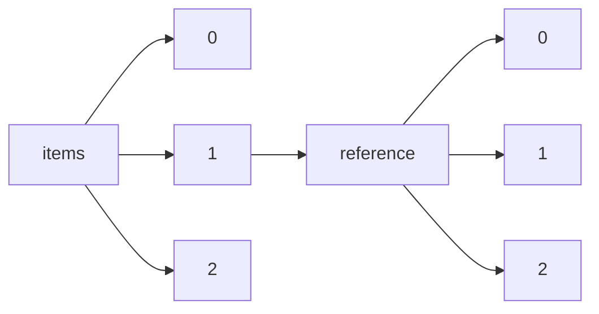

!!! warning "This document is not official Crossref documentation"
# Elements
PATH = items/array/reference/array(1)  
Occurs 2 072 052 239 times  
{ .annotate }

1. A route to an element, for example:  
   The route "items/array/reference/array" corresponds to navigating through the JSON indices as  
   ["items"][0]["reference"][0]  

## DOI
See more information: [items/array/reference/array/DOI](DOI/index.md)  
Occurs 1 481 003 379 timess  
Unique values: > 999  

!!! note "Due to current limitations, only the first 1,000 unique values are counted."

| **Row** | **Value** `String`            | **Count** `Int64` |
|--------:|---------------------------------:|---------------------:|
| **1**   | 10.1016/S0021-9258(19)52451-6    | 117 035              |
| **2**   | 10.1038/227680a0                 | 69 033               |
| **3**   | 10.1016/0003-2697(76)90527-3     | 36 486               |
| **4**   | 10.1103/PhysRevLett.77.3865      | 13 890               |
| **5**   | 10.1006/meth.2001.1262           | 12 254               |
| **6**   | 10.1109/CVPR.2016.90             | 11 506               |
| **7**   | 10.1073/pnas.74.12.5463          | 9 250                |
| **8**   | 10.1191/1478088706qp063oa        | 8 191                |
| **9**   | 10.1107/S0108767307043930        | 7 381                |
| **10**  | 10.1176/appi.books.9780890425596 | 7 171                |
| ... | ... | ... |

## ISBN
See more information: [items/array/reference/array/ISBN](ISBN/index.md)  
Occurs 339 218 timess  
Unique values: > 999  

!!! note "Due to current limitations, only the first 1,000 unique values are counted."

| **Row** | **Value** `String`                     | **Count** `Int64` |
|--------:|------------------------------------------:|---------------------:|
| **1**   | http://id.crossref.org/isbn/3900051070    | 3 700                |
| **2**   | http://id.crossref.org/isbn/9783131143617 | 674                  |
| **3**   | http://id.crossref.org/isbn/0387241450    | 541                  |
| **4**   | http://id.crossref.org/isbn/3950103112    | 431                  |
| **5**   | http://id.crossref.org/isbn/0683011170    | 342                  |
| **6**   | http://id.crossref.org/isbn/0387902449    | 331                  |
| **7**   | http://id.crossref.org/isbn/3906166481    | 280                  |
| **8**   | http://id.crossref.org/isbn/9782724609493 | 265                  |
| **9**   | http://id.crossref.org/isbn/9782130437642 | 261                  |
| **10**  | http://id.crossref.org/isbn/0387950427    | 222                  |
| ... | ... | ... |

## ISSN
See more information: [items/array/reference/array/ISSN](ISSN/index.md)  
Occurs 15 270 700 timess  
Unique values: > 999  

!!! note "Due to current limitations, only the first 1,000 unique values are counted."

| **Row** | **Value** `String`                 | **Count** `Int64` |
|--------:|--------------------------------------:|---------------------:|
| **1**   | http://id.crossref.org/issn/0004-637X | 961 789              |
| **2**   | http://id.crossref.org/issn/1538-3881 | 137 832              |
| **3**   | http://id.crossref.org/issn/0305-4470 | 105 504              |
| **4**   | http://id.crossref.org/issn/0004-6361 | 103 183              |
| **5**   | http://id.crossref.org/issn/0067-0049 | 102 601              |
| **6**   | http://id.crossref.org/issn/0029-5515 | 98 422               |
| **7**   | http://id.crossref.org/issn/0035-8711 | 97 406               |
| **8**   | http://id.crossref.org/issn/0021-8979 | 96 055               |
| **9**   | http://id.crossref.org/issn/0036-8075 | 95 523               |
| **10**  | http://id.crossref.org/issn/0022-3727 | 92 710               |
| ... | ... | ... |

## Article-title
See more information: [items/array/reference/array/article-title](article-title/index.md)  
Occurs 649 288 250 timess  
Unique values: > 999  

!!! note "Due to current limitations, only the first 1,000 unique values are counted."

| **Row** | **Value** `String`                                                                                | **Count** `Int64` |
|--------:|-----------------------------------------------------------------------------------------------------:|---------------------:|
| **1**   | Protein measurement with the Folin phenol reagent                                                    | 20 956               |
| **2**   |                                                                                                      | 20 856               |
| **3**   | Cleavage of structural proteins during the assembly of the head of bacteriophage T4                  | 14 185               |
| **4**   | Introduction                                                                                         | 8 842                |
| **5**   | Proc. Roy                                                                                            | 8 508                |
| **6**   | Adam: A method for stochastic optimization                                                           | 6 415                |
| **7**   | A rapid and sensitive method for the quantitation of microgram quantities of protein utilizing the p | 5 734                |
| **8**   | J. Biol. Chem                                                                                        | 5 680                |
| **9**   | J                                                                                                    | 5 564                |
| **10**  | Very deep convolutional networks for large-scale image recognition                                   | 4 689                |
| ... | ... | ... |

## Author
See more information: [items/array/reference/array/author](author/index.md)  
Occurs 1 355 303 778 timess  
Unique values: > 999  

!!! note "Due to current limitations, only the first 1,000 unique values are counted."

| **Row** | **Value** `String` | **Count** `Int64` |
|--------:|----------------------:|---------------------:|
| **1**   | Wang                  | 6 761 476            |
| **2**   | Li                    | 5 340 242            |
| **3**   | Zhang                 | 5 278 195            |
| **4**   | Chen                  | 4 260 040            |
| **5**   | Liu                   | 4 200 714            |
| **6**   |                       | 2 963 523            |
| **7**   | Lee                   | 2 850 617            |
| **8**   | Kim                   | 2 339 475            |
| **9**   | Yang                  | 2 289 685            |
| **10**  | Wu                    | 1 798 554            |
| ... | ... | ... |

## Component
See more information: [items/array/reference/array/component](component/index.md)  
Occurs 23 420 timess  
Unique values: > 999  

!!! note "Due to current limitations, only the first 1,000 unique values are counted."

| **Row** | **Value** `String` | **Count** `Int64` |
|--------:|----------------------:|---------------------:|
| **1**   | first page 3          | 218                  |
| **2**   | first page 9          | 178                  |
| **3**   | first page 5          | 174                  |
| **4**   | first page 11         | 170                  |
| **5**   | first page 41         | 148                  |
| **6**   | first page 33         | 141                  |
| **7**   | first page 31         | 138                  |
| **8**   | first page 7          | 137                  |
| **9**   | first page 63         | 135                  |
| **10**  | first page 75         | 134                  |
| ... | ... | ... |

## Doi-asserted-by
See more information: [items/array/reference/array/doi-asserted-by](doi-asserted-by/index.md)  
Occurs 1 481 003 379 timess  
Unique values: 2  

| **Row** | **Value** `String` | **Count** `Int64` |
|--------:|----------------------:|---------------------:|
| **1**   | crossref              | 852 486 611          |
| **2**   | publisher             | 628 516 768          |

## Edition
See more information: [items/array/reference/array/edition](edition/index.md)  
Occurs 5 432 546 timess  
Unique values: > 999  

!!! note "Due to current limitations, only the first 1,000 unique values are counted."

| **Row** | **Value** `String` | **Count** `Int64` |
|--------:|----------------------:|---------------------:|
| **1**   | 2                     | 1 826 759            |
| **2**   | 3                     | 825 567              |
| **3**   | 4                     | 472 316              |
| **4**   | 5                     | 280 594              |
| **5**   | 1                     | 259 648              |
| **6**   | 6                     | 170 650              |
| **7**   | 7                     | 125 443              |
| **8**   | 2nd ed.               | 117 514              |
| **9**   | 8                     | 83 935               |
| **10**  | 9                     | 55 153               |
| ... | ... | ... |

## First-page
See more information: [items/array/reference/array/first-page](first-page/index.md)  
Occurs 1 172 779 296 timess  
Unique values: > 999  

!!! note "Due to current limitations, only the first 1,000 unique values are counted."

| **Row** | **Value** `String` | **Count** `Int64` |
|--------:|----------------------:|---------------------:|
| **1**   | 1                     | 29 342 212           |
| **2**   | 3                     | 4 755 541            |
| **3**   | 11                    | 2 868 533            |
| **4**   | 9                     | 2 784 618            |
| **5**   | 5                     | 2 780 058            |
| **6**   | 13                    | 2 743 828            |
| **7**   | 17                    | 2 743 335            |
| **8**   | 15                    | 2 716 749            |
| **9**   | 19                    | 2 716 530            |
| **10**  | 21                    | 2 696 963            |
| ... | ... | ... |

## Isbn-type
See more information: [items/array/reference/array/isbn-type](isbn-type/index.md)  
Occurs 339 218 timess  
Unique values: 2  

| **Row** | **Value** `String` | **Count** `Int64` |
|--------:|----------------------:|---------------------:|
| **1**   | print                 | 339 212              |
| **2**   | electronic            | 6                    |

## Issn-type
See more information: [items/array/reference/array/issn-type](issn-type/index.md)  
Occurs 15 270 700 timess  
Unique values: 2  

| **Row** | **Value** `String` | **Count** `Int64` |
|--------:|----------------------:|---------------------:|
| **1**   | print                 | 15 270 680           |
| **2**   | electronic            | 20                   |

## Issue
See more information: [items/array/reference/array/issue](issue/index.md)  
Occurs 208 516 515 timess  
Unique values: > 999  

!!! note "Due to current limitations, only the first 1,000 unique values are counted."

| **Row** | **Value** `String` | **Count** `Int64` |
|--------:|----------------------:|---------------------:|
| **1**   | 1                     | 34 846 420           |
| **2**   | 2                     | 28 634 902           |
| **3**   | 3                     | 25 594 697           |
| **4**   | 4                     | 21 998 922           |
| **5**   | 5                     | 13 639 348           |
| **6**   | 6                     | 12 899 321           |
| **7**   | 7                     | 6 492 563            |
| **8**   | 8                     | 6 214 077            |
| **9**   | 9                     | 5 613 853            |
| **10**  | 10                    | 5 454 765            |
| ... | ... | ... |

## Journal-title
See more information: [items/array/reference/array/journal-title](journal-title/index.md)  
Occurs 1 174 378 952 timess  
Unique values: > 999  

!!! note "Due to current limitations, only the first 1,000 unique values are counted."

| **Row** | **Value** `String` | **Count** `Int64` |
|--------:|----------------------:|---------------------:|
| **1**   | Nature                | 11 605 747           |
| **2**   | Science               | 10 522 149           |
| **3**   | J. Am. Chem. Soc.     | 6 994 281            |
| **4**   | J. Biol. Chem.        | 5 522 251            |
| **5**   | Lancet                | 4 321 892            |
| **6**   | Phys. Rev. Lett.      | 3 996 108            |
| **7**   | Cell                  | 3 959 997            |
| **8**   | N Engl J Med          | 3 689 190            |
| **9**   | Phys. Rev. B          | 2 874 752            |
| **10**  | Circulation           | 2 769 662            |
| ... | ... | ... |

## Key
See more information: [items/array/reference/array/key](key/index.md)  
Occurs 2 072 052 239 timess  
Unique values: > 999  

!!! note "Due to current limitations, only the first 1,000 unique values are counted."

| **Row** | **Value** `String` | **Count** `Int64` |
|--------:|----------------------:|---------------------:|
| **1**   | ref1                  | 6 934 910            |
| **2**   | ref2                  | 6 691 585            |
| **3**   | ref3                  | 6 603 893            |
| **4**   | ref4                  | 6 446 332            |
| **5**   | ref5                  | 6 293 258            |
| **6**   | ref6                  | 6 083 696            |
| **7**   | ref7                  | 5 887 274            |
| **8**   | ref8                  | 5 660 482            |
| **9**   | ref9                  | 5 445 621            |
| **10**  | ref10                 | 5 214 732            |
| ... | ... | ... |

## Series-title
See more information: [items/array/reference/array/series-title](series-title/index.md)  
Occurs 54 758 423 timess  
Unique values: > 999  

!!! note "Due to current limitations, only the first 1,000 unique values are counted."

| **Row** | **Value** `String`                                                         | **Count** `Int64` |
|--------:|------------------------------------------------------------------------------:|---------------------:|
| **1**   | Lecture Notes in Computer Science                                             | 836 583              |
| **2**   | J Neurosurg                                                                   | 71 904               |
| **3**   | Lect Notes Comput Sci                                                         | 42 236               |
| **4**   | Neurosurgery                                                                  | 38 826               |
| **5**   | Lecture Notes in Artificial Intelligence                                      | 38 367               |
| **6**   | R: A Language and Environment for Statistical Computing                       | 34 436               |
| **7**   | Lecture Notes in Computer Science (Lecture Notes in Artificial Intelligence)  | 26 630               |
| **8**   | LNCS                                                                          | 23 365               |
| **9**   | Molecular Cloning: A Laboratory Manual                                        | 20 352               |
| **10**  | Proceedings of the IEEE Conference on Computer Vision and Pattern Recognition | 19 985               |
| ... | ... | ... |

## Standard-designator
See more information: [items/array/reference/array/standard-designator](standard-designator/index.md)  
Occurs 1 timess  
Unique values: 1  

| **Row** | **Value** `String`                                              | **Count** `Int64` |
|--------:|-------------------------------------------------------------------:|---------------------:|
| **1**   | http://www.everychildmatters.gov.uk/health/teenagepregnancy/about/ | 1                    |

## Standards-body
See more information: [items/array/reference/array/standards-body](standards-body/index.md)  
Occurs 6 timess  
Unique values: 4  

| **Row** | **Value** `String`                                         | **Count** `Int64` |
|--------:|--------------------------------------------------------------:|---------------------:|
| **1**   | International Electrotechnical CommissionIEC                  | 2                    |
| **2**   | International Commission on Radiological ProtectionICRP       | 2                    |
| **3**   | National Electrical Manufacturers AssociationNEMA             | 1                    |
| **4**   | National Council on Radiation Protection and MeasurementsNCRP | 1                    |

## Unstructured
See more information: [items/array/reference/array/unstructured](unstructured/index.md)  
Occurs 550 372 973 timess  
Unique values: > 999  

!!! note "Due to current limitations, strings longer than 1,000 characters are truncated, which may lead to inaccurate calculations."

!!! note "Due to current limitations, only the first 1,000 unique values are counted."

| **Row** | **Value** `String` | **Count** `Int64` |
|--------:|----------------------:|---------------------:|
| **1**   |                       | 748 778              |
| **2**   |                       | 137 319              |
| **3**   | MISSING-VALUE         | 80 798               |
| **4**   | CrossRef              | 9 518                |
| **5**   | Ibid.                 | 9 309                |
| **6**   | Id.                   | 4 006                |
| **7**   | COMMUNICATION         | 3 457                |
| **8**   | In                    | 3 132                |
| **9**   | l. c.                 | 2 617                |
| **10**  | a. a. O.              | 2 239                |
| ... | ... | ... |

## Volume
See more information: [items/array/reference/array/volume](volume/index.md)  
Occurs 1 124 472 759 timess  
Unique values: > 999  

!!! note "Due to current limitations, only the first 1,000 unique values are counted."

| **Row** | **Value** `String` | **Count** `Int64` |
|--------:|----------------------:|---------------------:|
| **1**   | 8                     | 17 481 638           |
| **2**   | 7                     | 17 448 399           |
| **3**   | 6                     | 17 204 777           |
| **4**   | 9                     | 17 162 343           |
| **5**   | 10                    | 16 737 869           |
| **6**   | 5                     | 16 439 503           |
| **7**   | 11                    | 16 013 016           |
| **8**   | 2                     | 15 923 375           |
| **9**   | 4                     | 15 874 391           |
| **10**  | 12                    | 15 601 147           |
| ... | ... | ... |

## Volume-title
See more information: [items/array/reference/array/volume-title](volume-title/index.md)  
Occurs 157 464 555 timess  
Unique values: > 999  

!!! note "Due to current limitations, only the first 1,000 unique values are counted."

| **Row** | **Value** `String`                                   | **Count** `Int64` |
|--------:|--------------------------------------------------------:|---------------------:|
| **1**   |                                                         | 93 628               |
| **2**   | Diagnostic and statistical manual of mental disorders   | 31 330               |
| **3**   | R: A language and environment for statistical computing | 25 668               |
| **4**   | London                                                  | 24 853               |
| **5**   | AIAA Paper                                              | 21 974               |
| **6**   | Statistical power analysis for the behavioral sciences  | 17 374               |
| **7**   | Retrieved                                               | 15 780               |
| **8**   | Berlin                                                  | 15 255               |
| **9**   | R: A Language and Environment for Statistical Computing | 13 856               |
| **10**  | Solid State Physics                                     | 13 349               |
| ... | ... | ... |

## Year
See more information: [items/array/reference/array/year](year/index.md)  
Occurs 1 391 899 471 timess  
Unique values: > 999  

!!! note "Due to current limitations, only the first 1,000 unique values are counted."

| **Row** | **Value** `String` | **Count** `Int64` |
|--------:|----------------------:|---------------------:|
| **1**   | 2010                  | 42 397 327           |
| **2**   | 2009                  | 42 034 493           |
| **3**   | 2011                  | 41 634 619           |
| **4**   | 2008                  | 41 510 977           |
| **5**   | 2007                  | 41 232 560           |
| **6**   | 2012                  | 41 158 526           |
| **7**   | 2006                  | 40 729 654           |
| **8**   | 2013                  | 40 426 730           |
| **9**   | 2005                  | 39 830 091           |
| **10**  | 2014                  | 38 990 180           |
| ... | ... | ... |

