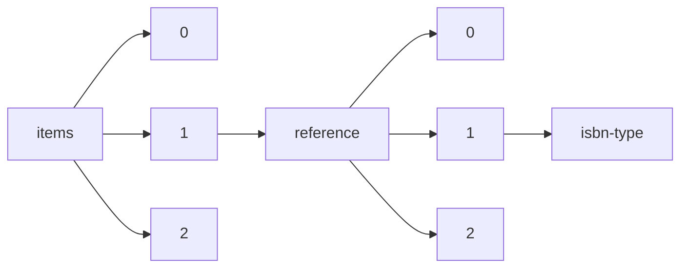

!!! warning "This document is not official Crossref documentation"
# Isbn-type
PATH = items/array/reference/array/isbn-type(1)  
Occurs 339 218 times  
Unique values: 2  
{ .annotate }

1. A route to an element, for example:  
   The route "items/array/reference/array/isbn-type" corresponds to navigating through the JSON indices as  
   ["items"][0]["reference"][0]["isbn-type"]  

| **Row** | **Value** `String` | **Count** `Int64` |
|--------:|----------------------:|---------------------:|
| **1**   | print                 | 339 212              |
| **2**   | electronic            | 6                    |

