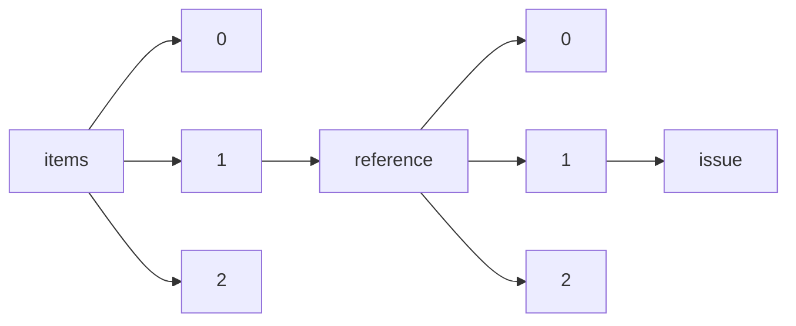

!!! warning "This document is not official Crossref documentation"
# Issue
PATH = items/array/reference/array/issue(1)  
Occurs 208 516 515 times  
Unique values: > 999  
{ .annotate }

1. A route to an element, for example:  
   The route "items/array/reference/array/issue" corresponds to navigating through the JSON indices as  
   ["items"][0]["reference"][0]["issue"]  

!!! note "Due to current limitations, only the first 1,000 unique values are counted."

| **Row** | **Value** `String` | **Count** `Int64` |
|--------:|----------------------:|---------------------:|
| **1**   | 1                     | 34 846 420           |
| **2**   | 2                     | 28 634 902           |
| **3**   | 3                     | 25 594 697           |
| **4**   | 4                     | 21 998 922           |
| **5**   | 5                     | 13 639 348           |
| **6**   | 6                     | 12 899 321           |
| **7**   | 7                     | 6 492 563            |
| **8**   | 8                     | 6 214 077            |
| **9**   | 9                     | 5 613 853            |
| **10**  | 10                    | 5 454 765            |
| **11**  | 11                    | 5 125 927            |
| **12**  | 12                    | 4 979 275            |
| **13**  | 1–2                   | 1 291 600            |
| **14**  | 13                    | 1 022 495            |
| **15**  | 15                    | 919 385              |
| **16**  | 14                    | 909 759              |
| **17**  | 16                    | 844 736              |
| **18**  | 17                    | 794 804              |
| **19**  | 18                    | 783 568              |
| **20**  | 19                    | 727 587              |
| **21**  | 20                    | 705 985              |
| **22**  | 21                    | 700 259              |
| **23**  | 22                    | 664 173              |
| **24**  | 23                    | 663 023              |
| **25**  | 24                    | 654 709              |
| **26**  | Suppl 1               | 584 450              |
| **27**  | 3–4                   | 571 462              |
| **28**  | 1–3                   | 421 493              |
| **29**  | 1-2                   | 409 769              |
| **30**  | 2–3                   | 389 019              |
| **31**  | 25                    | 320 204              |
| **32**  | Suppl. 1              | 313 569              |
| **33**  | 26                    | 290 401              |
| **34**  | Suppl 2               | 260 601              |
| **35**  | 1–4                   | 223 914              |
| **36**  | Suppl                 | 214 703              |
| **37**  | 3-4                   | 187 342              |
| **38**  | 27                    | 185 194              |
| **39**  | 5–6                   | 183 497              |
| **40**  | 30                    | 169 536              |
| **41**  | 01                    | 169 416              |
| **42**  | 28                    | 169 253              |
| **43**  | 31                    | 163 559              |
| **44**  | 29                    | 162 675              |
| **45**  | 33                    | 160 947              |
| **46**  | 34                    | 160 815              |
| **47**  | 32                    | 154 404              |
| **48**  | 36                    | 152 223              |
| **49**  | suppl 1               | 148 961              |
| **50**  | 35                    | 147 861              |
| **51**  | 02                    | 145 461              |
| **52**  | 1/2                   | 143 933              |
| **53**  | 03                    | 137 160              |
| **54**  | Suppl 3               | 132 579              |
| **55**  | 37                    | 128 321              |
| **56**  | Suppl. 2              | 128 283              |
| **57**  | 43                    | 128 251              |
| **58**  | 2-3                   | 128 042              |
| **59**  | 39                    | 128 023              |
| **60**  | 04                    | 127 407              |
| **61**  | 38                    | 127 088              |
| **62**  | 45                    | 126 201              |
| **63**  | 40                    | 125 374              |
| **64**  | 46                    | 123 267              |
| **65**  | No. 1                 | 122 472              |
| **66**  | 41                    | 122 324              |
| **67**  | 7–8                   | 122 216              |
| **68**  | 44                    | 121 503              |
| **69**  | Suppl.                | 118 552              |
| **70**  | 47                    | 118 416              |
| **71**  | suppl                 | 117 863              |
| **72**  | 42                    | 117 517              |
| **73**  | No. 2                 | 116 120              |
| **74**  | 1-3                   | 114 570              |
| **75**  | 48                    | 108 283              |
| **76**  | S1                    | 107 453              |
| **77**  | No. 3                 | 102 013              |
| **78**  | 50                    | 100 708              |
| **79**  | 3/4                   | 100 136              |
| **80**  | 49                    | 98 848               |
| **81**  | 4–5                   | 98 461               |
| **82**  | 0                     | 95 449               |
| **83**  | 05                    | 89 245               |
| **84**  | No. 4                 | 88 462               |
| **85**  | 51                    | 86 114               |
| **86**  | 06                    | 85 510               |
| **87**  | 11–12                 | 82 668               |
| **88**  | Pt 1                  | 81 599               |
| **89**  | 9–10                  | 81 101               |
| **90**  | Pt 2                  | 74 992               |
| **91**  | Suppl 4               | 73 961               |
| **92**  | suppl 2               | 71 264               |
| **93**  | 52                    | 70 311               |
| **94**  | 1-4                   | 68 461               |
| **95**  | D1                    | 62 494               |
| **96**  | Suppl. 3              | 62 479               |
| **97**  | Pt 3                  | 62 365               |
| **98**  | 2/3                   | 60 419               |
| **99**  | 5-6                   | 59 981               |
| **100** | No. 5                 | 57 550               |
| **101** | No. 6                 | 53 288               |
| **102** | (1)                   | 52 197               |
| **103** | 6–7                   | 49 759               |
| **104** | C                     | 46 722               |
| **105** | jou\_issue[1].xmlText | 46 568               |
| **106** | Suppl 5               | 46 489               |
| **107** | 8–9                   | 44 854               |
| **108** | (2)                   | 44 250               |
| **109** | 07                    | 44 035               |
| **110** | 08                    | 42 808               |
| **111** | 5/6                   | 42 207               |
| **112** | 7-8                   | 41 412               |
| **113** | 2–4                   | 40 797               |
| **114** | (3)                   | 40 608               |
| **115** | S2                    | 38 452               |
| **116** | 09                    | 37 880               |
| **117** | May                   | 37 308               |
| **118** | (4)                   | 35 924               |
| **119** | January               | 35 835               |
| **120** | March                 | 35 812               |
| **121** | suppl 3               | 35 775               |
| **122** | Database issue        | 35 714               |
| **123** | Suppl. 4              | 35 470               |
| **124** | no. 1                 | 35 230               |
| **125** | April                 | 34 938               |
| **126** | 1 Suppl               | 34 385               |
| **127** | June                  | 34 074               |
| **128** | no. 2                 | 31 498               |
| **129** | 4-5                   | 31 334               |
| **130** | February              | 31 155               |
| **131** | 4–6                   | 31 033               |
| **132** | July                  | 30 758               |
| **133** | 99                    | 30 705               |
| **134** | Suppl 6               | 30 150               |
| **135** | 7/8                   | 30 088               |
| **136** | 2 Suppl               | 29 624               |
| **137** | 10–11                 | 29 470               |
| **138** | Pt 4                  | 29 319               |
| **139** | 3 Suppl               | 28 893               |
| **140** | A                     | 28 673               |
| **141** | 53                    | 27 451               |
| **142** | 2 Pt 1                | 27 093               |
| **143** | no. 3                 | 26 849               |
| **144** | Supplement C          | 26 401               |
| **145** | September             | 26 258               |
| **146** | October               | 26 013               |
| **147** | 11-12                 | 25 414               |
| **148** | 5 Suppl               | 25 223               |
| **149** | 9-10                  | 25 099               |
| **150** | 3 Pt 1                | 25 089               |
| **151** | August                | 24 987               |
| **152** | 5 Pt 1                | 24 916               |
| **153** | Supplement 1          | 24 587               |
| **154** | Suppl. 5              | 24 080               |
| **155** | 4 Suppl               | 23 956               |
| **156** | Pt 5                  | 23 903               |
| **157** | II                    | 23 573               |
| **158** | 6 Suppl               | 23 530               |
| **159** | 4 Pt 1                | 23 207               |
| **160** | 13–14                 | 23 171               |
| **161** | 56                    | 22 983               |
| **162** | December              | 22 537               |
| **163** | Pt 6                  | 22 342               |
| **164** | B                     | 22 220               |
| **165** | suppl 4               | 22 184               |
| **166** | no. 4                 | 22 161               |
| **167** | 55                    | 22 067               |
| **168** | s1                    | 21 733               |
| **169** | W1                    | 21 640               |
| **170** | January (1)           | 21 569               |
| **171** | November              | 21 353               |
| **172** | Supplement            | 21 299               |
| **173** | (5)                   | 21 230               |
| **174** | 6 Pt 1                | 21 023               |
| **175** | 5–8                   | 20 942               |
| **176** | 54                    | 20 714               |
| **177** | (6)                   | 20 688               |
| **178** | 4/5                   | 20 658               |
| **179** | 3–5                   | 20 555               |
| **180** | No. 7                 | 20 527               |
| **181** | suppl.                | 20 439               |
| **182** | No. 8                 | 20 400               |
| **183** | I                     | 19 940               |
| **184** | suppl. 1              | 19 817               |
| **185** | No. 9                 | 19 564               |
| **186** | 17–18                 | 19 394               |
| **187** | 57                    | 19 213               |
| **188** | 9–12                  | 18 898               |
| **189** | 80                    | 18 856               |
| **190** | No. 10                | 18 798               |
| **191** | 60                    | 18 479               |
| **192** | 58                    | 18 444               |
| **193** | 1 Pt 1                | 18 372               |
| **194** | Suppl 7               | 18 336               |
| **195** | Pt A                  | 18 194               |
| **196** | 15–16                 | 18 053               |
| **197** | 59                    | 17 936               |
| **198** | suppl\_1              | 17 856               |
| **199** | No. 11                | 17 510               |
| **200** | Suppl A               | 17 348               |
| **201** | 61                    | 17 253               |
| **202** | 9/10                  | 17 246               |
| **203** | 11/12                 | 17 071               |
| **204** | B4                    | 16 592               |
| **205** | 62                    | 16 064               |
| **206** | 23–24                 | 15 994               |
| **207** | Pt B                  | 15 972               |
| **208** | Suppl. 6              | 15 880               |
| **209** | No. 12                | 15 856               |
| **210** | 63                    | 15 822               |
| **211** | 65                    | 15 428               |
| **212** | 64                    | 15 036               |
| **213** | 5 Pt 2                | 14 881               |
| **214** | 6-7                   | 14 800               |
| **215** | 71                    | 14 723               |
| **216** | 66                    | 14 659               |
| **217** | Pt 7                  | 14 626               |
| **218** | suppl 5               | 14 621               |
| **219** | B7                    | 14 590               |
| **220** | 69                    | 14 309               |
| **221** | 2015                  | 14 249               |
| **222** | 67                    | 14 168               |
| **223** | B8                    | 14 124               |
| **224** | 3 Pt 2                | 14 112               |
| **225** | 70                    | 14 079               |
| **226** | B12                   | 14 060               |
| **227** | 68                    | 14 048               |
| **228** | Suppl 8               | 14 016               |
| **229** | 2014                  | 13 922               |
| **230** | 1–6                   | 13 915               |
| **231** | B2                    | 13 862               |
| **232** | Pt 12                 | 13 796               |
| **233** | 2016                  | 13 757               |
| **234** | 2017                  | 13 724               |
| **235** | Pt 8                  | 13 581               |
| **236** | 73                    | 13 517               |
| **237** | Pt 9                  | 13 442               |
| **238** | Pt 11                 | 13 426               |
| **239** | 19–20                 | 13 378               |
| **240** | sup1                  | 13 350               |
| **241** | 72                    | 13 275               |
| **242** | 7414                  | 13 216               |
| **243** | 2018                  | 13 117               |
| **244** | 83                    | 13 103               |
| **245** | B6                    | 13 026               |
| **246** | Pt 10                 | 12 997               |
| **247** | l                     | 12 987               |
| **248** | 2013                  | 12 898               |
| **249** | 82                    | 12 843               |
| **250** | B5                    | 12 748               |
| **251** | 78                    | 12 726               |
| **252** | 81                    | 12 691               |
| **253** | 8-9                   | 12 681               |
| **254** | 77                    | 12 659               |
| **255** | 14–15                 | 12 626               |
| **256** | No 1                  | 12 618               |
| **257** | February (2)          | 12 436               |
| **258** | B3                    | 12 286               |
| **259** | 2012                  | 12 130               |
| **260** | 85                    | 12 025               |
| **261** | 100                   | 11 994               |
| **262** | 79                    | 11 980               |
| **263** | B10                   | 11 962               |
| **264** | Part A                | 11 845               |
| **265** | 75                    | 11 832               |
| **266** | 74                    | 11 669               |
| **267** | March (3)             | 11 538               |
| **268** | 89                    | 11 514               |
| **269** | 90                    | 11 461               |
| **270** | 97                    | 11 454               |
| **271** | B9                    | 11 378               |
| **272** | 76                    | 11 364               |
| **273** | 21–22                 | 11 260               |
| **274** | 2019                  | 11 234               |
| **275** | 1 Pt 2                | 11 169               |
| **276** | no. 5                 | 11 136               |
| **277** | 2-4                   | 11 080               |
| **278** | B11                   | 11 059               |
| **279** | 96                    | 11 013               |
| **280** | 4 Pt 2                | 10 999               |
| **281** | No 2                  | 10 998               |
| **282** | 2020                  | 10 979               |
| **283** | 98                    | 10 936               |
| **284** | 88                    | 10 854               |
| **285** | 1&2                   | 10 821               |
| **286** | S3                    | 10 771               |
| **287** | B1                    | 10 728               |
| **288** | 86                    | 10 702               |
| **289** | Suppl. 7              | 10 615               |
| **290** | 84                    | 10 590               |
| **291** | 91                    | 10 579               |
| **292** | 92                    | 10 478               |
| **293** | 2011                  | 10 477               |
| **294** | 94                    | 10 458               |
| **295** | April (4)             | 10 405               |
| **296** | 6 Pt 2                | 10 378               |
| **297** | 15\_suppl             | 10 324               |
| **298** | Part 2                | 10 323               |
| **299** | 93                    | 10 316               |
| **300** | May (5)               | 10 243               |
| **301** | Part 1                | 10 175               |
| **302** | 6/7                   | 10 077               |
| **303** | 2 Pt 2                | 10 071               |
| **304** | No 3                  | 9 925                |
| **305** | Suppl. 1              | 9 788                |
| **306** | suppl II              | 9 774                |
| **307** | 1/3                   | 9 726                |
| **308** | 12–13                 | 9 650                |
| **309** | 87                    | 9 635                |
| **310** | no. 6                 | 9 627                |
| **311** | 95                    | 9 579                |
| **312** | Suppl. A              | 9 555                |
| **313** | Suppl I               | 9 546                |
| **314** | 7553                  | 9 538                |
| **315** | 10223                 | 9 534                |
| **316** | June (6)              | 9 433                |
| **317** | Suppl.1               | 9 224                |
| **318** | Spring                | 9 203                |
| **319** | Suppl II              | 9 120                |
| **320** | C5                    | 9 109                |
| **321** | 106                   | 9 017                |
| **322** | C4                    | 8 999                |
| **323** | 2A                    | 8 958                |
| **324** | 2010                  | 8 952                |
| **325** | 10 Suppl              | 8 871                |
| **326** | Suppl1                | 8 775                |
| **327** | 9 Suppl               | 8 766                |
| **328** | Suppl 11              | 8 746                |
| **329** | 7 Suppl               | 8 746                |
| **330** | (8)                   | 8 721                |
| **331** | C3                    | 8 657                |
| **332** | C7                    | 8 652                |
| **333** | 112                   | 8 649                |
| **334** | C12                   | 8 600                |
| **335** | C2                    | 8 477                |
| **336** | No 4                  | 8 362                |
| **337** | 101                   | 8 348                |
| **338** | 1A                    | 8 340                |
| **339** | Suppl 9               | 8 303                |
| **340** | suppl 6               | 8 250                |
| **341** | 105                   | 8 237                |
| **342** | Part B                | 8 158                |
| **343** | (1                    | 8 061                |
| **344** | (7)                   | 8 056                |
| **345** | Suppl 10              | 8 052                |
| **346** | D14                   | 7 900                |
| **347** | C6                    | 7 865                |
| **348** | 2B                    | 7 853                |
| **349** | 104                   | 7 790                |
| **350** | 7109                  | 7 692                |
| **351** | 4-6                   | 7 580                |
| **352** | 102                   | 7 549                |
| **353** | (Suppl 1)             | 7 485                |
| **354** | 1/4                   | 7 468                |
| **355** | A12                   | 7 467                |
| **356** | 8 Suppl               | 7 466                |
| **357** | 117                   | 7 383                |
| **358** | 111                   | 7 377                |
| **359** | (10)                  | 7 349                |
| **360** | Suppl. 8              | 7 314                |
| **361** | D24                   | 7 308                |
| **362** | 103                   | 7 303                |
| **363** | suppl\_2              | 7 161                |
| **364** | Supplement 2          | 7 138                |
| **365** | August (8)            | 7 137                |
| **366** | (9)                   | 7 130                |
| **367** | suppl I               | 7 099                |
| **368** | 125                   | 7 070                |
| **369** | 5A                    | 7 012                |
| **370** | S                     | 7 003                |
| **371** | 4A                    | 6 992                |
| **372** | December (12)         | 6 933                |
| **373** | 107                   | 6 911                |
| **374** | 116                   | 6 897                |
| **375** | C10                   | 6 891                |
| **376** | Suppl. I              | 6 854                |
| **377** | 8/9                   | 6 838                |
| **378** | 110                   | 6 735                |
| **379** | Special Issue         | 6 669                |
| **380** | 10-11                 | 6 642                |
| **381** | July (7)              | 6 591                |
| **382** | suppl. 2              | 6 580                |
| **383** | 3A                    | 6 525                |
| **384** | Suppl. C              | 6 514                |
| **385** | C1                    | 6 507                |
| **386** | September (9)         | 6 406                |
| **387** | 108                   | 6 389                |
| **388** | C8                    | 6 360                |
| **389** | (12)                  | 6 265                |
| **390** | C9                    | 6 240                |
| **391** | 2009                  | 6 226                |
| **392** | November (11)         | 6 226                |
| **393** | 25–26                 | 6 214                |
| **394** | Suppl. II             | 6 112                |
| **395** | s.1–2                 | 6 108                |
| **396** | (11)                  | 6 102                |
| **397** | 115                   | 6 060                |
| **398** | 113                   | 6 057                |
| **399** | D19                   | 6 042                |
| **400** | 11 Suppl              | 6 042                |
| **401** | 109                   | 6 035                |
| **402** | October (10)          | 5 993                |
| **403** | 121                   | 5 972                |
| **404** | 137                   | 5 942                |
| **405** | 6–8                   | 5 937                |
| **406** | A7                    | 5 915                |
| **407** | Summer                | 5 901                |
| **408** | 6B                    | 5 897                |
| **409** | 2 Suppl 1             | 5 829                |
| **410** | 2006                  | 5 815                |
| **411** | D12                   | 5 703                |
| **412** | Fall                  | 5 638                |
| **413** | S4                    | 5 633                |
| **414** | 2021                  | 5 564                |
| **415** | 127                   | 5 417                |
| **416** | A4                    | 5 392                |
| **417** | 7–9                   | 5 372                |
| **418** | 2007                  | 5 345                |
| **419** | 5 Suppl 1             | 5 344                |
| **420** | 9859                  | 5 339                |
| **421** | (2                    | 5 295                |
| **422** | suppl A               | 5 275                |
| **423** | A11                   | 5 237                |
| **424** | A10                   | 5 209                |
| **425** | A8                    | 5 168                |
| **426** | 136                   | 5 165                |
| **427** | 2005                  | 5 163                |
| **428** | A2                    | 5 123                |
| **429** | 120                   | 5 107                |
| **430** | 123                   | 5 103                |
| **431** | 114                   | 5 056                |
| **432** | D23                   | 5 024                |
| **433** | 10–12                 | 4 994                |
| **434** | Web Server issu       | 4 967                |
| **435** | 118                   | 4 865                |
| **436** | A6                    | 4 859                |
| **437** | D21                   | 4 839                |
| **438** | 2008                  | 4 832                |
| **439** | 3-5                   | 4 828                |
| **440** | 9–11                  | 4 812                |
| **441** | (3                    | 4 809                |
| **442** | D22                   | 4 776                |
| **443** | 122                   | 4 718                |
| **444** | A9                    | 4 706                |
| **445** | April (2)             | 4 703                |
| **446** | Suppl. 11             | 4 659                |
| **447** | 6684                  | 4 609                |
| **448** | 5-8                   | 4 536                |
| **449** | III                   | 4 536                |
| **450** | 6A                    | 4 531                |
| **451** | D20                   | 4 524                |
| **452** | Suppl. 9              | 4 513                |
| **453** | 12 Suppl              | 4 506                |
| **454** | 9-12                  | 4 489                |
| **455** | 140                   | 4 482                |
| **456** | Winter                | 4 465                |
| **457** | 157                   | 4 458                |
| **458** | suppl 7               | 4 439                |
| **459** | 151                   | 4 434                |
| **460** | A1                    | 4 431                |
| **461** | D7                    | 4 393                |
| **462** | 5–7                   | 4 392                |
| **463** | 130                   | 4 310                |
| **464** | 124                   | 4 307                |
| **465** | SI                    | 4 293                |
| **466** | (4                    | 4 269                |
| **467** | Suppl III             | 4 247                |
| **468** | 165                   | 4 246                |
| **469** | C11                   | 4 241                |
| **470** | February (1)          | 4 230                |
| **471** | 1–5                   | 4 227                |
| **472** | 129                   | 4 227                |
| **473** | A3                    | 4 218                |
| **474** | Pt. 2                 | 4 211                |
| **475** | 147                   | 4 209                |
| **476** | suppl III             | 4 203                |
| **477** | 128                   | 4 177                |
| **478** | 10229                 | 4 171                |
| **479** | 172                   | 4 167                |
| **480** | 3B                    | 4 145                |
| **481** | 148                   | 4 083                |
| **482** | D3                    | 4 073                |
| **483** | D2                    | 4 071                |
| **484** | 4 Suppl 1             | 4 048                |
| **485** | 119                   | 4 012                |
| **486** | s2                    | 3 993                |
| **487** | 145                   | 3 988                |
| **488** | 2001                  | 3 986                |
| **489** | September (3)         | 3 977                |
| **490** | A5                    | 3 961                |
| **491** | Pt. 1                 | 3 952                |
| **492** | 13-14                 | 3 945                |
| **493** | no. 9                 | 3 944                |
| **494** | 160                   | 3 931                |
| **495** | 200                   | 3 931                |
| **496** | 153                   | 3 913                |
| **497** | D9                    | 3 912                |
| **498** | 4S                    | 3 898                |
| **499** | Web Server issue      | 3 886                |
| **500** | D6                    | 3 885                |
| **501** | 5500                  | 3 874                |
| **502** | supplement 1          | 3 872                |
| **503** | no. 7                 | 3 871                |
| **504** | Suppl. 10             | 3 843                |
| **505** | 141                   | 3 838                |
| **506** | Supl 1                | 3 818                |
| **507** | 2003                  | 3 810                |
| **508** | 167                   | 3 785                |
| **509** | 3&4                   | 3 732                |
| **510** | 126                   | 3 728                |
| **511** | Suppl B               | 3 721                |
| **512** | 1 Suppl 1             | 3 721                |
| **513** | 135                   | 3 720                |
| **514** | 176                   | 3 713                |
| **515** | 154                   | 3 679                |
| **516** | 138                   | 3 669                |
| **517** | part 2                | 3 659                |
| **518** | Supplement\_1         | 3 630                |
| **519** | pt 1                  | 3 622                |
| **520** | July (1)              | 3 598                |
| **521** | no. 10                | 3 578                |
| **522** | D16                   | 3 571                |
| **523** | 1 suppl               | 3 556                |
| **524** | No.1                  | 3 555                |
| **525** | 131                   | 3 523                |
| **526** | S 01                  | 3 523                |
| **527** | December (6)          | 3 513                |
| **528** | D8                    | 3 508                |
| **529** | no. 8                 | 3 444                |
| **530** | suppl 8               | 3 433                |
| **531** | 18–19                 | 3 412                |
| **532** | 155                   | 3 403                |
| **533** | 16–17                 | 3 388                |
| **534** | D13                   | 3 354                |
| **535** | 17-18                 | 3 344                |
| **536** | 190                   | 3 338                |
| **537** | Suppl. 2              | 3 328                |
| **538** | 177                   | 3 314                |
| **539** | 152                   | 3 308                |
| **540** | D17                   | 3 279                |
| **541** | 3 suppl               | 3 260                |
| **542** | 139                   | 3 254                |
| **543** | 1,2                   | 3 225                |
| **544** | August (4)            | 3 223                |
| **545** | Suppl C               | 3 218                |
| **546** | D10                   | 3 210                |
| **547** | No 5                  | 3 194                |
| **548** | 1B                    | 3 136                |
| **549** | No.2                  | 3 132                |
| **550** | 15-16                 | 3 097                |
| **551** | 143                   | 3 074                |
| **552** | No.3                  | 3 070                |
| **553** | 5439                  | 3 057                |
| **554** | D4                    | 3 054                |
| **555** | 2S                    | 3 048                |
| **556** | Suppl. III            | 3 038                |
| **557** | 8–10                  | 3 033                |
| **558** | D5                    | 3 027                |
| **559** | Suppl 12              | 3 007                |
| **560** | D15                   | 2 963                |
| **561** | No 6                  | 2 954                |
| **562** | (S                    | 2 950                |
| **563** | 253                   | 2 924                |
| **564** | 149                   | 2 920                |
| **565** | supplement            | 2 902                |
| **566** | E12                   | 2 889                |
| **567** | 133                   | 2 877                |
| **568** | 301                   | 2 865                |
| **569** | suppl1                | 2 864                |
| **570** | 401                   | 2 857                |
| **571** | Nov                   | 2 843                |
| **572** | 182                   | 2 843                |
| **573** | 197                   | 2 831                |
| **574** | 10159                 | 2 828                |
| **575** | 169                   | 2 782                |
| **576** | No.4                  | 2 772                |
| **577** | 4598                  | 2 767                |
| **578** | Suppl 20              | 2 762                |
| **579** | 1\_suppl              | 2 761                |
| **580** | 162                   | 2 759                |
| **581** | 132                   | 2 755                |
| **582** | 201                   | 2 748                |
| **583** | 193                   | 2 717                |
| **584** | October (4)           | 2 699                |
| **585** | 1S                    | 2 631                |
| **586** | 134                   | 2 607                |
| **587** | 146                   | 2 604                |
| **588** | 228                   | 2 603                |
| **589** | 179                   | 2 601                |
| **590** | 5B                    | 2 600                |
| **591** | 4B                    | 2 600                |
| **592** | 2004                  | 2 591                |
| **593** | 174                   | 2 576                |
| **594** | 170                   | 2 551                |
| **595** | 00                    | 2 546                |
| **596** | no. 11                | 2 527                |
| **597** | suppl. 3              | 2 512                |
| **598** | 2 suppl               | 2 510                |
| **599** | 7540                  | 2 504                |
| **600** | 247                   | 2 503                |
| **601** | 1-6                   | 2 485                |
| **602** | 18S                   | 2 471                |
| **603** | [1]                   | 2 466                |
| **604** | Part 3                | 2 461                |
| **605** | June (3)              | 2 458                |
| **606** | 156                   | 2 451                |
| **607** | 6917                  | 2 438                |
| **608** | no. 12                | 2 407                |
| **609** | 10/11                 | 2 404                |
| **610** | No. 16                | 2 375                |
| **611** | 189                   | 2 369                |
| **612** | Jan                   | 2 366                |
| **613** | 22–23                 | 2 331                |
| **614** | 3–6                   | 2 317                |
| **615** | 8476                  | 2 310                |
| **616** | n. 1                  | 2 308                |
| **617** | IV                    | 2 306                |
| **618** | [2]                   | 2 300                |
| **619** | Suppl. 12             | 2 286                |
| **620** | D11                   | 2 283                |
| **621** | 9838                  | 2 283                |
| **622** | 173                   | 2 276                |
| **623** | 203                   | 2 269                |
| **624** | Suppl2                | 2 260                |
| **625** | E10                   | 2 249                |
| **626** | 7798                  | 2 209                |
| **627** | 219                   | 2 204                |
| **628** | 5696                  | 2 203                |
| **629** | 144                   | 2 201                |
| **630** | 168                   | 2 200                |
| **631** | 11−12                 | 2 170                |
| **632** | suppl 10              | 2 165                |
| **633** | n. 2                  | 2 157                |
| **634** | (5                    | 2 157                |
| **635** | 3 Suppl 1             | 2 155                |
| **636** | 4157                  | 2 117                |
| **637** | Suppl. l              | 2 107                |
| **638** | Suppl. B              | 2 089                |
| **639** | 166                   | 2 079                |
| **640** | suppl IV              | 2 073                |
| **641** | (Suppl 2)             | 2 067                |
| **642** | R1                    | 2 066                |
| **643** | a                     | 2 061                |
| **644** | Suppl 14              | 2 058                |
| **645** | August (2)            | 2 049                |
| **646** | 227                   | 2 045                |
| **647** | 213                   | 2 042                |
| **648** | 5 suppl               | 2 031                |
| **649** | No. 14                | 2 008                |
| **650** | 6 Suppl 1             | 1 990                |
| **651** | March (1)             | 1 990                |
| **652** | No. 13                | 1 961                |
| **653** | 243                   | 1 954                |
| **654** | 196                   | 1 945                |
| **655** | Pt. 3                 | 1 944                |
| **656** | suppl 11              | 1 935                |
| **657** | 5259                  | 1 921                |
| **658** | (6                    | 1 913                |
| **659** | 7418                  | 1 912                |
| **660** | 366                   | 1 904                |
| **661** | 2002                  | 1 903                |
| **662** | D18                   | 1 901                |
| **663** | 194                   | 1 901                |
| **664** | March (2)             | 1 891                |
| **665** | 142                   | 1 886                |
| **666** | E4                    | 1 876                |
| **667** | 372                   | 1 875                |
| **668** | suppl 15              | 1 856                |
| **669** | pt 2                  | 1 843                |
| **670** | 6S                    | 1 836                |
| **671** | [3]                   | 1 826                |
| **672** | 4 Suppl 2             | 1 818                |
| **673** | 1 Suppl.              | 1 817                |
| **674** | June (2)              | 1 817                |
| **675** | 161                   | 1 815                |
| **676** | 235                   | 1 812                |
| **677** | 10224                 | 1 809                |
| **678** | ahead-of-print        | 1 806                |
| **679** | May (3)               | 1 799                |
| **680** | 158                   | 1 784                |
| **681** | 257                   | 1 783                |
| **682** | 9945                  | 1 771                |
| **683** | sup2                  | 1 738                |
| **684** | Issue 1               | 1 721                |
| **685** | [4]                   | 1 699                |
| **686** | 204                   | 1 682                |
| **687** | Suppl. 97             | 1 682                |
| **688** | D                     | 1 681                |
| **689** | 10053                 | 1 681                |
| **690** | 159                   | 1 680                |
| **691** | 15 suppl              | 1 677                |
| **692** | 1?2                   | 1 671                |
| **693** | e1                    | 1 668                |
| **694** | suppl. 4              | 1 656                |
| **695** | January (2)           | 1 630                |
| **696** | no 2                  | 1 617                |
| **697** | suppl 9               | 1 607                |
| **698** | 404                   | 1 592                |
| **699** | no 1                  | 1 582                |
| **700** | October (5)           | 1 574                |
| **701** | 324                   | 1 573                |
| **702** | 150                   | 1 569                |
| **703** | 430                   | 1 566                |
| **704** | 10227                 | 1 551                |
| **705** | 6121                  | 1 544                |
| **706** | 4 Suppl.              | 1 541                |
| **707** | 7121                  | 1 533                |
| **708** | special issue         | 1 526                |
| **709** | Suppl 16              | 1 525                |
| **710** | 215                   | 1 524                |
| **711** | 163                   | 1 515                |
| **712** | 18 suppl              | 1 513                |
| **713** | n.1                   | 1 507                |
| **714** | 249                   | 1 502                |
| **715** | May (2)               | 1 499                |
| **716** | 239                   | 1 499                |
| **717** | Suppl.2               | 1 496                |
| **718** | [Suppl 1]             | 1 480                |
| **719** | 7528                  | 1 468                |
| **720** | SUPPL. 1              | 1 455                |
| **721** | 175                   | 1 447                |
| **722** | 2000                  | 1 446                |
| **723** | Supl 2                | 1 441                |
| **724** | 6230                  | 1 439                |
| **725** | Suppl IV              | 1 434                |
| **726** | 185                   | 1 433                |
| **727** | S5                    | 1 431                |
| **728** | 446                   | 1 430                |
| **729** | c                     | 1 419                |
| **730** | s.1–3                 | 1 417                |
| **731** | 346                   | 1 407                |
| **732** | b                     | 1 401                |
| **733** | 23-24                 | 1 394                |
| **734** | 7441                  | 1 392                |
| **735** | 276                   | 1 387                |
| **736** | 456                   | 1 382                |
| **737** | November (6)          | 1 366                |
| **738** | P                     | 1 366                |
| **739** | s.3–4                 | 1 362                |
| **740** | 4 suppl               | 1 358                |
| **741** | Suppl 15              | 1 358                |
| **742** | 7446                  | 1 336                |
| **743** | n. 3                  | 1 336                |
| **744** | Suppl. 232            | 1 335                |
| **745** | 7571                  | 1 330                |
| **746** | 90001                 | 1 328                |
| **747** | 2&3                   | 1 327                |
| **748** | [5]                   | 1 327                |
| **749** | 5517                  | 1 325                |
| **750** | [6]                   | 1 314                |
| **751** | 303                   | 1 312                |
| **752** | Suppl. 15             | 1 309                |
| **753** | 171                   | 1 307                |
| **754** | 1526                  | 1 291                |
| **755** | No. 15                | 1 290                |
| **756** | 192                   | 1 287                |
| **757** | Mar                   | 1 269                |
| **758** | Issue 3               | 1 268                |
| **759** | 260                   | 1 257                |
| **760** | Pt 19                 | 1 255                |
| **761** | suppl B               | 1 254                |
| **762** | 265                   | 1 245                |
| **763** | 6348                  | 1 240                |
| **764** | suppl2                | 1 239                |
| **765** | no 3                  | 1 237                |
| **766** | 10100                 | 1 233                |
| **767** | suppl\_4              | 1 225                |
| **768** | No. 17                | 1 225                |
| **769** | No 7                  | 1 224                |
| **770** | 6088                  | 1 206                |
| **771** | 10225                 | 1 202                |
| **772** | (Suppl. 1)            | 1 200                |
| **773** | No 9                  | 1 192                |
| **774** | 341                   | 1 179                |
| **775** | 241                   | 1 177                |
| **776** | No 10                 | 1 173                |
| **777** | 15 Suppl              | 1 167                |
| **778** | n.2                   | 1 164                |
| **779** | 183                   | 1 160                |
| **780** | No.5                  | 1 156                |
| **781** | Oct                   | 1 148                |
| **782** | Suppl. 367            | 1 143                |
| **783** | Suppl. C              | 1 138                |
| **784** | 6380                  | 1 134                |
| **785** | 7043                  | 1 125                |
| **786** | 273                   | 1 112                |
| **787** | [12]                  | 1 110                |
| **788** | 244                   | 1 098                |
| **789** | 1)                    | 1 087                |
| **790** | [7]                   | 1 082                |
| **791** | Feb                   | 1 080                |
| **792** | 367                   | 1 079                |
| **793** | [8]                   | 1 077                |
| **794** | No 8                  | 1 070                |
| **795** | 187                   | 1 067                |
| **796** | 191                   | 1 065                |
| **797** | supplement 2          | 1 064                |
| **798** | Complete              | 1 062                |
| **799** | 178                   | 1 056                |
| **800** | 181                   | 1 056                |
| **801** | No. 18                | 1 051                |
| **802** | [10]                  | 1 047                |
| **803** | pii                   | 1 032                |
| **804** | Suppl. 247            | 1 032                |
| **805** | December (4)          | 1 031                |
| **806** | 7650                  | 1 019                |
| **807** | Supp. 1               | 1 016                |
| **808** | 3?4                   | 1 013                |
| **809** | Supl                  | 1 001                |
| **810** | 7587                  | 996                  |
| **811** | 5786                  | 996                  |
| **812** | 7122                  | 993                  |
| **813** | [9]                   | 987                  |
| **814** | 2 Suppl.              | 985                  |
| **815** | 363                   | 980                  |
| **816** | No. 22                | 979                  |
| **817** | 282                   | 974                  |
| **818** | No. 19                | 973                  |
| **819** | No.6                  | 962                  |
| **820** | No. 20                | 952                  |
| **821** | 368                   | 952                  |
| **822** | Suppl\_1              | 944                  |
| **823** | 10228                 | 935                  |
| **824** | Suppl. 20             | 927                  |
| **825** | n. 4                  | 926                  |
| **826** | 6220                  | 920                  |
| **827** | 3 Suppl.              | 919                  |
| **828** | 19-20                 | 917                  |
| **829** | July (4)              | 915                  |
| **830** | 6223                  | 914                  |
| **831** | 297                   | 909                  |
| **832** | Suppl. 14             | 897                  |
| **833** | no 4                  | 889                  |
| **834** | 1997                  | 887                  |
| **835** | E11                   | 884                  |
| **836** | E2                    | 884                  |
| **837** | No. 21                | 883                  |
| **838** | 6 Suppl.              | 877                  |
| **839** | August (3)            | 875                  |
| **840** | Suppl D               | 873                  |
| **841** | No 11                 | 861                  |
| **842** | December 2017         | 858                  |
| **843** | no. 14                | 858                  |
| **844** | 7402                  | 858                  |
| **845** | 10258                 | 857                  |
| **846** | No 12                 | 852                  |
| **847** | Supplement 3          | 842                  |
| **848** | E8                    | 842                  |
| **849** | Suppl. 13             | 839                  |
| **850** | Nr. 1                 | 832                  |
| **851** | 164                   | 819                  |
| **852** | 441                   | 814                  |
| **853** | 7467                  | 806                  |
| **854** | Issue 2               | 806                  |
| **855** | 269                   | 804                  |
| **856** | n.3                   | 803                  |
| **857** | 001                   | 790                  |
| **858** | Nos. 1?2              | 790                  |
| **859** | Suppl. 3              | 787                  |
| **860** | 232                   | 783                  |
| **861** | B13                   | 776                  |
| **862** | Supp 1                | 773                  |
| **863** | i                     | 771                  |
| **864** | Dec                   | 765                  |
| **865** | 15S                   | 761                  |
| **866** | 1999                  | 756                  |
| **867** | 236                   | 756                  |
| **868** | E6                    | 755                  |
| **869** | 195                   | 749                  |
| **870** | 4 pt 1                | 747                  |
| **871** | 1–8                   | 742                  |
| **872** | 2022                  | 741                  |
| **873** | Suppl. 18             | 738                  |
| **874** | July (3)              | 730                  |
| **875** | No. 23                | 724                  |
| **876** | 5 Suppl 2             | 722                  |
| **877** | November (5)          | 722                  |
| **878** | [Suppl]               | 721                  |
| **879** | 6371                  | 717                  |
| **880** | H. 1                  | 716                  |
| **881** | 332                   | 710                  |
| **882** | S 02                  | 706                  |
| **883** | 5 Suppl.              | 700                  |
| **884** | 10017                 | 680                  |
| **885** | (suppl)               | 677                  |
| **886** | 7821                  | 675                  |
| **887** | [11]                  | 675                  |
| **888** | 476                   | 674                  |
| **889** | Issue 4               | 673                  |
| **890** | 1 and 2               | 671                  |
| **891** | 7809                  | 671                  |
| **892** | 5663                  | 668                  |
| **893** | Pt 13                 | 668                  |
| **894** | 186                   | 666                  |
| **895** | 220                   | 664                  |
| **896** | Pt 21                 | 660                  |
| **897** | 6490                  | 654                  |
| **898** | (suppl 1)             | 651                  |
| **899** | 3S                    | 647                  |
| **900** | No. 24                | 639                  |
| **901** | n1                    | 635                  |
| **902** | 1/2/3                 | 632                  |
| **903** | (Suppl.)              | 618                  |
| **904** | 212                   | 618                  |
| **905** | 1985                  | 613                  |
| **906** | 2)                    | 609                  |
| **907** | 7347                  | 606                  |
| **908** | 656                   | 602                  |
| **909** | ii                    | 600                  |
| **910** | n2                    | 581                  |
| **911** | no. 16                | 573                  |
| **912** | 5S                    | 558                  |
| **913** | 428                   | 553                  |
| **914** | No. 1?2               | 549                  |
| **915** | Supl. 1               | 547                  |
| **916** | Nr. 3                 | 538                  |
| **917** | (7                    | 534                  |
| **918** | H. 2                  | 534                  |
| **919** | /2                    | 528                  |
| **920** | 1 & 2                 | 524                  |
| **921** | 287                   | 522                  |
| **922** | Database Issue        | 507                  |
| **923** | 299                   | 506                  |
| **924** | 490                   | 505                  |
| **925** | suppl. 5              | 505                  |
| **926** | Pt 23                 | 504                  |
| **927** | 270                   | 501                  |
| **928** | Pt 16                 | 495                  |
| **929** | 7403                  | 489                  |
| **930** | spe                   | 472                  |
| **931** | Supp                  | 470                  |
| **932** | Aug                   | 458                  |
| **933** | 184                   | 458                  |
| **934** | 224                   | 450                  |
| **935** | 315                   | 446                  |
| **936** | 002                   | 432                  |
| **937** | January 1             | 427                  |
| **938** | Suppl 13              | 414                  |
| **939** | 12 Pt 1               | 414                  |
| **940** | 21-22                 | 410                  |
| **941** | 7610                  | 407                  |
| **942** | 10077                 | 406                  |
| **943** | Nos. 3?4              | 403                  |
| **944** | 003                   | 402                  |
| **945** | Supp.                 | 397                  |
| **946** | 3)                    | 397                  |
| **947** | E5                    | 391                  |
| **948** | 180                   | 391                  |
| **949** | 6086                  | 389                  |
| **950** | No. 26                | 385                  |
| **951** | 005                   | 384                  |
| **952** | February (4)          | 383                  |
| **953** | /1                    | 372                  |
| **954** | Spec No               | 366                  |
| **955** | 403                   | 365                  |
| **956** | December 2018         | 365                  |
| **957** | no. 2                 | 363                  |
| **958** | 1–7                   | 363                  |
| **959** | no. 1                 | 363                  |
| **960** | n3                    | 362                  |
| **961** | 3\_suppl              | 359                  |
| **962** | N≗2                   | 353                  |
| **963** | 288                   | 350                  |
| **964** | November 2017         | 350                  |
| **965** | suppl 2A              | 343                  |
| **966** | 231                   | 341                  |
| **967** | N≗4                   | 341                  |
| **968** | (8                    | 335                  |
| **969** | suppl 4A              | 330                  |
| **970** | n4                    | 319                  |
| **971** | No. 1–2               | 309                  |
| **972** | no.1                  | 303                  |
| **973** | No. 25                | 299                  |
| **974** | October 2017          | 293                  |
| **975** | 188                   | 281                  |
| **976** | 211                   | 270                  |
| **977** | 9890                  | 269                  |
| **978** | /3                    | 261                  |
| **979** | 455                   | 254                  |
| **980** | (9                    | 252                  |
| **981** | suppl.1               | 250                  |
| **982** | suppl 12              | 248                  |
| **983** | H. 3                  | 248                  |
| **984** | [1-2]                 | 247                  |
| **985** | Pt 24                 | 244                  |
| **986** | N≗ 1                  | 233                  |
| **987** | (Suppl)               | 231                  |
| **988** | 6 Suppl 2             | 231                  |
| **989** | Suppl 18              | 218                  |
| **990** | 16 suppl              | 217                  |
| **991** | 5532                  | 215                  |
| **992** | Suppl3                | 197                  |
| **993** | Suppl S1              | 194                  |
| **994** | no. 4                 | 194                  |
| **995** | 221                   | 187                  |
| **996** | Suppl. 23             | 185                  |
| **997** | 421                   | 184                  |
| **998** | N≗ 2                  | 177                  |
| **999** | 7538                  | 155                  |
| ... | ... | ... |

