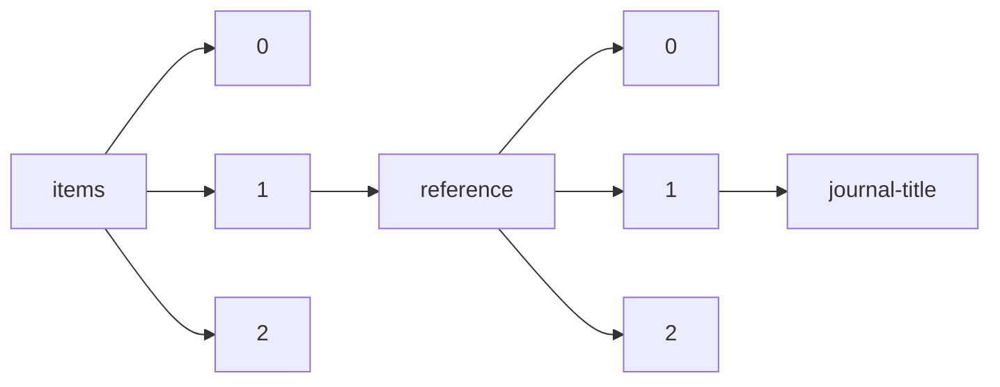

!!! warning "This document is not official Crossref documentation"
# Journal-title
PATH = items/array/reference/array/journal-title(1)  
Occurs 1 174 378 952 times  
Unique values: > 999  
{ .annotate }

1. A route to an element, for example:  
   The route "items/array/reference/array/journal-title" corresponds to navigating through the JSON indices as  
   ["items"][0]["reference"][0]["journal-title"]  

!!! note "Due to current limitations, only the first 1,000 unique values are counted."

| **Row** | **Value** `String`                                                           | **Count** `Int64` |
|--------:|--------------------------------------------------------------------------------:|---------------------:|
| **1**   | Nature                                                                          | 11 605 747           |
| **2**   | Science                                                                         | 10 522 149           |
| **3**   | J. Am. Chem. Soc.                                                               | 6 994 281            |
| **4**   | J. Biol. Chem.                                                                  | 5 522 251            |
| **5**   | Lancet                                                                          | 4 321 892            |
| **6**   | Phys. Rev. Lett.                                                                | 3 996 108            |
| **7**   | Cell                                                                            | 3 959 997            |
| **8**   | N Engl J Med                                                                    | 3 689 190            |
| **9**   | Phys. Rev. B                                                                    | 2 874 752            |
| **10**  | Circulation                                                                     | 2 769 662            |
| **11**  | J. Chem. Phys.                                                                  | 2 669 664            |
| **12**  | PLoS One                                                                        | 2 662 068            |
| **13**  | J Biol Chem                                                                     | 2 608 723            |
| **14**  | Phys. Rev.                                                                      | 2 478 404            |
| **15**  | Blood                                                                           | 2 339 818            |
| **16**  | JAMA                                                                            | 2 008 556            |
| **17**  | Biochemistry                                                                    | 1 989 900            |
| **18**  | Appl. Phys. Lett.                                                               | 1 758 422            |
| **19**  | Proc Natl Acad Sci USA                                                          | 1 660 503            |
| **20**  | J. Geophys. Res.                                                                | 1 480 761            |
| **21**  | J. Appl. Phys.                                                                  | 1 453 020            |
| **22**  | J. Org. Chem.                                                                   | 1 428 933            |
| **23**  | Biochim. Biophys. Acta                                                          | 1 397 641            |
| **24**  | Cancer                                                                          | 1 381 027            |
| **25**  | Chem. Rev.                                                                      | 1 354 467            |
| **26**  | Proc. Natl. Acad. Sci. USA                                                      | 1 352 324            |
| **27**  | Cancer Res                                                                      | 1 291 768            |
| **28**  | Anal. Chem.                                                                     | 1 170 839            |
| **29**  | Chem. Commun.                                                                   | 1 154 655            |
| **30**  | Neurology                                                                       | 1 107 339            |
| **31**  | Gastroenterology                                                                | 1 104 707            |
| **32**  | J Clin Oncol                                                                    | 1 093 961            |
| **33**  | Adv. Mater.                                                                     | 1 077 588            |
| **34**  | Sci. Rep.                                                                       | 1 070 696            |
| **35**  | ApJ                                                                             | 1 062 604            |
| **36**  | Tetrahedron Lett.                                                               | 1 046 119            |
| **37**  | Langmuir                                                                        | 1 035 187            |
| **38**  | J. Phys. Chem.                                                                  | 1 031 411            |
| **39**  | Inorg. Chem.                                                                    | 1 015 283            |
| **40**  | Macromolecules                                                                  | 1 011 762            |
| **41**  | Pediatrics                                                                      | 974 429              |
| **42**  | Nat. Commun.                                                                    | 969 086              |
| **43**  | PLoS ONE                                                                        | 968 563              |
| **44**  | Biochem. J.                                                                     | 934 246              |
| **45**  | J Clin Invest                                                                   | 923 570              |
| **46**  | Proc Natl Acad Sci U S A                                                        | 898 530              |
| **47**  | J Immunol                                                                       | 880 346              |
| **48**  | Radiology                                                                       | 877 806              |
| **49**  | BMJ                                                                             | 871 833              |
| **50**  | Endocrinology                                                                   | 832 031              |
| **51**  | Neuron                                                                          | 788 053              |
| **52**  | Cancer Res.                                                                     | 773 121              |
| **53**  | J. Immunol.                                                                     | 766 814              |
| **54**  | Nucleic Acids Res.                                                              | 751 836              |
| **55**  | J. Mol. Biol.                                                                   | 748 225              |
| **56**  | Angew. Chem., Int. Ed.                                                          | 746 887              |
| **57**  | J. Phys. Chem. B                                                                | 740 639              |
| **58**  | Proc. Natl. Acad. Sci. U. S. A.                                                 | 740 224              |
| **59**  | Biochem. Biophys. Res. Commun.                                                  | 717 170              |
| **60**  | Tetrahedron                                                                     | 707 238              |
| **61**  | J Am Coll Cardiol                                                               | 689 235              |
| **62**  | Environ. Sci. Technol.                                                          | 680 233              |
| **63**  | Brain Res.                                                                      | 676 372              |
| **64**  | Angew. Chem. Int. Ed.                                                           | 659 805              |
| **65**  | Ann Intern Med                                                                  | 655 945              |
| **66**  | Phys. Rev. A                                                                    | 649 845              |
| **67**  | Phys. Rev. D                                                                    | 648 185              |
| **68**  | Nucl. Phys.                                                                     | 634 335              |
| **69**  | Bioinformatics                                                                  | 633 548              |
| **70**  | J. Cell Biol.                                                                   | 630 879              |
| **71**  | Oncogene                                                                        | 629 308              |
| **72**  | J. Neurosci.                                                                    | 615 831              |
| **73**  | ACS Nano                                                                        | 599 849              |
| **74**  | Chest                                                                           | 589 223              |
| **75**  | Chem. Soc. Rev.                                                                 | 587 539              |
| **76**  | EMBO J.                                                                         | 584 612              |
| **77**  | Biomaterials                                                                    | 574 266              |
| **78**  | Chem. Phys. Lett.                                                               | 569 531              |
| **79**  | J Neurosci                                                                      | 564 698              |
| **80**  | Chemosphere                                                                     | 561 127              |
| **81**  | Chem. Mater.                                                                    | 560 939              |
| **82**  | Proc. Natl. Acad. Sci. U.S.A.                                                   | 560 835              |
| **83**  | Genetics                                                                        | 556 927              |
| **84**  | Nano Lett.                                                                      | 551 833              |
| **85**  | Nucleic Acids Res                                                               | 550 995              |
| **86**  | Development                                                                     | 548 087              |
| **87**  | FEBS Lett.                                                                      | 543 508              |
| **88**  | Sci Rep                                                                         | 536 517              |
| **89**  | Am J Physiol                                                                    | 526 051              |
| **90**  | J Clin Endocrinol Metab                                                         | 525 857              |
| **91**  | Neuroscience                                                                    | 517 169              |
| **92**  | A&A                                                                             | 515 540              |
| **93**  | ACS Appl. Mater. Interfaces                                                     | 514 986              |
| **94**  | J Urol                                                                          | 510 727              |
| **95**  | J. Bacteriol.                                                                   | 502 466              |
| **96**  | J. Phys. Chem. C                                                                | 497 347              |
| **97**  | Am J Cardiol                                                                    | 484 907              |
| **98**  | Diabetes                                                                        | 479 703              |
| **99**  | Ann Surg                                                                        | 476 733              |
| **100** | Phys. Lett.                                                                     | 471 153              |
| **101** | Am. J. Physiol.                                                                 | 470 372              |
| **102** | Hepatology                                                                      | 469 136              |
| **103** | Ecology                                                                         | 462 809              |
| **104** | RSC Adv.                                                                        | 461 596              |
| **105** | Brain                                                                           | 460 892              |
| **106** | Angew. Chem.                                                                    | 457 914              |
| **107** | Org. Lett.                                                                      | 455 487              |
| **108** | J. Clin. Invest.                                                                | 448 396              |
| **109** | Chem. Eng. J.                                                                   | 446 771              |
| **110** | MNRAS                                                                           | 445 181              |
| **111** | Polymer                                                                         | 442 196              |
| **112** | Anal. Biochem.                                                                  | 441 512              |
| **113** | Eur. J. Biochem.                                                                | 438 425              |
| **114** | Sci. Total Environ.                                                             | 433 492              |
| **115** | Gut                                                                             | 420 948              |
| **116** | J. Electrochem. Soc.                                                            | 415 157              |
| **117** | Diabetes Care                                                                   | 407 553              |
| **118** | Stroke                                                                          | 406 802              |
| **119** | Phys. Lett. B                                                                   | 405 169              |
| **120** | Am J Obstet Gynecol                                                             | 401 213              |
| **121** | N. Engl. J. Med.                                                                | 396 549              |
| **122** | American Economic Review                                                        | 396 379              |
| **123** | Biochem Biophys Res Commun                                                      | 391 740              |
| **124** | Geophys. Res. Lett.                                                             | 386 724              |
| **125** | Nat Genet                                                                       | 384 040              |
| **126** | Appl. Surf. Sci.                                                                | 381 867              |
| **127** | Acc. Chem. Res.                                                                 | 377 032              |
| **128** | J Exp Med                                                                       | 376 130              |
| **129** | Electrochim. Acta                                                               | 368 244              |
| **130** | Biochim Biophys Acta                                                            | 366 108              |
| **131** | Anesthesiology                                                                  | 364 039              |
| **132** | J. Neurochem.                                                                   | 361 174              |
| **133** | J. Med. Chem.                                                                   | 360 151              |
| **134** | Nature (London)                                                                 | 356 509              |
| **135** | J. Exp. Med.                                                                    | 355 744              |
| **136** | Virology                                                                        | 350 366              |
| **137** | Adv. Funct. Mater.                                                              | 345 799              |
| **138** | Clin Cancer Res                                                                 | 343 803              |
| **139** | Brain Res                                                                       | 337 834              |
| **140** | J. Virol.                                                                       | 334 755              |
| **141** | Surf. Sci.                                                                      | 333 619              |
| **142** | Econometrica                                                                    | 332 131              |
| **143** | EMBO J                                                                          | 330 413              |
| **144** | Mol. Cell. Biol.                                                                | 328 784              |
| **145** | J. Mater. Chem.                                                                 | 328 576              |
| **146** | Clin Infect Dis                                                                 | 327 942              |
| **147** | Thin Solid Films                                                                | 326 622              |
| **148** | Phys. Chem. Chem. Phys.                                                         | 324 988              |
| **149** | Arthritis Rheum                                                                 | 323 997              |
| **150** | Am J Med                                                                        | 323 683              |
| **151** | Arch Intern Med                                                                 | 321 840              |
| **152** | Astrophys. J.                                                                   | 317 068              |
| **153** | Nanoscale                                                                       | 317 024              |
| **154** | Organometallics                                                                 | 312 991              |
| **155** | Surgery                                                                         | 311 526              |
| **156** | J. Colloid Interface Sci.                                                       | 311 495              |
| **157** | J. Chromatogr.                                                                  | 308 251              |
| **158** | Opt. Lett.                                                                      | 307 881              |
| **159** | Nat Med                                                                         | 299 840              |
| **160** | Appl. Environ. Microbiol.                                                       | 299 659              |
| **161** | J Cell Biol                                                                     | 298 503              |
| **162** | Transplantation                                                                 | 297 089              |
| **163** | Appl. Opt.                                                                      | 296 245              |
| **164** | J. Biol. Chem                                                                   | 295 435              |
| **165** | Phytochemistry                                                                  | 295 339              |
| **166** | Obstet Gynecol                                                                  | 292 500              |
| **167** | Biophys. J.                                                                     | 292 281              |
| **168** | Plant Physiol.                                                                  | 290 669              |
| **169** | Am J Respir Crit Care Med                                                       | 290 005              |
| **170** | Arch. Biochem. Biophys.                                                         | 289 715              |
| **171** | Am J Pathol                                                                     | 288 471              |
| **172** | J Pediatr                                                                       | 288 217              |
| **173** | Carbon                                                                          | 287 084              |
| **174** | Am J Clin Nutr                                                                  | 284 314              |
| **175** | Opt. Express                                                                    | 283 922              |
| **176** | Gene                                                                            | 281 751              |
| **177** | Nat Commun                                                                      | 279 468              |
| **178** | Energy                                                                          | 275 339              |
| **179** | Ann Thorac Surg                                                                 | 274 556              |
| **180** | J. Organomet. Chem.                                                             | 274 311              |
| **181** | J Infect Dis                                                                    | 267 294              |
| **182** | Crit Care Med                                                                   | 266 988              |
| **183** | Int J Cancer                                                                    | 265 437              |
| **184** | Geochim. Cosmochim. Acta                                                        | 265 130              |
| **185** | Journal of Personality and Social Psychology                                    | 264 936              |
| **186** | Solid State Commun.                                                             | 263 240              |
| **187** | Fuel                                                                            | 259 486              |
| **188** | Br J Cancer                                                                     | 259 144              |
| **189** | Phys. Rev. E                                                                    | 257 221              |
| **190** | Anal. Chim. Acta                                                                | 256 749              |
| **191** | Kidney Int                                                                      | 255 608              |
| **192** | J. Catal.                                                                       | 254 192              |
| **193** | J Neurosurg                                                                     | 253 560              |
| **194** | Rev. Mod. Phys.                                                                 | 252 914              |
| **195** | J Am Chem Soc                                                                   | 252 526              |
| **196** | Immunity                                                                        | 252 109              |
| **197** | Nat. Mater.                                                                     | 251 457              |
| **198** | Eur Heart J                                                                     | 250 554              |
| **199** | J. Mater. Chem. A                                                               | 249 358              |
| **200** | J Virol                                                                         | 247 281              |
| **201** | J. Chem. Soc.                                                                   | 244 787              |
| **202** | FEBS Lett                                                                       | 243 783              |
| **203** | J Natl Cancer Inst                                                              | 241 555              |
| **204** | Ophthalmology                                                                   | 241 046              |
| **205** | J. Phys. Chem. A                                                                | 240 014              |
| **206** | Cochrane Database Syst Rev                                                      | 238 720              |
| **207** | J. Comp. Neurol.                                                                | 238 633              |
| **208** | Circ Res                                                                        | 236 302              |
| **209** | Jpn. J. Appl. Phys.                                                             | 235 454              |
| **210** | Water Res.                                                                      | 233 086              |
| **211** | J. Am. Ceram. Soc.                                                              | 228 615              |
| **212** | Mol Cell Biol                                                                   | 227 448              |
| **213** | J. Agric. Food Chem.                                                            | 225 860              |
| **214** | Hypertension                                                                    | 224 366              |
| **215** | J. Mater. Sci.                                                                  | 222 903              |
| **216** | J. Physiol.                                                                     | 222 537              |
| **217** | Br J Surg                                                                       | 222 045              |
| **218** | J Clin Microbiol                                                                | 221 490              |
| **219** | Plast Reconstr Surg                                                             | 221 472              |
| **220** | J Thorac Cardiovasc Surg                                                        | 220 548              |
| **221** | J Bone Joint Surg Am                                                            | 219 382              |
| **222** | J. Amer. Chem. Soc.                                                             | 218 316              |
| **223** | Int J Radiat Oncol Biol Phys                                                    | 216 805              |
| **224** | Pain                                                                            | 216 353              |
| **225** | Ind. Eng. Chem. Res.                                                            | 214 798              |
| **226** | Anesth Analg                                                                    | 211 428              |
| **227** | Methods Enzymol.                                                                | 211 364              |
| **228** | Plant Cell                                                                      | 211 010              |
| **229** | Br Med J                                                                        | 210 601              |
| **230** | Neurosurgery                                                                    | 209 345              |
| **231** | Biochem J                                                                       | 208 957              |
| **232** | Neuroimage                                                                      | 208 527              |
| **233** | J. Pharmacol. Exp. Ther.                                                        | 208 023              |
| **234** | Journal of Finance                                                              | 207 960              |
| **235** | Am J Gastroenterol                                                              | 206 970              |
| **236** | Spine                                                                           | 204 649              |
| **237** | Bioresour. Technol.                                                             | 204 407              |
| **238** | Oncotarget                                                                      | 204 358              |
| **239** | Phys. Rev. C                                                                    | 202 913              |
| **240** | Evolution                                                                       | 202 449              |
| **241** | J. Power Sources                                                                | 201 317              |
| **242** | Talanta                                                                         | 201 011              |
| **243** | Plant Physiol                                                                   | 199 952              |
| **244** | Ann Neurol                                                                      | 199 380              |
| **245** | J. Hazard. Mater.                                                               | 199 256              |
| **246** | Am Heart J                                                                      | 199 065              |
| **247** | Am J Hum Genet                                                                  | 198 967              |
| **248** | Genes Dev.                                                                      | 196 718              |
| **249** | J. biol. Chem.                                                                  | 194 260              |
| **250** | Diabetologia                                                                    | 193 478              |
| **251** | J Bacteriol                                                                     | 193 099              |
| **252** | Geology                                                                         | 191 406              |
| **253** | Nucl. Phys. B                                                                   | 191 002              |
| **254** | Am J Epidemiol                                                                  | 190 681              |
| **255** | J Appl Physiol                                                                  | 190 289              |
| **256** | Chem. Ber.                                                                      | 188 378              |
| **257** | Proc. Natl Acad. Sci. USA                                                       | 184 569              |
| **258** | Life Sci.                                                                       | 183 794              |
| **259** | J. Dairy Sci.                                                                   | 182 294              |
| **260** | Appl Environ Microbiol                                                          | 181 861              |
| **261** | J. Alloys Compd.                                                                | 181 521              |
| **262** | Journal of Political Economy                                                    | 180 933              |
| **263** | J Am Acad Dermatol                                                              | 180 470              |
| **264** | Oecologia                                                                       | 180 031              |
| **265** | J. Fluid Mech.                                                                  | 179 873              |
| **266** | J. Electroanal. Chem.                                                           | 178 977              |
| **267** | Earth Planet. Sci. Lett.                                                        | 178 671              |
| **268** | J. Chromatogr. A                                                                | 177 663              |
| **269** | Am J Surg                                                                       | 176 161              |
| **270** | Journal of Financial Economics                                                  | 174 451              |
| **271** | Neurosci. Lett.                                                                 | 173 811              |
| **272** | Urology                                                                         | 173 594              |
| **273** | J. Neurophysiol.                                                                | 173 522              |
| **274** | Small                                                                           | 172 203              |
| **275** | Fertil Steril                                                                   | 171 937              |
| **276** | Dalton Trans.                                                                   | 171 849              |
| **277** | Am J Psychiatry                                                                 | 171 469              |
| **278** | Nanotechnology                                                                  | 171 453              |
| **279** | IEEE Access                                                                     | 171 272              |
| **280** | J Allergy Clin Immunol                                                          | 170 377              |
| **281** | J Pharmacol Exp Ther                                                            | 169 764              |
| **282** | Molecules                                                                       | 168 290              |
| **283** | Psychological Bulletin                                                          | 168 131              |
| **284** | Genes Dev                                                                       | 167 993              |
| **285** | Infect Immun                                                                    | 167 918              |
| **286** | Acta Mater.                                                                     | 166 561              |
| **287** | Am J Ophthalmol                                                                 | 166 122              |
| **288** | Nat. Genet.                                                                     | 162 557              |
| **289** | Phys. Rev. Letters                                                              | 160 343              |
| **290** | Vaccine                                                                         | 159 185              |
| **291** | Eur. J. Pharmacol.                                                              | 158 415              |
| **292** | Biochem. Pharmacol.                                                             | 157 998              |
| **293** | Planta                                                                          | 157 687              |
| **294** | Thorax                                                                          | 154 791              |
| **295** | Chem. Eur. J.                                                                   | 153 549              |
| **296** | Br J Dermatol                                                                   | 153 404              |
| **297** | Synthesis                                                                       | 152 964              |
| **298** | J. Appl. Polym. Sci.                                                            | 152 360              |
| **299** | Energy Environ. Sci.                                                            | 150 627              |
| **300** | Coord. Chem. Rev.                                                               | 148 684              |
| **301** | J Mol Biol                                                                      | 147 408              |
| **302** | Arch Surg                                                                       | 147 366              |
| **303** | Carcinogenesis                                                                  | 147 095              |
| **304** | Clin Orthop Relat Res                                                           | 146 003              |
| **305** | Analyst                                                                         | 145 043              |
| **306** | Infect. Immun.                                                                  | 145 001              |
| **307** | J Physiol                                                                       | 142 854              |
| **308** | Ann Rheum Dis                                                                   | 141 201              |
| **309** | J. Chem. Soc., Chem. Commun.                                                    | 139 603              |
| **310** | J. Phys. Soc. Jpn.                                                              | 138 439              |
| **311** | Laryngoscope                                                                    | 137 539              |
| **312** | AJR Am J Roentgenol                                                             | 137 211              |
| **313** | Can. J. Chem.                                                                   | 137 105              |
| **314** | J. Urol.                                                                        | 137 060              |
| **315** | Antimicrob Agents Chemother                                                     | 136 678              |
| **316** | Arch Ophthalmol                                                                 | 131 676              |
| **317** | Helv. Chim. Acta                                                                | 131 590              |
| **318** | Nat. Med.                                                                       | 130 596              |
| **319** | Ann Oncol                                                                       | 129 032              |
| **320** | J Trauma                                                                        | 128 866              |
| **321** | Inorg. Chim. Acta                                                               | 128 576              |
| **322** | Clin Orthop                                                                     | 128 450              |
| **323** | J Invest Dermatol                                                               | 127 156              |
| **324** | J. Clean. Prod.                                                                 | 126 798              |
| **325** | Am Rev Respir Dis                                                               | 126 755              |
| **326** | Clin Chem                                                                       | 126 435              |
| **327** | Br. J. Pharmacol.                                                               | 125 953              |
| **328** | Epilepsia                                                                       | 125 612              |
| **329** | Curr. Biol.                                                                     | 124 564              |
| **330** | Arch Gen Psychiatry                                                             | 124 448              |
| **331** | FASEB J                                                                         | 124 359              |
| **332** | Z. Phys.                                                                        | 123 992              |
| **333** | J Neurol Neurosurg Psychiatry                                                   | 123 666              |
| **334** | J. Phys. Chem. Solids                                                           | 123 594              |
| **335** | Tectonophysics                                                                  | 123 509              |
| **336** | Neuropharmacology                                                               | 123 216              |
| **337** | Mol. Cell                                                                       | 123 118              |
| **338** | J Rheumatol                                                                     | 121 757              |
| **339** | Chem. Lett.                                                                     | 121 279              |
| **340** | AJ                                                                              | 120 707              |
| **341** | Phil. Mag.                                                                      | 120 688              |
| **342** | Lancet Oncol                                                                    | 120 339              |
| **343** | Chem. Eng. Sci.                                                                 | 119 734              |
| **344** | Automatica                                                                      | 119 383              |
| **345** | Am J Surg Pathol                                                                | 119 115              |
| **346** | Br J Haematol                                                                   | 118 373              |
| **347** | Brain Research                                                                  | 117 771              |
| **348** | Proceedings of the National Academy of Sciences of the United States of America | 115 115              |
| **349** | Physica                                                                         | 114 356              |
| **350** | J. Cell Sci.                                                                    | 114 110              |
| **351** | Cancer Cell                                                                     | 113 101              |
| **352** | Eur J Cancer                                                                    | 112 959              |
| **353** | Arch Dermatol                                                                   | 112 903              |
| **354** | J Am Soc Nephrol                                                                | 112 506              |
| **355** | Invest Ophthalmol Vis Sci                                                       | 112 465              |
| **356** | Immunology                                                                      | 112 074              |
| **357** | Ceram. Int.                                                                     | 111 781              |
| **358** | Arch Neurol                                                                     | 111 756              |
| **359** | Psychological Review                                                            | 111 736              |
| **360** | J Neurochem                                                                     | 111 603              |
| **361** | Annu. Rev. Biochem.                                                             | 111 396              |
| **362** | Food Chem.                                                                      | 111 342              |
| **363** | Phys. Fluids                                                                    | 111 336              |
| **364** | Chem. Phys.                                                                     | 110 331              |
| **365** | Biometrika                                                                      | 109 356              |
| **366** | Phys. Rep.                                                                      | 108 745              |
| **367** | Environ. Pollut.                                                                | 108 614              |
| **368** | Atherosclerosis                                                                 | 108 539              |
| **369** | Bull. Chem. Soc. Jpn.                                                           | 108 028              |
| **370** | New England Journal of Medicine                                                 | 107 723              |
| **371** | Phys. Lett. A                                                                   | 107 710              |
| **372** | Nat. Biotechnol.                                                                | 107 062              |
| **373** | Dev. Biol.                                                                      | 107 037              |
| **374** | Biometrics                                                                      | 106 813              |
| **375** | J Nucl Med                                                                      | 106 587              |
| **376** | Management Science                                                              | 106 585              |
| **377** | Sustainability                                                                  | 105 739              |
| **378** | Phytopathology                                                                  | 105 692              |
| **379** | J. Non-Cryst. Solids                                                            | 105 496              |
| **380** | Mater. Lett.                                                                    | 104 950              |
| **381** | Water Resour. Res.                                                              | 104 611              |
| **382** | Child Development                                                               | 103 679              |
| **383** | J. Cryst. Growth                                                                | 103 466              |
| **384** | Physiol. Rev.                                                                   | 103 402              |
| **385** | Aquaculture                                                                     | 102 772              |
| **386** | Experientia                                                                     | 102 746              |
| **387** | Mol. Pharmacol.                                                                 | 101 938              |
| **388** | Exp. Cell Res.                                                                  | 101 789              |
| **389** | Eur Respir J                                                                    | 101 753              |
| **390** | J. Solid State Chem.                                                            | 100 955              |
| **391** | Int. J. Mol. Sci.                                                               | 100 944              |
| **392** | J. Magn. Magn. Mater.                                                           | 100 482              |
| **393** | FASEB J.                                                                        | 100 472              |
| **394** | J. Phys.: Condens. Matter                                                       | 99 748               |
| **395** | Leukemia                                                                        | 99 474               |
| **396** | Br J Anaesth                                                                    | 98 684               |
| **397** | AIDS                                                                            | 98 518               |
| **398** | Eur J Pharmacol                                                                 | 98 320               |
| **399** | Rev. Sci. Instrum.                                                              | 97 952               |
| **400** | Anal Biochem                                                                    | 97 946               |
| **401** | Mol. Phys.                                                                      | 97 862               |
| **402** | J. Math. Phys.                                                                  | 97 799               |
| **403** | J. Atmos. Sci.                                                                  | 97 171               |
| **404** | Biomacromolecules                                                               | 96 975               |
| **405** | Hum Mol Genet                                                                   | 96 955               |
| **406** | Oikos                                                                           | 96 304               |
| **407** | Neuropsychologia                                                                | 96 094               |
| **408** | BMC Genomics                                                                    | 95 841               |
| **409** | Journal of Geophysical Research                                                 | 95 189               |
| **410** | J. Lipid Res.                                                                   | 94 820               |
| **411** | Comp. Biochem. Physiol.                                                         | 94 446               |
| **412** | Arch Dis Child                                                                  | 92 946               |
| **413** | Astron. Astrophys.                                                              | 92 827               |
| **414** | Chem. Abstr.                                                                    | 92 069               |
| **415** | Br J Pharmacol                                                                  | 92 019               |
| **416** | J Cell Sci                                                                      | 91 947               |
| **417** | Int J Mol Sci                                                                   | 91 609               |
| **418** | J Comp Neurol                                                                   | 91 430               |
| **419** | Harvard Business Review                                                         | 91 160               |
| **420** | J Hepatol                                                                       | 90 997               |
| **421** | Hydrobiologia                                                                   | 90 882               |
| **422** | Circ. Res.                                                                      | 90 822               |
| **423** | J. Opt. Soc. Am.                                                                | 90 677               |
| **424** | Nature (Lond.)                                                                  | 90 641               |
| **425** | J. Comput. Phys.                                                                | 90 197               |
| **426** | Metabolism                                                                      | 90 161               |
| **427** | Neurosci Lett                                                                   | 89 889               |
| **428** | Sensors                                                                         | 89 530               |
| **429** | Am J Sports Med                                                                 | 89 406               |
| **430** | Bioorg. Med. Chem. Lett.                                                        | 89 305               |
| **431** | J Pediatr Surg                                                                  | 88 737               |
| **432** | Mater. Sci. Eng. A                                                              | 88 015               |
| **433** | Z. Naturforsch.                                                                 | 87 410               |
| **434** | J. Phys. C                                                                      | 87 265               |
| **435** | Nat. Methods                                                                    | 87 019               |
| **436** | Angew. Chem. Int. Ed. Engl.                                                     | 86 924               |
| **437** | Quarterly Journal of Economics                                                  | 86 912               |
| **438** | Electrophoresis                                                                 | 86 780               |
| **439** | J. Nucl. Mater.                                                                 | 86 686               |
| **440** | Mol. Microbiol.                                                                 | 86 301               |
| **441** | Biopolymers                                                                     | 85 914               |
| **442** | J. Chem. Soc., Dalton Trans.                                                    | 85 867               |
| **443** | Nucl. Instr. and Meth.                                                          | 85 350               |
| **444** | J. Anim. Sci.                                                                   | 85 318               |
| **445** | Desalination                                                                    | 84 902               |
| **446** | Nat Rev Cancer                                                                  | 84 867               |
| **447** | JHEP                                                                            | 84 312               |
| **448** | Angew. Chem., Int. Ed. Engl.                                                    | 84 124               |
| **449** | Hum Reprod                                                                      | 83 521               |
| **450** | J Neurophysiol                                                                  | 83 456               |
| **451** | Opt. Commun.                                                                    | 82 488               |
| **452** | PloS One                                                                        | 81 932               |
| **453** | J Vasc Surg                                                                     | 81 837               |
| **454** | Life Sci                                                                        | 81 425               |
| **455** | BMC Public Health                                                               | 80 553               |
| **456** | Genomics                                                                        | 80 432               |
| **457** | Europhys. Lett.                                                                 | 80 303               |
| **458** | Ber. dtsch. Chem. Ges.                                                          | 79 581               |
| **459** | Am J Kidney Dis                                                                 | 79 554               |
| **460** | J. Phys. Soc. Japan                                                             | 79 531               |
| **461** | J Bone Joint Surg                                                               | 78 997               |
| **462** | Gastrointest Endosc                                                             | 78 507               |
| **463** | Ann. N.Y. Acad. Sci.                                                            | 78 367               |
| **464** | J Nutr                                                                          | 78 364               |
| **465** | Proc. Natl. Acad. Sci.                                                          | 78 291               |
| **466** | World J Gastroenterol                                                           | 78 194               |
| **467** | Nano Energy                                                                     | 78 060               |
| **468** | Acta Crystallogr.                                                               | 77 986               |
| **469** | J. Pharm. Sci.                                                                  | 77 763               |
| **470** | Biosens. Bioelectron.                                                           | 77 758               |
| **471** | Journal of Biological Chemistry                                                 | 77 417               |
| **472** | Nat. Nanotechnol.                                                               | 77 408               |
| **473** | Am J Public Health                                                              | 77 034               |
| **474** | J. Mol. Struct.                                                                 | 76 991               |
| **475** | Wear                                                                            | 76 979               |
| **476** | Icarus                                                                          | 76 958               |
| **477** | Academy of Management Review                                                    | 76 766               |
| **478** | Academy of Management Journal                                                   | 76 691               |
| **479** | Trans. Faraday Soc.                                                             | 76 408               |
| **480** | Environ Sci Technol                                                             | 76 190               |
| **481** | J. Nutr.                                                                        | 75 792               |
| **482** | J. Physiol. (Lond.)                                                             | 75 731               |
| **483** | Synlett                                                                         | 75 706               |
| **484** | J. Membr. Sci.                                                                  | 75 494               |
| **485** | Dokl. Akad. Nauk SSSR                                                           | 75 355               |
| **486** | Physica C                                                                       | 75 159               |
| **487** | Energy Policy                                                                   | 74 974               |
| **488** | J. Magn. Reson.                                                                 | 74 520               |
| **489** | ACS Catal.                                                                      | 74 202               |
| **490** | Atmos. Environ.                                                                 | 73 716               |
| **491** | Biol Psychiatry                                                                 | 72 778               |
| **492** | Adv. Energy Mater.                                                              | 72 747               |
| **493** | Catal. Today                                                                    | 72 637               |
| **494** | Psychopharmacology                                                              | 72 511               |
| **495** | Surface Sci.                                                                    | 72 407               |
| **496** | American Journal of Psychiatry                                                  | 72 075               |
| **497** | Am. J. Pathol.                                                                  | 71 864               |
| **498** | Nuovo Cimento                                                                   | 71 582               |
| **499** | British Medical Journal                                                         | 70 893               |
| **500** | Journal of Applied Psychology                                                   | 70 736               |
| **501** | American Psychologist                                                           | 70 708               |
| **502** | Eur Urol                                                                        | 70 461               |
| **503** | Appl. Energy                                                                    | 70 359               |
| **504** | J Am Geriatr Soc                                                                | 70 115               |
| **505** | Nat Biotechnol                                                                  | 69 671               |
| **506** | Int. J. Cancer                                                                  | 69 440               |
| **507** | Carbohydr. Res.                                                                 | 68 765               |
| **508** | Plant Soil                                                                      | 68 463               |
| **509** | NeuroImage                                                                      | 68 266               |
| **510** | Bone                                                                            | 68 216               |
| **511** | Intensive Care Med                                                              | 68 076               |
| **512** | Mol Cell                                                                        | 68 021               |
| **513** | Chem. Phys. Letters                                                             | 67 841               |
| **514** | Chem. Sci.                                                                      | 67 826               |
| **515** | Neuropsychopharmacology                                                         | 67 749               |
| **516** | J. geophys. Res.                                                                | 67 395               |
| **517** | Dis Colon Rectum                                                                | 67 088               |
| **518** | Am J Clin Pathol                                                                | 66 625               |
| **519** | Anat. Rec.                                                                      | 66 601               |
| **520** | Chem. Pharm. Bull.                                                              | 66 279               |
| **521** | BMJ Open                                                                        | 66 177               |
| **522** | Eur. J. Immunol.                                                                | 66 094               |
| **523** | Poultry Sci.                                                                    | 66 091               |
| **524** | J. Phys.                                                                        | 65 947               |
| **525** |                                                                                 | 65 765               |
| **526** | Ann N Y Acad Sci                                                                | 65 697               |
| **527** | J. Comput. Chem.                                                                | 65 577               |
| **528** | Br J Ophthalmol                                                                 | 65 333               |
| **529** | Transplant Proc                                                                 | 64 531               |
| **530** | J Agric Food Chem                                                               | 64 281               |
| **531** | J Bone Miner Res                                                                | 64 092               |
| **532** | J. Phys. B                                                                      | 63 679               |
| **533** | Sci Total Environ                                                               | 63 528               |
| **534** | Green Chem.                                                                     | 63 362               |
| **535** | Strategic Management Journal                                                    | 62 751               |
| **536** | Nature, Lond.                                                                   | 62 509               |
| **537** | Food Chemistry                                                                  | 62 250               |
| **538** | Hum Pathol                                                                      | 62 180               |
| **539** | ApJS                                                                            | 62 161               |
| **540** | Nat. Neurosci.                                                                  | 61 926               |
| **541** | Dev Biol                                                                        | 61 618               |
| **542** | Microbiology                                                                    | 61 439               |
| **543** | Mutation Res.                                                                   | 61 230               |
| **544** | Soft Matter                                                                     | 61 026               |
| **545** | Lab Invest                                                                      | 60 979               |
| **546** | Med Sci Sports Exerc                                                            | 60 789               |
| **547** | Acta Chem. Scand.                                                               | 60 631               |
| **548** | Int. J. Pharm.                                                                  | 60 046               |
| **549** | Pure Appl. Chem.                                                                | 59 754               |
| **550** | Biotechnol. Bioeng.                                                             | 59 562               |
| **551** | J. Amer. chem. Soc.                                                             | 58 591               |
| **552** | Biochem Pharmacol                                                               | 58 497               |
| **553** | J. Mol. Biol                                                                    | 58 275               |
| **554** | Eur. J. Org. Chem.                                                              | 58 082               |
| **555** | Eur J Biochem                                                                   | 58 072               |
| **556** | J. Histochem. Cytochem.                                                         | 57 780               |
| **557** | J. Clin. Endocrinol. Metab.                                                     | 57 744               |
| **558** | Exp. Neurol.                                                                    | 57 722               |
| **559** | Solid State Ionics                                                              | 57 697               |
| **560** | Renew. Sustain. Energy Rev.                                                     | 57 470               |
| **561** | Limnol. Oceanogr.                                                               | 57 425               |
| **562** | J. Appl. Physiol.                                                               | 57 204               |
| **563** | Can. J. Phys.                                                                   | 57 059               |
| **564** | Am J Med Genet                                                                  | 56 922               |
| **565** | Amer. J. Physiol.                                                               | 56 901               |
| **566** | Front Immunol                                                                   | 56 546               |
| **567** | Archives of General Psychiatry                                                  | 56 230               |
| **568** | Surf. Coat. Technol.                                                            | 56 218               |
| **569** | Polyhedron                                                                      | 56 035               |
| **570** | N Engl J Med                                                                    | 55 862               |
| **571** | J. Crystal Growth                                                               | 55 653               |
| **572** | Anal Chem                                                                       | 55 315               |
| **573** | Clin. Chem.                                                                     | 55 090               |
| **574** | Biochem. J                                                                      | 55 013               |
| **575** | J. Infect. Dis.                                                                 | 54 856               |
| **576** | BMC Cancer                                                                      | 54 476               |
| **577** | Mol. Gen. Genet.                                                                | 54 228               |
| **578** | J. Gen. Microbiol.                                                              | 54 184               |
| **579** | PNAS                                                                            | 54 177               |
| **580** | Mater. Des.                                                                     | 54 113               |
| **581** | Ann Surg Oncol                                                                  | 53 963               |
| **582** | Exp. Brain Res.                                                                 | 53 626               |
| **583** | Org. Biomol. Chem.                                                              | 53 621               |
| **584** | Sov. Phys. JETP                                                                 | 53 585               |
| **585** | Spectrochim. Acta                                                               | 53 472               |
| **586** | New Engl. J. Med.                                                               | 53 267               |
| **587** | Arch Phys Med Rehabil                                                           | 53 121               |
| **588** | Ber.                                                                            | 53 080               |
| **589** | Biochim. biophys. Acta                                                          | 53 056               |
| **590** | Ann. Surg.                                                                      | 52 809               |
| **591** | Nephrol Dial Transplant                                                         | 52 264               |
| **592** | Constr. Build. Mater.                                                           | 51 946               |
| **593** | Mayo Clin Proc                                                                  | 51 917               |
| **594** | Carbohydr. Polym.                                                               | 51 913               |
| **595** | J Chem Phys                                                                     | 51 686               |
| **596** | Drugs                                                                           | 51 438               |
| **597** | Physiol Rev                                                                     | 51 316               |
| **598** | CA Cancer J Clin                                                                | 51 173               |
| **599** | Dig Dis Sci                                                                     | 51 031               |
| **600** | J. Phys. A                                                                      | 50 718               |
| **601** | Anaesthesia                                                                     | 50 585               |
| **602** | Phys. Letters                                                                   | 50 575               |
| **603** | J. comp. Neurol.                                                                | 50 317               |
| **604** | Prog. Theor. Phys.                                                              | 49 937               |
| **605** | J. Gen. Physiol.                                                                | 49 628               |
| **606** | Curr Biol                                                                       | 49 389               |
| **607** | Biol Reprod                                                                     | 48 983               |
| **608** | Nucl. Phys. A                                                                   | 48 960               |
| **609** | Eur J Immunol                                                                   | 48 956               |
| **610** | Gynecol Oncol                                                                   | 48 941               |
| **611** | Neurocomputing                                                                  | 48 908               |
| **612** | J Bone Joint Surg Br                                                            | 48 905               |
| **613** | Ann. N. Y. Acad. Sci.                                                           | 48 851               |
| **614** | Photochem. Photobiol.                                                           | 48 845               |
| **615** | Surg Gynecol Obstet                                                             | 48 715               |
| **616** | Nutrients                                                                       | 48 405               |
| **617** | J. Inorg. Nucl. Chem.                                                           | 48 305               |
| **618** | J. Immunol                                                                      | 48 218               |
| **619** | Scientific Reports                                                              | 48 166               |
| **620** | Journal of Consulting and Clinical Psychology                                   | 48 037               |
| **621** | J. Cell Biol                                                                    | 48 005               |
| **622** | Justus Liebigs Ann. Chem.                                                       | 47 875               |
| **623** | Trends Biochem. Sci.                                                            | 47 713               |
| **624** | AIChE J.                                                                        | 47 604               |
| **625** | Appl Energy                                                                     | 47 489               |
| **626** | Int. J. Hydrogen Energy                                                         | 47 470               |
| **627** | Helv.                                                                           | 47 446               |
| **628** | Acta Cryst.                                                                     | 47 347               |
| **629** | Planet. Space Sci.                                                              | 47 174               |
| **630** | Surg Endosc                                                                     | 47 072               |
| **631** | Int. J. Biol. Macromol.                                                         | 46 996               |
| **632** | Antimicrob. Agents Chemother.                                                   | 46 442               |
| **633** | Arterioscler Thromb Vasc Biol                                                   | 46 206               |
| **634** | Journal of Agricultural and Food Chemistry                                      | 45 614               |
| **635** | Bull. Am. Phys. Soc.                                                            | 45 600               |
| **636** | J Appl Polym Sci                                                                | 45 477               |
| **637** | World J Surg                                                                    | 45 472               |
| **638** | Thromb Haemost                                                                  | 45 316               |
| **639** | Physiol. Behav.                                                                 | 45 284               |
| **640** | Nat Rev Immunol                                                                 | 45 264               |
| **641** | J. Phys. D: Appl. Phys.                                                         | 45 210               |
| **642** | Front. Microbiol.                                                               | 45 130               |
| **643** | Heart                                                                           | 45 068               |
| **644** | Neuroreport                                                                     | 44 798               |
| **645** | Int J Hydrogen Energy                                                           | 44 764               |
| **646** | Review of Financial Studies                                                     | 44 700               |
| **647** | Mater. Chem. Phys.                                                              | 44 682               |
| **648** | Tetrahedron Letters                                                             | 44 618               |
| **649** | Naturwissenschaften                                                             | 44 577               |
| **650** | Mol Microbiol                                                                   | 44 529               |
| **651** | J Dent Res                                                                      | 44 374               |
| **652** | Int J Cardiol                                                                   | 44 337               |
| **653** | Commun. Math. Phys.                                                             | 44 098               |
| **654** | Methods                                                                         | 44 075               |
| **655** | J. Hydrol.                                                                      | 44 017               |
| **656** | Ann NY Acad Sci                                                                 | 43 942               |
| **657** | J. Phys. Chem. Lett.                                                            | 43 660               |
| **658** | J. appl. Phys.                                                                  | 43 453               |
| **659** | J. Clin. Microbiol.                                                             | 43 228               |
| **660** | Sleep                                                                           | 42 925               |
| **661** | Clin Exp Immunol                                                                | 42 860               |
| **662** | Proc. SPIE                                                                      | 42 831               |
| **663** | American Sociological Review                                                    | 42 491               |
| **664** | Mater. Res. Bull.                                                               | 42 217               |
| **665** | Acta Metall.                                                                    | 42 008               |
| **666** | Biochem. Biophys. Res. Commun                                                   | 41 863               |
| **667** | Lipids                                                                          | 41 809               |
| **668** | Fed. Proc.                                                                      | 41 799               |
| **669** | Energy Fuels                                                                    | 41 114               |
| **670** | Exp Cell Res                                                                    | 41 000               |
| **671** | Bioresour Technol                                                               | 40 992               |
| **672** | Br Heart J                                                                      | 40 903               |
| **673** | Toxicol. Appl. Pharmacol.                                                       | 40 413               |
| **674** | Magn Reson Med                                                                  | 39 937               |
| **675** | AandA                                                                           | 39 855               |
| **676** | J. Exp. Biol.                                                                   | 39 752               |
| **677** | New J. Chem.                                                                    | 39 599               |
| **678** | J. Phys. B: At. Mol. Phys.                                                      | 39 509               |
| **679** | Arch. Biochem. Biophys                                                          | 39 492               |
| **680** | J Clin Pathol                                                                   | 39 470               |
| **681** | J. Food Sci.                                                                    | 39 275               |
| **682** | Z. Anorg. Allg. Chem.                                                           | 39 218               |
| **683** | Clin Pharmacol Ther                                                             | 39 152               |
| **684** | Anal. Biochem                                                                   | 39 142               |
| **685** | Trans. Amer. Math. Soc.                                                         | 39 135               |
| **686** | J. Math. Anal. Appl.                                                            | 39 099               |
| **687** | J. Natl. Cancer Inst.                                                           | 39 040               |
| **688** | J. Mater. Chem. C                                                               | 38 903               |
| **689** | Nat. Rev. Mol. Cell Biol.                                                       | 38 759               |
| **690** | J. chem. Phys.                                                                  | 38 734               |
| **691** | Trends Neurosci.                                                                | 38 518               |
| **692** | Lancet Neurol                                                                   | 38 375               |
| **693** | Geoderma                                                                        | 38 149               |
| **694** | Nat Neurosci                                                                    | 38 117               |
| **695** | Nat Immunol                                                                     | 38 080               |
| **696** | Biochem. Z.                                                                     | 37 644               |
| **697** | J Am Vet Med Assoc                                                              | 37 612               |
| **698** | New Phytol.                                                                     | 37 320               |
| **699** | European Journal of Operational Research                                        | 37 024               |
| **700** | Ann Emerg Med                                                                   | 36 848               |
| **701** | BMC Bioinformatics                                                              | 36 677               |
| **702** | Physica B                                                                       | 36 454               |
| **703** | J. Phys. A: Math. Gen.                                                          | 36 431               |
| **704** | IEEE J. Quantum Electron.                                                       | 36 367               |
| **705** | J. Mater. Res.                                                                  | 36 094               |
| **706** | Sci. Adv.                                                                       | 35 863               |
| **707** | Cell Stem Cell                                                                  | 35 758               |
| **708** | Proc Natl Acad Sci                                                              | 35 686               |
| **709** | Chem. Geol.                                                                     | 35 686               |
| **710** | Administrative Science Quarterly                                                | 35 360               |
| **711** | Liebigs Ann. Chem.                                                              | 35 346               |
| **712** | NATURE                                                                          | 35 320               |
| **713** | Eur Radiol                                                                      | 35 280               |
| **714** | Emerg Infect Dis                                                                | 35 269               |
| **715** | Appl. Microbiol. Biotechnol.                                                    | 34 625               |
| **716** | PLoS Med                                                                        | 34 541               |
| **717** | Int. J. Heat Mass Transfer                                                      | 34 490               |
| **718** | Proc. natn. Acad. Sci. U.S.A.                                                   | 34 444               |
| **719** | Synth. Met.                                                                     | 34 310               |
| **720** | CrystEngComm                                                                    | 33 853               |
| **721** | Arch Pathol Lab Med                                                             | 33 748               |
| **722** | Geol. Soc. Am. Bull.                                                            | 33 690               |
| **723** | Proceedings of the National Academy of Sciences                                 | 33 470               |
| **724** | Br J Psychiatry                                                                 | 33 319               |
| **725** | Review of Economic Studies                                                      | 33 303               |
| **726** | Phys. Rev                                                                       | 33 225               |
| **727** | Pediatr Res                                                                     | 33 204               |
| **728** | J. Acoust. Soc. Am.                                                             | 32 985               |
| **729** | Crit Care                                                                       | 32 875               |
| **730** | Cryst. Growth Des.                                                              | 32 792               |
| **731** | J Clin Epidemiol                                                                | 32 570               |
| **732** | Proc. Roy. Soc.                                                                 | 32 569               |
| **733** | Genome Res                                                                      | 32 509               |
| **734** | Z. anorg. allg. Chem.                                                           | 32 287               |
| **735** | J. Am. Chem. Soc                                                                | 32 240               |
| **736** | J. Mol. Spectrosc.                                                              | 32 134               |
| **737** | Nat Rev Mol Cell Biol                                                           | 32 129               |
| **738** | AJR                                                                             | 32 073               |
| **739** | J. Biochem.                                                                     | 31 982               |
| **740** | Stem Cells                                                                      | 31 978               |
| **741** | Cochrane Database of Systematic Reviews                                         | 31 964               |
| **742** | Journal of Marketing                                                            | 31 821               |
| **743** | Proteomics                                                                      | 31 796               |
| **744** | Allergy                                                                         | 31 745               |
| **745** | Electroenceph. clin. Neurophysiol.                                              | 31 606               |
| **746** | J. exp. Med.                                                                    | 31 594               |
| **747** | Clin. Cancer Res.                                                               | 31 589               |
| **748** | J. Pharmac. exp. Ther.                                                          | 31 518               |
| **749** | Appl Phys Lett                                                                  | 31 436               |
| **750** | Energies                                                                        | 31 403               |
| **751** | J. Physiol. (London)                                                            | 31 375               |
| **752** | J. clin. Invest.                                                                | 31 177               |
| **753** | Mutat. Res.                                                                     | 31 160               |
| **754** | Lab. Invest.                                                                    | 31 114               |
| **755** | Acta physiol. scand.                                                            | 30 765               |
| **756** | Biochem. Pharmac.                                                               | 30 482               |
| **757** | Ann. Neurol.                                                                    | 30 386               |
| **758** | Adv. Synth. Catal.                                                              | 30 341               |
| **759** | J. Gen. Virol.                                                                  | 30 240               |
| **760** | Bioorg. Med. Chem.                                                              | 30 152               |
| **761** | Soc. Neurosci. Abstr.                                                           | 30 141               |
| **762** | Electron. Lett.                                                                 | 29 888               |
| **763** | Food Chem                                                                       | 29 769               |
| **764** | Ann. Phys. (N.Y.)                                                               | 29 758               |
| **765** | Cell Rep.                                                                       | 29 710               |
| **766** | Br. J. Pharmac.                                                                 | 29 697               |
| **767** | Journal of the Experimental Analysis of Behavior                                | 29 696               |
| **768** | Acta Met.                                                                       | 29 654               |
| **769** | Appl. Therm. Eng.                                                               | 29 619               |
| **770** | AJNR Am J Neuroradiol                                                           | 29 509               |
| **771** | Journal of Econometrics                                                         | 29 459               |
| **772** | Nat. Chem.                                                                      | 29 397               |
| **773** | Materials                                                                       | 29 388               |
| **774** | Pharmacol. Biochem. Behav.                                                      | 29 387               |
| **775** | Nat Cell Biol                                                                   | 29 113               |
| **776** | Eur. J. Inorg. Chem.                                                            | 28 716               |
| **777** | Am. J. Clin. Nutr.                                                              | 28 521               |
| **778** | Nucl. Fusion                                                                    | 28 499               |
| **779** | Neuroendocrinology                                                              | 28 359               |
| **780** | BJU Int                                                                         | 28 319               |
| **781** | Vysokomol. soyed.                                                               | 28 291               |
| **782** | Corros. Sci.                                                                    | 28 284               |
| **783** | Phys Rev Lett                                                                   | 28 156               |
| **784** | Plant J                                                                         | 28 085               |
| **785** | J Pathol                                                                        | 27 995               |
| **786** | Scand J Gastroenterol                                                           | 27 728               |
| **787** | Peptides                                                                        | 27 524               |
| **788** | Acta Physiol. Scand.                                                            | 27 499               |
| **789** | Chem Rev                                                                        | 27 364               |
| **790** | J. Vac. Sci. Technol.                                                           | 27 351               |
| **791** | Am J Transplant                                                                 | 27 327               |
| **792** | J. Opt. Soc. Am. B                                                              | 27 079               |
| **793** | Nat. Protoc.                                                                    | 27 076               |
| **794** | Journal of the American Statistical Association                                 | 26 930               |
| **795** | J. Organometal. Chem.                                                           | 26 903               |
| **796** | Appl. Phys. Letters                                                             | 26 671               |
| **797** | Genome Biol                                                                     | 26 651               |
| **798** | Anal. Bioanal. Chem.                                                            | 26 644               |
| **799** | Transfusion                                                                     | 26 278               |
| **800** | Nat Methods                                                                     | 25 722               |
| **801** | Environ. Sci. Pollut. Res.                                                      | 25 644               |
| **802** | Phys. Rev. Lett                                                                 | 25 629               |
| **803** | Am. J. Med.                                                                     | 25 410               |
| **804** | Contact Dermatitis                                                              | 25 368               |
| **805** | Arthroscopy                                                                     | 25 156               |
| **806** | J. Phys. C: Solid State Phys.                                                   | 25 149               |
| **807** | Zh. Eksp. Teor. Fiz.                                                            | 24 705               |
| **808** | Haematologica                                                                   | 24 684               |
| **809** | J. Lab. Clin. Med.                                                              | 24 641               |
| **810** | Nature.                                                                         | 24 471               |
| **811** | Am J Dis Child                                                                  | 24 381               |
| **812** | Solar Phys.                                                                     | 24 357               |
| **813** | Cancer Lett                                                                     | 24 324               |
| **814** | J. Physiol., Lond.                                                              | 24 228               |
| **815** | Journal of Business Research                                                    | 24 112               |
| **816** | Front. Plant Sci.                                                               | 24 037               |
| **817** | Sep. Purif. Technol.                                                            | 24 015               |
| **818** | J. Exp. Zool.                                                                   | 23 954               |
| **819** | Mar. Biol.                                                                      | 23 891               |
| **820** | Vision Res.                                                                     | 23 881               |
| **821** | Journal of Monetary Economics                                                   | 23 557               |
| **822** | Heredity                                                                        | 23 541               |
| **823** | J. Insect Physiol.                                                              | 23 461               |
| **824** | J. Phys. Oceanogr.                                                              | 23 342               |
| **825** | Advances in neural information processing systems                               | 23 262               |
| **826** | Nat. Cell Biol.                                                                 | 23 173               |
| **827** | J Lab Clin Med                                                                  | 23 084               |
| **828** | PLoS Genet                                                                      | 22 929               |
| **829** | American Journal of Sociology                                                   | 22 890               |
| **830** | Lancet Infect Dis                                                               | 22 706               |
| **831** | Am. J. Hum. Genet.                                                              | 22 652               |
| **832** | Ann. Phys.                                                                      | 22 546               |
| **833** | Am. Heart J.                                                                    | 22 357               |
| **834** | eLife                                                                           | 22 303               |
| **835** | PROCEEDINGS OF THE NATIONAL ACADEMY OF SCIENCES OF THE UNITED STATES OF AMERICA | 22 217               |
| **836** | Clin. Chim. Acta                                                                | 22 140               |
| **837** | Renew Sustain Energy Rev                                                        | 22 121               |
| **838** | Phys. Status Solidi                                                             | 22 105               |
| **839** | Biochem. biophys. Res. Commun.                                                  | 22 081               |
| **840** | Structure                                                                       | 22 080               |
| **841** | Br. Med. J.                                                                     | 22 007               |
| **842** | J. Mol. Liq.                                                                    | 21 919               |
| **843** | arXiv                                                                           | 21 598               |
| **844** | Contrib. Mineral. Petrol.                                                       | 21 545               |
| **845** | J. Clin. Oncol.                                                                 | 21 530               |
| **846** | J. Vac. Sci. Technol. A                                                         | 21 449               |
| **847** | Acta metall.                                                                    | 21 327               |
| **848** | APJ                                                                             | 21 252               |
| **849** | J Oral Maxillofac Surg                                                          | 21 048               |
| **850** | Front. Immunol.                                                                 | 20 928               |
| **851** | The Lancet                                                                      | 20 917               |
| **852** | Powder Technol.                                                                 | 20 875               |
| **853** | J. Phys. B: At. Mol. Opt. Phys.                                                 | 20 851               |
| **854** | Z. Physik                                                                       | 20 722               |
| **855** | Acta Biomater.                                                                  | 20 313               |
| **856** | Adv. Phys.                                                                      | 20 281               |
| **857** | Prostaglandins                                                                  | 20 235               |
| **858** | Theriogenology                                                                  | 20 150               |
| **859** | Front Microbiol                                                                 | 20 061               |
| **860** | J Clin Psychiatry                                                               | 19 920               |
| **861** | Nucl. Acids Res.                                                                | 19 766               |
| **862** | Atmospheric Environment                                                         | 19 703               |
| **863** | Physica A                                                                       | 19 698               |
| **864** | Brain Res. Bull.                                                                | 19 431               |
| **865** | Renew. Energy                                                                   | 19 278               |
| **866** | Psychophysiology                                                                | 19 183               |
| **867** | J. Bact.                                                                        | 19 182               |
| **868** | Biol. Reprod.                                                                   | 19 121               |
| **869** | Dev. Biol                                                                       | 19 042               |
| **870** | J. Polym. Sci.                                                                  | 18 658               |
| **871** | Cell Cycle                                                                      | 18 638               |
| **872** | J. Immun.                                                                       | 18 514               |
| **873** | Histopathology                                                                  | 18 437               |
| **874** | IEEE Trans. Pattern Anal. Mach. Intell.                                         | 18 056               |
| **875** | Mol Gen Genet                                                                   | 18 043               |
| **876** | Nat. Rev. Neurosci.                                                             | 17 949               |
| **877** | Brit. med. J.                                                                   | 17 761               |
| **878** | Physiol. Plant.                                                                 | 17 299               |
| **879** | Genome Biol.                                                                    | 17 196               |
| **880** | Proc. Phys. Soc.                                                                | 17 181               |
| **881** | J. Chem. Eng. Data                                                              | 17 146               |
| **882** | Cardiovasc Res                                                                  | 17 125               |
| **883** | Journal of Business Ethics                                                      | 17 070               |
| **884** | Radio Sci.                                                                      | 16 981               |
| **885** | Pflügers Arch.                                                                  | 16 913               |
| **886** | Cell Rep                                                                        | 16 836               |
| **887** | Elife                                                                           | 16 817               |
| **888** | Perception & Psychophysics                                                      | 16 795               |
| **889** | Toxicology                                                                      | 16 774               |
| **890** | J. Ultrastruct. Res.                                                            | 16 771               |
| **891** | Muscle Nerve                                                                    | 16 730               |
| **892** | THE LANCET                                                                      | 16 515               |
| **893** | European J. Pharmacol.                                                          | 16 354               |
| **894** | Soil Sci. Soc. Am. J.                                                           | 16 094               |
| **895** | Mol Biol Evol                                                                   | 16 028               |
| **896** | Tellus                                                                          | 15 990               |
| **897** | Am J Trop Med Hyg                                                               | 15 986               |
| **898** | Mar. Pollut. Bull.                                                              | 15 968               |
| **899** | Zh. Obshch. Khim.                                                               | 15 957               |
| **900** | Developmental Psychology                                                        | 15 902               |
| **901** | J. Exp. Med                                                                     | 15 828               |
| **902** | J. Bacteriol                                                                    | 15 670               |
| **903** | J. Chem. Soc., Perkin Trans. 1                                                  | 15 610               |
| **904** | Eur. J. Neurosci.                                                               | 15 564               |
| **905** | Eur. J. Biochem                                                                 | 15 561               |
| **906** | Anim. Behav.                                                                    | 15 471               |
| **907** | Adv Mater                                                                       | 15 192               |
| **908** | Polymer Sci. U.S.S.R.                                                           | 15 025               |
| **909** | Environ. Int.                                                                   | 14 918               |
| **910** | Mol Pharmacol                                                                   | 14 762               |
| **911** | J. Pharm. Pharmacol.                                                            | 14 759               |
| **912** | New Phytol                                                                      | 14 623               |
| **913** | J Lipid Res                                                                     | 14 568               |
| **914** | Hum Genet                                                                       | 14 539               |
| **915** | J. Immunol. Methods                                                             | 14 481               |
| **916** | J. Exp. Bot.                                                                    | 14 421               |
| **917** | British Journal of Haematology                                                  | 14 247               |
| **918** | Geochimica et Cosmochimica Acta                                                 | 14 210               |
| **919** | J Cataract Refract Surg                                                         | 14 123               |
| **920** | J Hypertens                                                                     | 14 115               |
| **921** | Methods Enzymol                                                                 | 14 104               |
| **922** | Journal of Sound and Vibration                                                  | 13 999               |
| **923** | Geophysics                                                                      | 13 951               |
| **924** | Nuclear Physics                                                                 | 13 912               |
| **925** | Journal of Clinical Endocrinology and Metabolism                                | 13 845               |
| **926** | Eur. J. Med. Chem.                                                              | 13 820               |
| **927** | Z. Zellforsch.                                                                  | 13 806               |
| **928** | JOURNAL OF BIOLOGICAL CHEMISTRY                                                 | 13 670               |
| **929** | Auk                                                                             | 13 630               |
| **930** | PACE                                                                            | 13 618               |
| **931** | The Journal of Finance                                                          | 13 590               |
| **932** | Addiction                                                                       | 13 564               |
| **933** | Am. J. Anat.                                                                    | 13 542               |
| **934** | Am. J. Sci.                                                                     | 13 375               |
| **935** | IEEE Trans. Magn.                                                               | 13 304               |
| **936** | Phys. Med. Biol.                                                                | 13 271               |
| **937** | AIAA Paper                                                                      | 13 189               |
| **938** | New York Times                                                                  | 12 858               |
| **939** | J. Am. Chem. Soc.                                                               | 12 725               |
| **940** | Ber. dtsch. chem. Ges.                                                          | 12 719               |
| **941** | Br. J. Cancer                                                                   | 12 713               |
| **942** | J. exp. Biol                                                                    | 12 671               |
| **943** | Am. J. Obst. & Gynec                                                            | 12 641               |
| **944** | J Am Coll Surg                                                                  | 12 412               |
| **945** | Org. Mass Spectrom.                                                             | 12 396               |
| **946** | J. Geol.                                                                        | 12 393               |
| **947** | Poult. Sci.                                                                     | 12 364               |
| **948** | American Political Science Review                                               | 12 303               |
| **949** | Earth and Planetary Science Letters                                             | 12 174               |
| **950** | Ibid.                                                                           | 12 070               |
| **951** | Economic Journal                                                                | 11 985               |
| **952** | Journal of Economic Literature                                                  | 11 965               |
| **953** | J Pediatr Orthop                                                                | 11 965               |
| **954** | Plant Physiology                                                                | 11 680               |
| **955** | J Hazard Mater                                                                  | 11 672               |
| **956** | J. Opt. Soc. Am. A                                                              | 11 080               |
| **957** | PLoS Pathog                                                                     | 11 068               |
| **958** | Wied. Ann.                                                                      | 10 741               |
| **959** | Environ. Health Perspect.                                                       | 10 584               |
| **960** | Ann. d. Phys.                                                                   | 10 344               |
| **961** | Ber. d. deutsch. chem. Ges.                                                     | 10 225               |
| **962** | J Prosthet Dent                                                                 | 10 205               |
| **963** | Proc. Soc. Exp. Biol. Med.                                                      | 9 822                |
| **964** | Journal of the Iranian Chemical Society                                         | 9 778                |
| **965** | Klin. Wschr.                                                                    | 9 601                |
| **966** | Journal of Philosophy                                                           | 9 504                |
| **967** | phys. stat. sol. (b)                                                            | 9 474                |
| **968** | Am J Vet Res                                                                    | 9 358                |
| **969** | J. Physique                                                                     | 9 095                |
| **970** | J. Heterocycl. Chem.                                                            | 9 056                |
| **971** | Heterocycles                                                                    | 8 807                |
| **972** | Bull. Seismol. Soc. Am.                                                         | 8 663                |
| **973** | FEMS Microbiol. Lett.                                                           | 8 592                |
| **974** | J. Less-Common Met.                                                             | 8 577                |
| **975** | ApJL                                                                            | 8 378                |
| **976** | J. Chem. Soc. Chem. Commun.                                                     | 8 274                |
| **977** | B.                                                                              | 8 163                |
| **978** | J.A.M.A.                                                                        | 7 585                |
| **979** | Med. Phys.                                                                      | 7 477                |
| **980** | Ann. Intern. Med.                                                               | 7 381                |
| **981** | Medicine (Baltimore)                                                            | 7 054                |
| **982** | J. Nat. Prod.                                                                   | 6 998                |
| **983** | Proc. nat. Acad. Sci. (Wash.)                                                   | 6 942                |
| **984** | J. Food Prot.                                                                   | 6 854                |
| **985** | MN                                                                              | 6 844                |
| **986** | Journal of Applied Behavior Analysis                                            | 6 698                |
| **987** | Alcohol Clin Exp Res                                                            | 6 595                |
| **988** | Vision Research                                                                 | 6 484                |
| **989** | Synth. Commun.                                                                  | 6 302                |
| **990** | J. Membrane Biol.                                                               | 6 196                |
| **991** | Journal of Periodontology                                                       | 5 878                |
| **992** | Br J Urol                                                                       | 5 862                |
| **993** | Meteoritics & Planetary Science                                                 | 5 606                |
| **994** | Journal of Counseling Psychology                                                | 5 544                |
| **995** | Z. Phys. B                                                                      | 5 258                |
| **996** | Bull. Soc. Chim. Fr.                                                            | 4 885                |
| **997** | Monthly Notices of the Royal Astronomical Society                               | 4 670                |
| **998** | J Bone Joint Surg [Am]                                                          | 4 340                |
| **999** | Am. Soc.                                                                        | 4 082                |
| ... | ... | ... |

