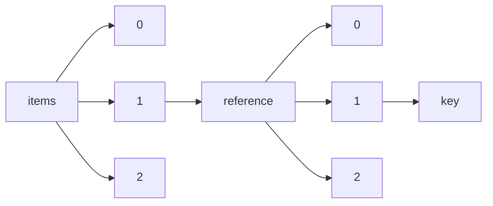

!!! warning "This document is not official Crossref documentation"
# Key
PATH = items/array/reference/array/key(1)  
Occurs 2 072 052 239 times  
Unique values: > 999  
{ .annotate }

1. A route to an element, for example:  
   The route "items/array/reference/array/key" corresponds to navigating through the JSON indices as  
   ["items"][0]["reference"][0]["key"]  

!!! note "Due to current limitations, only the first 1,000 unique values are counted."

| **Row** | **Value** `String` | **Count** `Int64` |
|--------:|----------------------:|---------------------:|
| **1**   | ref1                  | 6 934 910            |
| **2**   | ref2                  | 6 691 585            |
| **3**   | ref3                  | 6 603 893            |
| **4**   | ref4                  | 6 446 332            |
| **5**   | ref5                  | 6 293 258            |
| **6**   | ref6                  | 6 083 696            |
| **7**   | ref7                  | 5 887 274            |
| **8**   | ref8                  | 5 660 482            |
| **9**   | ref9                  | 5 445 621            |
| **10**  | ref10                 | 5 214 732            |
| **11**  | ref11                 | 5 052 559            |
| **12**  | ref12                 | 4 742 637            |
| **13**  | ref13                 | 4 530 263            |
| **14**  | ref14                 | 4 316 442            |
| **15**  | ref15                 | 4 125 648            |
| **16**  | ref16                 | 3 902 594            |
| **17**  | ref17                 | 3 724 836            |
| **18**  | ref18                 | 3 542 170            |
| **19**  | ref19                 | 3 382 150            |
| **20**  | ref20                 | 3 216 190            |
| **21**  | ref21                 | 3 136 084            |
| **22**  | ref22                 | 2 903 580            |
| **23**  | ref23                 | 2 773 452            |
| **24**  | ref24                 | 2 635 131            |
| **25**  | ref25                 | 2 512 451            |
| **26**  | 1                     | 2 412 116            |
| **27**  | ref26                 | 2 381 348            |
| **28**  | 2                     | 2 340 211            |
| **29**  | 3                     | 2 294 856            |
| **30**  | ref27                 | 2 273 120            |
| **31**  | 4                     | 2 238 808            |
| **32**  | 5                     | 2 165 162            |
| **33**  | CIT0001               | 2 151 971            |
| **34**  | ref28                 | 2 151 805            |
| **35**  | CIT0002               | 2 120 363            |
| **36**  | CIT0003               | 2 077 368            |
| **37**  | 6                     | 2 073 985            |
| **38**  | ref29                 | 2 051 392            |
| **39**  | CIT0004               | 2 032 852            |
| **40**  | CIT0005               | 1 983 025            |
| **41**  | 7                     | 1 971 130            |
| **42**  | ref30                 | 1 938 548            |
| **43**  | CIT0006               | 1 923 719            |
| **44**  | ref31                 | 1 908 204            |
| **45**  | CIT0007               | 1 866 659            |
| **46**  | 8                     | 1 862 041            |
| **47**  | CIT0008               | 1 808 546            |
| **48**  | 9                     | 1 747 349            |
| **49**  | CIT0009               | 1 747 267            |
| **50**  | ref32                 | 1 731 873            |
| **51**  | CIT0010               | 1 687 572            |
| **52**  | ref33                 | 1 648 613            |
| **53**  | 10                    | 1 635 935            |
| **54**  | CIT0011               | 1 626 850            |
| **55**  | CIT0012               | 1 569 178            |
| **56**  | ref34                 | 1 555 587            |
| **57**  | 11                    | 1 512 242            |
| **58**  | CIT0013               | 1 507 016            |
| **59**  | ref35                 | 1 479 152            |
| **60**  | CIT0014               | 1 452 754            |
| **61**  | 12                    | 1 404 652            |
| **62**  | CIT0015               | 1 396 961            |
| **63**  | ref36                 | 1 390 146            |
| **64**  | CIT0016               | 1 339 411            |
| **65**  | ref37                 | 1 321 754            |
| **66**  | 13                    | 1 297 193            |
| **67**  | CIT0017               | 1 285 552            |
| **68**  | ref38                 | 1 243 595            |
| **69**  | CIT0018               | 1 231 190            |
| **70**  | 14                    | 1 199 993            |
| **71**  | ref39                 | 1 181 060            |
| **72**  | CIT0019               | 1 179 657            |
| **73**  | CIT0020               | 1 129 631            |
| **74**  | ref41                 | 1 114 447            |
| **75**  | ref40                 | 1 107 144            |
| **76**  | 15                    | 1 101 568            |
| **77**  | CIT0021               | 1 077 327            |
| **78**  | CIT0022               | 1 027 249            |
| **79**  | 16                    | 1 010 183            |
| **80**  | ref42                 | 977 682              |
| **81**  | CIT0023               | 977 503              |
| **82**  | CIT0024               | 930 110              |
| **83**  | ref43                 | 925 816              |
| **84**  | 17                    | 924 719              |
| **85**  | CIT0025               | 885 106              |
| **86**  | ref44                 | 867 310              |
| **87**  | 18                    | 848 005              |
| **88**  | CIT0026               | 841 094              |
| **89**  | ref45                 | 824 659              |
| **90**  | CIT0027               | 798 215              |
| **91**  | 19                    | 776 408              |
| **92**  | ref46                 | 768 329              |
| **93**  | CR1                   | 758 193              |
| **94**  | CIT0028               | 756 792              |
| **95**  | CR2                   | 743 617              |
| **96**  | ref47                 | 727 699              |
| **97**  | CR3                   | 720 416              |
| **98**  | CIT0029               | 715 014              |
| **99**  | 20                    | 710 921              |
| **100** | ref                   | 697 078              |
| **101** | CR4                   | 691 682              |
| **102** | ref48                 | 680 338              |
| **103** | CIT0030               | 674 931              |
| **104** | CR5                   | 659 580              |
| **105** | 21                    | 648 394              |
| **106** | ref49                 | 641 846              |
| **107** | CIT0031               | 638 999              |
| **108** | CR6                   | 625 303              |
| **109** | ref51                 | 621 639              |
| **110** | CIT0032               | 602 425              |
| **111** | ref50                 | 599 269              |
| **112** | 22                    | 591 122              |
| **113** | CR7                   | 590 898              |
| **114** | CIT0033               | 566 868              |
| **115** | CR8                   | 556 939              |
| **116** | 23                    | 539 108              |
| **117** | CIT0034               | 534 121              |
| **118** | ref52                 | 524 422              |
| **119** | CR9                   | 523 895              |
| **120** | CIT0035               | 504 546              |
| **121** | ref53                 | 496 514              |
| **122** | CR10                  | 492 390              |
| **123** | 24                    | 490 965              |
| **124** | CIT0036               | 475 261              |
| **125** |                       | 463 909              |
| **126** | ref54                 | 462 756              |
| **127** | CR11                  | 461 365              |
| **128** | CIT0037               | 448 058              |
| **129** | 25                    | 445 680              |
| **130** | p\_2                  | 443 452              |
| **131** | p\_1                  | 439 152              |
| **132** | p\_3                  | 439 042              |
| **133** | ref55                 | 437 947              |
| **134** | CR12                  | 433 212              |
| **135** | p\_4                  | 427 653              |
| **136** | CIT0038               | 420 907              |
| **137** | p\_5                  | 412 543              |
| **138** | ref56                 | 407 770              |
| **139** | CR13                  | 406 148              |
| **140** | 26                    | 404 097              |
| **141** | p\_6                  | 396 528              |
| **142** | CIT0039               | 395 475              |
| **143** | ref57                 | 386 660              |
| **144** | CR14                  | 381 825              |
| **145** | p\_7                  | 378 001              |
| **146** | CIT0040               | 372 641              |
| **147** | 27                    | 365 697              |
| **148** | p\_8                  | 361 018              |
| **149** | ref58                 | 359 372              |
| **150** | CR15                  | 357 972              |
| **151** | B1                    | 352 368              |
| **152** | B2                    | 350 477              |
| **153** | B3                    | 348 687              |
| **154** | CIT0041               | 347 569              |
| **155** | B4                    | 345 312              |
| **156** | p\_9                  | 344 879              |
| **157** | ref61                 | 344 742              |
| **158** | ref0                  | 344 298              |
| **159** | B5                    | 341 341              |
| **160** | ref59                 | 340 256              |
| **161** | B6                    | 336 565              |
| **162** | CR16                  | 334 208              |
| **163** | 28                    | 332 554              |
| **164** | B7                    | 332 403              |
| **165** | B8                    | 328 865              |
| **166** | CIT0042               | 327 827              |
| **167** | B9                    | 325 403              |
| **168** | p\_10                 | 324 837              |
| **169** | B10                   | 322 211              |
| **170** | B11                   | 317 664              |
| **171** | ref60                 | 315 915              |
| **172** | B12                   | 313 692              |
| **173** | CR17                  | 313 287              |
| **174** | B13                   | 310 777              |
| **175** | p\_11                 | 309 343              |
| **176** | CIT0043               | 307 130              |
| **177** | B14                   | 306 750              |
| **178** | B15                   | 303 166              |
| **179** | 29                    | 301 743              |
| **180** | B16                   | 297 771              |
| **181** | B17                   | 294 197              |
| **182** | p\_12                 | 294 195              |
| **183** | CR18                  | 292 933              |
| **184** | B18                   | 290 014              |
| **185** | CIT0044               | 287 710              |
| **186** | B19                   | 285 070              |
| **187** | B20                   | 280 117              |
| **188** | p\_13                 | 279 640              |
| **189** | ref62                 | 276 347              |
| **190** | CR19                  | 274 324              |
| **191** | B21                   | 274 102              |
| **192** | 30                    | 274 081              |
| **193** | atypb1                | 271 019              |
| **194** | CIT0045               | 270 053              |
| **195** | B22                   | 268 441              |
| **196** | p\_14                 | 265 322              |
| **197** | ref63                 | 263 062              |
| **198** | r2                    | 262 886              |
| **199** | B23                   | 262 830              |
| **200** | atypb2                | 260 855              |
| **201** | r1                    | 260 040              |
| **202** | r3                    | 259 157              |
| **203** | CR20                  | 257 231              |
| **204** | B24                   | 256 140              |
| **205** | atypb3                | 253 488              |
| **206** | CIT0046               | 253 453              |
| **207** | r4                    | 251 981              |
| **208** | p\_15                 | 251 465              |
| **209** | B25                   | 250 708              |
| **210** | 31                    | 246 516              |
| **211** | ref64                 | 245 095              |
| **212** | B26                   | 244 689              |
| **213** | atypb4                | 244 678              |
| **214** | r5                    | 241 923              |
| **215** | CR21                  | 240 364              |
| **216** | B27                   | 239 180              |
| **217** | atypb5                | 236 902              |
| **218** | CIT0047               | 236 829              |
| **219** | p\_16                 | 235 987              |
| **220** | B28                   | 232 866              |
| **221** | r6                    | 232 027              |
| **222** | ref65                 | 231 986              |
| **223** | atypb6                | 228 210              |
| **224** | B29                   | 225 644              |
| **225** | p\_17                 | 225 185              |
| **226** | CR22                  | 224 997              |
| **227** | CIT0048               | 222 036              |
| **228** | 32                    | 221 945              |
| **229** | atypb7                | 220 632              |
| **230** | ref\_1                | 220 575              |
| **231** | B30                   | 219 978              |
| **232** | r7                    | 219 292              |
| **233** | ref66                 | 216 361              |
| **234** | ref\_2                | 213 368              |
| **235** | p\_18                 | 212 990              |
| **236** | atypb8                | 211 929              |
| **237** | B31                   | 211 242              |
| **238** | CR23                  | 210 559              |
| **239** | CIT0049               | 208 604              |
| **240** | r8                    | 207 215              |
| **241** | ref\_3                | 207 035              |
| **242** | ref9/cit9             | 206 543              |
| **243** | ref8/cit8             | 206 198              |
| **244** | ref11/cit11           | 205 549              |
| **245** | ref7/cit7             | 205 060              |
| **246** | atypb9                | 204 998              |
| **247** | ref67                 | 204 986              |
| **248** | ref5/cit5             | 204 978              |
| **249** | ref10/cit10           | 204 814              |
| **250** | ref12/cit12           | 204 721              |
| **251** | ref6/cit6             | 204 421              |
| **252** | ref4/cit4             | 204 380              |
| **253** | B32                   | 204 087              |
| **254** | ref3/cit3             | 203 038              |
| **255** | ref2/cit2             | 202 825              |
| **256** | ref13/cit13           | 202 617              |
| **257** | p\_19                 | 202 596              |
| **258** | ref14/cit14           | 201 335              |
| **259** | ref\_4                | 200 875              |
| **260** | ref1/cit1             | 200 719              |
| **261** | 33                    | 200 586              |
| **262** | ref15/cit15           | 199 484              |
| **263** | ref71                 | 197 418              |
| **264** | ref16/cit16           | 197 342              |
| **265** | CR24                  | 197 104              |
| **266** | atypb10               | 196 767              |
| **267** | B33                   | 196 509              |
| **268** | CIT0050               | 195 163              |
| **269** | ref17/cit17           | 194 822              |
| **270** | ref\_5                | 194 503              |
| **271** | r9                    | 192 571              |
| **272** | ref18/cit18           | 192 050              |
| **273** | p\_20                 | 191 515              |
| **274** | ref68                 | 190 376              |
| **275** | atypb11               | 189 847              |
| **276** | ref19/cit19           | 188 688              |
| **277** | B34                   | 188 660              |
| **278** | ref\_6                | 187 569              |
| **279** | ref20/cit20           | 186 116              |
| **280** | CR25                  | 184 174              |
| **281** | ref21/cit21           | 183 139              |
| **282** | CIT0051               | 182 384              |
| **283** | B35                   | 181 964              |
| **284** | atypb12               | 181 920              |
| **285** | ref69                 | 181 197              |
| **286** | 34                    | 181 066              |
| **287** | p\_21                 | 180 909              |
| **288** | ref\_7                | 180 842              |
| **289** | r10                   | 180 486              |
| **290** | ref22/cit22           | 178 403              |
| **291** | atypb13               | 175 473              |
| **292** | ref\_8                | 175 015              |
| **293** | B36                   | 174 154              |
| **294** | ref23/cit23           | 173 896              |
| **295** | CR26                  | 171 481              |
| **296** | p\_22                 | 170 866              |
| **297** | CIT0052               | 170 353              |
| **298** | ref24/cit24           | 169 947              |
| **299** | ref70                 | 169 685              |
| **300** | ref\_9                | 169 557              |
| **301** | atypb14               | 168 647              |
| **302** | B37                   | 166 714              |
| **303** | r11                   | 166 215              |
| **304** | ref25/cit25           | 165 990              |
| **305** | ref\_10               | 164 084              |
| **306** | 35                    | 163 870              |
| **307** | p\_23                 | 161 405              |
| **308** | ref26/cit26           | 161 321              |
| **309** | atypb15               | 160 468              |
| **310** | CR27                  | 160 208              |
| **311** | B38                   | 159 967              |
| **312** | ref\_11               | 158 852              |
| **313** | CIT0053               | 158 365              |
| **314** | ref27/cit27           | 156 447              |
| **315** | ref\_12               | 154 261              |
| **316** | atypb16               | 153 160              |
| **317** | B39                   | 153 103              |
| **318** | r12                   | 152 657              |
| **319** | p\_24                 | 151 913              |
| **320** | ref28/cit28           | 151 608              |
| **321** | ref\_13               | 149 885              |
| **322** | CR28                  | 149 184              |
| **323** | ref72                 | 149 140              |
| **324** | CIT0054               | 148 270              |
| **325** | 36                    | 148 058              |
| **326** | atypb17               | 147 161              |
| **327** | B40                   | 146 256              |
| **328** | ref\_14               | 145 768              |
| **329** | ref29/cit29           | 145 690              |
| **330** | R1                    | 144 988              |
| **331** | R2                    | 143 981              |
| **332** | p\_25                 | 143 794              |
| **333** | r13                   | 142 071              |
| **334** | R3                    | 141 690              |
| **335** | ref\_15               | 141 554              |
| **336** | ref73                 | 141 253              |
| **337** | atypb18               | 140 645              |
| **338** | CIT0055               | 140 256              |
| **339** | ref30/cit30           | 139 955              |
| **340** | B41                   | 139 000              |
| **341** | CR29                  | 138 631              |
| **342** | R4                    | 138 165              |
| **343** | ref\_16               | 137 740              |
| **344** | p\_26                 | 135 728              |
| **345** | atypb19               | 135 117              |
| **346** | e\_1\_2\_1\_2\_1      | 134 775              |
| **347** | ref31/cit31           | 134 309              |
| **348** | ref\_17               | 134 146              |
| **349** | R5                    | 133 559              |
| **350** | 37                    | 133 071              |
| **351** | B42                   | 131 830              |
| **352** | r14                   | 131 217              |
| **353** | ref74                 | 130 966              |
| **354** | CIT0056               | 130 516              |
| **355** | ref\_18               | 129 889              |
| **356** | CR30                  | 129 199              |
| **357** | ref32/cit32           | 128 613              |
| **358** | atypb20               | 128 392              |
| **359** | p\_27                 | 127 369              |
| **360** | R6                    | 126 771              |
| **361** | ref\_19               | 126 512              |
| **362** | ref75                 | 125 467              |
| **363** | B43                   | 125 300              |
| **364** | e\_1\_2\_1\_3\_1      | 123 257              |
| **365** | ref\_20               | 123 170              |
| **366** | ref33/cit33           | 122 830              |
| **367** | atypb21               | 122 525              |
| **368** | CIT0057               | 121 964              |
| **369** | r15                   | 121 813              |
| **370** | p\_28                 | 121 152              |
| **371** | c1                    | 120 973              |
| **372** | CR31                  | 120 282              |
| **373** | ref81                 | 120 180              |
| **374** | 38                    | 120 053              |
| **375** | R7                    | 119 719              |
| **376** | B44                   | 119 715              |
| **377** | ref\_21               | 119 636              |
| **378** | c2                    | 119 123              |
| **379** | c3                    | 118 174              |
| **380** | atypb22               | 117 283              |
| **381** | ref34/cit34           | 117 224              |
| **382** | ref76                 | 116 913              |
| **383** | c4                    | 116 735              |
| **384** | ref\_22               | 116 515              |
| **385** | p\_29                 | 114 109              |
| **386** | e\_1\_2\_1\_4\_1      | 113 961              |
| **387** | c5                    | 113 908              |
| **388** | ref\_23               | 113 671              |
| **389** | B45                   | 113 548              |
| **390** | R8                    | 113 538              |
| **391** | CIT0058               | 113 254              |
| **392** | CR32                  | 112 576              |
| **393** | atypb23               | 111 710              |
| **394** | ref35/cit35           | 111 128              |
| **395** | ref77                 | 110 968              |
| **396** | ref\_24               | 110 795              |
| **397** | c6                    | 110 455              |
| **398** | r16                   | 110 340              |
| **399** | 39                    | 108 119              |
| **400** | B46                   | 107 867              |
| **401** | ref\_25               | 107 818              |
| **402** | c7                    | 107 190              |
| **403** | p\_30                 | 106 618              |
| **404** | CIT0059               | 106 192              |
| **405** | atypb24               | 105 818              |
| **406** | e\_1\_2\_1\_5\_1      | 105 663              |
| **407** | ref36/cit36           | 105 386              |
| **408** | CR33                  | 105 034              |
| **409** | R9                    | 104 519              |
| **410** | ref\_26               | 104 196              |
| **411** | ref78                 | 103 089              |
| **412** | c8                    | 102 171              |
| **413** | B47                   | 102 043              |
| **414** | cit0001               | 101 588              |
| **415** | atypb25               | 101 546              |
| **416** | ref\_27               | 101 376              |
| **417** | p\_31                 | 100 900              |
| **418** | r17                   | 100 633              |
| **419** | CIT0060               | 99 907               |
| **420** | ref37/cit37           | 99 466               |
| **421** | e\_1\_2\_1\_6\_1      | 98 743               |
| **422** | cit0002               | 98 598               |
| **423** | c9                    | 98 127               |
| **424** | ref79                 | 98 034               |
| **425** | CR34                  | 97 676               |
| **426** | ref\_28               | 97 649               |
| **427** | cit0003               | 97 649               |
| **428** | R10                   | 97 287               |
| **429** | 40                    | 97 066               |
| **430** | cit0004               | 96 166               |
| **431** | B48                   | 95 983               |
| **432** | p\_32                 | 95 962               |
| **433** | atypb26               | 95 542               |
| **434** | e\_1\_2\_1\_1\_1      | 95 258               |
| **435** | cit0005               | 95 169               |
| **436** | ref\_29               | 94 931               |
| **437** | cit0006               | 93 252               |
| **438** | c10                   | 92 621               |
| **439** | CIT0061               | 92 548               |
| **440** | r18                   | 92 504               |
| **441** | cit0007               | 92 368               |
| **442** | ref38/cit38           | 92 301               |
| **443** | ref\_30               | 91 689               |
| **444** | atypb27               | 91 104               |
| **445** | e\_1\_2\_1\_7\_1      | 90 950               |
| **446** | p\_33                 | 90 539               |
| **447** | ref80                 | 90 299               |
| **448** | CR35                  | 90 199               |
| **449** | B49                   | 90 168               |
| **450** | cit0008               | 90 102               |
| **451** | R11                   | 89 012               |
| **452** | cit0009               | 88 949               |
| **453** | ref\_31               | 88 503               |
| **454** | cit0010               | 86 577               |
| **455** | CIT0062               | 86 194               |
| **456** | atypb28               | 85 934               |
| **457** | 41                    | 85 832               |
| **458** | c11                   | 85 630               |
| **459** | e\_1\_2\_1\_8\_1      | 85 479               |
| **460** | ref\_32               | 85 145               |
| **461** | B50                   | 84 664               |
| **462** | ref39/cit39           | 84 589               |
| **463** | p\_34                 | 84 582               |
| **464** | r19                   | 83 954               |
| **465** | cit0011               | 83 596               |
| **466** | CR36                  | 83 283               |
| **467** | cit0012               | 82 425               |
| **468** | ref\_33               | 81 817               |
| **469** | atypb29               | 81 626               |
| **470** | R12                   | 81 284               |
| **471** | cit0013               | 80 731               |
| **472** | B51                   | 80 586               |
| **473** | c12                   | 80 568               |
| **474** | ref82                 | 80 396               |
| **475** | CIT0063               | 79 782               |
| **476** | ref40/cit40           | 79 468               |
| **477** | e\_1\_2\_1\_9\_1      | 79 369               |
| **478** | p\_35                 | 79 341               |
| **479** | cit0014               | 78 859               |
| **480** | ref\_34               | 78 840               |
| **481** | CR37                  | 77 908               |
| **482** | cit0015               | 77 064               |
| **483** | e\_1\_3\_2\_1\_1\_1   | 76 635               |
| **484** | e\_1\_3\_2\_1\_2\_1   | 76 494               |
| **485** | B52                   | 76 335               |
| **486** | ref\_35               | 76 215               |
| **487** | atypb30               | 76 201               |
| **488** | ref83                 | 76 174               |
| **489** | r20                   | 75 807               |
| **490** | 42                    | 75 576               |
| **491** | p\_36                 | 75 317               |
| **492** | R13                   | 75 313               |
| **493** | c13                   | 74 955               |
| **494** | e\_1\_3\_2\_1\_3\_1   | 74 719               |
| **495** | cit0016               | 74 585               |
| **496** | e\_1\_2\_1\_2\_2      | 74 323               |
| **497** | ref91                 | 74 315               |
| **498** | ref41/cit41           | 74 249               |
| **499** | e\_1\_2\_1\_10\_1     | 74 003               |
| **500** | CIT0064               | 73 929               |
| **501** | cit0017               | 72 934               |
| **502** | ref\_36               | 72 910               |
| **503** | e\_1\_3\_2\_1\_4\_1   | 72 349               |
| **504** | atypb31               | 72 265               |
| **505** | CR38                  | 72 175               |
| **506** | B53                   | 71 100               |
| **507** | ref84                 | 70 945               |
| **508** | cit0018               | 70 534               |
| **509** | r21                   | 70 215               |
| **510** | p\_37                 | 70 137               |
| **511** | c14                   | 70 069               |
| **512** | e\_1\_3\_2\_1\_5\_1   | 69 361               |
| **513** | ref\_37               | 69 231               |
| **514** | e\_1\_2\_1\_3\_2      | 69 144               |
| **515** | R14                   | 69 068               |
| **516** | cit0019               | 68 752               |
| **517** | atypb32               | 68 637               |
| **518** | CIT0065               | 68 400               |
| **519** | ref42/cit42           | 67 864               |
| **520** | e\_1\_2\_1\_11\_1     | 67 447               |
| **521** | 43                    | 67 327               |
| **522** | ref85                 | 67 005               |
| **523** | CR39                  | 66 977               |
| **524** | ref\_38               | 66 721               |
| **525** | cit0020               | 66 414               |
| **526** | e\_1\_2\_1\_1\_2      | 66 313               |
| **527** | e\_1\_3\_2\_1\_6\_1   | 66 115               |
| **528** | B54                   | 66 068               |
| **529** | atypb33               | 65 467               |
| **530** | p\_38                 | 65 259               |
| **531** | e\_1\_2\_1\_4\_2      | 64 434               |
| **532** | cit0021               | 64 223               |
| **533** | r22                   | 64 152               |
| **534** | c15                   | 63 304               |
| **535** | e\_1\_3\_2\_1\_7\_1   | 63 203               |
| **536** | ref\_39               | 63 086               |
| **537** | e\_1\_2\_1\_12\_1     | 62 641               |
| **538** | CIT0066               | 62 621               |
| **539** | ref43/cit43           | 62 528               |
| **540** | ref86                 | 62 481               |
| **541** | CR40                  | 62 138               |
| **542** | B55                   | 61 827               |
| **543** | cit0022               | 61 392               |
| **544** | R15                   | 61 081               |
| **545** | e\_1\_3\_2\_1\_8\_1   | 60 304               |
| **546** | atypb34               | 60 303               |
| **547** | CIT0067               | 59 506               |
| **548** | e\_1\_2\_1\_5\_2      | 59 364               |
| **549** | ref\_40               | 59 314               |
| **550** | cit0023               | 59 244               |
| **551** | p\_39                 | 58 521               |
| **552** | CR41                  | 58 044               |
| **553** | ref87                 | 57 877               |
| **554** | r23                   | 57 613               |
| **555** | e\_1\_2\_1\_13\_1     | 57 600               |
| **556** | e\_1\_3\_2\_1\_9\_1   | 57 417               |
| **557** | atypb35               | 57 324               |
| **558** | ref\_41               | 56 973               |
| **559** | c16                   | 56 912               |
| **560** | B56                   | 56 841               |
| **561** | cit0024               | 56 732               |
| **562** | 44                    | 56 362               |
| **563** | R16                   | 55 903               |
| **564** | e\_1\_3\_2\_2\_2      | 55 700               |
| **565** | ref44/cit44           | 55 665               |
| **566** | e\_1\_3\_2\_4\_2      | 55 118               |
| **567** | e\_1\_2\_1\_6\_2      | 54 864               |
| **568** | ref\_42               | 54 857               |
| **569** | ref88                 | 54 279               |
| **570** | e\_1\_3\_2\_3\_2      | 54 231               |
| **571** | atypb36               | 54 129               |
| **572** | e\_1\_3\_2\_1\_10\_1  | 54 037               |
| **573** | CR42                  | 53 987               |
| **574** | cit0025               | 53 936               |
| **575** | e\_1\_2\_1\_14\_1     | 53 908               |
| **576** | B57                   | 53 855               |
| **577** | e\_1\_3\_2\_5\_2      | 53 645               |
| **578** | e\_1\_3\_2\_6\_2      | 52 922               |
| **579** | ref\_43               | 52 287               |
| **580** | CIT0068               | 52 242               |
| **581** | cit0026               | 52 085               |
| **582** | e\_1\_3\_2\_7\_2      | 51 902               |
| **583** | e\_1\_3\_2\_8\_2      | 51 441               |
| **584** | r24                   | 51 395               |
| **585** | e\_1\_3\_2\_9\_2      | 51 120               |
| **586** | p\_40                 | 51 089               |
| **587** | atypb37               | 50 977               |
| **588** | ref45/cit45           | 50 760               |
| **589** | e\_1\_2\_8\_2\_1      | 50 627               |
| **590** | ref89                 | 50 598               |
| **591** | CIT0069               | 50 457               |
| **592** | e\_1\_2\_8\_3\_1      | 50 363               |
| **593** | CR43                  | 50 359               |
| **594** | e\_1\_2\_8\_4\_1      | 50 294               |
| **595** | e\_1\_2\_1\_7\_2      | 50 289               |
| **596** | R17                   | 50 254               |
| **597** | e\_1\_2\_8\_5\_1      | 50 140               |
| **598** | e\_1\_3\_2\_10\_2     | 50 091               |
| **599** | e\_1\_2\_8\_6\_1      | 50 089               |
| **600** | ref\_44               | 50 006               |
| **601** | e\_1\_2\_8\_8\_1      | 49 973               |
| **602** | e\_1\_2\_8\_7\_1      | 49 906               |
| **603** | e\_1\_2\_1\_15\_1     | 49 890               |
| **604** | cit0027               | 49 464               |
| **605** | e\_1\_2\_8\_9\_1      | 49 427               |
| **606** | B58                   | 49 393               |
| **607** | 45                    | 49 339               |
| **608** | e\_1\_3\_2\_11\_2     | 49 247               |
| **609** | e\_1\_2\_8\_10\_1     | 49 052               |
| **610** | e\_1\_2\_8\_11\_1     | 48 976               |
| **611** | e\_1\_3\_2\_12\_2     | 48 583               |
| **612** | e\_1\_2\_8\_12\_1     | 48 406               |
| **613** | e\_1\_3\_2\_1\_11\_1  | 48 374               |
| **614** | e\_1\_3\_2\_13\_2     | 47 890               |
| **615** | ref\_45               | 47 882               |
| **616** | c17                   | 47 791               |
| **617** | e\_1\_2\_8\_13\_1     | 47 486               |
| **618** | e\_1\_3\_2\_14\_2     | 47 083               |
| **619** | CR44                  | 46 878               |
| **620** | e\_1\_2\_8\_14\_1     | 46 808               |
| **621** | e\_1\_2\_1\_16\_1     | 46 719               |
| **622** | atypb38               | 46 508               |
| **623** | cit0028               | 46 493               |
| **624** | ref90                 | 46 443               |
| **625** | r25                   | 46 441               |
| **626** | p\_41                 | 46 335               |
| **627** | e\_1\_3\_2\_15\_2     | 46 017               |
| **628** | e\_1\_2\_8\_15\_1     | 46 001               |
| **629** | e\_1\_2\_7\_2\_1      | 45 538               |
| **630** | ref101                | 45 482               |
| **631** | e\_1\_2\_7\_5\_1      | 45 160               |
| **632** | e\_1\_2\_7\_4\_1      | 45 155               |
| **633** | e\_1\_2\_8\_16\_1     | 45 111               |
| **634** | e\_1\_3\_2\_1\_12\_1  | 45 083               |
| **635** | B59                   | 45 044               |
| **636** | e\_1\_2\_7\_3\_1      | 44 904               |
| **637** | e\_1\_2\_1\_8\_2      | 44 857               |
| **638** | CIT0070               | 44 829               |
| **639** | e\_1\_2\_7\_6\_1      | 44 717               |
| **640** | ref\_46               | 44 642               |
| **641** | p\_42                 | 44 621               |
| **642** | cit0029               | 44 429               |
| **643** | R18                   | 44 424               |
| **644** | e\_1\_3\_2\_16\_2     | 44 410               |
| **645** | atypb39               | 44 332               |
| **646** | ref46/cit46           | 44 101               |
| **647** | e\_1\_2\_7\_7\_1      | 44 088               |
| **648** | e\_1\_2\_7\_8\_1      | 44 026               |
| **649** | CR45                  | 43 712               |
| **650** | e\_1\_2\_7\_9\_1      | 43 619               |
| **651** | 3\_CR1                | 43 458               |
| **652** | e\_1\_2\_8\_18\_1     | 43 455               |
| **653** | e\_1\_3\_2\_17\_2     | 43 292               |
| **654** | e\_1\_2\_8\_17\_1     | 43 263               |
| **655** | e\_1\_2\_7\_10\_1     | 43 157               |
| **656** | ref\_47               | 42 975               |
| **657** | e\_1\_2\_7\_11\_1     | 42 744               |
| **658** | cit0030               | 42 639               |
| **659** | B60                   | 42 392               |
| **660** | e\_1\_2\_7\_12\_1     | 41 933               |
| **661** | 3\_CR2                | 41 899               |
| **662** | atypb40               | 41 868               |
| **663** | e\_1\_3\_2\_1\_13\_1  | 41 582               |
| **664** | e\_1\_3\_2\_18\_2     | 41 553               |
| **665** | e\_1\_2\_7\_13\_1     | 41 520               |
| **666** | e\_1\_2\_8\_19\_1     | 41 507               |
| **667** | 2\_CR1                | 41 482               |
| **668** | 46                    | 41 427               |
| **669** | p\_43                 | 41 370               |
| **670** | ref\_48               | 41 020               |
| **671** | c18                   | 41 018               |
| **672** | r26                   | 40 896               |
| **673** | e\_1\_2\_7\_14\_1     | 40 886               |
| **674** | e\_1\_2\_8\_20\_1     | 40 854               |
| **675** | CR46                  | 40 648               |
| **676** | e\_1\_2\_1\_17\_1     | 40 351               |
| **677** | 3\_CR3                | 40 261               |
| **678** | e\_1\_2\_7\_15\_1     | 40 229               |
| **679** | e\_1\_3\_2\_19\_2     | 40 081               |
| **680** | 5\_CR1                | 40 045               |
| **681** | 4\_CR1                | 39 952               |
| **682** | e\_1\_2\_1\_9\_2      | 39 909               |
| **683** | CIT0071               | 39 768               |
| **684** | 2\_CR2                | 39 568               |
| **685** | e\_1\_2\_7\_16\_1     | 39 428               |
| **686** | BIB1                  | 39 393               |
| **687** | ref\_49               | 39 369               |
| **688** | p\_44                 | 39 222               |
| **689** | cit0031               | 39 191               |
| **690** | ref92                 | 39 140               |
| **691** | ref47/cit47           | 39 095               |
| **692** | B61                   | 38 952               |
| **693** | atypb41               | 38 944               |
| **694** | 3\_CR4                | 38 674               |
| **695** | BIB2                  | 38 649               |
| **696** | e\_1\_2\_7\_17\_1     | 38 509               |
| **697** | 2\_CR3                | 38 508               |
| **698** | e\_1\_3\_2\_20\_2     | 38 423               |
| **699** | BIB3                  | 38 372               |
| **700** | e\_1\_2\_8\_21\_1     | 38 346               |
| **701** | 5\_CR2                | 38 243               |
| **702** | R19                   | 38 237               |
| **703** | BIB4                  | 37 918               |
| **704** | CR47                  | 37 825               |
| **705** | p\_45                 | 37 797               |
| **706** | 4\_CR2                | 37 782               |
| **707** | e\_1\_2\_8\_22\_1     | 37 633               |
| **708** | e\_1\_2\_7\_18\_1     | 37 570               |
| **709** | 1\_CR1                | 37 554               |
| **710** | CIT0072               | 37 535               |
| **711** | e\_1\_2\_1\_18\_1     | 37 429               |
| **712** | BIB5                  | 37 378               |
| **713** | cit0032               | 37 226               |
| **714** | r27                   | 37 085               |
| **715** | e\_1\_2\_7\_19\_1     | 37 047               |
| **716** | ref\_50               | 36 843               |
| **717** | BIB6                  | 36 827               |
| **718** | BIB7                  | 36 545               |
| **719** | e\_1\_3\_2\_21\_2     | 36 512               |
| **720** | 2\_CR4                | 36 501               |
| **721** | 3\_CR5                | 36 484               |
| **722** | e\_1\_2\_1\_10\_2     | 36 428               |
| **723** | atypb42               | 36 207               |
| **724** | 4\_CR3                | 36 195               |
| **725** | 5\_CR3                | 36 178               |
| **726** | p\_46                 | 36 119               |
| **727** | BIB8                  | 35 989               |
| **728** | e\_1\_2\_7\_20\_1     | 35 954               |
| **729** | e\_1\_2\_8\_23\_1     | 35 864               |
| **730** | 6\_CR1                | 35 482               |
| **731** | CR48                  | 35 331               |
| **732** | ref93                 | 35 230               |
| **733** | BIB9                  | 35 152               |
| **734** | 1\_CR2                | 35 079               |
| **735** | ref48/cit48           | 35 069               |
| **736** | e\_1\_2\_7\_21\_1     | 34 905               |
| **737** | 3\_CR6                | 34 830               |
| **738** | BIB10                 | 34 800               |
| **739** | p\_47                 | 34 485               |
| **740** | e\_1\_2\_1\_19\_1     | 34 469               |
| **741** | 2\_CR5                | 34 467               |
| **742** | 5\_CR4                | 34 423               |
| **743** | atypb43               | 34 373               |
| **744** | ref\_51               | 34 329               |
| **745** | e\_1\_3\_2\_22\_2     | 34 217               |
| **746** | e\_1\_2\_8\_24\_1     | 34 168               |
| **747** | e\_1\_2\_7\_22\_1     | 34 091               |
| **748** | 4\_CR4                | 34 089               |
| **749** | BIB11                 | 34 085               |
| **750** | r001                  | 34 053               |
| **751** | cit0033               | 33 813               |
| **752** | e\_1\_2\_8\_25\_1     | 33 799               |
| **753** | 6\_CR2                | 33 750               |
| **754** | 3\_CR7                | 33 496               |
| **755** | p\_48                 | 33 348               |
| **756** | e\_1\_3\_2\_1\_14\_1  | 33 288               |
| **757** | c19                   | 33 220               |
| **758** | BIB12                 | 33 172               |
| **759** | 1\_CR3                | 33 131               |
| **760** | 2\_CR6                | 33 006               |
| **761** | 5\_CR5                | 32 903               |
| **762** | e\_1\_2\_7\_23\_1     | 32 800               |
| **763** | CR49                  | 32 773               |
| **764** | r28                   | 32 679               |
| **765** | 47                    | 32 574               |
| **766** | 4\_CR5                | 32 451               |
| **767** | e\_1\_2\_1\_20\_1     | 32 425               |
| **768** | 6\_CR3                | 32 326               |
| **769** | r002                  | 32 325               |
| **770** | 3\_CR8                | 32 322               |
| **771** | cit0034               | 32 129               |
| **772** | p\_49                 | 32 093               |
| **773** | B62                   | 32 044               |
| **774** | ref\_52               | 31 919               |
| **775** | e\_1\_2\_7\_24\_1     | 31 827               |
| **776** | BIB13                 | 31 540               |
| **777** | ref49/cit49           | 31 456               |
| **778** | 2\_CR7                | 31 269               |
| **779** | 1\_CR4                | 31 222               |
| **780** | b1\_1                 | 31 219               |
| **781** | e\_1\_2\_8\_26\_1     | 31 162               |
| **782** | atypb44               | 30 975               |
| **783** | CR50                  | 30 842               |
| **784** | 4\_CR6                | 30 823               |
| **785** | p\_50                 | 30 782               |
| **786** | BIB14                 | 30 745               |
| **787** | R20                   | 30 727               |
| **788** | 7\_CR1                | 30 656               |
| **789** | e\_1\_2\_7\_25\_1     | 30 598               |
| **790** | 5\_CR6                | 30 577               |
| **791** | 3\_CR9                | 30 513               |
| **792** | 6\_CR4                | 30 479               |
| **793** | ref94                 | 30 394               |
| **794** | CIT0073               | 30 354               |
| **795** | e\_1\_2\_8\_27\_1     | 30 171               |
| **796** | BIB15                 | 29 953               |
| **797** | B63                   | 29 945               |
| **798** | 2\_CR8                | 29 659               |
| **799** | b2\_2                 | 29 659               |
| **800** | 1\_CR5                | 29 494               |
| **801** | e\_1\_2\_1\_21\_1     | 29 485               |
| **802** | ref111                | 29 354               |
| **803** | e\_1\_2\_7\_26\_1     | 29 278               |
| **804** | 3\_CR10               | 29 216               |
| **805** | p\_51                 | 29 060               |
| **806** | 6\_CR5                | 29 037               |
| **807** | 7\_CR2                | 29 005               |
| **808** | e\_1\_2\_8\_28\_1     | 28 928               |
| **809** | CR51                  | 28 880               |
| **810** | 4\_CR7                | 28 872               |
| **811** | 5\_CR7                | 28 813               |
| **812** | atypb45               | 28 790               |
| **813** | c20                   | 28 298               |
| **814** | r003                  | 28 222               |
| **815** | p\_52                 | 27 985               |
| **816** | 1\_CR6                | 27 923               |
| **817** | e\_1\_2\_1\_22\_1     | 27 922               |
| **818** | ref\_53               | 27 819               |
| **819** | cit0035               | 27 719               |
| **820** | 7\_CR3                | 27 678               |
| **821** | e\_1\_2\_7\_27\_1     | 27 604               |
| **822** | 6\_CR6                | 27 601               |
| **823** | e\_1\_2\_9\_7\_1      | 27 576               |
| **824** | r29                   | 27 538               |
| **825** | p\_53                 | 27 502               |
| **826** | e\_1\_3\_2\_1\_15\_1  | 27 362               |
| **827** | e\_1\_2\_9\_8\_1      | 27 330               |
| **828** | 2\_CR9                | 27 272               |
| **829** | CR52                  | 27 226               |
| **830** | e\_1\_2\_9\_2\_1      | 27 214               |
| **831** | 8\_CR1                | 27 155               |
| **832** | e\_1\_2\_9\_3\_1      | 27 137               |
| **833** | e\_1\_2\_9\_4\_1      | 27 058               |
| **834** | e\_1\_2\_9\_5\_1      | 27 022               |
| **835** | e\_1\_2\_9\_6\_1      | 27 014               |
| **836** | 5\_CR8                | 26 976               |
| **837** | 3\_CR11               | 26 876               |
| **838** | BIB16                 | 26 860               |
| **839** | B64                   | 26 674               |
| **840** | e\_1\_2\_8\_29\_1     | 26 539               |
| **841** | e\_1\_2\_7\_28\_1     | 26 504               |
| **842** | 1\_CR7                | 26 160               |
| **843** | p\_54                 | 26 158               |
| **844** | 2\_CR10               | 26 142               |
| **845** | b3\_3                 | 26 138               |
| **846** | e\_1\_3\_2\_23\_2     | 26 130               |
| **847** | ref95                 | 26 042               |
| **848** | e\_1\_2\_9\_9\_1      | 25 888               |
| **849** | 8\_CR2                | 25 845               |
| **850** | BIB17                 | 25 772               |
| **851** | 6\_CR7                | 25 756               |
| **852** | e\_1\_2\_9\_10\_1     | 25 748               |
| **853** | e\_1\_2\_7\_29\_1     | 25 624               |
| **854** | p\_55                 | 25 575               |
| **855** | e\_1\_2\_9\_11\_1     | 25 507               |
| **856** | e\_1\_3\_2\_24\_2     | 25 289               |
| **857** | c21                   | 25 171               |
| **858** | 5\_CR9                | 25 123               |
| **859** | 4\_CR8                | 25 056               |
| **860** | p\_56                 | 24 990               |
| **861** | 2022081214414093300\_ | 24 864               |
| **862** | ref50/cit50           | 24 835               |
| **863** | e\_1\_2\_6\_2\_1      | 24 766               |
| **864** | b4\_4                 | 24 734               |
| **865** | e\_1\_2\_9\_12\_1     | 24 709               |
| **866** | BIB18                 | 24 662               |
| **867** | e\_1\_2\_9\_13\_1     | 24 511               |
| **868** | e\_1\_3\_1\_2\_1      | 24 296               |
| **869** | 1\_CR8                | 24 279               |
| **870** | e\_1\_2\_6\_5\_1      | 24 164               |
| **871** | r004                  | 24 149               |
| **872** | e\_1\_2\_6\_4\_1      | 24 145               |
| **873** | e\_1\_2\_1\_23\_1     | 24 028               |
| **874** | r30                   | 23 979               |
| **875** | 6\_CR8                | 23 901               |
| **876** | 7\_CR4                | 23 849               |
| **877** | 4\_CR9                | 23 737               |
| **878** | 3\_CR12               | 23 589               |
| **879** | atypb46               | 23 542               |
| **880** | CR53                  | 23 500               |
| **881** | e\_1\_2\_9\_14\_1     | 23 372               |
| **882** | ref\_54               | 23 308               |
| **883** | 6\_CR9                | 23 101               |
| **884** | e\_1\_3\_2\_25\_2     | 23 075               |
| **885** | 2022110119503973800\_ | 23 040               |
| **886** | cit0036               | 22 955               |
| **887** | 4\_CR10               | 22 745               |
| **888** | e\_1\_2\_8\_30\_1     | 22 732               |
| **889** | 7\_CR5                | 22 577               |
| **890** | 48                    | 22 475               |
| **891** | ref96                 | 22 332               |
| **892** | 2\_CR11               | 22 310               |
| **893** | 8\_CR3                | 22 287               |
| **894** | e\_1\_2\_7\_30\_1     | 22 231               |
| **895** | e\_1\_3\_2\_1\_16\_1  | 22 184               |
| **896** | 3\_CR13               | 21 771               |
| **897** | p\_57                 | 21 603               |
| **898** | b5\_5                 | 21 441               |
| **899** | CIT0074               | 21 379               |
| **900** | 4\_CR11               | 21 298               |
| **901** | 8\_CR4                | 21 254               |
| **902** | ref1/ref1\_1          | 20 853               |
| **903** | e\_1\_2\_9\_15\_1     | 20 712               |
| **904** | ref2/ref2\_1          | 20 496               |
| **905** | e\_1\_2\_9\_16\_1     | 20 416               |
| **906** | e\_1\_2\_1\_24\_1     | 20 143               |
| **907** | ref3/ref3\_1          | 19 864               |
| **908** | CR54                  | 19 859               |
| **909** | e\_1\_2\_8\_31\_1     | 19 641               |
| **910** | atypb47               | 19 613               |
| **911** | 2022081219541304600\_ | 19 349               |
| **912** | 5\_CR10               | 19 160               |
| **913** | ref97                 | 19 132               |
| **914** | 2\_CR12               | 19 106               |
| **915** | ref4/ref4\_1          | 18 967               |
| **916** | 1\_CR9                | 18 935               |
| **917** | 5\_CR11               | 18 579               |
| **918** | CR55                  | 18 570               |
| **919** | 3\_CR14               | 18 456               |
| **920** | r005                  | 18 302               |
| **921** | e\_1\_3\_2\_26\_2     | 18 229               |
| **922** | e\_1\_2\_9\_17\_1     | 18 054               |
| **923** | ref5/ref5\_1          | 17 935               |
| **924** | e\_1\_2\_9\_18\_1     | 17 819               |
| **925** | e\_1\_2\_1\_25\_1     | 17 620               |
| **926** | 9\_CR1                | 17 448               |
| **927** | ref6/ref6\_1          | 16 885               |
| **928** | 7\_CR6                | 16 884               |
| **929** | e\_1\_3\_2\_1\_17\_1  | 16 851               |
| **930** | e\_1\_2\_8\_32\_1     | 16 503               |
| **931** | b6\_6                 | 16 003               |
| **932** | ref7/ref7\_1          | 15 866               |
| **933** | e\_1\_2\_8\_33\_1     | 15 799               |
| **934** | e\_1\_3\_1\_3\_1      | 15 742               |
| **935** | e\_1\_2\_9\_19\_1     | 15 569               |
| **936** | 2022081216113837100\_ | 15 387               |
| **937** | 3\_CR15               | 15 289               |
| **938** | b1                    | 15 237               |
| **939** | r006                  | 15 170               |
| **940** | CIT0075               | 15 101               |
| **941** | 9\_CR2                | 14 865               |
| **942** | ref8/ref8\_1          | 14 811               |
| **943** | e\_1\_3\_1\_4\_1      | 14 689               |
| **944** | 2022081215381190100\_ | 14 630               |
| **945** | atypb48               | 14 528               |
| **946** | b2                    | 14 350               |
| **947** | e\_1\_2\_1\_11\_2     | 14 196               |
| **948** | r007                  | 14 188               |
| **949** | b3                    | 13 945               |
| **950** | 1\_CR10               | 13 872               |
| **951** | ref9/ref9\_1          | 13 868               |
| **952** | 2\_CR13               | 13 742               |
| **953** | b4                    | 13 340               |
| **954** | 6\_CR10               | 13 064               |
| **955** | b5                    | 13 052               |
| **956** | 2022081220463782700\_ | 12 960               |
| **957** | b7\_7                 | 12 927               |
| **958** | ref10/ref10\_1        | 12 849               |
| **959** | 2022120911203492800\_ | 12 552               |
| **960** | 7\_CR7                | 12 333               |
| **961** | 49                    | 12 249               |
| **962** | 9\_CR3                | 11 961               |
| **963** | 2022081216533561900\_ | 11 868               |
| **964** | 4\_CR12               | 11 772               |
| **965** | 2022081216265922500\_ | 11 600               |
| **966** | e\_1\_3\_1\_5\_1      | 11 526               |
| **967** | r008                  | 11 499               |
| **968** | atypb49               | 11 278               |
| **969** | 1\_CR11               | 10 887               |
| **970** | r009                  | 10 880               |
| **971** | e\_1\_2\_1\_12\_2     | 10 810               |
| **972** | CIT0076               | 10 802               |
| **973** | 2022081218490977100\_ | 9 990                |
| **974** | b6                    | 9 769                |
| **975** | 7\_CR8                | 9 174                |
| **976** | 50                    | 9 153                |
| **977** | 4\_CR13               | 8 927                |
| **978** | 2022081214275132000\_ | 8 315                |
| **979** | 2022081217014014500\_ | 7 812                |
| **980** | 2022081216370037800\_ | 7 644                |
| **981** | 2022081214593428700\_ | 7 596                |
| **982** | b7                    | 7 379                |
| **983** | b8                    | 7 119                |
| **984** | 2022081215201072600\_ | 6 936                |
| **985** | b9                    | 6 894                |
| **986** | atypb50               | 6 887                |
| **987** | 2023011915362190000\_ | 6 552                |
| **988** | 2022081216295456900\_ | 6 496                |
| **989** | 2022081216351655900\_ | 6 357                |
| **990** | 2022081219331784500\_ | 6 320                |
| **991** | 2022081218551467800\_ | 6 292                |
| **992** | 2022081214571318000\_ | 6 100                |
| **993** | 2022083108311558500\_ | 5 855                |
| **994** | 2022081214322194100\_ | 5 830                |
| **995** | 2022081214545010600\_ | 5 430                |
| **996** | 2022081219145875200\_ | 5 337                |
| **997** | 2022081220003942000\_ | 5 252                |
| **998** | 2022081219032186600\_ | 5 250                |
| **999** | 2023011916175133100\_ | 4 968                |
| ... | ... | ... |

