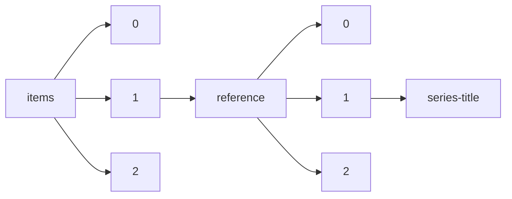

!!! warning "This document is not official Crossref documentation"
# Series-title
PATH = items/array/reference/array/series-title(1)  
Occurs 54 758 423 times  
Unique values: > 999  
{ .annotate }

1. A route to an element, for example:  
   The route "items/array/reference/array/series-title" corresponds to navigating through the JSON indices as  
   ["items"][0]["reference"][0]["series-title"]  

!!! note "Due to current limitations, only the first 1,000 unique values are counted."

| **Row** | **Value** `String`                                                                                | **Count** `Int64` |
|--------:|-----------------------------------------------------------------------------------------------------:|---------------------:|
| **1**   | Lecture Notes in Computer Science                                                                    | 836 583              |
| **2**   | J Neurosurg                                                                                          | 71 904               |
| **3**   | Lect Notes Comput Sci                                                                                | 42 236               |
| **4**   | Neurosurgery                                                                                         | 38 826               |
| **5**   | Lecture Notes in Artificial Intelligence                                                             | 38 367               |
| **6**   | R: A Language and Environment for Statistical Computing                                              | 34 436               |
| **7**   | Lecture Notes in Computer Science (Lecture Notes in Artificial Intelligence)                         | 26 630               |
| **8**   | LNCS                                                                                                 | 23 365               |
| **9**   | Molecular Cloning: A Laboratory Manual                                                               | 20 352               |
| **10**  | Proceedings of the IEEE Conference on Computer Vision and Pattern Recognition                        | 19 985               |
| **11**  | Technical Report                                                                                     | 19 542               |
| **12**  | Ph.D. Thesis                                                                                         | 18 750               |
| **13**  | Standard Methods for the Examination of Water and Wastewater                                         | 17 158               |
| **14**  | Lecture Notes in Mathematics                                                                         | 16 091               |
| **15**  | Advances in Neural Information Processing Systems                                                    | 14 175               |
| **16**  | Diagnostic and statistical manual of mental disorders                                                | 13 516               |
| **17**  | Diagnostic and Statistical Manual of Mental Disorders                                                | 13 451               |
| **18**  | J Am Vet Med Assoc                                                                                   | 13 239               |
| **19**  | Geological Society, London, Special Publications                                                     | 12 527               |
| **20**  | Official Methods of Analysis                                                                         | 11 089               |
| **21**  | Spine (Phila Pa 1976)                                                                                | 10 231               |
| **22**  | Stroke                                                                                               | 10 073               |
| **23**  | Communications in Computer and Information Science                                                   | 9 891                |
| **24**  | Thesis                                                                                               | 9 448                |
| **25**  | The Rat Brain in Stereotaxic Coordinates                                                             | 9 418                |
| **26**  | Working Paper                                                                                        | 8 696                |
| **27**  | Am J Vet Res                                                                                         | 8 507                |
| **28**  | Surg Neurol                                                                                          | 8 130                |
| **29**  | Advances in Intelligent Systems and Computing                                                        | 7 970                |
| **30**  | R: A language and environment for statistical computing                                              | 7 750                |
| **31**  | Neurology                                                                                            | 7 669                |
| **32**  | Statistical Methods                                                                                  | 7 519                |
| **33**  | Ph.D. thesis                                                                                         | 7 281                |
| **34**  | Graduate Texts in Mathematics                                                                        | 6 937                |
| **35**  | Geophys. Monogr. Ser.                                                                                | 6 840                |
| **36**  | LNAI                                                                                                 | 6 661                |
| **37**  | N Engl J Med                                                                                         | 6 630                |
| **38**  | European Conference on Computer Vision                                                               | 6 545                |
| **39**  | J. Climate                                                                                           | 6 448                |
| **40**  | Lecture Notes in Math.                                                                               | 6 219                |
| **41**  | CRC Handbook of Chemistry and Physics                                                                | 6 219                |
| **42**  | Statistical Power Analysis for the Behavioral Sciences                                               | 6 092                |
| **43**  | Acta Neurochir (Wien)                                                                                | 6 045                |
| **44**  | Methods of Enzymatic Analysis                                                                        | 5 985                |
| **45**  | Mon. Wea. Rev.                                                                                       | 5 845                |
| **46**  | Lecture Notes in Business Information Processing                                                     | 5 629                |
| **47**  | Methods in Enzymology                                                                                | 5 576                |
| **48**  | Statistical power analysis for the behavioral sciences                                               | 5 514                |
| **49**  | Spine                                                                                                | 5 495                |
| **50**  | Lancet                                                                                               | 5 430                |
| **51**  | J Neurol Neurosurg Psychiatry                                                                        | 5 414                |
| **52**  | J. Neurosurg.                                                                                        | 5 344                |
| **53**  | J. Atmos. Sci.                                                                                       | 5 321                |
| **54**  | AJNR Am J Neuroradiol                                                                                | 5 250                |
| **55**  | The Pharmacological Basis of Therapeutics                                                            | 5 186                |
| **56**  | Neurosurg Focus                                                                                      | 5 157                |
| **57**  | CVPR                                                                                                 | 5 157                |
| **58**  | Childs Nerv Syst                                                                                     | 5 135                |
| **59**  | PhD Thesis                                                                                           | 5 078                |
| **60**  | Radiology                                                                                            | 4 845                |
| **61**  | Proceedings of the IEEE International Conference on Computer Vision                                  | 4 827                |
| **62**  | Brain                                                                                                | 4 620                |
| **63**  | World Neurosurg                                                                                      | 4 523                |
| **64**  | Current Protocols in Molecular Biology                                                               | 4 445                |
| **65**  | Biostatistical Analysis                                                                              | 4 417                |
| **66**  | J Neurosurg Spine                                                                                    | 4 387                |
| **67**  | Lecture notes in computer science                                                                    | 4 202                |
| **68**  | J Neurosurg Pediatr                                                                                  | 4 036                |
| **69**  | Cancer                                                                                               | 3 996                |
| **70**  | Int J Radiat Oncol Biol Phys                                                                         | 3 956                |
| **71**  | J Vet Intern Med                                                                                     | 3 916                |
| **72**  | Principles of Fluorescence Spectroscopy                                                              | 3 846                |
| **73**  | Lecture Notes                                                                                        | 3 704                |
| **74**  | Multivariate Data Analysis                                                                           | 3 665                |
| **75**  | Science                                                                                              | 3 649                |
| **76**  | Fields Virology                                                                                      | 3 631                |
| **77**  | Proceedings of the IEEE conference on computer vision and pattern recognition                        | 3 605                |
| **78**  | International Conference on Machine Learning                                                         | 3 602                |
| **79**  | Geophys. Res. Lett.                                                                                  | 3 590                |
| **80**  | Official methods of analysis                                                                         | 3 480                |
| **81**  | PhD thesis                                                                                           | 3 394                |
| **82**  | Geophys. Monogr                                                                                      | 3 373                |
| **83**  | Nature                                                                                               | 3 361                |
| **84**  | JAMA                                                                                                 | 3 306                |
| **85**  | International Conference on Medical Image Computing and Computer-Assisted Intervention               | 3 264                |
| **86**  | Proceedings of the IEEE/CVF Conference on Computer Vision and Pattern Recognition                    | 3 257                |
| **87**  | Dissertation                                                                                         | 3 245                |
| **88**  | Ph.D. Dissertation                                                                                   | 3 185                |
| **89**  | IEEE Conference on Computer Vision and Pattern Recognition                                           | 3 097                |
| **90**  | Lect. Notes Math.                                                                                    | 3 081                |
| **91**  | Ph.D. dissertation                                                                                   | 3 072                |
| **92**  | Vet Surg                                                                                             | 3 044                |
| **93**  |                                                                                                      | 3 041                |
| **94**  | The rat brain in stereotaxic coordinates                                                             | 3 008                |
| **95**  | Epilepsia                                                                                            | 3 002                |
| **96**  | ACS Symposium                                                                                        | 2 949                |
| **97**  | SPE Annual Technical Conference and Exhibition                                                       | 2 945                |
| **98**  | Handbook of Chemistry and Physics                                                                    | 2 920                |
| **99**  | The Metabolic Basis of Inherited Disease                                                             | 2 885                |
| **100** | Arch Neurol                                                                                          | 2 884                |
| **101** | Nutrient Requirements of Dairy Cattle                                                                | 2 823                |
| **102** | IFIP Advances in Information and Communication Technology                                            | 2 822                |
| **103** | Eur Spine J                                                                                          | 2 797                |
| **104** | J. Geophys. Res.                                                                                     | 2 778                |
| **105** | Acta Neurochir                                                                                       | 2 766                |
| **106** | Working paper                                                                                        | 2 745                |
| **107** | HortScience                                                                                          | 2 730                |
| **108** | J Neurooncol                                                                                         | 2 679                |
| **109** | Equine Vet J                                                                                         | 2 625                |
| **110** | Lecture Notes in Physics                                                                             | 2 621                |
| **111** | Biometry                                                                                             | 2 617                |
| **112** | CCIS                                                                                                 | 2 606                |
| **113** | ACS Symposium Series                                                                                 | 2 603                |
| **114** | Bull. Amer. Meteor. Soc.                                                                             | 2 600                |
| **115** | Análise de conteúdo                                                                                  | 2 600                |
| **116** | Physics of Semiconductor Devices                                                                     | 2 594                |
| **117** | Advances in neural information processing systems                                                    | 2 545                |
| **118** | Biochemistry                                                                                         | 2 534                |
| **119** | Neuroradiology                                                                                       | 2 500                |
| **120** | Pediatr Neurosurg                                                                                    | 2 373                |
| **121** | Experiments in Molecular Genetics                                                                    | 2 282                |
| **122** | Quart. J. Roy. Meteor. Soc.                                                                          | 2 234                |
| **123** | Pure and Applied Mathematics                                                                         | 2 194                |
| **124** | Principles and Procedures of Statistics                                                              | 2 172                |
| **125** | Brain Res                                                                                            | 2 171                |
| **126** | Matrix Computations                                                                                  | 2 152                |
| **127** | Doctoral dissertation                                                                                | 2 139                |
| **128** | The Mathematics of Diffusion                                                                         | 2 115                |
| **129** | Proceedings of the IEEE Conference on Computer Vision and Pattern Recognition (CVPR)                 | 2 106                |
| **130** | Ann Neurol                                                                                           | 2 101                |
| **131** | Conduction of Heat in Solids                                                                         | 2 071                |
| **132** | R: a Language and Environment for Statistical Computing                                              | 2 049                |
| **133** | Nutrient Requirements of Poultry                                                                     | 2 038                |
| **134** | Vet Rec                                                                                              | 2 006                |
| **135** | Principal Component Analysis                                                                         | 1 981                |
| **136** | Sistema brasileiro de classificação de solos                                                         | 1 970                |
| **137** | Cancer Res                                                                                           | 1 961                |
| **138** | AIP Conference Proceedings                                                                           | 1 957                |
| **139** | Constitution of Binary Alloys                                                                        | 1 950                |
| **140** | Multivariate data analysis                                                                           | 1 933                |
| **141** | Statistical Principles in Experimental Design                                                        | 1 904                |
| **142** | Geol. Soc. Spec. Publ.                                                                               | 1 902                |
| **143** | Treatise on Geochemistry                                                                             | 1 886                |
| **144** | Spine J                                                                                              | 1 882                |
| **145** | J. Phys. Oceanogr.                                                                                   | 1 878                |
| **146** | StatPearls                                                                                           | 1 848                |
| **147** | ggplot2: Elegant Graphics for Data Analysis                                                          | 1 812                |
| **148** | LNBIP                                                                                                | 1 798                |
| **149** | The Enzymes                                                                                          | 1 774                |
| **150** | Ph. D. Thesis                                                                                        | 1 750                |
| **151** | Wea. Forecasting                                                                                     | 1 745                |
| **152** | Handbook of Mathematical Functions                                                                   | 1 741                |
| **153** | Technical report                                                                                     | 1 719                |
| **154** | Statistical methods                                                                                  | 1 715                |
| **155** | Transport Phenomena                                                                                  | 1 714                |
| **156** | J Neurotrauma                                                                                        | 1 692                |
| **157** | The Nature of Statistical Learning Theory                                                            | 1 679                |
| **158** | Deep Learning                                                                                        | 1 678                |
| **159** | Studies in Computational Intelligence                                                                | 1 676                |
| **160** | J Am Anim Hosp Assoc                                                                                 | 1 666                |
| **161** | J Bone Joint Surg Am                                                                                 | 1 664                |
| **162** | Psychometric theory                                                                                  | 1 660                |
| **163** | Design and Analysis of Experiments                                                                   | 1 651                |
| **164** | New Direction                                                                                        | 1 647                |
| **165** | Fundamentals of Heat and Mass Transfer                                                               | 1 611                |
| **166** | U.S. Geol. Surv. Prof. Pap.                                                                          | 1 607                |
| **167** | Br J Neurosurg                                                                                       | 1 596                |
| **168** | Clin Neurosurg                                                                                       | 1 595                |
| **169** | J. Amer. Soc. Hort. Sci.                                                                             | 1 593                |
| **170** | J Small Anim Pract                                                                                   | 1 575                |
| **171** | Geological Society, London, Memoirs                                                                  | 1 568                |
| **172** | Anesthesiology                                                                                       | 1 563                |
| **173** | Digital Image Processing                                                                             | 1 557                |
| **174** | Using multivariate statistics                                                                        | 1 550                |
| **175** | Arch. Neurol. Psychiat., Chicago                                                                     | 1 550                |
| **176** | PLoS One                                                                                             | 1 539                |
| **177** | Climate Dyn.                                                                                         | 1 513                |
| **178** | J Clin Neurosci                                                                                      | 1 503                |
| **179** | The Properties of Gases and Liquids                                                                  | 1 497                |
| **180** | Stereotact Funct Neurosurg                                                                           | 1 489                |
| **181** | IEEE Conference on Computer Vision and Pattern Recognition (CVPR)                                    | 1 467                |
| **182** | Theory of Elasticity                                                                                 | 1 464                |
| **183** | J Trauma                                                                                             | 1 464                |
| **184** | SCI                                                                                                  | 1 456                |
| **185** | A Stereotaxic Atlas of the Rat Brain                                                                 | 1 454                |
| **186** | Numerical Heat Transfer and Fluid Flow                                                               | 1 454                |
| **187** | Laryngoscope                                                                                         | 1 433                |
| **188** | Vet Clin North Am Small Anim Pract                                                                   | 1 424                |
| **189** | R: a language and environment for statistical computing                                              | 1 423                |
| **190** | Psychometric Theory                                                                                  | 1 421                |
| **191** | Introduction to Solid State Physics                                                                  | 1 405                |
| **192** | Physical Chemistry                                                                                   | 1 403                |
| **193** | NATO ASI Series                                                                                      | 1 397                |
| **194** | SSSA Book Ser. 5                                                                                     | 1 373                |
| **195** | Vet Radiol Ultrasound                                                                                | 1 359                |
| **196** | Methods of Soil Analysis                                                                             | 1 333                |
| **197** | Lecture Notes in Networks and Systems                                                                | 1 332                |
| **198** | ICCV                                                                                                 | 1 318                |
| **199** | Molecular Cloning                                                                                    | 1 309                |
| **200** | Manual of Clinical Microbiology                                                                      | 1 309                |
| **201** | Infrared and Raman Spectra of Inorganic and Coordination Compounds                                   | 1 305                |
| **202** | Acta Neuropathol                                                                                     | 1 291                |
| **203** | AJNR                                                                                                 | 1 276                |
| **204** | J Clin Endocrinol Metab                                                                              | 1 269                |
| **205** | Geological Society, London, Special Publication                                                      | 1 268                |
| **206** | IOP Conference Series: Materials Science and Engineering                                             | 1 230                |
| **207** | Contemp. Math.                                                                                       | 1 229                |
| **208** | Pediatrics                                                                                           | 1 229                |
| **209** | Ann Surg                                                                                             | 1 219                |
| **210** | The Bacteriophage Lambda                                                                             | 1 215                |
| **211** | Tech. Rep.                                                                                           | 1 212                |
| **212** | Twentieth Symposium (International) on Combustion                                                    | 1 211                |
| **213** | AISC                                                                                                 | 1 199                |
| **214** | Eighteenth Symposium (International) on Combustion                                                   | 1 185                |
| **215** | J Cereb Blood Flow Metab                                                                             | 1 181                |
| **216** | Тр. МИАН                                                                                             | 1 179                |
| **217** | AAAI                                                                                                 | 1 171                |
| **218** | HortTechnology                                                                                       | 1 166                |
| **219** | J Clin Oncol                                                                                         | 1 151                |
| **220** | J Neuropathol Exp Neurol                                                                             | 1 137                |
| **221** | ECCV                                                                                                 | 1 136                |
| **222** | Proceedings of the European Conference on Computer Vision                                            | 1 129                |
| **223** | Am J Physiol                                                                                         | 1 127                |
| **224** | Ordinary Differential Equations                                                                      | 1 124                |
| **225** | Twenty-Second Symposium (International) on Combustion                                                | 1 115                |
| **226** | Exp Neurol                                                                                           | 1 108                |
| **227** | Functional Analysis                                                                                  | 1 099                |
| **228** | Econometric Analysis of Cross Section and Panel Data                                                 | 1 093                |
| **229** | Plast Reconstr Surg                                                                                  | 1 085                |
| **230** | Climate Change 2013: The Physical Science Basis. Contribution of Working Group I to the Fifth Assess | 1 083                |
| **231** | Electrochemical Methods: Fundamentals and Applications                                               | 1 083                |
| **232** | Principles of Optics                                                                                 | 1 073                |
| **233** | Statistical Mechanics                                                                                | 1 072                |
| **234** | Proceedings of the European Conference on Computer Vision (ECCV)                                     | 1 070                |
| **235** | The Finite Element Method                                                                            | 1 069                |
| **236** | Econometric Analysis                                                                                 | 1 067                |
| **237** | Applied Mathematical Sciences                                                                        | 1 064                |
| **238** | International Conference on Learning Representations                                                 | 1 049                |
| **239** | Progress in Mathematics                                                                              | 1 049                |
| **240** | Graph Theory                                                                                         | 1 042                |
| **241** | Mathematical Surveys and Monographs                                                                  | 1 040                |
| **242** | Elements of X-ray Diffraction                                                                        | 1 023                |
| **243** | O desafio do conhecimento: pesquisa qualitativa em saúde                                             | 1 020                |
| **244** | Immunocytochemistry                                                                                  | 1 018                |
| **245** | Statistical principles in experimental design                                                        | 1 017                |
| **246** | Lecture Notes in Bioinformatics                                                                      | 1 003                |
| **247** | Annals of Mathematics Studies                                                                        | 987                  |
| **248** | Cambridge Studies in Advanced Mathematics                                                            | 987                  |
| **249** | Handbook of X-ray Photoelectron Spectroscopy                                                         | 985                  |
| **250** | Circulation                                                                                          | 983                  |
| **251** | Proceedings o                                                                                        | 970                  |
| **252** | Diffusion of Innovations                                                                             | 968                  |
| **253** | Ann. Surg.                                                                                           | 957                  |
| **254** | Spectrometric Identification of Organic Compounds                                                    | 949                  |
| **255** | Geochemistry of Hydrothermal Ore Deposits                                                            | 947                  |
| **256** | NIPS                                                                                                 | 946                  |
| **257** | Enzymes                                                                                              | 943                  |
| **258** | Sixteenth Symposium (International) on Combustion                                                    | 937                  |
| **259** | J. Geophys. Res. Atmos.                                                                              | 936                  |
| **260** | Case Study Research: Design and Methods                                                              | 934                  |
| **261** | Principles of Polymer Chemistry                                                                      | 934                  |
| **262** | J Neurosci                                                                                           | 932                  |
| **263** | Virology                                                                                             | 930                  |
| **264** | Table of isotopes                                                                                    | 930                  |
| **265** | Physiology of the Gastrointestinal Tract                                                             | 926                  |
| **266** | J Biol Chem                                                                                          | 916                  |
| **267** | Acta Hort.                                                                                           | 916                  |
| **268** | Fifteenth Symposium (International) on Combustion                                                    | 916                  |
| **269** | The Kidney                                                                                           | 915                  |
| **270** | Lecture Notes in Math                                                                                | 914                  |
| **271** | Neuroimage                                                                                           | 913                  |
| **272** | Twenty-Third Symposium (International) on Combustion                                                 | 910                  |
| **273** | Intermolecular and Surface Forces                                                                    | 905                  |
| **274** | Surgery                                                                                              | 904                  |
| **275** | J Spinal Disord Tech                                                                                 | 891                  |
| **276** | Antibodies: A Laboratory Manual                                                                      | 888                  |
| **277** | Nonlinear Systems                                                                                    | 886                  |
| **278** | Arch Neurol Psychiatry                                                                               | 879                  |
| **279** | Twenty-First Symposium (International) on Combustion                                                 | 879                  |
| **280** | Nineteenth Symposium (International) on Combustion                                                   | 875                  |
| **281** | Matrix Analysis                                                                                      | 869                  |
| **282** | Endocrinology                                                                                        | 851                  |
| **283** | Lecture Notes in Mechanical Engineering                                                              | 843                  |
| **284** | IFIP AICT                                                                                            | 843                  |
| **285** | Nonparametric Statistics for the Behavioral Sciences                                                 | 842                  |
| **286** | Clin Orthop                                                                                          | 841                  |
| **287** | Acta Neurochir Suppl                                                                                 | 840                  |
| **288** | AJR                                                                                                  | 839                  |
| **289** | Journal of Clinical Endocrinology and Metabolism                                                     | 831                  |
| **290** | Proc Natl Acad Sci USA                                                                               | 830                  |
| **291** | Flavins and Flavoproteins                                                                            | 829                  |
| **292** | Plant Physiol.                                                                                       | 825                  |
| **293** | Advances in Agronomy                                                                                 | 824                  |
| **294** | U.S. Geological Survey Professional Paper                                                            | 822                  |
| **295** | Personal communication                                                                               | 820                  |
| **296** | NATO ASI Seri                                                                                        | 817                  |
| **297** | Proceedings of the Advances in Neural Information Processing Systems                                 | 816                  |
| **298** | Clin Neurol Neurosurg                                                                                | 812                  |
| **299** | Molecular cloning: a laboratory manual                                                               | 811                  |
| **300** | Quantum Mechanics                                                                                    | 793                  |
| **301** | Seventeenth Symposium (International) on Combustion                                                  | 788                  |
| **302** | Am J Trop Med Hyg                                                                                    | 787                  |
| **303** | Geodyn. Ser.                                                                                         | 787                  |
| **304** | Pain                                                                                                 | 786                  |
| **305** | J Bone Joint Surg (Am)                                                                               | 785                  |
| **306** | Research Report                                                                                      | 783                  |
| **307** | Br Med J                                                                                             | 781                  |
| **308** | Standard methods for the examination of water and wastewater                                         | 780                  |
| **309** | Principles and procedures of statistics                                                              | 780                  |
| **310** | The PyMOL Molecular Graphics System                                                                  | 773                  |
| **311** | Solid State Physics                                                                                  | 770                  |
| **312** | Agron. Monogr. 9                                                                                     | 758                  |
| **313** | Anesth Analg                                                                                         | 754                  |
| **314** | Cochrane Handbook for Systematic Reviews of Interventions                                            | 753                  |
| **315** | Spec. Pap. Geol. Soc. Am.                                                                            | 753                  |
| **316** | Pediatric Surgery                                                                                    | 752                  |
| **317** | Fourteenth Symposium (International) on Combustion                                                   | 740                  |
| **318** | Proceedings of the SIGCHI Conference on Human Factors in Computing Systems                           | 737                  |
| **319** | Diseases of Poultry                                                                                  | 734                  |
| **320** | Mov Disord                                                                                           | 734                  |
| **321** | Lect. Notes Comput. Sci.                                                                             | 731                  |
| **322** | J. Amer. med. Ass.                                                                                   | 727                  |
| **323** | AJCC Cancer Staging Manual                                                                           | 727                  |
| **324** | Neuro Oncol                                                                                          | 725                  |
| **325** | Regras para análise de sementes                                                                      | 725                  |
| **326** | Tenth Symposium (International) on Combustion                                                        | 722                  |
| **327** | Principles and Practice of Sleep Medicine                                                            | 720                  |
| **328** | Report                                                                                               | 717                  |
| **329** | ACS Symp. Ser                                                                                        | 715                  |
| **330** | Neurosurg Rev                                                                                        | 713                  |
| **331** | Manual de métodos de análise de solo                                                                 | 709                  |
| **332** | Enzyme Kinetics                                                                                      | 709                  |
| **333** | Principles and practice of structural equation modeling                                              | 708                  |
| **334** | Case report                                                                                          | 707                  |
| **335** | Acta Neurol Scand                                                                                    | 705                  |
| **336** | Computers and Intractability: A Guide to the Theory of NP-Completeness                               | 702                  |
| **337** | Diss.                                                                                                | 699                  |
| **338** | The Metabolic and Molecular Bases of Inherited Disease                                               | 698                  |
| **339** | Neurochirurgie                                                                                       | 698                  |
| **340** | Asteroids                                                                                            | 696                  |
| **341** | International                                                                                        | 692                  |
| **342** | IARC Scientif                                                                                        | 687                  |
| **343** | Fourth Symposium (International) on Combustion                                                       | 686                  |
| **344** | IOP Conference Series: Earth and Environmental Science                                               | 681                  |
| **345** | Classification and Regression Trees                                                                  | 680                  |
| **346** | Arch Surg                                                                                            | 679                  |
| **347** | Fluid Mechanics                                                                                      | 679                  |
| **348** | Clin Orthop Relat Res                                                                                | 677                  |
| **349** | Advances in Organic Geochemistry 1981                                                                | 675                  |
| **350** | Frontiers in Catecholamine Research                                                                  | 669                  |
| **351** | Thirteenth Symposium (International) on Combustion                                                   | 668                  |
| **352** | Introduction to mediation, moderation, and conditional process analysis: A regression-based approach | 666                  |
| **353** | Proc Natl Acad Sci U S A                                                                             | 666                  |
| **354** | The Merck Index                                                                                      | 663                  |
| **355** | ICML                                                                                                 | 663                  |
| **356** | J Neurochem                                                                                          | 662                  |
| **357** | Proceedings of the IEEE/CVF International Conference on Computer Vision                              | 659                  |
| **358** | Theor. Appl. Genet.                                                                                  | 657                  |
| **359** | Principles and practice of sleep medicine                                                            | 653                  |
| **360** | Table of Isotopes                                                                                    | 653                  |
| **361** | Vet Anaesth Analg                                                                                    | 646                  |
| **362** | Peripheral Neuropathy                                                                                | 639                  |
| **363** | Methods in Molecular Biology                                                                         | 633                  |
| **364** | Proceedings of the CVPR                                                                              | 627                  |
| **365** | Twenty-Fourth Symposium (International) on Combustion                                                | 623                  |
| **366** | RNA Polymerase                                                                                       | 622                  |
| **367** | Circ Res                                                                                             | 621                  |
| **368** | J Vet Pharmacol Ther                                                                                 | 620                  |
| **369** | Free Radicals in Biology and Medicine                                                                | 617                  |
| **370** | Neurol Med Chir (Tokyo)                                                                              | 613                  |
| **371** | Annual Book of Standards                                                                             | 609                  |
| **372** | J Comp Neurol                                                                                        | 601                  |
| **373** | The Nature of the Chemical Bond                                                                      | 601                  |
| **374** | Nematology                                                                                           | 598                  |
| **375** | Contemporary Research Methods in Neuroanatomy                                                        | 595                  |
| **376** | Procedures in Nucleic Acid Research                                                                  | 593                  |
| **377** | Urology                                                                                              | 593                  |
| **378** | ASTM STP                                                                                             | 591                  |
| **379** | Electroencephalogr Clin Neurophysiol                                                                 | 589                  |
| **380** | Lecture Notes in Control and Information Sciences                                                    | 587                  |
| **381** | J Neurol Sci                                                                                         | 587                  |
| **382** | Advances in C                                                                                        | 586                  |
| **383** | M.S. Thesis                                                                                          | 586                  |
| **384** | Proc. Natl. Acad. Sci. USA                                                                           | 585                  |
| **385** | GABA in Nervous System Function                                                                      | 582                  |
| **386** | Mem. Geol. Soc. Am.                                                                                  | 580                  |
| **387** | Nutrient requirements of dairy cattle                                                                | 579                  |
| **388** | Applied Logistic Regression                                                                          | 577                  |
| **389** | Psychopharmacology: A Generation of Progress                                                         | 573                  |
| **390** | Encyclopedia                                                                                         | 573                  |
| **391** | Harrison's Principles of Internal Medicine                                                           | 571                  |
| **392** | The University Series in Higher Mathematics                                                          | 570                  |
| **393** | IAHS Publicat                                                                                        | 569                  |
| **394** | thesis                                                                                               | 569                  |
| **395** | Neurol Res                                                                                           | 569                  |
| **396** | The metabolic basis of inherited disease                                                             | 568                  |
| **397** | Eleventh Symposium (International) on Combustion                                                     | 567                  |
| **398** | Principles and Practice of Infectious Diseases                                                       | 567                  |
| **399** | Lecture Notes in Electrical Engineering                                                              | 567                  |
| **400** | Crit Care Med                                                                                        | 564                  |
| **401** | AIP Conf. Proc.                                                                                      | 561                  |
| **402** | Marine Anthropogenic Litter                                                                          | 560                  |
| **403** | Handbook of Physiology                                                                               | 558                  |
| **404** | Diplomarbeit                                                                                         | 554                  |
| **405** | Otolaryngol Head Neck Surg                                                                           | 552                  |
| **406** | IEEE International Conference on Computer Vision                                                     | 549                  |
| **407** | Surg Gynecol Obstet                                                                                  | 545                  |
| **408** | Goodman and Gilman's The Pharmacological Basis of Therapeutics                                       | 541                  |
| **409** | Official Methods of Analysis of AOAC International                                                   | 540                  |
| **410** | Vet J                                                                                                | 535                  |
| **411** | The Physiology of Reproduction                                                                       | 535                  |
| **412** | Grundlehren der Mathematischen Wissenschaften [Fundamental Principles of Mathematical Sciences]      | 534                  |
| **413** | Twenty-Sixth Symposium (International) on Combustion                                                 | 534                  |
| **414** | Lecture Notes in Economics and Mathematical Systems                                                  | 528                  |
| **415** | Developments in Hydrobiology                                                                         | 528                  |
| **416** | Twelfth Symposium (International) on Combustion                                                      | 527                  |
| **417** | J Craniofac Surg                                                                                     | 527                  |
| **418** | Ninth Symposium (International) on Combustion                                                        | 526                  |
| **419** | Handbook of Algal Science, Technology and Medicine                                                   | 526                  |
| **420** | Maurice Ewing S                                                                                      | 524                  |
| **421** | Fundamental Techniques in Virology                                                                   | 520                  |
| **422** | The Principles of Nuclear Magnetism                                                                  | 519                  |
| **423** | Biostatistical analysis                                                                              | 518                  |
| **424** | Atlas of Tumor Pathology                                                                             | 517                  |
| **425** | Multiple regression: Testing and interpreting interactions                                           | 515                  |
| **426** | J Neurointerv Surg                                                                                   | 511                  |
| **427** | Pattern Recognition and Machine Learning                                                             | 511                  |
| **428** | Computer Simulation of Liquids                                                                       | 509                  |
| **429** | Neurol Med Chir                                                                                      | 509                  |
| **430** | Ciba Foundation Symposium                                                                            | 507                  |
| **431** | Binary Alloy Phase Diagrams                                                                          | 503                  |
| **432** | J Neurophysiol                                                                                       | 501                  |
| **433** | Microsomes and Drug Oxidations                                                                       | 498                  |
| **434** | Advances in Organic Geochemistry                                                                     | 495                  |
| **435** | Proceedings of the AAAI Conference on Artificial Intelligence                                        | 495                  |
| **436** | Crystal Growth                                                                                       | 495                  |
| **437** | Theory of Dislocations                                                                               | 494                  |
| **438** | Ann Intern Med                                                                                       | 492                  |
| **439** | London Math. Soc. Lecture Note Ser.                                                                  | 492                  |
| **440** | J. Atmos. Oceanic Technol.                                                                           | 491                  |
| **441** | Op. cit                                                                                              | 490                  |
| **442** | Solar Engineering of Thermal Processes                                                               | 490                  |
| **443** | Ribosomes                                                                                            | 489                  |
| **444** | Manual of clinical microbiology                                                                      | 489                  |
| **445** | The Rat Brain                                                                                        | 486                  |
| **446** | Topics Appl. Phys.                                                                                   | 484                  |
| **447** | The Stopping and Range of Ions in Solids                                                             | 483                  |
| **448** | Theory of Plates and Shells                                                                          | 482                  |
| **449** | Statistical Physics                                                                                  | 481                  |
| **450** | Crop Sci.                                                                                            | 481                  |
| **451** | Proceedings of IEEE Conference on Computer Vision and Pattern Recognition                            | 480                  |
| **452** | The pharmacological basis of therapeutics                                                            | 476                  |
| **453** | Diário Oficial da União                                                                              | 476                  |
| **454** | Using Multivariate Statistics                                                                        | 474                  |
| **455** | Am J Pathol                                                                                          | 473                  |
| **456** | Proc. Int. Conf. on Wear of Materials                                                                | 473                  |
| **457** | The United States Pharmacopeia                                                                       | 471                  |
| **458** | The Hypothalamus                                                                                     | 471                  |
| **459** | Sixth Symposium (International) on Combustion                                                        | 470                  |
| **460** | J. Neurol. Neurosurg. Psychiat.                                                                      | 469                  |
| **461** | IJCAI                                                                                                | 469                  |
| **462** | Progr. Math.                                                                                         | 469                  |
| **463** | Proceedings of the American Control Conference                                                       | 469                  |
| **464** | Mayo Clin Proc                                                                                       | 466                  |
| **465** | Principles and practice of infectious diseases                                                       | 466                  |
| **466** | Methods in Yeast Genetics                                                                            | 465                  |
| **467** | Publ.                                                                                                | 464                  |
| **468** | London Mathematical Society Lecture Note Series                                                      | 464                  |
| **469** | Int. Astron. Union Symp.                                                                             | 464                  |
| **470** | Frontiers in Neuroendocrinology                                                                      | 462                  |
| **471** | Vet Pathol                                                                                           | 461                  |
| **472** | Metallurgical Thermochemistry                                                                        | 458                  |
| **473** | J Appl Physiol                                                                                       | 457                  |
| **474** | J Comput Assist Tomogr                                                                               | 456                  |
| **475** | J Pediatr                                                                                            | 455                  |
| **476** | Dermatology in general medicine                                                                      | 455                  |
| **477** | Viral Hepatitis and Liver Disease                                                                    | 454                  |
| **478** | BD:OAS                                                                                               | 454                  |
| **479** | The Rat Nervous System                                                                               | 453                  |
| **480** | Chemical Neuroanatomy                                                                                | 452                  |
| **481** | J Clin Invest                                                                                        | 450                  |
| **482** | Ciba Foundati                                                                                        | 450                  |
| **483** | The Thalamus                                                                                         | 447                  |
| **484** | Heat Transfer                                                                                        | 447                  |
| **485** | Radiative Transfer                                                                                   | 445                  |
| **486** | J. Geophys. Res. Oceans                                                                              | 445                  |
| **487** | Childs Brain                                                                                         | 442                  |
| **488** | 2nd ed.                                                                                              | 442                  |
| **489** | Neurology (Minneap)                                                                                  | 441                  |
| **490** | Neurosurg Clin N Am                                                                                  | 439                  |
| **491** | Selected Methods in Cellular Immunology                                                              | 437                  |
| **492** | JANAF Thermochemical Tables                                                                          | 432                  |
| **493** | NMR of Proteins and Nucleic Acids                                                                    | 432                  |
| **494** | J Dairy Sci                                                                                          | 427                  |
| **495** | Contact Mechanics                                                                                    | 426                  |
| **496** | Comparative Endocrinology                                                                            | 426                  |
| **497** | Arch. Surg., Chicago                                                                                 | 426                  |
| **498** | Surg. Gynec. Obstet.                                                                                 | 425                  |
| **499** | Atmos. Chem. Phys.                                                                                   | 425                  |
| **500** | Br J Surg                                                                                            | 424                  |
| **501** | Eur. Space Agen                                                                                      | 422                  |
| **502** | Molecular Cloning. A Laboratory Manual                                                               | 421                  |
| **503** | J. Neuropath. exp. Neurol.                                                                           | 419                  |
| **504** | Smart Innovation, Systems and Technologies                                                           | 417                  |
| **505** | Vaccines                                                                                             | 417                  |
| **506** | Blood                                                                                                | 416                  |
| **507** | J. Appl. Meteor. Climatol.                                                                           | 416                  |
| **508** | Experimental Immunochemistry                                                                         | 416                  |
| **509** | Seventh Symposium (International) on Combustion                                                      | 416                  |
| **510** | Cerâmica                                                                                             | 416                  |
| **511** | The Fractal Geometry of Nature                                                                       | 416                  |
| **512** | Springer Series in Statistics                                                                        | 414                  |
| **513** | Doctoral Dissertation                                                                                | 413                  |
| **514** | J Bone Joint Surg (Br)                                                                               | 408                  |
| **515** | U.S. Geol. Surv. Bull.                                                                               | 407                  |
| **516** | Lecture Notes of the Institute for Computer Sciences, Social Informatics and Telecommunications Engi | 407                  |
| **517** | International conference on machine learning                                                         | 407                  |
| **518** | ENTCS                                                                                                | 406                  |
| **519** | Acta Physiol Scand                                                                                   | 404                  |
| **520** | Am J Surg                                                                                            | 404                  |
| **521** | No Shinkei Geka                                                                                      | 402                  |
| **522** | Quantum mechanics                                                                                    | 401                  |
| **523** | Backscattering Spectrometry                                                                          | 400                  |
| **524** | Design and analysis of experiments                                                                   | 395                  |
| **525** | JPL Publ.                                                                                            | 395                  |
| **526** | Twenty-Fifth Symposium (International) on Combustion                                                 | 395                  |
| **527** | Br J Radiol                                                                                          | 394                  |
| **528** | Ph. D. thesis                                                                                        | 392                  |
| **529** | Elements of Information Theory                                                                       | 392                  |
| **530** | Special Publications                                                                                 | 392                  |
| **531** | Principles and Practice of Structural Equation Modeling                                              | 392                  |
| **532** | Proceedings of the IEEE international conference on computer vision                                  | 392                  |
| **533** | Minim Invasive Neurosurg                                                                             | 392                  |
| **534** | New Engl. J. Med.                                                                                    | 392                  |
| **535** | Partial Differential Equations                                                                       | 391                  |
| **536** | Cell                                                                                                 | 388                  |
| **537** | AIAA Education Series                                                                                | 388                  |
| **538** | Advanced Inorganic Chemistry                                                                         | 385                  |
| **539** | Anim. Behav.                                                                                         | 383                  |
| **540** | Fractional Differential Equations                                                                    | 381                  |
| **541** | Viscoelastic Properties of Polymers                                                                  | 380                  |
| **542** | Computer Vision and Pattern Recognition                                                              | 379                  |
| **543** | Campbell’s Urology                                                                                   | 378                  |
| **544** | Análise de alimentos: métodos químicos e biológicos                                                  | 377                  |
| **545** | Alpha-, beta- and gamma-ray spectroscopy                                                             | 376                  |
| **546** | Arch Pathol                                                                                          | 376                  |
| **547** | Molecular Cloning, A Laboratory Manual                                                               | 376                  |
| **548** | Neurology, Minneap.                                                                                  | 375                  |
| **549** | Classical Electrodynamics                                                                            | 375                  |
| **550** | European conference on computer vision                                                               | 370                  |
| **551** | Perturbation Theory for Linear Operators                                                             | 370                  |
| **552** | Scientia Hort.                                                                                       | 370                  |
| **553** | Textbook of Veterinary Internal Medicine                                                             | 369                  |
| **554** | Vet Ophthalmol                                                                                       | 369                  |
| **555** | Physiology of the gastrointestinal tract                                                             | 369                  |
| **556** | Recommended dietary allowances.                                                                      | 367                  |
| **557** | J Immunol                                                                                            | 364                  |
| **558** | Master's thesis                                                                                      | 363                  |
| **559** | Springer Series in Computational Mathematics                                                         | 362                  |
| **560** | Rev Neurol                                                                                           | 358                  |
| **561** | Mechanics of Composite Materials                                                                     | 357                  |
| **562** | Nonlinear Control Systems                                                                            | 354                  |
| **563** | J. Expt. Bot.                                                                                        | 354                  |
| **564** | Origin and Distribution of the Elements                                                              | 353                  |
| **565** | J. Neurophysiol.                                                                                     | 353                  |
| **566** | Kainic Acid as a Tool in Neurobiology                                                                | 352                  |
| **567** | Proc. ICASSP                                                                                         | 352                  |
| **568** | Climate Change 2007: The Physical Science Basis. Contribution of Working Group I to the Fourth Asses | 347                  |
| **569** | J Clin Microbiol                                                                                     | 346                  |
| **570** | Fish Physiology                                                                                      | 345                  |
| **571** | Purification of Laboratory Chemicals                                                                 | 343                  |
| **572** | The Biochemistry of Glycoproteins and Proteoglycans                                                  | 343                  |
| **573** | Nutritional ecology of the ruminant                                                                  | 342                  |
| **574** | Surg Forum                                                                                           | 338                  |
| **575** | Reticular Formation of the Brain                                                                     | 336                  |
| **576** | Molecular Theory of Gases and Liquids                                                                | 336                  |
| **577** | The Chromosomes in Human Cancer and Leukemia                                                         | 334                  |
| **578** | Lambda II                                                                                            | 333                  |
| **579** | Inequalities                                                                                         | 331                  |
| **580** | Amer. J. Physiol.                                                                                    | 329                  |
| **581** | Am J Med                                                                                             | 329                  |
| **582** | J Bone Joint Surg                                                                                    | 328                  |
| **583** | Gaussian 09                                                                                          | 328                  |
| **584** | IBP Handbook                                                                                         | 328                  |
| **585** | Neuroscience                                                                                         | 325                  |
| **586** | Crustaceana                                                                                          | 324                  |
| **587** | The Rat Brain: A Stereotaxic Atlas of the Forebrain and Lower Parts of the Brain Stem                | 322                  |
| **588** | Psychopharmacology: The Third Generation of Progress                                                 | 321                  |
| **589** | Finite Element Procedures in Engineering Analysis                                                    | 319                  |
| **590** | Paper presented at the annual meeting of the American Educational Research Association               | 319                  |
| **591** | Neurobiology of Cerebellar Evolution and Development                                                 | 318                  |
| **592** | The IEEE Conference on Computer Vision and Pattern Recognition (CVPR)                                | 317                  |
| **593** | Agronomy 9                                                                                           | 316                  |
| **594** | SAS User's Guide: Statistics                                                                         | 315                  |
| **595** | Proc. CVPR                                                                                           | 315                  |
| **596** | Avian Physiology                                                                                     | 313                  |
| **597** | Doctoral Thesis                                                                                      | 313                  |
| **598** | ICLR                                                                                                 | 312                  |
| **599** | Archs Neurol. Psychiat., Chicago                                                                     | 312                  |
| **600** | DNA Replication                                                                                      | 311                  |
| **601** | Am J Dis Child                                                                                       | 310                  |
| **602** | Amphetamines and Related Compounds                                                                   | 309                  |
| **603** | Pharmacokinetics                                                                                     | 309                  |
| **604** | Lect. Notes in Math.                                                                                 | 309                  |
| **605** | Advances in Organic Geochemistry 1979                                                                | 308                  |
| **606** | Brit. med. J.                                                                                        | 307                  |
| **607** | J Anim Sci                                                                                           | 307                  |
| **608** | J. Agr. Food Chem.                                                                                   | 306                  |
| **609** | Meteorite Research                                                                                   | 306                  |
| **610** | DSM-III: Diagnostic and Statistical Manual of Mental Disorders                                       | 305                  |
| **611** | Aquatic Chemistry                                                                                    | 305                  |
| **612** | Arch Ophthalmol                                                                                      | 303                  |
| **613** | Special Publi                                                                                        | 300                  |
| **614** | Operative Hand Surgery                                                                               | 300                  |
| **615** | Gut Hormones                                                                                         | 299                  |
| **616** | Proceedings of the IEEE International Conference on Robotics and Automation                          | 298                  |
| **617** | SAS® User’s Guide: Statistics                                                                        | 297                  |
| **618** | Ecological Studies                                                                                   | 294                  |
| **619** | Edição Standard Brasileira das Obras Psicológicas Completas de Sigmund Freud                         | 294                  |
| **620** | Pain review                                                                                          | 294                  |
| **621** | Methods of soil analysis                                                                             | 294                  |
| **622** | U.S. Geol. Surv                                                                                      | 294                  |
| **623** | The Prokaryotes                                                                                      | 294                  |
| **624** | Proc. Sympos. Pure Math.                                                                             | 291                  |
| **625** | Tumors of the Eye                                                                                    | 289                  |
| **626** | J. Adv. Model. Earth Syst.                                                                           | 288                  |
| **627** | Heart Disease                                                                                        | 288                  |
| **628** | The Photosynthetic Bacteria                                                                          | 288                  |
| **629** | Eighth Symposium (International) on Combustion                                                       | 288                  |
| **630** | Opiates and Endogenous Opioid Peptides                                                               | 288                  |
| **631** | Oral Pathology                                                                                       | 286                  |
| **632** | Fifth Symposium (International) on Combustion                                                        | 286                  |
| **633** | Can Vet J                                                                                            | 286                  |
| **634** | Physical Metallurgy                                                                                  | 286                  |
| **635** | Campbell's Urology                                                                                   | 284                  |
| **636** | StatPearls [Internet]                                                                                | 282                  |
| **637** | Cochrane handbook for systematic reviews of interventions                                            | 280                  |
| **638** | Plant Dis.                                                                                           | 280                  |
| **639** | Physical Chemistry of Surfaces                                                                       | 280                  |
| **640** | Finite Groups                                                                                        | 279                  |
| **641** | Anat Rec                                                                                             | 279                  |
| **642** | Dev Med Child Neurol                                                                                 | 277                  |
| **643** | Rehabilitation of the Hand                                                                           | 276                  |
| **644** | Astérisque                                                                                           | 275                  |
| **645** | Arch Neurol Psychiat                                                                                 | 275                  |
| **646** | Journal of Physics: Conference Series                                                                | 271                  |
| **647** | J Neurol Neurosurg Psychiat                                                                          | 271                  |
| **648** | NBER Working Paper                                                                                   | 271                  |
| **649** | Pattern Classification                                                                               | 271                  |
| **650** | J. Am. med. Ass.                                                                                     | 268                  |
| **651** | Can J Neurol Sci                                                                                     | 268                  |
| **652** | Convex Optimization                                                                                  | 268                  |
| **653** | Proteases and Biological Control                                                                     | 268                  |
| **654** | Basic Mechanisms of the Epilepsies                                                                   | 268                  |
| **655** | Progress in Astronautics and Aeronautics                                                             | 268                  |
| **656** | Advances in Organic Geochemistry 1985                                                                | 267                  |
| **657** | AORN Standards and Recommended Practices for Perioperative Nursing                                   | 265                  |
| **658** | Geological Society, London, Engineering Geology Special Publications                                 | 265                  |
| **659** | M.Sc. Thesis                                                                                         | 265                  |
| **660** | Springer Ser. Opt. Sci.                                                                              | 264                  |
| **661** | The Juvenile Hormones                                                                                | 264                  |
| **662** | Appl Neurophysiol                                                                                    | 263                  |
| **663** | Sci. Hort.                                                                                           | 261                  |
| **664** | Keys to Soil Taxonomy                                                                                | 261                  |
| **665** | Spec. Publ.                                                                                          | 261                  |
| **666** | Otol Neurotol                                                                                        | 261                  |
| **667** | System Identification: Theory for the User                                                           | 259                  |
| **668** | Superconductivity                                                                                    | 258                  |
| **669** | Diagnostic and Statistical Manual of Mental Disorders, 4th edition (DSM-IV)                          | 255                  |
| **670** | Sensory Communication                                                                                | 255                  |
| **671** | United States Pharmacopeia                                                                           | 250                  |
| **672** | Physiol. Plant.                                                                                      | 247                  |
| **673** | J Cell Biol                                                                                          | 246                  |
| **674** | Endodontics                                                                                          | 245                  |
| **675** | J Urol                                                                                               | 245                  |
| **676** | Lecture Notes in Comput                                                                              | 244                  |
| **677** | The Mathematical Theory of Plasticity                                                                | 243                  |
| **678** | Proc. Int. Conf. on nuclear structure                                                                | 243                  |
| **679** | Acta radiol., Stockh.                                                                                | 242                  |
| **680** | Dermatology                                                                                          | 240                  |
| **681** | Valence Instabilities                                                                                | 240                  |
| **682** | Proceedings of the IEEE International Conference on Computer Vision (ICCV)                           | 240                  |
| **683** | Тр. ММО                                                                                              | 240                  |
| **684** | Euphytica                                                                                            | 238                  |
| **685** | Revista Brasileira de Ensino de Física                                                               | 238                  |
| **686** | Amer. J. Roentgenol.                                                                                 | 237                  |
| **687** | Arch Intern Med                                                                                      | 237                  |
| **688** | Ann NY Acad Sci                                                                                      | 237                  |
| **689** | Fundamentals of Tropical Freshwater Wetlands: From Ecology to Conservation Management                | 236                  |
| **690** | Rev. neurol.                                                                                         | 236                  |
| **691** | J. Hydrometeor.                                                                                      | 236                  |
| **692** | Pattern Classification and Scene Analysis                                                            | 234                  |
| **693** | Труды МИАН                                                                                           | 234                  |
| **694** | Molecular Biology of the Cell                                                                        | 234                  |
| **695** | Grundlehren Math. Wiss.                                                                              | 234                  |
| **696** | Encyclopedia of Volcanoes                                                                            | 233                  |
| **697** | Theory of the Stability of Lyophobic Colloids                                                        | 233                  |
| **698** | Jupiter                                                                                              | 233                  |
| **699** | Society and the adolescent self-image                                                                | 232                  |
| **700** | Glycoproteins                                                                                        | 232                  |
| **701** | Studies in Logic and the Foundations of Mathematics                                                  | 232                  |
| **702** | Archs Neurol., Chicago                                                                               | 232                  |
| **703** | Social Research Methods                                                                              | 231                  |
| **704** | Numerical Recipes                                                                                    | 231                  |
| **705** | Proc. 7th Intern. Vacuum Congr. and 3rd Intern. Conf. on Solid Surfaces                              | 231                  |
| **706** | Adaptation in Natural and Artificial Systems                                                         | 230                  |
| **707** | Boundary Layer Theory                                                                                | 228                  |
| **708** | Scaling Concepts in Polymer Physics                                                                  | 227                  |
| **709** | Asteroids II                                                                                         | 227                  |
| **710** | Catalog of Chromosome Aberrations in Cancer                                                          | 226                  |
| **711** | PCR Protocols: A Guide to Methods and Applications                                                   | 225                  |
| **712** | op. cit.                                                                                             | 225                  |
| **713** | J Spinal Disord                                                                                      | 224                  |
| **714** | The Structure and Chemistry of Solid Surfaces                                                        | 223                  |
| **715** | Geological Society of America, Special Papers                                                        | 222                  |
| **716** | The Heart                                                                                            | 222                  |
| **717** | Geol. Soc. Spec. Publ. London                                                                        | 221                  |
| **718** | Theoretical nuclear physics                                                                          | 220                  |
| **719** | Arch Otolaryngol                                                                                     | 220                  |
| **720** | Encyclopedia of Mathematics and its Applications                                                     | 220                  |
| **721** | J Nucl Med                                                                                           | 219                  |
| **722** | J Neurol                                                                                             | 219                  |
| **723** | Clinical Pediatric Urology                                                                           | 219                  |
| **724** | Methods of Hormone Radioimmunoassay                                                                  | 219                  |
| **725** | Neurochirurgia                                                                                       | 219                  |
| **726** | Histopathology of the skin                                                                           | 216                  |
| **727** | xsl:apply-templates mode="copyref"/>                                                                 | 216                  |
| **728** | SAS User’s Guide: Statistics                                                                         | 215                  |
| **729** | J Bone Joint Surg Br                                                                                 | 214                  |
| **730** | Principles of optics                                                                                 | 213                  |
| **731** | Standard Methods for the Examination of Dairy Products                                               | 212                  |
| **732** | Ann. Bot. (Lond.)                                                                                    | 212                  |
| **733** | Transl. Math. Monogr.                                                                                | 211                  |
| **734** | Brit. J. Surg.                                                                                       | 211                  |
| **735** | System Identification                                                                                | 211                  |
| **736** | Some Basic Problems of the Mathematical Theory of Elasticity                                         | 210                  |
| **737** | PLoS ONE                                                                                             | 210                  |
| **738** | Fluvial Sedimentology                                                                                | 209                  |
| **739** | Low Energy Electron Diffraction                                                                      | 209                  |
| **740** | Proceedings of the International Conference on Machine Learning                                      | 209                  |
| **741** | J Pharmacol Exp Ther                                                                                 | 209                  |
| **742** | Psychotherapy by Reciprocal Inhibition                                                               | 207                  |
| **743** | Zootaxa                                                                                              | 206                  |
| **744** | Neuronal Plasticity                                                                                  | 204                  |
| **745** | Adaptive Control                                                                                     | 201                  |
| **746** | J. Bone Jt. Surg.                                                                                    | 200                  |
| **747** | J Exp Med                                                                                            | 200                  |
| **748** | Mem. geol. Surv. U.K.                                                                                | 200                  |
| **749** | Soil Sampling and Methods of Analysis                                                                | 200                  |
| **750** | Arthritis Rheum                                                                                      | 198                  |
| **751** | Magn Reson Med                                                                                       | 198                  |
| **752** | Current Therapy in Equine Medicine                                                                   | 196                  |
| **753** | Grundlehren der mathematischen Wissenschaften [Fundamental Principles of Mathematical Sciences]      | 195                  |
| **754** | Studies in Fuzziness and Soft Computing                                                              | 195                  |
| **755** | Paraplegia                                                                                           | 195                  |
| **756** | Malar J                                                                                              | 194                  |
| **757** | Neurosci Lett                                                                                        | 193                  |
| **758** | Plant Cell                                                                                           | 193                  |
| **759** | Graduate Studies in Mathematics                                                                      | 193                  |
| **760** | Light Metals                                                                                         | 192                  |
| **761** | Proceedings of the Ocean Drilling Program                                                            | 192                  |
| **762** | BMDP Statistical Software                                                                            | 192                  |
| **763** | WHO Classification of Tumours of Haematopoietic and Lymphoid Tissues                                 | 191                  |
| **764** | Int J Cancer                                                                                         | 191                  |
| **765** | Amorphous and Liquid Semiconductors                                                                  | 191                  |
| **766** | Data Reduction and Error Analysis for the Physical Sciences                                          | 191                  |
| **767** | Supergravity                                                                                         | 191                  |
| **768** | Proc. 7th Lunar Sci. Conf.                                                                           | 190                  |
| **769** | Organic Geochemistry                                                                                 | 190                  |
| **770** | British National Formulary                                                                           | 189                  |
| **771** | Astronomical Society of the Pacific Conference Series                                                | 189                  |
| **772** | Asteroids III                                                                                        | 189                  |
| **773** | Obras completas                                                                                      | 189                  |
| **774** | AJCC cancer staging manual                                                                           | 188                  |
| **775** | IAHS Publ.                                                                                           | 188                  |
| **776** | The Design and Analysis of Computer Algorithms                                                       | 187                  |
| **777** | NATO ASI Ser.                                                                                        | 187                  |
| **778** | Statistical Learning Theory                                                                          | 187                  |
| **779** | PhD Dissertation                                                                                     | 187                  |
| **780** | Hematology                                                                                           | 186                  |
| **781** | Mem. Geol. Soc.                                                                                      | 186                  |
| **782** | Manometric Techniques                                                                                | 185                  |
| **783** | Initial Reports of the Deep Sea Drilling Project                                                     | 184                  |
| **784** | Arch Dis Child                                                                                       | 183                  |
| **785** | The Early History of the Earth                                                                       | 183                  |
| **786** | AAPG Mem.                                                                                            | 183                  |
| **787** | Grad. Texts in Math.                                                                                 | 182                  |
| **788** | SIGMOD                                                                                               | 181                  |
| **789** | Clin Cancer Res                                                                                      | 181                  |
| **790** | Springer Seri                                                                                        | 179                  |
| **791** | Textbook of Small Animal Surgery                                                                     | 179                  |
| **792** | Geological Society of America Memoir                                                                 | 179                  |
| **793** | Planta                                                                                               | 179                  |
| **794** | Am J Roentgenol Radium Ther Nucl Med                                                                 | 178                  |
| **795** | Bacterial Photosynthesis                                                                             | 178                  |
| **796** | Br J Cancer                                                                                          | 176                  |
| **797** | Electrolyte Solutions                                                                                | 176                  |
| **798** | Recommended Dietary Allowances                                                                       | 176                  |
| **799** | Superstring theory                                                                                   | 176                  |
| **800** | New York Times                                                                                       | 176                  |
| **801** | Res. Publ. Ass. nerv. ment. Dis.                                                                     | 175                  |
| **802** | Precambrian Plate Tectonics                                                                          | 175                  |
| **803** | Physical Chemistry of Macromolecules                                                                 | 174                  |
| **804** | Angular momentum in quantum mechanics                                                                | 174                  |
| **805** | Solar Energy Thermal Processes                                                                       | 173                  |
| **806** | Am J Otol                                                                                            | 173                  |
| **807** | American Association of Petroleum Geologists, Memoir                                                 | 172                  |
| **808** | Adsorption, Surface Area and Porosity                                                                | 172                  |
| **809** | U.S. Geol. Surv. Prof Pap.                                                                           | 172                  |
| **810** | Anatomical Neuroendocrinology                                                                        | 172                  |
| **811** | Constr. Build. Mater.                                                                                | 171                  |
| **812** | Br J Anaesth                                                                                         | 171                  |
| **813** | European Conference on Computer Vision (ECCV)                                                        | 171                  |
| **814** | Postharvest Biol. Technol.                                                                           | 171                  |
| **815** | Mathematics in Science and Engineering                                                               | 171                  |
| **816** | Med Sci Sports Exerc                                                                                 | 170                  |
| **817** | J Biomech                                                                                            | 170                  |
| **818** | Arch Phys Med Rehabil                                                                                | 170                  |
| **819** | Mplus user's guide                                                                                   | 168                  |
| **820** | GeneReviews                                                                                          | 168                  |
| **821** | J Neuropath Exp Neurol                                                                               | 167                  |
| **822** | Protective Groups in Organic Synthesis                                                               | 166                  |
| **823** | Combustion Chemistry                                                                                 | 166                  |
| **824** | Am J Ophthalmol                                                                                      | 166                  |
| **825** | Arch. Path.                                                                                          | 166                  |
| **826** | American Association of Petroleum Geologists Memoir                                                  | 166                  |
| **827** | Antarct. Res. Ser.                                                                                   | 165                  |
| **828** | Iterative Methods for Sparse Linear Systems                                                          | 164                  |
| **829** | Cancer: Principles and Practice of Oncology                                                          | 164                  |
| **830** | IARC Sci. Pub.                                                                                       | 164                  |
| **831** | Colour Atlas of Ectomycorrhizae                                                                      | 163                  |
| **832** | J Physiol                                                                                            | 163                  |
| **833** | Prog Brain Res                                                                                       | 162                  |
| **834** | Therapeutic Drugs                                                                                    | 162                  |
| **835** | IAU Symp.                                                                                            | 162                  |
| **836** | Elementary particle theory                                                                           | 160                  |
| **837** | Electroenceph. clin. Neurophysiol.                                                                   | 160                  |
| **838** | AORN Standards and Recommended Practices                                                             | 160                  |
| **839** | Arch. Neurol., Chicago                                                                               | 159                  |
| **840** | American Mathematical Society Colloquium Publications, Vol. 31                                       | 158                  |
| **841** | Springer Ser. Chem. Phys.                                                                            | 158                  |
| **842** | Diagnostic and Statistical Manual of Mental Disorders, 3rd edition-revised (DSM-III-R)               | 158                  |
| **843** | New Phytol.                                                                                          | 157                  |
| **844** | Proc. of IEEE Visualization                                                                          | 156                  |
| **845** | Oncogene                                                                                             | 156                  |
| **846** | Hydrodynamics                                                                                        | 155                  |
| **847** | Experimental Brain Research,                                                                         | 154                  |
| **848** | Vet Parasitol                                                                                        | 154                  |
| **849** | Pathology of Tumours of the Nervous System                                                           | 153                  |
| **850** | The National Formulary                                                                               | 153                  |
| **851** | Large animal internal medicine                                                                       | 151                  |
| **852** | Studies in Surface Science and Catalysis                                                             | 151                  |
| **853** | Handbook of Clinical Neurology                                                                       | 150                  |
| **854** | Oxford Mathematical Monographs                                                                       | 149                  |
| **855** | Endliche Gruppen I                                                                                   | 145                  |
| **856** | J Natl Cancer Inst                                                                                   | 145                  |
| **857** | Organic Chemistry                                                                                    | 145                  |
| **858** | J Strength Cond Res                                                                                  | 145                  |
| **859** | Adv Neurol                                                                                           | 144                  |
| **860** | Personal files of R.R. Robinson                                                                      | 143                  |
| **861** | Geological Society of America Special Paper                                                          | 142                  |
| **862** | American Control Conference                                                                          | 141                  |
| **863** | Amer. J. Surg.                                                                                       | 140                  |
| **864** | Molecular Cloning: a Laboratory Manual                                                               | 139                  |
| **865** | Acta Radiol                                                                                          | 139                  |
| **866** | J. Hort. Sci. Biotechnol.                                                                            | 139                  |
| **867** | Lecture Notes in Comput. Sci.                                                                        | 138                  |
| **868** | Journal of Sport Management,                                                                         | 136                  |
| **869** | Biopharmaceutics and Pharmacokinetics Considerations                                                 | 136                  |
| **870** | Handbook of the psychology of aging                                                                  | 136                  |
| **871** | Proc. roy. Soc. Med.                                                                                 | 136                  |
| **872** | Surgical Treatment of the Epilepsies                                                                 | 135                  |
| **873** | Am J Roentgenol                                                                                      | 134                  |
| **874** | The Sea                                                                                              | 133                  |
| **875** | Inorganic Electronic Spectroscopy                                                                    | 133                  |
| **876** | Mem. Amer. Math. Soc.                                                                                | 132                  |
| **877** | Epilepsy Res                                                                                         | 131                  |
| **878** | Plant Sci.                                                                                           | 130                  |
| **879** | Meteorites and the Early Solar System                                                                | 130                  |
| **880** | NK Cells and Other Natural Effector Cells                                                            | 129                  |
| **881** | Trans Am Neurol Assoc                                                                                | 129                  |
| **882** | Proc. Apollo 11 Lunar Sci. Conf.                                                                     | 128                  |
| **883** | Neuroreport                                                                                          | 127                  |
| **884** | Fundamental Immunology                                                                               | 127                  |
| **885** | Zoology                                                                                              | 127                  |
| **886** | Proceedings of Interspeech                                                                           | 127                  |
| **887** | LNCS (LNAI)                                                                                          | 127                  |
| **888** | J Neurosurg Sci                                                                                      | 127                  |
| **889** | EMIS Datareviews Series                                                                              | 126                  |
| **890** | 1                                                                                                    | 125                  |
| **891** | Proc. Chem. Soc.                                                                                     | 123                  |
| **892** | Dermatology in General Medicine                                                                      | 123                  |
| **893** | Ph.D. diss.                                                                                          | 123                  |
| **894** | Statistical Methods.                                                                                 | 123                  |
| **895** | International Compressor Engineering Conference                                                      | 122                  |
| **896** | NASA Ref. Publ.                                                                                      | 121                  |
| **897** | Probit Analysis                                                                                      | 121                  |
| **898** | Труды по дискретной математике                                                                       | 120                  |
| **899** | Third Symposium on Combustion, Flame and Explosion Phenomena                                         | 119                  |
| **900** | Zentralbl Neurochir                                                                                  | 119                  |
| **901** | AJR Am J Roentgenol                                                                                  | 119                  |
| **902** | J Physiol (Lond)                                                                                     | 118                  |
| **903** | U.S. Geological Survey Bulletin                                                                      | 118                  |
| **904** | Clin. Neurosurg.                                                                                     | 118                  |
| **905** | Modelos biométricos aplicados ao melhoramento genético                                               | 118                  |
| **906** | Inst. Phys. C                                                                                        | 117                  |
| **907** | Infectious Diseases of the Dog and Cat                                                               | 116                  |
| **908** | European Journal of Endocrinology                                                                    | 115                  |
| **909** | Gaussian 09, Revision D.01                                                                           | 115                  |
| **910** | J. Path. Bact.                                                                                       | 115                  |
| **911** | Progress in Infertility                                                                              | 115                  |
| **912** | Advances in Organic Geochemistry 1983                                                                | 115                  |
| **913** | DNA Insertion Elements, Plasmids and Episomes                                                        | 112                  |
| **914** | Journal of Nematology                                                                                | 112                  |
| **915** | Тр. МИАН СССР                                                                                        | 112                  |
| **916** | Surfactant Science Series                                                                            | 111                  |
| **917** | Clin Radiol                                                                                          | 111                  |
| **918** | Amer. J. Bot.                                                                                        | 111                  |
| **919** | SAE paper                                                                                            | 111                  |
| **920** | Advanced Organic Chemistry                                                                           | 110                  |
| **921** | The teacher's word book of 30,000 words                                                              | 108                  |
| **922** | Clin Endocrinol (Oxf)                                                                                | 108                  |
| **923** | Advances in Organic Geochemistry 1987                                                                | 108                  |
| **924** | The Geology of Continental Margins                                                                   | 107                  |
| **925** | Electron Microscopy of Thin Crystals                                                                 | 106                  |
| **926** | Plant Cell Environ.                                                                                  | 104                  |
| **927** | Unpublished doctoral dissertation                                                                    | 104                  |
| **928** | WHO classification of tumours of haematopoietic and lymphoid tissues                                 | 104                  |
| **929** | Report to RIFM                                                                                       | 103                  |
| **930** | Harrison's principles of internal medicine                                                           | 102                  |
| **931** | Trans. Amer. neurol. Ass.                                                                            | 101                  |
| **932** | Proc. IEEE MEMS Workshop                                                                             | 101                  |
| **933** | CONGRESSO BRASILEIRO DE ENTOMOLOGIA                                                                  | 100                  |
| **934** | Plant J.                                                                                             | 100                  |
| **935** | IEEE Transactions on Power Systems                                                                   | 99                   |
| **936** | Thrust and Nappe Tectonics                                                                           | 99                   |
| **937** | THE REQUISITES                                                                                       | 98                   |
| **938** | Folding and Fracturing of Rocks                                                                      | 98                   |
| **939** | Agron. J.                                                                                            | 97                   |
| **940** | Infrared Spectra of Inorganic and Coordination Compounds                                             | 97                   |
| **941** | Am J Clin Pathol                                                                                     | 97                   |
| **942** | INIS-mf-13811                                                                                        | 97                   |
| **943** | Oxidases and Related Redox Systems                                                                   | 96                   |
| **944** | Standard                                                                                             | 96                   |
| **945** | Continental Basalts and Mantle Xenoliths                                                             | 95                   |
| **946** | Exp Brain Res                                                                                        | 94                   |
| **947** | Am J Surg Pathol                                                                                     | 94                   |
| **948** | IEEE/CVF Conference on Computer Vision and Pattern Recognition (CVPR)                                | 94                   |
| **949** | Textbook of pain                                                                                     | 92                   |
| **950** | Cognitive Technologies                                                                               | 92                   |
| **951** | COST-IRACON                                                                                          | 92                   |
| **952** | Proc. IEEE-SP ATHOS Workshop on Higher-Order Statistics                                              | 91                   |
| **953** | Ch 7                                                                                                 | 91                   |
| **954** | Deep-Water Contourite Systems: Modern Drifts and Ancient Series, Seismic and Sedimentary Characteris | 90                   |
| **955** | The Rat Brain. A Stereotaxic Atlas of the Forebrain and Lower Parts of the Brain Stem                | 90                   |
| **956** | Thermoplastic elastomers                                                                             | 89                   |
| **957** | Animal Toxins                                                                                        | 89                   |
| **958** | Gynecol Oncol                                                                                        | 89                   |
| **959** | Brit Med J                                                                                           | 89                   |
| **960** | The Behaviour of Domestic Animals                                                                    | 89                   |
| **961** | U.S. Geol. Surv. Prof. Paper                                                                         | 89                   |
| **962** | Atomic Structure Calculations                                                                        | 88                   |
| **963** | Nucleic Acids Res.                                                                                   | 87                   |
| **964** | Am. J. Roentg.                                                                                       | 87                   |
| **965** | American Orthopaedic Foot and Ankle Society, 23rd Annual Summer Meeting, Final Program, vol. 23      | 86                   |
| **966** | Proc. of ACM SIGGRAPH                                                                                | 86                   |
| **967** | Biennial report 2000–2001                                                                            | 86                   |
| **968** | CSD Communication                                                                                    | 86                   |
| **969** | Proc. International Conference on Parallel Processing                                                | 85                   |
| **970** | Handbook of qualitative research                                                                     | 85                   |
| **971** | Textbook of veterinary internal medicine                                                             | 84                   |
| **972** | AESF SUR/FIN '98                                                                                     | 84                   |
| **973** | Lab Invest                                                                                           | 83                   |
| **974** | VLDB                                                                                                 | 83                   |
| **975** | Paper presented at the meeting of the American Psychological Association                             | 83                   |
| **976** | Am J Sports Med                                                                                      | 81                   |
| **977** | Lecture Notes in Computer Science (Including Subseries Lecture Notes in Artificial Intelligence and  | 80                   |
| **978** | J. Hydrol.                                                                                           | 80                   |
| **979** | Lecture Notes in Civil Engineering                                                                   | 79                   |
| **980** | J. Geophys. Res                                                                                      | 79                   |
| **981** | J Nutr                                                                                               | 79                   |
| **982** | Feeds and Feeding                                                                                    | 79                   |
| **983** | Arch Neurol (Chicago)                                                                                | 78                   |
| **984** | IEDM tech dig                                                                                        | 78                   |
| **985** | American Orthopaedic Foot and Ankle Society, 21st Annual Summer Meeting Program, vol. 21             | 77                   |
| **986** | Lancet Neurol                                                                                        | 77                   |
| **987** | INIS-mf-13345                                                                                        | 77                   |
| **988** | Arthritis and Allied Conditions                                                                      | 77                   |
| **989** | Carnegie Inst                                                                                        | 77                   |
| **990** | Comprehensive                                                                                        | 77                   |
| **991** | Physical Studies of Minor Planets                                                                    | 76                   |
| **992** | Advanced Dairy Chemistry                                                                             | 76                   |
| **993** | Rehabilitation of the hand and upper extremity                                                       | 76                   |
| **994** | Proc. IEEE-SP Workshop on Higher-Order Statistics                                                    | 76                   |
| **995** | Ecological studies                                                                                   | 76                   |
| **996** | Annual Book of ASTM Standards                                                                        | 76                   |
| **997** | Ann Otol Rhinol Laryngol                                                                             | 75                   |
| **998** | Lunar and Plane                                                                                      | 75                   |
| **999** | American Orthopaedic Foot and Ankle Society, 16th Annual Summer Meeting, Final Program               | 75                   |
| ... | ... | ... |

