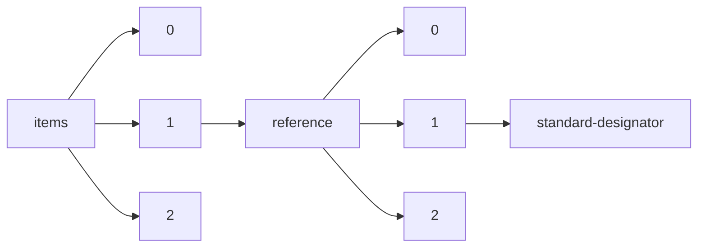

!!! warning "This document is not official Crossref documentation"
# Standard-designator
PATH = items/array/reference/array/standard-designator(1)  
Occurs 1 times  
Unique values: 1  
{ .annotate }

1. A route to an element, for example:  
   The route "items/array/reference/array/standard-designator" corresponds to navigating through the JSON indices as  
   ["items"][0]["reference"][0]["standard-designator"]  

| **Row** | **Value** `String`                                              | **Count** `Int64` |
|--------:|-------------------------------------------------------------------:|---------------------:|
| **1**   | http://www.everychildmatters.gov.uk/health/teenagepregnancy/about/ | 1                    |

