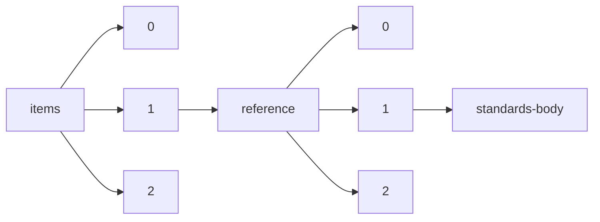

!!! warning "This document is not official Crossref documentation"
# Standards-body
PATH = items/array/reference/array/standards-body(1)  
Occurs 6 times  
Unique values: 4  
{ .annotate }

1. A route to an element, for example:  
   The route "items/array/reference/array/standards-body" corresponds to navigating through the JSON indices as  
   ["items"][0]["reference"][0]["standards-body"]  

| **Row** | **Value** `String`                                         | **Count** `Int64` |
|--------:|--------------------------------------------------------------:|---------------------:|
| **1**   | International Electrotechnical CommissionIEC                  | 2                    |
| **2**   | International Commission on Radiological ProtectionICRP       | 2                    |
| **3**   | National Electrical Manufacturers AssociationNEMA             | 1                    |
| **4**   | National Council on Radiation Protection and MeasurementsNCRP | 1                    |

