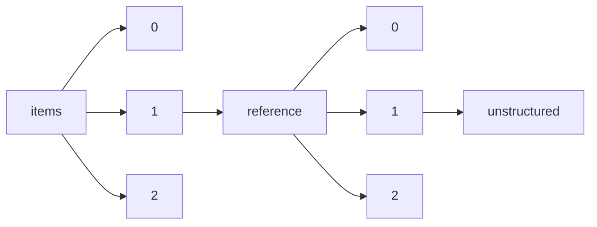

!!! warning "This document is not official Crossref documentation"
# Unstructured
PATH = items/array/reference/array/unstructured(1)  
Occurs 550 372 973 times  
Unique values: > 999  
{ .annotate }

1. A route to an element, for example:  
   The route "items/array/reference/array/unstructured" corresponds to navigating through the JSON indices as  
   ["items"][0]["reference"][0]["unstructured"]  

!!! note "Due to current limitations, strings longer than 1,000 characters are truncated, which may lead to inaccurate calculations."

!!! note "Due to current limitations, only the first 1,000 unique values are counted."

| **Row** | **Value** `String`                                                                                         | **Count** `Int64` |
|--------:|--------------------------------------------------------------------------------------------------------------:|---------------------:|
| **1**   |                                                                                                               | 748 778              |
| **2**   |                                                                                                               | 137 319              |
| **3**   | MISSING-VALUE                                                                                                 | 80 798               |
| **4**   | CrossRef                                                                                                      | 9 518                |
| **5**   | Ibid.                                                                                                         | 9 309                |
| **6**   | Id.                                                                                                           | 4 006                |
| **7**   | COMMUNICATION                                                                                                 | 3 457                |
| **8**   | In                                                                                                            | 3 132                |
| **9**   | l. c.                                                                                                         | 2 617                |
| **10**  | a. a. O.                                                                                                      | 2 239                |
| **11**  | </citation>                                                                                                   | 2 119                |
| **12**  | .                                                                                                             | 2 107                |
| **13**  | Lowry , 0. H. , N. J. Rosebrough , A. L. Farr , and R. J. Randall . 1951 . Protein measurement with           | 1 630                |
| **14**  | private communication.                                                                                        | 1 587                |
| **15**  | Laemmli , U. K. 1970 . Cleavage of structural proteins during the assembly of the head of bacterioph          | 1 561                |
| **16**  | Maniatis T. E. F. Fritsch and J. Sambrook. 1982. Molecular cloning: a laboratory manual. Cold Spring          | 1 557                |
| **17**  | Greathead DJ Greathead AH 1992. Biological control of insect pests by insect parasitoids and predato          | 1 449                |
| **18**  | and , to be published.                                                                                        | 1 410                |
| **19**  | MUREAV Mutation Research 1964-                                                                                | 1 404                |
| **20**  | Miller J. H. 1972. Experiments in molecular genetics. Cold Spring Harbor Laboratory Cold Spring Harb          | 1 395                |
| **21**  | Deleted in proof                                                                                              | 1 363                |
| **22**  | Sanger , F. , S. Nicklen , and A. R. Coulson . 1977 . DNA sequencing with chain-terminating inhibito          | 1 351                |
| **23**  | UNPUBLISHED                                                                                                   | 1 235                |
| **24**  | Sambrook\nJ.\nFritsch\nE. F.\nManiatis\nT.\nMolecular cloning: a laboratory manual\n2nd ed.\n1989\nCold Sprin | 1 233                |
| **25**  | 3                                                                                                             | 1 188                |
| **26**  | Audi, G., Wapstra, A.H., Thibault, C.: Nucl. Phys. A 729 (2003) 337.                                          | 1 109                |
| **27**  | Ibid                                                                                                          | 1 097                |
| **28**  | PERSONAL COMMUNICATION                                                                                        | 1 046                |
| **29**  | to be published.                                                                                              | 1 016                |
| **30**  | loc. cit.                                                                                                     | 997                  |
| **31**  | 2                                                                                                             | 997                  |
| **32**  | Sambrook J. E. F. Fritsch and T. Maniatis. 1989. Molecular cloning: a laboratory manual 2nd ed. Cold          | 944                  |
| **33**  | TXAPA9 Toxicology and Applied Pharmacology 1959-                                                              | 913                  |
| **34**  | , and , to be published.                                                                                      | 851                  |
| **35**  | u. , unveröffentlicht.                                                                                        | 817                  |
| **36**  | CNREA8 Cancer Research 1941-                                                                                  | 803                  |
| **37**  | -                                                                                                             | 774                  |
| **38**  | and to be published.                                                                                          | 742                  |
| **39**  | JPETAB Journal of Pharmacology and Experimental Therapeutics                                                  | 726                  |
| **40**  | ARZNAD Arzneimittel-Forschung. Drug Research 1951-                                                            | 711                  |
| **41**  | NTIS\*\* National Technical Information Service                                                               | 660                  |
| **42**  | Loc. cit.                                                                                                     | 656                  |
| **43**  | et al.                                                                                                        | 653                  |
| **44**  | unpublished results.                                                                                          | 653                  |
| **45**  | : Personal communication.                                                                                     | 620                  |
| **46**  | 'Glossary of class names of organic compounds and reactivity intermediates based on structure (IUPAC          | 599                  |
| **47**  | and unpublished results.                                                                                      | 595                  |
| **48**  | CSLNX\* U.S. Army Armament Research & Development Command, Chemical Systems Laboratory, NIOSH Exchang         | 572                  |
| **49**  | Tuli, J.K.: Nuclear Wallet Cards (7th ed.). BNL., N.-Y, 2005.                                                 | 535                  |
| **50**  | 'Glossary of terms used in physical organic chemistry (IUPAC Recommendations 1994)' Pure and Applied          | 512                  |
| **51**  | Company information,                                                                                          | 491                  |
| **52**  | unpublished.                                                                                                  | 491                  |
| **53**  | Reference deleted.                                                                                            | 488                  |
| **54**  | JMCMAR Journal of Medicinal Chemistry 1963-                                                                   | 484                  |
| **55**  | Schotman CYL 1989. Plant pests of quarantine importance to the Caribbean. RLAC-PROVEG No. 21:80 pp.           | 483                  |
| **56**  | </ref>                                                                                                        | 477                  |
| **57**  | Stone, N.J.: Rept. INDC(NDS)-0594 (2011).                                                                     | 451                  |
| **58**  | , unveröffentlicht.                                                                                           | 450                  |
| **59**  | Ebd.                                                                                                          | 443                  |
| **60**  | Sambrook J. E. F. Fritsch and T. Maniatis. 1989. Molecular cloning: a laboratory manual 2nd ed. Cold          | 442                  |
| **61**  | View at:                                                                                                      | 437                  |
| **62**  | This page intentionally left blank                                                                            | 436                  |
| **63**  | EPPO 2014. PQR database. Paris France: European and Mediterranean Plant Protection Organization. htt          | 431                  |
| **64**  | Hanelt, P., 2001: Mansfeld’s encyclopedia of agricultural and horticultural crops (excepted ornament          | 431                  |
| **65**  | Pretsch, E., Bühlmann, P., Affolter, C.: Structure Determination of Organic Compounds, Tables of Spe          | 423                  |
| **66**  | Sambrook\nJ.\nFritsch\nE. F.\nManiatis\nT.\nMolecular cloning: a laboratory manual\n2nd ed.\n1989\nCold Sprin | 414                  |
| **67**  | The Nordic Cochrane Centre, The Cochrane Collaboration Review Manager (RevMan) 2011                           | 405                  |
| **68**  | unveröffentlicht.                                                                                             | 401                  |
| **69**  | 0                                                                                                             | 401                  |
| **70**  | personal communication.                                                                                       | 384                  |
| **71**  | International Journal of Academic Research in Progressive Education and                                       | 377                  |
| **72**  | Development                                                                                                   | 377                  |
| **73**  | Schultze-Motel, J. (ed), 1986: Rudolf Mansfeld’s Verzeichnis landwirtschaftlicher und gärtnerischer           | 373                  |
| **74**  | Uphof, J.C.Th., 1968: Dictionary of economic plants. Verlag J. Cramer Lehre, 2. edn., 591 pp                  | 372                  |
| **75**  | FCTXAV Food and Cosmetics Toxicology 1963- 81                                                                 | 360                  |
| **76**  | and Operations in Challenging Environments © 2010 ASCE                                                        | 355                  |
| **77**  | Bradford , M. M. 1976 . A rapid and sensitive method for the quantitation of microgram quantities of          | 351                  |
| **78**  | u. , a. a. O.                                                                                                 | 347                  |
| **79**  | Erhardt, W., E. Götz, N. Bödeker, S. Seybold: 2000, 2002: ZANDER. Handwörterbuch der Pflanzennamen.           | 346                  |
| **80**  | Green Book: IUPAC Quantities, Units and Symbols in Physical Chemistry. Second Edition, Blackwell Sci          | 345                  |
| **81**  | , , and , to be published.                                                                                    | 343                  |
| **82**  | and in preparation.                                                                                           | 342                  |
| **83**  | Litvinov, Yu.A., Geissel, H., Radon, T., Attallah, F., Audi, G., Beckert, K., Bosch, F., Falch, M.,           | 340                  |
| **84**  | 'Glossary of atmospheric chemistry terms (Recommendations 1990)' Pure and Applied Chemistry, 1990, 6          | 340                  |
| **85**  | American Psychiatric Association. (1994). Diagnostic and statistical manual of mental disorders (4th          | 336                  |
| **86**  | Mughabghab, S.F.: Atlas of Neutron Resonances, 5th ed., Elsevier, The Netherland, 2006.                       | 328                  |
| **87**  | Id                                                                                                            | 312                  |
| **88**  | Cohen, E.R., Cvitaš, T., Frey, J.G., Holmström, B., Kuchitsu, K., Marquardt, R., Mills, I., Pavese,           | 303                  |
| **89**  | FRIDERICIA, L. S. 1926 Report on refection at XII Int. Congress on Physiol. Stockholm Skand. Arch.,           | 297                  |
| **90**  | BROWNING, E. 1931 The vitamins. Monograph, Pickett-Thomson Research Laboratory, vol. 1, p. 278.               | 297                  |
| **91**  | 0.                                                                                                            | 296                  |
| **92**  | Orange Book: IUPAC Compendium of Analytical Nomenclature. Second Edition, Blackwell Scientific Publi          | 284                  |
| **93**  | Deleted in proof.                                                                                             | 284                  |
| **94**  | The Nordic Cochrane Centre, The Cochrane Collaboration Review Manager (RevMan) 2008                           | 284                  |
| **95**  | persönliche Mitteilung.                                                                                       | 284                  |
| **96**  | Sheldrick, G. M. (1996). SADABS. University of Göttingen, Germany.                                            | 281                  |
| **97**  | Yanisch-Perron , C. , J. Vieira , and J. Messing . 1985 . Improved M13 phage cloning vectors and hos          | 279                  |
| **98**  | 'Glossary of terms used in photochemistry (IUPAC Recommendations 1996)' Pure and Applied Chemistry,           | 275                  |
| **99**  | Birnboim , H. C. , and J. Doly . 1979 . A rapid alkaline extraction procedure for screening recombin          | 275                  |
| **100** | 2000                                                                                                          | 273                  |
| **101** | Southern , E. M. 1975 . Detection of specific sequences among DNA fragments separated by gel electro          | 268                  |
| **102** | (GSP 199) © 2010 ASCE                                                                                         | 264                  |
| **103** | et al. In                                                                                                     | 261                  |
| **104** | Letters following this symbol are a WSSA-approved computer code from Composite List of Weeds, Revise          | 260                  |
| **105** | Seidemann, J., 1993c: Würzmittel-Lexikon. Ein alphabetisches Nachschlagwerk von Abelmoschussamen bis          | 256                  |
| **106** | ibid                                                                                                          | 251                  |
| **107** | and unpublished.                                                                                              | 250                  |
| **108** | IN PREPARATION                                                                                                | 244                  |
| **109** | Täufel, A., L. Tunger, W. Ternes, M. Zobel, 1993: Lebensmittel-Lexikon. Verlag B. Behr’s Hamburg, 2.          | 243                  |
| **110** | References                                                                                                    | 241                  |
| **111** | Zeven, A.C., J.M.J. de Wet, 1982: Dictionary of cultivated plants and their centres of diversity. Ex          | 238                  |
| **112** | Cited by Lewis (1906) [194].                                                                                  | 236                  |
| **113** | J. Kaler , stars.astro.illinois.edu/sow/sowlist.html.                                                         | 236                  |
| **114** | J. Nanson , Star Splitters website: https:bestdoubles.wordpress.com.                                          | 236                  |
| **115** | R. Jaworski , www.skyandtelescope.com/observing/celestial-objects-to-watch/southern-double-star-gems          | 236                  |
| **116** | S. W. Burnham , Double Star Observations Made in 1879 and 1880 with the 18.5-inch Refractor of the D          | 236                  |
| **117** | G. Stone , Star Splitters website: https:bestdoubles.wordpress.com, 2011.                                     | 236                  |
| **118** | SAS® User's Guide: Statistics, Version 5 Edition. 1985. SAS Inst., Inc., Cary, NC.                            | 233                  |
| **119** | 2009                                                                                                          | 233                  |
| **120** | International critical tables of numerical data, physics, chemistry and technology Vol. 6 MacGraw-Hi          | 229                  |
| **121** | Hiller, K., F. Melzig, 1999/2000: Lexikon der Arzneipflanzen und Drogen. Spektrum Akademischer Verla          | 212                  |
| **122** | 
                                                                                                          | 212                  |
| **123** | AIPTAK Archives Internationales de Pharmacodynamie et de Therapie 1898-                                       | 211                  |
| **124** | JNCIAM Journal of the National Cancer Institute 1940- 78                                                      | 210                  |
| **125** | u. , noch unveröffentlicht.                                                                                   | 210                  |
| **126** | 1997                                                                                                          | 209                  |
| **127** | Endt, P.M.: Nucl. Phys. A 633 (1998) 1.                                                                       | 208                  |
| **128** | 1987                                                                                                          | 207                  |
| **129** | International Tables for X-Ray Crystallography, Kynoch Press, Birmingham, 1974, vol. 4.                       | 206                  |
| **130** | Endt, P.M.: Nucl. Phys. A 521 (1990) 1; Errata and Addenda: Nucl. Phys. A 529 (1991) 763; Errata: Nu          | 202                  |
| **131** | Wiersema, J.H., B. León (eds), 1999: World economic plants. CRC Press New York, 749 pp                        | 193                  |
| **132** | u. unveröffentlicht.                                                                                          | 193                  |
| **133** | 1                                                                                                             | 192                  |
| **134** | 'Basic terminology of stereochemistry (IUPAC Recommendations 1996)' Pure and Applied Chemistry, 1996          | 190                  |
| **135** | 'Glossary of terms in quantities and units in Clinical Chemistry (IUPAC-IFCC Recommendations 1996)'           | 189                  |
| **136** | UNPUBLISHED DATA                                                                                              | 188                  |
| **137** | u. , unveröffentl.                                                                                            | 187                  |
| **138** | National Diabetes Information Clearinghouse (U.S.). (2009). The diabetes dictionary. [Bethesda, Md.]          | 187                  |
| **139** | , , unveröffentlicht.                                                                                         | 186                  |
| **140** | GISAAA Gigiena i Sanitariya. For English translation, see HYSAAV 1936-                                        | 183                  |
| **141** | Teuscher, R., 2003: Gewürzdrogen. Ein Handbuch der Gewürze, Gewürzkräuter, Gewürzmischungen und ihre          | 182                  |
| **142** | Hager’s Handbuch der pharmazeutischen Praxis (Herausg.: Hänsel, R., K. Keller, H. Rimpler, G. Schnei          | 181                  |
| **143** | A. a. O.                                                                                                      | 181                  |
| **144** | JCPSA60021-9606, J. Chem. Phys.                                                                               | 179                  |
| **145** | Materials and methods are available as supporting material on Science Online.                                 | 175                  |
| **146** | 'Glossary of terms used in nuclear analytical chemistry (Provisional)' Pure and Applied Chemistry, 1          | 171                  |
| **147** | Massalski, T.B. (editor-in-chief): "Binary Alloy Phase Diagrams", Second Edition, Vol. 3, T.B. Massa          | 170                  |
| **148** | Daniels, Norman , 2011. “Reflective Equilibrium,” in The Stanford Encyclopedia of Philosophy.                 | 168                  |
| **149** | Kant, Immanuel . 1983. Perpetual Peace and Other Essays, trans. Ted Humphrey (Hackett). This volume           | 168                  |
| **150** | Hayes, Jarrod . 2011. “Review Article: the Democratic Peace and the New Evolution of an Old Idea,” E          | 168                  |
| **151** | Vallentyne, Peter . 2010. “Libertarianism” in The Stanford Encyclopedia of Philosophy, ed. Edward Za          | 168                  |
| **152** | Ronneberger, O., Fischer, P., Brox, T.: U-Net: convolutional networks for biomedical image segmentat          | 168                  |
| **153** | Narveson, Jan . 1988. The Libertarian Idea (Temple University Press).                                         | 168                  |
| **154** | Sreenivasan, Gopal . 2008. “Justice, Inequality and Health,” in The Stanford Encyclopedia of Philoso          | 168                  |
| **155** | Kelly, Paul . 2009. “Obituary: Brian Barry,” The Guardian (30 March 2009):                                    | 168                  |
| **156** | Arrow, Kenneth 1977. “Extended Sympathy and the Possibility of Social Choice,” American Economic Rev          | 168                  |
| **157** | Idem.                                                                                                         | 166                  |
| **158** | Purple Book: IUPAC Compendium of Macromolecular Nomenclature. Blackwell Scientific Publications, Oxf          | 165                  |
| **159** | 1727. Wright P . Sune K Bergström (obituary). The Guardian. 18 August 2004.                                   | 163                  |
| **160** | 662. Groskop V . Birth the way nature intended. The Guardian Weekly. 20 November 2009, pp. 28–9.              | 163                  |
| **161** | 1621. Torpin R . (obituary). Augusta Chronicle. 7 February 1976.                                              | 163                  |
| **162** | 1316. Rock, John (obituary). New York Times. 5 December 1984.                                                 | 163                  |
| **163** | 186. Breen JL , Chervenak D . A History of Ectopic Pregnancy. In: Langer A , Iffy L (eds) Littleton,          | 163                  |
| **164** | 53. Baird, Dugald (obituary). Daily Telegraph. 12 November 1986.                                              | 163                  |
| **165** | 371. Dawes, Geoffrey Sharman (obituary). The Times. 20 May 1996.                                              | 163                  |
| **166** | 603. Garrison FH . Samuel Bard and the King’s College School. Bull NY Acad Med 1925; 85–91.                   | 163                  |
| **167** | 1689. White, Priscilla (obituary). Boston Globe. 21 Dec 1989.                                                 | 163                  |
| **168** | 990. Marshall J . On the employment of the heat of electricity in practical surgery. Archives of the          | 163                  |
| **169** | 434. Dow DA . The Rotten Row: The History of the Glasgow Royal Maternity Hospital, 1834–1984. Carnfo          | 163                  |
| **170** | 560. Fitzgerald WJ . Evolution of the use of ergot in obstetrics. NY J Med 1958; 4081–3.                      | 163                  |
| **171** | 675. Hadden DR . The development of diabetes and its relation to pregnancy: the long-term and short-          | 163                  |
| **172** | 1333. Rucker MP , Rucker EM . A librarian looks at cesarean section. Bull Hist Med 1942; 132–48.              | 163                  |
| **173** | 631. Gonzalez D . Sculpture of paradox: doctor as hero and villain. New York Times. 3 March 2014.             | 163                  |
| **174** | 394. Dickinson, Robert Latou (obituary). New York Times. 30 November 1950.                                    | 163                  |
| **175** | 1623. Tovell HMM . In memoriam: Albert Herman Aldridge. Trans Am Gynec Soc 1984: 67–8.                        | 163                  |
| **176** | 697. Harvey AM . The ‘Kensington colt’ and the development of female urology. Johns Hopkins Med J 19          | 163                  |
| **177** | 1345. Sanger, Margaret (obituary). New York Times. 7 September 1966.                                          | 163                  |
| **178** | 27. Andrews, Charles James (obituary). Virginia Med Monthly, September 1950.                                  | 163                  |
| **179** | 754. Huntington, James Lincoln (obituary). Boston Herald Traveler. 10 May 1968.                               | 163                  |
| **180** | 52. Baird, Dugald (obituary). Aberdeen Press and Journal. 11 November 1986.                                   | 163                  |
| **181** | 1069. Moir, J . The Chassar Moir Maternity Unit. Montrose Review. 28 October 1993.                            | 163                  |
| **182** | 1385. Shapiro SM . Ina May Gaskin and the battle for at-home births. New York Times Magazine. 23 May          | 163                  |
| **183** | 144. Bevis, Douglas (obituary). Daily Telegraph 13 July 1994.                                                 | 163                  |
| **184** | 1719. Wood Library-Museum. Chaussier laryngeal tube. www.woodlibrarymuseum.org/museum/item/934/chaus          | 163                  |
| **185** | 816. Kelsey, Frances (obituary). The Globe and Mail. 7 August 2015.                                           | 163                  |
| **186** | 1691. WHO. Robson Classification Implementation Manual. Geneva: World Health Organization; 2017.              | 163                  |
| **187** | 41. Auvray M . Adolphe Pinard (1844–1934). Bull Soc Obstét Gynéc Paris 1934: 335–42.                          | 163                  |
| **188** | 1692. WHO. Statement on Caesarean Section Rates. Geneva: World Health Organization; 2017.                     | 163                  |
| **189** | 1175. Pawlik, Karl . In Keene FE (ed.) Album of the Fellows of the American Gynecological Society, 1          | 163                  |
| **190** | 513. Edwards RG . Biography of Patrick Steptoe. In: Edwards RG , Beard HK , Howles CM (eds) Human Co          | 163                  |
| **191** | 145. Bevis, Douglas (obituary). The Times 12 July 1994.                                                       | 163                  |
| **192** | 1354. Schiller, Walter (obituary). Chicago Sun Times. 5 May 1960.                                             | 163                  |
| **193** | 1746. Zimmerman LM , Veith I . Great Ideas in the History of Surgery. Baltimore, MD: Williams and Wi          | 163                  |
| **194** | 179. Boyd W . Remarks on Richard Torpin. Richmond Co Med Soc Bull 27 June 1958.                               | 163                  |
| **195** | 978. Marchetti, A (obituary). Washington Post. 27 June 1970.                                                  | 163                  |
| **196** | 1725. Word, Samuel Buford (obituary). Birmingham Post-Herald (Alabama). 5 January 1971.                       | 163                  |
| **197** | 1326. Rose E . Fitz-Hugh, Thomas (obituary). Trans Assoc Am Phys, 1964; 19–21.                                | 163                  |
| **198** | 1566. Taylor RW . Arthur Joseph Wrigley (obituary). St Thomas’ Hospital Gazette 1984, p. 31.                  | 163                  |
| **199** | 1673. Weber B . Dr James M. Tanner, an expert in how children grow, is dead at 90. New York Times. 2          | 163                  |
| **200** | 'A glossary of terms used in chemical kinetics, including reaction dynamics (IUPAC Recommendations 1          | 160                  |
| **201** | He, K., Zhang, X., Ren, S., Sun, J.: Deep residual learning for image recognition. In: Proceedings o          | 158                  |
| **202** | Letters following this symbol are a WSSA-approved computer code from Composite List of Weeds, Weed S          | 157                  |
| **203** | 'Glossary of terms used in photochemistry, 3rd edition (IUPAC Recommendations 2006)' Pure and Applie          | 156                  |
| **204** | Encyclopaedia Britannica, op. cit.                                                                            | 154                  |
| **205** | Stahl Eisen Liste, Verlag Stahleisen Düsseldorf, Eleventh Edition 2003                                        | 154                  |
| **206** | Böhler Edelstahl – Handbuch Böhler Gesellschaft m. b. H. Kapfenberg 1989                                      | 154                  |
| **207** | Small, E. (ed), 1997: Culinary herbs. NRC Research Press Ottawa, 710 pp                                       | 153                  |
| **208** | Fürbacher, I., Macek, K. et al.: Lexikon technickych materialu, Verlag Dashöfer Praha (Prag) 1998             | 153                  |
| **209** | Deleted in review.                                                                                            | 152                  |
| **210** | and , private communication.                                                                                  | 152                  |
| **211** | Wegst, C. A.: Stahlschlüssel, Verlag Stahlschlüssel Wegst GmbH Marbach, 20th edition 2004                     | 152                  |
| **212** | 
&nbsp;
                                                                                                 | 151                  |
| **213** | Intermetall Budapest: Internationaler Vergleich analoger Stahlmarken, Deutscher Verlag für Grundstof          | 150                  |
| **214** | AIHAAP American Industrial Hygiene Association Journal 1958-                                                  | 149                  |
| **215** | USXXAM United States Patent Document                                                                          | 148                  |
| **216** | 'Manual of Symbols and Terminology for Physicochemical Quantities and Units, Appendix II: Definition          | 146                  |
| **217** | u. , l. c.                                                                                                    | 144                  |
| **218** | Towbin , H. , T. Staehelin , and J. Gordon . 1979 . Electrophoretic transfer of proteins from polyac          | 144                  |
| **219** | Vol. 8 , No. 4, 2019, E-ISSN: 2226-6348 © 2019 HRMARS                                                         | 143                  |
| **220** | Rabald, E.                                                                                                    | 142                  |
| **221** | 'Glossary for chemists of terms used in biotechnology (IUPAC Recommendations 1992)' Pure and Applied          | 141                  |
| **222** | Russian standards such as GOST 5632-72, TU 14-1-5241-93,TU 5.961-11804-2002, TU14-1-5477-2004 and so          | 141                  |
| **223** | Macbride JF, Weberbauer A. Flora of Peru. Chicago: Field Museum; 1936–1995.                                   | 140                  |
| **224** | International Critical Tables Vol. VI (1929).                                                                 | 138                  |
| **225** | Hoppe, H.A., 1949: Drogenkunde. Cram, de Gruyter & Co., Hamburg, 6. edn., 335 pp                              | 137                  |
| **226** | CRNGDP Carcinogenesis 1980-                                                                                   | 135                  |
| **227** | Davidson, A., 1999: The Oxford Companion to Food. Oxford Univ. Press, Oxford 1999, 892 pp                     | 135                  |
| **228** | 5.                                                                                                            | 134                  |
| **229** | ibid.                                                                                                         | 132                  |
| **230** | Sambrook, J., Fritsch, E. F., and Maniatis, T. A. 1989. Molecular Cloning: A Laboratory Manual. 2nd           | 130                  |
| **231** | supra                                                                                                         | 130                  |
| **232** | 'Nomenclature for radioanalytical chemistry (IUPAC Recommendations 1994)' Pure and Applied Chemistry          | 128                  |
| **233** | IMEMDT IARC Monographs on the Evaluation of Carcinogenic Risk of Chemicals to Man . 7 1987 56 World           | 128                  |
| **234** | Murashige, T.; Skoog, F. A revised medium for rapid growth and bioassays with tobacco tissue culture          | 126                  |
| **235** | 85JCAE Prehled Prumyslove Toxikologie; Organicke Latky                                                        | 125                  |
| **236** | Bussmann RW, Sharon D. Plantas medicinales de los Andes y la Amazonía – La flora mágica y medicinal           | 125                  |
| **237** | 1998                                                                                                          | 123                  |
| **238** | 1999                                                                                                          | 123                  |
| **239** | FCTOD7 Food and Chemical Toxicology 1982-                                                                     | 119                  |
| **240** | J. Perez www.perezmedia/beltofvenus/archives.                                                                 | 118                  |
| **241** | J. Lodigruss , www.astropix.com/html/observing/20\_fun\_naked\_eye\_doubles.html.                             | 118                  |
| **242** | J. - F. Courtot (private communication), 2018.                                                                | 118                  |
| **243** | S. W. Burnham , cited by Aitken in ADS Catalogue (1932).                                                      | 118                  |
| **244** | W. I. Hartkopf , ad.usno.navy.mil/lin1/lelements.html.                                                        | 118                  |
| **245** | N. Law (private communication), 2008.                                                                         | 118                  |
| **246** | https://optcorp.com/blogs/astronomy/double-stars-for-binoculars/.                                             | 118                  |
| **247** | A. Tokovinin (private communication), 2016.                                                                   | 118                  |
| **248** | C. E. Worley , Measures of 2589 Double Stars. Publ. USNO 25, Pt. III (1989), 1–211.                           | 118                  |
| **249** | F. Losse , www.astrosurf.com/hfosaf.                                                                          | 118                  |
| **250** | W. J. Luyten , NLTT Cat. 1–4 (1979).                                                                          | 118                  |
| **251** | Lowell Observatory website, https://lowell.edu/staff-member/brian-a-skiff/.                                   | 118                  |
| **252** | F. Savary , Conn. du Temps pour l’an 1830 (1830).                                                             | 118                  |
| **253** | W. S. Finsen (private communication), 13 October, 1973.                                                       | 118                  |
| **254** | www.aavso.org.                                                                                                | 118                  |
| **255** | B. D. Mason & W. I. Hartkopf , Sixth Catalog of Visual Double Star Orbits, https://ad.usno.navy.mil/          | 118                  |
| **256** | Cited by Burnham (1913) [238].                                                                                | 118                  |
| **257** | Star Splitters website: https:bestdoubles.wordpress.com.                                                      | 118                  |
| **258** | Gaia Collaboration , Summary of the Contents and Survey Properties (2018).                                    | 118                  |
| **259** | C. J. R. Lord , www.brayebrookobservatory.org/BrayObsWebSite/BOOKS/TELESCOPIC20RESOLUTION.pdf.                | 118                  |
| **260** | C. Taylor (private communication).                                                                            | 118                  |
| **261** | J. Perez , www.perezmedia.net/beltofvenus .                                                                   | 118                  |
| **262** | J.- A. Docobo (private communication), 2016.                                                                  | 118                  |
| **263** | C. Taylor (private communication), 2016.                                                                      | 118                  |
| **264** | E. Dembowski , Misure Micrometriche Stelle Doppie e Multiple Fatte negli Anni 1852–1878, Roma (1883)          | 118                  |
| **265** | W. Hartkopf , Catalogue of rectilinear elements: www.usno.navy.mil/USBO/astrometry/optical-IT-prod/w          | 118                  |
| **266** | G. Stone , Star Splitters website: https:bestdoubles.wordpress.com.                                           | 118                  |
| **267** | J. Winzer , The Photometric Variability of the Peculiar A Stars. Unpublished PhD thesis, University           | 118                  |
| **268** | W. I. Hartkopf (private communication), 2017.                                                                 | 118                  |
| **269** | Gaia Collaboration , Description of the Gaia Mission (Spacecraft, Instruments, Survey and Measuremen          | 118                  |
| **270** | http://www.handprint.com/ASTRO/bineye5.html.                                                                  | 118                  |
| **271** | H. C. Russell , Sydney Observatory Results of Double Star Measurements Made at the Sydney Observator          | 118                  |
| **272** | J. Lequeux (private communication), 2012.                                                                     | 118                  |
| **273** | The Hipparcos and Tycho catalogues (ESA SP-1200) (ESA Noordwijk, 1997).                                       | 118                  |
| **274** | J. Perez , www.perezmedia.net/beltofvenus.                                                                    | 118                  |
| **275** | H. A. McAlister , W. I. Hartkopf , D. J. Hutter & O. G. Franz , ICCD, Speckle Observations of Binary          | 118                  |
| **276** | C. Mayer , Verzeichniss aller Dopplesterne. In Astronomisches Jahrbuch fur das Jahr 1784, by J. E. B          | 118                  |
| **277** | M. Scardia , IAUDS 186 (2015).                                                                                | 118                  |
| **278** | The International Occultation Timing Association, https://occultations.org.                                   | 118                  |
| **279** | A. Tokovinin , MSC Catalogue: www.ctio.noao.edu/˜atokovinin/stars/intro.html.                                 | 118                  |
| **280** | O. Struve , Catalogue de 514 Etoiles Double et Multiples Decouvertes sur l’Hemisphère Celeste Boréal          | 118                  |
| **281** | https://www/webbdeepsky.com/double-star/mizarA-orbital-motion-animation.                                      | 118                  |
| **282** | H. Howe , Micrometrical Measurements of 517 Double Stars Observed with the 11-inch Refractor During           | 118                  |
| **283** | W. Herschel , Phil. Trans, 1800.                                                                              | 118                  |
| **284** | J.- L. Prieur , M. Scardia , L. Pansecchi , R. W. Argyle & M. Sala , Speckle Observations with PISCO          | 118                  |
| **285** | G. B. Hodierna , De Systemate Orbis Cometici Deque Admirandis Coeli Characteribus Opuscula Duo in Qu          | 118                  |
| **286** | W. Hartkopf & B. Mason , IAUDS 184 (2014).                                                                    | 118                  |
| **287** | H. C. Russell , Sydney Observatory Results 1871–81 (1882).                                                    | 118                  |
| **288** | F. Losse (private communication), 2017.                                                                       | 118                  |
| **289** | R. King , www.skyandtelescope.com/astronomy-news/observing-news/see-summers-best-naked-eye-double-st          | 118                  |
| **290** | M. Scardia (private communication), 2018.                                                                     | 118                  |
| **291** | B. Fried (private communication), 2017.                                                                       | 118                  |
| **292** | K. Strand , Photographic Measurements of the Six Double Stars η Cassiopeiae, γ Virginis, ξ Bootis, 4          | 118                  |
| **293** | 28ZPAK Sbornik Vysledku Toxixologickeho Vysetreni Latek A Pripravku                                           | 118                  |
| **294** | B. D. Mason (private communication), 2017.                                                                    | 118                  |
| **295** | Melbourne Observations , 1869.                                                                                | 118                  |
| **296** | B. Gary , brucegary.net/yygem.                                                                                | 118                  |
| **297** | https://occultations.org.                                                                                     | 118                  |
| **298** | W. Knapp (private communication), 2018.                                                                       | 118                  |
| **299** | W. H. van den Bos (private communication), 1973.                                                              | 118                  |
| **300** | F. G. W. Struve – cited by Bishop (Bishop’s Observatory Astronomical Observations), 1852.                     | 118                  |
| **301** | A. Tokovinin , MSC Catalogue: www.ctio.noao.edu/atokovinin/stars/intro.html.                                  | 118                  |
| **302** | W. Luyten , University of Minnesota PM survey no. 25 (1970).                                                  | 118                  |
| **303** | D. Pourbaix , Ninth Spectroscopic Binary Catalogue, sb9.astro.ulb.ac.be .                                     | 118                  |
| **304** | LOWRY , 0. H., N. J. ROSEBROUGH , A. L. FARR , A ND R . J. RANDALL. 1951 . Protein measurement with           | 117                  |
| **305** | Fuller, E.N., Schettler, P.D., Giddings, J.C.: Ind. Eng. Chem. 58 (1966) 19–27.                               | 115                  |
| **306** | Aichele, D., H.-W. Schwegler, 1994/1996: Die Blütenpflanzen Mitteleuropas. Franckh-Kosmos Verlags-Gm          | 115                  |
| **307** | Miller\nJ. H.\nExperiments in molecular genetics.\n1972\nCold Spring Harbor Laboratory\nCold Spring Harbo     | 115                  |
| **308** | Lugg, G.A.: Anal. Chem. 40 (1968) 1072–1077.                                                                  | 113                  |
| **309** | Schönfelder, I., P. Schönfelder, 2001: Der neue Kosmos Heilpflanzenführer. Über 600 Heil-und Giftpfl          | 112                  |
| **310** | Please refer to pdf for the references                                                                        | 111                  |
| **311** | No data, No data                                                                                              | 111                  |
| **312** | Sanger F, Nicklen S, Coulson AR (1977) DNA sequencing with chain-terminating inhibitors. Proc Natl A          | 111                  |
| **313** | Letters following this symbol are a WSSA-approved computer code from Composite List of Weeds, Revise          | 110                  |
| **314** | Kalshoven LGE Laan PA van der (Reviser and translator) 1981. Pests of crops in Indonesia (revised).           | 109                  |
| **315** | Ber. dtsch. Chem. Ges. 28                                                                                     | 108                  |
| **316** | Ber. dtsch. Chem. Ges. 27                                                                                     | 108                  |
| **317** | and unpublished work.                                                                                         | 108                  |
| **318** | Letters following this symbol are a WSSA-approved computer code from Composite List of Weeds, Revise          | 107                  |
| **319** | Mughabghab, S.F., Divadeenam, M., Holden, N.E.: Neutron Cross Sections, Vol. 1, Part A. BNL, Acad. P          | 106                  |
| **320** | Fleischhauer, St. G., 2003: Enzyklopädie der essbaren Wildpflanzen. AT Verlag Aarau, Munich, 411 pp           | 106                  |
| **321** | Koyama K. 2007, PASJ, 59, S23                                                                                 | 105                  |
| **322** | 'Recommendations for nomenclature and symbolism for mass spectroscopy (including an appendix of term          | 105                  |
| **323** | Letters following this symbol are a WSSA-approved computer code from Composite List of Weeds, Revise          | 103                  |
| **324** | 2021                                                                                                          | 103                  |
| **325** | Reference deleted                                                                                             | 103                  |
| **326** | Mitsuda K. 2007, PASJ, 59, S1                                                                                 | 102                  |
| **327** | </citation\_list>                                                                                             | 101                  |
| **328** | UNPUBLISHED OBSERVATIONS                                                                                      | 101                  |
| **329** | Letters following this symbol are a WSSA-approved computer code from Composite List of Weeds, Weed S          | 101                  |
| **330** | Ber. dtsch. Chem. Ges. 26                                                                                     | 100                  |
| **331** | Haberditzl, w. : Sitzungsber. Dtsch. Akad, Wiss. Berlin Kl. Chem. Geol. Biol. No.2 (1964).                    | 100                  |
| **332** | <citation\_list>                                                                                              | 100                  |
| **333** | Heeger, E.F., 1956; Handbuch des Arznei-und Gewürzpflanzenanbaues. Drogengewinnung. Deutscher Bauern          | 99                   |
| **334** | See id.                                                                                                       | 98                   |
| **335** | GTPZAB Gigiena Truda i Professional'nye Zabolevaniia. Labor Hygiene and Occupational Diseases 1957-           | 97                   |
| **336** | Bois D., 1934: Les Plantes alimentaires chez tous les pouples et travers les ages. Histoire, utilisa          | 97                   |
| **337** | TJADAB Teratology, A Journal of Abnormal Development 1968-                                                    | 96                   |
| **338** | 'Glossary of basic terms in polymer science (IUPAC Recommendations 1996)' Pure and Applied Chemistry          | 94                   |
| **339** | 'Nomenclature for chromatography (IUPAC Recommendations 1993)' Pure and Applied Chemistry, 1993, 65,          | 94                   |
| **340** | Dudtschenko, A., G., A.S. Kos’jakov, V.V. Krivenko (Дудченqkо, А.Г., А.С. Коэьяков, В.В. Кривенко),           | 94                   |
| **341** | private communication                                                                                         | 92                   |
| **342** | NIIRDN Drugs in Japan. Ethical Drugs, 6th Edition 1982                                                        | 92                   |
| **343** | 2001                                                                                                          | 91                   |
| **344** | und , unveröffentlicht.                                                                                       | 90                   |
| **345** | Sheldrick, G. M. (1997). SHELXS97 and SHELXL97. University of Göttingen, Germany.                             | 89                   |
| **346** | 'Recommended terminology for the description of carbon as a solid (IUPAC Recommendations 1995)' Pure          | 89                   |
| **347** | u. in Vorbereitung.                                                                                           | 88                   |
| **348** | IMEMDT IARC Monographs on the Evaluation of Carcinogenic Risk of Chemicals to Man . 7 , 1987 56 Worl          | 88                   |
| **349** | 2003                                                                                                          | 87                   |
| **350** | 2004                                                                                                          | 87                   |
| **351** | Performance of Existing Buildings and Other Structures                                                        | 86                   |
| **352** | Burkill, I.H., 1985: The useful plants of West tropical Africa. Royal Botanic Garden Kew (UK), Vol.           | 86                   |
| **353** | Burnhan, A.K., Lee, J., Schmalz, T.G., Beak, P., Flygare, W.H.: J. Am. Chem. Soc. 99(6) (1977) 1836.          | 85                   |
| **354** | 'Definitions of terms relating to phase transitions of the solid state (IUPAC Recommendations 1994)'          | 85                   |
| **355** | 4                                                                                                             | 85                   |
| **356** | Melchior, H., H. Kastner, 1974: Gewürze. Botanische und chemische Untersuchung. Bd. 2: Grundlagen un          | 84                   |
| **357** | Sharma, R., 2003: Medicinal plants of India — An encyclopaedia. Daya Publishing House Delhi, 302 pp           | 84                   |
| **358** | Lowry, O.H., Rosebrough, N.J., Farr, A.L., and Randall, R.J. (1951)J. Biol. Chem. 193, 265–275.               | 84                   |
| **359** | Seidemann, J., G. Siebert, 1987: Würzmittel. VEB Fachbuchverlag Leipzig 208 pp                                | 83                   |
| **360** | 2020                                                                                                          | 83                   |
| **361** | <li>                                                                                                          | 83                   |
| **362** | Venkatesan AM, Kundu S, Sacks D, Wallace MJ, Wojak JC, Rose SC, et al. Practice guidelines for adult          | 82                   |
| **363** | Tucker, A.O., 1986: Botanical nomenclature orf culinary herbs and potherbs. In: Craker, L.E., J.E. S          | 81                   |
| **364** | FMCHA2 Farm Chemicals Handbook                                                                                | 81                   |
| **365** | Arora, R.K., A. Panday, 1996: Wild edible plants of India. Diversity, conservation and use. Indian C          | 81                   |
| **366** | Laemmli UK (1970) Cleavage of structural proteins during the assembly of the head of bacteriophage T          | 80                   |
| **367** | Southern, E. M. J. molec. Biol. 98, 503–517 (1975).                                                           | 80                   |
| **368** | UN (1970). The status of world topographic mapping. In World Cartography, Vol. X. United Nations, Ne          | 80                   |
| **369** | Wyk, B-E. van, C. Wink, M. Wink, 2004: Handbuch der Arzneipflanzen. Ein illustrierter Leitfaden. Wis          | 80                   |
| **370** | 2.                                                                                                            | 80                   |
| **371** | Guzman, C.C. de, J.S. Siemonsa (ed) 1999: Plant Resources of South-East Asia. No. 13: Spices. Backhu          | 79                   |
| **372** | 'Glossary of terms used in theoretical organic chemistry' Pure and Applied Chemistry, 1999, 71, 1919          | 79                   |
| **373** | United States Senate. Select Committee to Study Governmental Operations with Respect to Intelligence          | 79                   |
| **374** | Chaar, M.; Ortega, J.; Placido, J.; Gonzalez, E. Excess volumes of 81 binary liquid mixtures of meth          | 79                   |
| **375** | NTIS\*\* National Technical Information Service AD277-689                                                     | 79                   |
| **376** | Quelle: Eigene Darstellung.                                                                                   | 79                   |
| **377** | OYYAA2 Oyo Yakuri. Pharmacometrics 1967-                                                                      | 78                   |
| **378** | Silhavy T. J. M. L. Berman and L. W. Enquist. 1984. Experiments with gene fusions. Cold Spring Harbo          | 76                   |
| **379** | Lowry OH, Rosebrough NJ, Farr AL, Randall RJ (1951) Protein measurement with the Folin phenol reagen          | 76                   |
| **380** | Yanisch-Perron , C. , J. Vieira , and J. Messing . 1985 . Improved M13 phage cloning vectors and hos          | 75                   |
| **381** | Kohara , Y. , K. Akiyama , and K. Isono . 1987 . The physical map of the whole E. coli chromosome: a          | 75                   |
| **382** | G. M. Sheldrick , SHELX 76, Program for Crystal Structure Determination, University of Cambridge, 19          | 75                   |
| **383** | Reference deleted in author review.                                                                           | 74                   |
| **384** | Pérez Arbeláez E. Plantas útiles de Colombia. 5a. Ed. Bogotá: Fondo FEN Colombia, DAMA, Jardín Botán          | 74                   |
| **385** | Lowell 1897a, op. cit.                                                                                        | 73                   |
| **386** | Folch, J., Lees, M., and Sloane-Stanley, G.H. (1957)J. Biol. Chem. 226, 497–509.                              | 72                   |
| **387** | Last's anatomy, regional and applied. Churchill Livingstone. ISBN:044304662X.                                 | 71                   |
| **388** | Pascal, P.: Ann. Chim. Phys. 25 (1912) 289.                                                                   | 71                   |
| **389** | C. K. Johnson , ORTEP, Report ORNL-5138, Oak Ridge National Laboratory, Oak Ridge, TN, 1976.                  | 71                   |
| **390** | Berger, F., 1954–1967: Handbuch der Drogenkunde. Erkennung, Wertbestimmung und Anwendung. Verlag für          | 71                   |
| **391** | Letters following this symbol are a WSSA-approved computer code from Composite List of Weeds, Revise          | 71                   |
| **392** | PRIVATE COMMUNICATION                                                                                         | 70                   |
| **393** | 'Glossary for chemists of terms used in toxicology (IUPAC Recommendations 1993)' Pure and Applied Ch          | 70                   |
| **394** | , noch unveröffentlicht.                                                                                      | 69                   |
| **395** | Nakanishi, W., Hayashi, S., Kihara, H.: J. Org. Chem. 64 (1999) 2630.                                         | 69                   |
| **396** | Horn R. E. (1980) Results with structured writing using the information mapping writing service stan          | 68                   |
| **397** | Bussmann RW, Paniagua Zambrana NY, Sikharulidze S, Kikvidze Z, Kikodze D, Tchelidze D, Batsatsashvil          | 68                   |
| **398** | Harnad S. (1982) Rational disagreement in peer review. (Submitted for publication.) [Ed.]                     | 68                   |
| **399** | Hensler D. R. (1976) Perceptions of the National Science Foundation peer review process: A report on          | 68                   |
| **400** | Bremness, L., 2001: Das grosse Buch der Kräuter. Ein praktischer Führer für den Anbau, die Pflege un          | 68                   |
| **401** | Cheer, G. (ed), 1998: BOTANICA. Das Abc der Pflanzen. 10.000 Arten in Text und Bild. Könemann-Verlag          | 68                   |
| **402** | Kyte , J. , and R. F. Doolittle . 1982 . A simple method for displaying the hydropathic character of          | 67                   |
| **403** | Ibidem.                                                                                                       | 67                   |
| **404** | Villamar, A.A., L.M.C. Asseleih, M.E. Rodarte (eds), 1994: Atlas de las plantas de la medicina tradi          | 67                   |
| **405** | Campbell, C. L., and Madden, L. V. 1990. Introduction to Plant Disease Epidemiology. John Wiley & So          | 67                   |
| **406** | 6.                                                                                                            | 66                   |
| **407** | 2007-2008                                                                                                     | 66                   |
| **408** | 35 ILR . 2                                                                                                    | 66                   |
| **409** | <citation key="ref1">                                                                                         | 66                   |
| **410** | Pochljobkin, W.W., 1974: ВСЕ О ПРЯНОСТЯХ Виды свойства применение. (All over spices. Sorts — propert          | 66                   |
| **411** | Rustamov, P. G., Aliev, O. M., Kurbanov, T. Kh.: Ternary Chalcogenides of Rare Earth Elements, Mamed          | 66                   |
| **412** | , , , unveröffentlicht.                                                                                       | 65                   |
| **413** | ENMUDM Environmental Mutagenesis 1979- 87                                                                     | 65                   |
| **414** | Taslakian B, Sebaaly MG, Al-Kutoubi A. Patient evaluation and preparation in vascular and interventi          | 64                   |
| **415** | Jakob, Tier. Augenheilk. 1920.                                                                                | 64                   |
| **416** | [1]                                                                                                           | 64                   |
| **417** | Odian GC (2004) Principles of polymerization. John Wiley and Sons Inc., New York.                             | 64                   |
| **418** | Pochljobkin, W.W., 1977: Alles über die Gewürze. Arten — Eigenschaften — Verwendung. Verlag MIR Mosc          | 64                   |
| **419** | Confidential Interview (February 2012, Garowe).                                                               | 64                   |
| **420** | Roth, L., K. Kormann, 1997: Duftpflanzen — Pflanzendüfte. Ätherische Öle und Riechstoffe. Ecomed Ver          | 63                   |
| **421** | Further reading                                                                                               | 63                   |
| **422** | Bussmann RW, Paniagua Zambrana NY, Sikharulidze S, Kikvidze Z, Kikodze D, Tchelidze D, Khutsishvili           | 63                   |
| **423** | Lewis & Short, op. cit.                                                                                       | 63                   |
| **424** | 2005                                                                                                          | 62                   |
| **425** | Makashvili A. Botanical dictionary. Tbilisi: Metsniereba; 1991. (in Georgian).                                | 62                   |
| **426** | Vieira , J. , and J. Messing . 1982 . The pUC plasmids, an M13mp 7-derived system for insertion muta          | 62                   |
| **427** | Reference in Russian Language.                                                                                | 62                   |
| **428** | 'Manual of Symbols and Terminology for Physicochemical Quantities and Units - Appendix II. Definitio          | 62                   |
| **429** | Spatial History Project, Stanford University. “The Broken Paths of Freedom: Free Africans in Ninetee          | 61                   |
| **430** | noch unveröffentlicht.                                                                                        | 61                   |
| **431** | Pritychenko, B., Mughabghab, S.F., Sonzogni, A.A.: At. Data Nucl. Data Tabl. 96 (2010) 645.                   | 61                   |
| **432** | Pschyrembel, 1998: Wörterbuch der Naturheilkunde und alternative Heilverfahren. Gondrom Verlag GmbH           | 61                   |
| **433** | Portal Augusto Malta, Arquivo Geral da Cidade do Rio de Janeiro. http://portalaugustomalta.rio.rj.go          | 61                   |
| **434** | Threshold Limit Values for Chemical Substances and Physical Agents and Biological Exposure Indices .          | 61                   |
| **435** | Spatial History Project, Stanford University. “Terrain of History.” http://web.stanford.edu/group/sp          | 61                   |
| **436** | 'Definitions of terms relating to the structure and processing of sols, gels, networks, and inorgani          | 61                   |
| **437** | , unveröffentlichte Ergebnisse.                                                                               | 60                   |
| **438** | Staesche, K., 1972: Gewürze. In: L. Acker, K.G. Berger, W. Diemair, W. Heimann, F. Kiermeier, J. Sch          | 60                   |
| **439** | ——                                                                                                            | 60                   |
| **440** | Bärtels, A., 1997: Farbatlas Mediterrane Pflanzen. Verlag E. Ulmer Stuttgart 400 pp                           | 59                   |
| **441** | Murashige T & Skoog F (1962) A revised medium for rapid growth and bioassays with tobacco tissue cul          | 59                   |
| **442** | Bussmann RW, Sharon D. Medicinal plants of the Andes and the Amazon – the magic and medicinal flora           | 59                   |
| **443** | Oyen, L.P.A., N.X. Dung, 1999: Plant resources of South East Asia. No. 19: Essential oil plants. Bac          | 58                   |
| **444** | Baliah, V., Srinivasan, C.: Indian J. Chem. 9 (1971) 215.                                                     | 58                   |
| **445** | Stafford, P. (1989), Unification and Conquest: A Political and Social History of England in the Tent          | 58                   |
| **446** | 2010                                                                                                          | 57                   |
| **447** | Acevedo-Rodríguez P Strong MT 2012. Catalogue of the Seed Plants of the West Indies. Smithsonian Con          | 57                   |
| **448** | <citation key="ref2">                                                                                         | 57                   |
| **449** | Poly, J. and Bournazel, E. (1991), La Mutation féodale, 2nd edn, Paris                                        | 57                   |
| **450** | English trans. P. L. D. Reid , The Complete Works of Rather of Verona, Binghampton, NY (1991)                 | 57                   |
| **451** | Taslakian B, Sebaaly MG, Al-Kutoubi A. Patient evaluation and preparation in vascular and interventi          | 57                   |
| **452** | Bligh, E.G., and Dyer, W.J. (1959)Can. J. Biochem. Physiol. 37, 911–917.                                      | 56                   |
| **453** | und , unveröffentlichte Ergebnisse.                                                                           | 56                   |
| **454** | Rodriguez R, Marticorena C, Alarcón D, Baeza C, Cavieres L, Finot VL, Fuentes N, Kiessling A, Mihoc           | 55                   |
| **455** | UN (1976). The status of world topographic mapping. In World Cartography, Vol. XIV. United Nations,           | 55                   |
| **456** | Dillmann, I., Plag, R., Käppeler, F., Rauscher, T.: Proc. Scient. Workshop Neutr. Measur., Theory an          | 55                   |
| **457** | ebd.                                                                                                          | 54                   |
| **458** | Rätsch, Chr., 1998: Enzyklopädie der psychoaktiven Pflanzen. Botanik, Ethnopharmakologie und Anwendu          | 54                   |
| **459** | Pascal, P.: Ann. Chim. Phys. 19 (1910) 5.                                                                     | 54                   |
| **460** | 4.                                                                                                            | 54                   |
| **461** | Loeb G. E. , He J. & Levine W. S. (in press). Spinal cord circuits: Are they mirrors of musculoskele          | 53                   |
| **462** | Hepper, F.N., 1992: Pflanzenwelt der Bibel. Eine illustrierte Enzyklopädie. Deutsche Bibelgesellscha          | 53                   |
| **463** | Debrodt B. & Bässler U. (in press) Responses of flexor motor neurones to stimulation of the femoral           | 53                   |
| **464** | Kido, K.: Rept. Yokohama Tech. Coll. Jpn. 2 (1934) 223.                                                       | 53                   |
| **465** | 'Nomenclature for liquid-liquid distribution (solvent extraction) (IUPAC Recommendations 1993)' Pure          | 53                   |
| **466** | u. l. c.                                                                                                      | 52                   |
| **467** | O'Sullivan, P.S., Hameka, H.F.: J. Am. Chem. Soc. 92 (1972) 25.                                               | 52                   |
| **468** | Wüstenfeld, H., G. Haeseler, 1964: Trinkbranntweine und Liköre. Herstellung, Untersuchung und Bescha          | 52                   |
| **469** | Ketskhoveli N, Kharadze A, Gagnidze R. Flora of Georgia, 16 vols. Tbilisi: Metsniereba; 1971–2011. (          | 52                   |
| **470** | ‘International Tables for X-Ray Crystallography,’Kynoch Press, Birmingham, 1974, vol. 4.                      | 52                   |
| **471** | Truth and Reconciliation Commission. Final Report. Lima: Truth and Reconciliation Commission, 2003.           | 51                   |
| **472** | International Journal of Academic Research in Progressive Education and Development                           | 51                   |
| **473** | Moore KL, Agur AMR, Dalley AF. Clinically oriented anatomy. LWW. ISBN:1451119453.                             | 51                   |
| **474** | Kaplan, Robert S. und David P. Norton, Balanced Scorecard: Strategien erfolgreich umsetzen, Stuttgar          | 51                   |
| **475** | Devereux , J. , P. Haeberli , and O. Smithies . 1984 . A comprehensive set of sequence analysis prog          | 51                   |
| **476** | Ibid,                                                                                                         | 51                   |
| **477** | SYMPOSIUM: Mongolism. Assoc. Help Retarded Children. Quart. Review Pediatrics, May, Aug. Nov. 1953.           | 51                   |
| **478** | ISSN: 2226-6348                                                                                               | 51                   |
| **479** | Altschul , S. F. , W. Gish , W. Miller , E. W. Myers , and D. J. Lipman . 1990 . Basic local alignme          | 51                   |
| **480** | Haase, A. , Rink, D. , and Großmann, K. , 2012. Urban Shrinkage as a Challenge for Modelling Human-E          | 50                   |
| **481** | UCDS\*\* Union Carbide Data Sheet                                                                             | 50                   |
| **482** | Vgl. ebd.                                                                                                     | 50                   |
| **483** | N. N. Bogolyubov and D. V. Shirkov, Introduction to the Theory of Quantized Fields, Interscience (19          | 50                   |
| **484** | B. D. Fried and S. D. Conte,The Plasma Dispersion Function(Academic, New York, 1961).                         | 50                   |
| **485** | Duke, J.A., M.Jo Bogenschutz-Godwin, J. duCellier, P.-A.K. Duke, 2003: CRC Handbook of medicinal Spi          | 49                   |
| **486** | Wealth of India. A dictionary of raw materials. Vol. I A–B 1948, 258 pp; Vol. II C 1950, 426 pp; Vol          | 49                   |
| **487** | To be published.                                                                                              | 49                   |
| **488** | Morrison, op. cit.                                                                                            | 49                   |
| **489** | ROUND, F. E., CRAWFORD, R. M. and MANN, D. G. 1990.The Diatoms. Biology and morphology of the genera          | 49                   |
| **490** | . : Personal communication.                                                                                   | 48                   |
| **491** | Siewek, F., 1990: Exotische Gewürze. Herkunft, Verwendung, Inhaltsstoffe. Birkhäuser Verlag Basel, 1          | 48                   |
| **492** | u. , unveröffentlichte Ergebnisse.                                                                            | 48                   |
| **493** | Binney, J. & Tremaine, S. 1987, Galactic Dynamics (Princeton: Princeton Univ. Press)                          | 48                   |
| **494** | MacDonald, M. Y. Early Christian women and pagan opinion: the power of the hysterical woman (Cambrid          | 48                   |
| **495** | Vol. 7 , No. 3, July 2018, E-ISSN: 2226-6348 © 2018 HRMARS                                                    | 48                   |
| **496** | Confidential Interview (February 2012, Eyl).                                                                  | 48                   |
| **497** | Seibt, K. Die Theologie des Markell von Ankyra, AKG 59 (1994).                                                | 48                   |
| **498** | Ber. dtsch. Chem. Ges. 25                                                                                     | 48                   |
| **499** | Skinner, B. F. (1957). Verbal behavior. New York: Appleton-Century-Crofts.                                    | 47                   |
| **500** | Diederik P Kingma and Jimmy Ba . 2014 . Adam: A method for stochastic optimization. arXiv preprint a          | 47                   |
| **501** | Hansen, M., Anderko, K.: „Constitution of Binary Alloys“, New York: McGraw-Hill 1958.                         | 47                   |
| **502** | 0 -10 -5 0 5                                                                                                  | 47                   |
| **503** | Horbury, W. Jews and Christians in contact and controversy (Edinburgh: T&T Clark, 1998).                      | 47                   |
| **504** | 2008                                                                                                          | 47                   |
| **505** | Wright, V. (1965). The Basses‐Pyrénées from 1848 to 1870. A Study in Departmental Politics. Universi          | 46                   |
| **506** | Dimitrakopoulos, D. (1997). Beyond Transposition: a Comparative Inquiry into the Implementation of E          | 46                   |
| **507** | Skach, C. (1999). Semi‐Presidentialism and Democracy. D.Phil. Thesis, University of Oxford.                   | 46                   |
| **508** | NANDA International (2005) Nanda Pflegediagnosen. Definition und Klassifikation 2005–2006. Huber, Be          | 46                   |
| **509** | Dubbins, S. (2002). Towards Euro‐Corporatism: A Study of Relations between Trade Unions and Employer          | 46                   |
| **510** | Coen, D. (1996). ‘The Large Firm as a Political Actor in the European Union’, Ph.D. thesis. Florence          | 46                   |
| **511** | Knipfing, J. R. ‘The libelli of the Decian persecution’, Harvard theological review 16 (1923), 345–9          | 46                   |
| **512** | Lowry, O. H., Rosebrough, N. J., Farr, A. L., andRandall, R. J. 1951. Protein measurement with the F          | 45                   |
| **513** | See supra                                                                                                     | 44                   |
| **514** | Bauman, Zygmunt, Modernity and the Holocaust. Cornell University Press, Ithaca, New York: 1989.               | 44                   |
| **515** | Messing , J. 1983 . New M13 vectors for cloning . Methods Enzymol. 101 : 20 - 78 .                            | 44                   |
| **516** | Safi A., Nicolas, C., Neau, E., Chevalier, J. L.: J. Chem. Eng. Data 52 (2007) 977–981.                       | 44                   |
| **517** | D. N. Zubarev, Nonequilibrium Statistical Thermodynamics, Plenum, New York (1974).                            | 43                   |
| **518** | Tuli, J.K.: Nuclear Wallet Cards (8th ed.). BNL., N.-Y, 2011.                                                 | 43                   |
| **519** | 'Glossary of terms used in toxicokinetics (IUPAC Recommendations 2003)' Pure and Applied Chemistry,           | 43                   |
| **520** | 1 Introduction                                                                                                | 43                   |
| **521** | Heinz Fischer, Die Kreisky-Jahre: 1967-1983 (Vienna, 1993), pp.275-276.                                       | 43                   |
| **522** | 'Nomenclature for automated and mechanised analysis (Recommendations 1989)' Pure and Applied Chemist          | 42                   |
| **523** | Heino, M. T. J. , Noonan, C. , Knittle, K. , & Hankonen, N. (2019). Studying behaviour change mechan          | 42                   |
| **524** | Banchereau, J.,  R. M. Steinman.  1998. Dendritic cells and the control of immunity. Nature 392: 245          | 42                   |
| **525** | Oviedo Prieto R Herrera Oliver P Caluff MG et al. 2012. National list of invasive and potentially in          | 42                   |
| **526** | Tam zhe.                                                                                                      | 42                   |
| **527** | CALEDQ Cancer Letters (Shannon, Ireland) 1975-                                                                | 42                   |
| **528** | Hohmann, B., G. Reher, E. Stahl-Biskop, 2001: Mikroskopische Drogenmonographien der deutschsprachige          | 42                   |
| **529** | Dauben, Jr., H.J., Wilson, J.D., Liaty, J.L.: J. Am. Chem. Soc. 91(8) (1969) 1991.                            | 41                   |
| **530** | Endt, P.M.: At. Data Nucl. Data Tab. 19 (1977) 23.                                                            | 41                   |
| **531** | Uit het Contractboek.                                                                                         | 41                   |
| **532** | <citation key="ref3">                                                                                         | 40                   |
| **533** | Zimmermann, H. (1971), Das dunkle Jahrhundert, Graz                                                           | 40                   |
| **534** | Kolias, G. (1939), Léon Choerosphactès, magistre, proconsul et patrice (Texte und Forschungen zur By          | 40                   |
| **535** | Jurukova, J. and Penchev, V. (eds.), (1990), B′lgarski srednovekovni pechati i moneti, Sofia                  | 40                   |
| **536** | 'Definitions of terms relating to reactions of polymers and to functional polymeric materials (IUPAC          | 40                   |
| **537** | Ivanov, J. (1970), B′lgarski starini iz Makedoniia, Sofia                                                     | 40                   |
| **538** | Kuev, K. (1986), ‘Pokhvala na tsar Simeon – rekonstruktsiia i razbor’, Palaeobulgarica 10(2)                  | 40                   |
| **539** | Keynes, S. (ed.) (1996), The Liber Vitae’ of the New Minster and Hyde Abby, Winchester (Early Englis          | 40                   |
| **540** | Odum E. P.Lipid deposition in nocturnal migrant birds. In:Proceedings of the XIIth International Con          | 40                   |
| **541** | Toubert, P. (1973a, 1973b), Les Structures du Latium médiéval: le Latium méridional et la Sabine du           | 40                   |
| **542** | Obolensky, D. (1988), Six Byzantine Portraits, Oxford                                                         | 40                   |
| **543** | Keynes, S. (1991), ‘Royal government and the written word in late Anglo-Saxon England’, in McKitteri          | 40                   |
| **544** | Lemarignier, J.-F. (1965), Le Gouvernement royal aux premiers temps capétiens, 987–1108, Paris                | 40                   |
| **545** | The Plant List 2013. The Plant List: a working list of all plant species. Version 1.1. London UK: Ro          | 40                   |
| **546** | von Euw, A. and Schreiner, P. (eds.) (1991), Kaiserin Theophanu: Begegnung des Ostens und Westens um          | 40                   |
| **547** | Confidential Interview (November 2012, Garowe).                                                               | 40                   |
| **548** | Hori, S.,  T. Nomura,  S. Sakaguchi.  2003. Control of regulatory T cell development by the transcri          | 40                   |
| **549** | Ludat, H. (1971), An Elbe und Oder um das Jahr 1000: Skizzen zur Politik des Ottonenreiches und der           | 40                   |
| **550** | Fraser P. M. (1972). Ptolemaic Alexandria. 3 vols. Oxford.                                                    | 40                   |
| **551** | Confidential Interview (February 2012, Galkayo).                                                              | 40                   |
| **552** | Olivecrona T.Kinetics of fatty acid transport.Thesis Lund 1962.                                               | 40                   |
| **553** | 2002                                                                                                          | 40                   |
| **554** | Wolter, H. (1988), Die Synoden im Reichsgebiet und in Reichsitalien von 916 bis 1056, Paderborn               | 40                   |
| **555** | Soustal, P. (1991), Thrakien (Tabula Imperii Byzantini 6: österreichische Akademie der Wissenschafte          | 40                   |
| **556** | Vollrath, H. (1985), Die Synoden Englands bis 1066, Paderborn                                                 | 40                   |
| **557** | Australian Institute for Teaching and School Leadership (AITSL). (2017). Australian Professional Sta          | 40                   |
| **558** | Kleberg T. (1967). Buchhandel und Verlagswesen in der Antike. Darmstadt.                                      | 39                   |
| **559** | Mussot-Goulard, R. (1982), Les Princes de Gascogne (768– 1070), Marsolan                                      | 39                   |
| **560** | Lewis N. (1974). Papyrus in classical antiquity. Oxford.                                                      | 39                   |
| **561** | Smith, R. E. F. (1977), Peasant Farming in Muscovy, Cambridge                                                 | 39                   |
| **562** | Sot, M. (1993), Un Historien et son église au Xe siècle: Flodoard de Reims, Paris                             | 39                   |
| **563** | Morris, R. (1995), Monks and Laymen in Byzantium, 843–1118, Cambridge                                         | 39                   |
| **564** | BJCAAI British Journal of Cancer 1947-                                                                        | 39                   |
| **565** | Grube G. M. A. (1965). The Greek and Roman critics. London.                                                   | 39                   |
| **566** | Massalski, T.B. (editor-in-chief): "Binary Alloy Phase Diagrams", Second Edition, Vol. 2, Materials           | 39                   |
| **567** | Media in Francia (1989), Media in Francia: recueil de mélanges offert à K.-F. Werner à l’occasion de          | 39                   |
| **568** | Yorke, B. (ed.) (1988), Bishop Æthelwold: His Career and Influence, Woodbridge                                | 39                   |
| **569** | Turner E. G. (1971). Greek manuscripts of the ancient world. Oxford.                                          | 39                   |
| **570** | Reynolds, S. (1994), Fiefs and Vassals: The Medieval Evidence Reconsidered, Oxford                            | 39                   |
| **571** | Schramm, P. E. and Mütherich, F. (1962), Denkmale der deutschen Könige und Kaiser (Veröffentlichunge          | 39                   |
| **572** | 2 2                                                                                                           | 39                   |
| **573** | Villiger M (2009) Commentary on the 1969 Vienna Convention on the Law of Treaties. Nijhoff, Leiden            | 39                   |
| **574** | Lemarignier, J.-F. (1965), Le Gouvernement royal aux premiers temps capétiens (987–1108), Paris               | 39                   |
| **575** | Suggested websites                                                                                            | 39                   |
| **576** | Ramsay, N. , Sparks, M. and Tatton-Brown, T. (eds.) (1992), St Dunstan: His Life, Times and Cult, Wo          | 39                   |
| **577** | Gachati FN. Kikuyu botanical dictionary. Nairobi: AMREF; 1989.                                                | 39                   |
| **578** | Kortüm, H.-H. (1985), Richer von Saint-Rémi: Studien zu einem Geschichtsschreiber des 10. Jahrhunder          | 39                   |
| **579** | Munk Olsen, B. (1991a), I classici nel canone scolastico altomedievale, Spoleto                               | 38                   |
| **580** | Lévi-Provençal, E. (1950a, 1950b, 1951), Histoire de l’Espagne musulmanne, 3 vols.., Leiden and Pari          | 38                   |
| **581** | Werner, K.-F. (1984), Histoire de France, I: Les Origines, Paris                                              | 38                   |
| **582** | Schieffer, R. (1989), ‘Der ottonische Reichsepiskopat zwischen Königtum und Adel’, Frühmittelalterli          | 38                   |
| **583** | Skinner, B. F. (1953). Science and human behavior. New York: Macmillan.                                       | 38                   |
| **584** | Sassier, Y. (1987), Hugues Capet, Paris                                                                       | 38                   |
| **585** | Mayr-Harting, H. (1991a, 1991b,), Ottonian Book Illumination: An Historical Study, 2 vols., London a          | 38                   |
| **586** | Lowry, O. H., Rosebrough, N. J., Farr, A. L., and Randall, R. J., J. Biol. Chem., 193, 265 (1951).            | 38                   |
| **587** | Robert II, king of west Francia , Acta, ed. W. M. Newman , Catalogue des actes de Robert II roi de F          | 38                   |
| **588** | Boyer , H. W. , and D. Roulland-Dussoix . 1969 . A complementation analysis of the restriction and m          | 38                   |
| **589** | Stefan H, Allmer F, Eberl J (2003) Praxis der Pflegediagnosen. Springer, Wien New York                        | 38                   |
| **590** | Porada E. Ancient Iran. The art of pre-Islamic times. London, 1965.                                           | 38                   |
| **591** | English trans. as The Feudal Transformation, 900-1200, Chicago (1991)                                         | 38                   |
| **592** | Mayr-Harting, H. (1991a, 1991b,), Ottonian Book Illumination: An Historical Study, 2 vols., London            | 38                   |
| **593** | Keller, H. (1985b), ‘Herrscherbild und Herrschaftslegitimation. Zur Deutung der ottonischen Denkmäle          | 38                   |
| **594** | Les Annales de Saint-Pierre de Gand et de Saint-Amand (Annales blandinienses, Annales elmarenses, An          | 38                   |
| **595** | TOXID9 Toxicologist 1981-                                                                                     | 38                   |
| **596** | Southern, E.M. (1975).J. Mol. Biol. 98:503?517.                                                               | 38                   |
| **597** | Frye R. N. The Heritage of Persia. London, 1962.                                                              | 38                   |
| **598** | Koziol, G. (1992), Begging Pardon and Favor: Ritual and Political Order in Early Medieval France, It          | 38                   |
| **599** | Mercati, S. G. (1970), ‘Sull’ epitafio di Basilio II Bulgaroctonos’, repr. in Collectanea Byzantina,          | 38                   |
| **600** | Shakura N. I. Sunyaev R. A. 1973, A&A, 24, 337                                                                | 38                   |
| **601** | Guest, Jennifer . “Primers, Commentaries, and Kanbun Literacy in Japanese Literary Culture, 950–1250          | 37                   |
| **602** | Scott, Christopher Donal . “Invisible Men: The Zainichi Korean Presence in Postwar Japanese Culture.          | 37                   |
| **603** | Wheeler, Carolyn Miyuki . “Fleeting Is Life: Kengozen and her Early Kamakura Court Diary, Tamakiwaru          | 37                   |
| **604** | USDA-ARS 2014. Germplasm Resources Information Network (GRIN). Online Database. Beltsville Maryland           | 37                   |
| **605** | Morris, Mark . “Japanese Folksong and Song in Early Japan: An Introduction.” Ph.D. diss., Harvard Un          | 37                   |
| **606** | Bundy, Roselee . “The Uses of Literary Tradition: The Poetry and Poetics of the Shinkokinshū.” Ph.D.          | 37                   |
| **607** | Duthie, Torquil . “Poetry and Kingship in Ancient Japan.” Ph.D. diss., Columbia University, 2005.             | 37                   |
| **608** | Mueller, Marie Jaqueline . “The Nature and Origins of Realism in ‘Utsubo Monogatari.’” Ph.D. diss.,           | 37                   |
| **609** | Dutcher, David Pearsall , trans. “Sagoromo.” Ph.D. diss., Harvard University, 2006.                           | 37                   |
| **610** | Wibawa, G., Hatano, R., Sato, Y., Takishima, S., Masuoka, H.: J. Chem. Eng. Data 47 (2002) 1022               | 37                   |
| **611** | SSE                                                                                                           | 37                   |
| **612** | Togasaki, Fumiko . “Santō Kyōden’s Kibyōshi: Visual-Verbal and Contemporary-Classic Intercommunicati          | 37                   |
| **613** | Wetzler, Peter . “Yoshishige no Yasutane: Lineage, Learning, Office, and Amida’s Pure Land.” Ph.D. d          | 37                   |
| **614** | Khan, Robert Omar . “‘Ariake no Wakare’: Genre, Gender, and Genealogy in a Late 12th Century Monogat          | 37                   |
| **615** | Royston, Clifton . “The Poetics and Poetry Criticism of Fujiwara Shunzei (1114–1204).” Ph.D. diss.,           | 37                   |
| **616** | McCullough, H.C. “A Study of the Taiheiki, a Medieval Japanese Chronicle.” Ph.D. diss., University o          | 37                   |
| **617** | Iwasaki, Haruko . “The World of Gesaku: Playful Writers of Late Eighteenth-Century Japan.” Ph.D. dis          | 37                   |
| **618** | Shibayama, Saeko . “Ōe no Masafusa and the Convergence of the ‘Ways’: The Twilight of Early Chinese           | 37                   |
| **619** | O. H. Lowry, N. J. Rosebrough, A. L. Farr, et al., J. Biol. Chem.,193, 265 (1951).                            | 37                   |
| **620** | Steininger, Brian . “Poetic Ministers: Literacy and Bureaucracy in the Tenth-Century State Academy.”          | 37                   |
| **621** | Richard, Kenneth L. “Developments in Late Heian Prose Fiction: The Tale of Nezame.” Ph.D. diss., Uni          | 37                   |
| **622** | Curzon George N. Persia and the Persian Question, 2 vols. London, 1892.                                       | 37                   |
| **623** | Jones, Sumie . “Comic Fiction in Japan during the Later Edo Period.” Ph.D. diss., University of Wash          | 37                   |
| **624** | Woodhull, Alan S. “Romantic Edo Fiction: A Study of the Ninjōbon and Complete Translation of ‘Shunsh          | 37                   |
| **625** | Frydman, Joshua . “Uta Mokkan: A History of Early Japanese Poetry through Inscription.” Ph.D. diss.,          | 37                   |
| **626** | Watson, Michael Geoffrey . “A Narrative Study of the Kakuichi-bon Heike monogatari.” D.Phil. diss.,           | 37                   |
| **627** | Graph Theory. Addison-Wesley, Reading, MA (1969).                                                             | 37                   |
| **628** | Guenther, A., Karl, T., Harley, P., Wiedinmyer, C., Palmer, P. I., and Geron, C.: Estimates of globa          | 37                   |
| **629** | Ikegami, Pamela B. “Nakatsukasa Naishi Nikki: Literary Conventions in the Memoirs of a Thirteenth Ce          | 37                   |
| **630** | Id .                                                                                                          | 37                   |
| **631** | Yamashita, Samuel Hideo . “Compasses and Carpenter’s Squares: A Study of Itō Jinsai (1627–1705) and           | 37                   |
| **632** | Choo, Lim Beng . “They Came to Party – An Examination of the Social Status of the Medieval Noh Theat          | 37                   |
| **633** | Webb, Jason . “In Good Order: Poetry, Reception, and Authority in the Nara and Early Heian Courts.”           | 37                   |
| **634** | Robinson, Jeremy R. “The Tsukushi Man’yōshū Poets and the Invention of Japanese Poetry.” Ph.D. diss.          | 37                   |
| **635** | Kent R. G. Old Persian Grammar, Texts, Lexicon, 2nd ed. New Haven, Conn., 1953.                               | 37                   |
| **636** | Chung, Young-ah . “A Medieval Woman at Court and Her Testimony of a Life of Great Loyalty: Takemuki           | 37                   |
| **637** | and , Electron Paramagnetic Resonance of Transition Ions, Clarendon Press, Oxford 1970.                       | 37                   |
| **638** | Kokwaro JO. Medicinal plants of East Africa. Nairobi: University of Nairobi Press; 2009.                      | 37                   |
| **639** | Ghirshman R. Persia; from the Origins to Alexander the Great. London, 1964.                                   | 36                   |
| **640** | Romeo, Nick . “Cormac McCarthy Explains the Unconscious.” The New Yorker, Apr. 22, 2017, www.newyork          | 36                   |
| **641** | Faria, Paolo . “McCarthy in Translation / Reception.” E-mail messages to Béatrice Trotignon, Sept. 1          | 36                   |
| **642** | Even-Zohar, Itamar . “Literature as Goods, Literature as Tools.” www.tau.ac.il/∼itamarez/papers/lit-          | 36                   |
| **643** | American Journal of Medical Genetics 01487299 10968628 2004                                                   | 36                   |
| **644** | ARTODN Archives of Toxicology 1974-                                                                           | 36                   |
| **645** | Beentje H. Kenya trees and shrubs. Nairobi: National Museums of Kenya; 1994.                                  | 36                   |
| **646** | Randall RP 2012. A Global Compendium of Weeds. Perth Australia: Department of Agriculture and Food W          | 36                   |
| **647** | McCarthy, Cormac “The Kekulé Problem.” Nautilus, Apr. 20, 2017, http://nautil.us/issue/47/consciousn          | 36                   |
| **648** | Woodward, Richard B. “Cormac McCarthy’s Venomous Fiction.” New York Times, Apr. 19, 1992, www.nytime          | 36                   |
| **649** | Bretonnière, Maurice , ‘L’application de la Convention de Genève aux prisonniers français en Allemag          | 35                   |
| **650** | Sommer F. Die Aḫḫijavā-Urkunden (Abh. München, n.F. 6, 1932).                                                 | 35                   |
| **651** | Coiciu, E., G. Rácz (no year) (1963?): Plante medicinale si aromatice. Ed. Acad. Republicii Populare          | 35                   |
| **652** | , unpublished results.                                                                                        | 35                   |
| **653** | <citation key="ref4">                                                                                         | 35                   |
| **654** | References for Further Reading                                                                                | 35                   |
| **655** | Sanger F. Nicklen S. Coulson A. R. DNA sequencing with chain-terminating inhibitors.Proc. Natl. Acad          | 35                   |
| **656** | 1996                                                                                                          | 35                   |
| **657** | Hochreiter, S., Schmidhuber, J.: Long short-term memory. Neural Comput. 9(8), 1735–1780 (1997)                | 35                   |
| **658** | Gairola S, Sharma J, Singh Bedi Y. A cross-cultural analysis of Jammu, Kashmir and Ladakh (India) me          | 35                   |
| **659** | Honneth, Axel 2009a. “Fataler Tiefsinn aus Karlsruhe,” Die Zeit, September 24.                                | 34                   |
| **660** | Bohman, James and Rehg, William 2014. “Jürgen Habermas,” in The Stanford Encyclopedia of Philosophy,          | 34                   |
| **661** | Mendieta, E. 2016. “Philosophy of Liberation,” in The Stanford Encyclopedia of Philosophy (Winter),           | 34                   |
| **662** | Neves, Raphael . Forthcoming. Healing the Past or Causing More Evil? Amnesty and Accountability duri          | 34                   |
| **663** | Wenar, Leif . 2015. “Rights,” in The Stanford Encyclopedia of Philosophy. https://plato.stanford.edu          | 34                   |
| **664** | Alznauer, Mark , et al. Forthcoming. Special issue on Hauke Brunkhorst, Critical Theory of Legal Rev          | 34                   |
| **665** | Sloterdijk, P. 2009a. “Die Revolution der Gebenden Hand,” Frankfurter Allgemeine Zeitung, June 13.            | 34                   |
| **666** | American Psychiatric Association. (1987). Diagnostic and statistical manual of mental disorders (3rd          | 34                   |
| **667** | Bell, Daniel . 1979. “Talcott Parsons: Nobody’s Theories Were Bigger,” New York Times, May 13: E9.            | 34                   |
| **668** | Celtic Magazine                                                                                               | 34                   |
| **669** | Journal of Classical Sociology. 2015. 15, no. 2. Special issue What Is Living and What Is Dead of Th          | 34                   |
| **670** | Yos, Roman . 2016. “Der junge Habermas. Eine ideengeschichtliche Untersuchung seines frühen Denkens           | 34                   |
| **671** | Derrida, Jacques 2004. “Unsere Redlichkeit!,” trans. Ulrich Müller Schöll, Frankfurter Rundschau [“H          | 34                   |
| **672** | Apel, Karl-Otto 1962c. “Reflexion und materielle Praxis; zur erkenntnisanthropologischen Begründung           | 34                   |
| **673** | Nolte, Ernst . 1986. “Die Vergangenheit, die nicht vergehen will” [The past that will not go away],           | 34                   |
| **674** | Wohlfarth, Ch.: Vapour-Liquid Equilibrium Data of Binary Polymer Solutions: Physical Science Data, 4          | 34                   |
| **675** | 41 ILR. 29                                                                                                    | 34                   |
| **676** | FICCI-Ernst & Young, 2013. “Reaping India’s Promised Demographic Dividend- Industry in Driving Seat.          | 33                   |
| **677** | United Nations (2016) HABITAT III New Urban Agenda. http://habitat3.org/wp-content/uploads/New-Urban          | 33                   |
| **678** | Urban Green Council, (2010) Executive Summary: NYC Green Codes Task Force.                                    | 33                   |
| **679** | Scheib, C. , Unger, R. , and Leigh, R. (2014) Greening a City’s Building Codes: The NYC Green Codes           | 33                   |
| **680** | See note 6 above.                                                                                             | 33                   |
| **681** | Nicholls, R.J. , Hanson, S. Herweijer, C. , Patmore, N. Hallegatte, S. , Corfee-Morlot, J. Chateau,           | 33                   |
| **682** | McGovern, Morella, and Porter introduced, "House Resolution 4453: United Nations Rapid Deployment Fo          | 33                   |
| **683** | International Astronomical Union, op. cit.                                                                    | 33                   |
| **684** | Shunk, F.A.: „Constitution of Binary Alloys“, Second Supplement, New York: McGraw-Hill 1969.                  | 33                   |
| **685** | Flahaut, J.: Handbook on the Physics and Chemistry of Rare Earths. Gschneidner. K. A., Eyring, L. R.          | 33                   |
| **686** | ПСРЛ                                                                                                          | 33                   |
| **687** | Perdew J P, Burke K, Ernzerhof M 1996 Phys. Rev. Lett. 77 3865                                                | 33                   |
| **688** | Merriam, op. cit.                                                                                             | 32                   |
| **689** | a. a. o.                                                                                                      | 32                   |
| **690** | Johnson, L. F., Jankowski, W. C.: Carbon-13-NMR-Spectra, Wiley-Interscience, New York, 1972.                  | 32                   |
| **691** | SRT                                                                                                           | 32                   |
| **692** | , , noch unveröffentlicht.                                                                                    | 32                   |
| **693** | Ibid;                                                                                                         | 32                   |
| **694** | Confidential Interview (February 2012, Bosaso).                                                               | 32                   |
| **695** | und , in Vorbereitung.                                                                                        | 32                   |
| **696** | Confidential Interview (October 2012, Galkayo).                                                               | 32                   |
| **697** | u. , Chem. Ber., im Druck.                                                                                    | 32                   |
| **698** | Marrero, T.R., Mason, E.A.: J. Phys. Chem. Ref. Data 1 (1972) 3–118.                                          | 32                   |
| **699** | Maniatis T, Fritsch EF, Sambrook J: Molecular Cloning: A Laboratory Manual. Cold Spring Harbor Labor          | 32                   |
| **700** | Tabor , S. , and C. C. Richardson . 1985 . A bacteriophage T7 RNA polymerase/promoter system for con          | 32                   |
| **701** | IYKEDH Iyakuhin Kenkyu. Study of Medical Supplies 1970-                                                       | 32                   |
| **702** | 3GPP TS 23.401 2013 General Packet Radio Service (GPRS) Enhancements for Evolved Universal Terrestri          | 31                   |
| **703** | 2 4                                                                                                           | 31                   |
| **704** | Strunz, H.: Mineralogische Tabellen, 5. Auflage, Akademische Verlagsgesellschaft, Frankfurt/Main 197          | 31                   |
| **705** | Lampe, P. From Paul to Valentinus: Christians at Rome in the first two centuries, M. Steinhauser (tr          | 31                   |
| **706** | Wu Z, Raven PH, Hong D, editors. Flora of China. Beijing/St. Louis: Science Press/Missouri Botanical          | 31                   |
| **707** | 8.                                                                                                            | 31                   |
| **708** | Ebda.                                                                                                         | 31                   |
| **709** | Hultgren, R., Desai, P.D., Hawkins, D.T., Gleiser, M., Kelley, K.K.: „Selected Values of the Thermod          | 31                   |
| **710** | Keynes, J.M. 1936. The general theory of employment, interest and money. London: Macmillan.                   | 31                   |
| **711** | Mughabghab, S.F.: Neutron Cross Sections, Vol. 1, Part B. BNL, Acad. Press, N.Y. 1981.                        | 31                   |
| **712** | 1975                                                                                                          | 31                   |
| **713** | Web Link                                                                                                      | 30                   |
| **714** | 2011                                                                                                          | 30                   |
| **715** | Shen, S. G.: J. Phys. Condens. Matter 6 (1994) 8733.                                                          | 30                   |
| **716** | Wall PD (1988) The prevention of postoperative pain. Pain 33: 289–290                                         | 30                   |
| **717** | Folsom, Ed , and Kenneth M. Price (eds.). The Walt Whitman Archive (1995–present). http://www.whitma          | 30                   |
| **718** | Stevens PF 2012. Angiosperm Phylogeny Website. http://www.mobot.org/MOBOT/research/APweb/                     | 30                   |
| **719** | Bem, S. L. The measurement of psychological androgyny. Journal of Consulting and Clinical Psychology          | 30                   |
| **720** | Writings                                                                                                      | 30                   |
| **721** | Scholl, R.L., Maciel, G.E., Musker, W.K.: J. Am Chem. Soc. 94 (1972) 6376.                                    | 30                   |
| **722** | Articles                                                                                                      | 30                   |
| **723** | Zukofsky, Louis (ed.). “Objectivists.” Special issue, Poetry 37:5 (1931). http://www .poetryfoundati          | 30                   |
| **724** | Luft, J. H.: Improvements in epoxy resin embedding methods. J. biophys. biochem. Cytol. 9, 409?414 (          | 30                   |
| **725** | Hanson, R. P. C. The Search for the Christian Doctrine of God. The Arian Controversy 318–381 (Edinbu          | 30                   |
| **726** | Rees, B. R. Pelagius: a Reluctant Heretic (Woodbridge: The Boydell Press, 1988).                              | 29                   |
| **727** | Ibid \n          .                                                                                            | 29                   |
| **728** | Bowersock, G. W. Julian the Apostate (London: Duckworth, 1978).                                               | 29                   |
| **729** | 1968                                                                                                          | 29                   |
| **730** | Caspar, E. Geschichte des Papsttums, II (Tübingen: Mohr, 1933).                                               | 29                   |
| **731** | Grillmeier A. SJ and H. Bacht SJ , eds, Das Konzil von Chalkedon, 3 vols (Würzburg: EchterVerlag, 19          | 29                   |
| **732** | Haykin, M. A. G. The Spirit of God. The Exegesis of 1 & 2 Corinthians in the Pneumatomachian Controv          | 29                   |
| **733** | Cochrane, C. N. Christianity and Classical Culture (Oxford: Clarendon Press, 1957).                           | 29                   |
| **734** | AMIHBC AMA Archives of Industrial Hygiene and Occupational Medicine 1950- 54                                  | 29                   |
| **735** | Vaggione, R. P. Eunomius of Cyzicus and the Nicene Revolution, Oxford Early Christian Studies (Oxfor          | 29                   |
| **736** | Rébillard E. and C. Sotinel , eds, L’Évêque dans la cité du IVe au Ve siècle, (Rome: École française          | 29                   |
| **737** | Sieben H. J. SJ , Das Konzilsidee der alten Kirche, Konziliengeschichte, Reihe B: Untersuchungen1 (P          | 29                   |
| **738** | Ayres L. and G. Jones , eds, Christian Origins. Theology, Rhetoric and Community (London: Routledge,          | 29                   |
| **739** | Williams, R. Arius. Heresy and Tradition (London: Darton Longman and Todd, 1987; 2nd edn, revised wi          | 29                   |
| **740** | Bhardwaj, U., Singh, K.C., Maken, S.: Indian J. Chem. A 36 (1997) 1046.                                       | 29                   |
| **741** | Lienhard, J. T. Contra Marcellum: Marcellus of Ancyra and Fourth-Century Theology (Washington, DC: C          | 29                   |
| **742** | Bagnall, R. S. Egypt in Late Antiquity (Princeton: Princeton University Press, 1993).                         | 29                   |
| **743** | Markus, R. A. From Augustine to Gregory the Great (London: Variorum Reprints, 1983).                          | 29                   |
| **744** | Merdinger, J. E. Rome and the African Church in the Time of Augustine (New Haven and London: Yale Un          | 29                   |
| **745** | Young, F. M. ‘The God of the Greeks and the Nature of Religious Language’, in W. R. Schoedel and R.           | 29                   |
| **746** | Bolus L. (1928–1935) Notes on Mesembrianthemum and allied genera. NM2: 1–508. 1–16 (9.11.1928), 17–3          | 29                   |
| **747** | Ebenda                                                                                                        | 29                   |
| **748** | Kopecek, T. A. A History of Neo-Arianism, Patristic Monographs Series 8 (Philadelphia: Philadelphia           | 29                   |
| **749** | Burrus, Virginia Begotten, Not Made: Conceiving Manhood in Late Antiquity (Stanford: Stanford Univer          | 29                   |
| **750** | Kriegbaum, B. Kirche der Traditoren oder kirche der Martyrer?: die vorgeschichte des Donatismus (Inn          | 29                   |
| **751** | Ritter, A. M. Das Konzil von Konstantinopel und sein Symbol. Studien zur Geschichte und Theologie de          | 29                   |
| **752** | Elliott, R.P.: „Constitution of Binary Alloys“, First Supplement, New York: McGraw-Hill 1965.                 | 29                   |
| **753** | Jones, A. H. M. The Later Roman Empire, 284–602, 3 vols + maps (Oxford: Blackwell, 1964).                     | 29                   |
| **754** | <cYear>2017</cYear>                                                                                           | 29                   |
| **755** | Ayres, L. Nicaea and Its Legacy: An Approach to Fourth-Century Trinitarian Theology (Oxford: Clarend          | 29                   |
| **756** | Salzman Michele Renee , On Roman Time. The Codex-Calender of 354 and the Rhythms of Urban Life in La          | 29                   |
| **757** | Markus, R. A. The End of Ancient Christianity (Cambridge: Cambridge University Press, 1990).                  | 29                   |
| **758** | K. H. Tytko, B. Schönfeld.: Z. Naturforsch. 30b 1975 471–84.                                                  | 29                   |
| **759** | Broome R Sabir K Carrington S 2007. Plants of the Eastern Caribbean. Online database. Barbados: Univ          | 29                   |
| **760** | Pearson, W.B.: „A Handbook of Lattice Spacings and Structures of Metals and Alloys“, Vol. 2, Oxford:          | 29                   |
| **761** | Powers D. M. W. (1991) How far can self-organization go? Results in unsupervised language learning.           | 29                   |
| **762** | Chadwick, M.B., Herman, M., Oblozinsky, P., Dunn, M.E., Danon, Y., Kahler, A.C., Smith, D.L., Prityc          | 29                   |
| **763** | Simonetti, M. La Crisi ariana nel IV secolo, Studia Ephemeridis «Augustinianum» 11 (Rome: Institutum          | 29                   |
| **764** | Markus, R. A. Christianity in the Roman world (London: Thames and Hudson, 1974).                              | 29                   |
| **765** | Barnes M. R. and D. H. Williams , eds, Arianism after Arius. Essays on the Development of the Fourth          | 29                   |
| **766** | Marrou, H.-I. Saint Augustin et la fin de la culture antique (Paris: E de Boccard, 1938; with Retrac          | 29                   |
| **767** | Klein, R. Constantius II. und die christliche Kirche (Darmstadt: Wissenschaftliche Buchgesellschaft,          | 29                   |
| **768** | Sellers, R. V. Two Ancient Christologies (London and New York: SPCK, 1940).                                   | 29                   |
| **769** | Gryson, R. ed., Scolies ariennes sur le Concile d’Aquilée, Sources chrétiennes 267 (1980).                    | 29                   |
| **770** | Trombley, F. R. Hellenic Religion and Christianization c.370–529, 2 vols (Leiden: Brill, 1993, 1995)          | 29                   |
| **771** | Edwards, M. ed. and trans., Neoplatonic Saints. The Lives of Plotinus and Proclus by their Students,          | 29                   |
| **772** | Young, F. M. From Nicaea to Chalcedon (London: SCM, 1983).                                                    | 29                   |
| **773** | Burrus, Virginia The Making of a Heretic: Gender Authority and the Priscillianist Controversy (Berke          | 29                   |
| **774** | Ronneberger, O., Fischer, P., Brox, T.: U-Net: convolutional networks for biomedical image segmentat          | 29                   |
| **775** | Brown, P. Authority and the Sacred (Cambridge: Cambridge University Press, 1995).                             | 29                   |
| **776** | Momigliano, A. ed., The Conflict between Paganism and Christianity in the Fourth Century (Oxford: Cl          | 29                   |
| **777** | Sellers, R. V. The Council of Chalcedon (London: SPCK, 1953).                                                 | 29                   |
| **778** | Rees, B. R. The Letters of Pelagius and His Followers (Woodbridge: The Boydell Press, 1991).                  | 29                   |
| **779** | Stewart OSB, C. ‘Working the Earth of the Heart’: The Messalian Controversy in History, Texts and La          | 29                   |
| **780** | Simonetti, M. Studi sull’ Arianesimo, Verba Seniorum n.s. 5 (Rome: Editrice Studium, 1965).                   | 29                   |
| **781** | Leyser, C. Authority and Asceticism from Augustine to Gregory the Great (Oxford: Oxford University P          | 29                   |
| **782** | Book                                                                                                          | 29                   |
| **783** | Brown, P. Society and the Holy in Late Antiquity (London: Faber, 1982).                                       | 29                   |
| **784** | Greshake, G. Gnade als konkrete Freiheit. Eine Untersuchung zur Gnadenlehre des Pelagius (Mainz: Mat          | 29                   |
| **785** | Vinzent, M. Asterius von Kappadokien: Die Theologische Fragmente. Einleitung, Kritischer Text, Ubers          | 29                   |
| **786** | Fitschen, K. Messalianismus und Antimessalianismus. Ein Beispiel ostkirchliche Ketzergeschichte (Göt          | 29                   |
| **787** | Cameron Averil and P. Garnsey , eds, The Cambridge Ancient History, XIII: The Late Empire, A.D. 337–          | 29                   |
| **788** | Tan E M, Cohen A S, Fries J F, et al. The 1982 revised criteria for the classification of systemic l          | 28                   |
| **789** | Bird, C.W.: Tetrahedron 52 (1996) 9945.                                                                       | 28                   |
| **790** | Mechel, F.P.:\nSchallabsorber, Vol. III, Ch. 39:\nSound radiation of exits of ducts and silencers.\nHir       | 28                   |
| **791** | Mechel, F.P.:\nThe scattering at a corner with absorbing flanks and absorbing cylinder. J. Sound Vibr         | 28                   |
| **792** | Ko, S.-H., Ho, L.T.:\nSound attenuation in acoustically lined curved ducts in the absence of fluid fl         | 28                   |
| **793** | Young-Chung Cho J.;\nReciprocity principle in duct acoustics.  Acoust. Soc. Am. 67,  1421–1426 (1980)         | 28                   |
| **794** | Ko, S.-H.:\nThree-dimensional acoustic wave propagation in acoustically lined\ncylindrically curved du        | 28                   |
| **795** | Coelho, J.L.B.:\nAcoustic Characteristics of Perforate Liners in Expansion Chambers.\nThesis, Fac. Eng        | 28                   |
| **796** | Driver G. R. Aramaic Documents of the Fifth Century b.c. , abridged and revised edition. Oxford, 195          | 28                   |
| **797** | Mechel, F.P.:\nSchallabsorber, Vol. III, Ch. 34:\nSilencer of finite length and silencer cascade.\nHirz       | 28                   |
| **798** | Mechel, F.P.:\nSchallabsorber, Vol. III, Ch. 41:\nCremer admittance and hybrid absorbers.\nHirzel, Stut       | 28                   |
| **799** | Geary, P. J. (1994), Phantoms of Remembrance: Memory and Oblivion at the End of the First Millennium          | 28                   |
| **800** | Mechel, F.P.:\nMathieu Functions; Formulas, Generation, Use.\nHirzel, Stuttgart (1997)                        | 28                   |
| **801** | Lowell 1897b, op. cit.                                                                                        | 28                   |
| **802** | Mechel, F.P.:\nSchallabsorber, Vol. III, Ch. 35:\nLocally concentrated absorbers in a duct lining.\nHir       | 28                   |
| **803** | Press, W.H., Flannery, B.P., Teukolsky, S.A., Vetterling, W.T.:\nNumerical Recipes.\nCambridge Univers        | 28                   |
| **804** | Mechel, F.P.:\nSchallabsorber, Vol. III, Ch. 29:\nSilencers with circular ducts.\nHirzel, Stuttgart (19       | 28                   |
| **805** | de la Torre L, Navarrete H, Muriel M P, Macía MJ, Balslev H, editors. Enciclopedia de las Plantas Út          | 28                   |
| **806** | Gupta, R.B., Prausnitz, J.M.: J. Chem. Eng. Data 40 (1995) 784                                                | 28                   |
| **807** | Grigoryan, F.E.:\nTheory of sound wave propagation in curvilinear waveguides.\nSoviet Phys.-Acoust. 14        | 28                   |
| **808** | Félix, S., Pagneux, V.:\nMultimodal analysis of acoustic propagation in three-dimensional bends.\nWave        | 28                   |
| **809** | Mechel, F.P.:\nSchallabsorber, Vol. II, Ch. 28:\nNonlinearities by amplitude and flow.\nHirzel, Stuttga       | 28                   |
| **810** | Mechel, F.P.:\nSchallabsorber, Vol. III, Ch. 37:\nSplitter type silencer with lateral lining.\nHirzel,        | 28                   |
| **811** | Broersma, S.: J. Chem. Phys. 17 (1949) 873.                                                                   | 28                   |
| **812** | Mechel, F.P.:\nSchallabsorber, Vol. III, Ch. 36:\nSplitter type silencer with local lining.\nHirzel, St       | 28                   |
| **813** | Mechel, F.P.:\nModal-Analyse im Bogen- oder Ring-Kanal;\nTeil I: Bogen-Kanal ; Teil II: Ring-Kanal.\nAc       | 28                   |
| **814** | Mechel, F.P.:\nSchallabsorber, Vol. III, Ch. 32:\nDucts with cross-layered lining and pine tree silenc        | 28                   |
| **815** | Hallock R. T. Persepolis Fortification Tablets. Chicago, 1969. (Oriental Institute Publications 92)           | 28                   |
| **816** | Mechel, F.P.:\nSchallabsorber, Vol. III, Ch. 42:\nInfluence of flow and temperature on attenuation.\nHi       | 28                   |
| **817** | Mechel, F.P.:\nSchallabsorber, Vol. III, Ch. 40:\nApplication of modes.\nHirzel, Stuttgart (1998)             | 28                   |
| **818** | Félix, S., Pagneux, V.;\nSound attenuation in lined bends. J. Acoust. Soc.Am. 116,  1921–1931 (2004)          | 28                   |
| **819** | Mechel, F.P.:\nModal analysis in lined wedge-shaped ducts. J. Sound Vibr. 216,  673–696 (1998)                | 28                   |
| **820** | Cremer, L.:\nTheorie der Luftschalldämpfung mit schluckender Wand und das sich dabei\nergebende höchst        | 28                   |
| **821** | Mechel, F.P.:\nSchallabsorber, Vol. III, Ch. 25.4:\nSuperposition of flow.  Hirzel, Stuttgart (1998)          | 28                   |
| **822** | Mechel, F.P.:\nSchallabsorber, Vol. III, Ch. 27:\nRectangular duct with lateral lining.\nHirzel, Stuttg       | 28                   |
| **823** | Mechel, F.P.:\nSchallabsorber, Vol. II, Ch. 10:\nSound in capillaries.\nHirzel, Stuttgart (1995)              | 28                   |
| **824** | Cummings, A.J.:\nSound transmission at sudden area expansions in circular ducts with\nsuperimposed mea        | 28                   |
| **825** | Stubbings F. H. Mycenaean Pottery from the Levant. Cambridge, 1951.                                           | 28                   |
| **826** | Mechel, F.P.:\nSchallabsorber, Vol. III, Ch. 38:\nLined duct junctions.\nHirzel, Stuttgart (1998)             | 28                   |
| **827** | Mechel, F.P.:\nSchallabsorber, Vol. III, Ch. 33:\nDuct with steps.\nHirzel, Stuttgart (1998)                  | 28                   |
| **828** | Mechel, F.P.:\nSchallabsorber, Vol. III, Ch. 28:\nRectangular duct with unsymmetrical lining.\nHirzel,        | 28                   |
| **829** | Mechel, F.P.:\nSchallabsorber, Vol. III, Ch. 30:\nSilencers with annular ducts.\nHirzel, Stuttgart (199       | 28                   |
| **830** | Devereux , J. , P. Haeberli , and 0. Smithies . 1984 . A comprehensive set of sequence analysis prog          | 28                   |
| **831** | Ghirshman R. Iran from the earliest times to the Islamic conquest. Harmondsworth, 1954 (Penguin/Peli          | 28                   |
| **832** | Tellenbach, G. (1993), The Church in Western Europe from the Tenth to the Early Twelfth Century, tra          | 28                   |
| **833** | Further Readings                                                                                              | 28                   |
| **834** | Mechel, F.P.:\nSchallabsorber, Vol. III, Ch. 26:\nRectangular duct with local lining.\nHirzel, Stuttgar       | 28                   |
| **835** | Mechel, F.P.:\nModes in lined wedge-shaped ducts. J. Sound Vibr. 216,  649–671 (1998)                         | 28                   |
| **836** | Weissbach F. H. Babylonische Miszellen. Leipzig, 1903.                                                        | 28                   |
| **837** | Ronneberger, D.:\nExperimentelle Untersuchungen zum akustischen Reflexionsfaktor von\nunstetigen Quers        | 28                   |
| **838** | Zwicker, C., Kosten, C.W.:\nSoundabsorbing materials.  Elsevier, London (1949)                                | 28                   |
| **839** | American Society of Addiction Medicine. (2018). Definition of Addiction. Retrieved from https://asam          | 27                   |
| **840** | at the University of Sa?o Paulo (1935-38), and his period                                                     | 27                   |
| **841** | authors of the old texts, hunger was a metaphor for the cosmic or a down-to-earth animal need more t          | 27                   |
| **842** | National Cancer Institute. (December 19, 2017). Harms of Cigarette Smoking and Health Benefits of Qu          | 27                   |
| **843** | National Institute on Alcoholism and Alcohol Abuse. (June 2017). Alcohol Facts and Statistics. Retri          | 27                   |
| **844** | National Center for Chronic Disease Prevention and Health Promotion. (December 31, 2015). Excessive           | 27                   |
| **845** | quency of between-household sharing of game nor in the imbalance of such sharing (p. 119). They do d          | 27                   |
| **846** | 1969                                                                                                          | 27                   |
| **847** | Moore, A. (2013). Hedonism. The Stanford Encyclopedia of Philosophy. Winter 2013 Edition. Retrieved           | 27                   |
| **848** | The Finite Element Method, 3rd edn, McGraw-Hill, London, 1977.                                                | 27                   |
| **849** | of the mammy, food philosophers of the 1960s and 1970s                                                        | 27                   |
| **850** | games and the AIDS jokes that began in the 1980s. Accord                                                      | 27                   |
| **851** | Press, 2004. 228 pp.                                                                                          | 27                   |
| **852** | (1962) when it appeared in the 1960s, but returned to it                                                      | 27                   |
| **853** | Hlawitschka, E. (1968), Lotharingien und das Reich an der Schwelle der deutschen Geschichte, Stuttga          | 27                   |
| **854** | on the Elementary Structures of Kinship (1971). The majority                                                  | 27                   |
| **855** | Bouchard, C. B. (1987), Sword, Miter, and Cloister: Nobility and the Church in Burgundy, 980–1198, I          | 27                   |
| **856** | In the early 1980s, scholars declared the discussion of                                                       | 27                   |
| **857** | Chan, A. (2013). Exercise Makes Us Happy: – It’s Science. The Huffington Post. [Online]. Retrieved f          | 27                   |
| **858** | Sutherland, J. N. (1988), Liudprand of Cremona, Bishop, Diplomat, Historian: Studies of the Man and           | 27                   |
| **859** | the outcome of a conference (2000) marking the inaugu                                                         | 27                   |
| **860** | Between Belief and Transgression (1982). Several chapters deal with the biography of Levi                     | 27                   |
| **861** | ing, 2004. 500 pp.                                                                                            | 27                   |
| **862** | in the 1990s, having assigned it as reading for his students                                                  | 27                   |
| **863** | Parke, H. W. (1933) Greek Mercenary Soldiers: From the Earliest Times to the Battle of Ipsus. Oxford          | 27                   |
| **864** | Schmidt E. F. Excavations at Tepe Hissar Damghan. Philadelphia, 1937.                                         | 27                   |
| **865** | The Nutty Professor1996 Tom Shadyac, dir. 95 min. Los Angeles. Universal Pictures.                            | 27                   |
| **866** | Graves, G. (2012). How Exercise Can Make You Happy (in Just 20 Minutes!). [Online]. Retrieved from:           | 27                   |
| **867** | Morley M, Molony CM, Weber TM, Devlin JL, Ewens KG, Spielman RS, Cheung VG: Genetic analysis of geno          | 27                   |
| **868** | Imitation of Life1934 John M. Staul, dir. 111 min. Los Angeles. Universal Pictures.                           | 27                   |
| **869** | Press, 2004. 386 pp.                                                                                          | 27                   |
| **870** | Lee, H. H. , Emerson, J. A. , Connell, L. , & Williams, D. M. (under review). Affective Response to           | 27                   |
| **871** | Minneapolis: University of Minnesota Press, 2004. 292 pp.                                                     | 27                   |
| **872** | (1987) and conceptually worthy of being tested in other                                                       | 27                   |
| **873** | Reyes, M. (June 20, 2009). The 10-Calorie Secret. Retrieved from www.self.com/story/10-calorie-snack          | 27                   |
| **874** | of exile in New York (1941-44) when, as a Jewish refugee                                                      | 27                   |
| **875** | Gladney, Dru C.1996 Muslim Chinese: Ethnic Nationalism in the People's Republic. Cambridge, MA: Harv          | 27                   |
| **876** | Gardiner A. H. The Royal Canon of Turin. Oxford, 1959.                                                        | 27                   |
| **877** | among those closest to Levi-Strauss. He was, in 1961, one                                                     | 27                   |
| **878** | of Chicago Press, 2004. 414 pp.                                                                               | 27                   |
| **879** | United States Congress. (2010). Family Smoking Prevention and Tobacco Control Act. Retrieved from ww          | 27                   |
| **880** | the 1996 remake of The Nutty Professor. As Witt points out,                                                   | 27                   |
| **881** | New York: Oxford University Press, 2004. 246 pp.                                                              | 27                   |
| **882** | NIDA. (2017). Impacts of Drugs on Neurotransmission. Retrieved from www.drugabuse.gov/news-events/ni          | 27                   |
| **883** | collection of symptoms in the 1950s-including extreme                                                         | 27                   |
| **884** | Institute for Health Metrics and Evaluation. (2018). Terms Defined. Retrieved from www.healthdata.or          | 27                   |
| **885** | American Heart Association. (2015). Physical Activity Improves Quality of Life. [Online]. Retrieved           | 27                   |
| **886** | as it ranges more widely than any single article or monograph he has previously produced. It collect          | 27                   |
| **887** | Sommier, I. (2003). The Golden Age of Prohibition (the Rise of the Mafia in the United States). Hist          | 27                   |
| **888** | is thus "therapeutic and regenerative" (Nabokov 2000:48).                                                     | 27                   |
| **889** | Lizaur (1987) and another by Hanono (2004). It is in this                                                     | 27                   |
| **890** | York: Other Press, 2003. 296 pp.                                                                              | 27                   |
| **891** | The Diabetes Control and Complications Trial Research Group: The effect of intensive treatment of di          | 27                   |
| **892** | National Institute on Drug Abuse (NIDA). (September 2017). Overdose Death Rates. Retrieved from www.          | 27                   |
| **893** | Stevenson, J. and W.H.C. Frend . A new Eusebius: documents illustrating the history of the church to          | 27                   |
| **894** | L'Herne, 2004. 482 pp.                                                                                        | 27                   |
| **895** | Pottier, Johan2002 Re-Imagining Rwanda. Conflict, Survival and Disinformation in the Late Twentieth           | 27                   |
| **896** | Roberts, B.W.: J. Phys. Chem. Ref. Data 5 (1976) 581.                                                         | 27                   |
| **897** | Duke University Press, 2005. 304 pp.                                                                          | 27                   |
| **898** | (1910-2000). Hugo G. Nutini. Austin: University of Texas                                                      | 27                   |
| **899** | Public Health Law Center. (2017). R.J. Reynolds Tobacco Co. v. U.S. Food & Drug Administration. Publ          | 27                   |
| **900** | Bollen, K. A. (1989). Structural equations with latent variables. New York: Wiley.                            | 27                   |
| **901** | Hayes, James1977 The Hong Kong Region, 1850-1911. Hamden: Archon Books.                                       | 27                   |
| **902** | by narratives (the contemporary legends) in the 1990s, as                                                     | 27                   |
| **903** | Biello, D. (2007). Strange but True: Cats Cannot Taste Sweets. Scientific American. Retrieved from w          | 27                   |
| **904** | late 1980s. He was also among the first scholars to introduce                                                 | 27                   |
| **905** | University Press, 2004. 210 pp.                                                                               | 27                   |
| **906** | Shay, T. L., Wernick, T. H.: "Ternary Chalcopyrite Semiconductors" Growth, Electronics, Properties a          | 27                   |
| **907** | Mayo Clinic. (2014). Exercise: 7 Benefits of Regular Physical Activity. Ed. Laskowski, E.R. [Online]          | 27                   |
| **908** | Bolus L. (1936–1958) Notes on Mesembryanthemum and allied genera. NM3: 1–19 (5.2.1936), 21–44 (31.7.          | 27                   |
| **909** | Charles Watkinson, eds. New York: Kluwer/Plenum, 2004.                                                        | 27                   |
| **910** | CDC. (February 20, 2018). Smoking & Tobacco Use. Retrieved from www.cdc.gov/tobacco/data\_statistics/         | 27                   |
| **911** | that privatize all security functions (pp. 125-131). One way of drawing people into debt is via loya          | 27                   |
| **912** | Trinchieri, G..  2003. Interleukin-12 and the regulation of innate resistance and adaptive immunity.          | 27                   |
| **913** | Little, Paul E.2002 Territ orios Sociais e Povos Tradicionais no Brasil (Social territories and trad          | 27                   |
| **914** | Vansina, Jan2004 Antecedents to Modern Rwanda: The Nyiginya Kingdom. Madison: University of Wisconsi          | 27                   |
| **915** | World Health Organization. (2018). About the Who Framework Convention on Tobacco Control. Retrieved           | 27                   |
| **916** | from Reconstruction through the 1990s. Witt begins Black Hunger by examining the historical                   | 27                   |
| **917** | Herzog, U.: J. Prakt. Chem. (2000), 379.                                                                      | 27                   |
| **918** | film Imitation of Life (1934), for example, Louise Beavers not                                                | 27                   |
| **919** | Cornell University Press, 2004. 211 pp.                                                                       | 27                   |
| **920** | Press, 2004. 145 pp.                                                                                          | 27                   |
| **921** | (1963), that human societies could have and did recognize                                                     | 27                   |
| **922** | Goodfriend, W. (2012). Classical Conditioning in “a Clockwork Orange”: How Classical Conditioning Ma          | 27                   |
| **923** | Handler, ed. Madison: University of Wisconsin Press, 2000.                                                    | 27                   |
| **924** | estrangement. By the late 1920s, the Toba established contact with                                            | 27                   |
| **925** | Red Book: IUPAC Nomenclature of Inorganic Chemistry. Third Edition, Blackwell Scientific Publication          | 27                   |
| **926** | Health Magazine. (2015). The JoyWorkout: Have a Ball Getting Fit with These Mood-Boosting, Body-Scul          | 27                   |
| **927** | doctrine (pp. 195-196). Arnold also importantly discusses the implications of                                 | 27                   |
| **928** | and the inferior sink to the bottom (pp. 52-53). Debtors                                                      | 27                   |
| **929** | Lebra's (1993) excellent study of the contemporary Japanese                                                   | 27                   |
| **930** | Ward, Barbara E.1965 Varieties of the Conscious Model: The Fisherman of South China. In The Relevanc          | 27                   |
| **931** | as it ranges more widely than any single article or monograph he has previously produced. It collect          | 27                   |
| **932** | income we expend: In 2003, it was 130 percent (p. 3). At the                                                  | 27                   |
| **933** | Gintis, eds. New York: Oxford University Press, 2004. 451                                                     | 27                   |
| **934** | funding (pp. 201-202), something that should be a con                                                         | 27                   |
| **935** | L'Effet due jeûne préable sur les caracteristiques temporelles de la prise d'aliments chez le rat. J          | 26                   |
| **936** | 1974                                                                                                          | 26                   |
| **937** | The physiological basis of thirst. Kidney International. 10:3–11, 1976. [FT]                                  | 26                   |
| **938** | The nature and determinants of adjunctive behavior. Psychology and Behavior. 6:577–588, 1971. [JW]            | 26                   |
| **939** | <cYear>2016</cYear>                                                                                           | 26                   |
| **940** | Rôle des récepteurs internes et externes dans la prise d'eau régulatrice et non régulatrice. Rein, F          | 26                   |
| **941** | Hlawitschka, E. (1968), Lotharingien und das Reich an der Schwelle der deutschen Geschichte (Schrift          | 26                   |
| **942** | Erichsen-Brown, Ch., 1989: Medicinal and other uses of North American plants. A historical survey wi          | 26                   |
| **943** | Leçon sur les Phénomènes de la Vie Communs aux Animaux et aux Vegetaux. Bailliére et Fils, Paris, 18          | 26                   |
| **944** | Food-deprivation polydipsia in gerbils: Lack of adaptive value and termination with carbohydrate fee          | 26                   |
| **945** | Wenger J. R. , Porte J. , Eakin L. , Boyce J. and Woods S. C. Meal-feeding patterns are eliminated i          | 26                   |
| **946** | Body fluid changes which influence drinking in the water-deprived rat. Journal of Physiology (London          | 26                   |
| **947** | The Structural Basis of Behavior. University of Chicago Press, Chicago, 1960. [JAD]                           | 26                   |
| **948** | Rats drinking quinine- or caffeine-adultera ted water defend lean body weights against caloric and o          | 26                   |
| **949** | The influence of the oral cavity on the release of insulin in the rat. American Journal of Physiolog          | 26                   |
| **950** | Stark, R. The rise of Christianity: a sociologist reconsiders history (Princeton: Princeton Universi          | 26                   |
| **951** | Stern, M. Greek and Latin authors on Jews and Judaism, 3 vols. (Jerusalem: Israel Academy of Science          | 26                   |
| **952** | Regulation of water intake in relation to body water content. In: Handbook of Physiology, Section 6:          | 26                   |
| **953** | Hunger Models: Computable Theory of Feeding Control. Academic Press, London, 1978. [JPa]                      | 26                   |
| **954** | Loc. cit..                                                                                                    | 26                   |
| **955** | La periodicite spontanee de la prise d'ailments ad libitum du rat blanc. Journal de Physiologie. 58:          | 26                   |
| **956** | Motivation Theories and Principles. Prentice-Hall, Englewood Cliffs, 1978. [RBe, RW]                          | 26                   |
| **957** | Brain Mechanisms and Mind. Thames and Hudson, London, 1972a. [FT]                                             | 26                   |
| **958** | Hoffmann, H. (1986), Buchkunst und Königtum im ottonischen und frü;hsalischen Reich (Schriften der M          | 26                   |
| **959** | Stevenson, J. The catacombs: rediscovered monuments of early Christianity (London: Thames and Hudson          | 26                   |
| **960** | Fishbane, M. Biblical Interpretation in Ancient Israel (Oxford: Clarendon Press, 1985).                       | 26                   |
| **961** | Adaptive behavior and learning. Unpublished MS, 1978b. [JS]                                                   | 26                   |
| **962** | Lane Fox, R. Pagans and Christians in the Mediterranean world from the second century to the convers          | 26                   |
| **963** | Barnes, T. D. Constantine and Eusebius (Cambridge, MA: Harvard University Press, 1981).                       | 26                   |
| **964** | On the fitness of behaviour sequences. American Naturalist. 110:601–617, 1976. [AH]                           | 26                   |
| **965** | Acevedo-Rodríguez, P., Strong, M. T., 2012. Catalogue of the Seed Plants of the West Indies.Washingt          | 26                   |
| **966** | Die Literatur finden Sie unter \n                  www.springer.de/978-3-540-79725-8                          | 26                   |
| **967** | Some physiological and motivational properties of the hypovolemic stimulus for thirst. Physiology an          | 26                   |
| **968** | Takahashi T. 2007, PASJ, 59, S35                                                                              | 26                   |
| **969** | Acquired behavior controlling energy intake and output. Psychiatric Clinics of North America 1, 1978          | 26                   |
| **970** | Decision-making in animals. Nature (London) 269:15–21, 1977. [RM]                                             | 26                   |
| **971** | Mueller K. & Hsiao S. Consistency of cholecystokinin satiety effect across deprivation levels and mo          | 26                   |
| **972** | Beck, D., Ames, F., Audi, G., Bollen, G., Herfurth, F., Kluge, H.-J., Kohl, A., Konig, M., Lunney, D          | 26                   |
| **973** | Osmoregulation and volume regulation in rats: Inhibition of hypovolemic thirst by water. American Jo          | 26                   |
| **974** | Toates F. M. Thirst and body fluid regulation in the rat. D Phil thesis, University of Sussex, 1971.          | 26                   |
| **975** | Adaptation to long-term saline consumption and later saline preference. Behavioural Biology. 19:389–          | 26                   |
| **976** | Howard-Johnston, J. D. (1983), ‘Byzantine Anzitene’, in S. Mitchell (ed.), Armies and Frontiers in R          | 26                   |
| **977** | Pieron H. L'évolution du comportement dans ses rapports avec l'instinct. In: L'Instinct dans le Comp          | 26                   |
| **978** | Book review. Quarterly Journal of Experimental Psychology. 24:553–554, 1972b. [FT]                            | 26                   |
| **979** | Early systemic responses to orogastric stimulation in the regulation of food and water balance: func          | 26                   |
| **980** | Specificity of behavior regulation. Physiology and Behavior. 12:851–869, 1974. [JW]                           | 26                   |
| **981** | 79 ILR 548                                                                                                    | 26                   |
| **982** | Staff: “Handbook of Chemistry and Physics,” 73rd Edition, CRC Press, Boca Raton, Florida, 1992–1993.          | 26                   |
| **983** | A nutritional basis for lead pica. Physiology and Behavior. 18:885–893, 1977. [CS]                            | 26                   |
| **984** | Snyder, G. F. Ante pacem: archaeological evidence of church life before Constantine, 2nd ed. (Macon,          | 26                   |
| **985** | <cYear>2012</cYear>                                                                                           | 26                   |
| **986** | 17. Id.                                                                                                       | 26                   |
| **987** | Blood glucose levels in the portal and peripheral circulation and their relation to food intake. Phy          | 26                   |
| **988** | Doran, S. , ‘Western friends and eastern neighbours: West New Guinea and Australian self-perception           | 25                   |
| **989** | Deissmann, A. Light from the Ancient East, English translation of Licht vom Osten (Tübingen: Mohr, 1          | 25                   |
| **990** | Press, 2002. 329 pp.                                                                                          | 25                   |
| **991** | Campenhausen, H. von Ecclesiastical Authority and Spiritual Power in the Church of the First Three C          | 25                   |
| **992** | Ingold, G.-L. (1988). Ph.D. thesis, Universität Stuttgart.                                                    | 25                   |
| **993** | Causà, M., Dovesi, R., Roetti, C.: Phys. Rev. B 43 (1991) 11937.                                              | 25                   |
| **994** | Etudes en Sciences Sociales, 2002. 356 pp.                                                                    | 25                   |
| **995** | 14                                                                                                            | 25                   |
| **996** | 11. Id.                                                                                                       | 25                   |
| **997** | Balard, John, and Joe Sang1996Kenyan Running: Movement, Culture, Geography and Global Change. London          | 25                   |
| **998** | in the aftermath of the postsocialist reforms of the1990s.                                                    | 25                   |
| **999** | Liddell & Scott, op. cit.                                                                                     | 25                   |
| ... | ... | ... |

