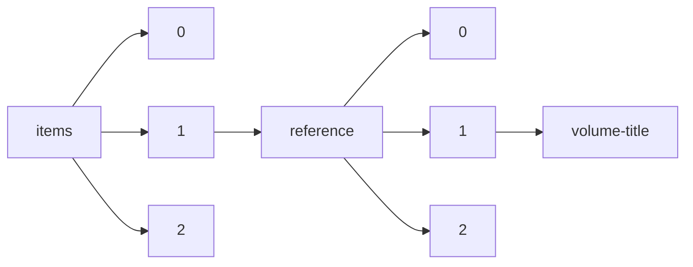

!!! warning "This document is not official Crossref documentation"
# Volume-title
PATH = items/array/reference/array/volume-title(1)  
Occurs 157 464 555 times  
Unique values: > 999  
{ .annotate }

1. A route to an element, for example:  
   The route "items/array/reference/array/volume-title" corresponds to navigating through the JSON indices as  
   ["items"][0]["reference"][0]["volume-title"]  

!!! note "Due to current limitations, only the first 1,000 unique values are counted."

| **Row** | **Value** `String`                                                                                | **Count** `Int64` |
|--------:|-----------------------------------------------------------------------------------------------------:|---------------------:|
| **1**   |                                                                                                      | 93 628               |
| **2**   | Diagnostic and statistical manual of mental disorders                                                | 31 330               |
| **3**   | R: A language and environment for statistical computing                                              | 25 668               |
| **4**   | London                                                                                               | 24 853               |
| **5**   | AIAA Paper                                                                                           | 21 974               |
| **6**   | Statistical power analysis for the behavioral sciences                                               | 17 374               |
| **7**   | Retrieved                                                                                            | 15 780               |
| **8**   | Berlin                                                                                               | 15 255               |
| **9**   | R: A Language and Environment for Statistical Computing                                              | 13 856               |
| **10**  | Solid State Physics                                                                                  | 13 349               |
| **11**  | Diagnostic and Statistical Manual of Mental Disorders                                                | 12 460               |
| **12**  | R: a language and environment for statistical computing                                              | 12 447               |
| **13**  | München                                                                                              | 12 350               |
| **14**  | Methods in Enzymology                                                                                | 10 774               |
| **15**  | Computer Aided Verification                                                                          | 10 488               |
| **16**  | New York Times                                                                                       | 10 210               |
| **17**  | Molecular Cloning: A Laboratory Manual                                                               | 9 363                |
| **18**  | Proc. SPIE                                                                                           | 8 942                |
| **19**  | New York                                                                                             | 8 694                |
| **20**  | Biometry                                                                                             | 8 680                |
| **21**  | Handbook of Mathematical Functions                                                                   | 8 592                |
| **22**  | Stuttgart                                                                                            | 8 143                |
| **23**  | Ibid                                                                                                 | 7 775                |
| **24**  | Molecular cloning: a laboratory manual                                                               | 7 268                |
| **25**  | Ph.D. Thesis                                                                                         | 7 111                |
| **26**  | Quantum Mechanics                                                                                    | 6 884                |
| **27**  | Ibid.                                                                                                | 6 831                |
| **28**  | Theory of Cryptography                                                                               | 6 741                |
| **29**  | CRC Handbook of Chemistry and Physics                                                                | 6 284                |
| **30**  | ASME                                                                                                 | 6 227                |
| **31**  | Advances in experimental social psychology                                                           | 6 190                |
| **32**  | Dictionary of Scientific Biography                                                                   | 5 873                |
| **33**  | Advances in Neural Information Processing Systems                                                    | 5 610                |
| **34**  | Statistical Methods                                                                                  | 5 135                |
| **35**  | Official Methods of Analysis                                                                         | 4 961                |
| **36**  | Tools and Algorithms for the Construction and Analysis of Systems                                    | 4 930                |
| **37**  | Part A:  Polym. Chem                                                                                 | 4 927                |
| **38**  | Using multivariate statistics                                                                        | 4 776                |
| **39**  | Proc. Natl. Acad. Sci. USA                                                                           | 4 563                |
| **40**  | Psychometric theory                                                                                  | 4 522                |
| **41**  | Computer Vision – ECCV 2016                                                                          | 4 487                |
| **42**  | AIAA                                                                                                 | 4 339                |
| **43**  | supra                                                                                                | 4 336                |
| **44**  | Phase Transitions and Critical Phenomena                                                             | 4 162                |
| **45**  | PhD thesis                                                                                           | 4 102                |
| **46**  | A Theory of Justice                                                                                  | 3 802                |
| **47**  | Lecture Notes in Computer Science                                                                    | 3 680                |
| **48**  | et al                                                                                                | 3 626                |
| **49**  | Statistical Mechanics                                                                                | 3 577                |
| **50**  | The Yearbook of Obstetrics and Gynaecology                                                           | 3 570                |
| **51**  | Göttingen                                                                                            | 3 535                |
| **52**  | Multivariate data analysis                                                                           | 3 484                |
| **53**  | Handbuch der Physik                                                                                  | 3 378                |
| **54**  | Handbook of qualitative research                                                                     | 3 353                |
| **55**  | Thesis                                                                                               | 3 351                |
| **56**  | The Structure of Scientific Revolutions                                                              | 3 321                |
| **57**  | VLDB                                                                                                 | 3 315                |
| **58**  | Paris                                                                                                | 3 282                |
| **59**  | Bergey's Manual of Systematic Bacteriology                                                           | 3 264                |
| **60**  | Wien                                                                                                 | 3 232                |
| **61**  | Computer Vision – ECCV 2018                                                                          | 3 216                |
| **62**  | Automata, Languages and Programming                                                                  | 3 201                |
| **63**  | Handbook of Chemistry and Physics                                                                    | 3 095                |
| **64**  | Orientalism                                                                                          | 3 034                |
| **65**  | Macromol. Symp.                                                                                      | 2 919                |
| **66**  | Computer Vision – ECCV 2020                                                                          | 2 917                |
| **67**  | Tech. rep.                                                                                           | 2 911                |
| **68**  | Multivariate Data Analysis                                                                           | 2 869                |
| **69**  | Leipzig                                                                                              | 2 754                |
| **70**  | Advances in Consumer Research                                                                        | 2 737                |
| **71**  | Classical Electrodynamics                                                                            | 2 723                |
| **72**  | The Enzymes                                                                                          | 2 625                |
| **73**  | Standard Methods for the Examination of Water and Wastewater                                         | 2 590                |
| **74**  | The psychology of learning and motivation                                                            | 2 586                |
| **75**  | Fast Software Encryption                                                                             | 2 545                |
| **76**  | Statistical Power Analysis for the Behavioral Sciences                                               | 2 514                |
| **77**  | Research in organizational behavior                                                                  | 2 474                |
| **78**  | Computer Vision – ECCV 2014                                                                          | 2 472                |
| **79**  | Molecular Cloning: a Laboratory Manual                                                               | 2 466                |
| **80**  | Imagined Communities: Reflections on the Origin and Spread of Nationalism                            | 2 429                |
| **81**  | Wiesbaden                                                                                            | 2 403                |
| **82**  | Introduction to Solid State Physics                                                                  | 2 277                |
| **83**  | Biostatistical Analysis                                                                              | 2 250                |
| **84**  | Statistical Physics                                                                                  | 2 223                |
| **85**  | Part B:  Polym. Phys                                                                                 | 2 177                |
| **86**  | Principles and practice of structural equation modeling                                              | 2 174                |
| **87**  | Methods of Enzymatic Analysis                                                                        | 2 108                |
| **88**  | NASA TM                                                                                              | 1 971                |
| **89**  | Statistical methods                                                                                  | 1 942                |
| **90**  | Inc.                                                                                                 | 1 927                |
| **91**  | Physics of Semiconductor Devices                                                                     | 1 902                |
| **92**  | Geophys. Monogr. Ser.                                                                                | 1 900                |
| **93**  | Tübingen                                                                                             | 1 892                |
| **94**  | Paper presented at the annual meeting of the American Educational Research Association               | 1 881                |
| **95**  | NASA                                                                                                 | 1 880                |
| **96**  | Unpublished doctoral dissertation                                                                    | 1 853                |
| **97**  | The Metabolic Basis of Inherited Disease                                                             | 1 848                |
| **98**  | Washington Post                                                                                      | 1 808                |
| **99**  | Polymer Handbook                                                                                     | 1 806                |
| **100** | Köln                                                                                                 | 1 805                |
| **101** | Constitution of Binary Alloys                                                                        | 1 800                |
| **102** | The Rat Brain in Stereotaxic Coordinates                                                             | 1 797                |
| **103** | Statistical principles in experimental design                                                        | 1 797                |
| **104** | Proc. Sci.                                                                                           | 1 784                |
| **105** | Phys. Rev. B                                                                                         | 1 764                |
| **106** | Current Protocols in Molecular Biology                                                               | 1 764                |
| **107** | Personal communication                                                                               | 1 746                |
| **108** | Failure Analysis and Prevention                                                                      | 1 730                |
| **109** | NIPS                                                                                                 | 1 726                |
| **110** | No.                                                                                                  | 1 715                |
| **111** | Principles of Optics                                                                                 | 1 689                |
| **112** | CA                                                                                                   | 1 683                |
| **113** | The Cambridge Companion to Rawls                                                                     | 1 680                |
| **114** | Ph.D. thesis                                                                                         | 1 677                |
| **115** | Standard Edition                                                                                     | 1 659                |
| **116** | Fish Physiology                                                                                      | 1 658                |
| **117** | Initial Reports of the Deep Sea Drilling Project                                                     | 1 648                |
| **118** | The Location of Culture                                                                              | 1 647                |
| **119** | Œuvres complètes                                                                                     | 1 641                |
| **120** | Philosophical Investigations                                                                         | 1 628                |
| **121** | Philosophical Papers                                                                                 | 1 604                |
| **122** | Harvard Business Review                                                                              | 1 603                |
| **123** | Bonn                                                                                                 | 1 569                |
| **124** | Phys. Rev. Lett.                                                                                     | 1 565                |
| **125** | Calif.                                                                                               | 1 560                |
| **126** | The Sea                                                                                              | 1 559                |
| **127** | Principles of Polymer Chemistry                                                                      | 1 550                |
| **128** | Opladen                                                                                              | 1 545                |
| **129** | Works                                                                                                | 1 533                |
| **130** | Oxford                                                                                               | 1 507                |
| **131** | Theory of Elasticity                                                                                 | 1 489                |
| **132** | Opera omnia                                                                                          | 1 488                |
| **133** | Light Metals                                                                                         | 1 482                |
| **134** | Biostatistical analysis                                                                              | 1 472                |
| **135** | The Pharmacological Basis of Therapeutics                                                            | 1 469                |
| **136** | Illuminations                                                                                        | 1 409                |
| **137** | Computer Simulation of Liquids                                                                       | 1 401                |
| **138** | Semiconductors and Semimetals                                                                        | 1 383                |
| **139** | Comprehensive Organic Synthesis                                                                      | 1 350                |
| **140** | Case Study Research: Design and Methods                                                              | 1 348                |
| **141** | Biochemistry                                                                                         | 1 312                |
| **142** | private communication                                                                                | 1 308                |
| **143** | Binary Alloy Phase Diagrams                                                                          | 1 302                |
| **144** | Bergey's Manual of Determinative Bacteriology                                                        | 1 281                |
| **145** | Discipline and Punish: The Birth of the Prison                                                       | 1 272                |
| **146** | The structure of scientific revolutions                                                              | 1 270                |
| **147** | Addison-Wesley                                                                                       | 1 260                |
| **148** | Immunocytochemistry                                                                                  | 1 256                |
| **149** | Nature                                                                                               | 1 254                |
| **150** | Conduction of Heat in Solids                                                                         | 1 249                |
| **151** | Frankfurt a. M.                                                                                      | 1 237                |
| **152** | Handbook of the sociology of mental health                                                           | 1 216                |
| **153** | Obras completas                                                                                      | 1 215                |
| **154** | Handbook of industrial and organizational psychology                                                 | 1 200                |
| **155** | Advances in Experimental Social Psychology                                                           | 1 196                |
| **156** | Oxford Dictionary of National Biography                                                              | 1 171                |
| **157** | Handbook of Physiology                                                                               | 1 171                |
| **158** | MNRAS                                                                                                | 1 171                |
| **159** | Mater. Res. Soc. Symp. Proc.                                                                         | 1 169                |
| **160** | Dissertation                                                                                         | 1 147                |
| **161** | Attention and performance                                                                            | 1 141                |
| **162** | op. cit                                                                                              | 1 135                |
| **163** | Superconductivity                                                                                    | 1 125                |
| **164** | Comprehensive Organometallic Chemistry                                                               | 1 117                |
| **165** | Gravitation                                                                                          | 1 116                |
| **166** | Cultural Studies                                                                                     | 1 113                |
| **167** | Handbook of research on teaching                                                                     | 1 109                |
| **168** | Washington                                                                                           | 1 099                |
| **169** | Handbook of personality: Theory and research                                                         | 1 096                |
| **170** | Gaussian 09                                                                                          | 1 094                |
| **171** | SAE                                                                                                  | 1 084                |
| **172** | Capital                                                                                              | 1 075                |
| **173** | Historical Review and Recent Advances in Neonatal and Perinatal Medicine                             | 1 071                |
| **174** | Essays on the History of Anaesthesia                                                                 | 1 071                |
| **175** | Proceedings of the XXIII International Congress of the History of Medicine                           | 1 071                |
| **176** | The Yearbook of the Royal College of Obstetricians and Gynaecologists                                | 1 071                |
| **177** | Functional Analysis                                                                                  | 1 066                |
| **178** | Fluid Mechanics                                                                                      | 1 062                |
| **179** | Frankfurt                                                                                            | 1 046                |
| **180** | Methoden der enzymatischen Analyse                                                                   | 1 044                |
| **181** | Handbook of operant behavior                                                                         | 1 040                |
| **182** | A handbook for the study of mental health: Social contexts, theories, and systems                    | 1 024                |
| **183** | PhD Thesis                                                                                           | 1 024                |
| **184** | Science                                                                                              | 1 022                |
| **185** | Modernity at Large: Cultural Dimensions of Globalization                                             | 1 013                |
| **186** | Methods of Soil Analysis                                                                             | 1 010                |
| **187** | Medical Image Computing and Computer-Assisted Intervention – MICCAI 2015                             | 1 002                |
| **188** | The Finite Element Method                                                                            | 996                  |
| **189** | Leviathan                                                                                            | 990                  |
| **190** | Fixed Point Theory Appl                                                                              | 989                  |
| **191** | Experiments in molecular genetics                                                                    | 983                  |
| **192** | Collected Papers                                                                                     | 980                  |
| **193** | Gut                                                                                                  | 978                  |
| **194** | Parallel distributed processing: Explorations in the microstructure of cognition                     | 969                  |
| **195** | The ecological approach to visual perception                                                         | 965                  |
| **196** | The Nature of the Chemical Bond                                                                      | 965                  |
| **197** | Computer Vision – ECCV 2010                                                                          | 960                  |
| **198** | Gender Trouble: Feminism and the Subversion of Identity                                              | 959                  |
| **199** | Handbook of psychotherapy and behavior change                                                        | 955                  |
| **200** | Computer Vision – ECCV 2012                                                                          | 952                  |
| **201** | Second language acquisition and task-based language teaching                                         | 947                  |
| **202** | Pedagogy of the oppressed                                                                            | 946                  |
| **203** | Gesammelte Schriften                                                                                 | 944                  |
| **204** | Edinburgh                                                                                            | 940                  |
| **205** | Artificial Intelligence and Soft Computing                                                           | 934                  |
| **206** | The Times                                                                                            | 933                  |
| **207** | Econometric Analysis                                                                                 | 917                  |
| **208** | Psychometric Theory                                                                                  | 909                  |
| **209** | Electrical, optical, and magnetic properties of organic solid state materials                        | 899                  |
| **210** | Hamburg                                                                                              | 897                  |
| **211** | The rat brain in stereotaxic coordinates                                                             | 885                  |
| **212** | Encyclopaedia of Islam                                                                               | 883                  |
| **213** | Phys. Rev.                                                                                           | 865                  |
| **214** | Selected Writings                                                                                    | 862                  |
| **215** | A Treatise of Human Nature                                                                           | 853                  |
| **216** | J. Chem. Soc. Dalton Trans.                                                                          | 849                  |
| **217** | The Princeton Encyclopedia of the World Economy                                                      | 848                  |
| **218** | Morgan Kaufmann                                                                                      | 846                  |
| **219** | Principles and Procedures of Statistics                                                              | 841                  |
| **220** | Science and human behavior                                                                           | 835                  |
| **221** | Case study research: Design and methods                                                              | 834                  |
| **222** | Ph. D. Thesis                                                                                        | 826                  |
| **223** | Business Process Management                                                                          | 823                  |
| **224** | Encyclopedia of Arabic Language and Linguistics                                                      | 823                  |
| **225** | AIAA Paper No.                                                                                       | 813                  |
| **226** | JPT                                                                                                  | 808                  |
| **227** | Graph Drawing                                                                                        | 804                  |
| **228** | Programming Languages and Systems                                                                    | 800                  |
| **229** | Advanced Information Systems Engineering                                                             | 796                  |
| **230** | Professional School Counseling                                                                       | 793                  |
| **231** | NACA T N                                                                                             | 792                  |
| **232** | Annual Book of ASTM Standards                                                                        | 788                  |
| **233** | Proc. Natl. Acad. Sci. U.S.A.                                                                        | 784                  |
| **234** | Black Skin, White Masks                                                                              | 783                  |
| **235** | AIAA Journal                                                                                         | 781                  |
| **236** | Gaussian 03                                                                                          | 771                  |
| **237** | Marxism and Literature                                                                               | 768                  |
| **238** | Aufstieg und Niedergang der römischen Welt                                                           | 768                  |
| **239** | International Tables for X-Ray Crystallography                                                       | 766                  |
| **240** | Advanced Inorganic Chemistry                                                                         | 766                  |
| **241** | Accessed                                                                                             | 763                  |
| **242** | Textbook of Dermatology                                                                              | 757                  |
| **243** | Viscoelastic Properties of Polymers                                                                  | 754                  |
| **244** | Contact dermatitis                                                                                   | 752                  |
| **245** | HMSO                                                                                                 | 748                  |
| **246** | ibid                                                                                                 | 746                  |
| **247** | Brainstorms                                                                                          | 741                  |
| **248** | The Guardian                                                                                         | 738                  |
| **249** | Reasons and Persons                                                                                  | 737                  |
| **250** | AIP Conf. Proc.                                                                                      | 737                  |
| **251** | Reading Rawls                                                                                        | 735                  |
| **252** | Molecular Cloning. A Laboratory Manual                                                               | 730                  |
| **253** | Encyclopedia of Plant Physiology                                                                     | 726                  |
| **254** | The Art of Midwifery: Early Modern Midwives in Europe                                                | 723                  |
| **255** | Medical Image Computing and Computer Assisted Intervention – MICCAI 2019                             | 721                  |
| **256** | Dictionary of National Biography                                                                     | 718                  |
| **257** | Obstetrics and Gynaecology in the Low Countries: A Historical Perspective                            | 714                  |
| **258** | From a Logical Point of View                                                                         | 711                  |
| **259** | Ethics                                                                                               | 708                  |
| **260** | Mass.                                                                                                | 705                  |
| **261** | An Economic Theory of Democracy                                                                      | 698                  |
| **262** | Lectures in Theoretical Physics                                                                      | 690                  |
| **263** | Atlas of Tumor Pathology                                                                             | 682                  |
| **264** | Theory of Dislocations                                                                               | 682                  |
| **265** | Advances in Cryogenic Engineering                                                                    | 680                  |
| **266** | Experiments in Molecular Genetics                                                                    | 678                  |
| **267** | Methoden der organischen Chemie                                                                      | 670                  |
| **268** | Vision                                                                                               | 667                  |
| **269** | June                                                                                                 | 663                  |
| **270** | Collected Works                                                                                      | 661                  |
| **271** | Mass Spectrometry of Organic Compounds                                                               | 661                  |
| **272** | The Physics of Liquid Crystals                                                                       | 652                  |
| **273** | Methods in enzymology                                                                                | 651                  |
| **274** | A History of Embryology                                                                              | 647                  |
| **275** | Mem. ent. Soc. Can.                                                                                  | 646                  |
| **276** | Ephraim McDowell: Father of Ovariotomy and Founder of Abdominal Surgery                              | 646                  |
| **277** | Advances in peritoneal dialysis.                                                                     | 644                  |
| **278** | American Antiquity                                                                                   | 643                  |
| **279** | Williams Obstetrics                                                                                  | 638                  |
| **280** | Primate Societies                                                                                    | 635                  |
| **281** | Œuvres                                                                                               | 624                  |
| **282** | Handbook of sensory physiology                                                                       | 621                  |
| **283** | )                                                                                                    | 618                  |
| **284** | The modularity of mind                                                                               | 604                  |
| **285** | Dictionary of Literary Biography                                                                     | 600                  |
| **286** | op. cit.                                                                                             | 600                  |
| **287** | Opera                                                                                                | 599                  |
| **288** | An Introduction to Probability Theory and its Applications                                           | 596                  |
| **289** | Bulletin of the School of Oriental (and African) Studies                                             | 595                  |
| **290** | Medical Image Computing and Computer Assisted Intervention – MICCAI 2018                             | 593                  |
| **291** | Perspectives on Habermas                                                                             | 585                  |
| **292** | Culture, body and language. Conceptualizations of internal body organs across cultures and languages | 585                  |
| **293** | Marxism and the Interpretation of Culture                                                            | 584                  |
| **294** | annual meeting of the American Educational Research Association                                      | 584                  |
| **295** | USA                                                                                                  | 581                  |
| **296** | Mind                                                                                                 | 581                  |
| **297** | Organizations                                                                                        | 580                  |
| **298** | Essays on Actions and Events                                                                         | 576                  |
| **299** | Encyclopedia of Bioethics                                                                            | 576                  |
| **300** | Carbon-13 NMR Spectroscopy                                                                           | 571                  |
| **301** | Gütersloh                                                                                            | 569                  |
| **302** | Matrix Computations                                                                                  | 567                  |
| **303** | Physical Chemistry                                                                                   | 565                  |
| **304** | The Practice of Everyday Life                                                                        | 565                  |
| **305** | Contemporary Research Methods in Neuroanatomy                                                        | 563                  |
| **306** | to be published                                                                                      | 562                  |
| **307** | Lecture Notes in Mathematics                                                                         | 559                  |
| **308** | Methods of enzymatic analysis                                                                        | 559                  |
| **309** | Werke                                                                                                | 557                  |
| **310** | ISSN (online): 2196-7970                                                                             | 557                  |
| **311** | The pharmacological basis of therapeutics                                                            | 556                  |
| **312** | Magnetism                                                                                            | 554                  |
| **313** | JETP                                                                                                 | 553                  |
| **314** | The Bell Jar                                                                                         | 551                  |
| **315** | Introduction to Quantitative Genetics                                                                | 550                  |
| **316** | A Thousand Plateaus: Capitalism and Schizophrenia                                                    | 549                  |
| **317** | The Cambridge Handbook of Substance and Behavioral Addictions                                        | 547                  |
| **318** | Nonparametric statistics for the behavioral sciences                                                 | 547                  |
| **319** | Schedules of reinforcement                                                                           | 544                  |
| **320** | Bd                                                                                                   | 544                  |
| **321** | Standard methods for the examination of water and wastewater                                         | 543                  |
| **322** | Handbook of Sensory Physiology                                                                       | 543                  |
| **323** | CFHB                                                                                                 | 540                  |
| **324** | Nuclear Wallet Cards                                                                                 | 536                  |
| **325** | Paper presented at the Annual Meeting of the American Educational Research Association               | 536                  |
| **326** | The New York Times                                                                                   | 535                  |
| **327** | Poems                                                                                                | 534                  |
| **328** | NASA CR                                                                                              | 533                  |
| **329** | Pharmacokinetics                                                                                     | 528                  |
| **330** | Introduction to mediation, moderation, and conditional process analysis: A regression-based approach | 527                  |
| **331** | Gesammelte Werke                                                                                     | 526                  |
| **332** | Political Writings                                                                                   | 525                  |
| **333** | Frankfurt a.M                                                                                        | 523                  |
| **334** | Emotions in crosslinguistic perspective                                                              | 520                  |
| **335** | CVPR                                                                                                 | 520                  |
| **336** | Dallas Morning News                                                                                  | 520                  |
| **337** | The language of thought                                                                              | 518                  |
| **338** | ACS Symp. Ser.                                                                                       | 514                  |
| **339** | Nuclear Structure                                                                                    | 511                  |
| **340** | The Black Atlantic: Modernity and Double Consciousness                                               | 510                  |
| **341** | The organization of behavior                                                                         | 508                  |
| **342** | The Methods of Ethics                                                                                | 507                  |
| **343** | Candidate's Dissertation                                                                             | 507                  |
| **344** | The Wretched of the Earth                                                                            | 507                  |
| **345** | Advances in Enzymology                                                                               | 506                  |
| **346** | Methods of soil analysis                                                                             | 506                  |
| **347** | Society of Petroleum Engineers                                                                       | 505                  |
| **348** | Personal Networks: Classic Readings and New Directions in Egocentric Analysis                        | 504                  |
| **349** | Handbook of reading research                                                                         | 504                  |
| **350** | Anarchy, State, and Utopia                                                                           | 502                  |
| **351** | The behavior of organisms                                                                            | 501                  |
| **352** | Theoretical Nuclear Physics                                                                          | 500                  |
| **353** | Cognitive processes in animal behavior                                                               | 498                  |
| **354** | Handbook of conducting polymers                                                                      | 496                  |
| **355** | The Semantic Web: Research and Applications                                                          | 495                  |
| **356** | Computers Helping People with Special Needs                                                          | 485                  |
| **357** | Educational measurement                                                                              | 481                  |
| **358** | Technical report                                                                                     | 467                  |
| **359** | Handbook of social psychology                                                                        | 462                  |
| **360** | Communication yearbook                                                                               | 461                  |
| **361** | Mars                                                                                                 | 458                  |
| **362** | Structure Determination of Organic Compounds, Tables of Spectral Data                                | 456                  |
| **363** | Metaphor and metonymy at the cross-roads: A cognitive perspective                                    | 455                  |
| **364** | Statistical Principles in Experimental Design                                                        | 450                  |
| **365** | Handbook of Neurochemistry                                                                           | 450                  |
| **366** | The Mathematics of Diffusion                                                                         | 448                  |
| **367** | Standard Languages and Language Standards in a Changing Europe                                       | 443                  |
| **368** | Frankfurt am Main                                                                                    | 440                  |
| **369** | The History of Sexuality                                                                             | 438                  |
| **370** | Empire                                                                                               | 436                  |
| **371** | Equine Exercise Physiology                                                                           | 436                  |
| **372** | Petroleum Geology of North West Europe                                                               | 432                  |
| **373** | Mansfeld’s encyclopedia of agricultural and horticultural crops (excepted ornamentals)               | 431                  |
| **374** | Records of Bahrain 1820–1960                                                                         | 427                  |
| **375** | Handbook of High-resolution Spectroscopy                                                             | 427                  |
| **376** | The Physiology of Reproduction                                                                       | 427                  |
| **377** | Homo Sacer: Sovereign Power and Bare Life                                                            | 426                  |
| **378** | The Principles of Nuclear Magnetism                                                                  | 424                  |
| **379** | Parallel models of associative memory                                                                | 421                  |
| **380** | International Law                                                                                    | 419                  |
| **381** | Jürgen Habermas: Key Concepts                                                                        | 419                  |
| **382** | Surgical treatment of the epilepsies                                                                 | 418                  |
| **383** | The Logic of Scientific Discovery                                                                    | 418                  |
| **384** | null                                                                                                 | 417                  |
| **385** | Habermas: A Critical Reader                                                                          | 417                  |
| **386** | Controlling                                                                                          | 411                  |
| **387** | Opere                                                                                                | 410                  |
| **388** | Creasy and Resnik’s Maternal-Fetal Medicine Principles and Practice                                  | 407                  |
| **389** | Comprehensive Coordination Chemistry                                                                 | 405                  |
| **390** | Cognitive psychology                                                                                 | 402                  |
| **391** | A Modern History of the Kurds                                                                        | 401                  |
| **392** | CIDR                                                                                                 | 401                  |
| **393** | Matrix computations                                                                                  | 400                  |
| **394** | The General Theory of Employment, Interest and Money                                                 | 399                  |
| **395** | Outline of a Theory of Practice                                                                      | 397                  |
| **396** | Rept.                                                                                                | 395                  |
| **397** | After Virtue                                                                                         | 392                  |
| **398** | Speaking of emotions: Conceptualisation and expression                                               | 390                  |
| **399** | Ph.D. Dissertation                                                                                   | 390                  |
| **400** | Experimental psychology                                                                              | 388                  |
| **401** | Time and the Other: How Anthropology Makes Its Object                                                | 386                  |
| **402** | Org. Syntheses                                                                                       | 383                  |
| **403** | Astrophysical Quantities                                                                             | 380                  |
| **404** | Reviews in Computational Chemistry                                                                   | 377                  |
| **405** | Transport Phenomena                                                                                  | 376                  |
| **406** | Rudolf Mansfeld’s Verzeichnis landwirtschaftlicher und gärtnerischer Kulturpflanzen (ohne Zierpflanz | 374                  |
| **407** | Dictionary of economic plants                                                                        | 373                  |
| **408** | Midwest Studies in Philosophy                                                                        | 373                  |
| **409** | The Prokaryotes                                                                                      | 372                  |
| **410** | The principles of psychology                                                                         | 369                  |
| **411** | Consciousness in contemporary science                                                                | 368                  |
| **412** | ICML                                                                                                 | 366                  |
| **413** | Chicana Feminist Thought: The Basic Historical Writings                                              | 364                  |
| **414** | Sämtliche Werke                                                                                      | 364                  |
| **415** | American Economic Review                                                                             | 363                  |
| **416** | Minnesota Studies in the Philosophy of Science                                                       | 363                  |
| **417** | Four Essays on Liberty                                                                               | 363                  |
| **418** | Philosophical Explanations                                                                           | 363                  |
| **419** | Flora of New Zealand                                                                                 | 362                  |
| **420** | Philosophy and the Mirror of Nature                                                                  | 358                  |
| **421** | Terminologia Anatomica: International Anatomical Terminology.                                        | 357                  |
| **422** | Dermatology in General Medicine                                                                      | 355                  |
| **423** | Ethics: Inventing Right and Wrong                                                                    | 354                  |
| **424** | The Quality of Life                                                                                  | 354                  |
| **425** | Principia Ethica                                                                                     | 353                  |
| **426** | King Lear                                                                                            | 353                  |
| **427** | Medical Image Computing and Computer Assisted Intervention – MICCAI 2020                             | 352                  |
| **428** | USA Today                                                                                            | 352                  |
| **429** | Springer-Verlag                                                                                      | 352                  |
| **430** | Fat as a Tissue                                                                                      | 350                  |
| **431** | Adipose Tissue as an Organ                                                                           | 350                  |
| **432** | ZANDER. Handwörterbuch der Pflanzennamen                                                             | 348                  |
| **433** | Research in Organizational Behavior                                                                  | 346                  |
| **434** | Cambridge University Press                                                                           | 344                  |
| **435** | The Complete Works of George Orwell                                                                  | 341                  |
| **436** | Mortal Questions                                                                                     | 340                  |
| **437** | Encyclopedia of Plant Physiology, New Series                                                         | 339                  |
| **438** | Advances in Ceramics                                                                                 | 339                  |
| **439** | Materials Conference                                                                                 | 339                  |
| **440** | Ethnobotany of the Caucasus                                                                          | 338                  |
| **441** | Gaussian                                                                                             | 337                  |
| **442** | Women and Moral Theory                                                                               | 336                  |
| **443** | Frankfurt/M                                                                                          | 335                  |
| **444** | Habermas and Modernity                                                                               | 334                  |
| **445** | ICASSP                                                                                               | 334                  |
| **446** | MTZ                                                                                                  | 333                  |
| **447** | Methods in Carbohydrate Chemistry                                                                    | 333                  |
| **448** | SecB                                                                                                 | 333                  |
| **449** | The standard edition of the complete psychological works of Sigmund Freud                            | 332                  |
| **450** | Histocompatibility Testing                                                                           | 331                  |
| **451** | Communication Yearbook                                                                               | 331                  |
| **452** | The Cochrane Library                                                                                 | 331                  |
| **453** | Philosophical investigations                                                                         | 328                  |
| **454** | Word and Object                                                                                      | 326                  |
| **455** | Peripheral Neuropathy                                                                                | 325                  |
| **456** | Handbook of clinical neurology                                                                       | 325                  |
| **457** | Boundary Layer Theory                                                                                | 325                  |
| **458** | From Kant to Hilbert                                                                                 | 325                  |
| **459** | In                                                                                                   | 324                  |
| **460** | The Interpretation of Cultures                                                                       | 324                  |
| **461** | NSDI                                                                                                 | 324                  |
| **462** | In Fish Physiology                                                                                   | 322                  |
| **463** | Truth and Other Enigmas                                                                              | 321                  |
| **464** | Handbook of Globalisation and Development                                                            | 320                  |
| **465** | Double Stars for Small Telescopes                                                                    | 320                  |
| **466** | Psychiatric disorders in America: The Epidemiological Catchment Area Study                           | 320                  |
| **467** | Genetic issues in psychosocial epidemiology                                                          | 320                  |
| **468** | Precise Stellar Radial Velocities                                                                    | 320                  |
| **469** | Mental health, social mirror                                                                         | 320                  |
| **470** | A Handbook of Double Stars                                                                           | 320                  |
| **471** | Darmstadt                                                                                            | 319                  |
| **472** | Potassium solubilizing microorganisms for sustainable agriculture                                    | 318                  |
| **473** | Handbook of Clinical Neurology                                                                       | 318                  |
| **474** | MIT Press                                                                                            | 317                  |
| **475** | Nonparametric Statistics for the Behavioral Sciences                                                 | 317                  |
| **476** | Org. Synth.                                                                                          | 316                  |
| **477** | Encyclopedia of Polymer Science and Engineering                                                      | 315                  |
| **478** | Düsseldorf                                                                                           | 315                  |
| **479** | Official Methods of Analysis.                                                                        | 314                  |
| **480** | The handbook of social psychology                                                                    | 312                  |
| **481** | The Metabolic and Molecular Bases of Inherited Disease                                               | 311                  |
| **482** | Soziale Systeme                                                                                      | 310                  |
| **483** | The Kurdish National Movement in Turkey: From Protest to Resistance                                  | 309                  |
| **484** | Ontological Relativity and Other Essays                                                              | 308                  |
| **485** | Proceedings of the ACM Symposium on Computer Science Education (SIGCSE)                              | 308                  |
| **486** | Language Documentation and Description                                                               | 308                  |
| **487** | The Oxford Handbook of Late Antiquity                                                                | 307                  |
| **488** | Numerical Heat Transfer and Fluid Flow                                                               | 307                  |
| **489** | Histoire du monde au XVe siècle                                                                      | 306                  |
| **490** | Organizations in action                                                                              | 306                  |
| **491** | The Biochemistry of Plants                                                                           | 305                  |
| **492** | Scanning Electron Microscopy                                                                         | 305                  |
| **493** | Verbal behavior                                                                                      | 303                  |
| **494** | Cerebral Cortex                                                                                      | 303                  |
| **495** | Animal cognition                                                                                     | 303                  |
| **496** | GS                                                                                                   | 300                  |
| **497** | Mammals of Africa. Volume II: Primates                                                               | 300                  |
| **498** | Advances in consumer research                                                                        | 299                  |
| **499** | Fracture Mechanics of Ceramics                                                                       | 298                  |
| **500** | Official methods of analysis                                                                         | 298                  |
| **501** | Blood groups in man                                                                                  | 297                  |
| **502** | Deep dyslexia                                                                                        | 297                  |
| **503** | Proceedings of the Electrical Overstress/Electrostatic Discharge (EOS/ESD) Symposium                 | 295                  |
| **504** | Electrodynamique                                                                                     | 294                  |
| **505** | Nation and Narration                                                                                 | 293                  |
| **506** | Themes from Kaplan                                                                                   | 292                  |
| **507** | Ariel                                                                                                | 290                  |
| **508** | Handbook of Development Economics                                                                    | 289                  |
| **509** | The Oxford Handbook of Greek and Roman Coinage                                                       | 288                  |
| **510** | Perspectives on Cormac McCarthy                                                                      | 288                  |
| **511** | Oriental Institute Publications                                                                      | 288                  |
| **512** | Il diritto internazionale privato europeo delle successioni mortis causa                             | 288                  |
| **513** | The Right and the Good                                                                               | 288                  |
| **514** | Cryocoolers                                                                                          | 288                  |
| **515** | Endomycorrhizas                                                                                      | 287                  |
| **516** | The Terminal Classic in the Maya Lowlands: Collapse, Transition, and Transformation                  | 286                  |
| **517** | The View from Nowhere                                                                                | 286                  |
| **518** | Quality Control in Preliminary Examination                                                           | 286                  |
| **519** | World Poverty and Human Rights                                                                       | 285                  |
| **520** | Dynamics of Fluids in Porous Media                                                                   | 285                  |
| **521** | Operant behavior: areas of research and application                                                  | 285                  |
| **522** | Counterfactuals                                                                                      | 282                  |
| **523** | The Psychoanalytic Study of the Child                                                                | 281                  |
| **524** | Frankfurt a.M.                                                                                       | 281                  |
| **525** | ACM                                                                                                  | 280                  |
| **526** | Proceedings of the IEEE Conference on Computer Vision and Pattern Recognition                        | 280                  |
| **527** | Byzantine Magic                                                                                      | 279                  |
| **528** | Master’s thesis                                                                                      | 279                  |
| **529** | Cardiac Pacing                                                                                       | 276                  |
| **530** | Intermolecular and Surface Forces                                                                    | 275                  |
| **531** | Ethical Studies                                                                                      | 274                  |
| **532** | SIGMOD                                                                                               | 273                  |
| **533** | The Handbook of Conversation Analysis                                                                | 273                  |
| **534** | Dynamical Theory of Crystal Lattices                                                                 | 273                  |
| **535** | The Presentation of Self in Everyday Life                                                            | 272                  |
| **536** | Textbook of Veterinary Internal Medicine                                                             | 272                  |
| **537** | Fields Virology                                                                                      | 271                  |
| **538** | Inside/Out: Lesbian Theories, Gay Theories                                                           | 271                  |
| **539** | Critique of Pure Reason                                                                              | 271                  |
| **540** | Proc. IEEE Int. Conf. on Robotics and Automation                                                     | 271                  |
| **541** | Economy and Society                                                                                  | 268                  |
| **542** | Equality and Partiality                                                                              | 267                  |
| **543** | Particles and Fields in the Magnetosphere                                                            | 267                  |
| **544** | Advances in neural information processing systems                                                    | 266                  |
| **545** | Plant microtechnique                                                                                 | 265                  |
| **546** | Hemingway, Cuba, and the Cuban Works                                                                 | 264                  |
| **547** | Naming and Necessity                                                                                 | 264                  |
| **548** | Culture and Imperialism                                                                              | 262                  |
| **549** | The Origins of Totalitarianism                                                                       | 262                  |
| **550** | Wall Street Journal                                                                                  | 261                  |
| **551** | Oeuvres complètes                                                                                    | 261                  |
| **552** | Le lexique des émotions                                                                              | 260                  |
| **553** | Political Liberalism                                                                                 | 260                  |
| **554** | Modern approaches to the visualization of landscapes                                                 | 260                  |
| **555** | The Oxford handbook of the Five-Factor Model                                                         | 258                  |
| **556** | In and out of our right minds: The mental health of African American women                           | 256                  |
| **557** | Ein alphabetisches Nachschlagwerk von Abelmoschussamen bis Zwiebeln                                  | 256                  |
| **558** | Chem. Zbl                                                                                            | 255                  |
| **559** | Manual of Mineral Science                                                                            | 255                  |
| **560** | The Authoritarian Personality                                                                        | 254                  |
| **561** | Handbook of multicultural counseling                                                                 | 253                  |
| **562** | Los Angeles Times                                                                                    | 253                  |
| **563** | Perspectives on Plant Competition                                                                    | 253                  |
| **564** | Studying the Novice Programmer                                                                       | 253                  |
| **565** | The American Medical Ethics Revolution: How the AMA’s Code of Ethics Has Transformed Physicians’ Rel | 252                  |
| **566** | Scaling Concepts in Polymer Physics                                                                  | 252                  |
| **567** | The Sermon                                                                                           | 252                  |
| **568** | Habermas and Religion                                                                                | 252                  |
| **569** | The Codification of Medical Morality: Historical and Philosophical Studies of the Formalization of W | 252                  |
| **570** | Philosophical Interventions in the Unfinished Project of Enlightenment                               | 251                  |
| **571** | Intrinsically conducting polymers: an emerging technology                                            | 250                  |
| **572** | Science and applications of conducting polymers                                                      | 250                  |
| **573** | Milestones in Midwifery                                                                              | 249                  |
| **574** | Handbook of perception and human performance                                                         | 247                  |
| **575** | The Stanford Encyclopedia of Philosophy                                                              | 246                  |
| **576** | Communicative Action. Essays on Jürgen Habermas’s Theory of Communicative Action                     | 245                  |
| **577** | Real-Encyclopädie der classischen Altertumswissenschaft                                              | 245                  |
| **578** | Selected Areas in Cryptography                                                                       | 243                  |
| **579** | Handbuch der Finanzwissenschaft                                                                      | 243                  |
| **580** | Computer Vision – ECCV 2008                                                                          | 243                  |
| **581** | Lebensmittel-Lexikon                                                                                 | 243                  |
| **582** | Habermas and Rawls: Disputing the Political                                                          | 242                  |
| **583** | The Invention of Tradition                                                                           | 242                  |
| **584** | Feminists Read Habermas: Gendering the Subject of Discourse                                          | 240                  |
| **585** | The Logic of Collective Action                                                                       | 240                  |
| **586** | Handbuch der Orientalistik                                                                           | 240                  |
| **587** | Fifth-Century Gaul                                                                                   | 239                  |
| **588** | The Philosophy of Rudolf Carnap                                                                      | 238                  |
| **589** | Principia Mathematica                                                                                | 238                  |
| **590** | An Evolutionary Theory of Economic Change                                                            | 236                  |
| **591** | Inflation, Open Economies and Resources                                                              | 234                  |
| **592** | The Common Wind: Afro-American Currents in the Age of the Haitian Revolution                         | 234                  |
| **593** | Digital Image Processing                                                                             | 232                  |
| **594** | The Journal of Modern African Studies                                                                | 231                  |
| **595** | Negotiating the Paris Agreement: The Inside Stories                                                  | 231                  |
| **596** | Political Argument                                                                                   | 231                  |
| **597** | Atlas of Neutron Resonances                                                                          | 231                  |
| **598** | An Introduction to the Principles of Morals and Legislation                                          | 230                  |
| **599** | Department of Computer Science                                                                       | 230                  |
| **600** | On Liberty                                                                                           | 230                  |
| **601** | Teaching sign language to chimpanzees                                                                | 229                  |
| **602** | Annalen                                                                                              | 228                  |
| **603** | Fundamentals of Rock Mechanics                                                                       | 228                  |
| **604** | Understanding Asian bears to secure their future                                                     | 228                  |
| **605** | Selected Works                                                                                       | 227                  |
| **606** | Ethics and the Limits of Philosophy                                                                  | 227                  |
| **607** | Knowledge-Based Intelligent Information and Engineering Systems                                      | 226                  |
| **608** | Optical and photonic applications of electroactive and conducting polymers                           | 225                  |
| **609** | Diffusion of Innovations                                                                             | 225                  |
| **610** | Conjugated polymers: the novel science and technology of highly conducting and nonlinear optically a | 225                  |
| **611** | Habermas and the Public Sphere                                                                       | 225                  |
| **612** | The Rat Nervous System                                                                               | 224                  |
| **613** | Ernest Hemingway in Context                                                                          | 224                  |
| **614** | Proc. IEEE Int. Conf. Robotics Autom. (ICRA)                                                         | 224                  |
| **615** | The Handbook of Attitudes                                                                            | 224                  |
| **616** | ICDE                                                                                                 | 222                  |
| **617** | Inventing the Classics: Modernity, National Identity, and Japanese Literature                        | 222                  |
| **618** | Journal of the Aeronautical Sciences                                                                 | 220                  |
| **619** | Enneads                                                                                              | 218                  |
| **620** | The Sexual Contract                                                                                  | 218                  |
| **621** | About behaviorism                                                                                    | 218                  |
| **622** | Asymmetric Synthesis                                                                                 | 218                  |
| **623** | An Inquiry into the Nature and Causes of the Wealth of Nations                                       | 217                  |
| **624** | The Occult Sciences in Byzantium                                                                     | 217                  |
| **625** | Byzantine Philosophy and its Ancient Sources                                                         | 217                  |
| **626** | Intersecting Voices: Dilemmas of Gender, Political Philosophy, and Policy                            | 217                  |
| **627** | Ancient Roman Statutes                                                                               | 216                  |
| **628** | ODNB                                                                                                 | 216                  |
| **629** | Finansy Rossii: Statisticheskiĭ sbornik (Finances of Russia: Statistical Collection)                 | 216                  |
| **630** | The Works of the Right Honourable Edmund Burke                                                       | 216                  |
| **631** | The Encyclopedia of Bioethics                                                                        | 216                  |
| **632** | Risk-Based Decision-Making for Assessing Petroleum Impacts at Exploration and Production Sites       | 216                  |
| **633** | Suttree                                                                                              | 216                  |
| **634** | Child of God                                                                                         | 216                  |
| **635** | Autoshaping and conditioning theory                                                                  | 215                  |
| **636** | Developing theories of mind                                                                          | 215                  |
| **637** | Self-Efficacy: The Exercise of Control                                                               | 214                  |
| **638** | Progress In Electromagnetics Research                                                                | 213                  |
| **639** | Biotechnology                                                                                        | 212                  |
| **640** | Spektrum Akademischer                                                                                | 212                  |
| **641** | Synthesis                                                                                            | 212                  |
| **642** | Empirical studies of psychoanalytical theories                                                       | 210                  |
| **643** | The bottlenose dolphin                                                                               | 210                  |
| **644** | Magnetic Reconnection in Space and Laboratory Plasmas                                                | 209                  |
| **645** | Understanding other minds: Perspectives from autism                                                  | 209                  |
| **646** | Ph.D. diss.                                                                                          | 209                  |
| **647** | APA handbook of research methods in psychology                                                       | 208                  |
| **648** | The Standard Edition of the Complete Psychological Works of Sigmund Freud, Volume XIV (1914–1916): O | 206                  |
| **649** | The Byzantine World                                                                                  | 206                  |
| **650** | Eye Rhymes: Sylvia Plath’s Art of the Visual                                                         | 203                  |
| **651** | Collected Papers of Charles Sanders Peirce                                                           | 201                  |
| **652** | The Anatomy of Corporate Law: A Comparative and Functional Approach                                  | 200                  |
| **653** | Electrolyte Solutions                                                                                | 199                  |
| **654** | Schoolroom Poets: Childhood, Performance, and the Place of American Poetry, 1865–1917                | 199                  |
| **655** | Contact Dermatitis                                                                                   | 199                  |
| **656** | Primate societies                                                                                    | 198                  |
| **657** | Psychopharmacology: A generation of progress                                                         | 198                  |
| **658** | ibid.                                                                                                | 198                  |
| **659** | Myth, Legend, Dust: Critical Responses to Cormac McCarthy                                            | 198                  |
| **660** | All the Pretty Horses                                                                                | 198                  |
| **661** | Boron and Refractory Borides                                                                         | 198                  |
| **662** | The Civil Law                                                                                        | 198                  |
| **663** | Standards, Recommended Practices, and Guidelines                                                     | 197                  |
| **664** | Practical Haematology                                                                                | 197                  |
| **665** | Capitalism and Freedom                                                                               | 196                  |
| **666** | Affective Determinants of Health-Related Behavior                                                    | 196                  |
| **667** | Mortality, mourning and mortuary practices in Indigenous Australia                                   | 195                  |
| **668** | The handbook of language teaching                                                                    | 195                  |
| **669** | Conditioned reinforcement                                                                            | 195                  |
| **670** | Culture theory: Essays on mind, self and emotion                                                     | 195                  |
| **671** | Moral Luck                                                                                           | 195                  |
| **672** | Language and the cognitive construal of the world                                                    | 195                  |
| **673** | The grammar of inalienability: A typological perspective on body part terms and the part-whole relat | 195                  |
| **674** | Nebraska symposium on motivation                                                                     | 195                  |
| **675** | Retrieved on                                                                                         | 194                  |
| **676** | Journal of Marketing                                                                                 | 194                  |
| **677** | Nudge: Improving Decisions about Health, Wealth, and Happiness                                       | 193                  |
| **678** | World economic plants                                                                                | 193                  |
| **679** | Nietzsche                                                                                            | 193                  |
| **680** | Clubs and societies in eighteenth-century Ireland                                                    | 192                  |
| **681** | Die Europäische Erbrechtsverordnung                                                                  | 192                  |
| **682** | Global Change in the Holocene                                                                        | 192                  |
| **683** | Stuart Hall: Critical Dialogues in Cultural Studies                                                  | 192                  |
| **684** | The Gothic World                                                                                     | 192                  |
| **685** | Phys. Lett.                                                                                          | 192                  |
| **686** | Advances in child development and behavior                                                           | 192                  |
| **687** | Droit européen des successions internationales (Le Règlement du 4 juillet 2012)                      | 192                  |
| **688** | The Fractal Geometry of Nature                                                                       | 192                  |
| **689** | Task-based language learning and teaching                                                            | 191                  |
| **690** | The European Union in International Climate Change Politics                                          | 191                  |
| **691** | The Production of Space                                                                              | 191                  |
| **692** | TBLT as a researched pedagogy                                                                        | 191                  |
| **693** | Proc. DesignCon                                                                                      | 189                  |
| **694** | Przeglad Filozoficzny                                                                                | 188                  |
| **695** | Semantics                                                                                            | 188                  |
| **696** | Bergson                                                                                              | 188                  |
| **697** | Ordinary Differential Equations                                                                      | 188                  |
| **698** | The Australian Economy in the Long Run                                                               | 187                  |
| **699** | International Encyclopedia of Unified Science                                                        | 187                  |
| **700** | Binary Phase Diagrams Handbook                                                                       | 186                  |
| **701** | Nineteenth Century Religious Thought in the West                                                     | 186                  |
| **702** | Heidelberg                                                                                           | 186                  |
| **703** | Introduction                                                                                         | 186                  |
| **704** | Japanese Court Poetry                                                                                | 185                  |
| **705** | Sein und Zeit                                                                                        | 184                  |
| **706** | SAS User's Guide: Statistics                                                                         | 184                  |
| **707** | J of the IES                                                                                         | 184                  |
| **708** | Personality: A psychological interpretation                                                          | 184                  |
| **709** | Bergey’s manual of systematic bacteriology                                                           | 183                  |
| **710** | Marketing                                                                                            | 182                  |
| **711** | Ein Handbuch der Gewürze, Gewürzkräuter, Gewürzmischungen und ihrer ätherischer Öle                  | 182                  |
| **712** | The Axial Age and Its Consequences                                                                   | 182                  |
| **713** | Hager’s Handbuch der pharmazeutischen Praxis                                                         | 181                  |
| **714** | Habermas on Law and Democracy: Critical Exchanges                                                    | 181                  |
| **715** | Bears: Status survey and conservation action plan                                                    | 181                  |
| **716** | Rime                                                                                                 | 181                  |
| **717** | The Green Book of Language Revitalization in Practice                                                | 180                  |
| **718** | Talking Data: Transcription and Coding in Discourse Research                                         | 180                  |
| **719** | Communicative Action: Essays on Jürgen Habermas’s The Theory of Communicative Action                 | 180                  |
| **720** | Pathology of Tumours                                                                                 | 180                  |
| **721** | The Oxford Handbook of International Investment Law                                                  | 180                  |
| **722** | Orangutans: Geographic Variation in Behavioral Ecology and Conservation                              | 180                  |
| **723** | The Road                                                                                             | 180                  |
| **724** | Primates in Perspective                                                                              | 180                  |
| **725** | Studies in the Way of Words                                                                          | 180                  |
| **726** | We Have Never Been Modern                                                                            | 179                  |
| **727** | Obras completas,                                                                                     | 179                  |
| **728** | Behavior: The Control of Perception                                                                  | 179                  |
| **729** | Systems, Software and Services Process Improvement                                                   | 177                  |
| **730** | Capitalism, Socialism and Democracy                                                                  | 177                  |
| **731** | Oeuvres                                                                                              | 177                  |
| **732** | Theognis of Megara: Poetry and the Polis                                                             | 176                  |
| **733** | Engineering Geology for Tomorrow's Cities                                                            | 176                  |
| **734** | Routledge Handbook on the Kurds                                                                      | 176                  |
| **735** | Master's thesis                                                                                      | 176                  |
| **736** | Proceedings of the 2019 Conference of the North American Chapter of the Association for Computationa | 175                  |
| **737** | Second language needs analysis                                                                       | 175                  |
| **738** | Materials science forum                                                                              | 175                  |
| **739** | NJW                                                                                                  | 174                  |
| **740** | Bonds of Pluralism: The Form and Substance of Urban Social Networks                                  | 173                  |
| **741** | Id.                                                                                                  | 173                  |
| **742** | Conflict and the Web of Group Affiliations                                                           | 172                  |
| **743** | Proceedings of the American Control Conference                                                       | 172                  |
| **744** | Progress in physiological psychology                                                                 | 171                  |
| **745** | Zwischenberichterstattung                                                                            | 171                  |
| **746** | Management                                                                                           | 171                  |
| **747** | Handbook of perception                                                                               | 171                  |
| **748** | Task sequencing and instructed second language learning                                              | 170                  |
| **749** | Theories of information behavior                                                                     | 169                  |
| **750** | Aspects of Scientific Explanation                                                                    | 168                  |
| **751** | Military Stress and Performance: The Australian Defence Force Experience                             | 168                  |
| **752** | Habermas: Critical Debates                                                                           | 167                  |
| **753** | Constitutional Patriotism                                                                            | 167                  |
| **754** | Varieties of Secularism in a Secular Age                                                             | 167                  |
| **755** | Coloniality at Large: Latin America and the Postcolonial Debate                                      | 166                  |
| **756** | Geschichte der Soziologie                                                                            | 166                  |
| **757** | The theory and practice of group psychotherapy                                                       | 166                  |
| **758** | Masculinities                                                                                        | 165                  |
| **759** | Ceramic Transactions                                                                                 | 164                  |
| **760** | Levick’s Introduction to Cardiovascular Physiology                                                   | 164                  |
| **761** | Oxford Early Christian Studies                                                                       | 164                  |
| **762** | Cerebral correlates of conscious experience                                                          | 164                  |
| **763** | Islam in the Global Modern                                                                           | 163                  |
| **764** | Jamaican Theatre: Highlights of the Performing Arts in the Twentieth Century                         | 163                  |
| **765** | Slavery and the Culture of Taste                                                                     | 163                  |
| **766** | Persistent Poverty: Underdevelopment in Plantation Economies of the Third World                      | 163                  |
| **767** | Newsweek                                                                                             | 162                  |
| **768** | Cormac McCarthy’s Borders and Landscapes                                                             | 162                  |
| **769** | No Country for Old Men                                                                               | 162                  |
| **770** | Gramática descriptiva de la lengua española                                                          | 162                  |
| **771** | Blood Meridian; or, The Evening Redness in the West                                                  | 162                  |
| **772** | The psychobiology of the depressive disorders                                                        | 161                  |
| **773** | Methods in Microbiology                                                                              | 161                  |
| **774** | Porphyrogenita: Essays on the History and Literature of Byzantium and the Latin East in Honour of Ju | 161                  |
| **775** | Logic Matters                                                                                        | 161                  |
| **776** | Greeks, Latins, and Intellectual History 1204–1500                                                   | 161                  |
| **777** | Quantitative analyses of behavior                                                                    | 161                  |
| **778** | Poems from Spain                                                                                     | 160                  |
| **779** | Irish and Scottish mercantile networks in Europe and overseas in the seventeenth and eighteenth cent | 160                  |
| **780** | Irish and English: essays on the Irish and English cultural frontier, 1600–1900                      | 160                  |
| **781** | Corpus Linguistics: An International Handbook                                                        | 160                  |
| **782** | Paleopathology at the Origins of Agriculture                                                         | 160                  |
| **783** | Proceedings of the IEEE PES General Meeting                                                          | 160                  |
| **784** | U-hjälp i utveckling? 14 forskare och samhällsvetare om Sveriges u-landspolitik och utvecklingsbistå | 160                  |
| **785** | The Blue and Brown Books                                                                             | 159                  |
| **786** | The Life and Times of Ephraim McDowell                                                               | 157                  |
| **787** | Surgical Repair of Vaginal Defects                                                                   | 157                  |
| **788** | Past and Present of Radical Surgery in Gynecological and Mammary Cancerology                         | 157                  |
| **789** | A Matter of Life: The Story of a Medical Breakthrough                                                | 157                  |
| **790** | The Doctors Mayo                                                                                     | 157                  |
| **791** | Making the Body Beautiful: A Cultural History of Aesthetic Surgery                                   | 157                  |
| **792** | The Politics of Contraception                                                                        | 157                  |
| **793** | The Evolution of Surgical Instruments                                                                | 157                  |
| **794** | Science and the Practice of Medicine in the Nineteenth Century                                       | 157                  |
| **795** | Drugs and Narcotics in History                                                                       | 157                  |
| **796** | Classics in Obstetrics and Gynecology: Innovative Papers That Have Contributed to Current Clinical P | 157                  |
| **797** | Medical History of Contraception                                                                     | 157                  |
| **798** | A Dissertation on the Natural History and Medicinal Effects of the Secale Cornutum or Ergot          | 157                  |
| **799** | The Encyclopedia of Genetic Disorders and Birth Defects                                              | 157                  |
| **800** | Treasures of the College                                                                             | 157                  |
| **801** | Old Masterpieces in Surgery                                                                          | 157                  |
| **802** | Essays on the History of Anaesthesia:                                                                | 157                  |
| **803** | The History of Clinical Endocrinology                                                                | 157                  |
| **804** | Biography of Ephraim McDowell, MD                                                                    | 157                  |
| **805** | Digging up the Dead: Uncovering the Life and Times of an Extraordinary Surgeon                       | 157                  |
| **806** | The Rhesus Factor and Disease Prevention. Wellcome Witnesses to Twentieth Century Medicine. Vol. 22  | 157                  |
| **807** | College Portraits: Matthews Duncan                                                                   | 157                  |
| **808** | Selected Readings in the History of Physiology                                                       | 157                  |
| **809** | Vacuum Extraction in Modern Obstetric Practice                                                       | 157                  |
| **810** | The Pursuit of Oblivion: A Global History of Narcotics                                               | 157                  |
| **811** | The Kurdish Question Revisited                                                                       | 156                  |
| **812** | Tractatus Logico‐Philosophicus                                                                       | 156                  |
| **813** | Chem. Abs.                                                                                           | 155                  |
| **814** | Collected Essays                                                                                     | 155                  |
| **815** | Philosophical Essays                                                                                 | 154                  |
| **816** | Behavioral ecology: An evolutionary approach                                                         | 154                  |
| **817** | Women and Gender in Jewish Philosophy                                                                | 154                  |
| **818** | Syria’s Kurds: History, Politics and Society                                                         | 154                  |
| **819** | Mindwaves                                                                                            | 154                  |
| **820** | The Law of International Responsibility                                                              | 154                  |
| **821** | War, Democracy and Culture in Classical Athens                                                       | 154                  |
| **822** | The latest on the best: Essays on evolution and optimality                                           | 153                  |
| **823** | Violence among the mentally ill: Effective treatments and management strategies                      | 150                  |
| **824** | The Principles of Mathematics                                                                        | 150                  |
| **825** | Collected papers                                                                                     | 150                  |
| **826** | Stress and mental health: Contemporary issues and prospects for the future                           | 150                  |
| **827** | 9/11: Mental health in the wake of terrorist attacks                                                 | 150                  |
| **828** | Textbook in psychiatric epidemiology                                                                 | 150                  |
| **829** | Mental health and criminal justice                                                                   | 150                  |
| **830** | Psychiatry                                                                                           | 150                  |
| **831** | The Sage handbook of organization studies                                                            | 150                  |
| **832** | The Life of Geoffrey Chaucer: A Critical Biography                                                   | 150                  |
| **833** | Cyprus: A Conflict at the Crossroads                                                                 | 150                  |
| **834** | Deviance and mental illness                                                                          | 150                  |
| **835** | Schizophrenia: New directions for clinical research and treatment                                    | 150                  |
| **836** | Comprehensive textbook of AIDS psychiatry                                                            | 150                  |
| **837** | Handbook of depression in children and adolescents                                                   | 150                  |
| **838** | International review of psychiatry                                                                   | 150                  |
| **839** | Australian Peacekeeping: Sixty Years in the Field                                                    | 150                  |
| **840** | The Father–Daughter Plot: Japanese Literary Women and the Law of the Father                          | 148                  |
| **841** | Japan in the Muromachi Age                                                                           | 148                  |
| **842** | Heian Japan, Centers and Peripheries                                                                 | 148                  |
| **843** | Japanese Literature in Chinese                                                                       | 148                  |
| **844** | Classical Japanese Prose: An Anthology                                                               | 148                  |
| **845** | Career choice and development                                                                        | 147                  |
| **846** | The Agrarian History of England and Wales                                                            | 145                  |
| **847** | Severnoye Prichernomorye                                                                             | 145                  |
| **848** | The Orchard Keeper                                                                                   | 144                  |
| **849** | The Encyclopedia of Applied Linguistics                                                              | 144                  |
| **850** | Handbook of learning and cognitive processes                                                         | 144                  |
| **851** | International Succession                                                                             | 144                  |
| **852** | Tratado de Derecho de Sucesiones                                                                     | 144                  |
| **853** | Forum Shopping in the European Judicial Area                                                         | 144                  |
| **854** | Droit international privé                                                                            | 144                  |
| **855** | Wired                                                                                                | 144                  |
| **856** | Erbrecht in Europa                                                                                   | 144                  |
| **857** | Outer Dark                                                                                           | 144                  |
| **858** | Blood Meridian                                                                                       | 144                  |
| **859** | Zürcher Kommentar zum IPRG                                                                           | 144                  |
| **860** | Reconstruction Effects in Relative Clauses                                                           | 144                  |
| **861** | The Cambridge Companion to Latina/o American Literature                                              | 144                  |
| **862** | Derecho internacional privado                                                                        | 144                  |
| **863** | The Crossing                                                                                         | 144                  |
| **864** | Social Networks in Urban Situations                                                                  | 143                  |
| **865** | The Resurgence of the Latin American Left                                                            | 143                  |
| **866** | Our Knowledge of the External World                                                                  | 143                  |
| **867** | A Hundred Years of Philosophy                                                                        | 142                  |
| **868** | Economic History Review                                                                              | 142                  |
| **869** | The Encyclopedia of Philosophy                                                                       | 142                  |
| **870** | Contemporary British Philosophy                                                                      | 141                  |
| **871** | Russell                                                                                              | 141                  |
| **872** | Collecting Plant Genetic Diversity: Technical Guidelines. 2011 Update                                | 140                  |
| **873** | The Problem of Christianity                                                                          | 140                  |
| **874** | Family and Social Network                                                                            | 140                  |
| **875** | The Philosophy of G. E. Moore                                                                        | 140                  |
| **876** | Die Welt als Wille und Vorstellung                                                                   | 140                  |
| **877** | The Ascetic Works of Saint Basil                                                                     | 140                  |
| **878** | Collecting Plant Genetic Diversity: Technical Guidelines                                             | 140                  |
| **879** | Imperial Eyes: Travel Writing and Transculturation                                                   | 140                  |
| **880** | The Monist                                                                                           | 139                  |
| **881** | The Human Group                                                                                      | 139                  |
| **882** | Foundations of Social Theory                                                                         | 139                  |
| **883** | Bergey’s Manual of Systematic Bacteriology                                                           | 138                  |
| **884** | Metaphor and thought                                                                                 | 138                  |
| **885** | Stanford Hypnotic Susceptibility Scale, Form C                                                       | 138                  |
| **886** | An Introduction to Probability Theory and Its Applications                                           | 138                  |
| **887** | Logik                                                                                                | 138                  |
| **888** | The Standard Edition of the Complete Psychological Works of Sigmund Freud                            | 138                  |
| **889** | Larry Ferlazzo's Websites of the Day                                                                 | 136                  |
| **890** | The Cambridge companion to Arabic philosophy                                                         | 136                  |
| **891** | Australians: Historical Statistics                                                                   | 136                  |
| **892** | Sbornik Vysledku Toxixologickeho Vysetreni Latek A Pripravku                                         | 134                  |
| **893** | Diseases of Poultry                                                                                  | 134                  |
| **894** | Classification and minimum standards for foreign medical teams in sudden onset disasters             | 133                  |
| **895** | Functions of the septo-hippocampal system                                                            | 133                  |
| **896** | N. A. C. A. T. N. No.                                                                                | 133                  |
| **897** | The Wiley-Blackwell Encyclopedia of Social and Political Movements                                   | 133                  |
| **898** | Inquiries into Truth and Interpretation                                                              | 132                  |
| **899** | Ancient Writers, Greece and Rome                                                                     | 132                  |
| **900** | Reorganizing Popular Politics: Participation and the New Interest Regime in Latin America            | 131                  |
| **901** | Norms and Usage in Language History, 1600–1900: A Historical-Sociolinguistic and Comparative Perspec | 131                  |
| **902** | Rethinking linguistic relativity                                                                     | 130                  |
| **903** | Encoding emotions in African languages                                                               | 130                  |
| **904** | Body, language, mind. Embodiment                                                                     | 130                  |
| **905** | The social construction of emotions                                                                  | 130                  |
| **906** | Stravinsky’s Late Music                                                                              | 130                  |
| **907** | The non-Pama-Nyungan Languages of Northern Australia: Comparative studies of the continent’s most li | 130                  |
| **908** | Processes of language contact: Case studies from Australia and the South Pacific                     | 130                  |
| **909** | Cochrane Database of Systematic Reviews                                                              | 129                  |
| **910** | Perception and control of self-motion                                                                | 129                  |
| **911** | Perspectives on Arabic Linguistics                                                                   | 129                  |
| **912** | Nunn’s Applied Respiratory Physiology                                                                | 128                  |
| **913** | Bankruptcy Forum                                                                                     | 128                  |
| **914** | Handbook for Arabic Language Teaching Professionals in the 21st Century                              | 128                  |
| **915** | Political Parties and Political Development                                                          | 127                  |
| **916** | Progress in Low Temperature Physics                                                                  | 127                  |
| **917** | Cities of the Plain                                                                                  | 126                  |
| **918** | A Cormac McCarthy Companion: The Border Trilogy                                                      | 126                  |
| **919** | Reading the World: Cormac McCarthy’s Tennessee Period                                                | 126                  |
| **920** | Sepharad in Ashkenaz: Medieval Knowledge and Eighteenth-Century Enlightened Jewish Discourse         | 126                  |
| **921** | Cormac McCarthy: New Directions                                                                      | 126                  |
| **922** | Grammatical Change in English World-Wide                                                             | 126                  |
| **923** | Data Reduction and Error Analysis for the Physical Sciences                                          | 126                  |
| **924** | Riches from Atlantic Commerce. Dutch Transatlantic Trade and Shipping, 1585–1817                     | 126                  |
| **925** | Membrane Computing                                                                                   | 125                  |
| **926** | Rev. Mod. Phys.                                                                                      | 125                  |
| **927** | J. Supercond. Nov. Magn.                                                                             | 125                  |
| **928** | Brave New World: Dr H.V. Evatt and Australian Foreign Policy, 1941–1949                              | 125                  |
| **929** | Cambridge                                                                                            | 125                  |
| **930** | Social Networks in Urban Situations: Analyses of Personal Relationships in Central African Towns     | 124                  |
| **931** | Vertrauen                                                                                            | 123                  |
| **932** | Hypnotic susceptibility                                                                              | 123                  |
| **933** | Stanford Encyclopedia of Philosophy                                                                  | 122                  |
| **934** | Histocompatibility Testing 1984                                                                      | 122                  |
| **935** | The Sociology of Georg Simmel                                                                        | 122                  |
| **936** | To Dwell Among Friends: Personal Networks in Town and City                                           | 121                  |
| **937** | Treatise on Invertebrate Paleontology                                                                | 121                  |
| **938** | Proc. IEEE INFOCOM                                                                                   | 120                  |
| **939** | The World’s Major Languages                                                                          | 120                  |
| **940** | Kant-Lexikon                                                                                         | 120                  |
| **941** | The Turkic Languages                                                                                 | 120                  |
| **942** | The Uralic Languages                                                                                 | 120                  |
| **943** | .                                                                                                    | 120                  |
| **944** | Karamanlidika                                                                                        | 120                  |
| **945** | Cambridge Handbook of Engineering Education Research                                                 | 120                  |
| **946** | Multiple Perspectives on Language Play                                                               | 120                  |
| **947** | Studies in Turkish Linguistics                                                                       | 120                  |
| **948** | Altaic Religious Beliefs and Practices                                                               | 120                  |
| **949** | Linguistic Convergence and Areal Diffusion. Case Studies from Iranian, Semitic and Turkic            | 120                  |
| **950** | The Muslim Brotherhood in Europe                                                                     | 120                  |
| **951** | Appeals Mechanism in International Investment Disputes                                               | 120                  |
| **952** | The Principles of Psychology                                                                         | 120                  |
| **953** | Jazyki mira. Tjurkskie jazyki                                                                        | 120                  |
| **954** | Physica C                                                                                            | 120                  |
| **955** | Standardizing Minority Languages                                                                     | 120                  |
| **956** | Tandem Mass Spectrometry                                                                             | 119                  |
| **957** | SEG                                                                                                  | 119                  |
| **958** | Intelligent Virtual Agents                                                                           | 119                  |
| **959** | Sax's Dangerous Properties of Industrial Materials                                                   | 119                  |
| **960** | Classical Scholarship                                                                                | 119                  |
| **961** | S                                                                                                    | 119                  |
| **962** | Cancer incidence in five continents                                                                  | 119                  |
| **963** | The Birds of North America                                                                           | 118                  |
| **964** | Hesperia                                                                                             | 117                  |
| **965** | The Aeolian Islands Volcanoes                                                                        | 117                  |
| **966** | Harvard Group Scale of Hypnotic Susceptibility, Form A                                               | 117                  |
| **967** | Annual review of information science and technology                                                  | 116                  |
| **968** | The Cambridge Companion to Sylvia Plath                                                              | 116                  |
| **969** | The Concept of Mind                                                                                  | 116                  |
| **970** | Utilitarianism and Beyond                                                                            | 116                  |
| **971** | Representing Sylvia Plath                                                                            | 116                  |
| **972** | The Morality of Freedom                                                                              | 116                  |
| **973** | Scientific Explanation                                                                               | 115                  |
| **974** | Reinforcement Learning: An Introduction                                                              | 115                  |
| **975** | Mikroskopische Technik                                                                               | 114                  |
| **976** | The International Criminal Court: Comments on the Draft Statute                                      | 114                  |
| **977** | Ethics Out of Economics                                                                              | 114                  |
| **978** | The Music of Stravinsky                                                                              | 114                  |
| **979** | Flora of China                                                                                       | 114                  |
| **980** | Quantum Computation and Quantum Information                                                          | 114                  |
| **981** | Statistical theories of mental test scores                                                           | 114                  |
| **982** | British and American Abolitionists: An Episode in Transatlantic Understanding                        | 114                  |
| **983** | Advances in Cryptology – CRYPTO 2013                                                                 | 114                  |
| **984** | Language and learning: The debate between Jean Piaget and Noam Chomsky                               | 113                  |
| **985** | Prehled Prumyslove Toxikologie; Organicke Latky                                                      | 113                  |
| **986** | Zürich                                                                                               | 113                  |
| **987** | The Writings and Speeches of Lord Macaulay                                                           | 112                  |
| **988** | The psychology of learning and motivation: Advances in research and theory                           | 112                  |
| **989** | Geol. Soc. Amer. Mem.                                                                                | 112                  |
| **990** | Neuer Mensch und kollektive Identität in der Kommunikationsgesellschaft                              | 112                  |
| **991** | Handbook of Defense Economics                                                                        | 112                  |
| **992** | The history of Islam in Africa                                                                       | 112                  |
| **993** | History of Jewish Philosophy                                                                         | 112                  |
| **994** | Diseases of Poultry,                                                                                 | 112                  |
| **995** | New Perspectives on the Haskalah                                                                     | 112                  |
| **996** | Kabuki Plays on Stage                                                                                | 111                  |
| **997** | Envisioning The Tale of Genji: Media, Gender, and Cultural Production                                | 111                  |
| **998** | A History of Macedonia                                                                               | 111                  |
| **999** | The Pursuit of Loneliness: Chinese and Japanese Nature Poetry in Medieval Japan, ca. 1050–1150       | 111                  |
| ... | ... | ... |

