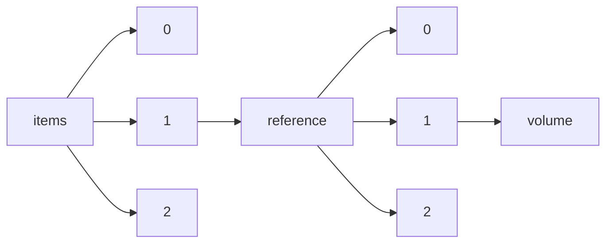

!!! warning "This document is not official Crossref documentation"
# Volume
PATH = items/array/reference/array/volume(1)  
Occurs 1 124 472 759 times  
Unique values: > 999  
{ .annotate }

1. A route to an element, for example:  
   The route "items/array/reference/array/volume" corresponds to navigating through the JSON indices as  
   ["items"][0]["reference"][0]["volume"]  

!!! note "Due to current limitations, only the first 1,000 unique values are counted."

| **Row** | **Value** `String` | **Count** `Int64` |
|--------:|----------------------:|---------------------:|
| **1**   | 8                     | 17 481 638           |
| **2**   | 7                     | 17 448 399           |
| **3**   | 6                     | 17 204 777           |
| **4**   | 9                     | 17 162 343           |
| **5**   | 10                    | 16 737 869           |
| **6**   | 5                     | 16 439 503           |
| **7**   | 11                    | 16 013 016           |
| **8**   | 2                     | 15 923 375           |
| **9**   | 4                     | 15 874 391           |
| **10**  | 12                    | 15 601 147           |
| **11**  | 3                     | 15 413 500           |
| **12**  | 13                    | 14 734 641           |
| **13**  | 14                    | 14 392 320           |
| **14**  | 1                     | 14 283 714           |
| **15**  | 15                    | 14 137 145           |
| **16**  | 16                    | 13 865 258           |
| **17**  | 17                    | 13 719 967           |
| **18**  | 19                    | 13 513 547           |
| **19**  | 18                    | 13 480 947           |
| **20**  | 20                    | 13 296 466           |
| **21**  | 21                    | 13 145 477           |
| **22**  | 22                    | 12 827 716           |
| **23**  | 23                    | 12 359 040           |
| **24**  | 25                    | 12 183 852           |
| **25**  | 24                    | 12 165 785           |
| **26**  | 26                    | 11 880 932           |
| **27**  | 27                    | 11 611 343           |
| **28**  | 28                    | 11 412 480           |
| **29**  | 29                    | 11 047 297           |
| **30**  | 30                    | 10 862 608           |
| **31**  | 31                    | 10 507 905           |
| **32**  | 32                    | 10 340 111           |
| **33**  | 33                    | 10 095 951           |
| **34**  | 34                    | 9 761 728            |
| **35**  | 35                    | 9 692 692            |
| **36**  | 36                    | 9 395 793            |
| **37**  | 37                    | 9 272 540            |
| **38**  | 38                    | 9 108 126            |
| **39**  | 39                    | 9 033 156            |
| **40**  | 40                    | 8 772 995            |
| **41**  | 41                    | 8 656 798            |
| **42**  | 42                    | 8 505 947            |
| **43**  | 43                    | 8 326 924            |
| **44**  | 44                    | 8 138 829            |
| **45**  | 45                    | 7 980 567            |
| **46**  | 46                    | 7 935 720            |
| **47**  | 47                    | 7 741 818            |
| **48**  | 48                    | 7 489 421            |
| **49**  | 50                    | 7 204 477            |
| **50**  | 49                    | 7 184 636            |
| **51**  | 51                    | 6 882 538            |
| **52**  | 52                    | 6 732 573            |
| **53**  | 53                    | 6 454 367            |
| **54**  | 54                    | 6 354 649            |
| **55**  | 55                    | 6 201 457            |
| **56**  | 56                    | 5 910 828            |
| **57**  | 57                    | 5 840 415            |
| **58**  | 58                    | 5 660 390            |
| **59**  | 59                    | 5 491 369            |
| **60**  | 60                    | 5 412 295            |
| **61**  | 61                    | 5 221 130            |
| **62**  | 62                    | 5 180 696            |
| **63**  | 63                    | 4 988 735            |
| **64**  | 64                    | 4 982 850            |
| **65**  | 65                    | 4 904 494            |
| **66**  | 66                    | 4 785 620            |
| **67**  | 67                    | 4 658 891            |
| **68**  | 68                    | 4 614 203            |
| **69**  | 69                    | 4 540 800            |
| **70**  | 70                    | 4 435 136            |
| **71**  | 72                    | 4 379 618            |
| **72**  | 71                    | 4 316 794            |
| **73**  | 74                    | 4 180 233            |
| **74**  | 73                    | 4 153 287            |
| **75**  | 75                    | 4 090 573            |
| **76**  | 77                    | 4 032 792            |
| **77**  | 76                    | 3 990 227            |
| **78**  | 81                    | 3 879 693            |
| **79**  | 80                    | 3 828 128            |
| **80**  | 82                    | 3 824 666            |
| **81**  | 78                    | 3 817 514            |
| **82**  | 79                    | 3 787 937            |
| **83**  | 88                    | 3 776 175            |
| **84**  | 86                    | 3 761 794            |
| **85**  | 83                    | 3 761 284            |
| **86**  | 85                    | 3 759 205            |
| **87**  | 89                    | 3 724 374            |
| **88**  | 87                    | 3 714 584            |
| **89**  | 84                    | 3 710 574            |
| **90**  | 91                    | 3 638 435            |
| **91**  | 90                    | 3 631 009            |
| **92**  | 92                    | 3 601 057            |
| **93**  | 94                    | 3 523 045            |
| **94**  | 93                    | 3 511 014            |
| **95**  | 95                    | 3 498 646            |
| **96**  | 100                   | 3 495 822            |
| **97**  | 98                    | 3 460 558            |
| **98**  | 99                    | 3 423 410            |
| **99**  | 96                    | 3 419 081            |
| **100** | 97                    | 3 391 830            |
| **101** | 101                   | 3 368 205            |
| **102** | 102                   | 3 343 559            |
| **103** | 103                   | 3 208 348            |
| **104** | 104                   | 3 149 667            |
| **105** | 105                   | 3 088 059            |
| **106** | 107                   | 3 054 972            |
| **107** | 106                   | 3 050 879            |
| **108** | 108                   | 2 984 198            |
| **109** | 110                   | 2 941 469            |
| **110** | 109                   | 2 921 628            |
| **111** | 112                   | 2 875 494            |
| **112** | 113                   | 2 817 060            |
| **113** | 111                   | 2 816 487            |
| **114** | 115                   | 2 703 946            |
| **115** | 114                   | 2 695 976            |
| **116** | 116                   | 2 534 845            |
| **117** | 117                   | 2 519 907            |
| **118** | 118                   | 2 374 457            |
| **119** | 119                   | 2 270 563            |
| **120** | 120                   | 2 259 905            |
| **121** | 122                   | 2 184 536            |
| **122** | 126                   | 2 172 761            |
| **123** | 121                   | 2 166 716            |
| **124** | 124                   | 2 164 036            |
| **125** | 125                   | 2 149 376            |
| **126** | 127                   | 2 116 860            |
| **127** | 123                   | 2 089 318            |
| **128** | 128                   | 1 995 151            |
| **129** | 130                   | 1 954 751            |
| **130** | 129                   | 1 942 136            |
| **131** | 131                   | 1 906 459            |
| **132** | 132                   | 1 896 550            |
| **133** | 133                   | 1 815 361            |
| **134** | 134                   | 1 752 542            |
| **135** | 136                   | 1 705 040            |
| **136** | 135                   | 1 670 156            |
| **137** | 137                   | 1 567 329            |
| **138** | 138                   | 1 523 014            |
| **139** | 139                   | 1 493 634            |
| **140** | 140                   | 1 469 352            |
| **141** | 141                   | 1 389 014            |
| **142** | 142                   | 1 327 973            |
| **143** | 143                   | 1 291 963            |
| **144** | 144                   | 1 278 111            |
| **145** | 146                   | 1 186 718            |
| **146** | 147                   | 1 170 711            |
| **147** | 148                   | 1 163 024            |
| **148** | 145                   | 1 153 794            |
| **149** | 157                   | 1 149 719            |
| **150** | 150                   | 1 144 051            |
| **151** | 149                   | 1 123 600            |
| **152** | 152                   | 1 111 848            |
| **153** | 162                   | 1 107 094            |
| **154** | 151                   | 1 105 655            |
| **155** | 155                   | 1 094 753            |
| **156** | 153                   | 1 093 446            |
| **157** | 160                   | 1 092 076            |
| **158** | 156                   | 1 085 441            |
| **159** | 161                   | 1 071 328            |
| **160** | 158                   | 1 071 223            |
| **161** | 159                   | 1 071 013            |
| **162** | 154                   | 1 050 128            |
| **163** | 163                   | 1 012 794            |
| **164** | 164                   | 1 007 087            |
| **165** | 166                   | 977 725              |
| **166** | 165                   | 955 603              |
| **167** | 167                   | 945 379              |
| **168** | 168                   | 918 468              |
| **169** | 172                   | 917 006              |
| **170** | 276                   | 914 500              |
| **171** | 171                   | 914 132              |
| **172** | 169                   | 909 567              |
| **173** | 277                   | 900 621              |
| **174** | 177                   | 891 556              |
| **175** | 174                   | 883 081              |
| **176** | 173                   | 877 565              |
| **177** | 170                   | 873 060              |
| **178** | 193                   | 856 569              |
| **179** | 178                   | 853 339              |
| **180** | 181                   | 851 932              |
| **181** | 175                   | 851 310              |
| **182** | 275                   | 848 860              |
| **183** | 279                   | 846 466              |
| **184** | 176                   | 845 480              |
| **185** | 278                   | 844 187              |
| **186** | 179                   | 838 886              |
| **187** | 180                   | 834 359              |
| **188** | 273                   | 823 520              |
| **189** | 269                   | 821 332              |
| **190** | 274                   | 819 317              |
| **191** | 182                   | 813 539              |
| **192** | 183                   | 804 382              |
| **193** | 272                   | 795 539              |
| **194** | 184                   | 794 995              |
| **195** | 270                   | 790 065              |
| **196** | 185                   | 788 833              |
| **197** | 280                   | 787 745              |
| **198** | 271                   | 780 359              |
| **199** | 268                   | 771 465              |
| **200** | 267                   | 763 658              |
| **201** | 186                   | 741 008              |
| **202** | 281                   | 727 559              |
| **203** | 282                   | 711 836              |
| **204** | 187                   | 711 680              |
| **205** | 266                   | 690 831              |
| **206** | 192                   | 689 302              |
| **207** | 188                   | 685 142              |
| **208** | 190                   | 679 231              |
| **209** | 196                   | 676 406              |
| **210** | 283                   | 672 843              |
| **211** | 195                   | 670 915              |
| **212** | 265                   | 666 120              |
| **213** | 189                   | 662 492              |
| **214** | 191                   | 657 316              |
| **215** | 264                   | 654 167              |
| **216** | 284                   | 651 609              |
| **217** | 285                   | 649 437              |
| **218** | 286                   | 631 258              |
| **219** | 194                   | 627 667              |
| **220** | 263                   | 624 762              |
| **221** | 287                   | 623 803              |
| **222** | 257                   | 616 985              |
| **223** | 262                   | 615 281              |
| **224** | 258                   | 611 360              |
| **225** | 197                   | 602 517              |
| **226** | 256                   | 601 509              |
| **227** | 200                   | 596 558              |
| **228** | 260                   | 596 001              |
| **229** | 203                   | 595 784              |
| **230** | 201                   | 590 395              |
| **231** | 261                   | 589 812              |
| **232** | 204                   | 588 372              |
| **233** | 198                   | 586 384              |
| **234** | 227                   | 582 115              |
| **235** | 202                   | 581 156              |
| **236** | 288                   | 579 470              |
| **237** | 255                   | 574 989              |
| **238** | 199                   | 574 282              |
| **239** | 254                   | 566 667              |
| **240** | 259                   | 566 356              |
| **241** | 205                   | 563 301              |
| **242** | 206                   | 560 658              |
| **243** | 289                   | 540 575              |
| **244** | 253                   | 531 319              |
| **245** | 249                   | 527 821              |
| **246** | 252                   | 523 025              |
| **247** | 209                   | 522 994              |
| **248** | 208                   | 520 895              |
| **249** | 215                   | 518 368              |
| **250** | 250                   | 517 107              |
| **251** | 210                   | 511 563              |
| **252** | 290                   | 511 251              |
| **253** | 207                   | 508 995              |
| **254** | 248                   | 504 879              |
| **255** | 211                   | 504 728              |
| **256** | 292                   | 503 932              |
| **257** | 212                   | 502 435              |
| **258** | 220                   | 502 031              |
| **259** | 214                   | 501 505              |
| **260** | 213                   | 497 424              |
| **261** | 246                   | 495 586              |
| **262** | 235                   | 493 650              |
| **263** | 218                   | 493 313              |
| **264** | 217                   | 489 841              |
| **265** | 216                   | 487 245              |
| **266** | 291                   | 485 446              |
| **267** | 293                   | 485 305              |
| **268** | 241                   | 483 300              |
| **269** | 226                   | 481 870              |
| **270** | 244                   | 480 026              |
| **271** | 251                   | 479 809              |
| **272** | 221                   | 477 031              |
| **273** | 247                   | 476 897              |
| **274** | 236                   | 475 212              |
| **275** | 240                   | 474 757              |
| **276** | 245                   | 472 619              |
| **277** | 238                   | 471 836              |
| **278** | 234                   | 471 309              |
| **279** | 239                   | 470 739              |
| **280** | 219                   | 470 215              |
| **281** | 295                   | 468 042              |
| **282** | 242                   | 467 545              |
| **283** | 243                   | 463 195              |
| **284** | 233                   | 457 845              |
| **285** | 294                   | 457 754              |
| **286** | 296                   | 450 939              |
| **287** | 224                   | 450 587              |
| **288** | 237                   | 448 690              |
| **289** | 225                   | 445 558              |
| **290** | 222                   | 441 248              |
| **291** | 298                   | 438 404              |
| **292** | 351                   | 437 116              |
| **293** | 359                   | 436 594              |
| **294** | 228                   | 436 277              |
| **295** | 352                   | 435 818              |
| **296** | 297                   | 433 105              |
| **297** | 353                   | 430 462              |
| **298** | 229                   | 430 312              |
| **299** | 223                   | 429 158              |
| **300** | 339                   | 426 165              |
| **301** | 231                   | 425 502              |
| **302** | 348                   | 423 674              |
| **303** | 232                   | 423 061              |
| **304** | 312                   | 419 582              |
| **305** | 355                   | 419 368              |
| **306** | 344                   | 416 480              |
| **307** | 300                   | 414 465              |
| **308** | 315                   | 413 848              |
| **309** | 324                   | 411 799              |
| **310** | 358                   | 410 844              |
| **311** | 230                   | 409 835              |
| **312** | 302                   | 409 793              |
| **313** | 303                   | 409 481              |
| **314** | 306                   | 409 192              |
| **315** | 299                   | 408 579              |
| **316** | 346                   | 406 578              |
| **317** | 356                   | 405 315              |
| **318** | 357                   | 404 931              |
| **319** | 320                   | 404 800              |
| **320** | 347                   | 404 443              |
| **321** | 354                   | 403 921              |
| **322** | 323                   | 403 460              |
| **323** | 311                   | 403 388              |
| **324** | 349                   | 403 343              |
| **325** | 307                   | 402 739              |
| **326** | 360                   | 402 299              |
| **327** | 361                   | 401 396              |
| **328** | 363                   | 401 270              |
| **329** | 350                   | 400 649              |
| **330** | 345                   | 400 533              |
| **331** | 321                   | 398 319              |
| **332** | 316                   | 395 451              |
| **333** | 365                   | 394 713              |
| **334** | 313                   | 393 627              |
| **335** | 342                   | 393 296              |
| **336** | 343                   | 391 743              |
| **337** | 305                   | 391 544              |
| **338** | 341                   | 390 989              |
| **339** | 304                   | 390 602              |
| **340** | 301                   | 390 201              |
| **341** | 308                   | 387 914              |
| **342** | 309                   | 387 907              |
| **343** | 310                   | 385 766              |
| **344** | 364                   | 384 932              |
| **345** | 362                   | 382 859              |
| **346** | 318                   | 381 874              |
| **347** | 366                   | 379 563              |
| **348** | 327                   | 377 133              |
| **349** | 314                   | 376 706              |
| **350** | 338                   | 375 165              |
| **351** | 317                   | 374 336              |
| **352** | 325                   | 372 357              |
| **353** | 319                   | 371 534              |
| **354** | 340                   | 369 236              |
| **355** | 337                   | 368 560              |
| **356** | 336                   | 364 184              |
| **357** | 372                   | 364 158              |
| **358** | 369                   | 363 282              |
| **359** | 322                   | 358 630              |
| **360** | 334                   | 357 533              |
| **361** | 329                   | 355 795              |
| **362** | 335                   | 355 468              |
| **363** | 368                   | 354 808              |
| **364** | 332                   | 354 348              |
| **365** | 328                   | 353 691              |
| **366** | 330                   | 353 187              |
| **367** | 333                   | 350 517              |
| **368** | 326                   | 347 547              |
| **369** | 373                   | 336 856              |
| **370** | 367                   | 335 785              |
| **371** | 331                   | 334 630              |
| **372** | 371                   | 330 165              |
| **373** | 370                   | 327 329              |
| **374** | 375                   | 318 604              |
| **375** | 382                   | 306 537              |
| **376** | 2012                  | 301 328              |
| **377** | 2014                  | 294 657              |
| **378** | 374                   | 291 981              |
| **379** | 378                   | 288 978              |
| **380** | 2013                  | 288 957              |
| **381** | 377                   | 286 069              |
| **382** | 376                   | 285 027              |
| **383** | I                     | 276 639              |
| **384** | 379                   | 274 479              |
| **385** | 380                   | 273 198              |
| **386** | 387                   | 267 306              |
| **387** | 395                   | 260 800              |
| **388** | 383                   | 259 303              |
| **389** | II                    | 258 849              |
| **390** | 391                   | 252 595              |
| **391** | 389                   | 248 238              |
| **392** | 381                   | 246 987              |
| **393** | 2015                  | 245 119              |
| **394** | 384                   | 236 572              |
| **395** | 385                   | 234 784              |
| **396** | 407                   | 229 658              |
| **397** | 393                   | 228 346              |
| **398** | 388                   | 224 723              |
| **399** | ii                    | 224 470              |
| **400** | i                     | 220 651              |
| **401** | 386                   | 219 326              |
| **402** | 392                   | 217 116              |
| **403** | 2016                  | 213 492              |
| **404** | Vol. 1                | 206 738              |
| **405** | 405                   | 203 496              |
| **406** | 409                   | 202 548              |
| **407** | 390                   | 201 457              |
| **408** | 408                   | 201 325              |
| **409** | 2011                  | 197 509              |
| **410** | 403                   | 190 113              |
| **411** | 396                   | 187 913              |
| **412** | 406                   | 187 088              |
| **413** | 414                   | 186 245              |
| **414** | 394                   | 185 467              |
| **415** | 2017                  | 183 701              |
| **416** | 404                   | 181 697              |
| **417** | 2018                  | 179 319              |
| **418** | 411                   | 179 220              |
| **419** | 397                   | 178 613              |
| **420** | 401                   | 173 049              |
| **421** | 410                   | 169 017              |
| **422** | 402                   | 167 956              |
| **423** | vol. 1                | 167 838              |
| **424** | 415                   | 167 457              |
| **425** | Vol. 2                | 165 378              |
| **426** | 399                   | 163 392              |
| **427** | 398                   | 159 726              |
| **428** | 417                   | 159 401              |
| **429** | 425                   | 159 386              |
| **430** | 400                   | 153 325              |
| **431** | 444                   | 152 299              |
| **432** | 437                   | 151 757              |
| **433** | 2019                  | 151 078              |
| **434** | 438                   | 150 761              |
| **435** | 423                   | 150 440              |
| **436** | 464                   | 150 194              |
| **437** | 441                   | 150 118              |
| **438** | 424                   | 149 495              |
| **439** | 412                   | 148 787              |
| **440** | 420                   | 147 052              |
| **441** | 428                   | 146 459              |
| **442** | 426                   | 146 152              |
| **443** | 435                   | 145 989              |
| **444** | 451                   | 145 775              |
| **445** | 427                   | 144 056              |
| **446** | 430                   | 143 389              |
| **447** | 453                   | 143 208              |
| **448** | 440                   | 142 423              |
| **449** | 436                   | 142 284              |
| **450** | 455                   | 141 712              |
| **451** | 418                   | 141 540              |
| **452** | 431                   | 140 179              |
| **453** | 416                   | 139 953              |
| **454** | 434                   | 139 068              |
| **455** | 421                   | 138 863              |
| **456** | 2020                  | 138 463              |
| **457** | 432                   | 138 204              |
| **458** | 413                   | 137 515              |
| **459** | 447                   | 137 490              |
| **460** | 442                   | 136 145              |
| **461** | 466                   | 135 726              |
| **462** | vol. 2                | 135 316              |
| **463** | 450                   | 135 039              |
| **464** | 468                   | 133 563              |
| **465** | 467                   | 132 921              |
| **466** | 457                   | 132 709              |
| **467** | 429                   | 132 579              |
| **468** | 448                   | 132 427              |
| **469** | 463                   | 131 077              |
| **470** | 419                   | 130 055              |
| **471** | 461                   | 129 470              |
| **472** | 458                   | 129 214              |
| **473** | 460                   | 127 154              |
| **474** | 454                   | 127 076              |
| **475** | 433                   | 126 962              |
| **476** | 473                   | 125 762              |
| **477** | 452                   | 125 154              |
| **478** | 422                   | 123 688              |
| **479** | 509                   | 123 110              |
| **480** | 443                   | 122 718              |
| **481** | 2010                  | 122 667              |
| **482** | 445                   | 121 699              |
| **483** | 469                   | 119 148              |
| **484** | 449                   | 117 936              |
| **485** | 459                   | 117 675              |
| **486** | 439                   | 115 871              |
| **487** | 462                   | 113 476              |
| **488** | 446                   | 112 316              |
| **489** | 465                   | 111 045              |
| **490** | 518                   | 109 056              |
| **491** | 471                   | 106 817              |
| **492** | 475                   | 105 740              |
| **493** | 474                   | 103 366              |
| **494** | 486                   | 102 970              |
| **495** | 470                   | 102 502              |
| **496** | 515                   | 101 022              |
| **497** | 456                   | 100 740              |
| **498** | 490                   | 100 275              |
| **499** | 472                   | 99 461               |
| **500** | 500                   | 98 952               |
| **501** | 527                   | 98 692               |
| **502** | 579                   | 96 974               |
| **503** | 517                   | 96 798               |
| **504** | 528                   | 95 579               |
| **505** | 476                   | 95 039               |
| **506** | 485                   | 93 454               |
| **507** | 489                   | 93 366               |
| **508** | 505                   | 93 345               |
| **509** | 478                   | 91 706               |
| **510** | 477                   | 89 979               |
| **511** | 491                   | 89 968               |
| **512** | 586                   | 89 467               |
| **513** | 499                   | 89 112               |
| **514** | 493                   | 89 100               |
| **515** | 496                   | 88 370               |
| **516** | 520                   | 87 593               |
| **517** | 488                   | 87 123               |
| **518** | 2021                  | 86 638               |
| **519** | 521                   | 86 035               |
| **520** | 519                   | 85 201               |
| **521** | 487                   | 84 428               |
| **522** | III                   | 83 830               |
| **523** | 506                   | 83 131               |
| **524** | Vol. 3                | 83 027               |
| **525** | 580                   | 82 602               |
| **526** | 516                   | 82 475               |
| **527** | 483                   | 81 969               |
| **528** | 581                   | 81 042               |
| **529** | 480                   | 81 007               |
| **530** | 495                   | 80 376               |
| **531** | 479                   | 80 011               |
| **532** | 2009                  | 79 380               |
| **533** | 481                   | 78 786               |
| **534** | 482                   | 78 327               |
| **535** | 529                   | 77 696               |
| **536** | 513                   | 77 447               |
| **537** | 497                   | 77 378               |
| **538** | 501                   | 76 754               |
| **539** | 2008                  | 76 039               |
| **540** | 526                   | 75 874               |
| **541** | 584                   | 75 199               |
| **542** | 507                   | 74 296               |
| **543** | 508                   | 73 947               |
| **544** | 498                   | 72 558               |
| **545** | 492                   | 71 534               |
| **546** | 504                   | 71 480               |
| **547** | 494                   | 70 911               |
| **548** | 511                   | 70 759               |
| **549** | 503                   | 70 071               |
| **550** | 484                   | 69 667               |
| **551** | 0                     | 69 553               |
| **552** | 583                   | 69 223               |
| **553** | 582                   | 68 863               |
| **554** | vol. 3                | 68 656               |
| **555** | 587                   | 67 962               |
| **556** | 502                   | 67 824               |
| **557** | 514                   | 67 671               |
| **558** | 510                   | 66 474               |
| **559** | 588                   | 65 573               |
| **560** | 03                    | 64 237               |
| **561** | 2007                  | 64 160               |
| **562** | 537                   | 63 915               |
| **563** | 523                   | 63 804               |
| **564** | 04                    | 63 747               |
| **565** | 585                   | 63 631               |
| **566** | 01                    | 62 414               |
| **567** | 05                    | 61 415               |
| **568** | 533                   | 60 982               |
| **569** | 525                   | 60 153               |
| **570** | 539                   | 59 753               |
| **571** | 02                    | 59 416               |
| **572** | 534                   | 59 202               |
| **573** | 543                   | 58 966               |
| **574** | 542                   | 58 899               |
| **575** | 556                   | 58 840               |
| **576** | 541                   | 58 816               |
| **577** | 512                   | 58 777               |
| **578** | 531                   | 58 709               |
| **579** | 532                   | 58 596               |
| **580** | 536                   | 58 543               |
| **581** | IV                    | 58 435               |
| **582** | 2006                  | 57 929               |
| **583** | 550                   | 57 766               |
| **584** | 530                   | 57 206               |
| **585** | 589                   | 57 066               |
| **586** | 590                   | 56 924               |
| **587** | 591                   | 56 514               |
| **588** | 555                   | 56 282               |
| **589** | 546                   | 55 592               |
| **590** | 06                    | 55 341               |
| **591** | 07                    | 55 013               |
| **592** | 522                   | 54 327               |
| **593** | 538                   | 54 278               |
| **594** | 524                   | 54 130               |
| **595** | 540                   | 53 199               |
| **596** | 562                   | 53 119               |
| **597** | 595                   | 53 116               |
| **598** | 548                   | 53 062               |
| **599** | 554                   | 52 742               |
| **600** | 544                   | 52 473               |
| **601** | 575                   | 52 052               |
| **602** | 535                   | 51 961               |
| **603** | 553                   | 51 845               |
| **604** | 545                   | 51 058               |
| **605** | 2005                  | 50 992               |
| **606** | Vol. 4                | 50 727               |
| **607** | 577                   | 50 665               |
| **608** | 576                   | 50 652               |
| **609** | 559                   | 50 500               |
| **610** | 551                   | 50 454               |
| **611** | 594                   | 50 357               |
| **612** | 592                   | 50 289               |
| **613** | 08                    | 49 674               |
| **614** | 547                   | 49 632               |
| **615** | 572                   | 49 314               |
| **616** | 09                    | 48 588               |
| **617** | 560                   | 48 420               |
| **618** | Vol. II               | 47 414               |
| **619** | 552                   | 47 311               |
| **620** | 557                   | 47 189               |
| **621** | 574                   | 47 184               |
| **622** | 571                   | 46 657               |
| **623** | 2004                  | 45 813               |
| **624** | 563                   | 45 514               |
| **625** | 558                   | 45 160               |
| **626** | 565                   | 45 012               |
| **627** | 568                   | 44 795               |
| **628** | 549                   | 44 380               |
| **629** | 566                   | 44 331               |
| **630** | 567                   | 43 791               |
| **631** | 573                   | 43 767               |
| **632** | 578                   | 43 316               |
| **633** | 569                   | 42 699               |
| **634** | 600                   | 42 654               |
| **635** | 593                   | 42 574               |
| **636** | 561                   | 42 360               |
| **637** | Vol. I                | 41 522               |
| **638** | vol. 4                | 40 959               |
| **639** | 2003                  | 39 908               |
| **640** | 596                   | 39 171               |
| **641** | 598                   | 38 868               |
| **642** | Vol. 5                | 38 193               |
| **643** | 564                   | 37 697               |
| **644** | 570                   | 36 583               |
| **645** | 601                   | 33 907               |
| **646** | 1216                  | 33 633               |
| **647** | 690                   | 33 605               |
| **648** | 602                   | 32 668               |
| **649** | 616                   | 32 394               |
| **650** | 2022                  | 32 340               |
| **651** | 603                   | 32 086               |
| **652** | 1217                  | 31 771               |
| **653** | 597                   | 31 722               |
| **654** | 689                   | 31 361               |
| **655** | 633                   | 31 067               |
| **656** | 2002                  | 30 927               |
| **657** | 650                   | 30 468               |
| **658** | 635                   | 30 409               |
| **659** | 599                   | 30 050               |
| **660** | 615                   | 30 036               |
| **661** | 691                   | 30 006               |
| **662** | vol. 5                | 29 958               |
| **663** | 694                   | 29 787               |
| **664** | 696                   | 29 685               |
| **665** | 622                   | 29 629               |
| **666** | 1218                  | 29 418               |
| **667** | 625                   | 29 059               |
| **668** | 692                   | 28 832               |
| **669** | 605                   | 28 699               |
| **670** | 621                   | 28 462               |
| **671** | 695                   | 28 231               |
| **672** | V                     | 28 220               |
| **673** | 636                   | 28 166               |
| **674** | 630                   | 27 818               |
| **675** | 2001                  | 27 712               |
| **676** | 624                   | 27 617               |
| **677** | 606                   | 27 212               |
| **678** | 649                   | 26 974               |
| **679** | 612                   | 26 928               |
| **680** | 626                   | 26 507               |
| **681** | 607                   | 26 412               |
| **682** | 609                   | 26 355               |
| **683** | Vol. 6                | 26 338               |
| **684** | 2000                  | 26 042               |
| **685** | 651                   | 25 832               |
| **686** | 604                   | 25 805               |
| **687** | 693                   | 25 772               |
| **688** | VI                    | 25 601               |
| **689** | 619                   | 25 429               |
| **690** | 627                   | 25 181               |
| **691** | 608                   | 25 075               |
| **692** | Volume 1              | 25 009               |
| **693** | 647                   | 24 371               |
| **694** | 652                   | 24 253               |
| **695** | 634                   | 24 117               |
| **696** | 645                   | 23 952               |
| **697** | 641                   | 23 754               |
| **698** | 640                   | 23 742               |
| **699** | 620                   | 23 497               |
| **700** | 648                   | 23 354               |
| **701** | 623                   | 23 290               |
| **702** | VII                   | 23 225               |
| **703** | 628                   | 23 023               |
| **704** | i:                    | 22 887               |
| **705** | 613                   | 22 793               |
| **706** | 659                   | 22 723               |
| **707** | 611                   | 22 688               |
| **708** | 642                   | 22 544               |
| **709** | 639                   | 21 505               |
| **710** | 703                   | 21 495               |
| **711** | 631                   | 21 421               |
| **712** | 643                   | 21 349               |
| **713** | 660                   | 21 314               |
| **714** | 632                   | 21 187               |
| **715** | Vol. 7                | 20 955               |
| **716** | 629                   | 20 921               |
| **717** | 00                    | 20 905               |
| **718** | ii:                   | 20 849               |
| **719** | 657                   | 20 541               |
| **720** | 688                   | 20 536               |
| **721** | 723                   | 20 447               |
| **722** | 654                   | 19 911               |
| **723** | 610                   | 19 870               |
| **724** | 704                   | 19 646               |
| **725** | 646                   | 19 630               |
| **726** | 653                   | 19 373               |
| **727** | 644                   | 19 359               |
| **728** | 671                   | 19 311               |
| **729** | 737                   | 19 300               |
| **730** | 618                   | 18 865               |
| **731** | Vol. 8                | 18 788               |
| **732** | iii                   | 18 748               |
| **733** | 638                   | 18 587               |
| **734** | 656                   | 18 387               |
| **735** | 698                   | 18 249               |
| **736** | 877                   | 18 247               |
| **737** | 617                   | 18 106               |
| **738** | vol. 6                | 17 815               |
| **739** | 614                   | 17 758               |
| **740** | 664                   | 17 557               |
| **741** | 757                   | 17 041               |
| **742** | 728                   | 16 986               |
| **743** | 743                   | 16 728               |
| **744** | 707                   | 16 658               |
| **745** | 658                   | 16 617               |
| **746** | 699                   | 16 413               |
| **747** | 663                   | 16 413               |
| **748** | 745                   | 16 378               |
| **749** | 724                   | 16 348               |
| **750** | IX                    | 16 149               |
| **751** | 716                   | 16 130               |
| **752** | 686                   | 16 039               |
| **753** | 735                   | 15 938               |
| **754** | 744                   | 15 828               |
| **755** | VIII                  | 15 764               |
| **756** | 673                   | 15 761               |
| **757** | 742                   | 15 758               |
| **758** | 712                   | 15 659               |
| **759** | 767                   | 15 632               |
| **760** | 714                   | 15 571               |
| **761** | 665                   | 15 564               |
| **762** | 697                   | 15 528               |
| **763** | 667                   | 15 436               |
| **764** | 661                   | 15 324               |
| **765** | 682                   | 15 323               |
| **766** | 729                   | 15 275               |
| **767** | 700                   | 15 265               |
| **768** | 668                   | 15 210               |
| **769** | 746                   | 15 105               |
| **770** | 722                   | 15 080               |
| **771** | 670                   | 15 070               |
| **772** | 753                   | 15 022               |
| **773** | No. 1                 | 14 902               |
| **774** | 662                   | 14 819               |
| **775** | 685                   | 14 782               |
| **776** | 710                   | 14 629               |
| **777** | 713                   | 14 453               |
| **778** | 705                   | 14 453               |
| **779** | 725                   | 14 409               |
| **780** | 740                   | 14 326               |
| **781** | Volume 2              | 14 318               |
| **782** | 806                   | 14 283               |
| **783** | No. 2                 | 14 265               |
| **784** | 750                   | 14 130               |
| **785** | 706                   | 14 097               |
| **786** | 708                   | 14 057               |
| **787** | vol. II               | 13 936               |
| **788** | 678                   | 13 924               |
| **789** | Vol. 10               | 13 849               |
| **790** | 726                   | 13 837               |
| **791** | 718                   | 13 798               |
| **792** | 666                   | 13 767               |
| **793** | 687                   | 13 699               |
| **794** | 731                   | 13 594               |
| **795** | vol 1                 | 13 570               |
| **796** | 674                   | 13 554               |
| **797** | No. 3                 | 13 482               |
| **798** | jou\_vol[1].xmlText   | 13 430               |
| **799** | No. 4                 | 13 374               |
| **800** | Vol. III              | 13 326               |
| **801** | Vol. 9                | 13 326               |
| **802** | 755                   | 13 313               |
| **803** | 709                   | 13 267               |
| **804** | 727                   | 13 227               |
| **805** | 715                   | 13 223               |
| **806** | 637                   | 13 194               |
| **807** | 701                   | 13 080               |
| **808** | 655                   | 12 975               |
| **809** | 739                   | 12 961               |
| **810** | 763                   | 12 952               |
| **811** | 1969                  | 12 801               |
| **812** | 754                   | 12 799               |
| **813** | 721                   | 12 762               |
| **814** | 719                   | 12 714               |
| **815** | iv                    | 12 592               |
| **816** | 751                   | 12 560               |
| **817** | 1863                  | 12 544               |
| **818** | 764                   | 12 501               |
| **819** | 788                   | 12 497               |
| **820** | 772                   | 12 489               |
| **821** | 768                   | 12 480               |
| **822** | 770                   | 12 395               |
| **823** | No. 5                 | 12 341               |
| **824** | 738                   | 12 267               |
| **825** | 777                   | 12 135               |
| **826** | 1999                  | 12 084               |
| **827** | 765                   | 12 080               |
| **828** | 774                   | 12 077               |
| **829** | 730                   | 11 993               |
| **830** | 711                   | 11 953               |
| **831** | No. 6                 | 11 929               |
| **832** | 736                   | 11 717               |
| **833** | 779                   | 11 619               |
| **834** | 717                   | 11 570               |
| **835** | vol. 7                | 11 504               |
| **836** | Vol. 11               | 11 416               |
| **837** | X                     | 11 353               |
| **838** | 741                   | 11 269               |
| **839** | XI                    | 11 245               |
| **840** | 680                   | 11 231               |
| **841** | 747                   | 11 225               |
| **842** | 752                   | 11 222               |
| **843** | 775                   | 10 929               |
| **844** | 720                   | 10 829               |
| **845** | 766                   | 10 754               |
| **846** | vol 2                 | 10 709               |
| **847** | 669                   | 10 701               |
| **848** | 771                   | 10 694               |
| **849** | 778                   | 10 642               |
| **850** | 835                   | 10 480               |
| **851** | 769                   | 10 217               |
| **852** | 29A                   | 10 214               |
| **853** | 734                   | 10 156               |
| **854** | 780                   | 10 154               |
| **855** | 785                   | 10 124               |
| **856** | 811                   | 10 104               |
| **857** | 749                   | 10 081               |
| **858** | 799                   | 10 065               |
| **859** | vol. I                | 10 059               |
| **860** | 784                   | 9 998                |
| **861** | 681                   | 9 983                |
| **862** | 762                   | 9 981                |
| **863** | Vol. 12               | 9 973                |
| **864** | 684                   | 9 861                |
| **865** | 27A                   | 9 795                |
| **866** | 28A                   | 9 674                |
| **867** | 756                   | 9 610                |
| **868** | 675                   | 9 586                |
| **869** | XII                   | 9 458                |
| **870** | 795                   | 9 415                |
| **871** | 792                   | 9 364                |
| **872** | 804                   | 9 329                |
| **873** | 878                   | 9 319                |
| **874** | 848                   | 9 208                |
| **875** | 761                   | 9 187                |
| **876** | 807                   | 9 152                |
| **877** | 676                   | 9 062                |
| **878** | 1998                  | 9 034                |
| **879** | 1968                  | 8 951                |
| **880** | 773                   | 8 918                |
| **881** | 791                   | 8 857                |
| **882** | 683                   | 8 709                |
| **883** | 812                   | 8 630                |
| **884** | 702                   | 8 328                |
| **885** | 1973                  | 8 148                |
| **886** | 672                   | 8 114                |
| **887** | vol. 8                | 8 015                |
| **888** | 24A                   | 7 993                |
| **889** | 679                   | 7 923                |
| **890** | Vol. 13               | 7 851                |
| **891** | 1864                  | 7 843                |
| **892** | 819                   | 7 753                |
| **893** | 677                   | 7 658                |
| **894** | 787                   | 7 608                |
| **895** | 810                   | 7 591                |
| **896** | 789                   | 7 535                |
| **897** | 781                   | 7 512                |
| **898** | Vol 1                 | 7 443                |
| **899** | 1976                  | 7 416                |
| **900** | 879                   | 7 416                |
| **901** | 809                   | 7 404                |
| **902** | 1977                  | 7 368                |
| **903** | 818                   | 7 299                |
| **904** | 732                   | 7 297                |
| **905** | 813                   | 7 296                |
| **906** | 1974                  | 7 206                |
| **907** | 1972                  | 7 163                |
| **908** | 1862                  | 7 073                |
| **909** | 833                   | 7 044                |
| **910** | 26A                   | 7 006                |
| **911** | No. 7                 | 6 992                |
| **912** | 801                   | 6 961                |
| **913** | 1970                  | 6 943                |
| **914** | 826                   | 6 887                |
| **915** | No. 8                 | 6 819                |
| **916** | XIV                   | 6 683                |
| **917** | 759                   | 6 641                |
| **918** | Vol. IV               | 6 628                |
| **919** | &NA;                  | 6 614                |
| **920** | No. 9                 | 6 520                |
| **921** | No. 10                | 6 506                |
| **922** | No. 11                | 6 503                |
| **923** | 760                   | 6 481                |
| **924** | Vol. 14               | 6 477                |
| **925** | 748                   | 6 422                |
| **926** | 1975                  | 6 395                |
| **927** | Vol. 15               | 6 344                |
| **928** | 793                   | 6 283                |
| **929** | 1971                  | 6 250                |
| **930** | 1965                  | 6 036                |
| **931** | 776                   | 6 028                |
| **932** | B2                    | 5 966                |
| **933** | 798                   | 5 944                |
| **934** | 1962                  | 5 943                |
| **935** | 1979                  | 5 758                |
| **936** | No. 12                | 5 747                |
| **937** | 786                   | 5 721                |
| **938** | 823                   | 5 712                |
| **939** | B25                   | 5 670                |
| **940** | 1981                  | 5 669                |
| **941** | 1966                  | 5 664                |
| **942** | 1967                  | 5 645                |
| **943** | 1961                  | 5 644                |
| **944** | 853                   | 5 595                |
| **945** | B1                    | 5 590                |
| **946** | 854                   | 5 574                |
| **947** | 30A                   | 5 529                |
| **948** | B6                    | 5 525                |
| **949** | B9                    | 5 500                |
| **950** | 1960                  | 5 495                |
| **951** | 834                   | 5 492                |
| **952** | Vol 2                 | 5 364                |
| **953** | 805                   | 5 328                |
| **954** | 1978                  | 5 280                |
| **955** | Vol. 18               | 5 251                |
| **956** | Vol. 16               | 5 222                |
| **957** | B5                    | 5 170                |
| **958** | B4                    | 5 057                |
| **959** | 783                   | 4 987                |
| **960** | 782                   | 4 910                |
| **961** | Vol. 19               | 4 800                |
| **962** | 1861                  | 4 795                |
| **963** | 1985                  | 4 779                |
| **964** | 815                   | 4 577                |
| **965** | 733                   | 4 547                |
| **966** | 1964                  | 4 527                |
| **967** | B27                   | 4 460                |
| **968** | B12                   | 4 311                |
| **969** | 25A                   | 4 237                |
| **970** | 871                   | 4 124                |
| **971** | B28                   | 4 107                |
| **972** | B8                    | 4 105                |
| **973** | B3                    | 4 070                |
| **974** | 1984                  | 4 040                |
| **975** | 1986                  | 3 910                |
| **976** | 31A                   | 3 822                |
| **977** | vol. 9                | 3 754                |
| **978** | B13                   | 3 600                |
| **979** | 832                   | 3 595                |
| **980** | 1982                  | 3 523                |
| **981** | B7                    | 3 484                |
| **982** | 827                   | 3 442                |
| **983** | A2                    | 3 334                |
| **984** | 758                   | 3 313                |
| **985** | B30                   | 3 311                |
| **986** | 1997                  | 3 262                |
| **987** | 803                   | 3 035                |
| **988** | B15                   | 3 022                |
| **989** | 1980                  | 2 911                |
| **990** | 1988                  | 2 887                |
| **991** | B24                   | 2 871                |
| **992** | B33                   | 2 638                |
| **993** | B35                   | 2 543                |
| **994** | A4                    | 2 429                |
| **995** | D10                   | 2 374                |
| **996** | A3                    | 2 366                |
| **997** | XIII                  | 2 061                |
| **998** | A                     | 1 895                |
| **999** | 32A                   | 1 643                |
| ... | ... | ... |

