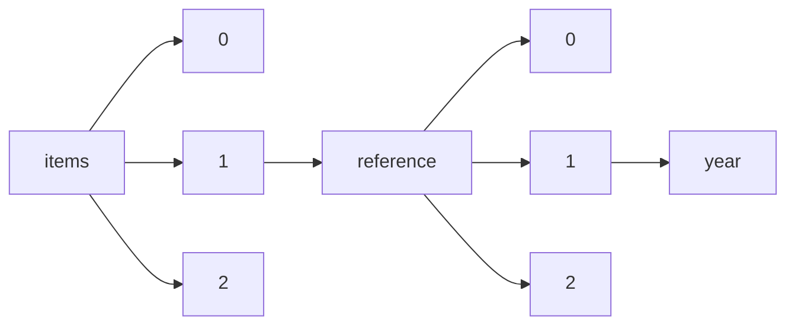

!!! warning "This document is not official Crossref documentation"
# Year
PATH = items/array/reference/array/year(1)  
Occurs 1 391 899 471 times  
Unique values: > 999  
{ .annotate }

1. A route to an element, for example:  
   The route "items/array/reference/array/year" corresponds to navigating through the JSON indices as  
   ["items"][0]["reference"][0]["year"]  

!!! note "Due to current limitations, only the first 1,000 unique values are counted."

| **Row** | **Value** `String` | **Count** `Int64` |
|--------:|----------------------:|---------------------:|
| **1**   | 2010                  | 42 397 327           |
| **2**   | 2009                  | 42 034 493           |
| **3**   | 2011                  | 41 634 619           |
| **4**   | 2008                  | 41 510 977           |
| **5**   | 2007                  | 41 232 560           |
| **6**   | 2012                  | 41 158 526           |
| **7**   | 2006                  | 40 729 654           |
| **8**   | 2013                  | 40 426 730           |
| **9**   | 2005                  | 39 830 091           |
| **10**  | 2014                  | 38 990 180           |
| **11**  | 2004                  | 38 717 965           |
| **12**  | 2015                  | 37 296 323           |
| **13**  | 2003                  | 37 150 911           |
| **14**  | 2002                  | 35 704 408           |
| **15**  | 2016                  | 34 645 005           |
| **16**  | 2001                  | 34 284 171           |
| **17**  | 2000                  | 34 149 890           |
| **18**  | 2017                  | 32 495 118           |
| **19**  | 1999                  | 30 614 889           |
| **20**  | 1998                  | 29 364 058           |
| **21**  | 2018                  | 29 354 062           |
| **22**  | 1997                  | 27 605 721           |
| **23**  | 1996                  | 26 466 253           |
| **24**  | 1995                  | 25 327 136           |
| **25**  | 2019                  | 25 199 791           |
| **26**  | 1994                  | 23 666 375           |
| **27**  | 1993                  | 22 648 378           |
| **28**  | 2020                  | 22 488 757           |
| **29**  | 1992                  | 21 410 476           |
| **30**  | 1991                  | 20 334 136           |
| **31**  | 1990                  | 19 874 703           |
| **32**  | 1989                  | 18 136 272           |
| **33**  | 1988                  | 17 334 172           |
| **34**  | 1987                  | 16 611 367           |
| **35**  | 1986                  | 15 770 575           |
| **36**  | 1985                  | 14 976 010           |
| **37**  | 1984                  | 14 323 581           |
| **38**  | 1983                  | 13 612 410           |
| **39**  | 2021                  | 13 258 950           |
| **40**  | 1982                  | 12 944 524           |
| **41**  | 1981                  | 12 370 863           |
| **42**  | 1980                  | 12 175 218           |
| **43**  | 1979                  | 11 295 395           |
| **44**  | 1978                  | 10 665 343           |
| **45**  | 1977                  | 10 365 616           |
| **46**  | 1976                  | 9 816 762            |
| **47**  | 1975                  | 9 341 349            |
| **48**  | 1974                  | 8 653 885            |
| **49**  | 1973                  | 8 384 642            |
| **50**  | 1972                  | 8 038 479            |
| **51**  | 1971                  | 7 454 302            |
| **52**  | 1970                  | 7 274 426            |
| **53**  | 1969                  | 6 621 419            |
| **54**  | 1968                  | 6 266 977            |
| **55**  | 1967                  | 6 037 943            |
| **56**  | 1966                  | 5 406 601            |
| **57**  | 1965                  | 5 320 341            |
| **58**  | 1964                  | 4 813 969            |
| **59**  | 2022                  | 4 467 112            |
| **60**  | 1963                  | 4 421 889            |
| **61**  | 0                     | 4 262 808            |
| **62**  | 1962                  | 4 084 369            |
| **63**  | 1961                  | 3 654 692            |
| **64**  | 1960                  | 3 488 204            |
| **65**  | 1959                  | 3 184 302            |
| **66**  | 1958                  | 2 939 234            |
| **67**  | 1957                  | 2 784 363            |
| **68**  | 1956                  | 2 515 311            |
| **69**  | 1955                  | 2 288 701            |
| **70**  | 1954                  | 2 154 709            |
| **71**  | 1953                  | 2 085 446            |
| **72**  | 1951                  | 1 980 528            |
| **73**  | 1952                  | 1 849 360            |
| **74**  | 1950                  | 1 646 752            |
| **75**  | 1949                  | 1 465 421            |
| **76**  |                       | 1 441 655            |
| **77**  | 1948                  | 1 264 878            |
| **78**  | 1947                  | 949 017              |
| **79**  | 1938                  | 889 999              |
| **80**  | 1937                  | 853 388              |
| **81**  | 1939                  | 848 115              |
| **82**  | 1936                  | 820 907              |
| **83**  | 1935                  | 796 255              |
| **84**  | 1946                  | 781 099              |
| **85**  | 1934                  | 773 386              |
| **86**  | 1940                  | 764 752              |
| **87**  | 1941                  | 764 371              |
| **88**  | 1932                  | 729 809              |
| **89**  | 1933                  | 705 267              |
| **90**  | 1942                  | 672 961              |
| **91**  | 1931                  | 667 714              |
| **92**  | 1945                  | 660 412              |
| **93**  | 1930                  | 645 160              |
| **94**  | 1944                  | 632 577              |
| **95**  | 1943                  | 624 626              |
| **96**  | 1929                  | 604 837              |
| **97**  | 1928                  | 593 880              |
| **98**  | 1927                  | 568 103              |
| **99**  | 1926                  | 530 168              |
| **100** | 1925                  | 503 883              |
| **101** | 1924                  | 441 164              |
| **102** | 1923                  | 412 868              |
| **103** | 1922                  | 398 415              |
| **104** | 1921                  | 372 427              |
| **105** | 1913                  | 332 861              |
| **106** | 1912                  | 321 700              |
| **107** | 1911                  | 314 230              |
| **108** | 1920                  | 307 821              |
| **109** | 1910                  | 303 766              |
| **110** | 1914                  | 294 566              |
| **111** | 1909                  | 288 203              |
| **112** | 1908                  | 279 043              |
| **113** | 1907                  | 255 360              |
| **114** | 1906                  | 254 878              |
| **115** | 1916                  | 244 871              |
| **116** | 1905                  | 242 794              |
| **117** | 1904                  | 234 034              |
| **118** | 1919                  | 232 155              |
| **119** | 1918                  | 226 588              |
| **120** | 1915                  | 224 056              |
| **121** | 1917                  | 219 840              |
| **122** | 1903                  | 215 692              |
| **123** | 1902                  | 206 210              |
| **124** | 1901                  | 198 356              |
| **125** | 1900                  | 197 935              |
| **126** | 1898                  | 174 773              |
| **127** | 1899                  | 173 586              |
| **128** | 1897                  | 165 672              |
| **129** | 1896                  | 164 778              |
| **130** | 1895                  | 158 971              |
| **131** | 1894                  | 150 679              |
| **132** | 1892                  | 144 899              |
| **133** | 1893                  | 144 554              |
| **134** | 1890                  | 143 665              |
| **135** | 2023                  | 137 025              |
| **136** | 1889                  | 126 906              |
| **137** | 1891                  | 126 476              |
| **138** | 1888                  | 116 393              |
| **139** | 1887                  | 115 806              |
| **140** | 1885                  | 110 263              |
| **141** | 1886                  | 103 732              |
| **142** | 1884                  | 102 789              |
| **143** | 1883                  | 101 016              |
| **144** | 1882                  | 95 505               |
| **145** | 1881                  | 89 042               |
| **146** | 1880                  | 87 543               |
| **147** | 1879                  | 85 142               |
| **148** | 1878                  | 80 543               |
| **149** | 1877                  | 77 783               |
| **150** | 1876                  | 73 152               |
| **151** | 1874                  | 70 112               |
| **152** | 1871                  | 67 053               |
| **153** | 1875                  | 66 704               |
| **154** | 1873                  | 66 087               |
| **155** | 1859                  | 63 984               |
| **156** | 1872                  | 63 583               |
| **157** | 1868                  | 56 753               |
| **158** | 1869                  | 56 666               |
| **159** | 1870                  | 55 505               |
| **160** | 1867                  | 54 885               |
| **161** | 1866                  | 51 706               |
| **162** | 1865                  | 50 337               |
| **163** | 1860                  | 49 407               |
| **164** | 1861                  | 48 096               |
| **165** | 1863                  | 48 011               |
| **166** | 1864                  | 46 713               |
| **167** | 1862                  | 44 135               |
| **168** | 1858                  | 43 146               |
| **169** | 1857                  | 41 829               |
| **170** | 1856                  | 41 687               |
| **171** | 1847                  | 40 133               |
| **172** | 1855                  | 39 961               |
| **173** | 1854                  | 39 869               |
| **174** | 1850                  | 39 488               |
| **175** | 1852                  | 38 830               |
| **176** | 1851                  | 38 000               |
| **177** | 1853                  | 37 889               |
| **178** | 2009a                 | 37 171               |
| **179** | 1848                  | 36 811               |
| **180** | 2009b                 | 36 638               |
| **181** | 1845                  | 36 366               |
| **182** | 2010a                 | 35 807               |
| **183** | 2010b                 | 35 304               |
| **184** | 2008a                 | 34 671               |
| **185** | 1849                  | 34 428               |
| **186** | 2008b                 | 34 323               |
| **187** | 1844                  | 34 255               |
| **188** | 2003a                 | 34 165               |
| **189** | 2004a                 | 34 006               |
| **190** | 2011a                 | 33 840               |
| **191** | 2007a                 | 33 772               |
| **192** | 2005a                 | 33 757               |
| **193** | 2003b                 | 33 752               |
| **194** | 2004b                 | 33 698               |
| **195** | 2011b                 | 33 681               |
| **196** | 1846                  | 33 610               |
| **197** | 2006a                 | 33 531               |
| **198** | 1838                  | 33 377               |
| **199** | 2007b                 | 33 251               |
| **200** | 2005b                 | 33 224               |
| **201** | 2006b                 | 32 946               |
| **202** | 1843                  | 32 773               |
| **203** | 1840                  | 32 458               |
| **204** | 2000a                 | 32 455               |
| **205** | 2000b                 | 32 218               |
| **206** | 2002a                 | 32 032               |
| **207** | 2001a                 | 31 885               |
| **208** | 2001b                 | 31 836               |
| **209** | 2012a                 | 31 701               |
| **210** | 2002b                 | 31 541               |
| **211** | 2012b                 | 31 303               |
| **212** | 1839                  | 31 183               |
| **213** | 1842                  | 30 368               |
| **214** | 1999a                 | 29 937               |
| **215** | 1999b                 | 29 619               |
| **216** | 2013a                 | 29 359               |
| **217** | 1998a                 | 29 293               |
| **218** | 1998b                 | 29 186               |
| **219** | 2013b                 | 28 991               |
| **220** | 1841                  | 28 844               |
| **221** | 1837                  | 27 582               |
| **222** | 1997a                 | 26 381               |
| **223** | 1996a                 | 26 374               |
| **224** | 1997b                 | 26 264               |
| **225** | 1836                  | 26 187               |
| **226** | 1996b                 | 25 841               |
| **227** | 1835                  | 25 506               |
| **228** | 1995a                 | 25 089               |
| **229** | 1995b                 | 24 696               |
| **230** | 2014a                 | 24 300               |
| **231** | 2014b                 | 24 250               |
| **232** | 1832                  | 24 108               |
| **233** | 1834                  | 24 033               |
| **234** | 1830                  | 23 719               |
| **235** | 1993a                 | 23 569               |
| **236** | 1994b                 | 23 559               |
| **237** | 1833                  | 23 377               |
| **238** | 1994a                 | 23 340               |
| **239** | 1993b                 | 23 305               |
| **240** | 1825                  | 22 616               |
| **241** | 1992b                 | 21 894               |
| **242** | 1992a                 | 21 822               |
| **243** | 1991a                 | 20 929               |
| **244** | 1991b                 | 20 797               |
| **245** | 2015a                 | 20 696               |
| **246** | 1828                  | 20 628               |
| **247** | 1990a                 | 20 458               |
| **248** | 2015b                 | 20 445               |
| **249** | 1831                  | 20 242               |
| **250** | 1990b                 | 20 083               |
| **251** | 1829                  | 19 868               |
| **252** | 1826                  | 19 839               |
| **253** | 1824                  | 19 476               |
| **254** | 1989a                 | 19 180               |
| **255** | 1989b                 | 19 073               |
| **256** | 1817                  | 18 364               |
| **257** | 1827                  | 18 143               |
| **258** | 1988a                 | 18 051               |
| **259** | 1821                  | 18 050               |
| **260** | 1822                  | 17 931               |
| **261** | 1988b                 | 17 825               |
| **262** | 1823                  | 17 429               |
| **263** | 1820                  | 17 177               |
| **264** | 1987a                 | 16 731               |
| **265** | 1986a                 | 16 483               |
| **266** | 1987b                 | 16 450               |
| **267** | 1986b                 | 16 256               |
| **268** | 1818                  | 15 615               |
| **269** | 1776                  | 15 598               |
| **270** | 1819                  | 15 328               |
| **271** | 1985a                 | 15 193               |
| **272** | 2016b                 | 15 177               |
| **273** | 2016a                 | 15 166               |
| **274** | 1985b                 | 14 988               |
| **275** | 1984b                 | 14 797               |
| **276** | 1984a                 | 14 693               |
| **277** | 1983a                 | 14 679               |
| **278** | 1800                  | 14 523               |
| **279** | 1983b                 | 14 395               |
| **280** | 1805                  | 14 368               |
| **281** | 1802                  | 13 421               |
| **282** | (199                  | 13 384               |
| **283** | 1809                  | 12 971               |
| **284** | 1982a                 | 12 758               |
| **285** | 1798                  | 12 587               |
| **286** | 1982b                 | 12 577               |
| **287** | 1981a                 | 12 384               |
| **288** | 1789                  | 12 252               |
| **289** | 1806                  | 12 099               |
| **290** | 1815                  | 12 068               |
| **291** | 1981b                 | 11 995               |
| **292** | 1980a                 | 11 902               |
| **293** | 1812                  | 11 763               |
| **294** | 1785                  | 11 750               |
| **295** | 1980b                 | 11 572               |
| **296** | 1801                  | 11 490               |
| **297** | 1816                  | 11 457               |
| **298** | 1814                  | 11 334               |
| **299** | 1790                  | 11 317               |
| **300** | 1803                  | 11 206               |
| **301** | 1811                  | 11 144               |
| **302** | 1813                  | 11 057               |
| **303** | 2017a                 | 10 838               |
| **304** | 1810                  | 10 818               |
| **305** | 2017b                 | 10 740               |
| **306** | 1807                  | 10 733               |
| **307** | 1978a                 | 10 649               |
| **308** | 1979a                 | 10 497               |
| **309** | 1808                  | 10 459               |
| **310** | 1978b                 | 10 419               |
| **311** | 1979b                 | 10 246               |
| **312** | 1795                  | 10 147               |
| **313** | 1788                  | 10 083               |
| **314** | 1804                  | 10 059               |
| **315** | 1791                  | 9 982                |
| **316** | 1793                  | 9 808                |
| **317** | 1787                  | 9 599                |
| **318** | 1758                  | 9 422                |
| **319** | 1977b                 | 9 223                |
| **320** | 1977a                 | 9 182                |
| **321** | 1797                  | 9 123                |
| **322** | 1976a                 | 8 975                |
| **323** | 1792                  | 8 797                |
| **324** | 1794                  | 8 692                |
| **325** | 1975a                 | 8 535                |
| **326** | 1976b                 | 8 418                |
| **327** | 1974a                 | 8 381                |
| **328** | 2020b                 | 8 209                |
| **329** | 2018b                 | 8 182                |
| **330** | 1799                  | 8 139                |
| **331** | 2018a                 | 8 115                |
| **332** | 1781                  | 8 039                |
| **333** | 2020a                 | 7 994                |
| **334** | 1974b                 | 7 804                |
| **335** | 1975b                 | 7 803                |
| **336** | 1775                  | 7 619                |
| **337** | 1973b                 | 7 581                |
| **338** | 1796                  | 7 573                |
| **339** | 1973a                 | 7 560                |
| **340** | 2019a                 | 7 347                |
| **341** | 1786                  | 7 310                |
| **342** | 1774                  | 7 280                |
| **343** | 2019b                 | 7 271                |
| **344** | 1753                  | 7 256                |
| **345** | 1784                  | 7 023                |
| **346** | (2011)                | 6 992                |
| **347** | (2012)                | 6 987                |
| **348** | 1755                  | 6 904                |
| **349** | 1972b                 | 6 841                |
| **350** | 1971a                 | 6 834                |
| **351** | 1972a                 | 6 807                |
| **352** | 1971b                 | 6 727                |
| **353** | 1783                  | 6 721                |
| **354** | 1970a                 | 6 687                |
| **355** | (2010)                | 6 608                |
| **356** | 1763                  | 6 519                |
| **357** | 1970b                 | 6 457                |
| **358** | 1777                  | 6 447                |
| **359** | 1772                  | 6 419                |
| **360** | 1969a                 | 6 257                |
| **361** | 1759                  | 6 209                |
| **362** | 1762                  | 6 058                |
| **363** | 1765                  | 6 004                |
| **364** | 1969b                 | 5 896                |
| **365** | (2009)                | 5 890                |
| **366** | (2013)                | 5 805                |
| **367** | 1773                  | 5 684                |
| **368** | 1748                  | 5 676                |
| **369** | 1770                  | 5 666                |
| **370** | 1767                  | 5 658                |
| **371** | 1782                  | 5 601                |
| **372** | 1651                  | 5 595                |
| **373** | 1778                  | 5 587                |
| **374** | 1768                  | 5 481                |
| **375** | (200                  | 5 438                |
| **376** | 1780                  | 5 418                |
| **377** | 1690                  | 5 415                |
| **378** | 1968b                 | 5 375                |
| **379** | (2008)                | 5 364                |
| **380** | 1967a                 | 5 307                |
| **381** | 1751                  | 5 307                |
| **382** | 1769                  | 5 239                |
| **383** | 1968a                 | 5 227                |
| **384** | 1739                  | 5 143                |
| **385** | 1779                  | 5 135                |
| **386** | (2006)                | 5 098                |
| **387** | (2007)                | 5 055                |
| **388** | 2021b                 | 5 052                |
| **389** | 1771                  | 5 026                |
| **390** | in press              | 4 948                |
| **391** | 2021a                 | 4 938                |
| **392** | 1967b                 | 4 936                |
| **393** | (2005)                | 4 934                |
| **394** | ..                    | 4 847                |
| **395** | 1757                  | 4 810                |
| **396** | (2004)                | 4 800                |
| **397** | 1966a                 | 4 728                |
| **398** | 1740                  | 4 728                |
| **399** | (2003)                | 4 661                |
| **400** | 1966b                 | 4 575                |
| **401** | n.d.                  | 4 561                |
| **402** | 1764                  | 4 482                |
| **403** | (2002)                | 4 472                |
| **404** | 1756                  | 4 456                |
| **405** | 1965a                 | 4 394                |
| **406** | 1738                  | 4 242                |
| **407** | (2014)                | 4 242                |
| **408** | (2001)                | 4 166                |
| **409** | (2016)                | 4 081                |
| **410** | (2015)                | 4 059                |
| **411** | (2018)                | 4 020                |
| **412** | 1766                  | 4 005                |
| **413** | 1965b                 | 3 963                |
| **414** | 1744                  | 3 959                |
| **415** | 1749                  | 3 953                |
| **416** | 1665                  | 3 882                |
| **417** | 1964a                 | 3 876                |
| **418** | 1656                  | 3 869                |
| **419** | 1754                  | 3 857                |
| **420** | 1964b                 | 3 857                |
| **421** | 1750                  | 3 830                |
| **422** | (2017)                | 3 789                |
| **423** | 1761                  | 3 778                |
| **424** | (2019)                | 3 755                |
| **425** | (1996)                | 3 741                |
| **426** | 1760                  | 3 714                |
| **427** | 1743                  | 3 694                |
| **428** | (2000)                | 3 693                |
| **429** | 1660                  | 3 687                |
| **430** | 1963a                 | 3 674                |
| **431** | 1729                  | 3 667                |
| **432** | 1668                  | 3 652                |
| **433** | 1696                  | 3 633                |
| **434** | 1662                  | 3 622                |
| **435** | 1                     | 3 614                |
| **436** | 1963b                 | 3 596                |
| **437** | 1641                  | 3 564                |
| **438** | 1687                  | 3 474                |
| **439** | (1997)                | 3 453                |
| **440** | (1998)                | 3 425                |
| **441** | 1689                  | 3 404                |
| **442** | 1734                  | 3 367                |
| **443** | 1649                  | 3 317                |
| **444** | 1728                  | 3 316                |
| **445** | 1611                  | 3 315                |
| **446** | 1664                  | 3 305                |
| **447** | 1699                  | 3 282                |
| **448** | (1999)                | 3 276                |
| **449** | 1747                  | 3 276                |
| **450** | 1704                  | 3 275                |
| **451** | 1735                  | 3 249                |
| **452** | 1672                  | 3 246                |
| **453** | 1705                  | 3 240                |
| **454** | 1736                  | 3 228                |
| **455** | (2020)                | 3 219                |
| **456** | 1648                  | 3 205                |
| **457** | (1995)                | 3 195                |
| **458** | (1994)                | 3 183                |
| **459** | 1669                  | 3 164                |
| **460** | 1612                  | 3 157                |
| **461** | 1697                  | 3 141                |
| **462** | 1644                  | 3 132                |
| **463** | 1710                  | 3 125                |
| **464** | 1658                  | 3 122                |
| **465** | 1686                  | 3 120                |
| **466** | 1647                  | 3 120                |
| **467** | 1700                  | 3 112                |
| **468** | 1730                  | 3 112                |
| **469** | 1727                  | 3 100                |
| **470** | 1609                  | 3 078                |
| **471** | 2010c                 | 3 072                |
| **472** | 1713                  | 3 056                |
| **473** | 1684                  | 3 040                |
| **474** | 1600                  | 3 030                |
| **475** | 1732                  | 3 020                |
| **476** | 1674                  | 3 015                |
| **477** | 1733                  | 3 014                |
| **478** | 1691                  | 3 009                |
| **479** | 1724                  | 3 003                |
| **480** | 1653                  | 2 994                |
| **481** | 1725                  | 2 991                |
| **482** | 1698                  | 2 981                |
| **483** | 1659                  | 2 980                |
| **484** | 1681                  | 2 964                |
| **485** | 1655                  | 2 958                |
| **486** | 1962a                 | 2 954                |
| **487** | 1598                  | 2 945                |
| **488** | 1695                  | 2 925                |
| **489** | 1680                  | 2 920                |
| **490** | 1650                  | 2 913                |
| **491** | 1620                  | 2 911                |
| **492** | 2013c                 | 2 909                |
| **493** | 2009c                 | 2 897                |
| **494** | 1646                  | 2 890                |
| **495** | (1993)                | 2 864                |
| **496** | 1694                  | 2 849                |
| **497** | 1752                  | 2 848                |
| **498** | 1678                  | 2 848                |
| **499** | 1961a                 | 2 844                |
| **500** | 1962b                 | 2 834                |
| **501** | 1702                  | 2 831                |
| **502** | 2011c                 | 2 830                |
| **503** | 1675                  | 2 827                |
| **504** | 1603                  | 2 801                |
| **505** | 1721                  | 2 798                |
| **506** | 1670                  | 2 790                |
| **507** | 1605                  | 2 785                |
| **508** | 1745                  | 2 784                |
| **509** | 1623                  | 2 776                |
| **510** | 1682                  | 2 752                |
| **511** | 1723                  | 2 751                |
| **512** | 1726                  | 2 728                |
| **513** | 1640                  | 2 716                |
| **514** | 1715                  | 2 715                |
| **515** | 1720                  | 2 713                |
| **516** | 1961b                 | 2 700                |
| **517** | 2012c                 | 2 692                |
| **518** | 1615                  | 2 686                |
| **519** | 1741                  | 2 670                |
| **520** | 1685                  | 2 647                |
| **521** | 1960a                 | 2 637                |
| **522** | 1709                  | 2 635                |
| **523** | 1613                  | 2 633                |
| **524** | 1960b                 | 2 622                |
| **525** | 1677                  | 2 620                |
| **526** | 1742                  | 2 613                |
| **527** | 1586                  | 2 605                |
| **528** | 0000                  | 2 600                |
| **529** | 2008c                 | 2 594                |
| **530** | 1606                  | 2 587                |
| **531** | 1642                  | 2 581                |
| **532** | 1661                  | 2 580                |
| **533** | (1990)                | 2 572                |
| **534** | 2005c                 | 2 531                |
| **535** | 1959a                 | 2 525                |
| **536** | 1614                  | 2 521                |
| **537** | 1673                  | 2 521                |
| **538** | 2                     | 2 517                |
| **539** | 1597                  | 2 517                |
| **540** | 1604                  | 2 510                |
| **541** | 1958a                 | 2 493                |
| **542** | .                     | 2 492                |
| **543** | (1992)                | 2 492                |
| **544** | forthcoming           | 2 488                |
| **545** | 1679                  | 2 481                |
| **546** | 1638                  | 2 467                |
| **547** | 1610                  | 2 463                |
| **548** | 1599                  | 2 461                |
| **549** | 1594                  | 2 457                |
| **550** | (1991)                | 2 451                |
| **551** | 1746                  | 2 440                |
| **552** | 1998.                 | 2 415                |
| **553** | 1588                  | 2 405                |
| **554** | 1737                  | 2 404                |
| **555** | 1688                  | 2 398                |
| **556** | 2000c                 | 2 368                |
| **557** | 1643                  | 2 368                |
| **558** | 2007c                 | 2 358                |
| **559** | 1652                  | 2 356                |
| **560** | 2001c                 | 2 351                |
| **561** | 2004c                 | 2 350                |
| **562** | 1717                  | 2 336                |
| **563** | 1683                  | 2 334                |
| **564** | 2000.                 | 2 333                |
| **565** | 1657                  | 2 323                |
| **566** | 1584                  | 2 320                |
| **567** | 1958b                 | 2 309                |
| **568** | 1703                  | 2 303                |
| **569** | 1667                  | 2 299                |
| **570** | 1596                  | 2 288                |
| **571** | 1654                  | 2 285                |
| **572** | 1706                  | 2 272                |
| **573** | 1666                  | 2 258                |
| **574** | 2014c                 | 2 254                |
| **575** | 1998c                 | 2 233                |
| **576** | 2003c                 | 2 225                |
| **577** | 1693                  | 2 217                |
| **578** | 1692                  | 2 210                |
| **579** | 1676                  | 2 196                |
| **580** | 1663                  | 2 195                |
| **581** | 1570                  | 2 192                |
| **582** | 1959b                 | 2 190                |
| **583** | 200                   | 2 160                |
| **584** | 1625                  | 2 160                |
| **585** | 1701                  | 2 147                |
| **586** | 1624                  | 2 144                |
| **587** | 1607                  | 2 138                |
| **588** | (1989)                | 2 133                |
| **589** | 1731                  | 2 099                |
| **590** | 1619                  | 2 095                |
| **591** | 1999.                 | 2 075                |
| **592** | 1556                  | 2 073                |
| **593** | 1645                  | 2 069                |
| **594** | 1581                  | 2 065                |
| **595** | 1628                  | 2 056                |
| **596** | 2006c                 | 2 056                |
| **597** | 1999c                 | 2 045                |
| **598** | 2002c                 | 2 037                |
| **599** | 2015c                 | 2 033                |
| **600** | 1708                  | 2 028                |
| **601** | (1988)                | 2 022                |
| **602** | 1601                  | 2 012                |
| **603** | 1718                  | 2 003                |
| **604** | 1712                  | 2 000                |
| **605** | 1589                  | 1 991                |
| **606** | 1957a                 | 1 990                |
| **607** | 1555                  | 1 981                |
| **608** | 1587                  | 1 971                |
| **609** | 1956a                 | 1 966                |
| **610** | 1602                  | 1 950                |
| **611** | 1719                  | 1 950                |
| **612** | (1982)                | 1 946                |
| **613** | 1621                  | 1 940                |
| **614** | 1616                  | 1 937                |
| **615** | 1714                  | 1 931                |
| **616** | 1711                  | 1 930                |
| **617** | 1707                  | 1 929                |
| **618** | (1986)                | 1 919                |
| **619** | 1671                  | 1 918                |
| **620** | 1592                  | 1 909                |
| **621** | (1973)                | 1 908                |
| **622** | 1631                  | 1 884                |
| **623** | 1608                  | 1 881                |
| **624** | 1955a                 | 1 875                |
| **625** | 1577                  | 1 872                |
| **626** | 1997c                 | 1 869                |
| **627** | 1591                  | 1 859                |
| **628** | 1550                  | 1 851                |
| **629** | 1630                  | 1 846                |
| **630** | 1637                  | 1 842                |
| **631** | 1956b                 | 1 838                |
| **632** | 1954b                 | 1 837                |
| **633** | 1633                  | 1 827                |
| **634** | (1970)                | 1 804                |
| **635** | 1582                  | 1 800                |
| **636** | 1590                  | 1 798                |
| **637** | 1543                  | 1 791                |
| **638** | (1972)                | 1 784                |
| **639** | 1957b                 | 1 783                |
| **640** | (1969)                | 1 772                |
| **641** | (1980)                | 1 758                |
| **642** | (1987)                | 1 746                |
| **643** | 1997.                 | 1 744                |
| **644** | (1971)                | 1 741                |
| **645** | 1576                  | 1 737                |
| **646** | 1595                  | 1 730                |
| **647** | (1968)                | 1 725                |
| **648** | 1618                  | 1 724                |
| **649** | (1984)                | 1 698                |
| **650** | 1994c                 | 1 696                |
| **651** | 2016c                 | 1 693                |
| **652** | 1954a                 | 1 691                |
| **653** | 1593                  | 1 685                |
| **654** | 1995.                 | 1 676                |
| **655** | 1955b                 | 1 654                |
| **656** | 1996c                 | 1 646                |
| **657** | 1992c                 | 1 643                |
| **658** | 1622                  | 1 642                |
| **659** | 3                     | 1 633                |
| **660** | (1976)                | 1 629                |
| **661** | (1981)                | 1 618                |
| **662** | Forthcoming           | 1 614                |
| **663** | (1975)                | 1 608                |
| **664** | 1548                  | 1 608                |
| **665** | 1553                  | 1 607                |
| **666** | (1977)                | 1 603                |
| **667** | 2022b                 | 1 590                |
| **668** | 1996.                 | 1 576                |
| **669** | 1951a                 | 1 556                |
| **670** | 1993c                 | 1 545                |
| **671** | 1722                  | 1 541                |
| **672** | (1979)                | 1 537                |
| **673** | 1580                  | 1 527                |
| **674** | 1559                  | 1 525                |
| **675** | 1567                  | 1 518                |
| **676** | (1985)                | 1 512                |
| **677** | (1978)                | 1 512                |
| **678** | 1554                  | 1 507                |
| **679** | 1540                  | 1 502                |
| **680** | 1627                  | 1 501                |
| **681** | 1585                  | 1 488                |
| **682** | (1967)                | 1 480                |
| **683** | 1583                  | 1 478                |
| **684** | 1579                  | 1 470                |
| **685** | 1990c                 | 1 466                |
| **686** | 1953b                 | 1 466                |
| **687** | 1953a                 | 1 463                |
| **688** | 1716                  | 1 462                |
| **689** | (1983)                | 1 459                |
| **690** | -1                    | 1 448                |
| **691** | (1966)                | 1 447                |
| **692** | 1629                  | 1 432                |
| **693** | 1994.                 | 1 423                |
| **694** | 1632                  | 1 378                |
| **695** | 1634                  | 1 375                |
| **696** | 1578                  | 1 371                |
| **697** | (198                  | 1 367                |
| **698** | 1639                  | 1 358                |
| **699** | 199                   | 1 352                |
| **700** | 1573                  | 1 346                |
| **701** | 1995c                 | 1 344                |
| **702** | (1964)                | 1 343                |
| **703** | (1974)                | 1 340                |
| **704** | 1565                  | 1 336                |
| **705** | 2022a                 | 1 329                |
| **706** | 1949a                 | 1 321                |
| **707** | 1561                  | 1 313                |
| **708** | 1636                  | 1 303                |
| **709** | 1952a                 | 1 295                |
| **710** | 2002.                 | 1 292                |
| **711** | (1965)                | 1 290                |
| **712** | 1991c                 | 1 282                |
| **713** | 1566                  | 1 269                |
| **714** | 2017c                 | 1 241                |
| **715** | 2019.                 | 1 240                |
| **716** | 1560                  | 1 234                |
| **717** | (2021)                | 1 228                |
| **718** | 1574                  | 1 226                |
| **719** | 1998;                 | 1 225                |
| **720** | 1558                  | 1 213                |
| **721** | 1545                  | 1 210                |
| **722** | 1993.                 | 1 202                |
| **723** | 1562                  | 1 185                |
| **724** | 1950a                 | 1 168                |
| **725** | 1549                  | 1 164                |
| **726** | 1552                  | 1 156                |
| **727** | 2020.                 | 1 152                |
| **728** | 1635                  | 1 149                |
| **729** | 201                   | 1 144                |
| **730** | 2001.                 | 1 130                |
| **731** | 2018.                 | 1 129                |
| **732** | 1951b                 | 1 126                |
| **733** | 1563                  | 1 122                |
| **734** | 1617                  | 1 122                |
| **735** | 1999;                 | 1 107                |
| **736** | 1952b                 | 1 100                |
| **737** | 1949b                 | 1 088                |
| **738** | 1984c                 | 1 082                |
| **739** | 2004.                 | 1 079                |
| **740** | 1948b                 | 1 078                |
| **741** | 1542                  | 1 075                |
| **742** | 1557                  | 1 064                |
| **743** | 1997;                 | 1 059                |
| **744** | 1950b                 | 1 029                |
| **745** | 1571                  | 1 027                |
| **746** | 1569                  | 1 019                |
| **747** | 1575                  | 1 017                |
| **748** | 1938a                 | 1 012                |
| **749** | 1992.                 | 1 006                |
| **750** | 1989c                 | 984                  |
| **751** | 4                     | 984                  |
| **752** | 2003.                 | 974                  |
| **753** | 2020c                 | 963                  |
| **754** | 1572                  | 956                  |
| **755** | 2007.                 | 948                  |
| **756** | 1516                  | 947                  |
| **757** | 1988c                 | 946                  |
| **758** | 1990.                 | 944                  |
| **759** | 1996;                 | 933                  |
| **760** | 2008.                 | 932                  |
| **761** | 1936a                 | 931                  |
| **762** | 1986c                 | 928                  |
| **763** | 1531                  | 901                  |
| **764** | (1963)                | 901                  |
| **765** | 1564                  | 901                  |
| **766** | 94                    | 899                  |
| **767** | 2005.                 | 897                  |
| **768** | 1539                  | 896                  |
| **769** | 1991.                 | 889                  |
| **770** | 2000;                 | 886                  |
| **771** | 1551                  | 876                  |
| **772** | (1962)                | 874                  |
| **773** | 1039                  | 870                  |
| **774** | 2017.                 | 869                  |
| **775** | 2001;                 | 868                  |
| **776** | 93                    | 860                  |
| **777** | 1626                  | 852                  |
| **778** | 1547                  | 849                  |
| **779** | 1983c                 | 846                  |
| **780** | 1987c                 | 846                  |
| **781** | 96                    | 841                  |
| **782** | 1535                  | 831                  |
| **783** | 1948a                 | 819                  |
| **784** | 1985c                 | 818                  |
| **785** | 2015.                 | 811                  |
| **786** | 1995;                 | 809                  |
| **787** | 2006.                 | 805                  |
| **788** | 2010.                 | 803                  |
| **789** | 97                    | 769                  |
| **790** | 2019c                 | 762                  |
| **791** | 92                    | 760                  |
| **792** | 95                    | 751                  |
| **793** | 1980c                 | 746                  |
| **794** | (1958)                | 728                  |
| **795** | 1937a                 | 718                  |
| **796** | 1568                  | 713                  |
| **797** | 15                    | 711                  |
| **798** | (1960)                | 709                  |
| **799** | &NA;                  | 707                  |
| **800** | 1940a                 | 700                  |
| **801** | 1544                  | 697                  |
| **802** | 2018c                 | 692                  |
| **803** | 2016.                 | 690                  |
| **804** | 1525                  | 684                  |
| **805** | 1936b                 | 681                  |
| **806** | 98                    | 675                  |
| **807** | 1994;                 | 675                  |
| **808** | 91                    | 670                  |
| **809** | 2014.                 | 665                  |
| **810** | 1533                  | 649                  |
| **811** | 1530                  | 643                  |
| **812** | (1961)                | 635                  |
| **813** | 1989.                 | 631                  |
| **814** | 1989–90               | 628                  |
| **815** | 1521                  | 625                  |
| **816** | 2009.                 | 620                  |
| **817** | 1939b                 | 617                  |
| **818** | 1938b                 | 614                  |
| **819** | 1979–80               | 604                  |
| **820** | 1977c                 | 602                  |
| **821** | 1993;                 | 601                  |
| **822** | 2013.                 | 596                  |
| **823** | 89                    | 582                  |
| **824** | 1935a                 | 582                  |
| **825** | 90                    | 580                  |
| **826** | 2011.                 | 580                  |
| **827** | 1968–9                | 578                  |
| **828** | 1979c                 | 576                  |
| **829** | 19                    | 573                  |
| **830** | 1981c                 | 561                  |
| **831** | 1939a                 | 544                  |
| **832** | 1532                  | 542                  |
| **833** | 1946a                 | 533                  |
| **834** | 1000                  | 530                  |
| **835** | 1494                  | 528                  |
| **836** | 2103                  | 527                  |
| **837** | 2104                  | 525                  |
| **838** | 1932b                 | 523                  |
| **839** | 1947a                 | 515                  |
| **840** | 1536                  | 515                  |
| **841** | 1500                  | 513                  |
| **842** | 1520                  | 505                  |
| **843** | 2012.                 | 504                  |
| **844** | 1518                  | 502                  |
| **845** | 1991;                 | 502                  |
| **846** | 88                    | 496                  |
| **847** | 1935b                 | 493                  |
| **848** | 1929a                 | 475                  |
| **849** | 5                     | 473                  |
| **850** | 6                     | 471                  |
| **851** | , 2002                | 469                  |
| **852** | 1932a                 | 464                  |
| **853** | 1528                  | 458                  |
| **854** | 1986.                 | 456                  |
| **855** | 1946b                 | 450                  |
| **856** | 2002;                 | 446                  |
| **857** | 1523                  | 446                  |
| **858** | 2008 Feb              | 441                  |
| **859** | 20                    | 439                  |
| **860** | 1538                  | 437                  |
| **861** | 1969–70               | 435                  |
| **862** | 1934a                 | 434                  |
| **863** | 1930a                 | 432                  |
| **864** | In press              | 432                  |
| **865** | 1513                  | 431                  |
| **866** | 1934b                 | 429                  |
| **867** | 1973c                 | 425                  |
| **868** | 87                    | 422                  |
| **869** | 1957–8                | 420                  |
| **870** | 1481                  | 415                  |
| **871** | , 2001                | 415                  |
| **872** | 2013d                 | 413                  |
| **873** | , 2003                | 411                  |
| **874** | 1940b                 | 411                  |
| **875** | 1987.                 | 406                  |
| **876** | 1929—38               | 386                  |
| **877** | 1992;                 | 381                  |
| **878** | 2015d                 | 380                  |
| **879** | 1497                  | 379                  |
| **880** | 1929–38               | 378                  |
| **881** | 1946–59               | 376                  |
| **882** | 1978c                 | 375                  |
| **883** | 1933b                 | 370                  |
| **884** | 1930b                 | 367                  |
| **885** | ..-                   | 359                  |
| **886** | 1976–7                | 358                  |
| **887** | (1956)                | 350                  |
| **888** | 1529                  | 350                  |
| **889** | 1546                  | 349                  |
| **890** | 1990;                 | 345                  |
| **891** | 1495                  | 343                  |
| **892** | 99                    | 338                  |
| **893** | 1491                  | 337                  |
| **894** | 1894–1980             | 334                  |
| **895** | (1959)                | 328                  |
| **896** | , 1999                | 321                  |
| **897** | 2006)                 | 319                  |
| **898** | 1955–6                | 316                  |
| **899** | 1982c                 | 315                  |
| **900** | 2021c                 | 314                  |
| **901** | 1493                  | 313                  |
| **902** | 2008 Apr              | 307                  |
| **903** | 1526                  | 306                  |
| **904** | , 2000                | 305                  |
| **905** | 1950–1                | 304                  |
| **906** | 1977–8                | 303                  |
| **907** | 1988.                 | 301                  |
| **908** | 1949–50               | 292                  |
| **909** | 1514                  | 292                  |
| **910** | (1957)                | 282                  |
| **911** | 1907–8                | 281                  |
| **912** | 1502                  | 277                  |
| **913** | , 1998                | 277                  |
| **914** | 1959–60               | 270                  |
| **915** | 1910–13               | 268                  |
| **916** | 1967–8                | 265                  |
| **917** | 1883b                 | 265                  |
| **918** | 1512                  | 264                  |
| **919** | 1959/60               | 263                  |
| **920** | 1953/54               | 262                  |
| **921** | 2003;                 | 261                  |
| **922** | YR                    | 257                  |
| **923** | n.d                   | 256                  |
| **924** | 1975–6                | 251                  |
| **925** | 1345/1966             | 251                  |
| **926** | 1963–4                | 251                  |
| **927** | 2007 Aug              | 248                  |
| **928** | 2014d                 | 248                  |
| **929** | 2025                  | 247                  |
| **930** | 1527                  | 247                  |
| **931** | 2008 May              | 244                  |
| **932** | 2009 Jan              | 242                  |
| **933** | 0200                  | 242                  |
| **934** | 2008 Jun              | 239                  |
| **935** | 1954/55               | 234                  |
| **936** | , 1997                | 234                  |
| **937** | 1999–2000             | 230                  |
| **938** | 1947b                 | 225                  |
| **939** | 1950/51               | 220                  |
| **940** | 199?                  | 220                  |
| **941** | 2009 Jun              | 214                  |
| **942** | 1988–9                | 210                  |
| **943** | 1482                  | 210                  |
| **944** | 2008 Jan              | 210                  |
| **945** | 1997)                 | 209                  |
| **946** | 1955/56               | 209                  |
| **947** | 1954–6                | 207                  |
| **948** | (1953)                | 207                  |
| **949** | 1956–8                | 203                  |
| **950** | 1929b                 | 202                  |
| **951** | 1952/53               | 196                  |
| **952** | 1517                  | 196                  |
| **953** | 1938–39               | 190                  |
| **954** | 2011;                 | 190                  |
| **955** | 1844–73               | 188                  |
| **956** | 2010;                 | 187                  |
| **957** | 1966–7                | 181                  |
| **958** | 1505                  | 180                  |
| **959** | 2007 Jul              | 179                  |
| **960** | 1841–64               | 179                  |
| **961** | 1956/57               | 177                  |
| **962** | 1958–9                | 171                  |
| **963** | 1489                  | 171                  |
| **964** | 1492                  | 171                  |
| **965** | 2006 Dec              | 169                  |
| **966** | 1953–4                | 167                  |
| **967** | 2024                  | 167                  |
| **968** | 2105                  | 167                  |
| **969** | 1498                  | 164                  |
| **970** | 2009 Feb              | 163                  |
| **971** | (1954)                | 162                  |
| **972** | 1982–3                | 159                  |
| **973** | 1519                  | 158                  |
| **974** | 1905–6                | 158                  |
| **975** | 2007 Feb              | 155                  |
| **976** | 1857–74               | 154                  |
| **977** | 1928–9                | 151                  |
| **978** | (197                  | 150                  |
| **979** | 1949/50               | 149                  |
| **980** | , 1965                | 145                  |
| **981** | 1883–5                | 144                  |
| **982** | 1988–1989             | 143                  |
| **983** | 2008 Oct              | 142                  |
| **984** | 1883a                 | 142                  |
| **985** | 1830–42               | 141                  |
| **986** | 1902a                 | 141                  |
| **987** | 1940–2                | 141                  |
| **988** | 1902b                 | 140                  |
| **989** | 2007 Dec              | 138                  |
| **990** | 10                    | 134                  |
| **991** | 1962–3                | 133                  |
| **992** | 1978–9                | 133                  |
| **993** | 1922a                 | 132                  |
| **994** | 1971–2                | 118                  |
| **995** | 1972–3                | 117                  |
| **996** | 1541                  | 115                  |
| **997** | 1964–5                | 112                  |
| **998** | 1984–91               | 111                  |
| **999** | 1922b                 | 110                  |
| ... | ... | ... |

