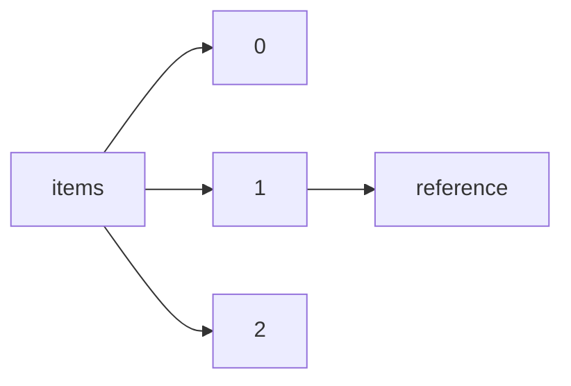

!!! warning "This document is not official Crossref documentation"
# Reference
PATH = items/array/reference(1)  
Occurs 63 912 190 times  
{ .annotate }

1. A route to an element, for example:  
   The route "items/array/reference" corresponds to navigating through the JSON indices as  
   ["items"][0]["reference"]  

## Properties of Array
See information about elements: [items/array/reference/array](array/index.md)  
Distribution of lengths:  

!!! note "Due to current limitations, only the first 1,000 unique values are counted."

| **Row** | **Length** `Any` | **Count** `Int64` |
|--------:|--------------------:|---------------------:|
| **1**   | 1                   | 3 319 811            |
| **2**   | 2                   | 1 071 606            |
| **3**   | 3                   | 1 163 861            |
| **4**   | 4                   | 1 271 730            |
| **5**   | 5                   | 1 503 969            |
| **6**   | 6                   | 1 418 206            |
| **7**   | 7                   | 1 412 702            |
| **8**   | 8                   | 1 454 521            |
| **9**   | 9                   | 1 438 982            |
| **10**  | 10                  | 1 641 627            |
| ... | ... | ... |

