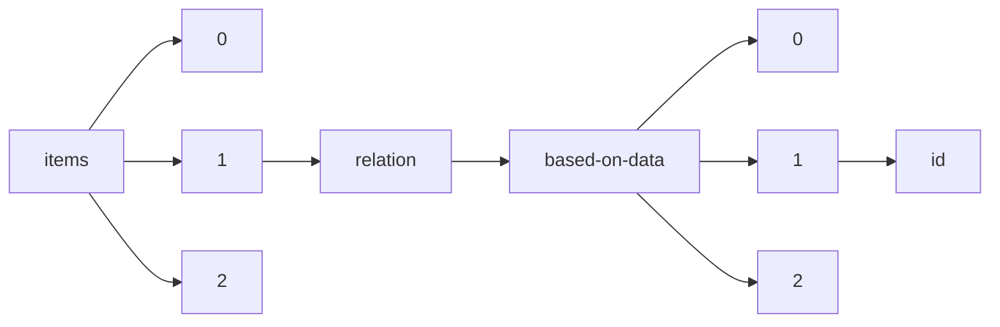

!!! warning "This document is not official Crossref documentation"
# Id
PATH = items/array/relation/based-on-data/array/id(1)  
Occurs 197 times  
Unique values: 171  
{ .annotate }

1. A route to an element, for example:  
   The route "items/array/relation/based-on-data/array/id" corresponds to navigating through the JSON indices as  
   ["items"][0]["relation"]["based-on-data"][0]["id"]  

| **Row** | **Value** `String`                    | **Count** `Int64` |
|--------:|-----------------------------------------:|---------------------:|
| **1**   |                                          | 18                   |
| **2**   | 10.1575/1912/bco-dmo.734649.1            | 3                    |
| **3**   | 10.1575/1912/bco-dmo.735117.1            | 2                    |
| **4**   | 10.1575/1912/bco-dmo.786098.1            | 2                    |
| **5**   | 10.1575/1912/bco-dmo.805653.1            | 2                    |
| **6**   | 10.1575/1912/bco-dmo.805546.1            | 2                    |
| **7**   | 10.1575/1912/bco-dmo.668083.1            | 2                    |
| **8**   | 10.1575/1912/bco-dmo.787329.1            | 2                    |
| **9**   | 10.1575/1912/bco-dmo.3871.5.1            | 2                    |
| **10**  | https://github.com/nytimes/covid-19-data | 1                    |
| **11**  | 10.1575/1912/bco-dmo.2330.1              | 1                    |
| **12**  | 10.5281/zenodo.4249552                   | 1                    |
| **13**  | 10.1575/1912/bco-dmo.774792.1            | 1                    |
| **14**  | 10.1575/1912/bco-dmo.715422.1            | 1                    |
| **15**  | 10.5281/zenodo.4048731                   | 1                    |
| **16**  | 10.1575/1912/bco-dmo.789217.1            | 1                    |
| **17**  | 10.1575/1912/bco-dmo.765108.1            | 1                    |
| **18**  | 10.1575/1912/bco-dmo.793561.1            | 1                    |
| **19**  | 10.38211/joarps.2020.1.1.3               | 1                    |
| **20**  | 10.1575/1912/bco-dmo.735267.1            | 1                    |
| **21**  | 10.1575/1912/bco-dmo.793682.1            | 1                    |
| **22**  | 10.1575/1912/bco-dmo.774639.1            | 1                    |
| **23**  | 10.1575/1912/bco-dmo.684177.1            | 1                    |
| **24**  | 10.5281/zenodo.4637081                   | 1                    |
| **25**  | 10.1575/1912/bco-dmo.774827.1            | 1                    |
| **26**  | 10.1575/1912/bco-dmo.734442.2            | 1                    |
| **27**  | 10.1575/1912/bco-dmo.780127.1            | 1                    |
| **28**  | 10.1575/1912/bco-dmo.774799.1            | 1                    |
| **29**  | 10.1575/1912/bco-dmo.775732.1            | 1                    |
| **30**  | 10.1575/1912/bco-dmo.793571.1            | 1                    |
| **31**  | 10.1575/1912/bco-dmo.733173.1            | 1                    |
| **32**  | 10.1575/1912/bco-dmo.774841.1            | 1                    |
| **33**  | 10.1575/1912/bco-dmo.764546.1            | 1                    |
| **34**  | 10.1575/1912/bco-dmo.783755.1            | 1                    |
| **35**  | 10.4125/pd0123th                         | 1                    |
| **36**  | 10.1575/1912/bco-dmo.523365.1            | 1                    |
| **37**  | 10.1575/1912/bco-dmo.3146.1              | 1                    |
| **38**  | 10.1575/1912/bco-dmo.774820.1            | 1                    |
| **39**  | 10.38211/joarps.2020.1.1.2               | 1                    |
| **40**  | volume 2                                 | 1                    |
| **41**  | 10.25820/3aqn-f022                       | 1                    |
| **42**  | 10.1575/1912/bco-dmo.773802.1            | 1                    |
| **43**  | 10.1575/1912/bco-dmo.715160.1            | 1                    |
| **44**  | 10.1575/1912/bco-dmo.747014.1            | 1                    |
| **45**  | 10.1575/1912/bco-dmo.747248.1            | 1                    |
| **46**  | 10.1575/1912/bco-dmo.780248.1            | 1                    |
| **47**  | 10.1575/1912/bco-dmo.805252.1            | 1                    |
| **48**  | 10.25820/8ceb-tm34                       | 1                    |
| **49**  | 10.38211/joarps.2020.1.1.4               | 1                    |
| **50**  | 1859-4506                                | 1                    |
| **51**  | 10.1575/1912/bco-dmo.754644.1            | 1                    |
| **52**  | 10.1575/1912/bco-dmo.733210.1            | 1                    |
| **53**  | 10.1575/1912/bco-dmo.738178.1            | 1                    |
| **54**  | 10.1575/1912/bco-dmo.789210.1            | 1                    |
| **55**  | 10.25820/r8yk-ee67                       | 1                    |
| **56**  | 10.1575/1912/bco-dmo.765081.1            | 1                    |
| **57**  | 10.1575/1912/bco-dmo.734406.1            | 1                    |
| **58**  | 10.1575/1912/bco-dmo.780225.1            | 1                    |
| **59**  | 10.1575/1912/bco-dmo.794163.1            | 1                    |
| **60**  | 10.5281/zenodo.5115431                   | 1                    |
| **61**  | 10.1575/1912/bco-dmo.753594.1            | 1                    |
| **62**  | 10.1575/1912/bco-dmo.738188.1            | 1                    |
| **63**  | 10.5281/zenodo.5109235                   | 1                    |
| **64**  | 10.1575/1912/bco-dmo.773896.1            | 1                    |
| **65**  | 10.1575/1912/bco-dmo.789145.1            | 1                    |
| **66**  | 10.1575/1912/bco-dmo.735231.1            | 1                    |
| **67**  | 10.1575/1912/bco-dmo.738494.1            | 1                    |
| **68**  | 10.1575/1912/bco-dmo.774634.1            | 1                    |
| **69**  | 10.1575/1912/bco-dmo.738772.1            | 1                    |
| **70**  | 10.1575/1912/bco-dmo.768607.1            | 1                    |
| **71**  | 10.5281/zenodo.4771250                   | 1                    |
| **72**  | 10.1575/1912/bco-dmo.728084.1            | 1                    |
| **73**  | 10.1575/1912/bco-dmo.739309.1            | 1                    |
| **74**  | 10.1575/1912/bco-dmo.735258.1            | 1                    |
| **75**  | 10.1575/1912/bco-dmo.747279.1            | 1                    |
| **76**  | 10.1575/1912/bco-dmo.764664.1            | 1                    |
| **77**  | 10.1575/1912/bco-dmo.739636.1            | 1                    |
| **78**  | 10.1575/1912/bco-dmo.734364.1            | 1                    |
| **79**  | 10.1575/1912/bco-dmo.727180.1            | 1                    |
| **80**  | 10.1575/1912/bco-dmo.768577.1            | 1                    |
| **81**  | 10.1575/1912/bco-dmo.715405.1            | 1                    |
| **82**  | 10.1575/1912/bco-dmo.783736.1            | 1                    |
| **83**  | 10.1575/1912/bco-dmo.684031.1            | 1                    |
| **84**  | 10.1575/1912/bco-dmo.771474.2            | 1                    |
| **85**  | 10.5281/zenodo.4633398                   | 1                    |
| **86**  | 10.1575/1912/bco-dmo.773979.1            | 1                    |
| **87**  | 10.1575/1912/bco-dmo.516234.1            | 1                    |
| **88**  | 10.1575/1912/bco-dmo.747872.1            | 1                    |
| **89**  | 10.1575/1912/bco-dmo.767022.1            | 1                    |
| **90**  | 10.1575/1912/bco-dmo.490464.1            | 1                    |
| **91**  | 10.14272/collection/RAJ\_2022-08-25      | 1                    |
| **92**  | 10.1575/1912/bco-dmo.684634.1            | 1                    |
| **93**  | 10.1575/1912/bco-dmo.735249.1            | 1                    |
| **94**  | 10.1575/1912/bco-dmo.789149.1            | 1                    |
| **95**  | 10.1575/1912/bco-dmo.754694.1            | 1                    |
| **96**  | 10.1575/1912/bco-dmo.723868.1            | 1                    |
| **97**  | 10.1575/1912/bco-dmo.789188.1            | 1                    |
| **98**  | 10.1575/1912/bco-dmo.728110.1            | 1                    |
| **99**  | 10.1575/1912/bco-dmo.2464.1              | 1                    |
| **100** | 10.1575/1912/bco-dmo.774628.1            | 1                    |
| **101** | 10.1575/1912/bco-dmo.728099.1            | 1                    |
| **102** | 10.1575/1912/bco-dmo.754685.1            | 1                    |
| **103** | 10.5281/zenodo.4733377                   | 1                    |
| **104** | 10.1575/1912/bco-dmo.2465.1              | 1                    |
| **105** | 10.1575/1912/bco-dmo.774813.1            | 1                    |
| **106** | 10.1575/1912/bco-dmo.747394.1            | 1                    |
| **107** | 10.38211/joarps.2020.1.1.5               | 1                    |
| **108** | 10.1575/1912/bco-dmo.783749.1            | 1                    |
| **109** | 10.1575/1912/bco-dmo.789202.1            | 1                    |
| **110** | 10.1575/1912/bco-dmo.748415.1            | 1                    |
| **111** | 2698-8739                                | 1                    |
| **112** | 10.1575/1912/bco-dmo.735240.1            | 1                    |
| **113** | 10.1575/1912/bco-dmo.774646.1            | 1                    |
| **114** | 10.1575/1912/bco-dmo.652127.1            | 1                    |
| **115** | 10.1575/1912/bco-dmo.743755.1            | 1                    |
| **116** | 10.1575/1912/bco-dmo.735137.1            | 1                    |
| **117** | 10.1575/1912/bco-dmo.745527.1            | 1                    |
| **118** | 10.1575/1912/bco-dmo.4046.1              | 1                    |
| **119** | 10.1575/1912/bco-dmo.684417.1            | 1                    |
| **120** | 10.1575/1912/bco-dmo.765859.1            | 1                    |
| **121** | 10.1575/1912/bco-dmo.764608.1            | 1                    |
| **122** | 10.1575/1912/bco-dmo.773897.1            | 1                    |
| **123** | 10.1575/1912/bco-dmo.789195.1            | 1                    |
| **124** | 10.1575/1912/bco-dmo.738651.1            | 1                    |
| **125** | 10.1575/1912/bco-dmo.783581.1            | 1                    |
| **126** | 10.1575/1912/bco-dmo.789181.1            | 1                    |
| **127** | 10.1575/1912/bco-dmo.516561.1            | 1                    |
| **128** | 10.55362/IJE/2021/3425                   | 1                    |
| **129** | 10.1575/1912/bco-dmo.775547.1            | 1                    |
| **130** | 10.1575/1912/bco-dmo.738160.1            | 1                    |
| **131** | 10.1575/1912/bco-dmo.793628.1            | 1                    |
| **132** | 10.32628/CSEIT183810                     | 1                    |
| **133** | 10.1575/1912/bco-dmo.733680.1            | 1                    |
| **134** | 10.1575/1912/bco-dmo.516621.1            | 1                    |
| **135** | 10.1575/1912/bco-dmo.762497.1            | 1                    |
| **136** | 10.25820/ck8m-mt66                       | 1                    |
| **137** | 10.1575/1912/bco-dmo.762119.1            | 1                    |
| **138** | 10.1575/1912/bco-dmo.764688.1            | 1                    |
| **139** | 10.1575/1912/bco-dmo.614744.2            | 1                    |
| **140** | 10.1575/1912/bco-dmo.732890.1            | 1                    |
| **141** | 10.1575/1912/bco-dmo.793674.1            | 1                    |
| **142** | 10.1575/1912/bco-dmo.762511.2            | 1                    |
| **143** | 10.1575/1912/bco-dmo.727172.1            | 1                    |
| **144** | 10.1575/1912/bco-dmo.738447.1            | 1                    |
| **145** | 10.1575/1912/bco-dmo.774033.1            | 1                    |
| **146** | 10.5281/zenodo.5533864                   | 1                    |
| **147** | 10.1575/1912/bco-dmo.793581.1            | 1                    |
| **148** | 10.1575/1912/bco-dmo.738169.1            | 1                    |
| **149** | 10.1575/1912/bco-dmo.747341.1            | 1                    |
| **150** | 10.1575/1912/bco-dmo.748875.1            | 1                    |
| **151** | 10.1575/1912/bco-dmo.734478.2            | 1                    |
| **152** | 10.1575/1912/bco-dmo.714942.1            | 1                    |
| **153** | 10.1575/1912/bco-dmo.789128.1            | 1                    |
| **154** | 10.1575/1912/bco-dmo.782247.1            | 1                    |
| **155** | 10.1575/1912/bco-dmo.754676.1            | 1                    |
| **156** | 10.5281/zenodo.4049430                   | 1                    |
| **157** | 10.1575/1912/bco-dmo.774017.1            | 1                    |
| **158** | 10.1575/1912/bco-dmo.734491.1            | 1                    |
| **159** | 10.1575/1912/bco-dmo.793461.1            | 1                    |
| **160** | 10.1575/1912/bco-dmo.746854.1            | 1                    |
| **161** | 10.1575/1912/bco-dmo.748423.1            | 1                    |
| **162** | 10.5281/zenodo.4680006                   | 1                    |
| **163** | 10.1575/1912/bco-dmo.780261.1            | 1                    |
| **164** | 10.1575/1912/bco-dmo.774834.1            | 1                    |
| **165** | 10.1575/1912/bco-dmo.699469.1            | 1                    |
| **166** | 10.1575/1912/bco-dmo.774806.1            | 1                    |
| **167** | 10.1575/1912/bco-dmo.748140.1            | 1                    |
| **168** | 10.1575/1912/bco-dmo.789140.1            | 1                    |
| **169** | 10.1575/1912/bco-dmo.734674.1            | 1                    |
| **170** | 10.1575/1912/bco-dmo.774784.1            | 1                    |
| **171** | 10.1575/1912/bco-dmo.752624.1            | 1                    |

