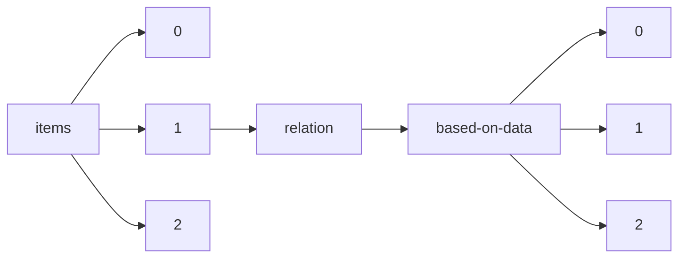

!!! warning "This document is not official Crossref documentation"
# Elements
PATH = items/array/relation/based-on-data/array(1)  
Occurs 197 times  
{ .annotate }

1. A route to an element, for example:  
   The route "items/array/relation/based-on-data/array" corresponds to navigating through the JSON indices as  
   ["items"][0]["relation"]["based-on-data"][0]  

## Asserted-by
See more information: [items/array/relation/based-on-data/array/asserted-by](asserted-by/index.md)  
Occurs 197 timess  
Unique values: 2  

| **Row** | **Value** `String` | **Count** `Int64` |
|--------:|----------------------:|---------------------:|
| **1**   | object                | 152                  |
| **2**   | subject               | 45                   |

## Id
See more information: [items/array/relation/based-on-data/array/id](id/index.md)  
Occurs 197 timess  
Unique values: 171  

| **Row** | **Value** `String`                    | **Count** `Int64` |
|--------:|-----------------------------------------:|---------------------:|
| **1**   |                                          | 18                   |
| **2**   | 10.1575/1912/bco-dmo.734649.1            | 3                    |
| **3**   | 10.1575/1912/bco-dmo.735117.1            | 2                    |
| **4**   | 10.1575/1912/bco-dmo.786098.1            | 2                    |
| **5**   | 10.1575/1912/bco-dmo.805653.1            | 2                    |
| **6**   | 10.1575/1912/bco-dmo.805546.1            | 2                    |
| **7**   | 10.1575/1912/bco-dmo.668083.1            | 2                    |
| **8**   | 10.1575/1912/bco-dmo.787329.1            | 2                    |
| **9**   | 10.1575/1912/bco-dmo.3871.5.1            | 2                    |
| **10**  | https://github.com/nytimes/covid-19-data | 1                    |
| ... | ... | ... |

## Id-type
See more information: [items/array/relation/based-on-data/array/id-type](id-type/index.md)  
Occurs 197 timess  
Unique values: 4  

| **Row** | **Value** `String` | **Count** `Int64` |
|--------:|----------------------:|---------------------:|
| **1**   | doi                   | 193                  |
| **2**   | issn                  | 2                    |
| **3**   | uri                   | 1                    |
| **4**   | other                 | 1                    |

