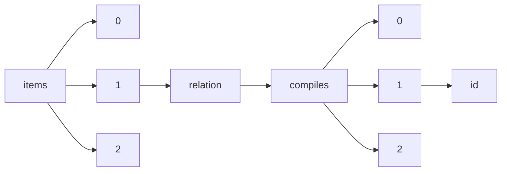

!!! warning "This document is not official Crossref documentation"
# Id
PATH = items/array/relation/compiles/array/id(1)  
Occurs 42 times  
Unique values: 39  
{ .annotate }

1. A route to an element, for example:  
   The route "items/array/relation/compiles/array/id" corresponds to navigating through the JSON indices as  
   ["items"][0]["relation"]["compiles"][0]["id"]  

| **Row** | **Value** `String`  | **Count** `Int64` |
|--------:|-----------------------:|---------------------:|
| **1**   | 1998-0280              | 4                    |
| **2**   | 10.29053/pslr.v3i.2161 | 1                    |
| **3**   | 10.29053/pslr.v1i.2178 | 1                    |
| **4**   | 10.29053/pslr.v4i.2157 | 1                    |
| **5**   | 10.29053/pslr.v3i.2166 | 1                    |
| **6**   | 10.29053/pslr.v2i.2168 | 1                    |
| **7**   | 10.29053/pslr.v3i.2159 | 1                    |
| **8**   | 10.29053/pslr.v3i.2164 | 1                    |
| **9**   | 10.29053/pslr.v6i.2217 | 1                    |
| **10**  | 10.29053/pslr.v1i.2181 | 1                    |
| **11**  | 10.29053/pslr.v3i.2165 | 1                    |
| **12**  | 10.29053/pslr.v2i.2172 | 1                    |
| **13**  | 10.29053/pslr.v1i.2184 | 1                    |
| **14**  | 10.29053/pslr.v4i.2155 | 1                    |
| **15**  | 10.29053/pslr.v3i.2163 | 1                    |
| **16**  | 10.29053/pslr.v4i.2149 | 1                    |
| **17**  | 10.29053/pslr.v2i.2177 | 1                    |
| **18**  | 10.29053/pslr.v1i.2182 | 1                    |
| **19**  | 10.29053/pslr.v1i.2186 | 1                    |
| **20**  | 10.29053/pslr.v2i.2173 | 1                    |
| **21**  | 10.29053/pslr.v1i.2189 | 1                    |
| **22**  | 10.29053/pslr.v2i.2167 | 1                    |
| **23**  | 10.29053/pslr.v4i.2156 | 1                    |
| **24**  | 10.29053/pslr.v2i.2175 | 1                    |
| **25**  | 10.29053/pslr.v2i.2176 | 1                    |
| **26**  | 10.29053/pslr.v4i.2153 | 1                    |
| **27**  | 10.29053/pslr.v2i.2170 | 1                    |
| **28**  | 10.29053/pslr.v3i.2162 | 1                    |
| **29**  | 10.29053/pslr.v1i.2188 | 1                    |
| **30**  | 10.29053/pslr.v4i.2152 | 1                    |
| **31**  | 10.29053/pslr.v4i.2150 | 1                    |
| **32**  | 10.29053/pslr.v4i.2151 | 1                    |
| **33**  | 10.29053/pslr.v2i.2174 | 1                    |
| **34**  | 10.29053/pslr.v3i.2160 | 1                    |
| **35**  | 10.29053/pslr.v4i.2158 | 1                    |
| **36**  | 10.29053/pslr.v4i.2154 | 1                    |
| **37**  | 10.29053/pslr.v2i.2169 | 1                    |
| **38**  | 10.29053/pslr.v3i.2190 | 1                    |
| **39**  | 10.29053/pslr.v2i.2171 | 1                    |

