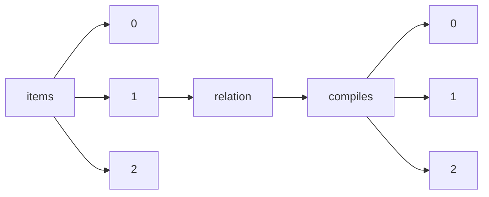

!!! warning "This document is not official Crossref documentation"
# Elements
PATH = items/array/relation/compiles/array(1)  
Occurs 42 times  
{ .annotate }

1. A route to an element, for example:  
   The route "items/array/relation/compiles/array" corresponds to navigating through the JSON indices as  
   ["items"][0]["relation"]["compiles"][0]  

## Asserted-by
See more information: [items/array/relation/compiles/array/asserted-by](asserted-by/index.md)  
Occurs 42 timess  
Unique values: 1  

| **Row** | **Value** `String` | **Count** `Int64` |
|--------:|----------------------:|---------------------:|
| **1**   | subject               | 42                   |

## Id
See more information: [items/array/relation/compiles/array/id](id/index.md)  
Occurs 42 timess  
Unique values: 39  

| **Row** | **Value** `String`  | **Count** `Int64` |
|--------:|-----------------------:|---------------------:|
| **1**   | 1998-0280              | 4                    |
| **2**   | 10.29053/pslr.v3i.2161 | 1                    |
| **3**   | 10.29053/pslr.v1i.2178 | 1                    |
| **4**   | 10.29053/pslr.v4i.2157 | 1                    |
| **5**   | 10.29053/pslr.v3i.2166 | 1                    |
| **6**   | 10.29053/pslr.v2i.2168 | 1                    |
| **7**   | 10.29053/pslr.v3i.2159 | 1                    |
| **8**   | 10.29053/pslr.v3i.2164 | 1                    |
| **9**   | 10.29053/pslr.v6i.2217 | 1                    |
| **10**  | 10.29053/pslr.v1i.2181 | 1                    |
| ... | ... | ... |

## Id-type
See more information: [items/array/relation/compiles/array/id-type](id-type/index.md)  
Occurs 42 timess  
Unique values: 2  

| **Row** | **Value** `String` | **Count** `Int64` |
|--------:|----------------------:|---------------------:|
| **1**   | doi                   | 38                   |
| **2**   | issn                  | 4                    |

