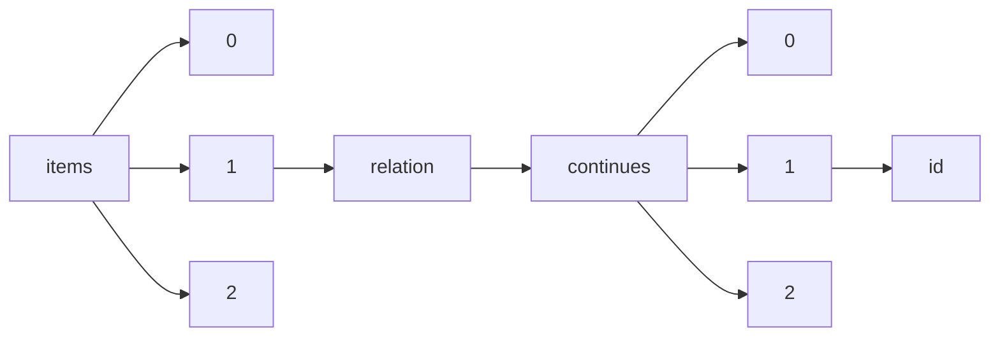

!!! warning "This document is not official Crossref documentation"
# Id
PATH = items/array/relation/continues/array/id(1)  
Occurs 104 times  
Unique values: 95  
{ .annotate }

1. A route to an element, for example:  
   The route "items/array/relation/continues/array/id" corresponds to navigating through the JSON indices as  
   ["items"][0]["relation"]["continues"][0]["id"]  

| **Row** | **Value** `String`                      | **Count** `Int64` |
|--------:|-------------------------------------------:|---------------------:|
| **1**   | 10.5236/NOISSNMEDRADEV5236\_MONP\_TEST\_06 | 4                    |
| **2**   | 10.19218/3906897585                        | 2                    |
| **3**   | 10.33619/2414-2948/65/45                   | 2                    |
| **4**   | 10.4467/2543702XSHS.19.001.11007           | 2                    |
| **5**   | 10.33619/2414-2948/63/41                   | 2                    |
| **6**   | 10.47109/0102230106                        | 2                    |
| **7**   | 10.4467/23921749PKHN\_PAU.16.001.5257      | 2                    |
| **8**   | 10.1159/000117272                          | 1                    |
| **9**   | 10.1159/000490836                          | 1                    |
| **10**  | 10.1159/000446959                          | 1                    |
| **11**  | 10.4467/24506249PJ.22.001.16022            | 1                    |
| **12**  | 10.1159/00066182                           | 1                    |
| **13**  | 10.4467/2543702XSHS.17.021.7722            | 1                    |
| **14**  | 10.11141/ia.45.5                           | 1                    |
| **15**  | 10.4467/27204383TER.22.020.16340           | 1                    |
| **16**  | 10.4467/23005920SPL.22.002.15759           | 1                    |
| **17**  | 10.1159/000117421                          | 1                    |
| **18**  | 10.4467/2543702XSHS.18.002.9322            | 1                    |
| **19**  | 10.1159/000441799                          | 1                    |
| **20**  | 10.1159/00085681                           | 1                    |
| **21**  | 10.1159/00077346                           | 1                    |
| **22**  | 10.4467/2543702XSHS.17.020.7721            | 1                    |
| **23**  | 10.1159/000276571                          | 1                    |
| **24**  | 10.1159/00096179                           | 1                    |
| **25**  | 10.1159/000454985                          | 1                    |
| **26**  | 10.33619/2414-2948/58/37                   | 1                    |
| **27**  | 10.1159/000501875                          | 1                    |
| **28**  | 10.1159/000481668                          | 1                    |
| **29**  | 10.4467/20843887PI.19.004.11637            | 1                    |
| **30**  | 10.1159/000117447                          | 1                    |
| **31**  | 10.1159/000441073                          | 1                    |
| **32**  | 10.1472/NOISSNMEDRADEV1472\_MONP\_TEST\_06 | 1                    |
| **33**  | 10.1159/000493265                          | 1                    |
| **34**  | 10.1159/000492283                          | 1                    |
| **35**  | 10.4467/20834624SL.22.007.15631            | 1                    |
| **36**  | 10.4467/2543702XSHS.18.001.9321            | 1                    |
| **37**  | 10.1159/000512548                          | 1                    |
| **38**  | 10.4467/2543702XSHS.17.001.7702            | 1                    |
| **39**  | 10.19108/KOERS.84.1.2451                   | 1                    |
| **40**  | 10.1159/000444711                          | 1                    |
| **41**  | 10.19108/KOERS.83.1.2371                   | 1                    |
| **42**  | 10.1159/000492405                          | 1                    |
| **43**  | 10.1159/000478959                          | 1                    |
| **44**  | 10.52750/287031                            | 1                    |
| **45**  | 10.36175/20201                             | 1                    |
| **46**  | 10.4467/2543702XSHS.20.001.12557           | 1                    |
| **47**  | 10.1159/000505849                          | 1                    |
| **48**  | 10.1159/000504054                          | 1                    |
| **49**  | 10.1159/000525432                          | 1                    |
| **50**  | 10.1159/000507108                          | 1                    |
| **51**  | 10.1159/00075240                           | 1                    |
| **52**  | 10.52750/563529                            | 1                    |
| **53**  | 10.19218/3906897592                        | 1                    |
| **54**  | 10.52750/158950                            | 1                    |
| **55**  | 10.1159/000500805                          | 1                    |
| **56**  | 10.4467/20844069PH.22.001.14614            | 1                    |
| **57**  | 10.1159/000510861                          | 1                    |
| **58**  | 10.4467/20827695WSC.21.013.14720           | 1                    |
| **59**  | 10.4467/2543702XSHS.21.028.14059           | 1                    |
| **60**  | 10.4467/23921749SHS.16.002.6145            | 1                    |
| **61**  | 10.4467/12332135KRA.14.006.15892           | 1                    |
| **62**  | 10.1159/000510714                          | 1                    |
| **63**  | 10.1159/000495625                          | 1                    |
| **64**  | 10.4467/23921749SHS.16.022.6165            | 1                    |
| **65**  | 10.52750/491414                            | 1                    |
| **66**  | 10.1159/000516676                          | 1                    |
| **67**  | 10.4467/24506249PJ.20.007.13446            | 1                    |
| **68**  | 10.1159/000447261                          | 1                    |
| **69**  | 10.1159/000490136                          | 1                    |
| **70**  | 10.4467/20834624SL.22.012.16122            | 1                    |
| **71**  | 10.1159/000499336                          | 1                    |
| **72**  | 10.4467/20834624SL.22.009.16119            | 1                    |
| **73**  | 10.33619/2414-2948/71/41                   | 1                    |
| **74**  | 10.1159/000491979                          | 1                    |
| **75**  | 10.4467/2543702XSHS.17.002.7703            | 1                    |
| **76**  | 10.1159/00088098                           | 1                    |
| **77**  | 10.1159/000119443                          | 1                    |
| **78**  | 10.19108/KOERS.86.1.2517                   | 1                    |
| **79**  | 10.5555/letsgogrants03b                    | 1                    |
| **80**  | 10.4467/2543702XSHS.21.002.14033           | 1                    |
| **81**  | 10.1159/000491565                          | 1                    |
| **82**  | 10.1159/000437379                          | 1                    |
| **83**  | 10.52750/975523                            | 1                    |
| **84**  | 10.4467/23921749SHS.16.023.6166            | 1                    |
| **85**  | 10.4467/2543702XSHS.20.002.12558           | 1                    |
| **86**  | 10.4467/12311960MN.20.016.13358            | 1                    |
| **87**  | 10.1159/000256650                          | 1                    |
| **88**  | 10.1159/000512813                          | 1                    |
| **89**  | 10.1159/000515183                          | 1                    |
| **90**  | 10.19108/KOERS.82.1.2287                   | 1                    |
| **91**  | 10.4467/27204383TER.22.027.16347           | 1                    |
| **92**  | 10.1159/000370196                          | 1                    |
| **93**  | 10.1159/000117193                          | 1                    |
| **94**  |                                            | 1                    |
| **95**  | 10.1159/000499766                          | 1                    |

