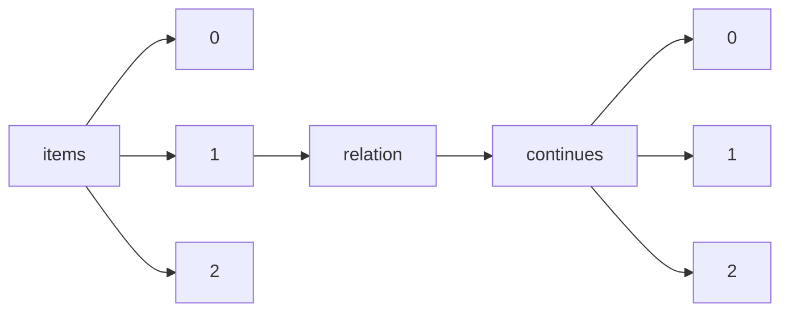

!!! warning "This document is not official Crossref documentation"
# Elements
PATH = items/array/relation/continues/array(1)  
Occurs 104 times  
{ .annotate }

1. A route to an element, for example:  
   The route "items/array/relation/continues/array" corresponds to navigating through the JSON indices as  
   ["items"][0]["relation"]["continues"][0]  

## Asserted-by
See more information: [items/array/relation/continues/array/asserted-by](asserted-by/index.md)  
Occurs 104 timess  
Unique values: 2  

| **Row** | **Value** `String` | **Count** `Int64` |
|--------:|----------------------:|---------------------:|
| **1**   | subject               | 101                  |
| **2**   | object                | 3                    |

## Id
See more information: [items/array/relation/continues/array/id](id/index.md)  
Occurs 104 timess  
Unique values: 95  

| **Row** | **Value** `String`                      | **Count** `Int64` |
|--------:|-------------------------------------------:|---------------------:|
| **1**   | 10.5236/NOISSNMEDRADEV5236\_MONP\_TEST\_06 | 4                    |
| **2**   | 10.19218/3906897585                        | 2                    |
| **3**   | 10.33619/2414-2948/65/45                   | 2                    |
| **4**   | 10.4467/2543702XSHS.19.001.11007           | 2                    |
| **5**   | 10.33619/2414-2948/63/41                   | 2                    |
| **6**   | 10.47109/0102230106                        | 2                    |
| **7**   | 10.4467/23921749PKHN\_PAU.16.001.5257      | 2                    |
| **8**   | 10.1159/000117272                          | 1                    |
| **9**   | 10.1159/000490836                          | 1                    |
| **10**  | 10.1159/000446959                          | 1                    |
| ... | ... | ... |

## Id-type
See more information: [items/array/relation/continues/array/id-type](id-type/index.md)  
Occurs 104 timess  
Unique values: 2  

| **Row** | **Value** `String` | **Count** `Int64` |
|--------:|----------------------:|---------------------:|
| **1**   | doi                   | 103                  |
| **2**   | issn                  | 1                    |

