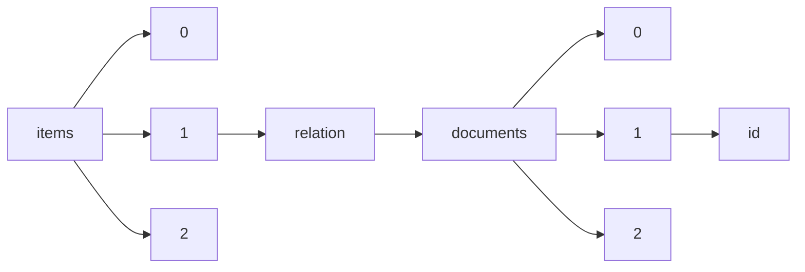

!!! warning "This document is not official Crossref documentation"
# Id
PATH = items/array/relation/documents/array/id(1)  
Occurs 982 times  
Unique values: 386  
{ .annotate }

1. A route to an element, for example:  
   The route "items/array/relation/documents/array/id" corresponds to navigating through the JSON indices as  
   ["items"][0]["relation"]["documents"][0]["id"]  

| **Row** | **Value** `String`            | **Count** `Int64` |
|--------:|---------------------------------:|---------------------:|
| **1**   |                                  | 105                  |
| **2**   | 10.1575/1912/bco-dmo.786508.1    | 14                   |
| **3**   | 10.1575/1912/bco-dmo.754885.1    | 11                   |
| **4**   | 10.1575/1912/bco-dmo.764546.1    | 10                   |
| **5**   | 10.1575/1912/bco-dmo.738494.1    | 10                   |
| **6**   | 10.1575/1912/bco-dmo.734674.1    | 10                   |
| **7**   | 10.1575/1912/bco-dmo.764664.1    | 10                   |
| **8**   | 10.1575/1912/bco-dmo.764608.1    | 10                   |
| **9**   | 10.1575/1912/bco-dmo.764688.1    | 10                   |
| **10**  | 10.1575/1912/bco-dmo.718887.1    | 10                   |
| **11**  | 10.1575/1912/bco-dmo.3093.1      | 9                    |
| **12**  | 10.1575/1912/bco-dmo.775229.1    | 9                    |
| **13**  | 10.1575/1912/bco-dmo.3092.1      | 9                    |
| **14**  | 10.1575/1912/bco-dmo.773146.1    | 9                    |
| **15**  | 2630-1423                        | 8                    |
| **16**  | 10.1575/1912/bco-dmo.745816.1    | 8                    |
| **17**  | 10.1575/1912/bco-dmo.717687.1    | 8                    |
| **18**  | 10.1575/1912/bco-dmo.745789.1    | 8                    |
| **19**  | 2756-7222                        | 8                    |
| **20**  | 10.1575/1912/bco-dmo.660194.1    | 7                    |
| **21**  | 10.1575/1912/bco-dmo.3871.5.1    | 7                    |
| **22**  | 10.1575/1912/bco-dmo.781759.1    | 7                    |
| **23**  | 10.1575/1912/bco-dmo.660244.1    | 7                    |
| **24**  | 10.1575/1912/bco-dmo.745942.1    | 7                    |
| **25**  | 2289-8506                        | 7                    |
| **26**  | 10.1575/1912/bco-dmo.734364.1    | 7                    |
| **27**  | 10.1575/1912/bco-dmo.781841.1    | 7                    |
| **28**  | 10.1575/1912/bco-dmo.745865.1    | 7                    |
| **29**  | 10.1575/1912/bco-dmo.745932.1    | 7                    |
| **30**  | 10.1575/1912/bco-dmo.781827.1    | 7                    |
| **31**  | 10.1575/1912/bco-dmo.745905.1    | 7                    |
| **32**  | 10.1575/1912/bco-dmo.658946.1    | 6                    |
| **33**  | 10.1575/1912/bco-dmo.770864.1    | 5                    |
| **34**  | 10.1575/1912/bco-dmo.769302.1    | 5                    |
| **35**  | 2756-7206                        | 5                    |
| **36**  | 10.1575/1912/bco-dmo.780043.2    | 5                    |
| **37**  | 10.1575/1912/bco-dmo.715160.1    | 5                    |
| **38**  | 10.1575/1912/bco-dmo.805252.1    | 5                    |
| **39**  | 10.1575/1912/bco-dmo.780043.1    | 5                    |
| **40**  | 10.1575/1912/bco-dmo.771701.1    | 5                    |
| **41**  | 10.1575/1912/bco-dmo.652127.1    | 5                    |
| **42**  | 10.1575/1912/bco-dmo.747341.1    | 5                    |
| **43**  | 10.1575/1912/bco-dmo.781773.1    | 4                    |
| **44**  | 10.1575/1912/bco-dmo.723984.1    | 4                    |
| **45**  | 10.1575/1912/bco-dmo.786268.1    | 4                    |
| **46**  | 10.1575/1912/bco-dmo.769203.2    | 4                    |
| **47**  | 10.1575/1912/bco-dmo.783509.2    | 4                    |
| **48**  | 10.1575/1912/bco-dmo.783500.2    | 4                    |
| **49**  | 10.1575/1912/bco-dmo.652849.1    | 4                    |
| **50**  | 2630-144X                        | 4                    |
| **51**  | 2630-1431                        | 4                    |
| **52**  | 10.1575/1912/bco-dmo.764480.1    | 4                    |
| **53**  | 10.1575/1912/bco-dmo.3120.1      | 4                    |
| **54**  | 10.1575/1912/bco-dmo.738744.1    | 4                    |
| **55**  | 10.1575/1912/bco-dmo.783366.1    | 4                    |
| **56**  | 10.1575/1912/bco-dmo.783679.1    | 4                    |
| **57**  | 10.1575/1912/bco-dmo.782977.1    | 4                    |
| **58**  | 10.1575/1912/bco-dmo.668083.1    | 4                    |
| **59**  | 10.1575/1912/bco-dmo.723966.1    | 4                    |
| **60**  | 10.1575/1912/bco-dmo.700974.1    | 4                    |
| **61**  | 10.1575/1912/bco-dmo.658497.1    | 4                    |
| **62**  | 10.1575/1912/bco-dmo.733711.1    | 4                    |
| **63**  | 10.1575/1912/bco-dmo.772513.1    | 3                    |
| **64**  | 10.1575/1912/bco-dmo.756404.1    | 3                    |
| **65**  | 10.1575/1912/bco-dmo.762772.1    | 3                    |
| **66**  | 10.1575/1912/bco-dmo.723957.1    | 3                    |
| **67**  | 10.1575/1912/bco-dmo.765850.2    | 3                    |
| **68**  | 10.1575/1912/bco-dmo.780127.1    | 3                    |
| **69**  | 10.1575/1912/bco-dmo.773802.1    | 3                    |
| **70**  | 10.1575/1912/bco-dmo.747248.1    | 3                    |
| **71**  | 10.1575/1912/bco-dmo.780248.1    | 3                    |
| **72**  | 10.1575/1912/bco-dmo.794163.1    | 3                    |
| **73**  | 10.1575/1912/bco-dmo.700263.1    | 3                    |
| **74**  | 10.1575/1912/bco-dmo.788315.1    | 3                    |
| **75**  | 10.1575/1912/bco-dmo.738772.1    | 3                    |
| **76**  | 10.1575/1912/bco-dmo.739309.1    | 3                    |
| **77**  | 10.1575/1912/bco-dmo.747279.1    | 3                    |
| **78**  | 10.1575/1912/bco-dmo.755809.1    | 3                    |
| **79**  | 10.1575/1912/bco-dmo.770157.1    | 3                    |
| **80**  | 10.1575/1912/bco-dmo.3751.3      | 3                    |
| **81**  | 10.1575/1912/bco-dmo.734706.1    | 3                    |
| **82**  | 10.1575/1912/bco-dmo.788903.1    | 3                    |
| **83**  | 10.1575/1912/bco-dmo.769969.1    | 3                    |
| **84**  | 10.1575/1912/bco-dmo.659092.1    | 3                    |
| **85**  | 10.1575/1912/bco-dmo.783581.1    | 3                    |
| **86**  | 10.1575/1912/bco-dmo.756413.2    | 3                    |
| **87**  | 10.1575/1912/bco-dmo.734491.1    | 3                    |
| **88**  | 10.1575/1912/bco-dmo.772513.2    | 3                    |
| **89**  | 10.1575/1912/bco-dmo.748140.1    | 3                    |
| **90**  | 10.1575/1912/bco-dmo.651880.1    | 3                    |
| **91**  | 10.1575/1912/bco-dmo.737176.1    | 3                    |
| **92**  | 10.1575/1912/bco-dmo.659064.1    | 3                    |
| **93**  | 10.1575/1912/bco-dmo.659109.1    | 3                    |
| **94**  | 10.1575/1912/bco-dmo.765835.3    | 3                    |
| **95**  | 10.1575/1912/bco-dmo.750917.1    | 3                    |
| **96**  | 10.1575/1912/bco-dmo.3670.2      | 3                    |
| **97**  | 10.1575/1912/bco-dmo.756413.1    | 3                    |
| **98**  | 10.1575/1912/bco-dmo.747394.1    | 3                    |
| **99**  | 1840-9857                        | 3                    |
| **100** | 10.1575/1912/bco-dmo.771658.1    | 3                    |
| **101** | 10.1575/1912/bco-dmo.771344.1    | 3                    |
| **102** | 10.1575/1912/bco-dmo.792783.1    | 3                    |
| **103** | 10.1575/1912/bco-dmo.700288.1    | 3                    |
| **104** | 10.1575/1912/bco-dmo.728215.1    | 3                    |
| **105** | 10.1575/1912/bco-dmo.2350.1      | 3                    |
| **106** | 10.1575/1912/bco-dmo.789136.1    | 3                    |
| **107** | 10.1575/1912/bco-dmo.709737.1    | 2                    |
| **108** | 10.1575/1912/bco-dmo.782858.1    | 2                    |
| **109** | 1840 9857                        | 2                    |
| **110** | 10.1575/1912/bco-dmo.709707.1    | 2                    |
| **111** | 10.1575/1912/bco-dmo.764885.1    | 2                    |
| **112** | 10.1575/1912/bco-dmo.747014.1    | 2                    |
| **113** | 10.1575/1912/bco-dmo.735751.1    | 2                    |
| **114** | 10.1575/1912/bco-dmo.745987.1    | 2                    |
| **115** | 10.38211/joarps.2021.2.1.11      | 2                    |
| **116** | 10.1575/1912/bco-dmo.805653.1    | 2                    |
| **117** | 10.52862/jqaas.2021.1.1.4        | 2                    |
| **118** | 10.1575/1912/bco-dmo.709762.1    | 2                    |
| **119** | 10.1575/1912/bco-dmo.745997.1    | 2                    |
| **120** | 10.1575/1912/bco-dmo.732864.1    | 2                    |
| **121** | 10.1575/1912/bco-dmo.753624.1    | 2                    |
| **122** | 10.1575/1912/bco-dmo.723993.1    | 2                    |
| **123** | 10.1575/1912/bco-dmo.2464.1      | 2                    |
| **124** | 10.1575/1912/bco-dmo.742565.1    | 2                    |
| **125** | 10.1575/1912/bco-dmo.3235.1      | 2                    |
| **126** | 10.1575/1912/bco-dmo.762056.1    | 2                    |
| **127** | 10.1575/1912/bco-dmo.750862.1    | 2                    |
| **128** | 10.1575/1912/bco-dmo.735629.1    | 2                    |
| **129** | 10.1575/1912/bco-dmo.520476.2    | 2                    |
| **130** | 10.38211/joarps.2021.2.1.13      | 2                    |
| **131** | 10.1575/1912/bco-dmo.723935.1    | 2                    |
| **132** | 10.1575/1912/bco-dmo.784480.1    | 2                    |
| **133** | 10.1575/1912/bco-dmo.709815.1    | 2                    |
| **134** | 10.1575/1912/bco-dmo.751128.1    | 2                    |
| **135** | 10.1575/1912/bco-dmo.3293.1      | 2                    |
| **136** | 10.1575/1912/bco-dmo.750328.1    | 2                    |
| **137** | 10.1575/1912/bco-dmo.793674.1    | 2                    |
| **138** | 10.1575/1912/bco-dmo.774033.1    | 2                    |
| **139** | 10.1575/1912/bco-dmo.794064.1    | 2                    |
| **140** | 10.1575/1912/bco-dmo.767141.1    | 2                    |
| **141** | 10.1575/1912/bco-dmo.739646.1    | 2                    |
| **142** | 10.1575/1912/bco-dmo.767048.1    | 2                    |
| **143** | 10.1575/1912/bco-dmo.793682.1    | 2                    |
| **144** | 10.1575/1912/bco-dmo.723948.1    | 2                    |
| **145** | 10.1575/1912/bco-dmo.753188.1    | 2                    |
| **146** | 10.1575/1912/bco-dmo.720234.1    | 2                    |
| **147** | 10.1575/1912/bco-dmo.733173.1    | 2                    |
| **148** | 10.1575/1912/bco-dmo.757485.1    | 2                    |
| **149** | 10.1575/1912/bco-dmo.735583.1    | 2                    |
| **150** | 10.1575/1912/bco-dmo.735117.1    | 2                    |
| **151** | 10.1575/1912/bco-dmo.709787.1    | 2                    |
| **152** | 10.1575/1912/bco-dmo.764860.1    | 2                    |
| **153** | 10.1575/1912/bco-dmo.3292.1      | 2                    |
| **154** | 10.1575/1912/bco-dmo.778703.1    | 2                    |
| **155** | 10.1575/1912/bco-dmo.723975.1    | 2                    |
| **156** | 10.1575/1912/bco-dmo.777689.1    | 2                    |
| **157** | 10.1575/1912/bco-dmo.778403.1    | 2                    |
| **158** | 10.1575/1912/bco-dmo.753679.1    | 2                    |
| **159** | 10.1575/1912/bco-dmo.762824.1    | 2                    |
| **160** | 10.1575/1912/bco-dmo.792817.1    | 2                    |
| **161** | 10.1575/1912/bco-dmo.660527.1    | 2                    |
| **162** | 10.1575/1912/bco-dmo.768577.1    | 2                    |
| **163** | 10.1575/1912/bco-dmo.659040.1    | 2                    |
| **164** | 2616-6232                        | 2                    |
| **165** | 10.38211/joarps.2020.1.2.9       | 2                    |
| **166** | 10.1575/1912/bco-dmo.748792.1    | 2                    |
| **167** | 10.1575/1912/bco-dmo.755735.1    | 2                    |
| **168** | 10.1575/1912/bco-dmo.723868.1    | 2                    |
| **169** | 10.1575/1912/bco-dmo.768196.1    | 2                    |
| **170** | 10.1575/1912/bco-dmo.784530.1    | 2                    |
| **171** | 10.1575/1912/bco-dmo.775834.1    | 2                    |
| **172** | 10.1575/1912/bco-dmo.716979.1    | 2                    |
| **173** | 10.1575/1912/bco-dmo.737393.1    | 2                    |
| **174** | 10.1575/1912/bco-dmo.786511.1    | 2                    |
| **175** | 10.1575/1912/bco-dmo.793628.1    | 2                    |
| **176** | 10.1575/1912/bco-dmo.774848.1    | 2                    |
| **177** | 10.1575/1912/bco-dmo.768138.1    | 2                    |
| **178** | 10.1575/1912/bco-dmo.755687.1    | 2                    |
| **179** | 10.1575/1912/bco-dmo.704653.1    | 2                    |
| **180** | 10.1575/1912/bco-dmo.752624.1    | 2                    |
| **181** | 10.1575/1912/bco-dmo.2330.1      | 1                    |
| **182** | 10.52861/mhjst.2021.1.1.5        | 1                    |
| **183** | 10.1575/1912/bco-dmo.774792.1    | 1                    |
| **184** | 10.1575/1912/bco-dmo.735267.1    | 1                    |
| **185** | 10.32628/IJSRST1840115           | 1                    |
| **186** | 10.35600/25008870.2020.10.0170   | 1                    |
| **187** | 10.1575/1912/bco-dmo.701987.1    | 1                    |
| **188** | 10.1575/1912/bco-dmo.774827.1    | 1                    |
| **189** | 10.1575/1912/bco-dmo.774799.1    | 1                    |
| **190** | 10.1575/1912/bco-dmo.733059.1    | 1                    |
| **191** | 10.26761/IJRLS.6.1.2020.1308     | 1                    |
| **192** | 10.26761/IJRLS.4.2.2018.1293     | 1                    |
| **193** | 10.20900/gctr20190005            | 1                    |
| **194** | 10.1575/1912/bco-dmo.713188.1    | 1                    |
| **195** | 10.26761/IJRLS.3.2.2017.1266     | 1                    |
| **196** | 978-607-98835-5-3                | 1                    |
| **197** | 10.1575/1912/bco-dmo.682794.1    | 1                    |
| **198** | 10.26761/IJRLS.6.1.2020.1320     | 1                    |
| **199** | 10.26761/IJRLS.6.1.2020.1318     | 1                    |
| **200** | 10.26761/IJRLS.6.1.2020.1304     | 1                    |
| **201** | 10.1575/1912/bco-dmo.737163.1    | 1                    |
| **202** | 10.32628/IJSRSET1841079          | 1                    |
| **203** | 10.1575/1912/bco-dmo.752974.1    | 1                    |
| **204** | 10.26761/IJRLS.6.1.2020.1315     | 1                    |
| **205** | 10.26761/IJRLS.5.2.2019.1295     | 1                    |
| **206** | 10.1575/1912/bco-dmo.753882.1    | 1                    |
| **207** | 1840  9857                       | 1                    |
| **208** | 10.1575/1912/bco-dmo.2475.1      | 1                    |
| **209** | 10.38211/jms.2022.01.01.01       | 1                    |
| **210** | 10.1575/1912/bco-dmo.753594.1    | 1                    |
| **211** | 10.26761/IJRLS.5.2.2019.1298     | 1                    |
| **212** | 10.26761/IJRLS.4.1.2018.1273     | 1                    |
| **213** | 10.1575/1912/bco-dmo.756997.1    | 1                    |
| **214** | 10.1575/1912/bco-dmo.768607.1    | 1                    |
| **215** | 10.1575/1912/bco-dmo.666280.1    | 1                    |
| **216** | 10.1575/1912/bco-dmo.728084.1    | 1                    |
| **217** | 10.1575/1912/bco-dmo.778881.1    | 1                    |
| **218** | 10.1575/1912/bco-dmo.735258.1    | 1                    |
| **219** | 10.26761/IJRLS.4.2.2018.1292     | 1                    |
| **220** | 10.52861/mhjst.2021.1.1.3        | 1                    |
| **221** | 10.1575/1912/bco-dmo.727180.1    | 1                    |
| **222** | 10.1575/1912/bco-dmo.753431.1    | 1                    |
| **223** | 10.1575/1912/bco-dmo.3753.3      | 1                    |
| **224** | 10.1575/1912/bco-dmo.771474.2    | 1                    |
| **225** | 10.1575/1912/bco-dmo.773979.1    | 1                    |
| **226** | 10.1575/1912/bco-dmo.490464.1    | 1                    |
| **227** | 10.26761/IJRLS.4.2.2018.1294     | 1                    |
| **228** | 10.1575/1912/bco-dmo.735249.1    | 1                    |
| **229** | 10.35600/25008870.2020.10.0176   | 1                    |
| **230** | 10.1575/1912/bco-dmo.728099.1    | 1                    |
| **231** | 10.35600/25008870.2020.10.0173   | 1                    |
| **232** | 10.1575/1912/bco-dmo.669741.1    | 1                    |
| **233** | 10.1575/1912/bco-dmo.765327.1    | 1                    |
| **234** | 10.1575/1912/bco-dmo.774813.1    | 1                    |
| **235** | 10.1575/1912/bco-dmo.732116.1    | 1                    |
| **236** | 10.1575/1912/bco-dmo.669652.1    | 1                    |
| **237** | 10.1575/1912/bco-dmo.732438.1    | 1                    |
| **238** | 10.1575/1912/bco-dmo.775830.1    | 1                    |
| **239** | 10.1575/1912/bco-dmo.712899.1    | 1                    |
| **240** | 10.26761/IJRLS.4.1.2018.1280     | 1                    |
| **241** | 10.1575/1912/bco-dmo.784204.1    | 1                    |
| **242** | 10.1575/1912/bco-dmo.780092.1    | 1                    |
| **243** | 10.26761/IJRLS.5.1.2019.1294     | 1                    |
| **244** | 10.1575/1912/bco-dmo.731092.1    | 1                    |
| **245** | 10.1575/1912/bco-dmo.3815.1      | 1                    |
| **246** | 10.26761/IJRLS.6.1.2020.1310     | 1                    |
| **247** | 10.1575/1912/bco-dmo.773897.1    | 1                    |
| **248** | 10.38211/joarps.2022.3.1.26      | 1                    |
| **249** | 10.38211/joarps.2020.2.1.14      | 1                    |
| **250** | 10.1575/1912/bco-dmo.738651.1    | 1                    |
| **251** | 10.1575/1912/bco-dmo.516561.1    | 1                    |
| **252** | 10.1575/1912/bco-dmo.701840.1    | 1                    |
| **253** | 10.1575/1912/bco-dmo.738160.1    | 1                    |
| **254** | 10.1575/1912/bco-dmo.516621.1    | 1                    |
| **255** | 10.1575/1912/bco-dmo.780027.1    | 1                    |
| **256** | 10.1575/1912/bco-dmo.762119.1    | 1                    |
| **257** | 10.26761/IJRLS.6.1.2020.1299     | 1                    |
| **258** | 18409857                         | 1                    |
| **259** | 10.26761/IJRLS.5.2.2019.1300     | 1                    |
| **260** | 10.1575/1912/bco-dmo.732890.1    | 1                    |
| **261** | 10.1575/1912/bco-dmo.750823.1    | 1                    |
| **262** | 10.25039/tr.015.2018             | 1                    |
| **263** | 10.32628/IJSRST1184112           | 1                    |
| **264** | 10.1575/1912/bco-dmo.701701.1    | 1                    |
| **265** | 10.1575/1912/bco-dmo.742573.1    | 1                    |
| **266** | 10.1575/1912/bco-dmo.738169.1    | 1                    |
| **267** | 10.26761/IJRLS.4.2.2018.1290     | 1                    |
| **268** | 10.26761/IJRLS.4.1.2018.1277     | 1                    |
| **269** | 10.1575/1912/bco-dmo.750795.1    | 1                    |
| **270** | 10.1575/1912/bco-dmo.713302.1    | 1                    |
| **271** | 10.1575/1912/bco-dmo.489471.1    | 1                    |
| **272** | 10.1575/1912/bco-dmo.662645.1    | 1                    |
| **273** | 10.26761/IJRLS.6.1.2020.1319     | 1                    |
| **274** | 10.20900/gctr20190001            | 1                    |
| **275** | 10.32628/IJSRSET1849144          | 1                    |
| **276** | 10.26761/IJRLS.6.1.2020.1313     | 1                    |
| **277** | 10.1575/1912/bco-dmo.701863.1    | 1                    |
| **278** | 10.1575/1912/bco-dmo.743072.1    | 1                    |
| **279** | 10.35600/25008870.2020.10.0174   | 1                    |
| **280** | 10.26761/IJRLS.6.1.2020.1321     | 1                    |
| **281** | 10.1575/1912/bco-dmo.713206.1    | 1                    |
| **282** | 346346                           | 1                    |
| **283** | 10.1575/1912/bco-dmo.752902.1    | 1                    |
| **284** | 10.32628/IJSRSET184113           | 1                    |
| **285** | 10.26761/IJRLS.6.1.2020.1303     | 1                    |
| **286** | 10.1575/1912/bco-dmo.700177.1    | 1                    |
| **287** | 10.1575/1912/bco-dmo.732115.1    | 1                    |
| **288** | 10.1575/1912/bco-dmo.713168.1    | 1                    |
| **289** | 10.1575/1912/bco-dmo.710144.1    | 1                    |
| **290** | 10.1575/1912/bco-dmo.745536.1    | 1                    |
| **291** | 10.1575/1912/bco-dmo.774841.1    | 1                    |
| **292** | 10.26761/IJRLS.6.1.2020.1305     | 1                    |
| **293** | 10.26761/IJRLS.4.1.2018.1281     | 1                    |
| **294** | 10.26761/IJRLS.5.2.2019.1296     | 1                    |
| **295** | 10.32628/IJSRST1184113           | 1                    |
| **296** | 10.26761/IJRLS.6.1.2020.1323     | 1                    |
| **297** | 10.32628/CSEIT18387              | 1                    |
| **298** | 10.1575/1912/bco-dmo.773466.1    | 1                    |
| **299** | 10.20900/gctr20190002            | 1                    |
| **300** | 10.1575/1912/bco-dmo.774820.1    | 1                    |
| **301** | 10.32628/CSEIT18389              | 1                    |
| **302** | 10.1575/1912/bco-dmo.729896.1    | 1                    |
| **303** | 10.1575/1912/bco-dmo.767285.1    | 1                    |
| **304** | 10.38211/joarps.2021.2.1.15      | 1                    |
| **305** | 10.1575/1912/bco-dmo.669693.1    | 1                    |
| **306** | 10.1575/1912/bco-dmo.774996.1    | 1                    |
| **307** | 10.1575/1912/bco-dmo.719743.1    | 1                    |
| **308** | 10.1575/1912/bco-dmo.662791.1    | 1                    |
| **309** | 10.35600/25008870.2020.10.0167   | 1                    |
| **310** | 10.1575/1912/bco-dmo.733210.1    | 1                    |
| **311** | 10.1575/1912/bco-dmo.738178.1    | 1                    |
| **312** | 2690-8220                        | 1                    |
| **313** | https://ijsrst.com/IJSRST2072201 | 1                    |
| **314** | 10.20900/gctr20190003            | 1                    |
| **315** | 10.1575/1912/bco-dmo.765081.1    | 1                    |
| **316** | 10.38211/joarps.2020.1.2.6       | 1                    |
| **317** | 10.1575/1912/bco-dmo.788195.1    | 1                    |
| **318** | 10.1575/1912/bco-dmo.662664.1    | 1                    |
| **319** | 10.1575/1912/bco-dmo.660543.1    | 1                    |
| **320** | 10.1575/1912/bco-dmo.560448.1    | 1                    |
| **321** | 10.1575/1912/bco-dmo.734649.1    | 1                    |
| **322** | 10.1575/1912/bco-dmo.3786.1      | 1                    |
| **323** | 10.1575/1912/bco-dmo.784759.1    | 1                    |
| **324** | 10.26761/IJRLS.6.1.2020.1301     | 1                    |
| **325** | 10.1575/1912/bco-dmo.738188.1    | 1                    |
| **326** | 10.26761/IJRLS.4.1.2018.1282     | 1                    |
| **327** | 10.35600/25008870.2020.10.0166   | 1                    |
| **328** | 10.32628/IJSRSET173810           | 1                    |
| **329** | 10.1575/1912/bco-dmo.773896.1    | 1                    |
| **330** | 10.1575/1912/bco-dmo.735231.1    | 1                    |
| **331** | 10.1575/1912/bco-dmo.680935.1    | 1                    |
| **332** | 10.26761/IJRLS.4.1.2018.1283     | 1                    |
| **333** | 10.26761/IJRLS.6.1.2020.1312     | 1                    |
| **334** | 10.1575/1912/bco-dmo.739636.1    | 1                    |
| **335** | 10.35600/25008870.2020.10.0169   | 1                    |
| **336** | 10.38211/joarps.2020.1.2.10      | 1                    |
| **337** | 10.38211/joarps.2020.1.2.8       | 1                    |
| **338** | 10.1575/1912/bco-dmo.516234.1    | 1                    |
| **339** | 10.26761/IJRLS.6.1.2020.1306     | 1                    |
| **340** | 10.1575/1912/bco-dmo.772776.1    | 1                    |
| **341** | 10.26761/IJRLS.4.1.2018.1278     | 1                    |
| **342** | 10.1575/1912/bco-dmo.739111.1    | 1                    |
| **343** | 10.38211/joarps.2021.2.1.14      | 1                    |
| **344** | 10.35600/25008870.2020.10.0177   | 1                    |
| **345** | 10.26761/IJRLS.6.1.2020.1322     | 1                    |
| **346** | 10.1575/1912/bco-dmo.728110.1    | 1                    |
| **347** | 10.1575/1912/bco-dmo.784677.1    | 1                    |
| **348** | 10.1575/1912/bco-dmo.705432.1    | 1                    |
| **349** | 10.26761/IJRLS.6.1.2020.1309     | 1                    |
| **350** | 10.1575/1912/bco-dmo.701726.1    | 1                    |
| **351** | 10.1575/1912/bco-dmo.662377.1    | 1                    |
| **352** | 10.1575/1912/bco-dmo.735806.1    | 1                    |
| **353** | 10.1575/1912/bco-dmo.719970.1    | 1                    |
| **354** | 10.52861/mhjst.2021.1.1.4        | 1                    |
| **355** | 10.26761/IJRLS.4.2.2018.1288     | 1                    |
| **356** | 10.26761/IJRLS.6.1.2020.1311     | 1                    |
| **357** | 10.1575/1912/bco-dmo.784290.1    | 1                    |
| **358** | 10.31644/IMASD.23.2020.a01       | 1                    |
| **359** | 10.1575/1912/bco-dmo.735240.1    | 1                    |
| **360** | 10.38211/joarps.2022.3.1.23      | 1                    |
| **361** | 10.1575/1912/bco-dmo.3817.1      | 1                    |
| **362** | 10.1575/1912/bco-dmo.700907.1    | 1                    |
| **363** | 10.1575/1912/bco-dmo.701751.1    | 1                    |
| **364** | 10.1575/1912/bco-dmo.743755.1    | 1                    |
| **365** | 10.1575/1912/bco-dmo.735137.1    | 1                    |
| **366** | 10.1575/1912/bco-dmo.669760.1    | 1                    |
| **367** | 10.1575/1912/bco-dmo.712919.1    | 1                    |
| **368** | 10.1575/1912/bco-dmo.762497.1    | 1                    |
| **369** | 10.38211/joarps.2020.1.2.7       | 1                    |
| **370** | 10.1575/1912/bco-dmo.778881.2    | 1                    |
| **371** | 10.38211/joarps.2021.2.1.12      | 1                    |
| **372** | 10.52861/mhjst.2021.1.1.1        | 1                    |
| **373** | 10.1575/1912/bco-dmo.727172.1    | 1                    |
| **374** | 10.1575/1912/bco-dmo.770638.1    | 1                    |
| **375** | 10.1575/1912/bco-dmo.731213.1    | 1                    |
| **376** | 10.1575/1912/bco-dmo.777110.1    | 1                    |
| **377** | 10.26761/IJRLS.4.1.2018.1270     | 1                    |
| **378** | 10.32628/CSEIT18386              | 1                    |
| **379** | 10.1575/1912/bco-dmo.713225.1    | 1                    |
| **380** | 10.1575/1912/bco-dmo.700226.1    | 1                    |
| **381** | 10.1575/1912/bco-dmo.787316.1    | 1                    |
| **382** | 10.26761/IJRLS.4.2.2018.1291     | 1                    |
| **383** | 10.1575/1912/bco-dmo.774834.1    | 1                    |
| **384** | 10.1575/1912/bco-dmo.774806.1    | 1                    |
| **385** | 10.1575/1912/bco-dmo.2454.1      | 1                    |
| **386** | 10.1575/1912/bco-dmo.774784.1    | 1                    |

