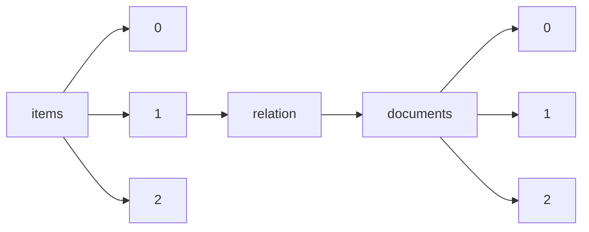

!!! warning "This document is not official Crossref documentation"
# Elements
PATH = items/array/relation/documents/array(1)  
Occurs 982 times  
{ .annotate }

1. A route to an element, for example:  
   The route "items/array/relation/documents/array" corresponds to navigating through the JSON indices as  
   ["items"][0]["relation"]["documents"][0]  

## Asserted-by
See more information: [items/array/relation/documents/array/asserted-by](asserted-by/index.md)  
Occurs 982 timess  
Unique values: 2  

| **Row** | **Value** `String` | **Count** `Int64` |
|--------:|----------------------:|---------------------:|
| **1**   | object                | 743                  |
| **2**   | subject               | 239                  |

## Id
See more information: [items/array/relation/documents/array/id](id/index.md)  
Occurs 982 timess  
Unique values: 386  

| **Row** | **Value** `String`         | **Count** `Int64` |
|--------:|------------------------------:|---------------------:|
| **1**   |                               | 105                  |
| **2**   | 10.1575/1912/bco-dmo.786508.1 | 14                   |
| **3**   | 10.1575/1912/bco-dmo.754885.1 | 11                   |
| **4**   | 10.1575/1912/bco-dmo.764546.1 | 10                   |
| **5**   | 10.1575/1912/bco-dmo.738494.1 | 10                   |
| **6**   | 10.1575/1912/bco-dmo.734674.1 | 10                   |
| **7**   | 10.1575/1912/bco-dmo.764664.1 | 10                   |
| **8**   | 10.1575/1912/bco-dmo.764608.1 | 10                   |
| **9**   | 10.1575/1912/bco-dmo.764688.1 | 10                   |
| **10**  | 10.1575/1912/bco-dmo.718887.1 | 10                   |
| ... | ... | ... |

## Id-type
See more information: [items/array/relation/documents/array/id-type](id-type/index.md)  
Occurs 982 timess  
Unique values: 7  

| **Row** | **Value** `String` | **Count** `Int64` |
|--------:|----------------------:|---------------------:|
| **1**   | doi                   | 828                  |
| **2**   | issn                  | 132                  |
| **3**   | arxiv                 | 11                   |
| **4**   | other                 | 8                    |
| **5**   | ark                   | 1                    |
| **6**   | isbn                  | 1                    |
| **7**   | uri                   | 1                    |

