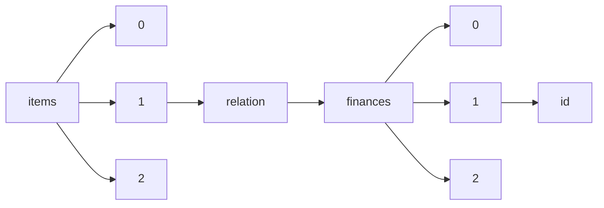

!!! warning "This document is not official Crossref documentation"
# Id
PATH = items/array/relation/finances/array/id(1)  
Occurs 6 times  
Unique values: 6  
{ .annotate }

1. A route to an element, for example:  
   The route "items/array/relation/finances/array/id" corresponds to navigating through the JSON indices as  
   ["items"][0]["relation"]["finances"][0]["id"]  

| **Row** | **Value** `String`     | **Count** `Int64` |
|--------:|--------------------------:|---------------------:|
| **1**   | 10.1007/978-3-030-77363-2 | 1                    |
| **2**   | 10.32013/12345678         | 1                    |
| **3**   | 10.1007/978-3-030-69691-7 | 1                    |
| **4**   | 10.1007/978-3-030-93654-9 | 1                    |
| **5**   | 10.1007/978-3-030-98072-6 | 1                    |
| **6**   | 10.1007/978-3-030-96844-1 | 1                    |

