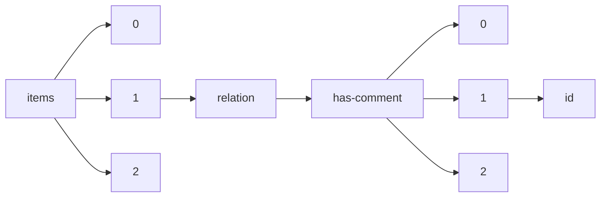

!!! warning "This document is not official Crossref documentation"
# Id
PATH = items/array/relation/has-comment/array/id(1)  
Occurs 106 096 times  
Unique values: > 999  
{ .annotate }

1. A route to an element, for example:  
   The route "items/array/relation/has-comment/array/id" corresponds to navigating through the JSON indices as  
   ["items"][0]["relation"]["has-comment"][0]["id"]  

!!! note "Due to current limitations, only the first 1,000 unique values are counted."

| **Row** | **Value** `String`           | **Count** `Int64` |
|--------:|--------------------------------:|---------------------:|
| **1**   | 10.5194/cp-2020-164-AC1         | 8                    |
| **2**   | 10.5194/bg-2021-276-AC1         | 7                    |
| **3**   | 10.5194/tc-2021-175-AC1         | 6                    |
| **4**   | 10.5194/mr-2021-46-AC1          | 6                    |
| **5**   | 10.5194/essd-2022-261-AC1       | 6                    |
| **6**   | 10.5194/acp-2021-981-AC1        | 5                    |
| **7**   | 10.5194/acp-2020-1237-AC1       | 5                    |
| **8**   | 10.5194/gmd-2021-128-AC2        | 5                    |
| **9**   | 10.5194/egusphere-2022-1131-AC1 | 5                    |
| **10**  | 10.5194/gmd-2022-39-AC1         | 5                    |
| **11**  | 10.5194/gchron-2020-31-AC3      | 5                    |
| **12**  | 10.5194/acp-2021-320-AC1        | 4                    |
| **13**  | 10.5194/mr-2020-37-AC1          | 4                    |
| **14**  | 10.5194/gmd-2021-99-AC1         | 4                    |
| **15**  | 10.5194/essd-2021-140-AC1       | 4                    |
| **16**  | 10.5194/tc-2020-339-AC1         | 4                    |
| **17**  | 10.5194/amt-2021-4-AC4          | 4                    |
| **18**  | 10.5194/egusphere-2022-1102-AC1 | 4                    |
| **19**  | 10.5194/gmd-2021-339-AC2        | 4                    |
| **20**  | 10.5194/esurf-2022-1-AC1        | 4                    |
| **21**  | 10.5194/tc-2020-28-AC1          | 4                    |
| **22**  | 10.5194/acp-2022-604-AC1        | 4                    |
| **23**  | 10.5194/acp-2022-91-AC1         | 4                    |
| **24**  | 10.5194/amt-2020-414-AC1        | 4                    |
| **25**  | 10.5194/hess-2021-120-AC1       | 4                    |
| **26**  | 10.5194/esd-2021-100-AC2        | 4                    |
| **27**  | 10.5194/essd-2022-103-AC1       | 4                    |
| **28**  | 10.5194/acp-2022-202-AC1        | 4                    |
| **29**  | 10.5194/mr-2022-4-AC1           | 4                    |
| **30**  | 10.5194/gmd-2021-20-AC1         | 4                    |
| **31**  | 10.5194/acp-2021-160-AC1        | 4                    |
| **32**  | 10.5194/essd-2022-171-AC2       | 4                    |
| **33**  | 10.5194/gmd-2021-338-AC1        | 4                    |
| **34**  | 10.5194/tc-2021-396-AC1         | 4                    |
| **35**  | 10.5194/os-2020-113-AC1         | 4                    |
| **36**  | 10.5194/bg-2021-244-AC1         | 4                    |
| **37**  | 10.5194/os-2018-89-AC1          | 4                    |
| **38**  | 10.5194/gmd-2022-63-AC1         | 4                    |
| **39**  | 10.5194/essd-2021-274-AC1       | 4                    |
| **40**  | 10.5194/egusphere-2022-1319-AC1 | 4                    |
| **41**  | 10.5194/esurf-2021-90-AC1       | 4                    |
| **42**  | 10.5194/tc-2021-249-AC1         | 4                    |
| **43**  | 10.5194/essd-2021-48-AC5        | 4                    |
| **44**  | 10.5194/cp-2021-143-AC1         | 4                    |
| **45**  | 10.5194/tc-2020-345-AC1         | 4                    |
| **46**  | 10.5194/tc-2020-259-AC1         | 4                    |
| **47**  | 10.5194/amt-2022-148-AC1        | 4                    |
| **48**  | 10.5194/hess-2021-597-AC1       | 4                    |
| **49**  | 10.5194/egusphere-2022-1298-AC5 | 4                    |
| **50**  | 10.5194/hess-2021-64-AC1        | 4                    |
| **51**  | 10.5194/acp-2022-330-AC1        | 4                    |
| **52**  | 10.5194/egusphere-2022-310-AC1  | 4                    |
| **53**  | 10.5194/soil-2021-78-AC1        | 3                    |
| **54**  | 10.5194/gmd-2020-424-AC1        | 3                    |
| **55**  | 10.5194/wes-2022-47-AC1         | 3                    |
| **56**  | 10.5194/cp-2021-63-AC1          | 3                    |
| **57**  | 10.5194/acp-2019-1004-AC1       | 3                    |
| **58**  | 10.5194/tc-2020-50-AC2          | 3                    |
| **59**  | 10.5194/gmd-2022-3-AC1          | 3                    |
| **60**  | 10.5194/wes-2021-58-AC1         | 3                    |
| **61**  | 10.5194/wcd-2021-53-AC1         | 3                    |
| **62**  | 10.5194/acp-2022-106-AC1        | 3                    |
| **63**  | 10.5194/acp-2021-1073-AC1       | 3                    |
| **64**  | 10.5194/bg-2021-149-AC1         | 3                    |
| **65**  | 10.36316/gcatr.02.0021          | 3                    |
| **66**  | 10.5194/hess-2020-548-AC1       | 3                    |
| **67**  | 10.5194/gc-2021-2-AC1           | 3                    |
| **68**  | 10.5194/gmd-2022-85-AC3         | 3                    |
| **69**  | 10.5194/egusphere-2022-738-AC1  | 3                    |
| **70**  | 10.5194/essd-2022-236-AC2       | 3                    |
| **71**  | 10.5194/nhess-2022-120-AC4      | 3                    |
| **72**  | 10.5194/wes-2021-79-AC1         | 3                    |
| **73**  | 10.5194/bg-2020-396-AC2         | 3                    |
| **74**  | 10.5194/acp-2021-460-AC1        | 3                    |
| **75**  | 10.5194/hess-2020-458-AC3       | 3                    |
| **76**  | 10.5194/acp-2021-126-AC1        | 3                    |
| **77**  | 10.5194/wes-2021-96-AC1         | 3                    |
| **78**  | 10.5194/nhess-2022-107-AC1      | 3                    |
| **79**  | 10.5194/wcd-2022-49-AC1         | 3                    |
| **80**  | 10.5194/bg-2020-364-AC1         | 3                    |
| **81**  | 10.5194/hess-2022-276-AC2       | 3                    |
| **82**  | 10.5194/cp-2022-63-AC1          | 3                    |
| **83**  | 10.5194/acp-2021-738-AC1        | 3                    |
| **84**  | 10.5194/bg-2020-396-AC1         | 3                    |
| **85**  | 10.5194/bg-2020-194-AC1         | 3                    |
| **86**  | 10.5194/tc-2020-109-AC1         | 3                    |
| **87**  | 10.5194/acp-2020-582-AC1        | 3                    |
| **88**  | 10.5194/gmd-2020-148-AC1        | 3                    |
| **89**  | 10.5194/tc-2022-44-AC1          | 3                    |
| **90**  | 10.5194/bg-2022-31-AC4          | 3                    |
| **91**  | 10.5194/gmd-2021-51-AC1         | 3                    |
| **92**  | 10.5194/gmd-2022-176-AC1        | 3                    |
| **93**  | 10.5194/hess-2020-429-AC1       | 3                    |
| **94**  | 10.5194/nhess-2020-416-AC1      | 3                    |
| **95**  | 10.5194/tc-2020-312-AC4         | 3                    |
| **96**  | 10.5194/mr-2021-34-AC1          | 3                    |
| **97**  | 10.5194/amt-2020-395-AC1        | 3                    |
| **98**  | 10.5194/acp-2022-216-AC1        | 3                    |
| **99**  | 10.5194/hess-2018-329-AC2       | 3                    |
| **100** | 10.5194/acp-2022-656-AC1        | 3                    |
| **101** | 10.5194/acp-2021-666-AC1        | 3                    |
| **102** | 10.5194/egusphere-2022-1093-AC1 | 3                    |
| **103** | 10.5194/amt-2020-122-AC1        | 3                    |
| **104** | 10.5194/egusphere-2022-164-AC1  | 3                    |
| **105** | 10.5194/acp-2021-53-AC3         | 3                    |
| **106** | 10.5194/hess-2021-120-AC2       | 3                    |
| **107** | 10.5194/wcd-2021-46-AC1         | 3                    |
| **108** | 10.5194/bg-2020-367-AC2         | 3                    |
| **109** | 10.5194/gchron-2020-35-AC2      | 3                    |
| **110** | 10.5194/wes-2022-11-AC1         | 3                    |
| **111** | 10.5194/bg-2020-356-AC2         | 3                    |
| **112** | 10.5194/egusphere-2022-733-AC2  | 3                    |
| **113** | 10.5194/acp-2021-744-AC1        | 3                    |
| **114** | 10.5194/amt-2020-466-AC1        | 3                    |
| **115** | 10.5194/soil-2021-138-AC1       | 3                    |
| **116** | 10.5194/se-2021-87-AC2          | 3                    |
| **117** | 10.5194/hess-2018-329-AC3       | 3                    |
| **118** | 10.5194/amt-2020-224-AC1        | 3                    |
| **119** | 10.5194/tc-2021-161-AC1         | 3                    |
| **120** | 10.5194/acp-2021-114-AC1        | 3                    |
| **121** | 10.5194/acp-2020-1247-AC1       | 3                    |
| **122** | 10.5194/os-2020-100-AC1         | 3                    |
| **123** | 10.5194/tc-2021-208-AC1         | 3                    |
| **124** | 10.5194/wes-2021-56-AC1         | 3                    |
| **125** | 10.5194/gmd-2021-426-AC2        | 3                    |
| **126** | 10.5194/esd-2021-94-AC2         | 3                    |
| **127** | 10.5194/hess-2020-169-AC1       | 3                    |
| **128** | 10.5194/acp-2022-438-AC1        | 3                    |
| **129** | 10.5194/essd-2021-59-AC2        | 3                    |
| **130** | 10.5194/wcd-2022-50-AC1         | 3                    |
| **131** | 10.5194/esd-2022-5-AC1          | 3                    |
| **132** | 10.5194/esurf-2022-50-AC1       | 3                    |
| **133** | 10.5194/acp-2022-668-AC1        | 3                    |
| **134** | 10.5194/gmd-2021-55-AC3         | 3                    |
| **135** | 10.5194/acp-2022-262-AC1        | 3                    |
| **136** | 10.5194/cp-2019-81-AC1          | 3                    |
| **137** | 10.5194/acp-2020-1322-AC1       | 3                    |
| **138** | 10.5194/essd-2022-269-AC1       | 3                    |
| **139** | 10.5194/amt-2021-116-AC1        | 3                    |
| **140** | 10.5194/bg-2020-364-AC2         | 3                    |
| **141** | 10.5194/wcd-2021-51-AC1         | 3                    |
| **142** | 10.5194/acp-2022-563-AC1        | 3                    |
| **143** | 10.5194/tc-2021-67-AC1          | 3                    |
| **144** | 10.5194/egusphere-2022-1056-AC1 | 3                    |
| **145** | 10.5194/se-2021-87-AC1          | 3                    |
| **146** | 10.5194/amt-2021-371-AC1        | 3                    |
| **147** | 10.5194/tc-2021-274-AC1         | 3                    |
| **148** | 10.5194/bg-2020-448-AC1         | 3                    |
| **149** | 10.5194/essd-2021-293-AC1       | 3                    |
| **150** | 10.5194/tc-2022-204-AC1         | 3                    |
| **151** | 10.5194/hess-2018-329-AC1       | 3                    |
| **152** | 10.5194/bg-2020-444-AC5         | 3                    |
| **153** | 10.5194/amt-2020-317-AC1        | 3                    |
| **154** | 10.5194/acp-2021-210-AC1        | 3                    |
| **155** | 10.5194/egusphere-2022-965-AC1  | 3                    |
| **156** | 10.5194/bg-2023-13-AC1          | 3                    |
| **157** | 10.5194/tc-2020-310-AC1         | 3                    |
| **158** | 10.5194/gmd-2021-433-AC1        | 3                    |
| **159** | 10.5194/egusphere-2022-226-AC1  | 3                    |
| **160** | 10.5194/wes-2022-37-AC1         | 3                    |
| **161** | 10.5194/gchron-2021-16-AC1      | 3                    |
| **162** | 10.5194/wes-2022-49-AC1         | 3                    |
| **163** | 10.5194/acp-2021-153-AC1        | 3                    |
| **164** | 10.5194/esd-2020-47-AC1         | 3                    |
| **165** | 10.5194/cp-2020-142-AC1         | 3                    |
| **166** | 10.5194/essd-2020-327-AC1       | 3                    |
| **167** | 10.5194/gmd-2020-148-AC2        | 3                    |
| **168** | 10.5194/egusphere-2022-980-AC2  | 3                    |
| **169** | 10.5194/acp-2020-801-AC1        | 3                    |
| **170** | 10.5194/tc-2021-120-AC1         | 3                    |
| **171** | 10.5194/tc-2020-339-AC2         | 3                    |
| **172** | 10.5194/acp-2021-836-AC1        | 3                    |
| **173** | 10.5194/tc-2021-298-AC1         | 3                    |
| **174** | 10.5194/gi-2021-11-AC1          | 3                    |
| **175** | 10.5194/acp-2022-276-AC1        | 3                    |
| **176** | 10.5194/gmd-2020-312-AC1        | 3                    |
| **177** | 10.5194/amt-2020-313-AC1        | 3                    |
| **178** | 10.5194/nhess-2021-330-AC1      | 3                    |
| **179** | 10.5194/bg-2020-396-AC3         | 3                    |
| **180** | 10.5194/cp-2020-130-AC2         | 3                    |
| **181** | 10.5194/cp-2022-83-AC1          | 3                    |
| **182** | 10.5194/gmd-2018-96-AC1         | 3                    |
| **183** | 10.5194/amt-2021-188-AC1        | 3                    |
| **184** | 10.5194/wes-2022-46-AC1         | 3                    |
| **185** | 10.5194/wes-2021-91-AC1         | 3                    |
| **186** | 10.5194/acp-2021-113-AC1        | 3                    |
| **187** | 10.5194/hess-2020-235-AC1       | 3                    |
| **188** | 10.5194/gmd-2021-394-AC2        | 3                    |
| **189** | 10.5194/wcd-2020-47-AC1         | 3                    |
| **190** | 10.5194/gmd-2020-302-AC1        | 3                    |
| **191** | 10.5194/acp-2022-720-AC1        | 3                    |
| **192** | 10.5194/nhess-2021-396-AC1      | 3                    |
| **193** | 10.5194/gmd-2020-430-AC2        | 3                    |
| **194** | 10.5194/angeo-2019-136-AC5      | 2                    |
| **195** | 10.5194/esurf-2017-36-SC3       | 2                    |
| **196** | 10.5194/gmd-2018-78-RC2         | 2                    |
| **197** | 10.5194/soil-2019-43-SC1        | 2                    |
| **198** | 10.5194/bg-2018-446-RC2         | 2                    |
| **199** | 10.5194/gmd-2017-75-AC4         | 2                    |
| **200** | 10.5194/nhess-2019-110-RC2      | 2                    |
| **201** | 10.5194/amt-2018-324-RC3        | 2                    |
| **202** | 10.5194/nhess-2017-341-RC2      | 2                    |
| **203** | 10.5194/acp-2017-38-RC1         | 2                    |
| **204** | 10.5194/tc-2018-275-RC1         | 2                    |
| **205** | 10.5194/bg-2016-343-RC1         | 2                    |
| **206** | 10.5194/amt-2017-179-RC1        | 2                    |
| **207** | 10.5194/angeo-2018-97-RC2       | 2                    |
| **208** | 10.5194/amt-2019-139-SC1        | 2                    |
| **209** | 10.5194/amt-2016-412-RC2        | 2                    |
| **210** | 10.5194/nhess-2017-449-RC3      | 2                    |
| **211** | 10.5194/gmd-2019-104-RC2        | 2                    |
| **212** | 10.5194/acp-2019-221-AC1        | 2                    |
| **213** | 10.5194/acp-2019-599-RC1        | 2                    |
| **214** | 10.5194/hess-2018-529-RC1       | 2                    |
| **215** | 10.5194/essd-2018-39-AC1        | 2                    |
| **216** | 10.5194/cp-2019-89-SC1          | 2                    |
| **217** | 10.5194/hess-2018-4-RC1         | 2                    |
| **218** | 10.5194/wes-2017-56-RC1         | 2                    |
| **219** | 10.5194/tc-2018-84-RC2          | 2                    |
| **220** | 10.5194/tc-2018-256-RC1         | 2                    |
| **221** | 10.5194/gmd-2019-277-SC1        | 2                    |
| **222** | 10.5194/amt-2018-215-RC1        | 2                    |
| **223** | 10.5194/amt-2018-40-EC1         | 2                    |
| **224** | 10.5194/gmd-2017-102-EC1        | 2                    |
| **225** | 10.5194/amt-2019-448-RC3        | 2                    |
| **226** | 10.5194/os-2017-65-RC3          | 2                    |
| **227** | 10.5194/gmd-2018-265-RC2        | 2                    |
| **228** | 10.5194/se-2020-12-RC1          | 2                    |
| **229** | 10.5194/cp-2017-70-RC1          | 2                    |
| **230** | 10.5194/se-2019-189-RC2         | 2                    |
| **231** | 10.5194/wes-2017-16-RC1         | 2                    |
| **232** | 10.5194/essd-2020-40-SC3        | 2                    |
| **233** | 10.5194/tc-2017-282-RC1         | 2                    |
| **234** | 10.5194/hess-2018-299-RC3       | 2                    |
| **235** | 10.5194/amt-2016-390-AC2        | 2                    |
| **236** | 10.5194/esd-2018-15-RC2         | 2                    |
| **237** | 10.5194/cp-2017-31-RC1          | 2                    |
| **238** | 10.5194/acp-2018-1098-RC1       | 2                    |
| **239** | 10.5194/acp-2017-672-RC3        | 2                    |
| **240** | 10.5194/acp-2018-564-AC1        | 2                    |
| **241** | 10.5194/hess-2017-532-RC3       | 2                    |
| **242** | 10.5194/acp-2018-1307-RC1       | 2                    |
| **243** | 10.5194/se-2017-21-SC1          | 2                    |
| **244** | 10.5194/hess-2018-416-SC2       | 2                    |
| **245** | 10.5194/mr-2020-2-SC1           | 2                    |
| **246** | 10.5194/hess-2019-242-RC3       | 2                    |
| **247** | 10.5194/acp-2017-173-RC2        | 2                    |
| **248** | 10.5194/tc-2017-117-RC2         | 2                    |
| **249** | 10.5194/bg-2019-373-RC1         | 2                    |
| **250** | 10.5194/se-2020-30-EC3          | 2                    |
| **251** | 10.5194/gmd-2018-61-RC2         | 2                    |
| **252** | 10.5194/wes-2018-56-RC1         | 2                    |
| **253** | 10.5194/cp-2020-3-RC2           | 2                    |
| **254** | 10.5194/bg-2017-174-RC1         | 2                    |
| **255** | 10.5194/tc-2018-164-RC1         | 2                    |
| **256** | 10.5194/se-2019-125-RC1         | 2                    |
| **257** | 10.5194/cp-2018-24-RC2          | 2                    |
| **258** | 10.5194/amt-2019-430-RC1        | 2                    |
| **259** | 10.5194/wes-2018-45-RC2         | 2                    |
| **260** | 10.5194/hess-2017-116-RC1       | 2                    |
| **261** | 10.5194/hess-2019-342-RC3       | 2                    |
| **262** | 10.5194/bg-2019-491-RC2         | 2                    |
| **263** | 10.5194/acp-2018-1088-SC1       | 2                    |
| **264** | 10.5194/amt-2019-147-RC1        | 2                    |
| **265** | 10.5194/acp-2018-288-RC2        | 2                    |
| **266** | 10.5194/nhess-2017-367-RC2      | 2                    |
| **267** | 10.5194/amt-2017-30-AC1         | 2                    |
| **268** | 10.5194/gmd-2019-22-RC2         | 2                    |
| **269** | 10.5194/gmd-2016-304-RC1        | 2                    |
| **270** | 10.5194/gmd-2017-189-SC1        | 2                    |
| **271** | 10.5194/hess-2017-404-RC1       | 2                    |
| **272** | 10.5194/os-2017-99-RC2          | 2                    |
| **273** | 10.5194/npg-2017-45-RC1         | 2                    |
| **274** | 10.5194/nhess-2018-303-SC1      | 2                    |
| **275** | 10.5194/amt-2018-145-RC1        | 2                    |
| **276** | 10.5194/nhess-2019-107-RC2      | 2                    |
| **277** | 10.5194/bg-2018-264-RC2         | 2                    |
| **278** | 10.5194/acp-2018-419-RC2        | 2                    |
| **279** | 10.5194/hess-2018-112-RC2       | 2                    |
| **280** | 10.5194/wes-2022-52-AC2         | 2                    |
| **281** | 10.5194/amt-2018-238-RC2        | 2                    |
| **282** | 10.5194/acp-2019-977-RC2        | 2                    |
| **283** | 10.5194/amt-2017-373-RC2        | 2                    |
| **284** | 10.5194/hess-2017-336-AC1       | 2                    |
| **285** | 10.5194/bg-2019-79-RC4          | 2                    |
| **286** | 10.5194/hess-2019-147-RC1       | 2                    |
| **287** | 10.5194/nhess-2019-119-AC3      | 2                    |
| **288** | 10.5194/nhess-2016-392-RC3      | 2                    |
| **289** | 10.5194/hess-2017-42-RC2        | 2                    |
| **290** | 10.5194/acp-2019-62-RC1         | 2                    |
| **291** | 10.5194/bg-2018-254-RC1         | 2                    |
| **292** | 10.5194/amt-2019-349-RC2        | 2                    |
| **293** | 10.5194/amt-2019-213-RC1        | 2                    |
| **294** | 10.5194/gmd-2018-59-RC1         | 2                    |
| **295** | 10.5194/gi-2018-46-RC1          | 2                    |
| **296** | 10.5194/acp-2019-355-AC2        | 2                    |
| **297** | 10.5194/gmd-2020-74-EC1         | 2                    |
| **298** | 10.5194/bg-2016-549-RC3         | 2                    |
| **299** | 10.5194/acp-2017-724-RC2        | 2                    |
| **300** | 10.5194/amt-2019-475-RC1        | 2                    |
| **301** | 10.5194/acp-2018-787-RC2        | 2                    |
| **302** | 10.5194/tc-2019-148-SC1         | 2                    |
| **303** | 10.5194/acp-2018-636-RC2        | 2                    |
| **304** | 10.5194/acp-2019-710-RC2        | 2                    |
| **305** | 10.5194/esd-2017-76-RC3         | 2                    |
| **306** | 10.5194/cp-2019-70-RC2          | 2                    |
| **307** | 10.5194/hess-2018-187-SC4       | 2                    |
| **308** | 10.5194/npg-2018-16-EC2         | 2                    |
| **309** | 10.5194/amt-2018-272-SC1        | 2                    |
| **310** | 10.5194/bg-2017-182-RC2         | 2                    |
| **311** | 10.5194/acp-2018-201-SC1        | 2                    |
| **312** | 10.5194/se-2019-55-RC2          | 2                    |
| **313** | 10.5194/essd-2017-49-AC2        | 2                    |
| **314** | 10.5194/acp-2019-125-RC1        | 2                    |
| **315** | 10.5194/acp-2018-1342-RC2       | 2                    |
| **316** | 10.5194/hess-2019-376-RC2       | 2                    |
| **317** | 10.5194/acp-2019-743-RC1        | 2                    |
| **318** | 10.5194/esurf-2020-23-EC1       | 2                    |
| **319** | 10.5194/acp-2018-1056-RC1       | 2                    |
| **320** | 10.5194/amt-2017-426-RC2        | 2                    |
| **321** | 10.5194/angeo-2019-94-RC2       | 2                    |
| **322** | 10.5194/acp-2017-124-RC2        | 2                    |
| **323** | 10.5194/angeo-2020-86-AC2       | 2                    |
| **324** | 10.5194/tc-2018-218-AC1         | 2                    |
| **325** | 10.5194/nhess-2017-73-RC1       | 2                    |
| **326** | 10.5194/acp-2018-897-RC2        | 2                    |
| **327** | 10.5194/essd-2018-138-RC2       | 2                    |
| **328** | 10.5194/acp-2017-649-AC2        | 2                    |
| **329** | 10.5194/bg-2018-445-RC2         | 2                    |
| **330** | 10.5194/amt-2018-423-RC2        | 2                    |
| **331** | 10.5194/amt-2020-121-RC2        | 2                    |
| **332** | 10.5194/tc-2017-219-AC1         | 2                    |
| **333** | 10.5194/bg-2017-154-RC3         | 2                    |
| **334** | 10.5194/os-2018-146-RC1         | 2                    |
| **335** | 10.5194/hess-2017-609-RC2       | 2                    |
| **336** | 10.5194/esurf-2018-41-AC2       | 2                    |
| **337** | 10.5194/cp-2017-34-RC2          | 2                    |
| **338** | 10.5194/cp-2019-91-RC2          | 2                    |
| **339** | 10.5194/hess-2017-97-RC1        | 2                    |
| **340** | 10.5194/nhess-2019-341-RC1      | 2                    |
| **341** | 10.5194/cp-2017-88-RC2          | 2                    |
| **342** | 10.5194/amt-2018-157-RC1        | 2                    |
| **343** | 10.5194/cp-2018-33-RC1          | 2                    |
| **344** | 10.5194/acp-2018-234-RC5        | 2                    |
| **345** | 10.5194/acp-2018-1030-RC1       | 2                    |
| **346** | 10.5194/amt-2018-259-RC3        | 2                    |
| **347** | 10.5194/acp-2019-114-RC4        | 2                    |
| **348** | 10.5194/bg-2018-114-SC1         | 2                    |
| **349** | 10.5194/acp-2018-1131-RC1       | 2                    |
| **350** | 10.5194/wes-2020-56-AC4         | 2                    |
| **351** | 10.5194/hess-2017-453-AC4       | 2                    |
| **352** | 10.5194/cp-2018-114-RC1         | 2                    |
| **353** | 10.5194/essd-2019-158-RC1       | 2                    |
| **354** | 10.5194/acp-2017-660-RC2        | 2                    |
| **355** | 10.5194/acp-2018-1182-RC3       | 2                    |
| **356** | 10.5194/acp-2017-672-RC1        | 2                    |
| **357** | 10.5194/tc-2019-24-RC2          | 2                    |
| **358** | 10.5194/nhess-2017-250-RC1      | 2                    |
| **359** | 10.5194/gmd-2019-336-RC2        | 2                    |
| **360** | 10.5194/acp-2017-185-EC1        | 2                    |
| **361** | 10.5194/hess-2018-333-SC1       | 2                    |
| **362** | 10.5194/angeo-2018-121-RC1      | 2                    |
| **363** | 10.5194/acp-2020-506-RC1        | 2                    |
| **364** | 10.5194/hess-2017-664-RC1       | 2                    |
| **365** | 10.5194/gi-2017-7-RC2           | 2                    |
| **366** | 10.5194/acp-2018-1099-RC1       | 2                    |
| **367** | 10.5194/acp-2019-189-RC3        | 2                    |
| **368** | 10.5194/acp-2018-735-RC2        | 2                    |
| **369** | 10.5194/nhess-2017-436-RC3      | 2                    |
| **370** | 10.5194/hess-2017-174-RC1       | 2                    |
| **371** | 10.5194/amt-2018-170-RC1        | 2                    |
| **372** | 10.5194/hess-2020-354-RC1       | 2                    |
| **373** | 10.5194/essd-2019-145-RC1       | 2                    |
| **374** | 10.5194/se-2020-110-EC1         | 2                    |
| **375** | 10.5194/amt-2016-355-RC2        | 2                    |
| **376** | 10.5194/se-2019-57-RC2          | 2                    |
| **377** | 10.5194/se-2018-4-EC1           | 2                    |
| **378** | 10.5194/soil-2019-5-RC1         | 2                    |
| **379** | 10.5194/bg-2019-101-RC1         | 2                    |
| **380** | 10.5194/hess-2018-339-SC1       | 2                    |
| **381** | 10.5194/esd-2019-43-RC2         | 2                    |
| **382** | 10.5194/acp-2018-85-SC1         | 2                    |
| **383** | 10.5194/tc-2018-114-RC2         | 2                    |
| **384** | 10.5194/tc-2017-248-RC2         | 2                    |
| **385** | 10.5194/hess-2019-304-RC1       | 2                    |
| **386** | 10.5194/essd-2019-35-RC1        | 2                    |
| **387** | 10.5194/acp-2018-548-RC1        | 2                    |
| **388** | 10.5194/amt-2019-176-RC3        | 2                    |
| **389** | 10.5194/acp-2018-1326-AC1       | 2                    |
| **390** | 10.5194/acp-2017-844-RC2        | 2                    |
| **391** | 10.5194/bg-2018-173-RC2         | 2                    |
| **392** | 10.5194/amt-2020-57-RC1         | 2                    |
| **393** | 10.5194/bg-2017-566-RC1         | 2                    |
| **394** | 10.5194/gmd-2018-70-AC1         | 2                    |
| **395** | 10.5194/acp-2018-104-RC1        | 2                    |
| **396** | 10.5194/bg-2020-257-RC3         | 2                    |
| **397** | 10.5194/bg-2019-92-RC1          | 2                    |
| **398** | 10.5194/acp-2019-76-RC2         | 2                    |
| **399** | 10.5194/tc-2019-269-RC2         | 2                    |
| **400** | 10.5194/os-2018-138-RC1         | 2                    |
| **401** | 10.5194/bg-2017-522-RC1         | 2                    |
| **402** | 10.5194/gmd-2018-251-RC3        | 2                    |
| **403** | 10.5194/acp-2019-909-RC2        | 2                    |
| **404** | 10.5194/se-2019-27-RC3          | 2                    |
| **405** | 10.5194/se-2019-163-RC2         | 2                    |
| **406** | 10.5194/acp-2019-679-RC1        | 2                    |
| **407** | 10.5194/acp-2017-648-RC2        | 2                    |
| **408** | 10.5194/acp-2020-71-RC2         | 2                    |
| **409** | 10.5194/amt-2017-439-RC2        | 2                    |
| **410** | 10.5194/acp-2017-412-RC1        | 2                    |
| **411** | 10.5194/acp-2016-1117-RC2       | 2                    |
| **412** | 10.5194/hess-2018-189-RC1       | 2                    |
| **413** | 10.5194/acp-2017-520-RC1        | 2                    |
| **414** | 10.5194/acp-2019-640-RC1        | 2                    |
| **415** | 10.5194/nhess-2017-343-RC2      | 2                    |
| **416** | 10.5194/acp-2017-212-RC2        | 2                    |
| **417** | 10.5194/gmd-2017-27-RC3         | 2                    |
| **418** | 10.5194/gmd-2019-254-AC2        | 2                    |
| **419** | 10.5194/acp-2018-713-AC5        | 2                    |
| **420** | 10.5194/bg-2019-481-RC2         | 2                    |
| **421** | 10.5194/tc-2019-110-RC2         | 2                    |
| **422** | 10.5194/soil-2019-94-RC2        | 2                    |
| **423** | 10.5194/essd-2019-158-AC2       | 2                    |
| **424** | 10.5194/gmd-2018-184-SC1        | 2                    |
| **425** | 10.5194/acp-2016-1100-RC2       | 2                    |
| **426** | 10.5194/bg-2017-279-RC1         | 2                    |
| **427** | 10.5194/acp-2020-113-AC1        | 2                    |
| **428** | 10.5194/gmd-2017-84-RC2         | 2                    |
| **429** | 10.5194/cp-2019-9-RC2           | 2                    |
| **430** | 10.5194/gmd-2019-275-RC2        | 2                    |
| **431** | 10.5194/cp-2018-39-RC1          | 2                    |
| **432** | 10.5194/hess-2019-335-RC3       | 2                    |
| **433** | 10.5194/tc-2017-141-RC1         | 2                    |
| **434** | 10.5194/npg-2017-27-AC1         | 2                    |
| **435** | 10.5194/acp-2018-502-RC1        | 2                    |
| **436** | 10.5194/amt-2019-11-RC1         | 2                    |
| **437** | 10.5194/acp-2019-123-RC1        | 2                    |
| **438** | 10.5194/hess-2018-22-RC1        | 2                    |
| **439** | 10.5194/gmd-2019-239-AC1        | 2                    |
| **440** | 10.5194/esd-2017-46-RC2         | 2                    |
| **441** | 10.5194/hess-2017-377-RC2       | 2                    |
| **442** | 10.5194/cp-2018-120-RC3         | 2                    |
| **443** | 10.5194/gmd-2020-25-RC2         | 2                    |
| **444** | 10.5194/angeo-2020-55-RC3       | 2                    |
| **445** | 10.5194/acp-2019-702-AC1        | 2                    |
| **446** | 10.5194/bg-2016-542-AC1         | 2                    |
| **447** | 10.5194/acp-2019-458-RC2        | 2                    |
| **448** | 10.5194/essd-2019-75-RC2        | 2                    |
| **449** | 10.5194/amt-2019-226-RC2        | 2                    |
| **450** | 10.5194/gmd-2019-91-AC1         | 2                    |
| **451** | 10.5194/amt-2022-201-AC1        | 2                    |
| **452** | 10.5194/hess-2017-293-SC1       | 2                    |
| **453** | 10.5194/se-2017-44-RC2          | 2                    |
| **454** | 10.5194/bg-2017-557-RC2         | 2                    |
| **455** | 10.5194/hess-2018-24-RC1        | 2                    |
| **456** | 10.5194/tc-2017-239-RC1         | 2                    |
| **457** | 10.5194/acp-2020-175-SC1        | 2                    |
| **458** | 10.5194/tc-2020-165-RC1         | 2                    |
| **459** | 10.5194/gmd-2018-332-AC1        | 2                    |
| **460** | 10.5194/nhess-2018-343-RC2      | 2                    |
| **461** | 10.5194/esd-2019-68-RC3         | 2                    |
| **462** | 10.5194/wes-2019-12-AC1         | 2                    |
| **463** | 10.5194/nhess-2019-392-RC2      | 2                    |
| **464** | 10.5194/nhess-2017-441-RC2      | 2                    |
| **465** | 10.5194/tc-2017-151-RC1         | 2                    |
| **466** | 10.5194/acp-2018-484-RC1        | 2                    |
| **467** | 10.5194/se-2018-87-RC1          | 2                    |
| **468** | 10.5194/esd-2017-78-SC1         | 2                    |
| **469** | 10.5194/acp-2019-136-RC1        | 2                    |
| **470** | 10.5194/bg-2019-246-RC2         | 2                    |
| **471** | 10.5194/essd-2020-224-RC1       | 2                    |
| **472** | 10.5194/acp-2017-30-RC2         | 2                    |
| **473** | 10.5194/acp-2019-469-RC2        | 2                    |
| **474** | 10.5194/acp-2017-83-SC3         | 2                    |
| **475** | 10.5194/dwes-2017-15-RC1        | 2                    |
| **476** | 10.5194/acp-2019-703-RC3        | 2                    |
| **477** | 10.5194/nhess-2019-6-RC1        | 2                    |
| **478** | 10.5194/tc-2018-40-RC1          | 2                    |
| **479** | 10.5194/amt-2017-300-RC1        | 2                    |
| **480** | 10.5194/essd-2018-31-RC2        | 2                    |
| **481** | 10.5194/cp-2017-159-RC3         | 2                    |
| **482** | 10.5194/tc-2020-31-RC1          | 2                    |
| **483** | 10.5194/bg-2017-394-RC1         | 2                    |
| **484** | 10.5194/bg-2019-323-RC2         | 2                    |
| **485** | 10.5194/npg-2017-21-RC3         | 2                    |
| **486** | 10.5194/bg-2019-178-EC1         | 2                    |
| **487** | 10.5194/acp-2019-178-RC1        | 2                    |
| **488** | 10.5194/acp-2017-456-AC1        | 2                    |
| **489** | 10.5194/esurf-2017-46-AC1       | 2                    |
| **490** | 10.5194/tc-2019-262-RC1         | 2                    |
| **491** | 10.5194/acp-2017-420-RC1        | 2                    |
| **492** | 10.5194/acp-2019-121-RC1        | 2                    |
| **493** | 10.5194/nhess-2017-60-RC1       | 2                    |
| **494** | 10.5194/os-2018-101-RC1         | 2                    |
| **495** | 10.5194/acp-2018-330-AC1        | 2                    |
| **496** | 10.5194/npg-2018-10-AC4         | 2                    |
| **497** | 10.5194/gmd-2017-49-RC1         | 2                    |
| **498** | 10.5194/acp-2020-187-AC1        | 2                    |
| **499** | 10.5194/gmd-2019-53-RC4         | 2                    |
| **500** | 10.5194/se-2019-67-RC2          | 2                    |
| **501** | 10.5194/acp-2017-1200-RC1       | 2                    |
| **502** | 10.5194/esurf-2017-64-RC3       | 2                    |
| **503** | 10.5194/bg-2020-129-RC1         | 2                    |
| **504** | 10.5194/nhess-2018-319-RC1      | 2                    |
| **505** | 10.5194/acp-2019-206-RC1        | 2                    |
| **506** | 10.5194/acp-2017-1120-RC1       | 2                    |
| **507** | 10.5194/tc-2018-214-RC2         | 2                    |
| **508** | 10.5194/acp-2020-238-RC1        | 2                    |
| **509** | 10.5194/gmd-2017-41-SC1         | 2                    |
| **510** | 10.5194/acp-2017-18-AC1         | 2                    |
| **511** | 10.5194/os-2016-105-AC1         | 2                    |
| **512** | 10.5194/acp-2017-223-RC1        | 2                    |
| **513** | 10.5194/essd-2018-54-RC1        | 2                    |
| **514** | 10.5194/nhess-2017-76-AC4       | 2                    |
| **515** | 10.5194/tc-2019-202-RC1         | 2                    |
| **516** | 10.5194/acp-2018-20-RC1         | 2                    |
| **517** | 10.5194/acp-2017-857-RC1        | 2                    |
| **518** | 10.5194/bg-2017-126-RC1         | 2                    |
| **519** | 10.5194/esurf-2018-69-RC2       | 2                    |
| **520** | 10.5194/acp-2019-997-RC2        | 2                    |
| **521** | 10.5194/tc-2017-192-SC1         | 2                    |
| **522** | 10.5194/gmd-2018-230-RC2        | 2                    |
| **523** | 10.5194/wes-2018-76-RC1         | 2                    |
| **524** | 10.5194/npg-2019-50-RC1         | 2                    |
| **525** | 10.5194/amt-2019-121-RC1        | 2                    |
| **526** | 10.5194/acp-2019-1080-RC1       | 2                    |
| **527** | 10.5194/hess-2018-118-RC1       | 2                    |
| **528** | 10.5194/acp-2020-628-RC2        | 2                    |
| **529** | 10.5194/acp-2019-896-RC1        | 2                    |
| **530** | 10.5194/acp-2018-718-RC3        | 2                    |
| **531** | 10.5194/gmd-2017-224-RC1        | 2                    |
| **532** | 10.5194/amt-2016-355-RC1        | 2                    |
| **533** | 10.5194/cp-2020-61-SC1          | 2                    |
| **534** | 10.5194/gchron-2020-13-RC1      | 2                    |
| **535** | 10.5194/acp-2019-726-RC1        | 2                    |
| **536** | 10.5194/acp-2018-349-RC2        | 2                    |
| **537** | 10.5194/tc-2019-276-RC3         | 2                    |
| **538** | 10.5194/acp-2017-44-RC2         | 2                    |
| **539** | 10.5194/hess-2017-87-RC1        | 2                    |
| **540** | 10.5194/tc-2020-76-RC2          | 2                    |
| **541** | 10.5194/bg-2018-391-RC1         | 2                    |
| **542** | 10.5194/nhess-2017-31-RC2       | 2                    |
| **543** | 10.5194/tc-2018-256-AC1         | 2                    |
| **544** | 10.5194/os-2019-111-RC2         | 2                    |
| **545** | 10.5194/essd-2020-28-RC2        | 2                    |
| **546** | 10.5194/acp-2016-1138-RC2       | 2                    |
| **547** | 10.5194/acp-2018-525-RC2        | 2                    |
| **548** | 10.5194/amt-2020-75-RC1         | 2                    |
| **549** | 10.5194/gmd-2018-17-RC2         | 2                    |
| **550** | 10.5194/bg-2019-95-RC2          | 2                    |
| **551** | 10.5194/hess-2019-671-RC1       | 2                    |
| **552** | 10.5194/hess-2016-693-RC4       | 2                    |
| **553** | 10.5194/bg-2019-464-RC2         | 2                    |
| **554** | 10.5194/nhess-2017-278-RC3      | 2                    |
| **555** | 10.5194/nhess-2017-107-RC2      | 2                    |
| **556** | 10.5194/npg-2016-68-RC1         | 2                    |
| **557** | 10.5194/gi-2018-24-RC3          | 2                    |
| **558** | 10.5194/hess-2017-497-SC2       | 2                    |
| **559** | 10.5194/bg-2019-223-RC3         | 2                    |
| **560** | 10.5194/hess-2018-449-RC1       | 2                    |
| **561** | 10.5194/bg-2019-162-RC2         | 2                    |
| **562** | 10.5194/gmd-2018-313-AC1        | 2                    |
| **563** | 10.5194/tc-2017-51-RC1          | 2                    |
| **564** | 10.5194/angeo-2018-137-RC2      | 2                    |
| **565** | 10.5194/gmd-2018-3-RC2          | 2                    |
| **566** | 10.5194/bg-2018-341-RC3         | 2                    |
| **567** | 10.5194/npg-2019-9-RC3          | 2                    |
| **568** | 10.5194/nhess-2019-250-RC1      | 2                    |
| **569** | 10.5194/bg-2017-110-RC3         | 2                    |
| **570** | 10.5194/acp-2019-805-RC2        | 2                    |
| **571** | 10.5194/nhess-2017-102-RC2      | 2                    |
| **572** | 10.5194/bg-2018-484-RC1         | 2                    |
| **573** | 10.5194/gmd-2016-307-RC2        | 2                    |
| **574** | 10.5194/acp-2020-338-RC2        | 2                    |
| **575** | 10.5194/wes-2018-18-RC1         | 2                    |
| **576** | 10.5194/acp-2017-299-RC2        | 2                    |
| **577** | 10.5194/acp-2019-778-RC2        | 2                    |
| **578** | 10.5194/wes-2018-66-RC2         | 2                    |
| **579** | 10.5194/npg-2019-49-RC2         | 2                    |
| **580** | 10.5194/acp-2017-335-RC1        | 2                    |
| **581** | 10.5194/esurf-2017-22-RC2       | 2                    |
| **582** | 10.5194/hess-2017-191-RC2       | 2                    |
| **583** | 10.5194/acp-2018-1135-RC1       | 2                    |
| **584** | 10.5194/acp-2017-818-RC2        | 2                    |
| **585** | 10.5194/amt-2019-278-RC2        | 2                    |
| **586** | 10.5194/amt-2018-234-RC1        | 2                    |
| **587** | 10.5194/esurf-2017-59-RC1       | 2                    |
| **588** | 10.5194/acp-2017-581-RC1        | 2                    |
| **589** | 10.5194/gmd-2017-117-RC3        | 2                    |
| **590** | 10.5194/hess-2019-139-RC1       | 2                    |
| **591** | 10.5194/nhess-2017-72-SC1       | 2                    |
| **592** | 10.5194/essd-2018-95-RC1        | 2                    |
| **593** | 10.5194/hess-2020-156-RC2       | 2                    |
| **594** | 10.5194/bg-2019-339-RC2         | 2                    |
| **595** | 10.5194/essd-2018-142-RC3       | 2                    |
| **596** | 10.5194/se-2018-99-RC2          | 2                    |
| **597** | 10.5194/se-2017-20-SC2          | 2                    |
| **598** | 10.5194/esurf-2018-59-RC2       | 2                    |
| **599** | 10.5194/bg-2018-490-RC2         | 2                    |
| **600** | 10.5194/acp-2019-221-RC2        | 2                    |
| **601** | 10.5194/essd-2017-118-AC2       | 2                    |
| **602** | 10.5194/acp-2019-548-RC1        | 2                    |
| **603** | 10.5194/tc-2018-271-AC1         | 2                    |
| **604** | 10.5194/acp-2018-32-RC2         | 2                    |
| **605** | 10.5194/tc-2019-190-RC2         | 2                    |
| **606** | 10.5194/acp-2018-1022-RC1       | 2                    |
| **607** | 10.5194/amt-2018-263-RC1        | 2                    |
| **608** | 10.5194/amt-2018-225-RC2        | 2                    |
| **609** | 10.5194/bg-2017-172-RC2         | 2                    |
| **610** | 10.5194/acp-2018-306-RC2        | 2                    |
| **611** | 10.5194/amt-2019-216-RC2        | 2                    |
| **612** | 10.5194/npg-2019-50-AC1         | 2                    |
| **613** | 10.5194/tc-2018-80-RC1          | 2                    |
| **614** | 10.5194/nhess-2017-217-RC1      | 2                    |
| **615** | 10.5194/nhess-2017-314-RC2      | 2                    |
| **616** | 10.5194/esurf-2019-76-RC1       | 2                    |
| **617** | 10.5194/nhess-2019-9-RC3        | 2                    |
| **618** | 10.5194/esurf-2017-6-RC2        | 2                    |
| **619** | 10.5194/tc-2017-103-RC1         | 2                    |
| **620** | 10.5194/bg-2017-405-RC1         | 2                    |
| **621** | 10.5194/bg-2018-458-RC1         | 2                    |
| **622** | 10.5194/os-2020-11-RC2          | 2                    |
| **623** | 10.5194/acp-2018-545-RC2        | 2                    |
| **624** | 10.5194/amt-2017-293-RC2        | 2                    |
| **625** | 10.5194/esd-2017-14-RC1         | 2                    |
| **626** | 10.5194/acp-2018-651-RC1        | 2                    |
| **627** | 10.5194/os-2019-106-RC2         | 2                    |
| **628** | 10.5194/amt-2017-134-RC2        | 2                    |
| **629** | 10.5194/wes-2020-56-RC2         | 2                    |
| **630** | 10.5194/tc-2020-62-RC1          | 2                    |
| **631** | 10.5194/hess-2018-57-RC4        | 2                    |
| **632** | 10.5194/nhess-2020-124-RC1      | 2                    |
| **633** | 10.5194/se-2018-9-SC1           | 2                    |
| **634** | 10.5194/acp-2019-755-RC1        | 2                    |
| **635** | 10.5194/esurf-2018-20-AC1       | 2                    |
| **636** | 10.5194/nhess-2017-248-RC2      | 2                    |
| **637** | 10.5194/hess-2019-301-RC2       | 2                    |
| **638** | 10.5194/bg-2018-70-RC2          | 2                    |
| **639** | 10.5194/wes-2019-68-RC1         | 2                    |
| **640** | 10.5194/cp-2019-11-RC2          | 2                    |
| **641** | 10.5194/acp-2017-886-RC3        | 2                    |
| **642** | 10.5194/amt-2017-364-RC1        | 2                    |
| **643** | 10.5194/nhess-2019-64-RC1       | 2                    |
| **644** | 10.5194/amt-2019-324-RC1        | 2                    |
| **645** | 10.5194/acp-2017-1003-RC1       | 2                    |
| **646** | 10.5194/amt-2017-231-RC1        | 2                    |
| **647** | 10.5194/os-2018-137-RC3         | 2                    |
| **648** | 10.5194/hess-2020-67-RC1        | 2                    |
| **649** | 10.5194/acp-2019-271-RC2        | 2                    |
| **650** | 10.5194/angeo-2019-70-RC1       | 2                    |
| **651** | 10.5194/angeo-2019-9-RC1        | 2                    |
| **652** | 10.5194/acp-2017-884-RC2        | 2                    |
| **653** | 10.5194/wes-2019-6-RC4          | 2                    |
| **654** | 10.5194/cp-2018-20-RC1          | 2                    |
| **655** | 10.5194/hess-2019-354-RC3       | 2                    |
| **656** | 10.5194/bg-2019-135-AC5         | 2                    |
| **657** | 10.5194/acp-2020-101-AC1        | 2                    |
| **658** | 10.5194/angeo-2019-167-RC2      | 2                    |
| **659** | 10.5194/bg-2017-536-RC2         | 2                    |
| **660** | 10.5194/angeo-2019-165-RC2      | 2                    |
| **661** | 10.5194/acp-2019-43-RC2         | 2                    |
| **662** | 10.5194/bg-2017-559-RC1         | 2                    |
| **663** | 10.5194/amt-2017-287-RC1        | 2                    |
| **664** | 10.5194/bg-2020-134-RC1         | 2                    |
| **665** | 10.5194/se-2020-82-EC1          | 2                    |
| **666** | 10.5194/nhess-2019-298-RC1      | 2                    |
| **667** | 10.5194/hess-2017-202-RC2       | 2                    |
| **668** | 10.5194/hess-2019-73-RC1        | 2                    |
| **669** | 10.5194/acp-2019-927-RC2        | 2                    |
| **670** | 10.5194/acp-2017-639-AC1        | 2                    |
| **671** | 10.5194/amt-2018-151-RC2        | 2                    |
| **672** | 10.5194/acp-2017-709-RC1        | 2                    |
| **673** | 10.5194/acp-2017-304-AC4        | 2                    |
| **674** | 10.5194/acp-2018-548-RC2        | 2                    |
| **675** | 10.5194/acp-2019-766-RC1        | 2                    |
| **676** | 10.5194/gmd-2017-303-RC1        | 2                    |
| **677** | 10.5194/acp-2018-586-RC2        | 2                    |
| **678** | 10.5194/gmd-2018-61-RC1         | 2                    |
| **679** | 10.5194/amt-2019-499-RC1        | 2                    |
| **680** | 10.5194/acp-2019-299-RC3        | 2                    |
| **681** | 10.5194/bg-2019-421-RC1         | 2                    |
| **682** | 10.5194/esurf-2018-42-RC2       | 2                    |
| **683** | 10.5194/acp-2019-499-RC2        | 2                    |
| **684** | 10.5194/amt-2017-277-RC1        | 2                    |
| **685** | 10.5194/os-2017-31-EC1          | 2                    |
| **686** | 10.5194/acp-2017-757-RC1        | 2                    |
| **687** | 10.5194/acp-2020-315-AC1        | 2                    |
| **688** | 10.5194/tc-2019-247-RC1         | 2                    |
| **689** | 10.5194/acp-2019-113-RC1        | 2                    |
| **690** | 10.5194/tc-2018-70-RC1          | 2                    |
| **691** | 10.5194/amt-2016-416-RC1        | 2                    |
| **692** | 10.5194/gmd-2017-217-SC1        | 2                    |
| **693** | 10.5194/essd-2019-250-RC3       | 2                    |
| **694** | 10.5194/tc-2018-245-AC1         | 2                    |
| **695** | 10.5194/essd-2018-162-RC2       | 2                    |
| **696** | 10.5194/tc-2020-126-RC1         | 2                    |
| **697** | 10.5194/gmd-2018-194-RC2        | 2                    |
| **698** | 10.5194/hess-2017-683-RC1       | 2                    |
| **699** | 10.5194/acp-2019-1212-RC1       | 2                    |
| **700** | 10.5194/gmd-2017-141-SC1        | 2                    |
| **701** | 10.5194/hess-2019-276-RC1       | 2                    |
| **702** | 10.5194/gmd-2018-335-RC1        | 2                    |
| **703** | 10.5194/acp-2017-212-AC1        | 2                    |
| **704** | 10.5194/acp-2017-287-AC4        | 2                    |
| **705** | 10.5194/bg-2017-342-RC1         | 2                    |
| **706** | 10.5194/tc-2019-187-RC2         | 2                    |
| **707** | 10.5194/hess-2016-631-AC1       | 2                    |
| **708** | 10.5194/esd-2020-21-RC3         | 2                    |
| **709** | 10.5194/acp-2020-361-RC1        | 2                    |
| **710** | 10.5194/esd-2017-48-RC1         | 2                    |
| **711** | 10.5194/bg-2017-8-RC1           | 2                    |
| **712** | 10.5194/amt-2018-91-RC1         | 2                    |
| **713** | 10.5194/acp-2019-717-SC1        | 2                    |
| **714** | 10.5194/nhess-2018-85-RC2       | 2                    |
| **715** | 10.5194/acp-2017-1026-RC3       | 2                    |
| **716** | 10.5194/dwes-2020-17-SC1        | 2                    |
| **717** | 10.5194/acp-2018-1229-RC2       | 2                    |
| **718** | 10.5194/bg-2018-469-RC1         | 2                    |
| **719** | 10.5194/bg-2017-1-RC2           | 2                    |
| **720** | 10.5194/soil-2019-8-RC1         | 2                    |
| **721** | 10.5194/amt-2017-212-AC1        | 2                    |
| **722** | 10.5194/os-2018-64-AC2          | 2                    |
| **723** | 10.5194/se-2017-18-RC1          | 2                    |
| **724** | 10.5194/acp-2018-781-AC2        | 2                    |
| **725** | 10.5194/cp-2019-22-RC1          | 2                    |
| **726** | 10.5194/acp-2017-839-RC2        | 2                    |
| **727** | 10.5194/gmd-2019-132-RC1        | 2                    |
| **728** | 10.5194/acp-2016-1049-RC1       | 2                    |
| **729** | 10.5194/bg-2017-154-RC1         | 2                    |
| **730** | 10.5194/acp-2019-294-RC2        | 2                    |
| **731** | 10.5194/hess-2018-525-RC2       | 2                    |
| **732** | 10.5194/wes-2019-42-RC3         | 2                    |
| **733** | 10.5194/acp-2019-1174-SC1       | 2                    |
| **734** | 10.5194/hess-2019-65-RC2        | 2                    |
| **735** | 10.5194/hess-2021-543-AC1       | 2                    |
| **736** | 10.5194/gmd-2018-105-RC3        | 2                    |
| **737** | 10.5194/nhess-2016-402-RC2      | 2                    |
| **738** | 10.5194/bg-2020-366-SC2         | 2                    |
| **739** | 10.5194/nhess-2019-6-RC3        | 2                    |
| **740** | 10.5194/hess-2017-385-RC1       | 2                    |
| **741** | 10.5194/essd-2017-64-SC1        | 2                    |
| **742** | 10.5194/acp-2017-473-RC2        | 2                    |
| **743** | 10.5194/gmd-2018-4-RC2          | 2                    |
| **744** | 10.5194/bg-2017-228-RC1         | 2                    |
| **745** | 10.5194/gchron-2019-18-RC1      | 2                    |
| **746** | 10.5194/amt-2016-405-EC1        | 2                    |
| **747** | 10.5194/esd-2016-53-RC2         | 2                    |
| **748** | 10.5194/bg-2017-85-RC2          | 2                    |
| **749** | 10.5194/esurf-2017-2-EC1        | 2                    |
| **750** | 10.5194/hess-2018-482-RC1       | 2                    |
| **751** | 10.5194/acp-2017-927-AC1        | 2                    |
| **752** | 10.5194/nhess-2019-415-RC1      | 2                    |
| **753** | 10.5194/gc-2019-9-RC1           | 2                    |
| **754** | 10.5194/nhess-2018-26-RC1       | 2                    |
| **755** | 10.5194/dwes-2017-12-RC2        | 2                    |
| **756** | 10.5194/acp-2017-1134-RC2       | 2                    |
| **757** | 10.5194/bg-2017-84-RC1          | 2                    |
| **758** | 10.5194/hess-2017-756-RC2       | 2                    |
| **759** | 10.5194/essd-2018-21-RC1        | 2                    |
| **760** | 10.5194/acp-2018-499-RC2        | 2                    |
| **761** | 10.5194/acp-2018-8-RC3          | 2                    |
| **762** | 10.5194/tc-2018-197-SC3         | 2                    |
| **763** | 10.5194/acp-2018-848-RC2        | 2                    |
| **764** | 10.5194/essd-2018-30-RC1        | 2                    |
| **765** | 10.5194/acp-2019-399-RC1        | 2                    |
| **766** | 10.5194/wes-2019-69-RC3         | 2                    |
| **767** | 10.5194/acp-2018-1085-RC2       | 2                    |
| **768** | 10.5194/tc-2016-283-RC1         | 2                    |
| **769** | 10.5194/bg-2019-286-RC2         | 2                    |
| **770** | 10.5194/tc-2019-59-RC3          | 2                    |
| **771** | 10.5194/acp-2019-819-RC1        | 2                    |
| **772** | 10.5194/se-2017-94-RC2          | 2                    |
| **773** | 10.5194/se-2019-8-RC3           | 2                    |
| **774** | 10.5194/acp-2018-78-EC1         | 2                    |
| **775** | 10.5194/dwes-2020-17-RC1        | 2                    |
| **776** | 10.5194/bg-2019-473-RC2         | 2                    |
| **777** | 10.5194/nhess-2019-25-SC1       | 2                    |
| **778** | 10.5194/acp-2018-440-EC1        | 2                    |
| **779** | 10.5194/essd-2019-42-AC1        | 2                    |
| **780** | 10.5194/acp-2017-733-RC2        | 2                    |
| **781** | 10.5194/wcd-2019-16-RC2         | 2                    |
| **782** | 10.5194/tc-2017-209-AC1         | 2                    |
| **783** | 10.5194/hess-2019-149-RC1       | 2                    |
| **784** | 10.5194/soil-2017-41-RC2        | 2                    |
| **785** | 10.5194/acp-2018-1258-RC2       | 2                    |
| **786** | 10.5194/soil-2017-41-RC1        | 2                    |
| **787** | 10.5194/gi-2018-41-RC2          | 2                    |
| **788** | 10.5194/bg-2018-469-RC2         | 2                    |
| **789** | 10.5194/os-2019-72-RC2          | 2                    |
| **790** | 10.5194/hess-2017-109-AC1       | 2                    |
| **791** | 10.5194/bg-2017-5-RC1           | 2                    |
| **792** | 10.5194/nhess-2017-449-RC1      | 2                    |
| **793** | 10.5194/bg-2017-367-RC2         | 2                    |
| **794** | 10.5194/bg-2019-53-RC1          | 2                    |
| **795** | 10.5194/esurf-2017-2-RC1        | 2                    |
| **796** | 10.5194/amt-2017-345-AC1        | 2                    |
| **797** | 10.5194/gmd-2019-13-RC1         | 2                    |
| **798** | 10.5194/se-2020-30-RC1          | 2                    |
| **799** | 10.5194/hess-2019-9-RC2         | 2                    |
| **800** | 10.5194/bg-2017-91-RC2          | 2                    |
| **801** | 10.5194/gmd-2017-30-AC1         | 2                    |
| **802** | 10.5194/hess-2019-41-RC2        | 2                    |
| **803** | 10.5194/dwes-2017-17-RC4        | 2                    |
| **804** | 10.5194/hess-2019-423-RC1       | 2                    |
| **805** | 10.5194/amt-2019-80-RC2         | 2                    |
| **806** | 10.5194/nhess-2020-251-RC1      | 2                    |
| **807** | 10.5194/wes-2020-45-SC1         | 2                    |
| **808** | 10.5194/amt-2018-216-RC2        | 2                    |
| **809** | 10.5194/amt-2017-184-RC1        | 2                    |
| **810** | 10.5194/bg-2017-90-AC4          | 2                    |
| **811** | 10.5194/hess-2016-601-RC2       | 2                    |
| **812** | 10.5194/gmd-2019-149-RC1        | 2                    |
| **813** | 10.5194/acp-2019-1180-RC2       | 2                    |
| **814** | 10.5194/bg-2016-526-AC1         | 2                    |
| **815** | 10.5194/amt-2017-293-RC1        | 2                    |
| **816** | 10.5194/acp-2019-1180-RC3       | 2                    |
| **817** | 10.5194/os-2019-126-RC2         | 2                    |
| **818** | 10.5194/nhess-2017-53-RC3       | 2                    |
| **819** | 10.5194/hess-2018-135-RC2       | 2                    |
| **820** | 10.5194/nhess-2018-62-RC2       | 2                    |
| **821** | 10.5194/tc-2018-144-AC1         | 2                    |
| **822** | 10.5194/cp-2020-75-RC2          | 2                    |
| **823** | 10.5194/hess-2019-87-RC1        | 2                    |
| **824** | 10.5194/bg-2017-170-RC2         | 2                    |
| **825** | 10.5194/acp-2019-840-RC2        | 2                    |
| **826** | 10.5194/hess-2020-55-RC1        | 2                    |
| **827** | 10.5194/acp-2017-639-RC1        | 2                    |
| **828** | 10.5194/amt-2020-101-RC2        | 2                    |
| **829** | 10.5194/soil-2019-58-RC3        | 2                    |
| **830** | 10.5194/essd-2017-92-RC2        | 2                    |
| **831** | 10.5194/acp-2018-1026-RC1       | 2                    |
| **832** | 10.5194/tc-2018-166-RC1         | 2                    |
| **833** | 10.5194/acp-2018-443-RC1        | 2                    |
| **834** | 10.5194/bg-2018-299-RC1         | 2                    |
| **835** | 10.5194/acp-2018-1188-RC2       | 2                    |
| **836** | 10.5194/acp-2017-217-RC2        | 2                    |
| **837** | 10.5194/hess-2018-40-RC1        | 2                    |
| **838** | 10.5194/gmd-2017-92-RC3         | 2                    |
| **839** | 10.5194/nhess-2019-179-RC2      | 2                    |
| **840** | 10.5194/bg-2018-435-RC2         | 2                    |
| **841** | 10.5194/angeo-2018-27-RC2       | 2                    |
| **842** | 10.5194/hess-2019-39-RC2        | 2                    |
| **843** | 10.5194/gmd-2018-42-RC4         | 2                    |
| **844** | 10.5194/dwes-2017-17-RC2        | 2                    |
| **845** | 10.5194/acp-2019-534-RC2        | 2                    |
| **846** | 10.5194/cp-2019-99-RC1          | 2                    |
| **847** | 10.5194/gmd-2018-266-RC3        | 2                    |
| **848** | 10.5194/bg-2017-117-RC1         | 2                    |
| **849** | 10.5194/acp-2017-525-RC2        | 2                    |
| **850** | 10.5194/bg-2017-85-RC1          | 2                    |
| **851** | 10.5194/hess-2018-254-RC2       | 2                    |
| **852** | 10.5194/hess-2017-434-RC1       | 2                    |
| **853** | 10.5194/acp-2016-1133-RC2       | 2                    |
| **854** | 10.5194/gmd-2019-201-RC2        | 2                    |
| **855** | 10.5194/acp-2018-78-RC1         | 2                    |
| **856** | 10.5194/bg-2018-310-RC2         | 2                    |
| **857** | 10.5194/os-2018-48-RC2          | 2                    |
| **858** | 10.5194/acp-2017-272-RC1        | 2                    |
| **859** | 10.5194/hess-2020-478-RC1       | 2                    |
| **860** | 10.5194/gi-2017-31-RC2          | 2                    |
| **861** | 10.5194/wes-2020-45-RC1         | 2                    |
| **862** | 10.5194/amt-2018-96-RC2         | 2                    |
| **863** | 10.5194/hess-2017-443-RC1       | 2                    |
| **864** | 10.5194/cp-2018-67-RC1          | 2                    |
| **865** | 10.5194/acp-2019-434-RC3        | 2                    |
| **866** | 10.5194/hess-2019-423-RC3       | 2                    |
| **867** | 10.5194/acp-2017-892-RC1        | 2                    |
| **868** | 10.5194/tc-2020-148-AC1         | 2                    |
| **869** | 10.5194/nhess-2020-128-RC2      | 2                    |
| **870** | 10.5194/acp-2018-185-RC2        | 2                    |
| **871** | 10.5194/acp-2017-434-RC2        | 2                    |
| **872** | 10.5194/essd-2017-113-RC1       | 2                    |
| **873** | 10.5194/esurf-2016-64-RC2       | 2                    |
| **874** | 10.5194/acp-2018-366-SC1        | 2                    |
| **875** | 10.5194/nhess-2019-407-RC1      | 2                    |
| **876** | 10.5194/cp-2017-25-RC1          | 2                    |
| **877** | 10.5194/acp-2017-963-SC1        | 2                    |
| **878** | 10.5194/amt-2018-200-RC2        | 2                    |
| **879** | 10.5194/amt-2018-269-RC1        | 2                    |
| **880** | 10.5194/hess-2019-360-RC2       | 2                    |
| **881** | 10.5194/gi-2020-14-SC1          | 2                    |
| **882** | 10.5194/essd-2019-118-RC1       | 2                    |
| **883** | 10.5194/tc-2020-3-SC1           | 2                    |
| **884** | 10.5194/bg-2017-377-RC2         | 2                    |
| **885** | 10.5194/esd-2017-95-RC2         | 2                    |
| **886** | 10.5194/amt-2018-429-RC1        | 2                    |
| **887** | 10.5194/amt-2018-260-RC2        | 2                    |
| **888** | 10.5194/tc-2017-69-RC1          | 2                    |
| **889** | 10.5194/os-2017-11-RC2          | 2                    |
| **890** | 10.5194/gmd-2017-120-RC3        | 2                    |
| **891** | 10.5194/soil-2018-7-RC2         | 2                    |
| **892** | 10.5194/hess-2019-656-RC1       | 2                    |
| **893** | 10.5194/gmd-2019-91-RC4         | 2                    |
| **894** | 10.5194/wes-2017-8-RC2          | 2                    |
| **895** | 10.5194/acp-2017-1104-RC2       | 2                    |
| **896** | 10.5194/bg-2019-418-RC2         | 2                    |
| **897** | 10.5194/gmd-2019-139-RC1        | 2                    |
| **898** | 10.5194/acp-2018-510-RC2        | 2                    |
| **899** | 10.5194/bg-2017-213-AC2         | 2                    |
| **900** | 10.5194/acp-2018-1026-RC2       | 2                    |
| **901** | 10.5194/se-2018-16-RC1          | 2                    |
| **902** | 10.5194/acp-2019-110-RC2        | 2                    |
| **903** | 10.5194/wes-2019-61-RC2         | 2                    |
| **904** | 10.5194/nhess-2018-320-RC1      | 2                    |
| **905** | 10.5194/os-2018-155-RC1         | 2                    |
| **906** | 10.5194/esd-2019-13-RC1         | 2                    |
| **907** | 10.5194/tc-2018-14-RC2          | 2                    |
| **908** | 10.5194/acp-2018-881-RC2        | 2                    |
| **909** | 10.5194/nhess-2018-142-RC3      | 2                    |
| **910** | 10.5194/essd-2020-164-RC1       | 2                    |
| **911** | 10.5194/acp-2019-825-AC1        | 2                    |
| **912** | 10.5194/acp-2019-715-RC1        | 2                    |
| **913** | 10.5194/gmd-2018-55-RC2         | 2                    |
| **914** | 10.5194/acp-2019-350-RC1        | 2                    |
| **915** | 10.5194/amt-2018-179-RC2        | 2                    |
| **916** | 10.5194/gmd-2018-217-RC1        | 2                    |
| **917** | 10.5194/acp-2017-1104-RC1       | 2                    |
| **918** | 10.5194/hess-2017-246-RC2       | 2                    |
| **919** | 10.5194/acp-2018-535-AC1        | 2                    |
| **920** | 10.5194/hess-2018-547-RC1       | 2                    |
| **921** | 10.5194/amt-2017-334-RC1        | 2                    |
| **922** | 10.5194/acp-2019-432-AC1        | 2                    |
| **923** | 10.5194/gmd-2017-292-RC1        | 2                    |
| **924** | 10.5194/acp-2020-513-RC1        | 2                    |
| **925** | 10.5194/acp-2018-332-RC3        | 2                    |
| **926** | 10.5194/acp-2018-48-AC1         | 2                    |
| **927** | 10.5194/essd-2019-71-RC2        | 2                    |
| **928** | 10.5194/os-2017-67-RC2          | 2                    |
| **929** | 10.5194/bg-2018-350-RC1         | 2                    |
| **930** | 10.5194/os-2018-53-RC1          | 2                    |
| **931** | 10.5194/bg-2018-157-RC1         | 2                    |
| **932** | 10.5194/hess-2018-310-RC2       | 2                    |
| **933** | 10.5194/amt-2019-329-RC1        | 2                    |
| **934** | 10.5194/angeo-2019-152-RC4      | 2                    |
| **935** | 10.5194/acp-2018-816-RC2        | 2                    |
| **936** | 10.5194/nhess-2018-226-RC2      | 2                    |
| **937** | 10.5194/tc-2020-297-RC1         | 2                    |
| **938** | 10.5194/amt-2017-98-RC2         | 2                    |
| **939** | 10.5194/se-2020-40-RC2          | 2                    |
| **940** | 10.5194/hess-2018-509-RC3       | 2                    |
| **941** | 10.5194/bg-2018-61-RC1          | 2                    |
| **942** | 10.5194/bg-2019-321-RC2         | 2                    |
| **943** | 10.5194/gmd-2018-48-RC2         | 2                    |
| **944** | 10.5194/wes-2019-68-AC3         | 2                    |
| **945** | 10.5194/acp-2017-1229-RC2       | 2                    |
| **946** | 10.5194/acp-2019-505-RC2        | 2                    |
| **947** | 10.5194/gmd-2017-246-RC1        | 2                    |
| **948** | 10.5194/cp-2017-148-RC2         | 2                    |
| **949** | 10.5194/gmd-2017-103-RC2        | 2                    |
| **950** | 10.5194/bg-2019-400-RC2         | 2                    |
| **951** | 10.5194/acp-2017-1184-RC1       | 2                    |
| **952** | 10.5194/hess-2019-356-RC2       | 2                    |
| **953** | 10.5194/amt-2019-149-RC1        | 2                    |
| **954** | 10.5194/amt-2020-19-RC1         | 2                    |
| **955** | 10.5194/amt-2017-448-RC1        | 2                    |
| **956** | 10.5194/esurf-2017-15-RC1       | 2                    |
| **957** | 10.5194/amt-2017-241-RC1        | 2                    |
| **958** | 10.5194/acp-2017-749-RC3        | 2                    |
| **959** | 10.5194/hess-2018-244-RC3       | 2                    |
| **960** | 10.5194/hess-2017-86-RC3        | 2                    |
| **961** | 10.5194/acp-2019-1042-RC1       | 2                    |
| **962** | 10.5194/os-2019-59-RC1          | 2                    |
| **963** | 10.5194/gmd-2017-93-RC2         | 2                    |
| **964** | 10.5194/tc-2018-92-RC2          | 2                    |
| **965** | 10.5194/bg-2018-490-RC1         | 2                    |
| **966** | 10.5194/esd-2019-72-RC1         | 2                    |
| **967** | 10.5194/soil-2018-7-RC1         | 2                    |
| **968** | 10.5194/bg-2019-484-RC2         | 2                    |
| **969** | 10.5194/amt-2017-448-RC2        | 2                    |
| **970** | 10.5194/tc-2018-115-RC2         | 2                    |
| **971** | 10.5194/amt-2019-307-RC2        | 2                    |
| **972** | 10.5194/wes-2018-35-RC5         | 2                    |
| **973** | 10.5194/hess-2018-53-RC2        | 2                    |
| **974** | 10.5194/cp-2019-20-RC2          | 2                    |
| **975** | 10.5194/acp-2020-36-RC1         | 2                    |
| **976** | 10.5194/bg-2020-66-RC1          | 2                    |
| **977** | 10.5194/os-2018-130-RC1         | 2                    |
| **978** | 10.5194/acp-2017-478-AC3        | 2                    |
| **979** | 10.5194/wcd-2020-7-RC2          | 2                    |
| **980** | 10.5194/se-2019-66-RC1          | 2                    |
| **981** | 10.5194/hess-2018-471-RC2       | 2                    |
| **982** | 10.5194/os-2017-48-RC1          | 2                    |
| **983** | 10.5194/cp-2018-82-RC2          | 2                    |
| **984** | 10.5194/nhess-2018-45-RC2       | 2                    |
| **985** | 10.5194/tc-2017-264-RC1         | 2                    |
| **986** | 10.5194/acp-2017-709-RC2        | 2                    |
| **987** | 10.5194/hess-2017-652-AC4       | 2                    |
| **988** | 10.5194/npg-2017-78-EC1         | 2                    |
| **989** | 10.5194/amt-2018-351-RC1        | 2                    |
| **990** | 10.5194/bg-2019-29-RC2          | 2                    |
| **991** | 10.5194/hess-2017-383-RC2       | 2                    |
| **992** | 10.5194/essd-2017-41-RC1        | 2                    |
| **993** | 10.5194/hess-2019-87-SC1        | 2                    |
| **994** | 10.5194/amt-2016-417-RC2        | 2                    |
| **995** | 10.5194/os-2019-67-EC2          | 2                    |
| **996** | 10.5194/tc-2019-134-SC2         | 2                    |
| **997** | 10.5194/cp-2017-19-SC1          | 2                    |
| **998** | 10.5194/gmd-2019-34-SC3         | 2                    |
| **999** | 10.5194/gchron-2019-3-RC2       | 2                    |
| ... | ... | ... |

