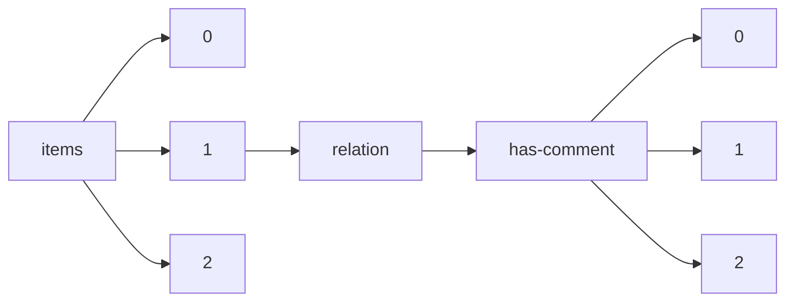

!!! warning "This document is not official Crossref documentation"
# Elements
PATH = items/array/relation/has-comment/array(1)  
Occurs 106 096 times  
{ .annotate }

1. A route to an element, for example:  
   The route "items/array/relation/has-comment/array" corresponds to navigating through the JSON indices as  
   ["items"][0]["relation"]["has-comment"][0]  

## Asserted-by
See more information: [items/array/relation/has-comment/array/asserted-by](asserted-by/index.md)  
Occurs 106 096 timess  
Unique values: 2  

| **Row** | **Value** `String` | **Count** `Int64` |
|--------:|----------------------:|---------------------:|
| **1**   | subject               | 73 332               |
| **2**   | object                | 32 764               |

## Id
See more information: [items/array/relation/has-comment/array/id](id/index.md)  
Occurs 106 096 timess  
Unique values: > 999  

!!! note "Due to current limitations, only the first 1,000 unique values are counted."

| **Row** | **Value** `String`           | **Count** `Int64` |
|--------:|--------------------------------:|---------------------:|
| **1**   | 10.5194/cp-2020-164-AC1         | 8                    |
| **2**   | 10.5194/bg-2021-276-AC1         | 7                    |
| **3**   | 10.5194/tc-2021-175-AC1         | 6                    |
| **4**   | 10.5194/mr-2021-46-AC1          | 6                    |
| **5**   | 10.5194/essd-2022-261-AC1       | 6                    |
| **6**   | 10.5194/acp-2021-981-AC1        | 5                    |
| **7**   | 10.5194/acp-2020-1237-AC1       | 5                    |
| **8**   | 10.5194/gmd-2021-128-AC2        | 5                    |
| **9**   | 10.5194/egusphere-2022-1131-AC1 | 5                    |
| **10**  | 10.5194/gmd-2022-39-AC1         | 5                    |
| ... | ... | ... |

## Id-type
See more information: [items/array/relation/has-comment/array/id-type](id-type/index.md)  
Occurs 106 096 timess  
Unique values: 4  

| **Row** | **Value** `String` | **Count** `Int64` |
|--------:|----------------------:|---------------------:|
| **1**   | doi                   | 106 068              |
| **2**   | uri                   | 26                   |
| **3**   | isbn                  | 1                    |
| **4**   | issn                  | 1                    |

