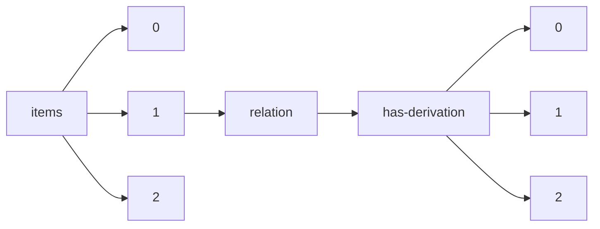

!!! warning "This document is not official Crossref documentation"
# Elements
PATH = items/array/relation/has-derivation/array(1)  
Occurs 11 times  
{ .annotate }

1. A route to an element, for example:  
   The route "items/array/relation/has-derivation/array" corresponds to navigating through the JSON indices as  
   ["items"][0]["relation"]["has-derivation"][0]  

## Asserted-by
See more information: [items/array/relation/has-derivation/array/asserted-by](asserted-by/index.md)  
Occurs 11 timess  
Unique values: 1  

| **Row** | **Value** `String` | **Count** `Int64` |
|--------:|----------------------:|---------------------:|
| **1**   | object                | 11                   |

## Id
See more information: [items/array/relation/has-derivation/array/id](id/index.md)  
Occurs 11 timess  
Unique values: 4  

| **Row** | **Value** `String`         | **Count** `Int64` |
|--------:|------------------------------:|---------------------:|
| **1**   | 10.1575/1912/bco-dmo.789136.1 | 8                    |
| **2**   | 10.33264/rpa.201802-10        | 1                    |
| **3**   | 10.1575/1912/bco-dmo.775229.1 | 1                    |
| **4**   | 10.1575/1912/bco-dmo.794163.1 | 1                    |

## Id-type
See more information: [items/array/relation/has-derivation/array/id-type](id-type/index.md)  
Occurs 11 timess  
Unique values: 1  

| **Row** | **Value** `String` | **Count** `Int64` |
|--------:|----------------------:|---------------------:|
| **1**   | doi                   | 11                   |

