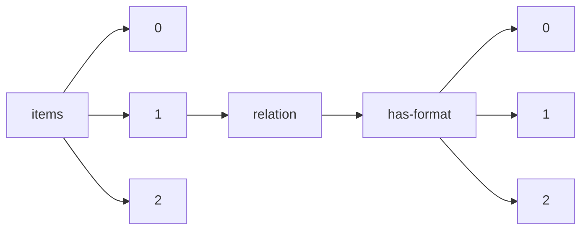

!!! warning "This document is not official Crossref documentation"
# Elements
PATH = items/array/relation/has-format/array(1)  
Occurs 12 times  
{ .annotate }

1. A route to an element, for example:  
   The route "items/array/relation/has-format/array" corresponds to navigating through the JSON indices as  
   ["items"][0]["relation"]["has-format"][0]  

## Asserted-by
See more information: [items/array/relation/has-format/array/asserted-by](asserted-by/index.md)  
Occurs 12 timess  
Unique values: 1  

| **Row** | **Value** `String` | **Count** `Int64` |
|--------:|----------------------:|---------------------:|
| **1**   | subject               | 12                   |

## Id
See more information: [items/array/relation/has-format/array/id](id/index.md)  
Occurs 12 timess  
Unique values: 12  

| **Row** | **Value** `String`            | **Count** `Int64` |
|--------:|---------------------------------:|---------------------:|
| **1**   | 10.9789/2175-5361.rpcfo.v12.7889 | 1                    |
| **2**   | 10.9789/2175-5361.rpcfo.v12.7899 | 1                    |
| **3**   | 10.9789/2175-5361.rpcfo.v12.7880 | 1                    |
| **4**   | 10.9789/2175-5361.rpcfo.v12.8615 | 1                    |
| **5**   | 10.9789/2175-5361.rpcfo.v12.6595 | 1                    |
| **6**   | 10.9789/2175-5361.rpcfo.v12.7814 | 1                    |
| **7**   | 10.9789/2175-5361.rpcfo.v12.7856 | 1                    |
| **8**   | 10.9789/2175-5361.rpcfo.v12.6903 | 1                    |
| **9**   | 10.9789/2175-5361.rpcfo.v12.6555 | 1                    |
| **10**  | 10.9789/2175-5361.rpcfo.v12.8618 | 1                    |
| ... | ... | ... |

## Id-type
See more information: [items/array/relation/has-format/array/id-type](id-type/index.md)  
Occurs 12 timess  
Unique values: 2  

| **Row** | **Value** `String` | **Count** `Int64` |
|--------:|----------------------:|---------------------:|
| **1**   | doi                   | 11                   |
| **2**   | issn                  | 1                    |

