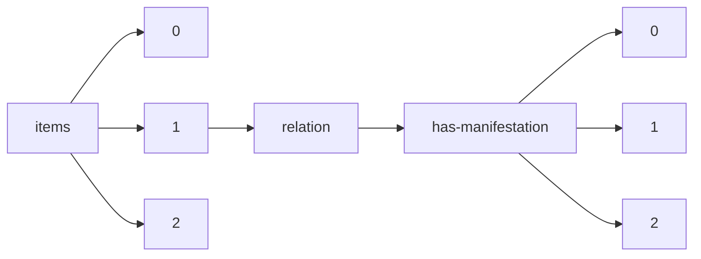

!!! warning "This document is not official Crossref documentation"
# Elements
PATH = items/array/relation/has-manifestation/array(1)  
Occurs 10 754 times  
{ .annotate }

1. A route to an element, for example:  
   The route "items/array/relation/has-manifestation/array" corresponds to navigating through the JSON indices as  
   ["items"][0]["relation"]["has-manifestation"][0]  

## Asserted-by
See more information: [items/array/relation/has-manifestation/array/asserted-by](asserted-by/index.md)  
Occurs 10 754 timess  
Unique values: 2  

| **Row** | **Value** `String` | **Count** `Int64` |
|--------:|----------------------:|---------------------:|
| **1**   | subject               | 10 753               |
| **2**   | object                | 1                    |

## Id
See more information: [items/array/relation/has-manifestation/array/id](id/index.md)  
Occurs 10 754 timess  
Unique values: > 999  

!!! note "Due to current limitations, only the first 1,000 unique values are counted."

| **Row** | **Value** `String` | **Count** `Int64` |
|--------:|----------------------:|---------------------:|
| **1**   | 1-78-2810-g2839       | 2                    |
| **2**   | 38-818-12930-g11742   | 2                    |
| **3**   | 38-771-11781-g11111   | 2                    |
| **4**   | 11-305-2893-g2716     | 2                    |
| **5**   | 1-17-304-g176         | 2                    |
| **6**   | 1-78-2810-g2840       | 2                    |
| **7**   | 9-149-2801-g1567      | 2                    |
| **8**   | 1-288-1640-g1664      | 2                    |
| **9**   | 38-818-12939-g11743   | 2                    |
| **10**  | 22-589-5711-g5442     | 1                    |
| ... | ... | ... |

## Id-type
See more information: [items/array/relation/has-manifestation/array/id-type](id-type/index.md)  
Occurs 10 754 timess  
Unique values: 2  

| **Row** | **Value** `String` | **Count** `Int64` |
|--------:|----------------------:|---------------------:|
| **1**   | other                 | 10 753               |
| **2**   | doi                   | 1                    |

